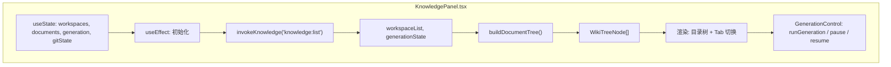
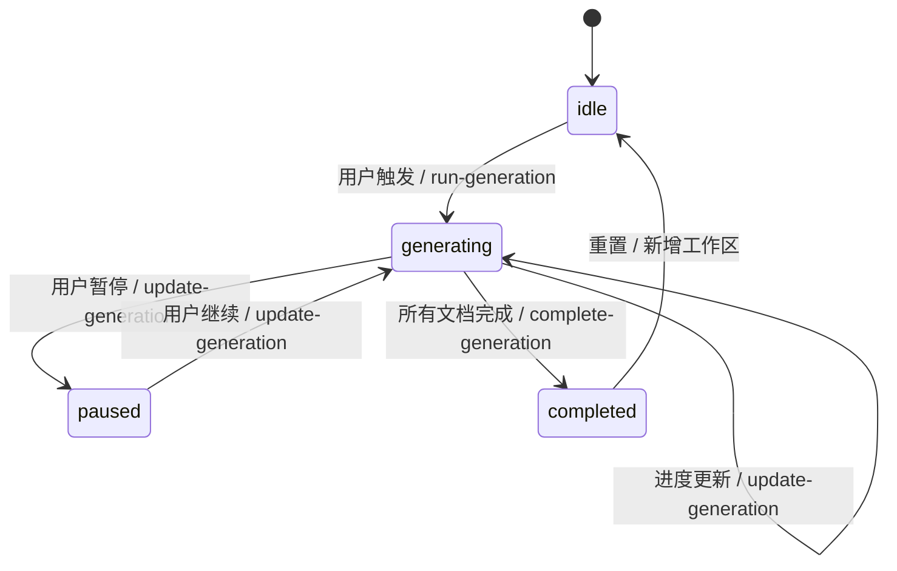
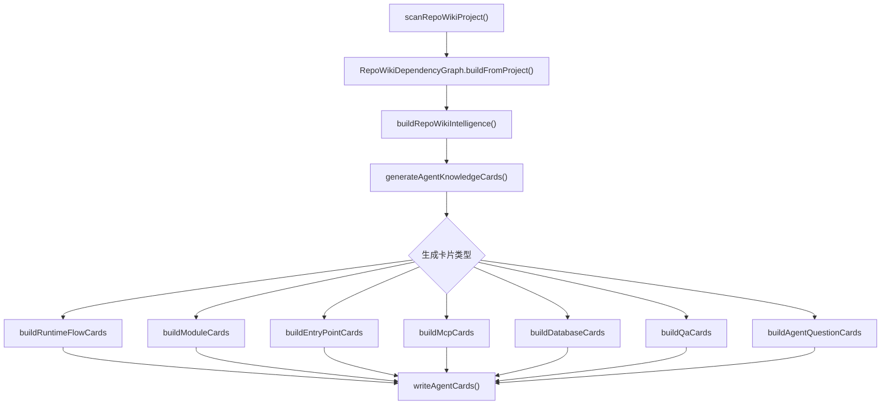

# 知识库前端交互总览

<cite>
**本文引用的文件**

- [src/ui/components/KnowledgePanel.tsx](file://src/ui/components/KnowledgePanel.tsx)
- [scripts/codex-oauth-setup.mjs](file://scripts/codex-oauth-setup.mjs)
- [scripts/sync-claude-code-compat.mjs](file://scripts/sync-claude-code-compat.mjs)
- [src/electron/main.ts](file://src/electron/main.ts)
- [src/ui/App.tsx](file://src/ui/App.tsx)
- [src/ui/components/git/index.ts](file://src/ui/components/git/index.ts)
- [src/electron/libs/knowledge/agent-cards.ts](file://src/electron/libs/knowledge/agent-cards.ts)
- [src/electron/libs/knowledge/repowiki/analyzer.ts](file://src/electron/libs/knowledge/repowiki/analyzer.ts)
- [src/electron/libs/knowledge/repowiki/builder.ts](file://src/electron/libs/knowledge/repowiki/builder.ts)
</cite>

---

## 目录

1. [职责边界](#1-职责边界)
2. [入口与渲染链路](#2-入口与渲染链路)
3. [IPC 调用链](#3-ipc-调用链)
4. [核心数据结构](#4-核心数据结构)
5. [Generation 状态机](#5-generation-状态机)
6. [Git 状态集成](#6-git-状态集成)
7. [文档树构建](#7-文档树构建)
8. [Agent Cards 生成流程](#8-agent-cards-生成流程)
9. [扩展点与改造路径](#9-扩展点与改造路径)
10. [常见失败模式与排障](#10-常见失败模式与排障)

---

## 1. 职责边界

`module-knowledge-ui` 模块负责知识库在桌面端的前端交互层，包含以下职责：

| 职责 | 说明 | 相关文件 |
|------|------|----------|
| 工作区管理 | 添加、移除、同步知识库工作区路径 | [KnowledgePanel.tsx#L193-204](file://src/ui/components/KnowledgePanel.tsx#L193-L204) |
| 文档浏览 | 构建目录树、渲染 Wiki 文档内容 | [KnowledgePanel.tsx#L321-362](file://src/ui/components/KnowledgePanel.tsx#L321-L362) |
| 生成控制 | 触发生成、检查进度、完成确认 | [KnowledgePanel.tsx#L264-273](file://src/ui/components/KnowledgePanel.tsx#L264-L273) |
| Git 状态展示 | 显示当前分支、Commit ID、变更数 | [KnowledgePanel.tsx#L283-297](file://src/ui/components/KnowledgePanel.tsx#L283-L297) |
| IPC 桥接 | 前端 React 与 Electron 主进程通信 | [KnowledgePanel.tsx#L181-191](file://src/ui/components/KnowledgePanel.tsx#L181-L191) |

**不属于本模块的职责：**
- Wiki 内容的 AI 分析（由 `repowiki/analyzer.ts` 负责）
- SQLite 索引写入（由后端 handler 负责）
- Embedding 模型调用（由 `wiki-model-client.ts` 负责）

---

## 2. 入口与渲染链路

### 2.1 入口组件

```
App.tsx
  └── showKnowledgePanel (useState 控制显隐)
        ↓
      KnowledgePanel.tsx  // 模块根组件
```

在 [App.tsx#L342](file://src/ui/App.tsx#L342) 中通过 `showKnowledgePanel` 状态控制面板显隐。用户通过 ActivityRail 或 Sidebar 触发该状态切换。

### 2.2 组件内部结构



### 2.3 挂载点常量

| 常量 | 值 | 用途 |
|------|-----|------|
| `KNOWLEDGE_WORKSPACES_STORAGE_KEY` | `tech-cc-hub:knowledge-panel-workspaces` | 持久化已选工作区 |
| `KNOWLEDGE_HIDDEN_WORKSPACES_STORAGE_KEY` | `tech-cc-hub:knowledge-panel-hidden-workspaces` | 隐藏工作区列表 |
| `KNOWLEDGE_AUTO_UPDATE_STORAGE_KEY` | `tech-cc-hub:knowledge-panel-auto-update` | 自动同步开关 |

---

## 3. IPC 调用链

### 3.1 注册的通道列表

在 [main.ts#L119-130](file://src/electron/main.ts#L119-L130) 中定义了知识库相关的 IPC 通道：

```typescript
const KNOWLEDGE_UI_CHANNELS = [
  "knowledge:list",           // 列出工作区和状态
  "knowledge:sync-workspaces", // 同步工作区
  "knowledge:add-workspace",  // 添加工作区
  "knowledge:remove-workspace", // 移除工作区
  "knowledge:update-generation", // 更新生成状态
  "knowledge:complete-generation", // 完成生成
  "knowledge:run-generation", // 触发生成
  "knowledge:list-documents", // 列出文档
  "knowledge:read-document",  // 读取文档
  "knowledge:overview",       // 获取概览
] as const;
```

### 3.2 调用方式

在 [KnowledgePanel.tsx#L181-191](file://src/ui/components/KnowledgePanel.tsx#L181-L191) 中封装了 `invokeKnowledge` 函数：

```typescript
async function invokeKnowledge<T>(channel: string, payload?: unknown): Promise<T> {
  const electronApi = window.electron as typeof window.electron & {
    invoke?: <Result>(channel: string, ...args: unknown[]) => Promise<Result>;
  };
  if (typeof electronApi.invoke !== "function") {
    throw new Error("当前运行环境不支持知识库 IPC。");
  }
  return electronApi.invoke<T>(channel, payload);
}
```

**注意：** 该函数在非 Electron 环境下会抛出错误，因此浏览器预览模式无法使用知识库功能。

### 3.3 典型调用示例

```typescript
// 列出工作区
const result = await invokeKnowledge<KnowledgeListResponse>("knowledge:list");

// 触发生成
await invokeKnowledge<KnowledgeRunGenerationResponse>("knowledge:run-generation", {
  workspaceKey: "src/ui",
  options: { force: false }
});

// 读取单个文档
const doc = await invokeKnowledge<KnowledgeDocument>("knowledge:read-document", {
  workspaceKey: "src/ui",
  documentId: "overview"
});
```

---

## 4. 核心数据结构

### 4.1 GenerationState

定义在 [KnowledgePanel.tsx#L30-41](file://src/ui/components/KnowledgePanel.tsx#L30-L41)：

```typescript
type GenerationState = {
  status: "idle" | "generating" | "paused" | "completed";
  completed: number;   // 已完成文档数
  total: number;       // 总文档数
  processing: number;  // 处理中文档数（generating 状态时至少为 1）
  failed: number;      // 失败数
  phase?: string;      // 当前阶段描述
  commitId?: string;  // Git Commit ID
  commitShortHash?: string; // 短 Commit ID
  branch?: string | null;   // 分支名
  updatedAt?: number;  // 更新时间戳
};
```

### 4.2 KnowledgeWorkspace

```typescript
type KnowledgeWorkspace = {
  key: string;           // 唯一标识（通常为 cwd 路径）
  cwd?: string;          // 工作目录
  name: string;          // 显示名称
  sessionCount: number;  // 关联会话数
  source: "session" | "manual"; // 来源
  updatedAt: number;     // 更新时间戳
};
```

### 4.3 KnowledgeDocument

```typescript
type KnowledgeDocument = {
  id: string;            // 文档唯一 ID
  workspaceKey: string;  // 所属工作区
  section: string;        // 章节路径，如 "01-设计原则"
  title: string;          // 文档标题
  content: string;        // 文档内容（Markdown）
  sortOrder: number;      // 排序序号
  updatedAt: number;      // 更新时间戳
};
```

### 4.4 WikiTreeNode

构建目录树用的递归结构 [KnowledgePanel.tsx#L70-76](file://src/ui/components/KnowledgePanel.tsx#L70-L76)：

```typescript
type WikiTreeNode = {
  key: string;           // 唯一 key（如 "01-设计原则"）
  title: string;         // 显示标题
  sortOrder: number;     // 排序
  children: WikiTreeNode[]; // 子节点
  documents: KnowledgeDocument[]; // 叶子节点文档
};
```

---

## 5. Generation 状态机

### 5.1 状态转换图



### 5.2 状态规范化

`normalizeGenerationState` 函数（[KnowledgePanel.tsx#L240-262](file://src/ui/components/KnowledgePanel.tsx#L240-L262)）负责：
1. 校验 `status` 必须为四选一
2. 确保 `completed ≤ total`
3. `processing` 仅在 `generating` 时有效，最小值为 1
4. 补全默认时间戳

### 5.3 占位符文档过滤

`isPlaceholderWikiDocument`（[KnowledgePanel.tsx#L309-311](file://src/ui/components/KnowledgePanel.tsx#L309-L311)）会过滤包含以下关键词的文档：
- "后续接入真实"
- "当前没有真实 Repo Wiki 正文"
- "预览壳"
- "真实生成内容写入后"

这些文档不参与目录树构建，不计入生成进度。

---

## 6. Git 状态集成

### 6.1 获取 Git 状态

`resolveHeadFromSnapshot` 函数（[KnowledgePanel.tsx#L283-297](file://src/ui/components/KnowledgePanel.tsx#L283-L297)）从 `UiGitWorkbenchSnapshot` 解析：

```typescript
function resolveHeadFromSnapshot(snapshot: UiGitWorkbenchSnapshot): KnowledgeGitState {
  // 1. 找到当前分支
  const currentBranch = snapshot.status.currentBranch;

  // 2. 找到 HEAD 指向的 commit
  const headCommit = snapshot.history.find((commit) => (
    commit.refs.some((ref) =>
      ref.startsWith("HEAD") ||
      (currentBranch && (ref === currentBranch || ref.endsWith(`/${currentBranch}`)))
    )
  )) ?? snapshot.history[0];

  return {
    loading: false,
    hasGit: true,
    branch: currentBranch,
    commitId: headCommit?.hash ?? "",
    commitShortHash: headCommit?.shortHash ?? headCommit?.hash?.slice(0, 7),
    changedCount: snapshot.status.changedCount,
  };
}
```

### 6.2 Git 绑定到 GenerationState

`applyGitBinding`（[KnowledgePanel.tsx#L299-307](file://src/ui/components/KnowledgePanel.tsx#L299-L307)）将 Git 信息注入到生成状态中，用于记录"生成基于哪个 Commit"。

### 6.3 刷新策略

- 初始快照超时：4000ms（`GIT_SNAPSHOT_TIMEOUT_MS`）
- 定期刷新间隔：30000ms（`GIT_REFRESH_INTERVAL_MS`）
- 仅在 Git 状态真正变化时触发重新渲染（`gitStateEquals` 比较）

---

## 7. 文档树构建

### 7.1 构建算法

`buildDocumentTree`（[KnowledgePanel.tsx#L321-362](file://src/ui/components/KnowledgePanel.tsx#L321-L362)）采用分层 Map 策略：

1. 初始化 `__root__` 虚拟节点
2. 按 `section` 字段切分路径（如 `"01-设计原则/非目标"` → `["01-设计原则", "非目标"]`）
3. 沿路径创建/复用 `WikiTreeNode`
4. 将文档挂载到最深节点
5. 后序遍历排序（同层按 `sortOrder` 升序，中文 locale 排序）

### 7.2 Section 规范化

`sectionParts`（[KnowledgePanel.tsx#L313-319](file://src/ui/components/KnowledgePanel.tsx#L313-L319)）：
- 按 `/` 分割
- trim 空格
- 空 section 默认返回 `["生成文档"]`

---

## 8. Agent Cards 生成流程

### 8.1 整体流程



### 8.2 卡片类型

| 类型 | 用途 | 生成条件 |
|------|------|----------|
| `runtime_flow` | 描述关键调用链路 | `intelligence.runtimeFlows` 有内容 |
| `module` | 模块改造入口 | 最多 18 个模块 |
| `entrypoint` | 启动链路入口 | `intelligence.entrypoints` 有内容 |
| `mcp` | MCP 工具面 | 有 MCP server 或 tool 定义 |
| `database` | SQLite/FTS/Vector | 有数据库表定义 |
| `qa` | 验证命令 | package.json 有 qa/build/test 脚本 |
| `agent_question` | 常见问答 | `intelligence.agentQuestions` 有内容 |

### 8.3 去重与写入

`writeAgentCards`（[agent-cards.ts#L236-265](file://src/electron/libs/knowledge/agent-cards.ts#L236-L265)）：
1. 清空 `agent-cards/` 目录
2. 按 `slugify(card.title).md` 命名
3. 冲突时追加 8 位 hash
4. 写入 `_index.json` 索引文件

### 8.4 验证命令推断

`inferValidation`（[agent-cards.ts#L337-358](file://src/electron/libs/knowledge/agent-cards.ts#L337-L358)）根据文件路径模式推断 QA 命令：

| 文件模式 | 推断命令 |
|----------|----------|
| `/knowledge\|repowiki\|agent-cards/` | `build`, `qa:knowledge`, `qa:knowledge-chat`, `qa:knowledge-ui` |
| `/src\/ui\|tsx\|css/` | `build`, `qa:knowledge-ui` |
| `/src\/electron\|ipc\|mcp/` | `build`, `qa:knowledge` |
| 其他 | `build` |

---

## 9. 扩展点与改造路径

### 9.1 新增 IPC 通道

1. 在 [main.ts#L119-130](file://src/electron/main.ts#L119-L130) 的 `KNOWLEDGE_UI_CHANNELS` 数组添加通道名
2. 在 `knowledge-ui-store.ts` 中实现 handler
3. 在 [KnowledgePanel.tsx](file://src/ui/components/KnowledgePanel.tsx) 中添加调用封装

### 9.2 新增卡片类型

1. 在 `agent-cards.ts` 中定义新的 `AgentKnowledgeCardKind`
2. 实现 `build${Kind}Cards` 函数
3. 在 `generateAgentKnowledgeCards` 中调用并合并结果

### 9.3 自定义文档过滤器

修改 `isPlaceholderWikiDocument`（[KnowledgePanel.tsx#L309-311](file://src/ui/components/KnowledgePanel.tsx#L309-L311)）的正则表达式或添加额外的过滤逻辑。

### 9.4 新增 Generation Phase

1. 定义新的 `phase` 字符串值
2. 确保后端在 `GenerationState.phase` 中返回对应值
3. 前端在 UI 中渲染对应的进度描述

---

## 10. 常见失败模式与排障

### 10.1 IPC 调用失败

**症状：** `invokeKnowledge` 抛出 "当前运行环境不支持知识库 IPC"

**排查步骤：**
1. 确认是否在 Electron 环境中运行（非浏览器预览）
2. 检查 `window.electron.invoke` 是否存在
3. 查看 DevTools Console 是否加载 preload 脚本

### 10.2 工作区状态不更新

**排查：**
1. 检查 LocalStorage 中 `KNOWLEDGE_WORKSPACES_STORAGE_KEY` 的值
2. 确认 `workspaceListEquals` 比较逻辑是否被正确触发
3. 查看 Network 面板确认 IPC 请求是否发出

### 10.3 Git 状态显示异常

**排查：**
1. 检查 GitWorkbenchPanel 是否正确初始化（[git/index.ts](file://src/ui/components/git/index.ts)）
2. 确认 `UiGitWorkbenchSnapshot` 数据格式
3. 检查 `GIT_SNAPSHOT_TIMEOUT_MS` 是否触发超时

### 10.4 生成状态卡在 "generating"

**可能原因：**
- 后端未发送 `knowledge:complete-generation` 事件
- 网络中断导致 WebSocket 消息丢失
- 后端进程崩溃

**排查：**
1. 查看 Electron 主进程日志
2. 检查 `generationStateEquals` 比较是否正常
3. 手动调用 `knowledge:complete-generation` 验证

### 10.5 验证命令参考

```bash
# 检查知识库 IPC 通道是否注册
grep -n "knowledge:" src/electron/main.ts

# 查看 QA 命令定义
grep -n "qa:knowledge" package.json

# 检查生成进度 UI
grep -n "ProgressBlock\|GenerationState" src/ui/components/KnowledgePanel.tsx
```

---

## 附录：关键文件索引

| 文件 | 行数 | 核心导出 |
|------|------|----------|
| [KnowledgePanel.tsx](file://src/ui/components/KnowledgePanel.tsx) | 1674 | `KnowledgePanel` 组件 |
| [agent-cards.ts](file://src/electron/libs/knowledge/agent-cards.ts) | 424 | `generateAgentKnowledgeCards` |
| [analyzer.ts](file://src/electron/libs/knowledge/repowiki/analyzer.ts) | 560 | `RepoWikiAnalyzer.analyze()` |
| [builder.ts](file://src/electron/libs/knowledge/repowiki/builder.ts) | 489 | `RepoWikiBuilder.build()` |
| [main.ts](file://src/electron/main.ts) | 2917 | IPC 通道注册 |