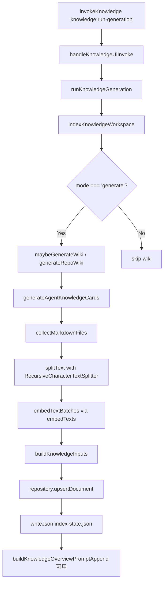

# 知识库前端交互总览

<cite>
**本文引用的文件**

- [src/ui/components/KnowledgePanel.tsx](file://src/ui/components/KnowledgePanel.tsx)
- [src/electron/libs/knowledge/agent-cards.ts](file://src/electron/libs/knowledge/agent-cards.ts)
- [src/electron/libs/knowledge/embedding-client.ts](file://src/electron/libs/knowledge/embedding-client.ts)
- [src/electron/libs/knowledge/knowledge-indexer.ts](file://src/electron/libs/knowledge/knowledge-indexer.ts)
- [src/electron/libs/knowledge/knowledge-model-settings.ts](file://src/electron/libs/knowledge/knowledge-model-settings.ts)
- [src/electron/libs/knowledge/knowledge-overview.ts](file://src/electron/libs/knowledge/knowledge-overview.ts)
- [src/electron/libs/knowledge/knowledge-paths.ts](file://src/electron/libs/knowledge/knowledge-paths.ts)
- [src/electron/libs/knowledge/knowledge-repository.ts](file://src/electron/libs/knowledge/knowledge-repository.ts)
- [src/electron/libs/knowledge/knowledge-types.ts](file://src/electron/libs/knowledge/knowledge-types.ts)
- [src/electron/libs/knowledge/knowledge-ui-store.ts](file://src/electron/libs/knowledge/knowledge-ui-store.ts)
- [src/electron/libs/knowledge/knowledge-utils.ts](file://src/electron/libs/knowledge/knowledge-utils.ts)
- [src/electron/libs/knowledge/repowiki/analyzer.ts](file://src/electron/libs/knowledge/repowiki/analyzer.ts)
- [src/electron/libs/knowledge/repowiki/builder.ts](file://src/electron/libs/knowledge/repowiki/builder.ts)
- [src/electron/libs/knowledge/repowiki/engine.ts](file://src/electron/libs/knowledge/repowiki/engine.ts)
- [src/electron/libs/knowledge/repowiki/exporter.ts](file://src/electron/libs/knowledge/repowiki/exporter.ts)
- [src/electron/libs/knowledge/repowiki/graph.ts](file://src/electron/libs/knowledge/repowiki/graph.ts)
- [src/electron/libs/knowledge/repowiki/intelligence.ts](file://src/electron/libs/knowledge/repowiki/intelligence.ts)
- [src/electron/libs/knowledge/repowiki/prompts.ts](file://src/electron/libs/knowledge/repowiki/prompts.ts)
</cite>

---

## 目录

- [模块职责概述](#模块职责概述)
- [核心数据类型](#核心数据类型)
- [前端入口：KnowledgePanel](#前端入口-knowledgepanel)
- [后端 IPC 入口：handleKnowledgeUiInvoke](#后端-ipc-入口-handleknowledgeuiinvoke)
- [索引主链路：indexKnowledgeWorkspace](#索引主链路-indexknowledgeworkspace)
- [RepoWiki 生成链路](#repowiki-生成链路)
- [Agent Cards 生成链路](#agent-cards-生成链路)
- [聊天注入：buildKnowledgeOverviewPromptAppend](#聊天注入-buildknowledgeoverviewpromptappend)
- [运行时刷新与重启边界](#运行时刷新与重启边界)
- [失败模式与排障步骤](#失败模式与排障步骤)
- [扩展点与常见改造路径](#扩展点与常见改造路径)
- [Agent 改代码地图](#agent-改代码地图)

---

## 模块职责概述

`module-knowledge-ui` 是知识库模块的前端交互层，负责：

1. **工作区管理**：持久化工作区列表（localStorage + SQLite `knowledge_ui_workspaces` 表）
2. **生成进度可视化**：实时展示 RepoWiki 生成、embedding 和索引写入的阶段与百分比
3. **文档树渲染**：将生成的 Markdown 按目录结构展示为可折叠树
4. **Git 绑定**：记录生成快照时的 commit/branch，便于溯源
5. **聊天注入**：将索引状态以 `<knowledge_overview>` XML 片段注入到 Agent system prompt

该模块不直接做 embedding 或 LLM 调用，而是通过 IPC 触发 `knowledge-ui-store` 中的 `runKnowledgeGeneration()`，由 `knowledge-indexer` 编排整个流水线。

**章节来源**：[src/electron/libs/knowledge/knowledge-ui-store.ts#L319-L405](file://src/electron/libs/knowledge/knowledge-ui-store.ts#L319-L405)

---

## 核心数据类型

### 关键 TypeScript 类型

| 类型名 | 定义位置 | 用途 |
|--------|----------|------|
| `KnowledgeUiWorkspace` | knowledge-ui-store.ts#L12 | 工作区元信息 |
| `KnowledgeUiGeneration` | knowledge-ui-store.ts#L21 | 生成状态（status/phase/progress） |
| `KnowledgeUiDocument` | knowledge-ui-store.ts#L34 | 单篇文档（section/title/content） |
| `KnowledgeSourceKind` | knowledge-types.ts#L1 | 文档来源：`repowiki` / `agent_card` / `memory` |
| `EmbeddingModelSettings` | knowledge-types.ts#L99 | embedding 模型配置（baseURL/apiKey/dimension/batchSize） |
| `WikiModelSettings` | knowledge-types.ts#L109 | Wiki LLM 配置（costTier/maxInputTokens/maxOutputTokens） |

### SQLite 表结构

**知识库运行时数据库**（`knowledge.sqlite`）

| 表名 | 用途 | 关键列 |
|------|------|--------|
| `knowledge_documents` | 文档主表 | `id, workspace_scope, source_kind, source_path, title, content_hash` |
| `knowledge_chunks` | 分块表 | `id, document_id, content, chunk_index, token_estimate, embedding_model` |
| `knowledge_chunks_fts` | FTS5 虚拟表 | `title, content, source_path, tags` |
| `knowledge_chunk_vectors` | vec0 向量表 | `chunk_rowid, embedding float[N]` |

**UI 状态数据库**（`knowledge-ui.sqlite`）

| 表名 | 用途 |
|------|------|
| `knowledge_ui_workspaces` | 工作区列表 |
| `knowledge_ui_generation` | 各工作区的生成状态 |
| `knowledge_ui_documents` | 各工作区的文档快照 |

**章节来源**：[src/electron/libs/knowledge/knowledge-repository.ts#L83-L137](file://src/electron/libs/knowledge/knowledge-repository.ts#L83-L137)，[src/electron/libs/knowledge/knowledge-ui-store.ts#L98-L139](file://src/electron/libs/knowledge/knowledge-ui-store.ts#L98-L139)

---

## 前端入口：KnowledgePanel

### 组件职责

`KnowledgePanel.tsx`（1680 行）是知识库 UI 的根组件，挂在 Electron renderer 进程。它不持有任何全局 store 状态，而是通过 `invokeKnowledge<T>()` 函数直接调用 IPC。

### 关键 IPC 调用

```typescript
// 调用示例（KnowledgePanel.tsx#L180-189）
async function invokeKnowledge<T>(channel: string, payload?: unknown): Promise<T> {
  return electronApi.invoke<T>(channel, payload);
}
```

| Channel | 用途 | 返回类型 |
|---------|------|----------|
| `knowledge:list` | 加载工作区列表和生成状态 | `KnowledgeListResponse` |
| `knowledge:run-generation` | 触发一次完整的知识库生成 | `KnowledgeRunGenerationResponse` |
| `knowledge:read-documents` | 读取指定工作区的文档树 | `KnowledgeDocumentsResponse` |

### 状态管理

```typescript
// 本地状态（KnowledgePanel.tsx 内部）
const [workspaces, setWorkspaces] = useState<KnowledgeWorkspace[]>([]);
const [generations, setGenerations] = useState<Record<string, GenerationState>>({});
const [openTabs, setOpenTabs] = useState<KnowledgeOpenTab[]>([]);
```

生成状态通过 `setInterval` + `invokeKnowledge('knowledge:list')` 轮询刷新，间隔由 `GIT_REFRESH_INTERVAL_MS = 30_000` 控制。

### 文档树构建

`buildDocumentTree()` 函数将 `KnowledgeUiDocument[]` 按 `section` 路径前缀递归分组为 `WikiTreeNode` 树。section 形如 `"项目概述/快速开始"` 会展开为两级目录。

**章节来源**：[src/ui/components/KnowledgePanel.tsx#L180-L189](file://src/ui/components/KnowledgePanel.tsx#L180-L189)，[src/ui/components/KnowledgePanel.tsx#L326-L367](file://src/ui/components/KnowledgePanel.tsx#L326-L367)

---

## 后端 IPC 入口：handleKnowledgeUiInvoke

### 函数签名

```typescript
// knowledge-ui-store.ts#L323
export function handleKnowledgeUiInvoke(
  channel: string,
  payload: unknown,
  dbPath: string
): Promise<unknown>
```

### 支持的 channel 处理

| Channel | Handler 方法 | 说明 |
|---------|-------------|------|
| `knowledge:list` | `store.list()` | 返回 workspaces + generations |
| `knowledge:run-generation` | `runKnowledgeGeneration()` | 启动 `indexKnowledgeWorkspace()` |
| `knowledge:read-documents` | `readWorkspaceInputs()` | 读取 `knowledge_ui_documents` 表 |
| `knowledge:sync-session` | `store.syncSessionWorkspaces()` | 从当前 Electron session 同步工作区 |

### 状态持久化边界

- `knowledge-ui-store` 的 SQLite 在 `KnowledgeUiStore` 构造函数中创建，不随 IPC 重启销毁
- 变更 `channel` 名称或 `payload` 结构会导致旧客户端调用失败（向后不兼容）

**章节来源**：[src/electron/libs/knowledge/knowledge-ui-store.ts#L323-L405](file://src/electron/libs/knowledge/knowledge-ui-store.ts#L323-L405)

---

## 索引主链路：indexKnowledgeWorkspace

### 整体流程



### 各阶段说明

1. **路径解析**：`resolveKnowledgeWorkspacePaths(workspaceRoot, appDataPath)` 生成所有子目录路径，包含 `.tech/repowiki/zh/content`、`agent-cards`、`appDataWorkspaceRoot` 等。

2. **RepoWiki 生成**：调用 `generateRepoWiki()`，这是一个 Python 子进程（通过 `pythonExecutable()` 执行 `run-repowiki.py`）。

3. **Agent Cards 生成**：调用 `generateAgentKnowledgeCards()`，在内存中扫描 `.tech/repowiki` 目录下的文件，生成结构化 Markdown 卡牌。

4. **Chunk 分割**：使用 `@langchain/textsplitters` 的 `RecursiveCharacterTextSplitter`，默认 `chunkSize=1800` tokens，`chunkOverlap=220`。

5. **Embedding**：通过 `embedTextBatches()` 发送到配置的 embedding API（baseURL + apiKey），最多重试 3 次，单批 `batchSize=16`。

6. **写入**：通过 `repository.upsertDocument()` 写入 `knowledge_documents` + `knowledge_chunks` + FTS + vec0 表。

### 配置来源

模型配置从 `loadApiConfigSettings()` 读取 `ApiConfigProfile`，过滤 `isUsableProfile()`（`enabled && apiKey && baseURL` 齐全）的 profile，优先取设置了 `embeddingModel` 的作为 embedding profile，设置了 `wikiModel` 的作为 wiki profile。

**章节来源**：[src/electron/libs/knowledge/knowledge-indexer.ts#L170-L352](file://src/electron/libs/knowledge/knowledge-indexer.ts#L170-L352)

---

## RepoWiki 生成链路

### 链路结构

```
generateRepoWiki (engine.ts)
  └── runVendoredRepoWiki (spawns python)
        ├── findRepoRoot() → third_party/repowiki
        ├── args: --workspace, --output, --model, --api-base, --language, --concurrency
        └── parseRunnerJson() ← stdout 最后一行有效 JSON
```

### 并发控制

```typescript
// engine.ts#L54-59
function resolveRepoWikiConcurrency(wiki: WikiModelSettings): string {
  const configured = Number(process.env.TECH_CC_HUB_REPOWIKI_CONCURRENCY || 0);
  if (configured > 0) return String(Math.min(12, configured));
  return wiki.costTier === "free" ? "2" : "6";
}
```

### 输出产物

- `paths.repowikiRoot/content/*.md` — 各页面 Markdown
- `paths.repowikiRoot/_sidebar.md` — 侧边导航

**章节来源**：[src/electron/libs/knowledge/repowiki/engine.ts#L215-L279](file://src/electron/libs/knowledge/repowiki/engine.ts#L215-L279)

---

## Agent Cards 生成链路

### 生成卡片种类

| 卡片类型 | 生成函数 | 内容 |
|----------|----------|------|
| `runtime_flow` | `buildRuntimeFlowCards()` | 关键运行链路及步骤 |
| `module` | `buildModuleCards()` | 按模块分组的改造入口 |
| `entrypoint` | `buildEntryPointCards()` | 启动链路入口文件 |
| `mcp` | `buildMcpCards()` | MCP server/tool 定义 |
| `database` | `buildDatabaseCards()` | SQLite/FTS/vec 表 |
| `qa` | `buildQaCards()` | npm 验证脚本 |
| `agent_question` | `buildAgentQuestionCards()` | 常见问答对 |

### 依赖子模块

- `scanRepoWikiProject()` — 扫描 workspace 文件树
- `RepoWikiDependencyGraph.buildFromProject()` — PageRank 排序
- `buildRepoWikiIntelligence()` — 提取 signals、scripts、ipcChannels

### 输出位置

`paths.agentCardsDir`（`.tech/repowiki/agent-cards/`），每个卡片一个 `.md` 文件 + `_index.json` 索引。

**章节来源**：[src/electron/libs/knowledge/agent-cards.ts#L50-L71](file://src/electron/libs/knowledge/agent-cards.ts#L50-L71)

---

## 聊天注入：buildKnowledgeOverviewPromptAppend

### 注入时机与位置

该函数在每次 Agent 会话初始化时被调用（由 runner 调用），返回值直接拼接到 system prompt 末尾。

### 输出格式

```xml
<knowledge_overview enabled="true" scope="workspace:tech-cc-hub" knowledge_count="42" memory_count="8">
  <agent_cards count="18">
    <card title="..." path="..." />
  </agent_cards>
  <repowiki>
    <category name="repowiki" count="24">
      <entry title="..." path="..." />
    </category>
  </repowiki>
  <memory>
    <category name="..." count="5">
      <entry title="..." scope="..." tags="..." />
    </category>
  </memory>
</knowledge_overview>
```

### Source of Truth

- 读取 `knowledge.sqlite`（`knowledge_db_path`）中的 `knowledge_documents` 表
- 从 `knowledge-repository.buildOverview()` 获取分类后的 entries

**章节来源**：[src/electron/libs/knowledge/knowledge-overview.ts#L30-L119](file://src/electron/libs/knowledge/knowledge-overview.ts#L30-L119)

---

## 运行时刷新与重启边界

### 不需要重启的操作

| 场景 | 刷新方式 |
|------|----------|
| 工作区列表更新 | 前端轮询 `knowledge:list` |
| 生成进度更新 | 前端每 30s 轮询 |
| 文档内容查看 | 读 SQLite，不重启 |
| 新 workspace 接入 | 写 `knowledge_ui_workspaces` |

### 需要重启或重刷的操作

| 场景 | 操作 |
|------|------|
| embedding 模型切换 | 修改 `api-config.json` 中的 embeddingModel 后需重新触发 `run-generation` |
| wiki 模型切换 | 同上 |
| 表结构变更 | 当前版本通过 `ensureGenerationPhaseColumn()` 等内联迁移，不需手动操作 |
| python 路径变更 | 修改 `TECH_CC_HUB_PYTHON` 环境变量后需重启 Electron |

### 前后端桥接点

- **Renderer → Main**：通过 `electronApi.invoke(channel, payload)` 调用 IPC
- **Main → Renderer**：前端轮询 `knowledge:list`（无主动推送）
- **Main → Python**：子进程 `spawn`，通过 stdout 逐行解析 JSON progress 事件

---

## 失败模式与排障步骤

### 常见错误及排查

| 错误信息 | 原因 | 排查命令/文件 |
|----------|------|--------------|
| `missing-embedding-model` | embeddingModel 未配置 | 检查 `settings.json` profiles 中是否有 embeddingModel 字段 |
| `sqlite-vec-unavailable` | sqlite-vec 扩展加载失败 | 确认 better-sqlite3 版本及 native 模块编译 |
| `embedding dimension mismatch` | 模型返回向量维度与配置不符 | 检查 `knowledge-model-settings.ts` 的 `KNOWN_EMBEDDING_DIMENSIONS` |
| `RepoWiki runner 没有返回 JSON` | Python 脚本异常或路径错误 | 手动执行 `python scripts/knowledge/run-repowiki.py --help` 验证 |
| `当前运行环境不支持知识库 IPC` | 非 Electron 环境运行 | 确认在 Electron renderer 内执行 |

### 排障检查清单

1. 检查 `appDataPath` 下的 `knowledge/*.sqlite` 是否存在且可读
2. 查看 `.tech/reports/index-state.json` 的 `success` 和 `error` 字段
3. 确认 embedding API 可达：`curl -X POST <baseURL>/embeddings -H "Authorization: Bearer <key>"`
4. 检查 `third_party/repowiki` 目录是否完整

**章节来源**：[src/electron/libs/knowledge/knowledge-indexer.ts#L192-L199](file://src/electron/libs/knowledge/knowledge-indexer.ts#L192-L199)，[src/electron/libs/knowledge/embedding-client.ts#L22-L34](file://src/electron/libs/knowledge/embedding-client.ts#L22-L34)

---

## 扩展点与常见改造路径

### 扩展点 1：新增文档来源类型

```typescript
// knowledge-types.ts#L1 新增 SourceKind
export type KnowledgeSourceKind = "repowiki" | "agent_card" | "memory" | "manual" | "source";

// knowledge-indexer.ts#L119-125 需要在 sourceKinds 循环中处理新类型
```

### 扩展点 2：自定义 Embedding 模型

在 `knowledge-model-settings.ts` 的 `KNOWN_EMBEDDING_DIMENSIONS` 中新增 model pattern，或在 `settings.json` 中配置 `embeddingDimension` 覆盖自动推断。

### 扩展点 3：新增卡片种类

在 `agent-cards.ts` 新增 `buildXxxCards()` 函数，在 `generateAgentKnowledgeCards()` 中合并到结果数组：

```typescript
const cards = dedupeCards([
  ...buildRuntimeFlowCards(intelligence),
  // ... 新增 buildXxxCards(intelligence)
]);
```

### 扩展点 4：自定义 Wiki 生成阶段

在 `engine.ts` 的 `parseRepoWikiProgress()` 中识别新的 progress message pattern，扩展 `RepoWikiProgressEvent.stage` 联合类型。

---

## Agent 改代码地图

### 先读文件（按优先级）

| 优先级 | 文件 | 原因 |
|--------|------|------|
| 1 | `knowledge-indexer.ts` | 理解完整流水线的入口和阶段 |
| 2 | `knowledge-ui-store.ts` | 理解 IPC 入口和状态持久化 |
| 3 | `KnowledgePanel.tsx` | 理解前端 UI 交互和数据流 |
| 4 | `knowledge-repository.ts` | 理解 SQLite schema 和检索 API |
| 5 | `repowiki/engine.ts` | 理解 Python 子进程调用方式 |

### 关键符号与位置

| 符号 | 文件:行号 | 说明 |
|------|-----------|------|
| `indexKnowledgeWorkspace` | knowledge-indexer.ts#L170 | 主索引函数 |
| `handleKnowledgeUiInvoke` | knowledge-ui-store.ts#L323 | IPC 分发入口 |
| `invokeKnowledge` | KnowledgePanel.tsx#L180 | 前端 IPC 调用封装 |
| `embedTexts` | embedding-client.ts#L83 | Embedding API 调用 |
| `generateRepoWiki` | repowiki/engine.ts#L215 | Wiki 生成入口 |
| `generateAgentKnowledgeCards` | agent-cards.ts#L50 | Agent Cards 生成入口 |
| `buildKnowledgeOverviewPromptAppend` | knowledge-overview.ts#L30 | 聊天注入函数 |
| `resolveKnowledgeModelSettings` | knowledge-model-settings.ts#L49 | 模型配置解析 |

### IPC Channel 速查

| Channel | 方向 | 功能 |
|---------|------|------|
| `knowledge:list` | renderer→main | 获取工作区和生成状态 |
| `knowledge:run-generation` | renderer→main | 触发完整生成流程 |
| `knowledge:read-documents` | renderer→main | 读取文档树 |
| `knowledge:sync-session` | renderer→main | 同步会话工作区 |

### 修改入口速查

| 改动目标 | 优先修改文件 | 注意事项 |
|----------|-------------|---------|
| UI 样式/交互 | `KnowledgePanel.tsx` | 改后需重启 Electron dev server |
| IPC 参数/返回值 | `knowledge-ui-store.ts` 的 `handleKnowledgeUiInvoke` | 需同步前端类型定义 |
| 索引流程 | `knowledge-indexer.ts` | 需同步 `knowledge-repository.ts` |
| 模型配置 | `knowledge-model-settings.ts` | 需同步 `knowledge-types.ts` |
| Wiki 生成逻辑 | `repowiki/engine.ts` 或 `repowiki/analyzer.ts` | 可能影响 Python 子进程参数 |
| 卡片生成规则 | `agent-cards.ts` | 输出到 `.tech/repowiki/agent-cards/` |

### 验证命令

```bash
# 触发一次完整生成（Electron 控制台手动调用）
await window.electron.invoke('knowledge:run-generation', { workspaceKey: '/path/to/workspace' })

# 验证 SQLite schema
sqlite3 ~/.local/share/tech-cc-hub/knowledge/<hash>/knowledge.sqlite ".schema"

# 检查 index-state.json
cat .tech/reports/index-state.json | jq

# 验证 embedding API 连通性（手动测试）
curl -X POST https://api.openai.com/v1/embeddings \
  -H "Authorization: Bearer $OPENAI_API_KEY" \
  -d '{"model": "text-embedding-3-small", "input": "test"}'

# 验证 Python 子进程路径
python scripts/knowledge/run-repowiki.py --help
```

### 常见回归风险

| 风险 | 表现 | 缓解 |
|------|------|------|
| embedding 模型配置错误 | `embedding dimension mismatch` | 添加 unit test 验证已知 model 的 dimension |
| workspace 路径解析错误 | 生成文件写到错误目录 | 单元测试覆盖 `resolveKnowledgeWorkspacePaths` |
| IPC channel 名称不一致 | 前端报 "channel not found" | 使用 shared 常量而非 hardcode 字符串 |
| SQLite WAL 锁冲突 | 文档读取为空 | 确保 `repository.close()` 在 finally 中调用 |
| Python 路径不可用 | `spawn` 报ENOENT | 在 CI 中验证 `pythonExecutable()` 解析 |