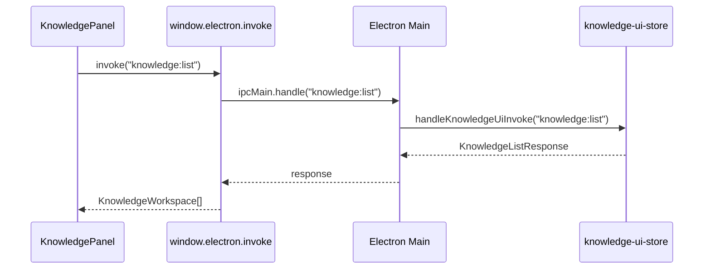

# 知识库面板交互

## 目录

- [概述与职责](#概述与职责)
- [核心数据类型](#核心数据类型)
- [入口与状态控制](#入口与状态控制)
- [IPC 调用链](#ipc-调用链)
- [组件结构与渲染逻辑](#组件结构与渲染逻辑)
- [Git 状态绑定](#git-状态绑定)
- [工作区与文档管理](#工作区与文档管理)
- [修改功能时的步骤](#修改功能时的步骤)
- [回归验证方式](#回归验证方式)
- [常见失败模式与排障](#常见失败模式与排障)

---

<cite>

**本文引用的文件**

- [src/ui/components/KnowledgePanel.tsx](file://src/ui/components/KnowledgePanel.tsx)
- [src/ui/App.tsx](file://src/ui/App.tsx)
- [src/ui/components/git/index.ts](file://src/ui/components/git/index.ts)
- [src/electron/main.ts](file://src/electron/main.ts)
- [src/ui/components/ActivityRail.tsx](file://src/ui/components/ActivityRail.tsx)
- [src/ui/components/ActivityWorkspaceTabs.tsx](file://src/ui/components/ActivityWorkspaceTabs.tsx)
- [src/ui/components/AionWorkspacePreviewPane.tsx](file://src/ui/components/AionWorkspacePreviewPane.tsx)
- [src/ui/components/BrowserWorkbenchPage.tsx](file://src/ui/components/BrowserWorkbenchPage.tsx)
- [src/ui/components/ComposerContextCard.tsx](file://src/ui/components/ComposerContextCard.tsx)

</cite>

---

## 概述与职责

`KnowledgePanel.tsx` 是 tech-cc-hub 知识库功能的核心 UI 组件，负责：

1. **工作区管理** — 列出、添加、移除知识库工作区，支持会话来源和手动添加两种类型
2. **文档生成状态** — 展示正在生成中的 Wiki 文档进度（idle / generating / paused / completed）
3. **文档树构建** — 将文档按 section 路径构建为可折叠的树形结构
4. **Git 状态绑定** — 在生成状态中关联当前 Git commit 信息（branch、commitHash、changedCount）
5. **本地存储持久化** — 通过 localStorage 记住用户隐藏的工作区和自动更新偏好

入口位于 `App.tsx` 第 23 行，通过 `showKnowledgePanel` 状态控制显示/隐藏，由 ActivityRail 右侧操作区触发。

---

## 核心数据类型

### GenerationState

描述文档生成进度，在 `KnowledgePanel.tsx` 第 30-41 行定义：

```typescript
type GenerationState = {
  status: GenerationStatus;  // "idle" | "generating" | "paused" | "completed"
  completed: number;
  total: number;
  processing: number;
  failed: number;
  phase?: string;
  commitId?: string;
  commitShortHash?: string;
  branch?: string | null;
  updatedAt?: number;
};
```

[章节来源](file://src/ui/components/KnowledgePanel.tsx#L30-L41)

### KnowledgeWorkspace

知识库工作区实体，第 43-50 行定义：

```typescript
type KnowledgeWorkspace = {
  key: string;           // 工作区唯一标识（cwd 路径规范化后）
  cwd?: string;
  name: string;          // 显示名称
  sessionCount: number;
  source: "session" | "manual";
  updatedAt: number;
};
```

[章节来源](file://src/ui/components/KnowledgePanel.tsx#L43-L50)

### KnowledgeDocument

Wiki 文档实体，第 52-60 行定义：

```typescript
type KnowledgeDocument = {
  id: string;
  workspaceKey: string;
  section: string;       // 树形路径，如 "概述/快速上手"
  title: string;
  content: string;
  sortOrder: number;
  updatedAt: number;
};
```

[章节来源](file://src/ui/components/KnowledgePanel.tsx#L52-L60)

### WikiTreeNode

构建后的文档树节点，第 70-76 行定义：

```typescript
type WikiTreeNode = {
  key: string;
  title: string;
  sortOrder: number;
  children: WikiTreeNode[];
  documents: KnowledgeDocument[];
};
```

[章节来源](file://src/ui/components/KnowledgePanel.tsx#L70-L76)

---

## 入口与状态控制

### App.tsx 中的入口

```typescript
// src/ui/App.tsx:342
const [showKnowledgePanel, setShowKnowledgePanel] = useState(false);
```

在 `App` 组件的 JSX 中，通过 `ActivityRail` 的回调或快捷操作触发 `setShowKnowledgePanel(true)` 打开面板。

### KnowledgePanel Props

```typescript
// src/ui/components/KnowledgePanel.tsx:23-26
type KnowledgePanelProps = {
  onBack: () => void;                    // 关闭面板回调
  onOpenSettings?: (pageId?: SettingsPageId) => void;
};
```

---

## IPC 调用链

KnowledgePanel 通过 Electron IPC 与后端通信，通道定义在 `main.ts` 第 119-130 行：

```typescript
const KNOWLEDGE_UI_CHANNELS = [
  "knowledge:list",              // 列出所有工作区
  "knowledge:sync-workspaces",    // 同步工作区
  "knowledge:add-workspace",      // 添加工作区
  "knowledge:remove-workspace",  // 移除工作区
  "knowledge:update-generation", // 更新生成状态
  "knowledge:complete-generation", // 生成完成
  "knowledge:run-generation",     // 触发生成
  "knowledge:list-documents",    // 列出文档
  "knowledge:read-document",     // 读取文档内容
  "knowledge:overview",          // 获取概览
] as const;
```

[章节来源](file://src/electron/main.ts#L119-L130)

### invokeKnowledge 封装

`KnowledgePanel.tsx` 第 181-191 行封装了 IPC 调用：

```typescript
async function invokeKnowledge<T>(channel: string, payload?: unknown): Promise<T> {
  const electronApi = window.electron as typeof window.electron & {
    invoke?: <Result>(channel: string, ...args: unknown[]) => Promise<Result>;
  };
  if (typeof electronApi.invoke !== "function") {
    throw new Error("当前运行环境不支持知识库 IPC。");
  }
  return payload === undefined
    ? electronApi.invoke<T>(channel)
    : electronApi.invoke<T>(channel, payload);
}
```

[章节来源](file://src/ui/components/KnowledgePanel.tsx#L181-L191)

### 调用时序图



---

## 组件结构与渲染逻辑

### buildDocumentTree 函数

核心文档树构建逻辑在 `KnowledgePanel.tsx` 第 321-362 行：

1. 初始化 `__root__` 节点
2. 遍历文档，按 `/` 分隔 section 构建层级路径
3. 按 sortOrder 和 title 排序子节点和文档

```typescript
function buildDocumentTree(documents: KnowledgeDocument[]): WikiTreeNode[] {
  const root: WikiTreeNode = {
    key: "__root__",
    title: "",
    sortOrder: 0,
    children: [],
    documents: [],
  };
  // ... 按 section 路径递归构建节点
  return root.children;
}
```

[章节来源](file://src/ui/components/KnowledgePanel.tsx#L321-L362)

### normalizeGenerationState 函数

规范化后端返回的生成状态，第 240-262 行：

- 校验 status 必须是有效枚举值
- 确保 completed/total/failed 为非负整数
- 处理缺失字段的默认值

```typescript
function normalizeGenerationState(value: unknown): GenerationState | undefined {
  // 校验 status 枚举
  if (!isGenerationStatus(raw.status)) return undefined;
  // 规范化数值字段
  const total = Number.isFinite(raw.total) && raw.total && raw.total > 0 ? Math.floor(raw.total) : 0;
  // ... 构建完整状态
}
```

[章节来源](file://src/ui/components/KnowledgePanel.tsx#L240-L262)

---

## Git 状态绑定

### resolveHeadFromSnapshot

从 Git Workbench snapshot 提取 HEAD 提交信息，第 283-297 行：

```typescript
function resolveHeadFromSnapshot(snapshot: import("../types").UiGitWorkbenchSnapshot): KnowledgeGitState {
  const currentBranch = snapshot.status.currentBranch;
  const headCommit = snapshot.history.find((commit) => (
    commit.refs.some((ref) => ref.startsWith("HEAD") || ...)
  )) ?? snapshot.history[0];
  return {
    loading: false,
    hasGit: true,
    branch: currentBranch,
    commitId: headCommit?.hash ?? "",
    commitShortHash: headCommit?.shortHash ?? (headCommit?.hash ? headCommit.hash.slice(0, 7) : ""),
    changedCount: snapshot.status.changedCount,
  };
}
```

[章节来源](file://src/ui/components/KnowledgePanel.tsx#L283-L297)

### applyGitBinding

将 Git 状态绑定到生成状态，第 299-307 行：

```typescript
function applyGitBinding(state: GenerationState, git?: KnowledgeGitState): GenerationState {
  return {
    ...state,
    commitId: git?.commitId || state.commitId,
    commitShortHash: git?.commitShortHash || state.commitShortHash,
    branch: git?.branch ?? state.branch,
    updatedAt: Date.now(),
  };
}
```

[章节来源](file://src/ui/components/KnowledgePanel.tsx#L299-L307)

---

## 工作区与文档管理

### 本地存储键

`KnowledgePanel.tsx` 第 120-123 行定义存储键：

```typescript
const KNOWLEDGE_WORKSPACES_STORAGE_KEY = "tech-cc-hub:knowledge-panel-workspaces";
const KNOWLEDGE_HIDDEN_WORKSPACES_STORAGE_KEY = "tech-cc-hub:knowledge-panel-hidden-workspaces";
const KNOWLEDGE_AUTO_UPDATE_STORAGE_KEY = "tech-cc-hub:knowledge-panel-auto-update";
```

[章节来源](file://src/ui/components/KnowledgePanel.tsx#L120-L123)

### 存储读取函数

- `readStoredWorkspacePaths()` — 第 193-204 行，读取已保存工作区路径列表
- `readStoredWorkspaceKeySet(storageKey)` — 第 206-217 行，以 Set 形式读取工作区 key 集合
- `readStoredBooleanRecord(storageKey)` — 第 219-234 行，读取布尔值记录（如隐藏状态）

### 工作区 key 规范化

```typescript
function normalizeWorkspaceKey(cwd?: string | null): string {
  return cwd?.trim() ?? "";
}
```

用于统一工作区标识，处理空格和大小写问题。

[章节来源](file://src/ui/components/KnowledgePanel.tsx#L144-L146)

---

## 修改功能时的步骤

### 1. 修改生成状态处理

如果需要调整生成状态的 UI 展示：

1. 修改 `GenerationState` 类型定义（第 30-41 行）
2. 更新 `normalizeGenerationState` 校验逻辑（第 240-262 行）
3. 更新 `generationStateEquals` 比较逻辑（第 387-401 行）

### 2. 添加新的 IPC 通道

1. 在 `main.ts` 的 `KNOWLEDGE_UI_CHANNELS` 数组添加通道名（第 119-130 行）
2. 在 `libs/knowledge/knowledge-ui-store.js` 实现 handler
3. 在 `KnowledgePanel.tsx` 添加 `invokeKnowledge` 调用

### 3. 修改文档树结构

1. 调整 `WikiTreeNode` 类型定义（第 70-76 行）
2. 更新 `buildDocumentTree` 构建逻辑（第 321-362 行）
3. 更新 `sectionParts` 分割逻辑（第 313-319 行）

---

## 回归验证方式

### 单元验证点

| 功能 | 验证点 |
|------|--------|
| 状态规范化 | `normalizeGenerationState` 对非法 status 返回 undefined |
| 工作区 key | `normalizeWorkspaceKey(" /path ")` 返回 `"path"` |
| 文档树构建 | `buildDocumentTree([])` 返回空数组 |
| Git 状态绑定 | `applyGitBinding` 正确合并 commitId 和 branch |

### 集成验证点

1. **IPC 通道可用性** — 调用 `invokeKnowledge("knowledge:list")` 返回工作区列表
2. **Git 快照解析** — 传入有效 snapshot 时正确提取 HEAD commit
3. **本地存储持久化** — 刷新页面后隐藏的工作区保持隐藏状态

### 手动测试清单

- [ ] 打开知识库面板，列出已同步的工作区
- [ ] 触发文档生成，观察 progress indicator 更新
- [ ] 查看生成完成后的文档树是否正确折叠/展开
- [ ] 切换 Git branch，验证面板中 commit hash 更新
- [ ] 隐藏工作区后刷新页面，确认状态保持

---

## 常见失败模式与排障

### 1. IPC 通道未注册

**症状**：调用 `invokeKnowledge` 时抛出 `"当前运行环境不支持知识库 IPC"`。

**排查**：
- 确认 Electron 环境而非浏览器预览模式
- 检查 `main.ts` 中 `KNOWLEDGE_UI_CHANNELS` 是否包含该通道
- 确认 `handleKnowledgeUiInvoke` 正确路由到 handler

### 2. 文档树显示为空

**症状**：工作区有文档但树结构不显示。

**排查**：
- 检查 `buildDocumentTree` 是否正确处理空 section（默认 "生成文档"）
- 确认 `isPlaceholderWikiDocument` 没有错误过滤文档（第 309-311 行）
- 验证后端返回的 `KnowledgeDocument` 数组不为空

### 3. Git 状态不更新

**症状**：切换分支后面板仍显示旧 commit。

**排查**：
- 确认 `resolveHeadFromSnapshot` 能正确匹配 branch refs
- 检查 `snapshot.history` 是否包含 HEAD 引用
- 验证 `gitStateEquals` 比较逻辑（第 374-385 行）

### 4. 存储键冲突

**症状**：隐藏工作区后意外显示或重复。

**排查**：
- 检查 `KNOWLEDGE_WORKSPACES_STORAGE_KEY` 和 `KNOWLEDGE_HIDDEN_WORKSPACES_STORAGE_KEY` 是否独立
- 验证 `readStoredWorkspaceKeySet` 正确过滤空字符串

### 5. GenerationState 类型不匹配

**症状**：后端返回状态但 UI 不更新。

**排查**：
- 确认后端 `report` 字段格式匹配 `KnowledgeRunGenerationResponse`（第 95-108 行）
- 检查 `normalizeGenerationState` 对异常数据的容错处理

---

## 扩展点

### 添加新的生成阶段

1. 在 `GenerationStatus` 类型添加新的枚举值
2. 更新 `isGenerationStatus` 函数（第 236-238 行）
3. 添加对应 UI 渲染逻辑（progress 标签、进度条样式）

### 集成外部知识库

1. 实现新的 IPC handler 处理外部 API
2. 在 `normalizeKnowledgeWorkspace` 中扩展 source 字段
3. 添加对应的存储持久化逻辑

### 支持文档编辑

1. 添加 `knowledge:update-document` IPC 通道
2. 在 `KnowledgeDocument` 类型添加 `editable` 字段
3. 实现编辑表单组件并绑定到面板

---

## 相关组件

| 组件 | 文件 | 作用 |
|------|------|------|
| `ActivityWorkspaceTabs` | `ActivityWorkspaceTabs.tsx` | 工作区标签切换（browser/trace/usage/git） |
| `AionWorkspacePreviewPane` | `AionWorkspacePreviewPane.tsx` | 工作区文件预览 |
| `BrowserWorkbenchPage` | `BrowserWorkbenchPage.tsx` | 本地浏览器工作台 |
| `ComposerContextCard` | `ComposerContextCard.tsx` | 上下文卡片（代码/浏览器/文件） |