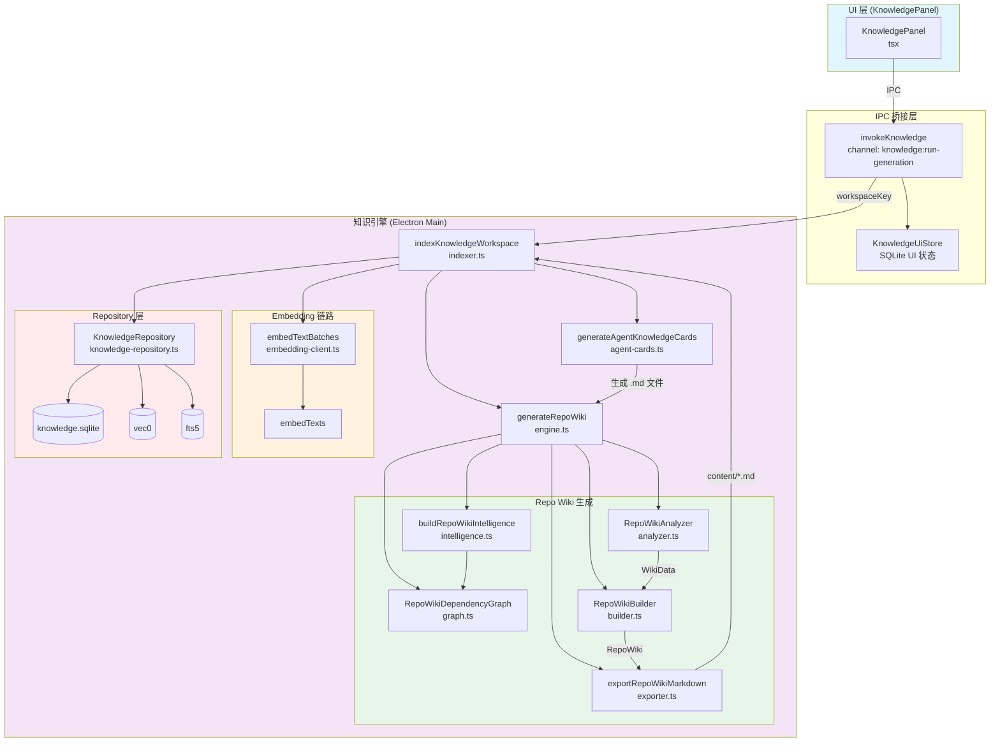
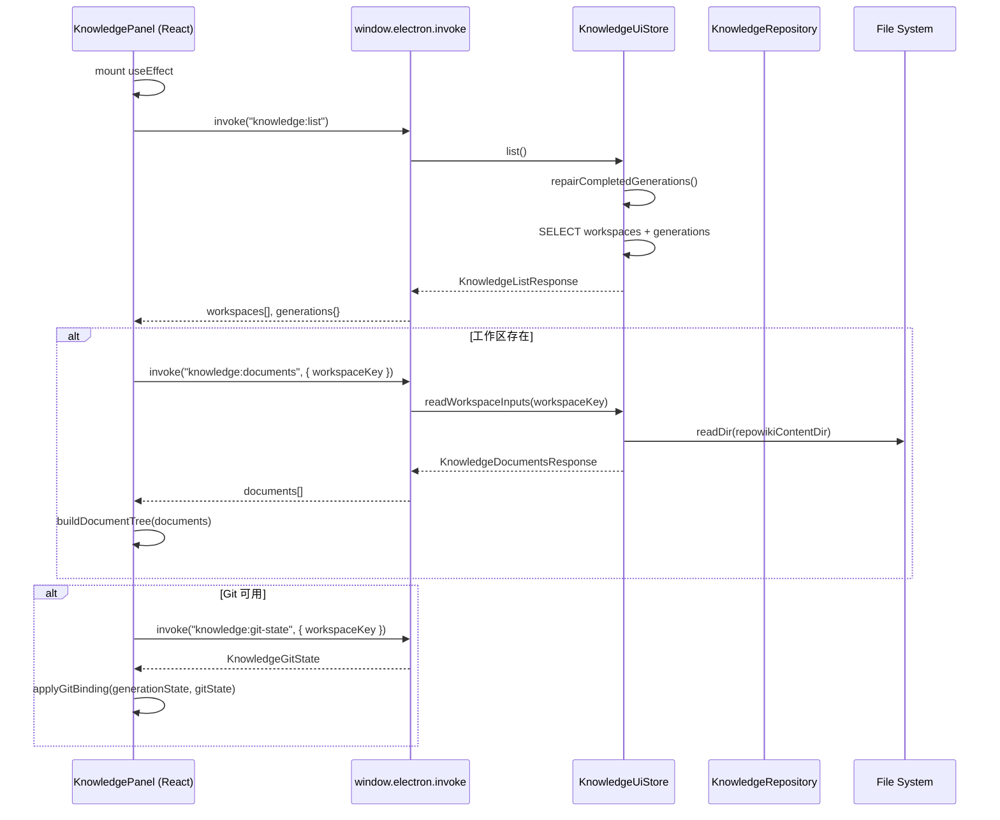

# 知识库面板交互

<cite>

**本文引用的文件**

- [src/ui/components/KnowledgePanel.tsx](file://src/ui/components/KnowledgePanel.tsx)
- [src/electron/libs/knowledge/agent-cards.ts](file://src/electron/libs/knowledge/agent-cards.ts)
- [src/electron/libs/knowledge/embedding-client.ts](file://src/electron/libs/knowledge/embedding-client.ts)
- [src/electron/libs/knowledge/knowledge-indexer.ts](file://src/electron/libs/knowledge/knowledge-indexer.ts)
- [src/electron/libs/knowledge/knowledge-model-settings.ts](file://src/electron/libs/knowledge/knowledge-model-settings.ts)
- [src/electron/libs/knowledge/knowledge-overview.ts](file://src/electron/libs/knowledge/knowledge-overview.ts)
- [src/electron/libs/knowledge/knowledge-paths.ts](file://src/electron/libs/knowledge/knowledge-paths.ts)
- [src/electron/libs/knowledge/knowledge-repository.ts](file://src/electron/libs/knowledge/knowledge-repository.ts)
- [src/electron/libs/knowledge/knowledge-types.ts](file://src/electron/libs/knowledge/knowledge-types.ts)
- [src/electron/libs/knowledge/knowledge-ui-store.ts](file://src/electron/libs/knowledge/knowledge-ui-store.ts)
- [src/electron/libs/knowledge/knowledge-utils.ts](file://src/electron/libs/knowledge/knowledge-utils.ts)
- [src/electron/libs/knowledge/repowiki/analyzer.ts](file://src/electron/libs/knowledge/repowiki/analyzer.ts)
- [src/electron/libs/knowledge/repowiki/builder.ts](file://src/electron/libs/knowledge/repowiki/builder.ts)
- [src/electron/libs/knowledge/repowiki/engine.ts](file://src/electron/libs/knowledge/repowiki/engine.ts)
- [src/electron/libs/knowledge/repowiki/exporter.ts](file://src/electron/libs/knowledge/repowiki/exporter.ts)
- [src/electron/libs/knowledge/repowiki/graph.ts](file://src/electron/libs/knowledge/repowiki/graph.ts)
- [src/electron/libs/knowledge/repowiki/intelligence.ts](file://src/electron/libs/knowledge/repowiki/intelligence.ts)
- [src/electron/libs/knowledge/repowiki/prompts.ts](file://src/electron/libs/knowledge/repowiki/prompts.ts)

</cite>

## 目录

- [职责概览](#职责概览)
- [入口：KnowledgePanel 组件](#入口knowledgepanel-组件)
- [前后端桥接：IPC 调用层](#前后端桥接ipc-调用层)
- [核心数据模型](#核心数据模型)
- [生成链路：索引与 Wiki 生成](#生成链路索引与-wiki-生成)
- [向量嵌入与存储](#向量嵌入与存储)
- [运行时状态流](#运行时状态流)
- [配置与边界条件](#配置与边界条件)
- [常见失败模式与排障](#常见失败模式与排障)
- [扩展点](#扩展点)
- [Agent 改代码地图](#agent-改代码地图)

---

## 职责概览

知识库面板（KnowledgePanel）是 tech-cc-hub 的前端入口，负责向用户展示和管理知识库工作区、生成状态和 Wiki 文档。交互链路跨越 UI 渲染层（React）、Electron IPC 桥接层和后端知识引擎三大部分。

核心职责：

1. **工作区管理**：列出、添加、隐藏、切换知识库工作区
2. **生成状态展示**：显示 Repo Wiki 生成进度（阶段、完成数、失败数、Git 信息）
3. **文档树渲染**：将 Markdown 文档按 section 拆分为树形结构
4. **内容预览**：渲染选中文档的 Markdown 内容
5. **Git 状态绑定**：将当前 git commit/branch 信息绑定到生成状态

章节来源：`KnowledgePanel.tsx` 第 22-76 行定义了组件的类型与状态模型 [file://src/ui/components/KnowledgePanel.tsx#L22-L76](file://src/ui/components/KnowledgePanel.tsx#L22-L76)

---

## 入口：KnowledgePanel 组件

`KnowledgePanel` 是导出的 React 组件，位于 `src/ui/components/KnowledgePanel.tsx`，由 `src/ui/App.tsx` 引用。

**组件签名**：

```typescript
type KnowledgePanelProps = {
  onBack: () => void;
  onOpenSettings?: (pageId?: SettingsPageId) => void;
};
```

**关键状态类型**：

| 类型名 | 用途 | 关键字段 |
|--------|------|----------|
| `GenerationState` | 生成进度 | `status`（idle/generating/paused/completed）、`completed`、`total`、`failed`、`phase`、`commitId` |
| `KnowledgeWorkspace` | 工作区 | `key`、`cwd`、`name`、`source`（session/manual） |
| `KnowledgeDocument` | 文档 | `id`、`workspaceKey`、`section`、`title`、`content` |
| `KnowledgeOpenTab` | 打开的 Tab | `kind`（workspace/document）、`workspaceKey`、`documentId` |

**本地持久化存储键**：

| Storage Key | 用途 |
|------------|------|
| `tech-cc-hub:knowledge-panel-workspaces` | 用户手动添加的工作区路径列表 |
| `tech-cc-hub:knowledge-panel-hidden-workspaces` | 隐藏的工作区 key 集合 |
| `tech-cc-hub:knowledge-panel-auto-update` | 自动更新开关布尔值 |

章节来源：`KnowledgePanel.tsx` 第 119-122 行 [file://src/ui/components/KnowledgePanel.tsx#L119-L122](file://src/ui/components/KnowledgePanel.tsx#L119-L122)

---

## 前后端桥接：IPC 调用层

UI 层通过 `invokeKnowledge` 工具函数发起 IPC 调用，底层封装了 `window.electron.invoke`。

**IPC 调用函数**（`KnowledgePanel.tsx` 第 180-190 行）：

```typescript
async function invokeKnowledge<T>(channel: string, payload?: unknown): Promise<T>
```

**主要 IPC Channel 与载荷**：

| Channel | 方向 | 载荷 | 返回类型 |
|---------|------|------|----------|
| `knowledge:list` | UI → Main | 无 | `KnowledgeListResponse`（workspaces + generations map） |
| `knowledge:run-generation` | UI → Main | `{ workspaceKey, workspaceRoot, mode }` | `KnowledgeRunGenerationResponse` |
| `knowledge:documents` | UI → Main | `{ workspaceKey }` | `KnowledgeDocumentsResponse` |
| `knowledge:git-state` | UI → Main | `{ workspaceKey }` | `KnowledgeGitState` |

**Git 状态刷新**：每 30 秒轮询一次（`GIT_REFRESH_INTERVAL_MS = 30_000`），超时阈值 4 秒（`GIT_SNAPSHOT_TIMEOUT_MS = 4_000`）。

章节来源：`invokeKnowledge` 函数 [file://src/ui/components/KnowledgePanel.tsx#L180-L190](file://src/ui/components/KnowledgePanel.tsx#L180-L190)

---

## 核心数据模型

### UI 层数据（knowledge-ui-store）

后端 `KnowledgeUiStore` 管理三个 SQLite 表（位于 `knowledge-ui.sqlite`）：

```sql
CREATE TABLE knowledge_ui_workspaces (
  key TEXT PRIMARY KEY,      -- 工作区唯一 key（cwd 或 workspace hash）
  cwd TEXT NOT NULL,         -- 工作目录绝对路径
  name TEXT NOT NULL,        -- 显示名称
  source TEXT NOT NULL,      -- 'session' | 'manual'
  hidden INTEGER NOT NULL DEFAULT 0,
  created_at INTEGER NOT NULL,
  updated_at INTEGER NOT NULL
);

CREATE TABLE knowledge_ui_generation (
  workspace_key TEXT PRIMARY KEY,
  status TEXT NOT NULL,      -- 'idle' | 'generating' | 'paused' | 'completed'
  completed INTEGER NOT NULL,
  total INTEGER NOT NULL,
  processing INTEGER NOT NULL,
  failed INTEGER NOT NULL,
  phase TEXT,                -- 当前阶段描述
  commit_id TEXT,
  commit_short_hash TEXT,
  branch TEXT,
  updated_at INTEGER NOT NULL
);

CREATE TABLE knowledge_ui_documents (
  id TEXT NOT NULL,
  workspace_key TEXT NOT NULL,
  section TEXT NOT NULL,     -- 文档所属分类路径，如 "架构设计/后端架构设计"
  title TEXT NOT NULL,
  content TEXT NOT NULL,
  sort_order INTEGER NOT NULL,
  created_at INTEGER NOT NULL,
  updated_at INTEGER NOT NULL,
  PRIMARY KEY (workspace_key, id)
);
```

章节来源：`knowledge-ui-store.ts` 第 98-139 行 [file://src/electron/libs/knowledge/knowledge-ui-store.ts#L98-L139](file://src/electron/libs/knowledge/knowledge-ui-store.ts#L98-L139)

### 知识库索引层（knowledge-repository）

索引数据库 `knowledge.sqlite`（位于 `appData/knowledge/<workspaceHash>/`）：

```sql
CREATE TABLE knowledge_documents (
  id TEXT PRIMARY KEY,
  workspace_scope TEXT NOT NULL,
  source_kind TEXT NOT NULL,  -- 'repowiki' | 'agent_card' | 'memory' | 'manual' | 'source'
  source_path TEXT NOT NULL,
  title TEXT NOT NULL,
  summary TEXT,
  tags TEXT NOT NULL DEFAULT '',
  metadata TEXT NOT NULL DEFAULT '{}',
  content_hash TEXT NOT NULL,
  created_at INTEGER NOT NULL,
  updated_at INTEGER NOT NULL,
  UNIQUE(workspace_scope, source_kind, source_path)
);

CREATE TABLE knowledge_chunks (
  id TEXT PRIMARY KEY,
  document_id TEXT NOT NULL REFERENCES knowledge_documents(id) ON DELETE CASCADE,
  workspace_scope TEXT NOT NULL,
  source_kind TEXT NOT NULL,
  source_path TEXT NOT NULL,
  title TEXT NOT NULL,
  content TEXT NOT NULL,
  chunk_index INTEGER NOT NULL,
  token_estimate INTEGER NOT NULL,
  metadata TEXT NOT NULL DEFAULT '{}',
  embedding_model TEXT,
  embedding_dimension INTEGER,
  created_at INTEGER NOT NULL,
  updated_at INTEGER NOT NULL
);

-- 向量检索
CREATE VIRTUAL TABLE knowledge_chunk_vectors USING vec0(
  chunk_rowid integer primary key,
  embedding float[<dimension>]
);

-- 全文检索
CREATE VIRTUAL TABLE knowledge_chunks_fts USING fts5(
  title, content, source_path, tags, tokenize='unicode61'
);
```

章节来源：`knowledge-repository.ts` 第 80-137 行 [file://src/electron/libs/knowledge/knowledge-repository.ts#L80-L137](file://src/electron/libs/knowledge/knowledge-repository.ts#L80-L137)

---

## 生成链路：索引与 Wiki 生成

### 完整流程图



### 生成阶段详解

1. **`indexKnowledgeWorkspace` 入口**（`knowledge-indexer.ts` 第 170-352 行）：
   - 接收 `{ workspaceRoot, appDataPath, mode, onProgress }`
   - `mode` 取值：`"scan"`（仅扫描文件）、`"generate"`（生成 Wiki）、`"refresh"`（增量刷新）
   - 前置检查：`assertEmbeddingConfigured` — 必须配置 embedding 模型

2. **Repo Wiki 生成**（`engine.ts` 第 214 行 `generateRepoWiki`）：
   - 调用 vendored Python 脚本 `scripts/knowledge/run-repowiki.py`
   - 环境变量传递 `TECH_WIKI_MODEL`、`TECH_WIKI_API_KEY`、`TECH_WIKI_API_BASE`
   - 并发数由 `TECH_CC_HUB_REPOWIKI_CONCURRENCY` 或 `costTier` 控制（free tier 默认 2）
   - 输出 JSON 格式进度事件（`stage: "planning" | "modules" | "architecture" | "reading-guide" | "done"`）

3. **Agent Cards 生成**（`agent-cards.ts` 第 50 行）：
   - 扫描 `repowikiContentDir` 下所有 Markdown 文件
   - 构建 `RepoWikiDependencyGraph`（PageRank 算法排名文件）
   - 生成 7 类卡片：`runtime_flow`、`module`、`entrypoint`、`mcp`、`database`、`qa`、`agent_question`
   - 写入 `agent-cards/_index.json` 和各 `.md` 文件

4. **向量生成与写入**：
   - `RecursiveCharacterTextSplitter` 分块（`DEFAULT_CHUNK_SIZE = 1800`，`DEFAULT_CHUNK_OVERLAP = 220`）
   - `embedTextBatches` 批量调用 embedding API，重试 3 次
   - 差异检测：根据 `contentHash` 判断文档是否变化，跳过未变化文档的 embedding

章节来源：`indexKnowledgeWorkspace` 函数签名 [file://src/electron/libs/knowledge/knowledge-indexer.ts#L170-L175](file://src/electron/libs/knowledge/knowledge-indexer.ts#L170-L175)

---

## 向量嵌入与存储

### Embedding Client

`embedding-client.ts` 封装了 OpenAI 兼容的 embedding API 调用：

**关键函数**：

| 函数 | 位置 | 职责 |
|------|------|------|
| `embedTexts` | embedding-client.ts:83 | 单次调用（重试 3 次） |
| `embedTextBatches` | embedding-client.ts:98 | 批量调用，带进度回调 |
| `requestEmbeddings` | embedding-client.ts:36 | 实际 HTTP 请求 |

**配置来源**：`resolveKnowledgeModelSettings()` 从 `loadApiConfigSettings().profiles` 中筛选带 `embeddingModel` 的 profile。

**已知 embedding 维度映射**：

| 模型名 | 维度 |
|--------|------|
| qwen3-embedding-0.6b | 1024 |
| qwen3-embedding-4b | 2560 |
| qwen3-embedding-8b | 4096 |
| text-embedding-3-small | 1536 |
| text-embedding-3-large | 3072 |

章节来源：`resolveEmbeddingDimension` 函数 [file://src/electron/libs/knowledge/knowledge-model-settings.ts#L32-L36](file://src/electron/libs/knowledge/knowledge-model-settings.ts#L32-L36)

---

## 运行时状态流

### 首次加载序列图



### 生成状态流转

| UI status | 含义 | 后端对应值 |
|-----------|------|-----------|
| `idle` | 空闲 | `status = 'idle'` |
| `generating` | 生成中 | `status = 'generating'` |
| `paused` | 暂停 | `status = 'paused'` |
| `completed` | 完成 | `status = 'completed'` |

**过时的 generating 修复**：`repairCompletedGenerations` 每 5 分钟检测超 5 分钟的 `generating` 状态，查询文档表计数后更新为 `completed`。

章节来源：`normalizeGenerationState` [file://src/ui/components/KnowledgePanel.tsx#L239-L261](file://src/ui/components/KnowledgePanel.tsx#L239-L261)

---

## 配置与边界条件

### 前置条件

1. **必须配置 embedding 模型**：
   - 路径：Settings → 模型配置 → Profile 中填写 `embeddingModel`
   - 错误：`"Knowledge Engine 未启用：缺少 embeddingModel"`

2. **sqlite-vec 扩展可用**：
   - `loadSqliteVec(db)` 失败时 `vectorAvailable = false`，索引降级为 FTS5-only
   - 错误：`"Knowledge Engine 未启用：sqlite-vec 扩展不可用"`

### workspaceScope 生成规则

```
workspaceScope = "workspace:" + basename(resolve(workspaceRoot))
```

例如 `/home/user/project/tech-cc-hub` → `workspace:tech-cc-hub`

章节来源：`createWorkspaceScope` [file://src/electron/libs/knowledge/knowledge-paths.ts#L28-L30](file://src/electron/libs/knowledge/knowledge-paths.ts#L28-L30)

### 工作区目录结构

```
workspaceRoot/
├── .tech/
│   ├── repowiki/
│   │   ├── content/          # 生成的 Wiki Markdown
│   │   ├── agent-cards/      # Agent Cards Markdown
│   │   └── meta/
│   │       └── repowiki-metadata.json
│   ├── memory/
│   │   └── memories.json
│   └── reports/
│       ├── index-state.json
│       ├── skipped-files.json
│       └── generation-report.json
└── appData/knowledge/<workspaceHash>/
    ├── knowledge.sqlite      # 索引数据库
    └── memory.sqlite         # Memory 数据库
```

章节来源：`resolveKnowledgeWorkspacePaths` [file://src/electron/libs/knowledge/knowledge-paths.ts#L36-L72](file://src/electron/libs/knowledge/knowledge-paths.ts#L36-L72)

---

## 常见失败模式与排障

### 1. embedding API 调用失败

**症状**：索引过程卡在 "准备生成向量" 阶段，无进度更新。

**排查步骤**：

```bash
# 1. 检查 embedding 配置
curl -s -X POST "https://<baseURL>/embeddings" \
  -H "Authorization: Bearer <apiKey>" \
  -H "Content-Type: application/json" \
  -d '{"model": "<model>", "input": ["test"]}'

# 2. 检查 embedding 模型是否配置
grep -r "embeddingModel" src/electron/libs/config-store.ts

# 3. 查看 Electron 日志
# 日志路径因平台而异，可通过 IPC 获取 app.getPath("logs")
```

**代码证据**：`embedding-client.ts` 第 83-96 行有 3 次重试逻辑，重试间隔 350ms × attempt。

章节来源：`embedTexts` 重试逻辑 [file://src/electron/libs/knowledge/embedding-client.ts#L83-L96](file://src/electron/libs/knowledge/embedding-client.ts#L83-L96)

### 2. sqlite-vec 扩展不可用

**症状**：`vectorStoreReady: false`，向量检索降级为 FTS5 全文检索。

**排查步骤**：

```bash
# 检查 sqlite-vec 是否编译
ls -la node_modules/sqlite-vec/build/Release/

# 检查 better-sqlite3 是否加载 sqlite-vec
node -e "const db = require('better-sqlite3')('./test.db'); require('sqlite-vec')(db); console.log('OK');"
```

章节来源：`initializeVectorStore` 异常捕获 [file://src/electron/libs/knowledge/knowledge-repository.ts#L141-L160](file://src/electron/libs/knowledge/knowledge-repository.ts#L141-L160)

### 3. Repo Wiki Python 脚本路径缺失

**症状**：生成时抛出 `"找不到 vendored RepoWiki：third_party/repowiki"`。

**排查**：`findRepoRoot()` 依次检查 `process.cwd()`、`cwd/..`、`cwd/../..` 是否存在 `third_party/repowiki/src/repowiki`。确保 vendored RepoWiki 存在于项目根目录。

章节来源：`findRepoRoot` [file://src/electron/libs/knowledge/repowiki/engine.ts#L40-L48](file://src/electron/libs/knowledge/repowiki/engine.ts#L40-L48)

### 4. UI 显示"生成中"但实际已卡死

**症状**：面板显示 `status = 'generating'`，但长时间无进度。

**原因与修复**：超时 5 分钟后 `repairCompletedGenerations` 会自动修复，但若 `ACTIVE_KNOWLEDGE_GENERATIONS` 集合中保留了该 workspaceKey，则跳过修复。

章节来源：`ACTIVE_KNOWLEDGE_GENERATIONS` 防重判逻辑 [file://src/electron/libs/knowledge/knowledge-ui-store.ts#L81-L186](file://src/electron/libs/knowledge/knowledge-ui-store.ts#L81-L186)

### 5. workspaceScope 不一致导致数据丢失

**症状**：切换工作区后，文档列表为空。

**原因**：`resolveKnowledgeWorkspacePaths` 基于 `resolve(workspaceRoot)` 计算 scope。若传入路径不一致（如 `../project` vs `/absolute/path`），scope 会不同，导致 SQLite 查询返回空结果。

章节来源：路径规范化逻辑 [file://src/electron/libs/knowledge/knowledge-paths.ts#L36-L39](file://src/electron/libs/knowledge/knowledge-paths.ts#L36-L39)

---

## 扩展点

### 1. 新增知识源类型

在 `KnowledgeSourceKind`（`knowledge-types.ts` 第 1 行）中添加新的 source kind，并在 `buildKnowledgeInputs`（`knowledge-indexer.ts` 第 105-168 行）中添加对应的分块与 embedding 逻辑。

### 2. 自定义 Wiki 生成器

`maybeGenerateWiki`（`knowledge-indexer.ts` 第 89-103 行）目前硬编码调用 `generateRepoWiki`。若要支持其他生成器，可在此处注入策略模式。

### 3. Agent Cards 新种类

`AgentKnowledgeCardKind`（`agent-cards.ts` 第 15-22 行）定义了 7 种卡片类型。添加新种类需要：

- 在枚举中添加新 kind
- 实现对应的 `build*Cards` 函数
- 在 `generateAgentKnowledgeCards` 主体中添加调用

### 4. 新的 embedding 模型

在 `KNOWN_EMBEDDING_DIMENSIONS`（`knowledge-model-settings.ts` 第 16-22 行）中添加模型名到维度的映射。

### 5. 文档 section 解析

`sectionParts`（`KnowledgePanel.tsx` 第 318-324 行）按 `/` 分割 section 路径。若需自定义解析逻辑，修改此处。

---

## Agent 改代码地图

### 1. 先读文件（推荐阅读顺序）

| 优先级 | 文件 | 理由 |
|--------|------|------|
| 1 | `src/ui/components/KnowledgePanel.tsx` | UI 入口，理解交互和数据流 |
| 2 | `src/electron/libs/knowledge/knowledge-ui-store.ts` | IPC 后端处理函数定义 |
| 3 | `src/electron/libs/knowledge/knowledge-indexer.ts` | 索引生成主链路 |
| 4 | `src/electron/libs/knowledge/knowledge-repository.ts` | 数据库操作和 schema |
| 5 | `src/electron/libs/knowledge/embedding-client.ts` | embedding API 调用 |

### 2. 关键符号表

| 符号 | 文件位置 | 用途 |
|------|----------|------|
| `KnowledgePanel` | KnowledgePanel.tsx:1 | React 组件入口 |
| `invokeKnowledge<T>` | KnowledgePanel.tsx:180 | IPC 调用封装 |
| `buildDocumentTree` | KnowledgePanel.tsx:326 | 文档树构建 |
| `normalizeGenerationState` | KnowledgePanel.tsx:239 | 生成状态规范化 |
| `createKnowledgeUiStore` | knowledge-ui-store.ts:319 | 后端 Store 工厂 |
| `handleKnowledgeUiInvoke` | knowledge-ui-store.ts:323 | IPC handler 路由 |
| `runKnowledgeGeneration` | knowledge-ui-store.ts:405 | 触发索引生成 |
| `indexKnowledgeWorkspace` | knowledge-indexer.ts:169 | 索引生成入口 |
| `embedTextBatches` | embedding-client.ts:98 | 向量批量生成 |
| `KnowledgeRepository` | knowledge-repository.ts:61 | 数据库封装类 |

### 3. IPC / MCP 工具

| 工具名 | Channel / Tool ID | 方向 |
|--------|-------------------|------|
| `knowledge:list` | IPC | UI → Main |
| `knowledge:run-generation` | IPC | UI → Main |
| `knowledge:documents` | IPC | UI → Main |
| `knowledge:git-state` | IPC | UI → Main |
| `mcp__tech-cc-hub-knowledge__knowledge_index` | MCP | Agent → Main |
| `mcp__tech-cc-hub-knowledge__knowledge_search` | MCP | Agent → Main |

### 4. 表结构汇总

| 表名 | 所属 DB | 关键字段 |
|------|---------|----------|
| `knowledge_ui_workspaces` | knowledge-ui.sqlite | `key`, `cwd`, `source`, `hidden` |
| `knowledge_ui_generation` | knowledge-ui.sqlite | `workspace_key`, `status`, `phase`, `commit_id` |
| `knowledge_ui_documents` | knowledge-ui.sqlite | `workspace_key`, `section`, `title`, `content` |
| `knowledge_documents` | knowledge.sqlite | `id`, `source_kind`, `source_path`, `content_hash` |
| `knowledge_chunks` | knowledge.sqlite | `document_id`, `chunk_index`, `token_estimate` |
| `knowledge_chunk_vectors` | knowledge.sqlite | `chunk_rowid`, `embedding` (vec0) |
| `knowledge_chunks_fts` | knowledge.sqlite | 全文检索虚拟表 |

### 5. 修改入口

| 改动类型 | 入口文件 | 修改点 |
|----------|----------|--------|
| UI 交互逻辑 | `KnowledgePanel.tsx` | 添加新 channel 调用或状态处理 |
| IPC 后端 | `knowledge-ui-store.ts` | 在 `handleKnowledgeUiInvoke` 中添加 case |
| 索引流程 | `knowledge-indexer.ts` | 修改 `indexKnowledgeWorkspace` 流程 |
| 数据库操作 | `knowledge-repository.ts` | 在 `KnowledgeRepository` 类中添加方法 |
| Embedding | `embedding-client.ts` | 修改 API 调用逻辑或重试策略 |
| Wiki 生成 | `repowiki/engine.ts` | 修改 Python 脚本调用或进度解析 |

### 6. 验证命令

```bash
# 完整索引生成（开发调试）
npm run dev
# 在 DevTools Console 中：
# invokeKnowledge("knowledge:run-generation", { workspaceKey: "...", workspaceRoot: "...", mode: "generate" })

# 查看生成的报告
cat .tech/reports/index-state.json
cat .tech/reports/generation-report.json

# 检查 SQLite 数据
sqlite3 appData/knowledge/<hash>/knowledge.sqlite "SELECT id, source_kind, source_path FROM knowledge_documents LIMIT 10;"

# 检查 UI Store
sqlite3 appData/knowledge-ui.sqlite "SELECT * FROM knowledge_ui_generation;"

# 验证 embedding API
curl -X POST "<embeddingBaseURL>/embeddings" \
  -H "Authorization: Bearer <key>" \
  -H "Content-Type: application/json" \
  -d '{"model": "<model>", "input": ["hello"]}'
```

### 7. 常见回归风险

| 风险点 | 描述 | 规避建议 |
|--------|------|----------|
| `workspaceScope` 不一致 | 路径解析差异导致数据隔离失效 | 修改路径规范化逻辑后，验证已有数据的 scope 值 |
| `contentHash` 变化 | 相同内容的文档因 hash 变化重新 embedding | 修改分块逻辑后，验证 hash 计算结果 |
| sqlite-vec 降级 | embedding 成功但 vector 表写入失败 | 检查 `isVectorStoreReady()` 返回值 |
| `ACTIVE_KNOWLEDGE_GENERATIONS` 泄漏 | 生成中断后 workspaceKey 残留在 Set 中 | 确保生成完成或异常时调用 `setGenerationInactive` |
| IPC 契约变更 | 修改 channel 名或载荷结构 | 同步更新前端 `invokeKnowledge` 调用方 |
| Git 状态超时 | `GIT_SNAPSHOT_TIMEOUT_MS` 过短 | 调整阈值后验证真实 git 操作耗时 |