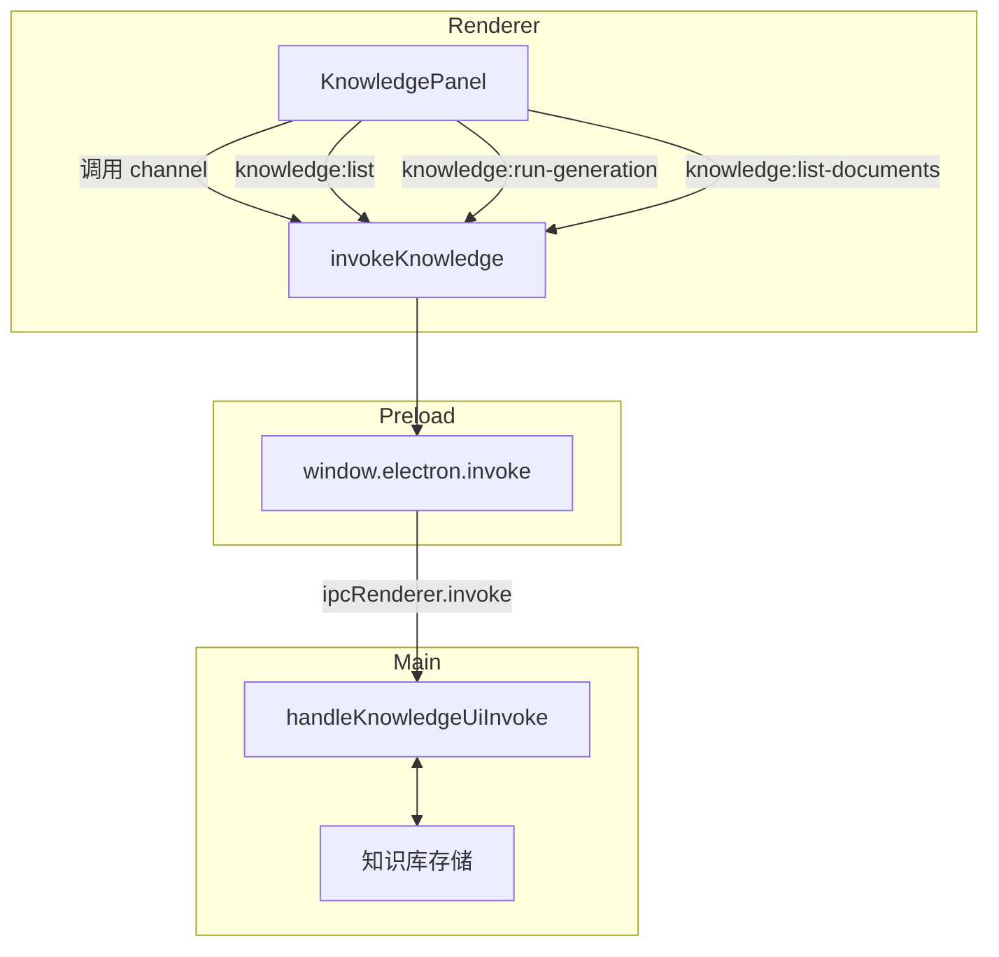
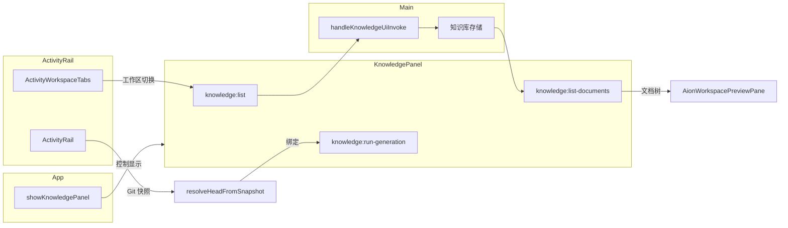

# 知识库面板交互

<cite>

**本文引用的文件**

- [src/ui/components/KnowledgePanel.tsx](file://src/ui/components/KnowledgePanel.tsx)
- [src/ui/App.tsx](file://src/ui/App.tsx)
- [src/ui/components/git/index.ts](file://src/ui/components/git/index.ts)
- [src/electron/main.ts](file://src/electron/main.ts)
- [src/ui/components/ActivityRail.tsx](file://src/ui/components/ActivityRail.tsx)
- [src/ui/components/ActivityWorkspaceTabs.tsx](file://src/ui/components/ActivityWorkspaceTabs.tsx)
- [src/ui/components/AionWorkspacePreviewPane.tsx](file://src/ui/components/AionWorkspacePreviewPane.tsx)
- [src/ui/components/BrowserWorkbenchPage.tsx](file://src/ui/components/BrowserWorkbenchPage.tsx)
- [src/ui/components/ComposerContextCard.tsx](file://src/ui/components/ComposerContextCard.tsx)

</cite>

## 目录

- [概述](#概述)
- [入口与状态管理](#入口与状态管理)
- [核心类型与数据结构](#核心类型与数据结构)
- [IPC 调用链](#ipc-调用链)
- [Generation 状态机](#generation-状态机)
- [Git 状态绑定](#git-状态绑定)
- [本地持久化策略](#本地持久化策略)
- [上下游组件关系](#上下游组件关系)
- [修改功能时的步骤](#修改功能时的步骤)
- [回归验证方式](#回归验证方式)
- [常见失败模式与排障](#常见失败模式与排障)

---

## 概述

`KnowledgePanel.tsx` 是知识库面板的主组件，负责展示和管理知识工作区（Knowledge Workspace）及其文档的生命周期。核心职责包括：

1. **工作区管理**：添加、移除、隐藏工作区，持久化到 localStorage
2. **文档生成**：触发和控制 Wiki 文档的生成流程（run-generation）
3. **状态展示**：显示生成进度、Git 状态、分阶段文档树
4. **IPC 通信**：通过 `window.electron.invoke` 与 Electron 主进程通信

章节来源：[KnowledgePanel.tsx 第 23-26 行](file://src/ui/components/KnowledgePanel.tsx#L23-L26)

---

## 入口与状态管理

### 面板开关

在 `App.tsx` 中，知识库面板的显示由 `showKnowledgePanel` 状态控制：

```tsx
// App.tsx 第 342 行
const [showKnowledgePanel, setShowKnowledgePanel] = useState(false);

// 第 23 行导入
import { KnowledgePanel } from "./components/KnowledgePanel";
```

面板通过 `onBack` 回调返回父级，`onOpenSettings` 可选地打开设置页面：

```tsx
// KnowledgePanel.tsx 第 23-26 行
type KnowledgePanelProps = {
  onBack: () => void;
  onOpenSettings?: (pageId?: SettingsPageId) => void;
};
```

章节来源：[App.tsx 第 342 行](file://src/ui/App.tsx#L342)、[KnowledgePanel.tsx 第 23-26 行](file://src/ui/components/KnowledgePanel.tsx#L23-L26)

### 面板渲染条件

面板的渲染由父组件决定，当 `showKnowledgePanel === true` 时挂载，组件内部通过 `useEffect` 初始化工作区列表和生成状态轮询。

---

## 核心类型与数据结构

### GenerationStatus 枚举

```tsx
// KnowledgePanel.tsx 第 28 行
type GenerationStatus = "idle" | "generating" | "paused" | "completed";
```

| 状态值 | 含义 | 触发条件 |
|--------|------|----------|
| `idle` | 空闲 | 初始状态或生成完成后 |
| `generating` | 生成中 | 用户触发生成且后端开始处理 |
| `paused` | 暂停 | 用户主动暂停或后端返回暂停状态 |
| `completed` | 完成 | 所有文档生成完毕 |

章节来源：[KnowledgePanel.tsx 第 28 行](file://src/ui/components/KnowledgePanel.tsx#L28)

### GenerationState 状态详情

```tsx
// KnowledgePanel.tsx 第 30-41 行
type GenerationState = {
  status: GenerationStatus;
  completed: number;
  total: number;
  processing: number;
  failed: number;
  phase?: string;
  commitId?: string;
  commitShortHash?: string;
  branch?: string | null;
  updatedAt?: number;
};
```

关键字段说明：
- `completed / total`：已完成文档数 / 目标总数，用于计算进度百分比
- `processing`：正在处理的文档数，`generating` 状态时至少为 1
- `phase`：当前阶段描述（如 "扫描代码"）
- `commitId / commitShortHash / branch`：绑定到生成快照的 Git 信息

章节来源：[KnowledgePanel.tsx 第 30-41 行](file://src/ui/components/KnowledgePanel.tsx#L30-L41)

### KnowledgeWorkspace 工作区

```tsx
// KnowledgePanel.tsx 第 43-50 行
type KnowledgeWorkspace = {
  key: string;           // 唯一标识，通常是 cwd 路径
  cwd?: string;          // 工作目录路径
  name: string;          // 显示名称
  sessionCount: number;  // 关联会话数（当前固定为 0）
  source: "session" | "manual";  // 来源：会话自动创建或手动添加
  updatedAt: number;      // 最后更新时间戳
};
```

章节来源：[KnowledgePanel.tsx 第 43-50 行](file://src/ui/components/KnowledgePanel.tsx#L43-L50)

### KnowledgeDocument 文档

```tsx
// KnowledgePanel.tsx 第 52-60 行
type KnowledgeDocument = {
  id: string;
  workspaceKey: string;
  section: string;      // 路径分组，如 "安装指南/快速开始"
  title: string;
  content: string;
  sortOrder: number;    // 排序顺序
  updatedAt: number;
};
```

章节来源：[KnowledgePanel.tsx 第 52-60 行](file://src/ui/components/KnowledgePanel.tsx#L52-L60)

### WikiTreeNode 树节点

```tsx
// KnowledgePanel.tsx 第 70-76 行
type WikiTreeNode = {
  key: string;
  title: string;
  sortOrder: number;
  children: WikiTreeNode[];
  documents: KnowledgeDocument[];
};
```

`buildDocumentTree` 函数将扁平文档列表按 `section` 路径分组构建为树结构，支持多级嵌套。

章节来源：[KnowledgePanel.tsx 第 70-76 行](file://src/ui/components/KnowledgePanel.tsx#L70-L76)、[第 321-362 行](file://src/ui/components/KnowledgePanel.tsx#L321-L362)

---

## IPC 调用链

### 调用封装

所有 IPC 调用通过 `invokeKnowledge` 封装：

```tsx
// KnowledgePanel.tsx 第 181-191 行
async function invokeKnowledge<T>(channel: string, payload?: unknown): Promise<T> {
  const electronApi = window.electron as typeof window.electron & {
    invoke?: <Result>(channel: string, ...args: unknown[]) => Promise<Result>;
  };
  if (typeof electronApi.invoke !== "function") {
    throw new Error("当前运行环境不支持知识库 IPC。");
  }
  return payload === undefined
    ? electronApi.invoke<T>(channel)
    : electronApi.invoke<T>(channel, payload);
}
```

### IPC Channel 定义

在 `main.ts` 第 119-130 行定义了 10 个知识库通道：

```typescript
// main.ts 第 119-130 行
const KNOWLEDGE_UI_CHANNELS = [
  "knowledge:list",           // 列出所有工作区
  "knowledge:sync-workspaces", // 同步工作区列表
  "knowledge:add-workspace",   // 添加工作区
  "knowledge:remove-workspace", // 移除工作区
  "knowledge:update-generation", // 更新生成状态
  "knowledge:complete-generation", // 完成生成
  "knowledge:run-generation",  // 触发生成
  "knowledge:list-documents", // 列出文档
  "knowledge:read-document",   // 读取文档内容
  "knowledge:overview",        // 获取概览
] as const;
```

这些通道由 `handleKnowledgeUiInvoke` 处理，定义在 `libs/knowledge/knowledge-ui-store.js`。

章节来源：[main.ts 第 119-130 行](file://src/electron/main.ts#L119-L130)

### 调用流程图



章节来源：综合 [KnowledgePanel.tsx 第 181-191 行](file://src/ui/components/KnowledgePanel.tsx#L181-L191) 和 [main.ts 第 119-130 行](file://src/electron/main.ts#L119-L130)

---

## Generation 状态机

### 状态规范化

`normalizeGenerationState` 函数确保后端返回的状态对象有效：

```tsx
// KnowledgePanel.tsx 第 240-262 行
function normalizeGenerationState(value: unknown): GenerationState | undefined {
  if (!value || typeof value !== "object") return undefined;
  const raw = value as Partial<GenerationState>;
  if (!isGenerationStatus(raw.status)) return undefined;
  // ... 数值边界处理
  return {
    status,
    completed: Math.min(total, Math.max(0, completed)),
    total,
    processing: status === "generating" ? Math.max(1, Math.floor(Number(raw.processing) || 1)) : 0,
    failed,
    // ...
  };
}
```

关键处理逻辑：
- `status` 必须是四个枚举值之一，否则返回 `undefined`
- `total` 和 `completed` 被限制在合理范围
- `processing` 在非 `generating` 状态时强制为 0

章节来源：[KnowledgePanel.tsx 第 240-262 行](file://src/ui/components/KnowledgePanel.tsx#L240-L262)

### 状态比较

用于判断是否需要重新渲染：

```tsx
// KnowledgePanel.tsx 第 387-401 行
function generationStateEquals(left: GenerationState | undefined, right: GenerationState): boolean {
  if (!left) return false;
  return (
    left.status === right.status &&
    left.completed === right.completed &&
    left.total === right.total &&
    // ... 其他字段比较
  );
}
```

章节来源：[KnowledgePanel.tsx 第 387-401 行](file://src/ui/components/KnowledgePanel.tsx#L387-L401)

---

## Git 状态绑定

### Git 快照解析

`resolveHeadFromSnapshot` 从 Git 工作台快照提取当前 HEAD 信息：

```tsx
// KnowledgePanel.tsx 第 283-297 行
function resolveHeadFromSnapshot(snapshot: UiGitWorkbenchSnapshot): KnowledgeGitState {
  const currentBranch = snapshot.status.currentBranch;
  const headCommit = snapshot.history.find((commit) => (
    commit.refs.some((ref) =>
      ref.startsWith("HEAD") ||
      (currentBranch ? ref === currentBranch || ref.endsWith(`/${currentBranch}`) : false)
    )
  )) ?? snapshot.history[0];
  // ...
}
```

章节来源：[KnowledgePanel.tsx 第 283-297 行](file://src/ui/components/KnowledgePanel.tsx#L283-L297)

### Git 绑定应用到 GenerationState

```tsx
// KnowledgePanel.tsx 第 299-307 行
function applyGitBinding(state: GenerationState, git?: KnowledgeGitState): GenerationState {
  return {
    ...state,
    commitId: git?.commitId || state.commitId,
    commitShortHash: git?.commitShortHash || state.commitShortHash,
    branch: git?.branch ?? state.branch,
    updatedAt: Date.now(),
  };
}
```

这确保每次状态更新都携带最新的 Git commit 信息，用于生成可追溯的文档版本。

章节来源：[KnowledgePanel.tsx 第 299-307 行](file://src/ui/components/KnowledgePanel.tsx#L299-L307)

---

## 本地持久化策略

### 存储键定义

```tsx
// KnowledgePanel.tsx 第 120-123 行
const KNOWLEDGE_WORKSPACES_STORAGE_KEY = "tech-cc-hub:knowledge-panel-workspaces";
const KNOWLEDGE_HIDDEN_WORKSPACES_STORAGE_KEY = "tech-cc-hub:knowledge-panel-hidden-workspaces";
const KNOWLEDGE_AUTO_UPDATE_STORAGE_KEY = "tech-cc-hub:knowledge-panel-auto-update";
```

### 读取函数

```tsx
// KnowledgePanel.tsx 第 193-204 行
function readStoredWorkspacePaths(): string[] {
  if (typeof window === "undefined") return [];
  try {
    const raw = window.localStorage.getItem(KNOWLEDGE_WORKSPACES_STORAGE_KEY);
    if (!raw) return [];
    const parsed = JSON.parse(raw);
    if (!Array.isArray(parsed)) return [];
    return Array.from(new Set(parsed.map((item) => normalizeWorkspaceKey(String(item))).filter(Boolean)));
  } catch {
    return [];
  }
}
```

关键特点：
- 使用 `normalizeWorkspaceKey` 统一处理路径格式
- `Set` 去重 + 空值过滤
- 异常时返回空数组而非抛出

章节来源：[KnowledgePanel.tsx 第 120-123 行](file://src/ui/components/KnowledgePanel.tsx#L120-L123)、[第 193-204 行](file://src/ui/components/KnowledgePanel.tsx#L193-L204)

---

## 上下游组件关系

### 上游组件

| 组件 | 关系 | 说明 |
|------|------|------|
| `App.tsx` | 直接父级 | 控制面板显示/隐藏，管理状态 |
| `ActivityWorkspaceTabs` | 共享标签状态 | 工作区切换时触发面板数据刷新 |
| `ActivityRail` | 共享会话上下文 | 读取当前会话的 cwd 和分析数据 |

### 下游组件

| 组件 | 关系 | 说明 |
|------|------|------|
| `AionWorkspacePreviewPane` | 文档预览 | 点击文档时在右侧预览区展示内容 |
| `BrowserWorkbenchPage` | 浏览器预览 | 某些文档链接可能触发浏览器工具 |
| `ComposerContextCard` | 上下文卡片 | 可将文档引用添加到会话上下文 |
| `GitWorkbenchPanel` | Git 状态源 | 提供 resolveHeadFromSnapshot 的数据 |

### 数据流图



章节来源：综合 [App.tsx 第 342 行](file://src/ui/App.tsx#L342)、[KnowledgePanel.tsx 第 181-191 行](file://src/ui/components/KnowledgePanel.tsx#L181-L191)、[ActivityWorkspaceTabs.tsx 第 1-16 行](file://src/ui/components/ActivityWorkspaceTabs.tsx#L1-L16)

---

## 修改功能时的步骤

### 场景一：新增 IPC Channel

1. **在 `main.ts` 中添加 channel 名称**到 `KNOWLEDGE_UI_CHANNELS` 数组
2. **在后端 handler 中注册处理逻辑**（`libs/knowledge/knowledge-ui-store.js`）
3. **在前端定义 Response 类型**（如 `KnowledgeListResponse`）
4. **在 `KnowledgePanel.tsx` 中添加调用函数**
5. **在组件中添加对应的 useEffect 或回调**

章节来源：[main.ts 第 119-130 行](file://src/electron/main.ts#L119-L130)

### 场景二：修改 Generation 状态字段

1. **更新 `GenerationState` 类型定义**（第 30-41 行）
2. **更新 `normalizeGenerationState` 函数**的规范化逻辑
3. **更新 `generationStateEquals` 函数**的比较字段
4. **检查 UI 渲染逻辑**是否依赖该字段

章节来源：[KnowledgePanel.tsx 第 30-41 行](file://src/ui/components/KnowledgePanel.tsx#L30-L41)、[第 240-262 行](file://src/ui/components/KnowledgePanel.tsx#L240-L262)

### 场景三：修改本地存储结构

1. **更新存储键常量**（第 120-123 行）
2. **更新读取函数**（如 `readStoredWorkspacePaths`）
3. **更新写入逻辑**（如果有自定义写入）
4. **添加数据迁移逻辑**（可选，处理旧版本数据）

章节来源：[KnowledgePanel.tsx 第 120-123 行](file://src/ui/components/KnowledgePanel.tsx#L120-L123)

---

## 回归验证方式

### 功能测试清单

| 功能 | 验证步骤 | 预期结果 |
|------|----------|----------|
| 面板打开 | 点击入口按钮 | 面板显示，无报错 |
| 列出工作区 | 打开面板 | 显示已添加的工作区列表 |
| 添加工作区 | 调用 `knowledge:add-workspace` | 工作区出现在列表，localStorage 同步 |
| 触发生成 | 点击生成按钮 | 进度条出现，状态变为 `generating` |
| 文档预览 | 点击文档节点 | 右侧预览区显示文档内容 |
| Git 状态 | 存在 Git 仓库 | 显示当前分支和 commit hash |
| 面板关闭 | 点击返回按钮 | 面板关闭，状态保持 |

### IPC 回归测试

在浏览器预览（非 Electron）环境下，调用任何 IPC channel 应抛出可捕获的错误：

```tsx
// 第 185-186 行
if (typeof electronApi.invoke !== "function") {
  throw new Error("当前运行环境不支持知识库 IPC。");
}
```

验证方式：启动 `npm run preview`（浏览器预览模式），确认错误被正确抛出而非静默失败。

章节来源：[KnowledgePanel.tsx 第 185-186 行](file://src/ui/components/KnowledgePanel.tsx#L185-L186)

---

## 常见失败模式与排障

### 1. 面板显示但工作区列表为空

**可能原因**：
- localStorage 被清空或跨域隔离
- 后端 `knowledge:list` 返回空数组
- 工作区 key 格式不一致

**排查步骤**：
1. 打开 DevTools，检查 `localStorage.getItem("tech-cc-hub:knowledge-panel-workspaces")`
2. 如果为空，尝试重新添加工作区
3. 检查后端日志，查看 `knowledge:list` 的响应

### 2. 触发生成后状态一直停留在 `idle`

**可能原因**：
- IPC 调用失败（浏览器环境）
- 后端处理异常
- 网络/权限问题

**排查步骤**：
1. 确认运行在 Electron 环境而非浏览器预览
2. 检查后端 `knowledge:run-generation` handler 日志
3. 验证工作区路径有效且存在

章节来源：[KnowledgePanel.tsx 第 185-186 行](file://src/ui/components/KnowledgePanel.tsx#L185-L186)

### 3. Git 状态显示 "loading..." 但不更新

**可能原因**：
- `resolveHeadFromSnapshot` 未收到有效的快照数据
- 快照数据结构与预期不符

**排查步骤**：
1. 检查 `UiGitWorkbenchSnapshot` 类型定义
2. 验证 GitWorkbenchPanel 是否正确提供快照数据
3. 查看 `gitStateEquals` 比较逻辑是否过于严格

章节来源：[KnowledgePanel.tsx 第 283-297 行](file://src/ui/components/KnowledgePanel.tsx#L283-L297)、[第 374-385 行](file://src/ui/components/KnowledgePanel.tsx#L374-L385)

### 4. 文档树显示 "生成文档" 占位符

**可能原因**：
- `isPlaceholderWikiDocument` 返回 `true`
- 文档内容匹配占位符正则

**排查步骤**：
1. 检查 `knowledge:list-documents` 返回的文档内容
2. 验证后端是否正确生成了真实文档
3. 查看正则 `/后续接入真实|当前没有真实 Repo Wiki 正文|预览壳|真实生成内容写入后|生成后会出现 Repo Wiki 目录/`

章节来源：[KnowledgePanel.tsx 第 309-311 行](file://src/ui/components/KnowledgePanel.tsx#L309-L311)

### 5. localStorage 读取返回空数组

**可能原因**：
- 存储数据被其他代码覆盖
- JSON 解析失败
- 存储键名不一致

**排查步骤**：
1. 使用 DevTools 查看 localStorage 原始值
2. 检查是否有其他地方使用相同的存储键
3. 验证 `normalizeWorkspaceKey` 对路径的处理

章节来源：[KnowledgePanel.tsx 第 193-204 行](file://src/ui/components/KnowledgePanel.tsx#L193-L204)

---

## 扩展点

### 新增 Generation Phase

如需添加新的生成阶段：
1. 在 UI 中添加对应的阶段标签组件
2. 在 `GenerationState.phase` 中传入阶段描述
3. 确保后端在适当阶段更新状态

### 自定义文档过滤器

`isPlaceholderWikiDocument` 可扩展为支持更多占位符模式，或替换为从后端获取的过滤器配置。

### 多语言支持

目前 UI 使用中文硬编码（如 "当前工作区"），可通过 i18n 框架抽取为翻译键。

---

*文档版本：基于 `KnowledgePanel.tsx` 约 1674 行代码分析*
*最后更新：组件结构稳定，无重大重构计划*