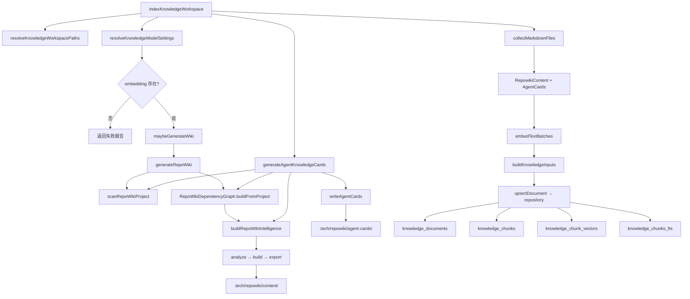

# Agent Knowledge Cards

<cite>
**本文引用的文件**

- [src/electron/libs/knowledge/agent-cards.ts](file://src/electron/libs/knowledge/agent-cards.ts)
- [src/electron/libs/knowledge/embedding-client.ts](file://src/electron/libs/knowledge/embedding-client.ts)
- [src/electron/libs/knowledge/knowledge-indexer.ts](file://src/electron/libs/knowledge/knowledge-indexer.ts)
- [src/electron/libs/knowledge/knowledge-model-settings.ts](file://src/electron/libs/knowledge/knowledge-model-settings.ts)
- [src/electron/libs/knowledge/knowledge-overview.ts](file://src/electron/libs/knowledge/knowledge-overview.ts)
- [src/electron/libs/knowledge/knowledge-paths.ts](file://src/electron/libs/knowledge/knowledge-paths.ts)
- [src/electron/libs/knowledge/knowledge-repository.ts](file://src/electron/libs/knowledge/knowledge-repository.ts)
- [src/electron/libs/knowledge/knowledge-types.ts](file://src/electron/libs/knowledge/knowledge-types.ts)
- [src/electron/libs/knowledge/knowledge-ui-store.ts](file://src/electron/libs/knowledge/knowledge-ui-store.ts)
- [src/electron/libs/knowledge/knowledge-utils.ts](file://src/electron/libs/knowledge/knowledge-utils.ts)
- [src/electron/libs/knowledge/repowiki/analyzer.ts](file://src/electron/libs/knowledge/repowiki/analyzer.ts)
- [src/electron/libs/knowledge/repowiki/builder.ts](file://src/electron/libs/knowledge/repowiki/builder.ts)
- [src/electron/libs/knowledge/repowiki/engine.ts](file://src/electron/libs/knowledge/repowiki/engine.ts)
- [src/electron/libs/knowledge/repowiki/exporter.ts](file://src/electron/libs/knowledge/repowiki/exporter.ts)
- [src/electron/libs/knowledge/repowiki/graph.ts](file://src/electron/libs/knowledge/repowiki/graph.ts)
- [src/electron/libs/knowledge/repowiki/intelligence.ts](file://src/electron/libs/knowledge/repowiki/intelligence.ts)
- [src/electron/libs/knowledge/repowiki/prompts.ts](file://src/electron/libs/knowledge/repowiki/prompts.ts)
- [src/electron/libs/knowledge/repowiki/scanner.ts](file://src/electron/libs/knowledge/repowiki/scanner.ts)
</cite>

---

## 目录

- [1. 概述与定位](#1-概述与定位)
- [2. 核心符号与导出](#2-核心符号与导出)
- [3. 数据结构](#3-数据结构)
- [4. 调用链与上下游关系](#4-调用链与上下游关系)
- [5. 修改步骤与验证](#5-修改步骤与验证)
- [6. 常见失败模式](#6-常见失败模式)
- [7. 扩展点与测试入口](#7-扩展点与测试入口)
- [8. Agent 改代码地图](#8-agent-改代码地图)

---

## 1. 概述与定位

Agent Knowledge Cards 是 tech-cc-hub 的**代码路由层**：通过扫描项目源码、提取信号、构建依赖图谱，将项目知识转化为可检索的 Markdown 文档，供 Agent 在执行任务时快速定位入口、验证路径和风险。

### 职责边界

| 职责 | 说明 |
|------|------|
| **入口扫描** | 调用 `scanRepoWikiProject` 遍历源码，提取语言、符号、import、信号 |
| **图谱构建** | 基于 `RepoWikiDependencyGraph` 计算 PageRank，识别核心文件和模块 |
| **情报提取** | 调用 `buildRepoWikiIntelligence` 聚合 runtime flows、IPC 通道、MCP 工具、数据库表 |
| **卡片生成** | 生成 7 种类型的 `AgentKnowledgeCard`，写入 `.tech/repowiki/agent-cards/` |
| **索引写入** | 卡片写入 SQLite（`knowledge_documents`、`knowledge_chunks`）+ 向量（`knowledge_chunk_vectors`）+ FTS5 |

### 入口函数

```typescript
// src/electron/libs/knowledge/agent-cards.ts#L50
export function generateAgentKnowledgeCards(paths: KnowledgeWorkspacePaths): AgentKnowledgeCardsResult
```

- **调用时机**：由 `indexKnowledgeWorkspace` 在 Repo Wiki 生成完成后调用
- **输入**：`KnowledgeWorkspacePaths`（包含 `workspaceRoot`、`agentCardsDir` 等）
- **输出**：`AgentKnowledgeCardsResult { cards, generatedFiles, skippedFiles }`

---

## 2. 核心符号与导出

### 主要导出（agent-cards.ts）

| 符号 | 行号 | 用途 |
|------|------|------|
| `AgentKnowledgeCardKind` | 15-22 | 卡片类型枚举：`runtime_flow` \| `module` \| `entrypoint` \| `mcp` \| `database` \| `qa` \| `agent_question` |
| `AgentKnowledgeCard` | 24-39 | 卡片主体结构，包含 `entryFiles`、`relatedFiles`、`changeGuide`、`validation`、`risks`、`runtimeSteps` |
| `AgentKnowledgeCardsResult` | 41-45 | 生成结果 |
| `generateAgentKnowledgeCards` | 50 | 主入口函数 |

### 7 种卡片构建函数

| 函数 | 行号 | 生成类型 |
|------|------|----------|
| `buildRuntimeFlowCards` | 74-92 | `runtime_flow` |
| `buildModuleCards` | 94-130 | `module` |
| `buildEntryPointCards` | 132-151 | `entrypoint` |
| `buildMcpCards` | 153-173 | `mcp` |
| `buildDatabaseCards` | 175-195 | `database` |
| `buildQaCards` | 197-217 | `qa` |
| `buildAgentQuestionCards` | 219-234 | `agent_question` |

### 辅助函数

| 函数 | 行号 | 用途 |
|------|------|------|
| `writeAgentCards` | 236-265 | 写入 Markdown 文件到 `agentCardsDir` |
| `renderAgentCardMarkdown` | 267-311 | 渲染单张卡片为 Markdown |
| `signalFiles` | 322 | 从信号列表提取文件路径去重 |
| `signalLines` | 329 | 从信号列表提取描述行 |
| `inferValidation` | 336 | 根据文件列表和 QA 脚本推断验证命令 |
| `inferRisks` | 365 | 根据文件列表推断风险点 |
| `dedupeCards` | 390 | 按 `id` 去重卡片 |

---

## 3. 数据结构

### AgentKnowledgeCard

```typescript
// src/electron/libs/knowledge/agent-cards.ts#L24-39
export type AgentKnowledgeCard = {
  id: string;                        // 唯一标识，如 "flow-xxx"
  title: string;                     // 显示标题
  kind: AgentKnowledgeCardKind;     // 卡片类型
  summary: string;                  // 用途说明
  entryFiles: Array<{ path: string; reason: string }>;  // 修改入口文件 + 原因
  relatedFiles: string[];            // 相关文件列表
  changeGuide: string[];            // 改代码指南
  validation: string[];             // 验证方式
  risks: string[];                  // 风险点
  keywords: string[];               // 检索关键词
  runtimeSteps?: string[];         // 运行链路步骤（仅 runtime_flow）
  sourceSignals?: string[];        // 代码信号（module/entrypoint）
  sourceQuestion?: string;         // 已知问题（仅 agent_question）
  sourceAnswer?: string;            // 已知答案（仅 agent_question）
};
```

### 卡片数量限制

```typescript
// src/electron/libs/knowledge/agent-cards.ts#L47-48
const MAX_MODULE_CARDS = 18;
const MAX_HIGH_VALUE_FILES_PER_MODULE = 10;
```

### 输出目录结构

```text
.tech/repowiki/agent-cards/
├── 运行链路-xxx.md          # runtime_flow
├── 模块改造入口-xxx.md      # module
├── 运行入口与启动链路.md    # entrypoint
├── MCP-工具面与-Agent-能力入口.md  # mcp
├── SQLite-FTS-Vector-存储面.md    # database
├── 验证命令与质量门槛.md    # qa
├── Agent-问答-xxx.md        # agent_question
└── _index.json             # 卡片索引（含 version、generatedAt、cards）
```

---

## 4. 调用链与上下游关系

### 调用流程图



### 上游依赖

| 模块 | 关键符号 | 关系 |
|------|----------|------|
| `repowiki/scanner.ts` | `scanRepoWikiProject` | 提供项目文件树、符号、import、信号 |
| `repowiki/graph.ts` | `RepoWikiDependencyGraph` | 提供 PageRank 排序和模块依赖图 |
| `repowiki/intelligence.ts` | `buildRepoWikiIntelligence` | 提供 runtimeFlows、highValueFiles、scripts 等 |
| `knowledge-paths.ts` | `KnowledgeWorkspacePaths` | 提供路径解析结果 |
| `knowledge-model-settings.ts` | `resolveKnowledgeModelSettings` | 提供 embedding 配置 |

### 下游消费者

| 模块 | 使用方式 |
|------|----------|
| `knowledge-overview.ts` | `repo.buildOverview` 读取卡片元数据注入 system prompt |
| `knowledge-ui-store.ts` | 前端展示卡片列表、生成进度 |
| `knowledge-repository.ts` | 持久化卡片到 SQLite + sqlite-vec |
| `embedding-client.ts` | 将卡片内容分块后生成向量 |

---

## 5. 修改步骤与验证

### 修改流程

**场景：当需要新增一种卡片类型或修改卡片渲染逻辑时**

1. **定位入口文件**：`agent-cards.ts`
2. **理解卡片类型**：先读 `AgentKnowledgeCardKind` 类型定义（第 15-22 行）
3. **新增构建函数**：参考 `buildMcpCards` 等现有函数（第 153-173 行）
4. **注册到主流程**：在 `generateAgentKnowledgeCards` 的 `dedupeCards` 调用中添加（第 60-68 行）
5. **修改渲染模板**：调整 `renderAgentCardMarkdown`（第 267-311 行）
6. **测试输出**：运行 `npm run qa:knowledge` 或手动触发索引生成

### 关键配置参数

```typescript
// 扫描参数（agent-cards.ts#L51-55）
scanRepoWikiProject(paths.workspaceRoot, {
  maxFileSize: 240 * 1024,    // 单文件最大 240KB
  maxFiles: 1_800,           // 最多扫描 1800 个文件
  previewLines: 80,          // 预览行数
});

// 卡片数量限制（agent-cards.ts#L47-48）
MAX_MODULE_CARDS = 18;
MAX_HIGH_VALUE_FILES_PER_MODULE = 10;
```

### 回归验证方式

| 验证场景 | 命令/方法 |
|----------|-----------|
| 索引生成完成 | 检查 `appData/knowledge/workspace-xxx/generation-report.json` 的 `agentCards` 字段 |
| 卡片文件生成 | 检查 `.tech/repowiki/agent-cards/_index.json` 的 `count` 字段 |
| 卡片内容正确 | 读取一张卡片 Markdown，验证 `<agent_card>` 标签、`entryFiles`、`validation` 字段 |
| system prompt 注入 | 调用 `buildKnowledgeOverviewPromptAppend`，检查输出 `<agent_cards count="N">` |
| 向量检索正常 | 使用 `mcp__tech-cc-hub-knowledge__knowledge_search` 检索卡片内容 |

---

## 6. 常见失败模式

### 失败 1：embedding 未配置导致卡片无法写入向量

**表现**：`indexKnowledgeWorkspace` 返回 `error: "missing-embedding-model"`

**根因**：`resolveKnowledgeModelSettings` 返回的 `settings.embedding` 为 `undefined`

**诊断**：
```typescript
// 检查 knowledge-model-settings.ts#L49-51
const profiles = loadApiConfigSettings().profiles.filter(isUsableProfile);
const embeddingProfile = profiles.find((profile) => profile.embeddingModel?.trim());
```

**修复**：在模型设置中配置 `embeddingModel`，确保 API key 和 baseURL 非空。

### 失败 2：sqlite-vec 扩展不可用

**表现**：`repository.isVectorStoreReady()` 返回 `false`，`knowledge_chunk_vectors` 表未创建

**根因**：`initializeVectorStore` 捕获异常（第 156-158 行），vector store 标记为不可用

**诊断**：
```bash
# 检查 Electron 日志中是否有 "[knowledge] sqlite-vec unavailable:" 错误
```

**修复**：确保 `better-sqlite3` 和 `sqlite-vec` native 扩展正确加载。

### 失败 3：卡片写入目录不存在

**表现**：`writeAgentCards` 抛出 `ENOENT` 或 `ENOTDIR`

**根因**：`knowledge-indexer.ts` 调用 `ensureKnowledgeWorkspaceDirectories` 前未确保目录存在

**修复**：确保调用链中先执行 `ensureKnowledgeWorkspaceDirectories(paths)`（第 177 行）。

### 失败 4：卡片内容哈希变化导致频繁重写

**表现**：每次索引都重新生成卡片文件，`changedDocuments` 始终大于 0

**根因**：`knowledge-repository.ts` 的 `upsertDocument` 基于 `stableHash(input.content)` 判断变化

**修复**：检查卡片渲染函数 `renderAgentCardMarkdown` 是否引入了时间戳或随机值。

### 失败 5：扫描超时或内存不足

**表现**：`scanRepoWikiProject` 抛出错误或被 killed

**根因**：`maxFiles: 1_800` 或 `maxFileSize: 240KB` 超出限制

**修复**：调整 `scanRepoWikiProject` 的 `maxFiles` 和 `maxFileSize` 参数。

---

## 7. 扩展点与测试入口

### 扩展点 1：新增卡片类型

1. 在 `AgentKnowledgeCardKind` 添加新类型（第 15-22 行）
2. 实现构建函数，如 `buildMyCustomCards(intelligence: RepoWikiProjectIntelligence): AgentKnowledgeCard[]`
3. 在 `generateAgentKnowledgeCards` 的卡片数组中添加（第 60-68 行）
4. 在 `renderAgentCardMarkdown` 添加对应的渲染分支（第 267-311 行）

### 扩展点 2：自定义卡片优先级

卡片优先级由 `overviewPriority` 函数控制：

```typescript
// src/electron/libs/knowledge/knowledge-repository.ts#L26-59
function overviewPriority(sourcePath: string, title: string): number {
  // Agent Cards 优先级为 12_000（最高）
  if (normalized.includes("/agent-cards/") || normalizedTitle.includes("agent card") ...) {
    return 12_000;
  }
  // 顶层页面次之（9_400-10_000）
  // 模块页面较低（7_500）
}
```

### 扩展点 3：修改图谱算法

依赖图谱的 PageRank 实现在 `graph.ts`：

```typescript
// src/electron/libs/knowledge/repowiki/graph.ts#L66-93
rankFiles(): Array<[string, number]> {
  // damping = 0.85, 迭代 30 次
  // 返回按得分降序排列的文件列表
}
```

### 测试入口

| 场景 | 测试方法 |
|------|----------|
| 单元测试 | 直接调用 `generateAgentKnowledgeCards(mockPaths)`，断言 `cards.length > 0` |
| 集成测试 | 调用 `indexKnowledgeWorkspace`，检查 `agentCards.generatedFiles` |
| E2E 测试 | 在真实 Electron 中触发知识库生成，检查 `.tech/repowiki/agent-cards/` 目录 |
| 检索测试 | 调用 `knowledge_search` 工具，验证卡片内容可被检索 |

---

## 8. Agent 改代码地图

### 步骤 1：先读这些文件

| 优先级 | 文件 | 原因 |
|--------|------|------|
| 1 | `agent-cards.ts` | 卡片生成主逻辑 |
| 2 | `repowiki/intelligence.ts` | 情报提取（highValueFiles、runtimeFlows、scripts） |
| 3 | `repowiki/graph.ts` | 依赖图构建与 PageRank |
| 4 | `repowiki/scanner.ts` | 文件扫描、符号提取、信号识别 |

### 步骤 2：关键符号速查

| 符号类型 | 名称 | 定义位置 |
|----------|------|----------|
| 类型 | `AgentKnowledgeCardKind` | agent-cards.ts#L15 |
| 类型 | `AgentKnowledgeCard` | agent-cards.ts#L24 |
| 类型 | `RepoWikiProjectIntelligence` | repowiki/intelligence.ts（类型导出） |
| 函数 | `generateAgentKnowledgeCards` | agent-cards.ts#L50 |
| 函数 | `scanRepoWikiProject` | repowiki/scanner.ts#L250 |
| 函数 | `buildRepoWikiIntelligence` | repowiki/intelligence.ts#L50 |
| 常量 | `MAX_MODULE_CARDS` | agent-cards.ts#L47 |
| 常量 | `MAX_HIGH_VALUE_FILES_PER_MODULE` | agent-cards.ts#L48 |

### 步骤 3：IPC / MCP 工具

| 工具名称 | 调用方式 | 用途 |
|----------|----------|------|
| `mcp__tech-cc-hub-knowledge__knowledge_index` | 触发索引生成（含 Agent Cards） | 重新扫描并生成卡片 |
| `mcp__tech-cc-hub-knowledge__knowledge_search` | 检索卡片内容 | 验证卡片可被检索 |
| `knowledge_index` (IPC channel) | Electron 内部调用 | 前端触发索引 |

### 步骤 4：修改入口

| 修改目标 | 入口函数/文件 | 注意事项 |
|----------|----------------|----------|
| 新增卡片类型 | `AgentKnowledgeCardKind` + 新建 `buildXxxCards` | 同步修改 `renderAgentCardMarkdown` |
| 修改卡片渲染 | `renderAgentCardMarkdown` | 保持 `<agent_card>` 标签结构 |
| 修改图谱算法 | `RepoWikiDependencyGraph.rankFiles` | 调整 damping 或迭代次数需回归验证 |
| 修改情报提取 | `buildRepoWikiIntelligence` | 确保 `highValueFiles` 和 `scripts` 仍可用 |
| 修改信号识别 | `repowiki/scanner.ts#extractFileSignals` | 信号类型列表在 `RepoWikiFileSignalKind` |

### 步骤 5：验证命令

```bash
# 构建 + 索引
npm run build && npm run qa:knowledge

# 检查输出
cat .tech/repowiki/agent-cards/_index.json | jq '.count'

# 检查向量写入
sqlite3 appData/knowledge/workspace-xxx/knowledge.sqlite \
  "SELECT COUNT(*) FROM knowledge_documents WHERE source_kind='agent_card'"

# 检查 FTS
sqlite3 appData/knowledge/workspace-xxx/knowledge.sqlite \
  "SELECT title, source_path FROM knowledge_chunks_fts WHERE title MATCH 'Agent Card'"
```

### 步骤 6：常见回归风险

| 风险 | 原因 | 预防 |
|------|------|------|
| 卡片数量为 0 | `scanRepoWikiProject` 未找到文件或 `intelligence` 为空 | 验证 `scan.skipped` 长度和 `intelligence.highValueFiles` |
| 卡片标题乱码 | `slugify` 未处理 Unicode | 使用 `encodeURIComponent` 或确保 `slugify` 支持中文字符 |
| 验证命令缺失 | `scripts` 未正确解析 `package.json` | 检查 `repowiki/intelligence.ts#readPackageScripts` |
| 卡片无法检索 | 向量写入失败或 dimension 不匹配 | 验证 `sqlite-vec` 加载和 `settings.embedding.dimension` |
| system prompt 未注入 | `buildKnowledgeOverviewPromptAppend` 返回空 | 检查 `existsSync(paths.knowledgeDbPath)` 和 `embedding` 配置 |

---

**文档信息**

- 章节来源：[agent-cards.ts#L1-424](file://src/electron/libs/knowledge/agent-cards.ts#L1-L424)
- 相关配置：[knowledge-model-settings.ts#L49-82](file://src/electron/libs/knowledge/knowledge-model-settings.ts#L49-L82)
- 索引流程：[knowledge-indexer.ts#L169-351](file://src/electron/libs/knowledge/knowledge-indexer.ts#L169-L351)
- 卡片索引：[knowledge-repository.ts#L26-59](file://src/electron/libs/knowledge/knowledge-repository.ts#L26-L59)
- 情报提取：[repowiki/intelligence.ts#L50-93](file://src/electron/libs/knowledge/repowiki/intelligence.ts#L50-L93)