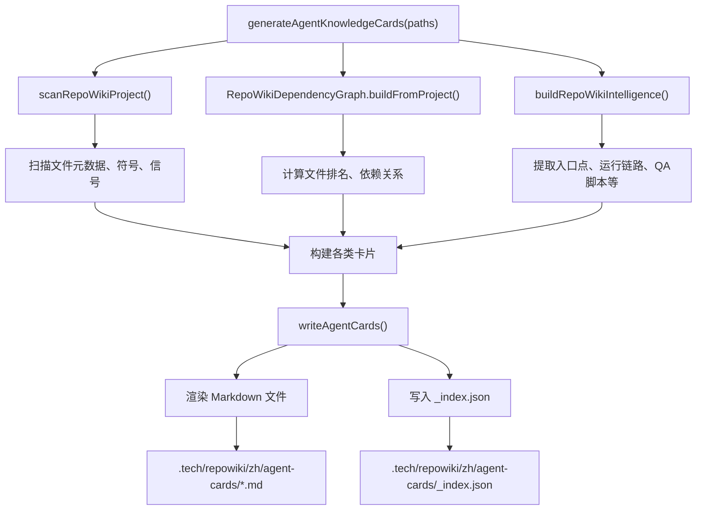

# Agent Knowledge Cards

<cite>
**本文引用的文件**
- [src/electron/libs/knowledge/agent-cards.ts](file://src/electron/libs/knowledge/agent-cards.ts)
- [src/electron/libs/knowledge/knowledge-paths.ts](file://src/electron/libs/knowledge/knowledge-paths.ts)
- [scripts/qa/knowledge-engine-smoke.mjs](file://scripts/qa/knowledge-engine-smoke.mjs)
- [src/electron/libs/knowledge/knowledge-overview.ts](file://src/electron/libs/knowledge/knowledge-overview.ts)
- [src/electron/libs/knowledge/repowiki/builder.ts](file://src/electron/libs/knowledge/repowiki/builder.ts)
- [src/electron/libs/knowledge/repowiki/intelligence.ts](file://src/electron/libs/knowledge/repowiki/intelligence.ts)
- [src/electron/libs/knowledge/repowiki/types.ts](file://src/electron/libs/knowledge/repowiki/types.ts)
- [src/electron/libs/agent-resolver.ts](file://src/electron/libs/agent-resolver.ts)
- [src/electron/libs/agent-rule-docs.ts](file://src/electron/libs/agent-rule-docs.ts)
</cite>

## 目录

- [什么是 Agent Knowledge Cards](#什么是-agent-knowledge-cards)
- [卡片类型与数据结构](#卡片类型与数据结构)
- [入口函数与调用链](#入口函数与调用链)
- [上游依赖：扫描与情报提取](#上游依赖扫描与情报提取)
- [下游消费：聊天 Overview 注入](#下游消费聊天-overview-注入)
- [卡片内容结构详解](#卡片内容结构详解)
- [写入与渲染流程](#写入与渲染流程)
- [验证回归方式](#验证回归方式)
- [常见失败模式](#常见失败模式)
- [扩展指南](#扩展指南)

---

## 什么是 Agent Knowledge Cards

Agent Knowledge Cards 是 tech-cc-hub 知识引擎生成的结构化 Markdown 文档，每张卡片针对一个具体功能域，回答以下问题：

- **什么时候用**：这个功能域做什么
- **修改入口**：改这个功能该从哪个文件开始
- **改代码指南**：改动时的注意事项
- **验证方式**：如何确认改动正确
- **风险点**：容易踩的坑

这些卡片存储在 `.tech/repowiki/zh/agent-cards/` 目录下，供 Agent 在执行任务时快速定位入口和验证路径。  
章节来源：[file://src/electron/libs/knowledge/agent-cards.ts#L24-L39](file://src/electron/libs/knowledge/agent-cards.ts#L24-L39)

---

## 卡片类型与数据结构

### 七种卡片类型

| 类型 | 标题模板 | 用途 |
|------|----------|------|
| `runtime_flow` | 运行链路：xxx | 关键执行链路的步骤和证据文件 |
| `module` | 模块改造入口：xxx | 按模块聚合的高价值文件定位 |
| `entrypoint` | 运行入口与启动链路 | 启动配置和入口文件 |
| `mcp` | MCP 工具面与 Agent 能力入口 | 内置 MCP server/tool 注册点 |
| `database` | SQLite / FTS / Vector 存储面 | schema、索引、写入逻辑 |
| `qa` | 验证命令与质量门槛 | build/test/qa 脚本选择 |
| `agent_question` | Agent 问答：xxx | 常见问题的答案和证据文件 |

章节来源：[file://src/electron/libs/knowledge/agent-cards.ts#L15-L22](file://src/electron/libs/knowledge/agent-cards.ts#L15-L22)

### 核心数据结构

```typescript
export type AgentKnowledgeCard = {
  id: string;                    // 唯一标识，格式: {kind}-{slug}
  title: string;                 // 显示标题
  kind: AgentKnowledgeCardKind;  // 卡片类型
  summary: string;               // 功能描述（什么时候用）
  entryFiles: Array<{            // 修改入口文件列表
    path: string;
    reason: string;
  }>;
  relatedFiles: string[];        // 相关文件列表
  changeGuide: string[];         // 改代码指南
  validation: string[];          // 验证命令
  risks: string[];               // 风险点
  keywords: string[];            // 检索关键词
  runtimeSteps?: string[];       // 仅 runtime_flow 类型
  sourceSignals?: string[];       // 代码信号
  sourceQuestion?: string;        // 仅 agent_question 类型
  sourceAnswer?: string;         // 仅 agent_question 类型
};
```

章节来源：[file://src/electron/libs/knowledge/agent-cards.ts#L24-L39](file://src/electron/libs/knowledge/agent-cards.ts#L24-L39)

---

## 入口函数与调用链

### 主入口：`generateAgentKnowledgeCards`

```typescript
export function generateAgentKnowledgeCards(paths: KnowledgeWorkspacePaths): AgentKnowledgeCardsResult {
  // 1. 扫描项目
  const scan = scanRepoWikiProject(paths.workspaceRoot, {
    maxFileSize: 240 * 1024,
    maxFiles: 1_800,
    previewLines: 80,
  });
  
  // 2. 构建依赖图
  const graph = RepoWikiDependencyGraph.buildFromProject(scan.project);
  
  // 3. 提取代码情报
  const intelligence = buildRepoWikiIntelligence(scan.project, graph);
  scan.project.intelligence = intelligence;

  // 4. 构建 7 类卡片
  const cards = dedupeCards([
    ...buildRuntimeFlowCards(intelligence),
    ...buildModuleCards(intelligence),
    ...buildEntryPointCards(intelligence),
    ...buildMcpCards(intelligence),
    ...buildDatabaseCards(intelligence),
    ...buildQaCards(intelligence),
    ...buildAgentQuestionCards(intelligence),
  ]);

  // 5. 写入磁盘
  const generatedFiles = writeAgentCards(paths, cards);
  return { cards, generatedFiles, skippedFiles: scan.skipped };
}
```

章节来源：[file://src/electron/libs/knowledge/agent-cards.ts#L50-L72](file://src/electron/libs/knowledge/agent-cards.ts#L50-L72)

### 调用流程图



---

## 上游依赖：扫描与情报提取

### 路径解析：`knowledge-paths.ts`

```typescript
export type KnowledgeWorkspacePaths = {
  workspaceRoot: string;
  agentCardsDir: string;      // .tech/repowiki/zh/agent-cards
  // ...
};

export function resolveKnowledgeWorkspacePaths(
  workspaceRoot: string,
  appDataPath: string
): KnowledgeWorkspacePaths {
  const agentCardsDir = join(
    resolvedRoot, ".tech", "repowiki", "zh", "agent-cards"
  );
  // ...
}
```

输出目录由 `resolveKnowledgeWorkspacePaths` 计算，所有子目录在生成前由 `ensureKnowledgeWorkspaceDirectories` 确保存在。  
章节来源：[file://src/electron/libs/knowledge/knowledge-paths.ts#L5-L72](file://src/electron/libs/knowledge/knowledge-paths.ts#L5-L72)

### 代码情报提取：`intelligence.ts`

`buildRepoWikiIntelligence` 负责从扫描结果中提取结构化情报：

| 情报字段 | 来源 |
|---------|------|
| `scripts` | package.json 的 npm scripts（过滤 qa/test/build/lint） |
| `highValueFiles` | 依赖图排名 + 代码信号得分 |
| `runtimeFlows` | 硬编码路径检测（知识库、聊天、任务、MCP） |
| `entrypoints` | HIGH_VALUE_PATHS 列表 + isEntrypoint 标记 |
| `mcpTools` / `mcpServers` | 代码信号中的 mcp_tool / mcp_server |
| `databaseTables` | 代码信号中的 database |
| `agentQuestions` | 硬编码问题与答案 |

章节来源：[file://src/electron/libs/knowledge/repowiki/intelligence.ts#L50-L93](file://src/electron/libs/knowledge/repowiki/intelligence.ts#L50-L93)

### 高价值文件识别规则

```typescript
function buildHighValueFiles(project, graph) {
  const score = 
    pathScore      // HIGH_VALUE_PATHS 命中得 80 分
    + signalScore  // 信号数 * 4 + 导出数 + 符号数 * 0.5
    + rankScore    // 依赖图排名 * 10000
    + entryScore   // 配置 20 分 / 入口 16 分
  return candidates.filter(s => s.score > 4).sort(...)
}
```

章节来源：[file://src/electron/libs/knowledge/repowiki/intelligence.ts#L220-L239](file://src/electron/libs/knowledge/repowiki/intelligence.ts#L220-L239)

---

## 下游消费：聊天 Overview 注入

Agent Knowledge Cards 不会单独使用，而是被 `knowledge-overview.ts` 读取后注入到聊天的 system prompt 中：

```typescript
function buildKnowledgeOverviewPromptAppend(projectCwd?: string): string | undefined {
  // ...
  if (existsSync(paths.knowledgeDbPath)) {
    const repo = new KnowledgeRepository(paths.knowledgeDbPath, {
      embeddingDimension: settings.embedding.dimension,
    });
    knowledgeEntries.push(...repo.buildOverview(paths.workspaceScope, 80));
  }
  
  // 读取并渲染卡片
  const groupedKnowledge = groupKnowledge(knowledgeEntries);
  const agentCardEntries = groupedKnowledge.get("agent_card") ?? [];
  if (agentCardEntries.length > 0) {
    lines.push(`  <agent_cards count="${agentCardEntries.length}">`);
    for (const entry of agentCardEntries.slice(0, 18)) {
      lines.push(`    <card title="${escapeXml(entry.title)}" path="${escapeXml(entry.sourcePath)}" />`);
    }
    lines.push("  </agent_cards>");
  }
  // ...
}
```

输出格式是 XML 片段，供 Agent 在 system prompt 中看到可用知识卡片列表。  
章节来源：[file://src/electron/libs/knowledge/knowledge-overview.ts#L30-L119](file://src/electron/libs/knowledge/knowledge-overview.ts#L30-L119)

### 完整的数据流


---

## 卡片内容结构详解

### 运行链路卡片（runtime_flow）

```typescript
function buildRuntimeFlowCards(intelligence): AgentKnowledgeCard[] {
  return intelligence.runtimeFlows.map((flow) => ({
    id: `flow-${slugify(flow.title)}`,
    title: `运行链路：${flow.title}`,
    kind: "runtime_flow",
    summary: flow.summary,
    entryFiles: flow.evidence.slice(0, 6).map((path) => ({ 
      path, 
      reason: "链路证据或修改入口" 
    })),
    relatedFiles: unique(flow.evidence).slice(0, 18),
    changeGuide: [
      "先从 entryFiles 的第一个文件确认入口，再按 runtimeSteps 顺序追踪调用链。",
      "改动跨 UI/Electron/索引/Runner 时，同步更新 IPC 契约、持久化状态和 QA 脚本。",
      "如果该链路会进入 system prompt 或 MCP，必须验证新会话里的实际注入结果。",
    ],
    validation: inferValidation(flow.evidence, intelligence.scripts),
    risks: inferRisks(flow.evidence),
    keywords: unique([flow.title, ...flow.evidence.map((file) => basename(file))]),
    runtimeSteps: flow.steps,
  }));
}
```

关键点：`runtimeSteps` 只在 runtime_flow 类型中填充，记录完整调用步骤。  
章节来源：[file://src/electron/libs/knowledge/agent-cards.ts#L74-L92](file://src/electron/libs/knowledge/agent-cards.ts#L74-L92)

### 模块改造卡片（module）

按模块名聚合高价值文件，最多生成 18 张模块卡片，每个模块最多 10 个高价值文件：

```typescript
const MAX_MODULE_CARDS = 18;
const MAX_HIGH_VALUE_FILES_PER_MODULE = 10;
```

章节来源：[file://src/electron/libs/knowledge/agent-cards.ts#L47-L48](file://src/electron/libs/knowledge/agent-cards.ts#L47-L48)

### 验证命令推断（inferValidation）

根据文件路径特征自动推荐 QA 脚本：

```typescript
function inferValidation(files: string[], scripts): string[] {
  const joined = files.join("\n").toLowerCase();
  
  if (/knowledge|repowiki|agent-cards/.test(joined)) {
    addScript(names, scripts, "build");
    addScript(names, scripts, "qa:knowledge");
    addScript(names, scripts, "qa:knowledge-chat");
    addScript(names, scripts, "qa:knowledge-ui");
  }
  if (/src\/ui|tsx|css|vite|component/.test(joined)) {
    addScript(names, scripts, "qa:knowledge-ui");
  }
  if (/src\/electron|ipc|mcp|runner|sqlite|database|task/.test(joined)) {
    addScript(names, scripts, "build");
    addScript(names, scripts, "qa:knowledge");
  }
  // ...
}
```

章节来源：[file://src/electron/libs/knowledge/agent-cards.ts#L337-L358](file://src/electron/libs/knowledge/agent-cards.ts#L337-L358)

---

## 写入与渲染流程

### `writeAgentCards` 函数

```typescript
function writeAgentCards(paths, cards): string[] {
  // 1. 清空旧目录
  if (existsSync(paths.agentCardsDir)) {
    rmSync(paths.agentCardsDir, { recursive: true, force: true });
  }
  mkdirSync(paths.agentCardsDir, { recursive: true });

  // 2. 写入每张卡片
  for (const card of cards) {
    let fileName = `${slugify(card.title)}.md`;
    // 防止文件名冲突
    if (usedFileNames.has(fileName)) {
      fileName = `${slugify(card.title)}-${stableHash(card.id).slice(0, 8)}.md`;
    }
    writeFileSync(absolutePath, renderAgentCardMarkdown(card), "utf8");
  }

  // 3. 写入索引
  writeFileSync(indexPath, JSON.stringify({
    version: 1,
    generatedAt: Date.now(),
    workspaceScope: paths.workspaceScope,
    count: cards.length,
    cards,
  }, null, 2), "utf8");
}
```

章节来源：[file://src/electron/libs/knowledge/agent-cards.ts#L236-L265](file://src/electron/libs/knowledge/agent-cards.ts#L236-L265)

### Markdown 渲染结构

```typescript
function renderAgentCardMarkdown(card): string {
  const lines = [
    `# ${card.title}`,
    `<agent_card id="${escapeXml(card.id)}" kind="${escapeXml(card.kind)}">`,
    "## 什么时候用", card.summary,
    "## 修改入口", ...renderEntryFiles(card.entryFiles),
    "## 相关文件", ...renderList(card.relatedFiles),
    "## 改代码指南", ...renderList(card.changeGuide),
  ];
  
  if (card.runtimeSteps?.length) {
    lines.push("## 运行链路", ...card.runtimeSteps.map(...));
  }
  
  lines.push(
    "## 验证方式", ...renderList(card.validation),
    "## 风险点", ...renderList(card.risks),
    "## 检索关键词", card.keywords.join(", "),
  );
  
  if (card.sourceSignals?.length) {
    lines.push("## 代码信号", ...renderList(card.sourceSignals.slice(0, 48)));
  }
  
  lines.push("</agent_card>");
  return lines.join("\n");
}
```

渲染输出包含 `<agent_card>` 标签，用于解析器识别。  
章节来源：[file://src/electron/libs/knowledge/agent-cards.ts#L267-L311](file://src/electron/libs/knowledge/agent-cards.ts#L267-L311)

---

## 验证回归方式

### Smoke 测试：`knowledge-engine-smoke.mjs`

运行方式：
```bash
KNOWLEDGE_QA_WORKSPACE=/path/to/workspace \
TECH_CC_HUB_APP_DATA=/path/to/appdata \
node scripts/qa/knowledge-engine-smoke.mjs
```

章节来源：[file://scripts/qa/knowledge-engine-smoke.mjs#L1-L165](file://scripts/qa/knowledge-engine-smoke.mjs#L1-L165)

### Agent Cards 专项验证

| 检查项 | 阈值 | 失败原因 |
|--------|------|----------|
| 目录存在 | 必须存在 | Agent Cards 目录缺失 |
| 文件数量 | ≥ 8 | 卡片数量不足 |
| 索引匹配 | cards.length === files.length | 索引与文件不一致 |
| 必需标题 | 必须包含"运行链路"、"模块改造入口"、"验证命令与质量门槛" | 关键卡片缺失 |
| entryFiles | 每张卡片必须有 | 入口文件缺失 |
| validation | 每张卡片必须有 | 验证路径缺失 |
| risks | 每张卡片必须有 | 风险点缺失 |
| 数据库索引 | indexedAgentCards === agentCardFiles.length | 索引状态与文件不一致 |

章节来源：[file://scripts/qa/knowledge-engine-smoke.mjs#L98-L129](file://scripts/qa/knowledge-engine-smoke.mjs#L98-L129)

---

## 常见失败模式

### 1. 卡片数量不足

**原因**：项目规模太小或扫描过滤过严。

**排查**：检查 `scanRepoWikiProject` 的 `maxFiles: 1800` 和 `maxFileSize: 240KB` 限制。

### 2. entryFiles 为空

**原因**：高价值文件识别分数低于阈值（> 4 分）。

**排查**：检查 `buildHighValueFiles` 的评分计算，确认文件有足够信号。

### 3. validation 推断错误

**原因**：`inferValidation` 的路径正则不包含改动文件。

**排查**：如果改的是新路径，添加对应的正则匹配规则。

### 4. Markdown 渲染后仍有占位符

**原因**：生成时 knowledge-indexer 返回了 "后续接入真实" 等占位文本。

**排查**：检查 embedding 模型是否配置、SQLite/vec 是否就绪。

### 5. 三表不一致（chunks / FTS / vector）

**原因**：写入时 chunks 成功但 vector 写入失败。

**排查**：检查 `knowledge-repository.ts` 的事务处理和错误回滚。

章节来源：[file://src/electron/libs/knowledge/agent-cards.ts#L366-L390](file://src/electron/libs/knowledge/agent-cards.ts#L366-L390)（inferRisks 部分）

---

## 扩展指南

### 新增卡片类型

1. 在 `AgentKnowledgeCardKind` 添加新类型
2. 实现对应的 `build*Cards` 函数
3. 在 `generateAgentKnowledgeCards` 中调用
4. 更新 smoke 测试的必需标题检查

### 自定义验证规则

在 `inferValidation` 中添加路径匹配：

```typescript
if (/your-pattern/.test(joined)) {
  addScript(names, scripts, "your-qa-script");
}
```

### 修改高价值文件识别

编辑 `repowiki/intelligence.ts` 中的 `HIGH_VALUE_PATHS` 列表或 `inferReason` 函数。

章节来源：[file://src/electron/libs/knowledge/repowiki/intelligence.ts#L32-L48](file://src/electron/libs/knowledge/repowiki/intelligence.ts#L32-L48)

---

## 相关文档

- [知识引擎 Smoke 测试](file://scripts/qa/knowledge-engine-smoke.mjs) - 端到端验证
- [Knowledge Overview 注入](file://src/electron/libs/knowledge/knowledge-overview.ts) - 卡片如何进入 system prompt
- [Repo Wiki Builder](file://src/electron/libs/knowledge/repowiki/builder.ts) - 配套 Wiki 页面生成
- [代码情报提取](file://src/electron/libs/knowledge/repowiki/intelligence.ts) - 卡片内容的数据来源
- [Agent Resolver](file://src/electron/libs/agent-resolver.ts) - Agent 配置解析
- [Agent 规则文档](file://src/electron/libs/agent-rule-docs.ts) - 系统默认规则加载