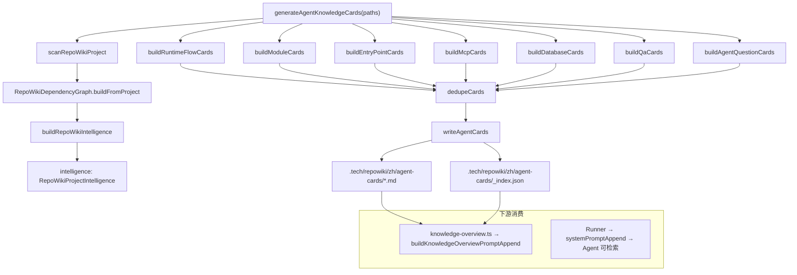

# Agent Knowledge Cards

<cite>
**本文引用的文件**
- [src/electron/libs/knowledge/agent-cards.ts](file=src/electron/libs/knowledge/agent-cards.ts)
- [src/electron/libs/knowledge/knowledge-paths.ts](file=src/electron/libs/knowledge/knowledge-paths.ts)
- [scripts/qa/knowledge-engine-smoke.mjs](file=scripts/qa/knowledge-engine-smoke.mjs)
- [src/electron/libs/knowledge/knowledge-overview.ts](file=src/electron/libs/knowledge/knowledge-overview.ts)
- [src/electron/libs/knowledge/repowiki/builder.ts](file=src/electron/libs/knowledge/repowiki/builder.ts)
- [src/electron/libs/knowledge/repowiki/intelligence.ts](file=src/electron/libs/knowledge/repowiki/intelligence.ts)
- [src/electron/libs/knowledge/repowiki/types.ts](file=src/electron/libs/knowledge/repowiki/types.ts)
- [src/electron/libs/agent-resolver.ts](file=src/electron/libs/agent-resolver.ts)
- [src/electron/libs/agent-rule-docs.ts](file=src/electron/libs/agent-rule-docs.ts)
</cite>

# Agent Knowledge Cards

> **topic-agent-knowledge-cards** | 生成器入口：`generateAgentKnowledgeCards`

## 目录

- [职责概述](#职责概述)
- [核心入口与导出符号](#核心入口与导出符号)
- [调用链与数据流](#调用链与数据流)
- [数据类型定义](#数据类型定义)
- [路径配置体系](#路径配置体系)
- [QA 验证机制](#qa-验证机制)
- [常见失败模式](#常见失败模式)
- [修改步骤指南](#修改步骤指南)
- [扩展点](#扩展点)

---

## 职责概述

Agent Knowledge Cards（智能体知识卡片）是 tech-cc-hub 的**知识库生成物**之一，旨在为代码 Agent 提供结构化的项目导航信息。每个卡片包含：入口文件、相关文件、改代码指南、验证方式和风险点。

这些卡片由 `agent-cards.ts` 中的 `generateAgentKnowledgeCards` 函数从 `RepoWikiProjectIntelligence` 派生而来，生成后写入 `.tech/repowiki/zh/agent-cards/` 目录，并在新会话启动时通过 `buildKnowledgeOverviewPromptAppend` 注入到 system prompt。

[章节来源](file=src/electron/libs/knowledge/agent-cards.ts#L50-L71)

---

## 核心入口与导出符号

### 主要导出

| 符号 | 行号 | 职责 |
| --- | --- | --- |
| `generateAgentKnowledgeCards` | 50 | 主入口：扫描项目 → 构建 intelligence → 生成卡片 → 写入文件 |
| `writeAgentCards` | 236 | 负责清理旧目录、写 Markdown、写 `_index.json` |
| `renderAgentCardMarkdown` | 267 | 将 `AgentKnowledgeCard` 对象渲染为带 frontmatter 的 Markdown |
| `AgentKnowledgeCardKind` | 15-22 | 卡片类型枚举：runtime_flow / module / entrypoint / mcp / database / qa / agent_question |

[章节来源](file=src/electron/libs/knowledge/agent-cards.ts#L15-L45)

### 构建函数（内部）

| 函数 | 行号 | 产出卡片类型 |
| --- | --- | --- |
| `buildRuntimeFlowCards` | 74 | `runtime_flow` - 从 runtimeFlows 提取链路 |
| `buildModuleCards` | 94 | `module` - 按模块分组高价值文件 |
| `buildEntryPointCards` | 132 | `entrypoint` - 启动入口文件 |
| `buildMcpCards` | 153 | `mcp` - MCP server 和 tool |
| `buildDatabaseCards` | 175 | `database` - SQLite/FTS/vector 表 |
| `buildQaCards` | 197 | `qa` - npm scripts 验证命令 |
| `buildAgentQuestionCards` | 219 | `agent_question` - 常见问答 |

[章节来源](file=src/electron/libs/knowledge/agent-cards.ts#L74-L234)

---

## 调用链与数据流



**数据上游**：从 `scanRepoWikiProject` 获取 `RepoWikiProjectContext`（含文件树、符号、信号），再通过 `intelligence.ts` 的 `buildRepoWikiIntelligence` 提取脚本、入口、信号、运行时链路和 Agent 问答。

**数据下游**：卡片写入 `agentCardsDir` 后，索引器将 `.md` 文件 chunk + embed 写入 `knowledge.sqlite`，`knowledge-overview.ts` 在新会话启动时读取并注入 `<knowledge_overview>` XML。

[图表来源](file=src/electron/libs/knowledge/agent-cards.ts#L50-L72)

---

## 数据类型定义

### AgentKnowledgeCard 结构

```typescript
type AgentKnowledgeCard = {
  id: string;                    // 格式: `${kind}-${slugify(title)}`
  title: string;                // 展示标题，含类型前缀如"运行链路："
  kind: AgentKnowledgeCardKind;  // 卡片类型
  summary: string;              // "什么时候用"的描述
  entryFiles: Array<{           // 修改入口文件列表
    path: string;
    reason: string;
  }>;
  relatedFiles: string[];        // 相关文件路径
  changeGuide: string[];         // 改代码指南
  validation: string[];         // 验证命令（基于文件信号推断）
  risks: string[];               // 风险点
  keywords: string[];            // 检索关键词
  runtimeSteps?: string[];      // 仅 runtime_flow 类型
  sourceSignals?: string[];     // 代码信号如 "database:knowledge_documents"
  sourceQuestion?: string;       // 仅 agent_question 类型
  sourceAnswer?: string;         // 仅 agent_question 类型
};
```

[章节来源](file=src/electron/libs/knowledge/agent-cards.ts#L24-L39)

### AgentKnowledgeCardsResult 返回值

```typescript
type AgentKnowledgeCardsResult = {
  cards: AgentKnowledgeCard[];                    // 生成的卡片数组
  generatedFiles: string[];                      // 写入的相对路径列表
  skippedFiles: Array<{ path: string; reason: string }>; // 扫描跳过的文件
};
```

[章节来源](file=src/electron/libs/knowledge/agent-cards.ts#L41-L45)

### 内部依赖类型

```typescript
// 来源: repowiki/types.ts
type RepoWikiProjectIntelligence = {
  scripts: RepoWikiScriptInfo[];
  dependencies: RepoWikiDependencyInfo[];
  entrypoints: RepoWikiHighValueFile[];
  ipcChannels: RepoWikiFileSignal[];
  uiIpcCalls: RepoWikiFileSignal[];
  mcpTools: RepoWikiFileSignal[];
  mcpServers: RepoWikiFileSignal[];
  databaseTables: RepoWikiFileSignal[];
  stores: RepoWikiHighValueFile[];
  events: RepoWikiFileSignal[];
  highValueFiles: RepoWikiHighValueFile[];
  runtimeFlows: RepoWikiRuntimeFlow[];
  agentQuestions: RepoWikiAgentQuestion[];
};
```

[章节来源](file=src/electron/libs/knowledge/repowiki/types.ts#L61-L75)

---

## 路径配置体系

`knowledge-paths.ts` 提供了完整的工作区路径解析：

```typescript
type KnowledgeWorkspacePaths = {
  workspaceRoot: string;           // 项目根目录
  workspaceScope: string;          // 格式: "workspace:${basename}"
  workspaceHash: string;          // SHA256 前16位，用于 appData 隔离
  techRoot: string;                // .tech/
  repowikiRoot: string;            // .tech/repowiki/zh
  agentCardsDir: string;           // .tech/repowiki/zh/agent-cards/
  // ... 其他路径
  appDataWorkspaceRoot: string;    // appData/knowledge/${workspaceHash}
  knowledgeDbPath: string;         // appDataWorkspaceRoot/knowledge.sqlite
  memoryDbPath: string;           // appDataWorkspaceRoot/memory.sqlite
};
```

**关键路径约定**：
- `agentCardsDir` = `{workspaceRoot}/.tech/repowiki/zh/agent-cards/`
- `knowledgeDbPath` = `{appData}/knowledge/{workspaceHash}/knowledge.sqlite`

[章节来源](file=src/electron/libs/knowledge/knowledge-paths.ts#L5-L26)

---

## QA 验证机制

`knowledge-engine-smoke.mjs` 提供了完整的端到端 smoke 测试：

### 验证项

| 检查项 | 阈值 | 失败原因 |
| --- | --- | --- |
| index-state.json 成功 | `success === true` | 索引器运行失败 |
| vectorStoreReady | `true` | sqlite-vec 未就绪 |
| indexedDocuments | `≥ 60` | Repo Wiki 页数不足 |
| indexedChunks | `≥ 300` | chunk 深度不够 |
| generatedFiles | `≥ 60` | 生成页数不足 |
| wiki_catalogs | `40 ≤ count ≤ 80` | 目录过浅或过宽 |
| wiki 页数 | `40 ≤ count ≤ 80` | 产出量不对 |
| 路径深度 | `max depth ≥ 3` | 目录结构太平 |
| cite 覆盖率 | `≥ 60%` 页含 cite | 缺少证据引用 |
| Mermaid 覆盖率 | `≥ 25%` 页含 diagram | 缺少可视化 |
| Agent Cards 数量 | `≥ 8` | 卡片生成不足 |
| 必需卡片标题 | 包含"运行链路"、"模块改造入口"、"验证命令与质量门槛" | 关键卡片缺失 |
| Card 结构完整性 | entryFiles / validation / risks 非空 | 卡片字段缺失 |
| 索引一致性 | indexedAgentCards === agentCardFiles.length | 索引与文件不同步 |

[章节来源](file=scripts/qa/knowledge-engine-smoke.mjs#L65-L128)

### 验证命令

```bash
KNOWLEDGE_QA_WORKSPACE=/path/to/project \
TECH_CC_HUB_APP_DATA=/path/to/appdata \
node scripts/qa/knowledge-engine-smoke.mjs
```

成功时输出 `KNOWLEDGE_ENGINE_QA_OK` 和 JSON 统计。

---

## 常见失败模式

### 1. 卡片数量为 0 或过少

**原因**：`scanRepoWikiProject` 返回空或 `intelligence` 构建失败。

**排查**：
1. 检查 `reportPath` (`index-state.json`) 的 `success` 字段
2. 检查 `knowledge-indexer.ts` 的错误日志
3. 验证 `scanRepoWikiProject` 的 `maxFiles` / `maxFileSize` 配置

**修复**：确保 `workspaceRoot` 下有足够多的源文件（≥ 300 个 .ts/.js/.tsx），且不在 `.mcp.json` / `.qoderignore` 排除列表中。

### 2. 卡片 entryFiles 为空

**原因**：`buildModuleCards` 从 `intelligence.highValueFiles` 取数据，若无高价值文件则无入口。

**排查**：
1. 检查 `highValueFiles` 在 `intelligence.ts` 的评分逻辑
2. 验证文件信号（ipc / mcp_tool / database / store）是否被正确提取

**修复**：确保关键文件（如 `main.ts` / `ipc-handlers.ts` / `runner.ts`）存在且可被扫描器识别。

[章节来源](file=src/electron/libs/knowledge/agent-cards.ts#L94-L130)

### 3. 验证命令推断错误

**原因**：`inferValidation` 通过文件名关键词匹配 npm scripts，若匹配规则过时会导致验证命令缺失。

**排查**：检查 `intelligence.scripts` 是否包含期望的 `qa:knowledge` / `qa:knowledge-ui` 等脚本。

**修复**：更新 `package.json` 中的 scripts，或在 `intelligence.ts` 的匹配规则中添加新脚本名称。

### 4. 卡片写入后索引不同步

**原因**：卡片写入磁盘后，索引器未及时将 `.md` 写入 `knowledge.sqlite`。

**排查**：对比 `agentCardFiles.length` 与 `indexedAgentCards`（从 SQLite 查询）。

**修复**：触发完整的 `knowledge:run-index` 流程，确保 `knowledge-indexer.ts` 的 `indexKnowledgeWorkspace` 覆盖 `agentCardsDir`。

[章节来源](file=scripts/qa/knowledge-engine-smoke.mjs#L140-L141)

---

## 修改步骤指南

### 添加新的卡片类型

1. 在 `AgentKnowledgeCardKind` 添加新类型（如 `"workflow"`）
2. 实现 `build${Type}Cards` 函数，返回 `AgentKnowledgeCard[]`
3. 在 `generateAgentKnowledgeCards` 的 `dedupeCards` 调用链中追加
4. 在 `scripts/qa/knowledge-engine-smoke.mjs` 添加必要卡片标题检查

### 修改验证推断逻辑

1. 编辑 `inferValidation` 函数，根据文件路径模式返回对应 QA 脚本
2. 编辑 `inferRisks` 函数，补充知识库 / embedding 相关风险

### 调整卡片数量上限

- `MAX_MODULE_CARDS = 18`：最多生成的模块卡片数
- `MAX_HIGH_VALUE_FILES_PER_MODULE = 10`：每个模块最多包含的高价值文件数

[章节来源](file=src/electron/libs/knowledge/agent-cards.ts#L47-L48)

---

## 扩展点

### 1. 扩展卡片渲染结构

`renderAgentCardMarkdown` 可以添加新 section。例如新增 `## 依赖关系` 或 `## 已知 Bug`。

```typescript
// 示例：在 runtime_flow 类型卡片中追加额外 section
if (card.kind === "runtime_flow" && card.evidence?.length) {
  lines.push("## 证据文件", ...renderList(card.evidence.map(f => `\`${f}\``)), "");
}
```

### 2. 扩展信号推断规则

在 `intelligence.ts` 的 `buildRepoWikiIntelligence` 中添加新的信号提取逻辑：

```typescript
// 新增信号类型
const newSignals = project.files.flatMap((file) =>
  file.signals.filter((s) => s.kind === "new_signal_type")
);
```

### 3. 自定义 QA 阈值

在 `knowledge-engine-smoke.mjs` 顶部调整阈值常量：

```javascript
const MIN_WIKI_PAGES = 50;   // 原本 40
const MIN_AGENT_CARDS = 10;  // 原本 8
```

---

## 相关文件索引

| 文件 | 职责 |
| --- | --- |
| [agent-cards.ts](file=src/electron/libs/knowledge/agent-cards.ts) | 卡片生成器主入口 |
| [knowledge-paths.ts](file=src/electron/libs/knowledge/knowledge-paths.ts) | 路径解析与目录约定 |
| [intelligence.ts](file=src/electron/libs/knowledge/repowiki/intelligence.ts) | 项目情报提取与信号分析 |
| [builder.ts](file=src/electron/libs/knowledge/repowiki/builder.ts) | RepoWiki 页面构建器 |
| [types.ts](file=src/electron/libs/knowledge/repowiki/types.ts) | 类型定义 |
| [knowledge-overview.ts](file=src/electron/libs/knowledge/knowledge-overview.ts) | system prompt 注入 |
| [agent-resolver.ts](file=src/electron/libs/agent-resolver.ts) | Agent 运行时上下文解析 |
| [agent-rule-docs.ts](file=src/electron/libs/agent-rule-docs.ts) | Agent 默认规则管理 |
| [knowledge-engine-smoke.mjs](file=scripts/qa/knowledge-engine-smoke.mjs) | 端到端 QA 验证脚本 |