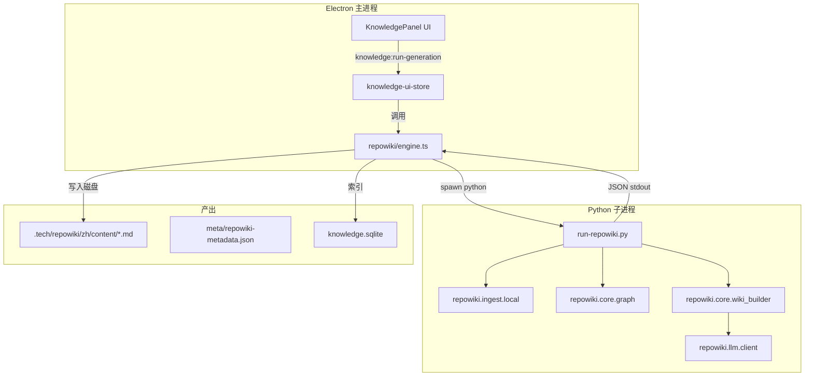
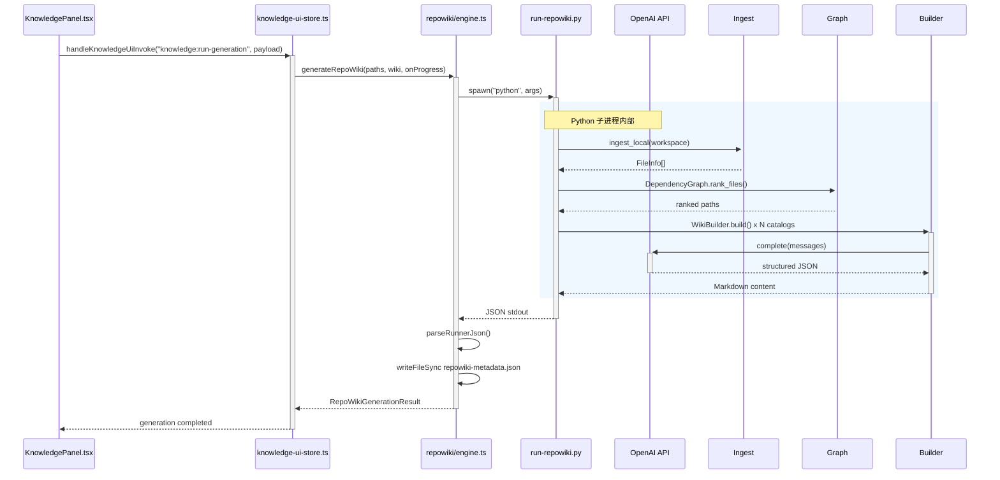

# Repo Wiki Python Runner

> **所属主题**：topic-repo-wiki-python-runner
> **适用对象**：新加入 tech-cc-hub 项目的开发者、需要修改知识库生成链路的工程师和 Code Agent
> **文档性质**：内部技术规范，非 PRD 或用户手册

---

## 目录

- [概述与职责边界](#概述与职责边界)
- [核心数据流](#核心数据流)
- [上游调用链：从 UI 到 Python Runner](#上游调用链从-ui-到-python-runner)
- [下游产出：Markdown 与元数据](#下游产出现有的-markdown-与元数据)
- [入口函数与关键逻辑](#入口函数与关键逻辑)
- [修改指南：添加新的模块映射或文档模板](#修改指南添加新的模块映射或文档模板)
- [回归验证方式](#回归验证方式)
- [常见失败模式与排障步骤](#常见失败模式与排障步骤)
- [扩展点与注意事项](#扩展点与注意事项)

---

## 概述与职责边界

**入口文件**：[scripts/knowledge/run-repowiki.py](file://scripts/knowledge/run-repowiki.py#L1-L34)

`scripts/knowledge/run-repowiki.py` 是 tech-cc-hub 对 vendored RepoWiki 引擎的 Python 适配层。它从 Electron 主进程通过 `spawn` 调用，运行在独立的 Python 子进程中，负责以下职责：

1. **扫描工作区**：调用 `repowiki.ingest.local.ingest_local` 读取所有可文档化文件，过滤 `node_modules/`、`dist/`、`third_party/` 等目录
2. **构建依赖图**：调用 `repowiki.core.graph.DependencyGraph` 分析 import/export 关系
3. **生成主题目录**：根据文件路径模式和图谱排名决定 Wiki 章节（catalog），包括"项目概述"、"快速开始"、"核心架构设计"、"知识库和Repo Wiki系统"等
4. **LLM 调用与 Markdown 产出**：调用 `repowiki.core.wiki_builder.WikiBuilder` 配合 `repowiki.llm.client.LLMClient` 逐模块生成结构化文档
5. **汇总结果**：在 stdout 末尾输出 JSON，包含 `scannedFiles`、`pageCount`、`generatedFiles` 等字段



**章节来源**：[engine.ts#L145-L213](file://src/electron/libs/knowledge/repowiki/engine.ts#L145-L213)（`runVendoredRepoWiki` 函数）

---

## 核心数据流

### 1. 文件过滤与可文档化判断

`run-repowiki.py` 通过 `_is_documentable_file`（[第 111-134 行](file://scripts/knowledge/run-repowiki.py#L111-L134)）过滤文件：

```python
# 排除目录
if lower.startswith((".git/", ".tech/", ".venv/", "node_modules/", "dist/", "third_party/")):
    return False
# 排除二进制格式
if lower.endswith((".png", ".jpg", ".lock", ".sqlite", ".wasm", ".ttf")):
    return False
```

### 2. 模块映射与优先级

`_module_for_path`（[第 288-324 行](file://scripts/knowledge/run-repowiki.py#L288-L324)）根据路径将文件映射到逻辑模块名称，`_module_priority`（[第 351-373 行](file://scripts/knowledge/run-repowiki.py#L351-L373)）决定文档顺序：

| 模块 key | 显示标题 | 优先级 |
|---|---|---|
| `knowledge-engine` | 知识库后端引擎 | 120 |
| `knowledge-ui` | 知识库前端交互 | 118 |
| `electron-runtime` | Electron 运行时 | 108 |
| `ui-shell` | 前端 Shell 与组件 | 102 |
| `scripts` | 工程脚本 | 62 |

### 3. 文件排名与关键文件提取

`_rank_file`（[第 151-164 行](file://scripts/knowledge/run-repowiki.py#L151-L164)）综合图谱排名、路径前缀、是否为入口文件等因素给文件打分，`_key_file_summary`（[第 167-187 行](file://scripts/knowledge/run-repowiki.py#L167-L187)）提取前 80 个高分文件供 LLM 参考。

---

## 上游调用链：从 UI 到 Python Runner



**关键步骤说明**：

1. **UI 触发**：`KnowledgePanel.tsx` 调用 `knowledge:run-generation` IPC channel（[knowledge-ui-store.ts#L349-L351](file://src/electron/libs/knowledge/knowledge-ui-store.ts#L349-L351)）
2. **状态更新**：`knowledge-ui-store.ts` 的 `runKnowledgeGeneration` 管理生成状态（idle → generating → completed）
3. **子进程启动**：TypeScript 层通过 `spawn` 启动 Python，传递 `--workspace`、`--output`、`--cache`、`--model`、`--api-base` 等参数
4. **进度解析**：`parseRepoWikiProgress`（[engine.ts#L86-142](file://src/electron/libs/knowledge/repowiki/engine.ts#L86-L142)）监听 stderr 中的 JSON 行，转换为 `stage` 和 `message`
5. **结果聚合**：`generateRepoWiki`（[engine.ts#L215-277](file://src/electron/libs/knowledge/repowiki/engine.ts#L215-L277)）读取 Python 输出的 JSON，写入 `repowiki-metadata.json`

---

## 下游产出现有的 Markdown 与元数据

### Markdown 文件结构

生成后的 Markdown 放在 `{workspace}/.tech/repowiki/zh/content/` 目录，典型结构：

```
modules/
  知识库后端引擎.md
  知识库前端交互.md
  Electron 运行时.md
  前端 Shell 与组件.md
  工程脚本.md
index.md          # 项目概览
agent-playbook.md # Agent 作业手册
architecture.md   # 架构
dependencies.md   # 依赖关系（Mermaid 图）
```

### 元数据 schema

`repowiki-metadata.json`（[engine.ts#L248-269](file://src/electron/libs/knowledge/repowiki/engine.ts#L248-L269)）包含：

| 字段 | 含义 |
|---|---|
| `version` | 元数据格式版本（当前为 3） |
| `engine` | 生成引擎标识 |
| `upstream.vendoredPath` | `third_party/repowiki` |
| `scannedFiles` | 扫描文件总数 |
| `pageCount` | 生成的 Wiki 页面数 |
| `tokens` | LLM input/output token 统计 |
| `pages[]` | 页面 ID、标题、路径、父子关系 |

### Agent Cards

额外的卡片放在 `{workspace}/.tech/repowiki/zh/agent-cards/`，每个卡片对应一个具体任务（如"知识库索引与向量写入"），包含 `entryFiles`、`validation`、`risks` 等字段。

---

## 入口函数与关键逻辑

### Python 端主要函数

| 函数 | 位置 | 职责 |
|---|---|---|
| `_repo_root()` | [L18](file://scripts/knowledge/run-repowiki.py#L18) | 计算项目根目录 |
| `_is_documentable_file()` | [L111](file://scripts/knowledge/run-repowiki.py#L111) | 过滤扫描范围 |
| `_project_source_hash()` | [L137](file://scripts/knowledge/run-repowiki.py#L137) | 生成源码哈希用于缓存失效判断 |
| `_fallback_catalogs()` | [L190](file://scripts/knowledge/run-repowiki.py#L190) | 根据项目路径特征生成默认主题目录 |
| `_target_catalog_count()` | [L277](file://scripts/knowledge/run-repowiki.py#L277) | 计算目标页面数（默认 48，上限 96） |
| `_module_for_path()` | [L288](file://scripts/knowledge/run-repowiki.py#L288) | 路径到模块名的映射 |
| `_complete_with_retries()` | [L88](file://scripts/knowledge/run-repowiki.py#L88) | LLM 调用带指数退避重试（最多 3 次） |

### TypeScript 端主要函数

| 函数 | 位置 | 职责 |
|---|---|---|
| `findRepoRoot()` | [engine.ts#L40](file://src/electron/libs/knowledge/repowiki/engine.ts#L40) | 查找 vendored RepoWiki 位置 |
| `pythonExecutable()` | [engine.ts#L50](file://src/electron/libs/knowledge/repowiki/engine.ts#L50) | 确定 Python 路径（支持 `TECH_CC_HUB_PYTHON`） |
| `resolveRepoWikiConcurrency()` | [engine.ts#L54](file://src/electron/libs/knowledge/repowiki/engine.ts#L54) | 并发度：free 模型默认 2，paid 模型默认 6 |
| `runVendoredRepoWiki()` | [engine.ts#L145](file://src/electron/libs/knowledge/repowiki/engine.ts#L145) | 子进程管理、stdout/stderr 收集 |
| `generateRepoWiki()` | [engine.ts#L215](file://src/electron/libs/knowledge/repowiki/engine.ts#L215) | 主导出函数，聚合结果并写元数据 |

---

## 修改指南：添加新的模块映射或文档模板

### 场景 1：添加新的默认主题目录

如果项目包含新子模块（如 "插件系统"），需要添加 `_fallback_catalogs` 中的条目：

```python
# 位置：scripts/knowledge/run-repowiki.py 第 265-273 行附近
if any("plugin" in path for path in paths):
    catalogs.append({
        "name": "插件与技能系统",
        "description": "plugin-skill-system",
        "prompt": "创建插件和技能系统文档，说明注册、生命周期、扩展点和调用链。",
        "dependent_files": ["src/electron/libs/plugin/", "src/shared/plugin-registry.ts"],
        "parent": "核心架构设计",
        "order": 7,  # 注意调整 order 顺序
    })
```

**回归验证**：运行 `scripts/qa/knowledge-engine-smoke.mjs`，检查 `wikiCatalogs` 中是否包含新目录名称。

### 场景 2：调整文件排名权重

如果希望优先展示某类文件（如 test 文件），修改 `_rank_file`（[第 151-164 行](file://scripts/knowledge/run-repowiki.py#L151-L164)）中的分数调整：

```python
if "/test" in path or path.startswith("test/"):
    score -= 25  # 当前：降低优先级
    # score += 50  # 修改后：提高优先级（如果需要）
```

### 场景 3：修改并发度行为

`resolveRepoWikiConcurrency`（[engine.ts#L54-59](file://src/electron/libs/knowledge/repowiki/engine.ts#L54-L59)）读取环境变量 `TECH_CC_HUB_REPOWIKI_CONCURRENCY`，可通过设置环境变量临时覆盖，无需修改代码。

### 场景 4：修改 Markdown 模板

TypeScript 端的 Markdown 构建逻辑在 `builder.ts`：

- `buildOverviewPage` → 项目概览格式（[builder.ts#L88-195](file://src/electron/libs/knowledge/repowiki/builder.ts#L88-L195)）
- `buildModulePage` → 模块页格式（[builder.ts#L252-332](file://src/electron/libs/knowledge/repowiki/builder.ts#L252-L332)）
- `buildAgentPlaybookPage` → Agent 作业手册格式（[builder.ts#L367-405](file://src/electron/libs/knowledge/repowiki/builder.ts#L367-L405)）

---

## 回归验证方式

### 1. UI 冒烟测试

```bash
# 运行 Playwright 冒烟测试
node scripts/qa/knowledge-ui-smoke.cjs
```

检查项（[knowledge-ui-smoke.cjs](file://scripts/qa/knowledge-ui-smoke.cjs#L1-L164)）：
- 生成状态显示"已完成"
- 目录按钮数量 ≥ 3
- 嵌套分区渲染正常
- 无占位符文本（"后续接入真实"、"未生成正文"等）

### 2. 引擎完整性测试

```bash
# 运行引擎 QA
node scripts/qa/knowledge-engine-smoke.mjs
```

检查项（[knowledge-engine-smoke.mjs](file://scripts/qa/knowledge-engine-smoke.mjs#L65-L158)）：
- `indexedDocuments` ≥ 60
- `indexedChunks` ≥ 300
- Wiki 页面数 40-80
- `citePages` ≥ 60% 页面包含 `<cite>` 引用
- `mermaidPages` ≥ 25% 页面包含 Mermaid 图
- Agent Cards 字段完整（`entryFiles`、`validation`、`risks`）

### 3. 元数据一致性

```bash
# 验证元数据与文件数量匹配
sqlite3 $APP_DATA/knowledge/knowledge-ui.sqlite \
  "SELECT status, completed, total FROM knowledge_ui_generation WHERE workspace_key = '$WORKSPACE';"
# 期望：completed = total, failed = 0
```

---

## 常见失败模式与排障步骤

### 故障 1：Python 子进程找不到

**症状**：`spawn` 报错 "ENOENT" 或 "python not found"

**排查步骤**：
1. 检查 `pythonExecutable()` 返回值（[engine.ts#L50-51](file://src/electron/libs/knowledge/repowiki/engine.ts#L50-L51)）
2. 确认环境变量 `TECH_CC_HUB_PYTHON` 或 `PYTHON` 已正确设置
3. 在终端运行 `which python3`（macOS/Linux）或 `where python`（Windows）

### 故障 2：LLM 返回空内容

**症状**：`RuntimeError: LLM returned empty content`

**排查步骤**：
1. 检查 API Key 是否有效：`echo $TECH_WIKI_API_KEY`
2. 查看 `TECH_WIKI_API_BASE` 是否指向正确的 endpoint
3. `_complete_with_retries`（[run-repowiki.py#L88-104](file://scripts/knowledge/run-repowiki.py#L88-L104)）已有指数退避重试，检查日志中的 "attempt" 次数
4. 确认模型名称格式正确（如 `openai/gpt-4o` 或纯模型名）

### 故障 3：JSON 解析失败

**症状**：`RepoWiki runner 没有返回 JSON`

**排查步骤**：
1. `parseRunnerJson`（[engine.ts#L62-72](file://src/electron/libs/knowledge/repowiki/engine.ts#L62-L72)）从 stdout 末尾向前查找 JSON 行
2. 检查 stderr 是否有 Python 错误堆栈（`[repowiki]` 前缀的日志）
3. 确认 Python 包依赖完整：`pip show repowiki` 或查看 `third_party/repowiki/src`

### 故障 4：生成页面数异常

**症状**：`pageCount` 为 0 或远超预期（> 96）

**排查步骤**：
1. `_target_catalog_count`（[run-repowiki.py#L277-285](file://scripts/knowledge/run-repowiki.py#L277-L285)）受 `TECH_CC_HUB_REPOWIKI_TARGET_PAGES` 环境变量控制
2. 检查 `_is_documentable_file` 是否误过滤了源文件
3. 验证 `_project_source_hash` 缓存：删除 `repowiki-cache.sqlite` 强制重新生成

### 故障 5：Mermaid 图未生成

**症状**：`dependencies.md` 存在但不含 Mermaid 代码块

**排查步骤**：
1. 确认 `graph.toMermaid()` 返回非空（[builder.ts#L69](file://src/electron/libs/knowledge/repowiki/builder.ts#L69)）
2. 检查 `DependencyGraph` 是否正确构建（无循环依赖或空图）
3. 验证 `third_party/repowiki/src/repowiki/core/graph.py` 中的 `to_mermaid` 方法

---

## 扩展点与注意事项

### 扩展点 1：自定义主题目录模板

通过 `TECH_CC_HUB_REPOWIKI_TARGET_PAGES` 环境变量可控制生成页面数的软上限。硬上限由 `max(18, min(96, files + 8))` 决定，防止小型项目生成过多噪音页面。

### 扩展点 2：代码智能信号注入

`intelligence.ts` 中的 `buildRepoWikiIntelligence`（[intelligence.ts#L50-92](file://src/electron/libs/knowledge/repowiki/intelligence.ts#L50-L92)）提取高价值文件、IPC 通道、MCP 工具、数据库表等信号，这些信号会被格式化为 prompt 注入 LLM 调用。如需新增信号类型（如 "workflow"），需同步修改 `types.ts` 中的 `RepoWikiFileSignal` 定义。

### 扩展点 3：进度事件的前端渲染

`RepoWikiProgressEvent`（[engine.ts#L17-22](file://src/electron/libs/knowledge/repowiki/engine.ts#L17-L22)）定义了 stage 枚举。UI 层通过 `onProgress` callback 接收事件，KnowledgePanel 根据 stage 渲染不同的 UI 状态。如需新增 stage（如 "summarizing"），需同步修改 UI 组件。

### 注意事项

1. **缓存失效**：`repowiki-cache.sqlite` 基于源码哈希判断是否需要重新分析文件，修改 `_is_documentable_file` 后需清除缓存
2. **并发安全**：`resolveRepoWikiConcurrency` 返回值限制在 1-12 之间，避免过多并发请求导致 LLM API 限流
3. **中文优先**：命令行传入 `--language zh`，但 LLM 输出质量仍取决于模型的中文能力
4. **Mermaid 兼容性**：生成的 Mermaid 图应兼容主流渲染器，避免使用实验性语法

---

**图表来源**

- 总体数据流图：基于 [engine.ts#L145-L213](file://src/electron/libs/knowledge/repowiki/engine.ts#L145-L213) 和 [run-repowiki.py#L1-L34](file://scripts/knowledge/run-repowiki.py#L1-L34) 绘制
- 调用时序图：基于 [knowledge-ui-store.ts#L349-L351](file://src/electron/libs/knowledge/knowledge-ui-store.ts#L349-L351)、[engine.ts#L145-213](file://src/electron/libs/knowledge/repowiki/engine.ts#L145-L213) 和 [run-repowiki.py#L88-L104](file://scripts/knowledge/run-repowiki.py#L88-L104) 绘制

---

<cite>
**本文引用的文件**

- [scripts/knowledge/run-repowiki.py](file://scripts/knowledge/run-repowiki.py)
- [src/electron/libs/knowledge/repowiki/engine.ts](file://src/electron/libs/knowledge/repowiki/engine.ts)
- [src/electron/libs/knowledge/repowiki/intelligence.ts](file://src/electron/libs/knowledge/repowiki/intelligence.ts)
- [scripts/qa/knowledge-ui-smoke.cjs](file://scripts/qa/knowledge-ui-smoke.cjs)
- [src/electron/libs/knowledge/knowledge-ui-store.ts](file://src/electron/libs/knowledge/knowledge-ui-store.ts)
- [src/electron/libs/knowledge/repowiki/builder.ts](file://src/electron/libs/knowledge/repowiki/builder.ts)
- [src/electron/libs/knowledge/repowiki/types.ts](file://src/electron/libs/knowledge/repowiki/types.ts)
- [scripts/qa/knowledge-engine-smoke.mjs](file://scripts/qa/knowledge-engine-smoke.mjs)
- [src/electron/libs/knowledge/knowledge-overview.ts](file://src/electron/libs/knowledge/knowledge-overview.ts)
</cite>