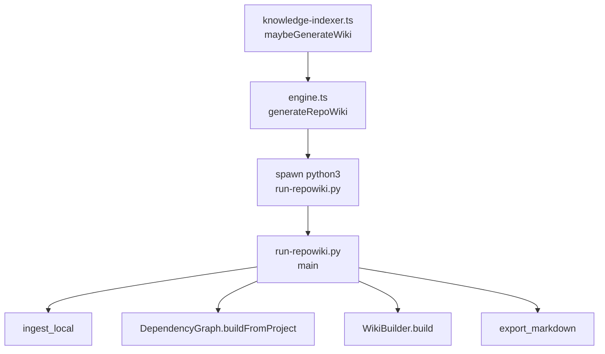
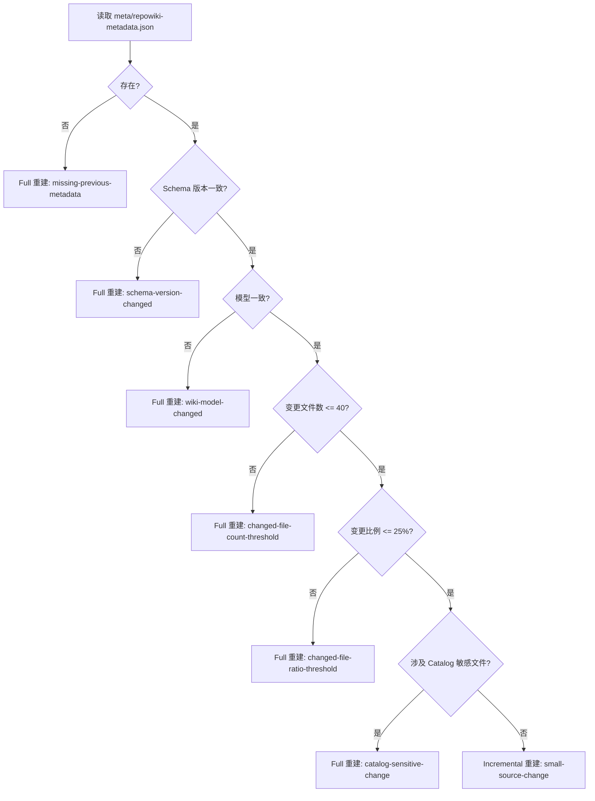
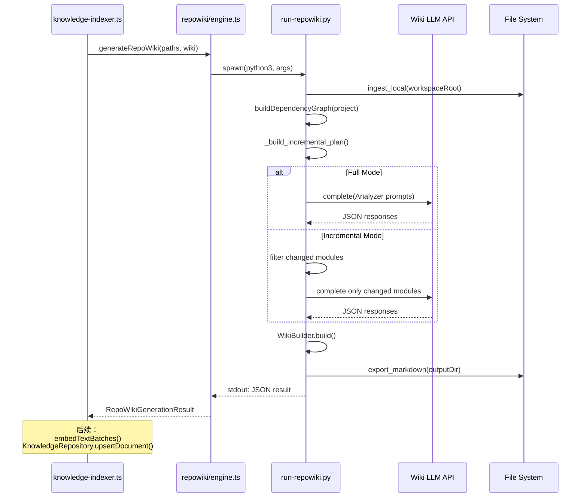

# Repo Wiki Python Runner

<cite>
**本文引用的文件**
- [scripts/knowledge/run-repowiki.py](file://scripts/knowledge/run-repowiki.py)
- [src/electron/libs/knowledge/agent-cards.ts](file://src/electron/libs/knowledge/agent-cards.ts)
- [src/electron/libs/knowledge/embedding-client.ts](file://src/electron/libs/knowledge/embedding-client.ts)
- [src/electron/libs/knowledge/knowledge-indexer.ts](file://src/electron/libs/knowledge/knowledge-indexer.ts)
- [src/electron/libs/knowledge/knowledge-model-settings.ts](file://src/electron/libs/knowledge/knowledge-model-settings.ts)
- [src/electron/libs/knowledge/knowledge-overview.ts](file://src/electron/libs/knowledge/knowledge-overview.ts)
- [src/electron/libs/knowledge/knowledge-paths.ts](file://src/electron/libs/knowledge/knowledge-paths.ts)
- [src/electron/libs/knowledge/knowledge-repository.ts](file://src/electron/libs/knowledge/knowledge-repository.ts)
- [src/electron/libs/knowledge/knowledge-types.ts](file://src/electron/libs/knowledge/knowledge-types.ts)
- [src/electron/libs/knowledge/knowledge-ui-store.ts](file://src/electron/libs/knowledge/knowledge-ui-store.ts)
- [src/electron/libs/knowledge/knowledge-utils.ts](file://src/electron/libs/knowledge/knowledge-utils.ts)
- [src/electron/libs/knowledge/repowiki/analyzer.ts](file://src/electron/libs/knowledge/repowiki/analyzer.ts)
- [src/electron/libs/knowledge/repowiki/builder.ts](file://src/electron/libs/knowledge/repowiki/builder.ts)
- [src/electron/libs/knowledge/repowiki/engine.ts](file://src/electron/libs/knowledge/repowiki/engine.ts)
- [src/electron/libs/knowledge/repowiki/exporter.ts](file://src/electron/libs/knowledge/repowiki/exporter.ts)
- [src/electron/libs/knowledge/repowiki/graph.ts](file://src/electron/libs/knowledge/repowiki/graph.ts)
- [src/electron/libs/knowledge/repowiki/intelligence.ts](file://src/electron/libs/knowledge/repowiki/intelligence.ts)
- [src/electron/libs/knowledge/repowiki/prompts.ts](file://src/electron/libs/knowledge/repowiki/prompts.ts)
</cite>

---

## 目录

- [1. 职责概述](#1-职责概述)
- [2. 入口与调用链](#2-入口与调用链)
- [3. 核心数据结构](#3-核心数据结构)
- [4. 增量构建机制](#4-增量构建机制)
- [5. LLM 调用与重试策略](#5-llm-调用与重试策略)
- [6. 输出产物与文件布局](#6-输出产物与文件布局)
- [7. 前后端边界与桥接点](#7-前后端边界与桥接点)
- [8. 常见失败模式与排障](#8-常见失败模式与排障)
- [9. Agent 改代码地图](#9-agent-改代码地图)
- [10. 扩展点与配置项](#10-扩展点与配置项)

---

## 1. 职责概述

`scripts/knowledge/run-repowiki.py` 是 **RepoWiki Python 引擎的 TypeScript 适配层**，负责：

1. **吞入（Ingest）**：扫描项目源文件，构建 `FileInfo` 对象
2. **图谱构建**：生成模块依赖图 `DependencyGraph`
3. **分析（Analyze）**：调用 LLM 生成 Overview、Module、Architecture 等 Wiki 数据
4. **构建（Build）**：将 Wiki 数据渲染为 Markdown 文件
5. **导出（Export）**：输出 Sidebar 和页面文件到 `.tech/repowiki/zh/`
6. **增量决策**：根据源码哈希变化决定执行 Full 或 Incremental 模式

> 章节来源：[file://scripts/knowledge/run-repowiki.py#L1-L3](file://scripts/knowledge/run-repowiki.py#L1-L3)

---

## 2. 入口与调用链

### 2.1 TypeScript 触发入口

`engine.ts` 的 `generateRepoWiki()` 是触发 Python Runner 的唯一入口：

```typescript
// src/electron/libs/knowledge/repowiki/engine.ts#L217-L220
export async function generateRepoWiki(
  paths: KnowledgeWorkspacePaths,
  wiki: WikiModelSettings,
  onProgress?: (event: RepoWikiProgressEvent) => void,
): Promise<RepoWikiGenerationResult>
```

调用链：



> 图表来源：[file://src/electron/libs/knowledge/repowiki/engine.ts#L146-L213](file://src/electron/libs/knowledge/repowiki/engine.ts#L146-L213)

### 2.2 Python main 入口

```python
# scripts/knowledge/run-repowiki.py#L1
# ...
from repowiki.core.analyzer import Analyzer
from repowiki.core.cache import Cache
from repowiki.core.graph import DependencyGraph
from repowiki.core.models import FileInfo
from repowiki.core.wiki_builder import WikiBuilder
from repowiki.export.markdown import export_markdown
from repowiki.ingest.local import ingest_local
from repowiki.llm.client import LLMClient
```

`main()` 函数完成以下步骤：

1. 解析命令行参数
2. 调用 `ingest_local()` 扫描项目文件
3. 构建 `DependencyGraph`
4. 调用 `_build_incremental_plan()` 决定构建模式
5. 实例化 `Analyzer`、`WikiBuilder`、`LLMClient`
6. 调用 `WikiBuilder.build()` 生成 Wiki 数据
7. 调用 `export_markdown()` 输出文件
8. 输出 JSON 结果到 stdout

> 章节来源：[file://scripts/knowledge/run-repowiki.py#L33-L40](file://scripts/knowledge/run-repowiki.py#L33-L40)

---

## 3. 核心数据结构

### 3.1 关键配置常量

| 常量名 | 值 | 用途 |
|--------|-----|------|
| `SCHEMA_VERSION` | `"1.0"` | 元数据版本标识 |
| `DEFAULT_INCREMENTAL_MAX_CHANGED_FILES` | `40` | 触发 Full 重建的文件数阈值 |
| `DEFAULT_INCREMENTAL_CHANGE_RATIO` | `0.25` | 触发 Full 重建的变化比例阈值 |
| `DEFAULT_REPOWIKI_MAX_PAGES` | `96` | 最大页面数 |
| `DEFAULT_REPOWIKI_MAX_OUTPUT_TOKENS` | `672_000` | 最大输出 Token 数 |
| `ESTIMATED_OUTPUT_TOKENS_PER_PAGE` | `7_000` | 每页 Token 估算 |

> 章节来源：[file://scripts/knowledge/run-repowiki.py#L26-L31](file://scripts/knowledge/run-repowiki.py#L26-L31)

### 3.2 关键函数符号

| 函数名 | 行号 | 职责 |
|--------|------|------|
| `_repo_root()` | 16 | 计算项目根目录 |
| `_normalize_model()` | 41 | 标准化模型名称（如 `gpt-4o` → `openai/gpt-4o`） |
| `_collect_markdown()` | 51 | 收集已生成的 Markdown 文件列表 |
| `_slugify_title()` | 63 | 将标题转为 URL-safe slug |
| `_strip_json_fence()` | 68 | 去除 JSON 代码块包装 |
| `_extract_json()` | 75 | 从 LLM 输出中提取 JSON（含容错解析） |
| `_complete_with_retries()` | 93 | LLM 调用（含指数退避重试） |
| `_hash_text()` | 112 | SHA-256 哈希 |
| `_is_documentable_file()` | 116 | 判断文件是否应纳入 Wiki |
| `_project_source_hash()` | 142 | 计算整个项目的源码哈希 |
| `_project_file_hashes()` | 149 | 计算每个文件的哈希 |
| `_diff_file_hashes()` | 174 | 对比新旧文件哈希差异 |
| `_build_incremental_plan()` | 269 | 决策增量/全量构建 |
| `_metadata_catalogs()` | 244 | 解析 `wiki_catalogs` 元数据 |
| `_catalog_depends_on_changed_files()` | 201 | 判断 Catalog 是否依赖变更文件 |

### 3.3 排除文件规则

`_is_documentable_file()` 排除以下路径和扩展名：

```python
# 排除路径前缀
".git/", ".tech/", ".qoder/", ".venv/", "node_modules/",
"dist/", "dist-react/", "dist-electron/", "build/", "coverage/",
"tmp/", "third_party/"

# 排除扩展名
".png", ".jpg", ".jpeg", ".gif", ".webp", ".svg", ".ico",
".lock", ".sqlite", ".db", ".wasm", ".ttf", ".otf"
```

> 章节来源：[file://scripts/knowledge/run-repowiki.py#L118-L141](file://scripts/knowledge/run-repowiki.py#L118-L141)

---

## 4. 增量构建机制

### 4.1 决策流程



### 4.2 敏感文件判定

`_is_catalog_sensitive_file()` 判定以下文件为敏感文件，修改它们会触发 Catalog 重建：

| 类型 | 示例 |
|------|------|
| 构建配置 | `package.json`, `vite.config.ts`, `tsconfig.json`, `pyproject.toml` |
| 路由/页面 | `/routes/`, `/pages/`, `/app/` |
| 核心模块 | `/mcp-tools/`, `/knowledge/`, `/repowiki/`, `/plugins/`, `/skills/` |

> 章节来源：[file://scripts/knowledge/run-repowiki.py#L214-L241](file://scripts/knowledge/run-repowiki.py#L214-L241)

### 4.3 输出决策结果

```python
{
  "enabled": True,
  "mode": "full" | "incremental",
  "reason": "changed-file-count-threshold",
  "reasons": [...],
  "changedFiles": [...],
  "addedFiles": [...],
  "modifiedFiles": [...],
  "deletedFiles": [...],
  "changedFileCount": 42,
  "changedFileRatio": 0.15,
  "catalogChanged": False
}
```

---

## 5. LLM 调用与重试策略

### 5.1 重试实现

```python
# scripts/knowledge/run-repowiki.py#L95-L111
async def _complete_with_retries(
    llm: LLMClient,
    messages: list[dict],
    *,
    temperature: float,
    max_tokens: int,
    attempts: int = 3,
) -> str:
    last_text = ""
    for attempt in range(1, max(1, attempts) + 1):
        text = await llm.complete(messages, temperature=temperature, max_tokens=max_tokens)
        last_text = text.strip()
        if last_text and not last_text.startswith("[LLM Error:"):
            return text
        if attempt < attempts:
            await asyncio.sleep(min(8, 2 ** (attempt - 1)))  # 指数退避: 1s, 2s, 4s
    raise RuntimeError(last_text or "LLM returned empty content")
```

### 5.2 模型名称标准化

```python
# scripts/knowledge/run-repowiki.py#L43-L50
def _normalize_model(model: str, api_base: str) -> str:
    if not model:
        return model
    if "/" in model:  # 已包含厂商前缀
        return model
    if api_base:  # 有 API Base 则添加 "openai/" 前缀
        return f"openai/{model}"
    return model
```

### 5.3 JSON 提取容错

当 LLM 返回的 JSON 被 Markdown 代码块包裹或包含噪声时，`_extract_json()` 能智能定位 JSON 边界：

1. 尝试 `json.loads()` 直接解析
2. 失败则寻找第一个 `{` 或 `[` 的位置
3. 从该位置向后逐步扩展边界尝试解析

> 章节来源：[file://scripts/knowledge/run-repowiki.py#L77-L92](file://scripts/knowledge/run-repowiki.py#L77-L92)

---

## 6. 输出产物与文件布局

### 6.1 目录结构

```
{workspaceRoot}/
├── .tech/
│   └── repowiki/
│       └── zh/
│           ├── content/           # Markdown 页面
│           │   ├── index.md
│           │   ├── architecture.md
│           │   ├── agent-playbook.md
│           │   ├── runtime-flows.md
│           │   ├── api-surface.md
│           │   ├── dependencies.md
│           │   ├── reading-guide.md
│           │   └── modules/
│           │       ├── electron-runtime.md
│           │       ├── knowledge-engine.md
│           │       └── ...
│           ├── agent-cards/       # Agent Cards
│           │   ├── _index.json
│           │   ├── flow-runtime-startup.md
│           │   └── ...
│           ├── meta/
│           │   └── repowiki-metadata.json  # 构建元数据
│           └── _sidebar.md        # 导航侧边栏
└── (appData)/
    └── knowledge/
        └── {workspaceHash}/
            ├── repowiki-cache.sqlite  # LLM 响应缓存
            └── knowledge.sqlite      # 向量索引库
```

### 6.2 元数据结构

```json
{
  "schemaVersion": "1.0",
  "wikiModel": "gpt-4o",
  "language": "zh",
  "sourceHash": "abc123...",
  "sourceFiles": {
    "src/main.ts": "hash1",
    "src/index.ts": "hash2"
  },
  "wikiCatalogs": [
    {
      "name": "架构设计",
      "prompt": "为架构设计更新 Repo Wiki 文档。",
      "dependent_files": ["src/architecture/", "doc/"],
      "order": 1
    }
  ],
  "generationMode": "full",
  "generatedAt": 1704067200000
}
```

> 章节来源：[file://scripts/knowledge/run-repowiki.py#L172-L173](file://scripts/knowledge/run-repowiki.py#L172-L173)

---

## 7. 前后端边界与桥接点

### 7.1 TypeScript → Python 桥接

| 方向 | 机制 |
|------|------|
| 参数传递 | `spawn()` 命令行参数（`--workspace`, `--model`, `--api-base` 等） |
| 环境变量 | `TECH_WIKI_MODEL`, `TECH_WIKI_API_KEY`, `TECH_WIKI_API_BASE`, `PYTHONPATH` |
| 进度回调 | stderr 输出 JSON Lines → `parseRepoWikiProgress()` |
| 结果接收 | stdout 最后一行 JSON → `parseRunnerJson()` |

### 7.2 环境变量映射

| Python 环境变量 | TypeScript 来源 |
|----------------|----------------|
| `TECH_WIKI_MODEL` | `wiki.model` |
| `TECH_WIKI_API_KEY` | `wiki.apiKey` |
| `TECH_WIKI_API_BASE` | `wiki.baseURL` |
| `PYTHONPATH` | `third_party/repowiki/src` |
| `TECH_CC_HUB_REPOWIKI_CONCURRENCY` | Process.env |

> 章节来源：[file://src/electron/libs/knowledge/repowiki/engine.ts#L176-L180](file://src/electron/libs/knowledge/repowiki/engine.ts#L176-L180)

### 7.3 状态重置边界

| 状态变更 | 是否需要重启 Electron |
|----------|---------------------|
| 修改 `scripts/knowledge/run-repowiki.py` | **是**（需要重启 Python 进程） |
| 修改 `third_party/repowiki/` | **是**（需要重启 Python 进程） |
| 修改 `WikiModelSettings`（模型配置） | **是**（通过 IPC 刷新） |
| 修改增量元数据 `.tech/repowiki/zh/meta/` | **否**（下次生成时自动生效） |

---

## 8. 常见失败模式与排障

### 8.1 常见失败模式

| 错误 | 原因 | 解决方案 |
|------|------|----------|
| `找不到 vendored RepoWiki：third_party/repowiki` | Repo 未初始化 submodule 或目录被删除 | 执行 `git submodule update --init` |
| `RepoWiki runner 没有返回 JSON` | Python 脚本 crash 或输出格式错误 | 检查 stderr 输出和 Python 环境 |
| `LLM returned empty content` | API Key 无效或 Rate Limit | 验证 `TECH_WIKI_API_KEY` 配置 |
| `sqlite-vec unavailable` | 扩展未加载或版本不兼容 | 检查 `better-sqlite3` 和 `sqlite-vec` 版本 |
| `embedding dimension mismatch` | 模型维度与配置不一致 | 确认 `knowledge-model-settings.ts` 中 `KNOWN_EMBEDDING_DIMENSIONS` |
| `incremental_max_changed_files` 超限 | 源码变化过大触发 Full 重建 | 调整阈值或清理 `.tech` 重新生成 |

### 8.2 排障命令

```bash
# 直接运行 Python Runner（调试用）
python3 scripts/knowledge/run-repowiki.py \
  --workspace . \
  --output .tech/repowiki/zh \
  --cache /tmp/repowiki-cache.sqlite \
  --model gpt-4o \
  --api-base https://api.openai.com/v1 \
  --language zh

# 检查增量计划
python3 -c "
import json
from pathlib import Path
meta = json.loads(Path('.tech/repowiki/zh/meta/repowiki-metadata.json').read_text())
print(json.dumps(meta, indent=2, ensure_ascii=False))
"

# 查看 Python 环境依赖
python3 -c "
from repowiki.core.analyzer import Analyzer
from repowiki.llm.client import LLMClient
print('Vendor imports OK')
"
```

### 8.3 日志层级

| 层级 | 来源 | 内容 |
|------|------|------|
| `console.log` | engine.ts stderr 处理 | Python 输出透传 |
| `RepoWikiProgressEvent` | `parseRepoWikiProgress()` | 结构化进度事件 |
| `index-state.json` | `knowledge-indexer.ts` | 索引最终状态 |

---

## 9. Agent 改代码地图

### 9.1 先读文件（按优先级）

1. **[scripts/knowledge/run-repowiki.py](file://scripts/knowledge/run-repowiki.py)** — Python Runner 入口
2. **[src/electron/libs/knowledge/repowiki/engine.ts](file://src/electron/libs/knowledge/repowiki/engine.ts#L146-L213)** — Python 进程管理
3. **[src/electron/libs/knowledge/knowledge-indexer.ts](file://src/electron/libs/knowledge/knowledge-indexer.ts#L89-L103)** — 整体编排
4. **[src/electron/libs/knowledge/knowledge-model-settings.ts](file://src/electron/libs/knowledge/knowledge-model-settings.ts#L49-L82)** — 模型配置

### 9.2 关键符号与 IP

| 符号/文件 | 用途 |
|----------|------|
| `runVendoredRepoWiki()` | 启动 Python 子进程的核心函数 |
| `generateRepoWiki()` | 暴露给外部的生成入口 |
| `parseRunnerJson()` | 解析 Python stdout 结果 |
| `parseRepoWikiProgress()` | 解析 Python stderr 进度 |
| `_build_incremental_plan()` | 增量决策逻辑 |
| `_complete_with_retries()` | LLM 重试包装 |
| `WikiModelSettings` | wiki 模型配置类型 |
| `RepoWikiProgressEvent` | 进度事件类型 |

### 9.3 修改入口速查

| 改动目标 | 优先修改文件 |
|----------|-------------|
| 调整增量阈值 | `run-repowiki.py` 常量 `DEFAULT_INCREMENTAL_MAX_CHANGED_FILES` |
| 修改排除文件规则 | `_is_documentable_file()` 函数 |
| 新增 LLM 模型支持 | `_normalize_model()` 和 `knowledge-model-settings.ts` |
| 调整重试策略 | `_complete_with_retries()` 参数 |
| 修改输出目录结构 | `knowledge-paths.ts` 中 `repowikiRoot`, `repowikiContentDir` |
| 新增 Wiki 页面类型 | `builder.ts` 的 `RepoWikiBuilder.build()` |

### 9.4 验证命令

```bash
# 单元验证：Python 语法检查
python3 -m py_compile scripts/knowledge/run-repowiki.py

# 集成验证：完整生成
npm run knowledge:index  # 触发 indexKnowledgeWorkspace

# Smoke 测试：检查产出
ls -la .tech/repowiki/zh/content/
cat .tech/repowiki/zh/meta/repowiki-metadata.json | jq '.schemaVersion, .generationMode'
```

### 9.5 常见回归风险

| 风险点 | 影响 | 规避方式 |
|--------|------|----------|
| Python 依赖变更 | Runner 无法启动 | 保持 `third_party/repowiki/` 与 RepoWiki upstream 同步 |
| 环境变量拼写错误 | LLM 调用失败 | 验证 `engine.ts` 中 `TECH_WIKI_*` 变量名 |
| 增量元数据损坏 | 触发意外 Full 重建或遗漏更新 | 定期清理 `.tech/repowiki/zh/meta/` |
| Schema 版本不匹配 | 全量重建 | 修改常量时同步更新 `SCHEMA_VERSION` |

---

## 10. 扩展点与配置项

### 10.1 环境变量配置

| 变量 | 默认值 | 效果 |
|------|--------|------|
| `TECH_CC_HUB_PYTHON` | `python3` | Python 解释器路径 |
| `TECH_CC_HUB_REPOWIKI_CONCURRENCY` | 按 costTier 计算 | 模块分析并发数（1-12） |
| `TECH_CC_HUB_REPOWIKI_MAX_PAGES` | `96` | 最大 Wiki 页面数 |
| `REPOWIKI_MAX_FILES` | `0`（无限制） | 最大扫描文件数 |
| `REPOWIKI_FILE_PAGE_LIMIT` | `0`（无限制） | 单文件最大页数 |

### 10.2 Wiki 模型 Profile 配置

在模型设置中配置 `wikiModel` profile：

```typescript
// knowledge-model-settings.ts#L69-L79
const wiki: WikiModelSettings | undefined = wikiProfile?.wikiModel?.trim()
  ? {
      profileId: wikiProfile.id,
      profileName: wikiProfile.name,
      apiKey: wikiProfile.apiKey.trim(),
      baseURL: wikiProfile.baseURL.replace(/\/$/, ""),
      model: wikiProfile.wikiModel.trim(),
      costTier: normalizeCostTier(wikiProfile.wikiModelCostTier),  // "free" | "cheap" | "standard"
      maxInputTokens: normalizePositiveInteger(wikiProfile.wikiModelMaxInputTokens, 16000),
      maxOutputTokens: normalizePositiveInteger(wikiProfile.wikiModelMaxOutputTokens, 4000),
    }
  : undefined;
```

`costTier` 影响并发数：`free` → 2，`cheap` → 6，`standard` → 6

### 10.3 扩展新文件类型支持

在 `_is_documentable_file()` 中添加扩展名判断：

```python
# 添加 .go 文件
if lower.endswith((".go",)):
    return True
```

### 10.4 扩展新 Wiki Catalog

在 `repowiki-metadata.json` 中声明 `wiki_catalogs`：

```json
{
  "wiki_catalogs": [
    {
      "name": "MCP 工具面",
      "prompt": "为 MCP 工具面更新文档。",
      "dependent_files": ["src/electron/libs/mcp-tools/"],
      "order": 50
    }
  ]
}
```

> 章节来源：[file://scripts/knowledge/run-repowiki.py#L244-L266](file://scripts/knowledge/run-repowiki.py#L244-L266)

---

## 附录：数据流总览



> 图表来源：[file://src/electron/libs/knowledge/repowiki/engine.ts#L146-L213](file://src/electron/libs/knowledge/repowiki/engine.ts#L146-L213) 及 [file://scripts/knowledge/run-repowiki.py#L33-L40](file://scripts/knowledge/run-repowiki.py#L33-L40)
