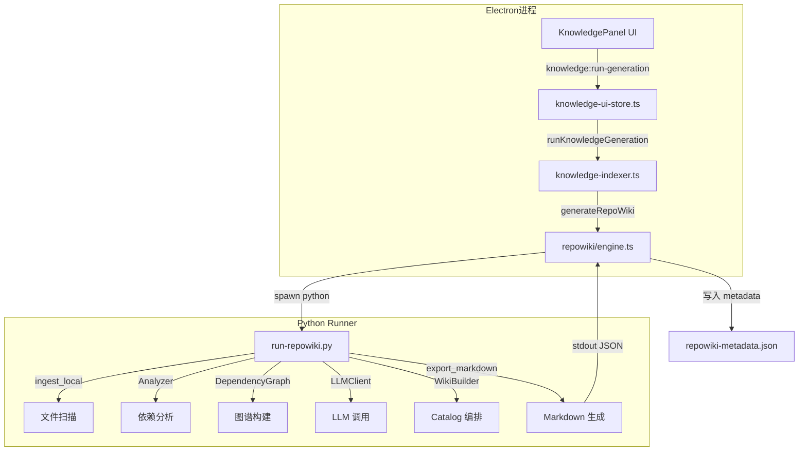
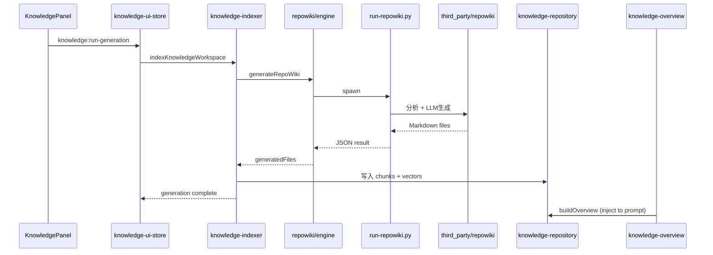

# Repo Wiki Python Runner

<cite>
**本文引用的文件**
- [scripts/knowledge/run-repowiki.py](file://scripts/knowledge/run-repowiki.py)
- [src/electron/libs/knowledge/repowiki/engine.ts](file://src/electron/libs/knowledge/repowiki/engine.ts)
- [src/electron/libs/knowledge/repowiki/intelligence.ts](file://src/electron/libs/knowledge/repowiki/intelligence.ts)
- [scripts/qa/knowledge-ui-smoke.cjs](file://scripts/qa/knowledge-ui-smoke.cjs)
- [src/electron/libs/knowledge/knowledge-ui-store.ts](file://src/electron/libs/knowledge/knowledge-ui-store.ts)
- [src/electron/libs/knowledge/repowiki/builder.ts](file://src/electron/libs/knowledge/repowiki/builder.ts)
- [src/electron/libs/knowledge/repowiki/types.ts](file://src/electron/libs/knowledge/repowiki/types.ts)
- [scripts/qa/knowledge-engine-smoke.mjs](file://scripts/qa/knowledge-engine-smoke.mjs)
- [src/electron/libs/knowledge/knowledge-overview.ts](file://src/electron/libs/knowledge/knowledge-overview.ts)
</cite>

---

## 目录

- [职责概述](#职责概述)
- [入口与调用链](#入口与调用链)
- [核心函数详解](#核心函数详解)
- [数据结构与类型](#数据结构与类型)
- [配置参数与环境变量](#配置参数与环境变量)
- [上下游文件关系](#上下游文件关系)
- [修改功能时的步骤](#修改功能时的步骤)
- [回归验证方式](#回归验证方式)
- [常见失败模式](#常见失败模式)
- [扩展点与设计意图](#扩展点与设计意图)

---

## 职责概述

`run-repowiki.py` 是 vendored RepoWiki 引擎的 **Python 适配层**，负责将项目源代码转化为结构化的 Markdown Wiki 文档。它不是独立运行的工具，而是被 `engine.ts` 通过 `spawn` 子进程调用的后端处理器。

核心职责：

1. **文件扫描与过滤**：遍历项目目录，排除 node_modules、.git 等无效文件，按语言和路径评分排名
2. **依赖图谱构建**：调用 `repowiki` 内部模块分析文件间依赖关系
3. **Catalog 规划**：根据项目结构动态生成 Wiki 目录（catalog），包含项目概述、架构设计、模块文档等
4. **LLM 生成编排**：对每个 catalog 主题调用 LLM 生成 Markdown 内容，支持重试和超时控制
5. **结果序列化**：将生成的 Markdown 文件路径、token 消耗、页面数等元数据以 JSON 形式输出

> **章节来源**：[scripts/knowledge/run-repowiki.py#L2](file://scripts/knowledge/run-repowiki.py#L2) — docstring 明确标注为 "adapter for the vendored he-yufeng/RepoWiki engine"

---

## 入口与调用链

### 调用链路图



### 入口函数

**Python 侧**：`main()` 函数（约第 950 行处）解析命令行参数并执行生成流程。

**TypeScript 侧**：`generateRepoWiki()` 是入口导出函数，定义在 `engine.ts` 第 210-273 行。

```typescript
// src/electron/libs/knowledge/repowiki/engine.ts#L210
export async function generateRepoWiki(
  paths: KnowledgeWorkspacePaths,
  wiki: WikiModelSettings,
  onProgress?: (event: RepoWikiProgressEvent) => void,
): Promise<RepoWikiGenerationResult>
```

### 关键参数

| 参数 | 类型 | 来源 |
|------|------|------|
| `paths.workspaceRoot` | string | 工作区根目录 |
| `paths.repowikiRoot` | string | 输出目录 `.tech/repowiki/zh/content` |
| `wiki.model` | string | LLM 模型名称 |
| `wiki.baseURL` | string | API 端点 |
| `wiki.costTier` | string | `"free"` 控制并发度 |

### 子进程参数

`engine.ts` 第 150-162 行构造 `python` 命令行参数：

```bash
python scripts/knowledge/run-repowiki.py \
  --workspace <workspaceRoot> \
  --output <repowikiRoot> \
  --cache <cachePath> \
  --model <model> \
  --api-base <baseURL> \
  --language zh \
  --concurrency <2|6> \
  --max-files 0 \
  --max-file-size <computed>
```

> **章节来源**：[src/electron/libs/knowledge/repowiki/engine.ts#L150-L162](file://src/electron/libs/knowledge/repowiki/engine.ts#L150-L162)

---

## 核心函数详解

### 1. 文件扫描与过滤

**`_is_documentable_file()`** (第 111-134 行)

判断文件是否应纳入 Wiki 生成范围。排除规则：

```python
# 排除目录前缀
EXCLUDED_PREFIXES = (".git/", ".tech/", ".venv/", "node_modules/", ...)

# 排除文件后缀
EXCLUDED_EXTENSIONS = (".png", ".jpg", ".lock", ".sqlite", ".wasm", ...)
```

**`_project_source_hash()`** (第 137-141 行)

计算项目源码哈希，用于判断是否需要重新生成。若哈希未变，可复用缓存。

### 2. 文件评分与排名

**`_rank_file()`** (第 151-164 行)

根据多个维度对文件打分，决定其在 Wiki 中的重要程度：

| 信号 | 加分 |
|------|------|
| `is_entrypoint` | +200 |
| `is_config` | +90 |
| 路径前缀 `src/` / `app/` / `lib/` / `scripts/` | +60 |
| 关键文件名 (readme.md, package.json, ...) | +120 |
| 测试文件 | -25 |

> **章节来源**：[scripts/knowledge/run-repowiki.py#L151-L164](file://scripts/knowledge/run-repowiki.py#L151-L164)

### 3. Catalog 动态生成

**`_fallback_catalogs()`** (第 190-274 行)

根据项目文件结构动态生成 Wiki 目录。默认 5 个基础 catalog：

- 项目概述
- 快速开始
- 核心架构设计
- API 参考文档
- 故障排除和最佳实践

若检测到特定路径，还会追加：

| 检测条件 | 追加 Catalog |
|----------|-------------|
| `src/ui/` 存在 | 前端界面架构 |
| `src/electron/` 存在 | Electron 运行时和后端服务 |
| `knowledge` 路径存在 | 知识库和 Repo Wiki 系统 |
| `mcp` 路径存在 | MCP 工具系统 |
| `task` / `cron` 路径存在 | 任务和调度系统 |

> **章节来源**：[scripts/knowledge/run-repowiki.py#L190-L274](file://scripts/knowledge/run-repowiki.py#L190-L274)

### 4. LLM 调用与重试

**`_complete_with_retries()`** (第 88-104 行)

```python
async def _complete_with_retries(
    llm: LLMClient,
    messages: list[dict],
    *,
    temperature: float,
    max_tokens: int,
    attempts: int = 3,
) -> str:
```

重试逻辑：

1. 最多重试 3 次
2. 重试间隔：指数退避 `min(8, 2 ** (attempt - 1))` 秒
3. 判断成功：响应非空且不以 `[LLM Error:` 开头

### 5. 模块标题映射

**`_module_for_path()`** (第 288-324 行) 和 **`_module_title()`** (第 327-348 行)

将文件路径映射到中文模块名称。关键映射：

| 路径模式 | 模块标识 |
|----------|----------|
| `/knowledge/` 或 `repowiki` | `knowledge-engine` / `knowledge-ui` |
| `/mcp-tools/` | `mcp-tools` |
| `src/electron/` 含 runner/main/preload | `electron-runtime` |
| `src/ui/components/git/` | `git-workbench` |

> **章节来源**：[scripts/knowledge/run-repowiki.py#L288-L348](file://scripts/knowledge/run-repowiki.py#L288-L348)

---

## 数据结构与类型

### TypeScript 类型定义

`types.ts` 定义了 Wiki 生成相关核心类型：

```typescript
// 源码结构
RepoWikiFileInfo {
  path, absolutePath, size, language, lines,
  preview, content, isConfig, isEntrypoint,
  imports, exports, symbols[], signals[]
}

// 项目上下文
RepoWikiProjectContext {
  name, root, files[], fileTree, totalLines,
  intelligence? // 可选，运行时生成
}

// 项目智能（由 intelligence.ts 构建）
RepoWikiProjectIntelligence {
  scripts[], dependencies[],
  entrypoints[], ipcChannels[], uiIpcCalls[],
  mcpTools[], mcpServers[], databaseTables[],
  stores[], events[], highValueFiles[],
  runtimeFlows[], agentQuestions[]
}

// Wiki 输出结构
WikiData {
  overview: ProjectOverview,
  modules: ModuleDoc[],
  architecture: ArchitectureDiagram,
  reading_guide: ReadingGuide
}
```

> **章节来源**：[src/electron/libs/knowledge/repowiki/types.ts](file://src/electron/libs/knowledge/repowiki/types.ts)

### Python 侧数据结构

`run-repowiki.py` 使用 `repowiki` 内部类型：

```python
from repowiki.core.analyzer import Analyzer
from repowiki.core.graph import DependencyGraph
from repowiki.core.models import FileInfo  # 包含 path, lines, content, preview
```

### 输出 JSON 结构

Runner 成功结束时在 stdout 输出 JSON（`engine.ts` 第 62-72 行解析）：

```json
{
  "success": true,
  "engine": "tech-cc-hub/qoder-style-repowiki",
  "projectName": "tech-cc-hub",
  "scannedFiles": 1200,
  "totalLines": 85000,
  "pageCount": 48,
  "generatedFiles": [".tech/repowiki/zh/content/..."],
  "tokens": { "input": 200000, "output": 45000, "cost": 0.8 }
}
```

---

## 配置参数与环境变量

### 命令行参数

| 参数 | 用途 | 默认值 |
|------|------|--------|
| `--workspace` | 源码工作区目录 | 必需 |
| `--output` | Wiki 输出根目录 | 必需 |
| `--cache` | SQLite 缓存路径 | 必需 |
| `--model` | LLM 模型标识 | 必需 |
| `--api-base` | API 端点 URL | 空字符串 |
| `--language` | 文档语言 | `zh` |
| `--concurrency` | LLM 并发请求数 | `2` (free) / `6` (paid) |
| `--max-files` | 最大扫描文件数 | `0` (无限制) |
| `--max-file-size` | 单文件最大字节 | 计算值 (≈ maxInputTokens * 8) |
| `--file-page-limit` | 单文件生成页面上限 | `0` (无限制) |

### 环境变量

| 变量 | 作用范围 | 说明 |
|------|----------|------|
| `TECH_CC_HUB_REPOWIKI_TARGET_PAGES` | Python | 目标页面数，默认 48，范围 18-96 |
| `TECH_CC_HUB_REPOWIKI_CONCURRENCY` | TypeScript | 覆盖命令行 `--concurrency` |
| `REPOWIKI_CONCURRENCY` | TypeScript | 同上，备选 |
| `TECH_CC_HUB_PYTHON` | TypeScript | Python 解释器路径 |
| `PYTHON` | TypeScript | Python 解释器备选 |

### 动态并发度决策

`engine.ts` 第 54-59 行：

```typescript
function resolveRepoWikiConcurrency(wiki: WikiModelSettings): string {
  const configured = Number(process.env.TECH_CC_HUB_REPOWIKI_CONCURRENCY || ...);
  if (configured > 0) {
    return String(Math.max(1, Math.min(12, Math.floor(configured))));
  }
  return wiki.costTier === "free" ? "2" : "6";  // 免费模型限速
}
```

> **章节来源**：[src/electron/libs/knowledge/repowiki/engine.ts#L54-L59](file://src/electron/libs/knowledge/repowiki/engine.ts#L54-L59)

---

## 上下游文件关系

### 上游（生产者）

| 文件 | 作用 |
|------|------|
| `third_party/repowiki/src/repowiki/` | vendored RepoWiki 引擎源码 |
| `src/electron/libs/knowledge/repowiki/engine.ts` | 调用方，封装 spawn 逻辑 |
| `src/electron/libs/knowledge/repowiki/intelligence.ts` | 预处理项目上下文，构建 `RepoWikiProjectIntelligence` |
| `src/electron/libs/knowledge/knowledge-ui-store.ts` | UI 状态存储，触发生成任务 |

### 下游（消费者）

| 文件 | 作用 |
|------|------|
| `.tech/repowiki/zh/content/*.md` | 生成的 Wiki Markdown 文件 |
| `.tech/repowiki/zh/meta/repowiki-metadata.json` | 元数据，包含 wiki_catalogs |
| `src/electron/libs/knowledge/knowledge-indexer.ts` | 读取生成结果，进行 chunk 和 embedding |
| `src/electron/libs/knowledge/knowledge-overview.ts` | 将 Wiki 注入 system prompt |

### 关键数据流



---

## 修改功能时的步骤

### 场景 1：调整文件过滤规则

1. 编辑 `run-repowiki.py` 第 111-134 行的 `_is_documentable_file()` 函数
2. 修改 `EXCLUDED_PREFIXES` 或 `EXCLUDED_EXTENSIONS`
3. 更新测试数据或运行 smoke test

### 场景 2：新增 Catalog 类型

1. 在 `_fallback_catalogs()` 中添加检测条件和 catalog 定义（第 190-274 行）
2. 更新 `_module_for_path()` 的路径模式匹配（第 288-324 行）
3. 在 `_module_title()` 中添加中文标题映射（第 327-348 行）
4. 验证 smoke test 的 catalog 数量断言

### 场景 3：调整 LLM 调用策略

1. 修改 `_complete_with_retries()` 的重试次数和退避策略（第 88-104 行）
2. 或调整 `resolveRepoWikiConcurrency()` 的并发度计算（第 54-59 行）
3. 运行 `knowledge-engine-smoke.mjs` 验证 token 消耗和页面质量

### 场景 4：修改输出格式

1. 编辑 `builder.ts` 中的页面构建函数（`buildOverviewPage`, `buildModulePage` 等）
2. 调整 Markdown 模板结构
3. 更新 smoke test 中对页面格式的断言（如 cite、mermaid 数量要求）

---

## 回归验证方式

### 自动化测试

| 测试文件 | 验证内容 |
|----------|----------|
| `scripts/qa/knowledge-engine-smoke.mjs` | Wiki 页面数 ≥60、cite 页 ≥60%、mermaid 页 ≥25%、chunk/vector 行数一致 |
| `scripts/qa/knowledge-ui-smoke.cjs` | UI 面板渲染、工作区切换、折叠展开、文档打开 |

### 关键断言

`knowledge-engine-smoke.mjs` 核心检查点：

```javascript
// 第 61-66 行：Index 报告成功
if (report.success !== true) fail("Index report is not successful");
if (report.vectorStoreReady !== true) fail("sqlite-vec is not ready");

// 第 74-76 行：Wiki 页面数量合理
if (wikiFiles.length < 40) fail("Repo Wiki markdown page count is too low");
if (wikiFiles.length > 80) fail("Repo Wiki markdown page count is too high");

// 第 86-88 行：无占位符文本
if (/后续接入真实|未生成正文|当前没有真实 Repo Wiki 正文/.test(wiki)) {
  fail(`Generated wiki markdown contains placeholder text`);
}
```

### 手动验证命令

```bash
# 验证 Python Runner 独立运行
python scripts/knowledge/run-repowiki.py \
  --workspace . \
  --output .tech/repowiki/zh/content \
  --cache .tech/repowiki-cache.sqlite \
  --model gpt-4o \
  --api-base https://api.openai.com/v1

# 检查生成结果
cat .tech/repowiki/zh/meta/repowiki-metadata.json | jq '.pageCount, .scannedFiles'
```

> **章节来源**：[scripts/qa/knowledge-engine-smoke.mjs](file://scripts/qa/knowledge-engine-smoke.mjs)

---

## 常见失败模式

### 1. Python 环境问题

**症状**：spawn 报错 "Python executable not found"

**排查步骤**：

1. 检查 `TECH_CC_HUB_PYTHON` 环境变量
2. 验证 `python3` 或 `python` 命令可执行
3. 确认 `third_party/repowiki/src` 路径存在

### 2. LLM 调用失败

**症状**：重试 3 次后仍返回 `[LLM Error: ...]`

**排查步骤**：

1. 检查 `TECH_WIKI_API_KEY` 和 `TECH_WIKI_API_BASE` 环境变量
2. 验证模型名称是否在 API 支持范围内
3. 查看 stderr 中的详细错误信息

### 3. 输出目录权限问题

**症状**：`spawn` 退出码非 0，报 Permission denied

**排查步骤**：

1. 确认 `--output` 目录有写权限
2. 检查磁盘空间
3. 验证 `--workspace` 目录存在

### 4. 页面数量异常

**症状**：生成的 Wiki 页面数过多（>80）或过少（<40）

**可能原因**：

| 情况 | 原因 | 解决方案 |
|------|------|----------|
| 页面数过多 | `_target_catalog_count()` 计算过于宽松 | 调整 `TECH_CC_HUB_REPOWIKI_TARGET_PAGES` |
| 页面数过少 | 文件被过度过滤 | 检查 `_is_documentable_file()` 排除规则 |
| 页面数不变 | 缓存未失效 | 删除 `.tech/repowiki-cache.sqlite` |

> **章节来源**：[scripts/knowledge/run-repowiki.py#L277-L285](file://scripts/knowledge/run-repowiki.py#L277-L285)

### 5. 进度事件未触发

**症状**：`onProgress` 回调未被调用

**排查步骤**：

1. 确认 `engine.ts` 的 stderr 监听器正确连接（第 179-188 行）
2. 检查 `parseRepoWikiProgress()` 是否能解析进度字符串
3. 验证 Python 端是否正确输出 JSON 进度事件

---

## 扩展点与设计意图

### 1. 多模型支持

通过 `_normalize_model()` 函数（第 36-43 行）处理模型名称格式：

```python
def _normalize_model(model: str, api_base: str) -> str:
    if not model:
        return model
    if "/" in model:
        return model  # 已是 provider/model 格式
    if api_base:
        return f"openai/{model}"  # 补全 provider 前缀
    return model
```

### 2. 缓存策略

`run-repowiki.py` 使用 SQLite 缓存（`repowiki-cache.sqlite`）避免重复分析未变化的文件。缓存键基于 `_project_source_hash()` 计算的文件内容哈希。

### 3. 智能文件排名

`builder.ts` 的 `buildHighValueFiles()` 函数结合图谱排名和信号密度评分：

```typescript
// src/electron/libs/knowledge/repowiki/intelligence.ts#L220-238
const score =
  pathScore +           // 显式映射 +80
  signalScore +         // 信号密度 *4
  rankScore +           // 图谱排名 *10_000
  entryScore;           // 入口/配置 +16/20
```

### 4. Agent 可读性增强

`intelligence.ts` 的 `formatRepoWikiIntelligenceForPrompt()` 函数生成结构化文本，直接注入后续 Agent 的上下文：

```
## Agent-usable Code Intelligence

### Run and QA scripts
- npm run dev: vite
- npm run build: electron-builder

### High value files
- src/electron/main.ts: Electron 主进程入口，注册窗口、IPC、知识库通道
  (ipc:session-start, store:app-store, entrypoint)
```

### 5. 可插拔的 Builder

`RepoWikiBuilder` 类（`builder.ts` 第 14 行）封装了页面构建逻辑，可扩展新的页面类型：

```typescript
class RepoWikiBuilder {
  build(project, data, graph): RepoWiki {
    // 可在此添加新页面类型的生成逻辑
  }
}
```

---

## 附录：关键源码行号索引

| 函数/类 | 文件 | 行号 |
|---------|------|------|
| `_is_documentable_file()` | run-repowiki.py | 111-134 |
| `_project_source_hash()` | run-repowiki.py | 137-141 |
| `_rank_file()` | run-repowiki.py | 151-164 |
| `_fallback_catalogs()` | run-repowiki.py | 190-274 |
| `_target_catalog_count()` | run-repowiki.py | 277-285 |
| `_module_for_path()` | run-repowiki.py | 288-324 |
| `_module_title()` | run-repowiki.py | 327-348 |
| `_complete_with_retries()` | run-repowiki.py | 88-104 |
| `generateRepoWiki()` | engine.ts | 210-273 |
| `runVendoredRepoWiki()` | engine.ts | 140-207 |
| `resolveRepoWikiConcurrency()` | engine.ts | 54-59 |
| `buildRepoWikiIntelligence()` | intelligence.ts | 50-92 |
| `buildHighValueFiles()` | intelligence.ts | 220-238 |
| `RepoWikiBuilder` | builder.ts | 14 |
| `buildOverviewPage()` | builder.ts | 88-195 |
| `RepoWikiProjectContext` | types.ts | 76 |