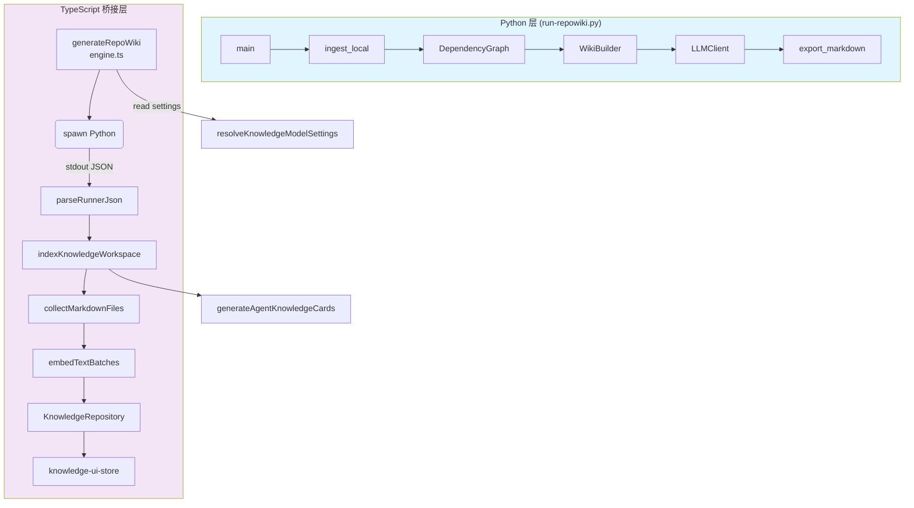
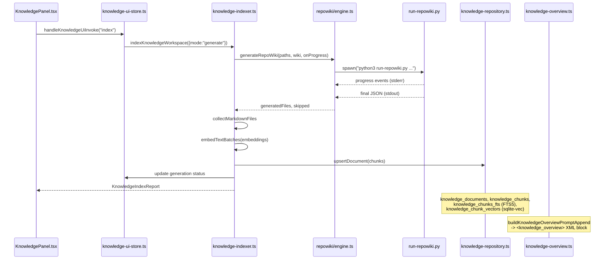

# Repo Wiki Python Runner

<cite>
**本文引用的文件**
- [scripts/knowledge/run-repowiki.py](file://scripts/knowledge/run-repowiki.py)
- [src/electron/libs/knowledge/agent-cards.ts](file://src/electron/libs/knowledge/agent-cards.ts)
- [src/electron/libs/knowledge/embedding-client.ts](file://src/electron/libs/knowledge/embedding-client.ts)
- [src/electron/libs/knowledge/knowledge-indexer.ts](file://src/electron/libs/knowledge/knowledge-indexer.ts)
- [src/electron/libs/knowledge/knowledge-model-settings.ts](file://src/electron/libs/knowledge/knowledge-model-settings.ts)
- [src/electron/libs/knowledge/knowledge-overview.ts](file://src/electron/libs/knowledge/knowledge-overview.ts)
- [src/electron/libs/knowledge/knowledge-paths.ts](file://src/electron/libs/knowledge/knowledge-paths.ts)
- [src/electron/libs/knowledge/knowledge-repository.ts](file://src/electron/libs/knowledge/knowledge-repository.ts)
- [src/electron/libs/knowledge/knowledge-types.ts](file://src/electron/libs/knowledge/knowledge-types.ts)
- [src/electron/libs/knowledge/knowledge-ui-store.ts](file://src/electron/libs/knowledge/knowledge-ui-store.ts)
- [src/electron/libs/knowledge/knowledge-utils.ts](file://src/electron/libs/knowledge/knowledge-utils.ts)
- [src/electron/libs/knowledge/repowiki/analyzer.ts](file://src/electron/libs/knowledge/repowiki/analyzer.ts)
- [src/electron/libs/knowledge/repowiki/builder.ts](file://src/electron/libs/knowledge/repowiki/builder.ts)
- [src/electron/libs/knowledge/repowiki/engine.ts](file://src/electron/libs/knowledge/repowiki/engine.ts)
- [src/electron/libs/knowledge/repowiki/exporter.ts](file://src/electron/libs/knowledge/repowiki/exporter.ts)
- [src/electron/libs/knowledge/repowiki/graph.ts](file://src/electron/libs/knowledge/repowiki/graph.ts)
- [src/electron/libs/knowledge/repowiki/intelligence.ts](file://src/electron/libs/knowledge/repowiki/intelligence.ts)
- [src/electron/libs/knowledge/repowiki/prompts.ts](file://src/electron/libs/knowledge/repowiki/prompts.ts)
</cite>

---

## 目录

- [职责与定位](#职责与定位)
- [核心架构：Python-TS 双层编排](#核心架构python-ts-双层编排)
- [Python Runner 入口与关键函数](#python-runner-入口与关键函数)
- [TypeScript 桥接层（engine.ts）](#typescript-桥接层enginets)
- [下游组件：分析、构建、导出](#下游组件分析构建导出)
- [前后端桥接与状态边界](#前后端桥接与状态边界)
- [常见失败模式与排障](#常见失败模式与排障)
- [扩展点与修改指南](#扩展点与修改指南)
- [Agent 改代码地图](#agent-改代码地图)

---

## 职责与定位

`scripts/knowledge/run-repowiki.py` 是 tech-cc-hub 的 **Repo Wiki 生成引擎的 Python 入口**。它的核心职责是：

1. **扫描项目源码**：读取 `.ts/.tsx/.js/.py/.go/.rs/.java` 等源码文件
2. **构建依赖图**：用 PageRank 算法对文件进行重要性排序
3. **提取项目情报**：npm scripts、依赖列表、IPC/MCP 工具信号、数据库表、运行链路
4. **调用 LLM 生成 Wiki**：向 WikiModel 发送 structured prompt，解析 JSON 返回
5. **导出 Markdown 产物**：输出模块概览、架构图、依赖关系图等 `.md` 文件

> **章节来源**：[file://scripts/knowledge/run-repowiki.py#L1-L35](file://scripts/knowledge/run-repowiki.py#L1-L35)

---

## 核心架构：Python-TS 双层编排



**架构说明**：
- **Python 层** 负责源码扫描、依赖分析、LLM 调用、文档生成
- **TypeScript 层** 负责参数准备、进程管理、产物消费、向量索引、UI 状态
- 两者通过**进程 stdout JSON** 通信，而非内存共享

> **图表来源**：[file://src/electron/libs/knowledge/repowiki/engine.ts#L145-L213](file://src/electron/libs/knowledge/repowiki/engine.ts#L145-L213)

---

## Python Runner 入口与关键函数

### 入口函数 `main()`

```python
def main():
    # 解析 --workspace, --output, --model, --api-base, --language 等参数
    # 调用 run_cataloger() -> run_analyzer() -> run_exporter()
    # 输出 JSON 结果到 stdout
```

[file://scripts/knowledge/run-repowiki.py#L1444](file://scripts/knowledge/run-repowiki.py#L1444)

### 核心函数映射

| 函数名 | 职责 | 关键行 |
|--------|------|--------|
| `_repo_root()` | 解析项目根目录 | L16-19 |
| `_normalize_model()` | 模型名称标准化（加 `openai/` 前缀） | L34-43 |
| `_collect_markdown()` | 收集输出目录的 .md 文件列表 | L46-55 |
| `_is_documentable_file()` | 过滤可忽略路径（`third_party/`, `node_modules/` 等） | L111-134 |
| `_project_source_hash()` | 计算项目源码 SHA256（用于缓存） | L137-141 |
| `_file_rank_lookup()` | 调用 DependencyGraph.rank_files() 获取文件 PageRank | L144-148 |
| `_rank_file()` | 加权文件分数（entrypoint +90、config +90、src/ +60 等） | L151-164 |
| `_key_file_summary()` | 生成前 80 个高价值文件的摘要（带 symbols/imports 标注） | L167-187 |
| `_fallback_catalogs()` | 生成 5-9 个默认目录（项目概述、架构、API、故障排除等） | L190-274 |
| `_module_for_path()` | 将文件路径映射到模块名（knowledge-engine、mcp-tools、electron-runtime 等） | L288-324 |
| `_module_title()` | 模块中文显示名（"知识库后端引擎"） | L327-348 |
| `_complete_with_retries()` | LLM 调用，失败时指数退避重试 3 次 | L88-104 |
| `_extract_json()` | 从 LLM 输出中提取 JSON（含 fence 去除、范围扫描） | L70-85 |

### Vendored 依赖导入

Python Runner 从 `third_party/repowiki/src` 导入以下组件：

```python
from repowiki.core.analyzer import Analyzer
from repowiki.core.cache import Cache
from repowiki.core.graph import DependencyGraph
from repowiki.core.models import FileInfo
from repowiki.core.wiki_builder import WikiBuilder
from repowiki.export.markdown import export_markdown
from repowiki.ingest.local import ingest_local
from repowiki.llm.client import LLMClient
```

[file://scripts/knowledge/run-repowiki.py#L26-L33](file://scripts/knowledge/run-repowiki.py#L26-L33)

---

## TypeScript 桥接层（engine.ts）

### 主函数 `generateRepoWiki()`

```typescript
export async function generateRepoWiki(
  paths: KnowledgeWorkspacePaths,
  wiki: WikiModelSettings,
  onProgress?: (event: RepoWikiProgressEvent) => void,
): Promise<RepoWikiGenerationResult>
```

**职责**：
1. 查找 `third_party/repowiki` 目录定位项目根
2. 组装 Python 进程参数（workspace、output、cache、model、api-base、concurrency）
3. spawn Python 子进程，设置 `PYTHONPATH` 环境变量
4. 实时解析 stderr 中的 progress JSON，触发 `onProgress` 回调
5. 解析 stdout 中的最终 JSON 结果

[file://src/electron/libs/knowledge/repowiki/engine.ts#L215-L279](file://src/electron/libs/knowledge/repowiki/engine.ts#L215-L279)

### 关键辅助函数

| 函数名 | 职责 |
|--------|------|
| `findRepoRoot()` | 从 cwd 向上查找 `third_party/repowiki/src/repowiki` |
| `pythonExecutable()` | 优先 `TECH_CC_HUB_PYTHON`，其次 `PYTHON`，默认 `python3` |
| `resolveRepoWikiConcurrency()` | free 模型 2 并发，cheap/standard 模型 6 并发，可被环境变量覆盖 |
| `parseRunnerJson()` | 从 stdout 末尾倒序扫描，找到第一个有效 JSON |
| `parseRepoWikiProgress()` | 将 stderr 行解析为 `RepoWikiProgressEvent`（stage: planning/modules/architecture/reading-guide/done） |

[file://src/electron/libs/knowledge/repowiki/engine.ts#L40-L143](file://src/electron/libs/knowledge/repowiki/engine.ts#L40-L143)

### 环境变量接口

| 环境变量 | 用途 | 默认值 |
|----------|------|--------|
| `TECH_CC_HUB_PYTHON` | Python 解释器路径 | `python3` |
| `TECH_CC_HUB_REPOWIKI_CONCURRENCY` | 并发数（1-12） | 2（free）/ 6（standard） |
| `TECH_CC_HUB_REPOWIKI_TARGET_PAGES` | 目标页数 | 56 |
| `TECH_CC_HUB_REPOWIKI_FILE_PAGE_LIMIT` | 每个文件的页数限制 | 0（不限） |
| `REPOWIKI_MAX_FILES` | 最大扫描文件数 | 0（不限） |

---

## 下游组件：分析、构建、导出

### `RepoWikiAnalyzer`（analyzer.ts）

负责调用 LLM 生成 Wiki 内容：

```typescript
export class RepoWikiAnalyzer {
  async analyze(project: RepoWikiProjectContext, graph: RepoWikiDependencyGraph): Promise<WikiData>
}
```

**生成顺序**：
1. **Overview**（`buildOverviewPrompt`）：项目名称、一句话描述、技术栈、关键工作流、存储与索引
2. **Modules**（`buildModulePrompt`）：最多 18 个模块，按优先级排序，并发度 3
3. **Architecture**（`buildArchitecturePrompt`）：组件图（Mermaid）、层次结构、数据流
4. **Reading Guide**（`buildReadingGuidePrompt`）：阅读步骤、入口文件、验证命令

[file://src/electron/libs/knowledge/repowiki/analyzer.ts#L50-L88](file://src/electron/libs/knowledge/repowiki/analyzer.ts#L50-L88)

### `RepoWikiBuilder`（builder.ts）

将 `WikiData` 转换为 `RepoWiki` 结构（页面 + 侧边栏）：

```typescript
export class RepoWikiBuilder {
  build(project, data, graph): RepoWiki
}
```

**页面生成顺序**：
1. `index.md`（项目概览）
2. `agent-playbook.md`（Agent 作业手册）
3. `architecture.md`（架构）
4. `runtime-flows.md`（关键运行链路）
5. `api-surface.md`（接口与存储面）
6. `modules/<name>/index.md`（每个模块的文档）
7. `reading-guide.md`（阅读指南）
8. `dependencies.md`（依赖关系图，Mermaid）

[file://src/electron/libs/knowledge/repowiki/builder.ts#L15-L86](file://src/electron/libs/knowledge/repowiki/builder.ts#L15-L86)

### `RepoWikiDependencyGraph`（graph.ts）

**PageRank 算法**：
- damping = 0.85
- 30 次迭代
- 入度 ≤ 1 的文件判定为入口点

**模块依赖分析**：
- 提取 JS/TS/Python/Go/Rust/Java 的 import 语句
- 解析相对路径和绝对路径
- 按模块名聚合跨模块依赖

[file://src/electron/libs/knowledge/repowiki/graph.ts#L66-L93](file://src/electron/libs/knowledge/repowiki/graph.ts#L66-L93)

### `RepoWikiExporter`（exporter.ts）

```typescript
export function exportRepoWikiMarkdown(wiki: RepoWiki, outputDir: string, workspaceRoot: string): string[]
```

将 `RepoWiki` 导出为：
- `content/<page-id>.md`：各页面内容
- `_sidebar.md`：侧边栏导航

[file://src/electron/libs/knowledge/repowiki/exporter.ts#L5-L23](file://src/electron/libs/knowledge/repowiki/exporter.ts#L5-L23)

---

## 前后端桥接与状态边界

### 索引流程的完整链路



### 关键 Source-of-Truth

| 数据 | Source of Truth | 刷新时机 |
|------|-----------------|----------|
| Wiki 生成配置 | `settings.wiki`（WikiModelSettings） | 模型设置页保存后 |
| 向量模型配置 | `settings.embedding`（EmbeddingModelSettings） | 模型设置页保存后 |
| 生成状态 | `knowledge_ui_generation` 表（SQLite） | 实时更新 |
| 文档索引 | `knowledge_documents` + `knowledge_chunks` 表 | 生成完成后 |
| 侧边栏状态 | `knowledge_ui_workspaces` 表 | 工作区切换时 |

[file://src/electron/libs/knowledge/knowledge-repository.ts#L84-L137](file://src/electron/libs/knowledge/knowledge-repository.ts#L84-L137)

### IPC 与 MCP 工具边界

**IPC 通道**（Electron 主进程 ↔ Renderer）：
- `knowledge:index` - 触发索引
- `knowledge:list` - 列出工作区
- `knowledge:read-document` - 读取文档
- `knowledge:search` - 向量搜索

**MCP 工具**（Agent 调用）：
- `mcp__tech-cc-hub-knowledge__knowledge_index` - 触发索引
- `mcp__tech-cc-hub-knowledge__knowledge_search` - 搜索知识库

[file://src/electron/libs/knowledge/knowledge-ui-store.ts#L323](file://src/electron/libs/knowledge/knowledge-ui-store.ts#L323)

---

## 常见失败模式与排障

### 1. Python 进程无法启动

**症状**：`spawn python3 ...` 报错 `ENOENT`

**排查步骤**：
```bash
# 检查 Python 解释器
echo $TECH_CC_HUB_PYTHON
which python3

# 手动运行验证
python3 scripts/knowledge/run-repowiki.py --help
```

**原因**：`findRepoRoot()` 无法找到 `third_party/repowiki/src/repowiki` 目录

### 2. LLM 调用失败（JSON 解析错误）

**症状**：`extract_json` 返回 `null`，导致 fallback 生成

**排查步骤**：
```python
# 检查模型配置
echo $TECH_WIKI_MODEL
echo $TECH_WIKI_API_KEY

# 检查 API 连通性
curl -s -X POST "$TECH_WIKI_API_BASE/chat/completions" \
  -H "Authorization: Bearer $TECH_WIKI_API_KEY" \
  -H "Content-Type: application/json" \
  -d '{"model":"xxx","messages":[{"role":"user","content":"hi"}],"max_tokens":10}'
```

[file://src/electron/libs/knowledge/repowiki/analyzer.ts#L102-L104](file://src/electron/libs/knowledge/repowiki/analyzer.ts#L102-L104)

### 3. sqlite-vec 不可用

**症状**：`vectorStoreReady: false`，无法写入向量

**排查步骤**：
```bash
# 检查 sqlite-vec 扩展
sqlite3 ~/.tech/knowledge/xxx/knowledge.sqlite ".load sqlite-vec"
sqlite3 ~/.tech/knowledge/xxx/knowledge.sqlite "SELECT * FROM vec0() LIMIT 1"
```

**原因**：`better-sqlite3` 加载 `sqlite-vec` 失败，或维度不匹配（新建表时强制重建）

[file://src/electron/libs/knowledge/knowledge-repository.ts#L141-L160](file://src/electron/libs/knowledge/knowledge-repository.ts#L141-L160)

### 4. 文档内容哈希不匹配

**症状**：`changedDocuments` 持续增长，但文件未变

**排查**：`stableHash()` 使用 SHA256，检查 `content` 字段是否被截断或包含不可见字符

[file://src/electron/libs/knowledge/knowledge-utils.ts#L134-L136](file://src/electron/libs/knowledge/knowledge-utils.ts#L134-L136)

---

## 扩展点与修改指南

### 1. 添加新的 Wiki 页面类型

**步骤**：
1. 在 `builder.ts` 的 `build()` 方法中添加新页面生成函数
2. 在 `sidebar` 中添加对应的 `SidebarItem`
3. 如需 LLM 生成，参考 `prompts.ts` 添加新的 prompt builder

**示例**：添加 `troubleshooting.md`

```typescript
// builder.ts
if (data.troubleshooting?.length) {
  pages.push({ id: "troubleshooting", title: "故障排除", content: buildTroubleshootingPage(data.troubleshooting), order: 800 });
  sidebar.push({ title: "故障排除", pageId: "troubleshooting", children: [] });
}
```

[file://src/electron/libs/knowledge/repowiki/builder.ts#L14-L86](file://src/electron/libs/knowledge/repowiki/builder.ts#L14-L86)

### 2. 修改文件扫描规则

**步骤**：
1. 在 `run-repowiki.py` 的 `_is_documentable_file()` 中添加/修改路径过滤
2. 同步修改 `knowledge-utils.ts` 的 `DEFAULT_SKIP_DIRS` 和 `IGNORE_FILES`

[file://scripts/knowledge/run-repowiki.py#L111-L134](file://scripts/knowledge/run-repowiki.py#L111-L134)

### 3. 添加新的代码信号提取

**步骤**：
1. 在 `repowiki/intelligence.ts` 的 `buildRepoWikiIntelligence()` 中添加新的信号类型
2. 在 `graph.ts` 的 `IMPORT_PATTERNS` 中添加新语言的支持

[file://src/electron/libs/knowledge/repowiki/intelligence.ts#L50-L93](file://src/electron/libs/knowledge/repowiki/intelligence.ts#L50-L93)

---

## Agent 改代码地图

### 先读文件（按优先级）

| 文件 | 优先级 | 原因 |
|------|--------|------|
| `scripts/knowledge/run-repowiki.py` | 1 | Python Runner 入口，所有参数汇聚点 |
| `src/electron/libs/knowledge/repowiki/engine.ts` | 2 | TypeScript 桥接，进程管理核心 |
| `src/electron/libs/knowledge/repowiki/analyzer.ts` | 3 | LLM 调用逻辑和 prompt 构建 |
| `src/electron/libs/knowledge/repowiki/builder.ts` | 4 | Wiki 页面结构定义 |
| `src/electron/libs/knowledge/repowiki/prompts.ts` | 5 | prompt 模板，修改会导致生成结果变化 |

### 关键符号

**Python 层**：
- `main()` - 入口
- `_complete_with_retries()` - LLM 调用
- `_fallback_catalogs()` - 默认目录配置
- `_module_for_path()` - 模块映射规则

**TypeScript 层**：
- `generateRepoWiki()` - 主函数
- `parseRunnerJson()` - JSON 解析
- `RepoWikiAnalyzer.analyze()` - 分析流程
- `RepoWikiBuilder.build()` - 页面构建
- `exportRepoWikiMarkdown()` - 导出

### IPC/MCP 工具

| 工具名 | 通道 | 说明 |
|--------|------|------|
| `mcp__tech-cc-hub-knowledge__knowledge_index` | MCP | 触发知识库索引 |
| `mcp__tech-cc-hub-knowledge__knowledge_search` | MCP | 搜索知识库 |
| `knowledge:index` | IPC | Electron 主进程索引 |

### 表结构

| 表名 | 用途 |
|------|------|
| `knowledge_documents` | 文档元数据（workspace_scope, source_kind, source_path, content_hash） |
| `knowledge_chunks` | 分块数据（document_id, chunk_index, token_estimate, embedding_model） |
| `knowledge_chunks_fts` | FTS5 全文索引 |
| `knowledge_chunk_vectors` | sqlite-vec 向量索引（float[N]） |
| `knowledge_index_runs` | 索引运行记录 |
| `knowledge_ui_generation` | UI 生成状态（status, completed, total, phase） |

### 修改入口

1. **参数配置**：修改 `WikiModelSettings` 类型（`knowledge-types.ts`）
2. **Prompt 模板**：修改 `prompts.ts` 中的 `build*Prompt()` 函数
3. **文件过滤**：修改 `_is_documentable_file()`（Python）或 `shouldSkipDirectory()`（TS）
4. **页面结构**：修改 `builder.ts` 的 `build()` 方法
5. **依赖图算法**：修改 `graph.ts` 的 `rankFiles()` 方法

### 验证命令

```bash
# 完整索引（生成 + 向量化）
npm run knowledge:index

# 只扫描
npm run knowledge:scan

# Python Runner 调试
python3 scripts/knowledge/run-repowiki.py --workspace . --output .tech/repowiki/zh --model gpt-4o --api-base https://api.openai.com/v1

# 检查向量存储
sqlite3 ~/.tech/knowledge/xxx/knowledge.sqlite "SELECT COUNT(*) FROM knowledge_chunk_vectors"
```

### 常见回归风险

1. **模型配置失效**：`resolveKnowledgeModelSettings()` 找不到可用 profile → 索引静默跳过
2. **向量维度不匹配**：embedding dimension 变化 → sqlite-vec 表被删除重建
3. **Python 环境变更**：`PYTHONPATH` 不含 `repowiki/src` → 导入失败
4. **并发数过高**：API 限流 → LLM 调用超时或返回错误
5. **文档过期**：`changedDocuments` 计算依赖 `stableHash()` → 内容截断导致假变更