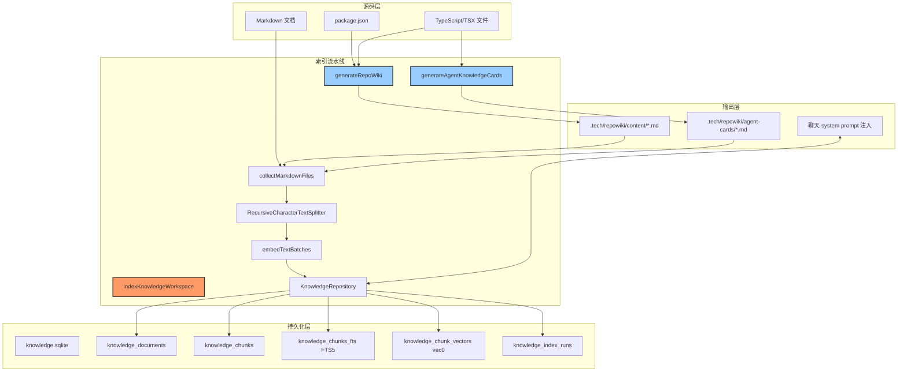
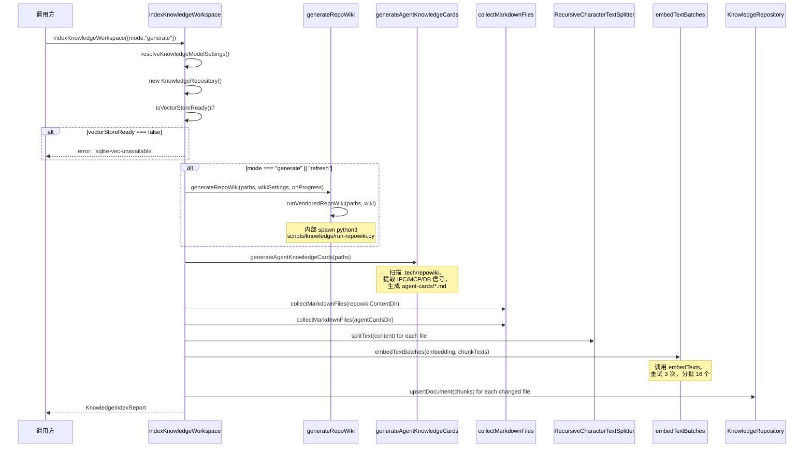
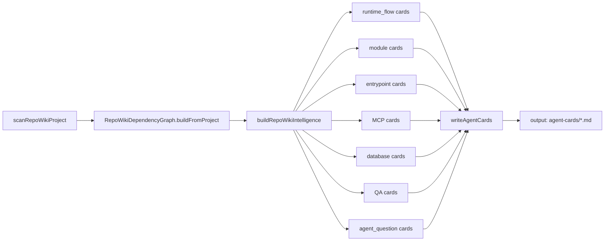

# 知识库后端引擎总览

<cite>
**本文引用的文件**
- [scripts/knowledge/run-repowiki.py](file://scripts/knowledge/run-repowiki.py)
- [src/electron/libs/knowledge/agent-cards.ts](file://src/electron/libs/knowledge/agent-cards.ts)
- [src/electron/libs/knowledge/embedding-client.ts](file://src/electron/libs/knowledge/embedding-client.ts)
- [src/electron/libs/knowledge/knowledge-indexer.ts](file://src/electron/libs/knowledge/knowledge-indexer.ts)
- [src/electron/libs/knowledge/knowledge-model-settings.ts](file://src/electron/libs/knowledge/knowledge-model-settings.ts)
- [src/electron/libs/knowledge/knowledge-overview.ts](file://src/electron/libs/knowledge/knowledge-overview.ts)
- [src/electron/libs/knowledge/knowledge-paths.ts](file://src/electron/libs/knowledge/knowledge-paths.ts)
- [src/electron/libs/knowledge/knowledge-repository.ts](file://src/electron/libs/knowledge/knowledge-repository.ts)
- [src/electron/libs/knowledge/knowledge-types.ts](file://src/electron/libs/knowledge/knowledge-types.ts)
- [src/electron/libs/knowledge/knowledge-ui-store.ts](file://src/electron/libs/knowledge/knowledge-ui-store.ts)
- [src/electron/libs/knowledge/knowledge-utils.ts](file://src/electron/libs/knowledge/knowledge-utils.ts)
- [src/electron/libs/knowledge/repowiki/analyzer.ts](file://src/electron/libs/knowledge/repowiki/analyzer.ts)
- [src/electron/libs/knowledge/repowiki/builder.ts](file://src/electron/libs/knowledge/repowiki/builder.ts)
- [src/electron/libs/knowledge/repowiki/engine.ts](file://src/electron/libs/knowledge/repowiki/engine.ts)
- [src/electron/libs/knowledge/repowiki/exporter.ts](file://src/electron/libs/knowledge/repowiki/exporter.ts)
- [src/electron/libs/knowledge/repowiki/graph.ts](file://src/electron/libs/knowledge/repowiki/graph.ts)
- [src/electron/libs/knowledge/repowiki/intelligence.ts](file://src/electron/libs/knowledge/repowiki/intelligence.ts)
- [src/electron/libs/knowledge/repowiki/prompts.ts](file://src/electron/libs/knowledge/repowiki/prompts.ts)
</cite>

## 目录

- [职责定位](#职责定位)
- [架构总览](#架构总览)
- [核心调用链](#核心调用链)
- [数据结构与表结构](#数据结构与表结构)
- [配置与模型设置](#配置与模型设置)
- [常见失败模式与排障](#常见失败模式与排障)
- [扩展点与改造路径](#扩展点与改造路径)
- [Agent 改代码地图](#agent-改代码地图)
- [验证命令参考](#验证命令参考)

---

## 职责定位

`module-knowledge-engine` 是 tech-cc-hub 的知识库后端引擎，负责：

1. **Repo Wiki 自动生成**：扫描项目源码，调用 LLM 生成中文 Repo Wiki 文档（概览、模块、架构、依赖图等）
2. **Agent Cards 制作**：从源码中提取 IPC/MCP/数据库/入口点等信号，生成面向 Agent 的快速定位卡片
3. **向量索引**：将生成的文档切分为 chunk，调用 embedding API 生成向量，存入 sqlite-vec
4. **FTS 全文检索**：通过 FTS5 虚拟表提供关键词检索能力
5. **聊天注入**：在 Agent system prompt 中注入 `<knowledge_overview>` XML，帮助 Agent 感知已有知识

### 关键约束

- **必须配置 embeddingModel**：不配置则整个引擎静默失败，`indexKnowledgeWorkspace` 返回 `error: "missing-embedding-model"`
- **必须加载 sqlite-vec**：向量存储依赖 native addon，加载失败则降级到 FTS5-only 模式（`vectorStoreReady: false`）
- **文档必须存在于 `.tech/repowiki/content/`**：首次生成需要工作区下已有 Markdown 文件

---

## 架构总览



**章节来源**：[knowledge-indexer.ts#L170-L351](file://src/electron/libs/knowledge/knowledge-indexer.ts#L170-L351) 主流程

---

## 核心调用链

### 1. 顶层入口：`indexKnowledgeWorkspace`

```typescript
// knowledge-indexer.ts#L170
export async function indexKnowledgeWorkspace(options: {
  workspaceRoot: string;
  appDataPath: string;
  mode: "scan" | "generate" | "refresh";
  onProgress?: (event: RepoWikiProgressEvent) => void;
}): Promise<KnowledgeIndexReport>
```

**调用顺序**：



**章节来源**：
- [knowledge-indexer.ts#L170-L352](file://src/electron/libs/knowledge/knowledge-indexer.ts#L170-L352)
- [knowledge-indexer.ts#L221-L228](file://src/electron/libs/knowledge/knowledge-indexer.ts#L221-L228) 条件分支
- [knowledge-indexer.ts#L253-L270](file://src/electron/libs/knowledge/knowledge-indexer.ts#L253-L270) chunk 生成

### 2. Repo Wiki 生成：`generateRepoWiki` → `runVendoredRepoWiki`

```typescript
// repowiki/engine.ts#L217
export async function generateRepoWiki(
  paths: KnowledgeWorkspacePaths,
  wiki: WikiModelSettings,
  onProgress?: (event: RepoWikiProgressEvent) => void,
): Promise<RepoWikiGenerationResult>
```

**Python 桥接流程**：

1. `findRepoRoot()` 查找 `third_party/repowiki/src`
2. `spawn(python3, ["scripts/knowledge/run-repowiki.py", ...])`
3. 设置环境变量：`TECH_WIKI_MODEL`、`TECH_WIKI_API_KEY`、`TECH_WIKI_API_BASE`
4. 解析 stdout 中的 JSON 行获取 `generatedFiles`、`pageCount` 等结果

```typescript
// repowiki/engine.ts#L146-L182
async function runVendoredRepoWiki(
  paths: KnowledgeWorkspacePaths,
  wiki: WikiModelSettings,
  onProgress?: (event: RepoWikiProgressEvent) => void,
): Promise<RepoWikiRunnerResult> {
  const repoRoot = findRepoRoot();
  const scriptPath = join(repoRoot, "scripts", "knowledge", "run-repowiki.py");
  const cachePath = join(paths.appDataWorkspaceRoot, "repowiki-cache.sqlite");
  // ...
  const args = [
    scriptPath,
    "--workspace", paths.workspaceRoot,
    "--output", paths.repowikiRoot,
    "--cache", cachePath,
    "--model", wiki.model,
    "--api-base", wiki.baseURL,
    "--language", "zh",
    "--concurrency", resolveRepoWikiConcurrency(wiki),
  ];
  // spawn python3 ...
}
```

**章节来源**：[repowiki/engine.ts#L41-L213](file://src/electron/libs/knowledge/repowiki/engine.ts#L41-L213)

### 3. Agent Cards 生成：`generateAgentKnowledgeCards`

```typescript
// agent-cards.ts#L50
export function generateAgentKnowledgeCards(paths: KnowledgeWorkspacePaths): AgentKnowledgeCardsResult
```

**内部构建顺序**：



**关键信号提取**（来自 `intelligence.ts`）：
- `ipcChannels` - 从文件 signals 中筛选 `kind === "ipc"`
- `mcpTools` - 从文件 signals 中筛选 `kind === "mcp_tool"`
- `databaseTables` - 从文件 signals 中筛选 `kind === "database"`
- `highValueFiles` - 基于 PageRank + `HIGH_VALUE_PATHS` 硬编码列表

**章节来源**：
- [agent-cards.ts#L50-L72](file://src/electron/libs/knowledge/agent-cards.ts#L50-L72)
- [agent-cards.ts#L74-L234](file://src/electron/libs/knowledge/agent-cards.ts#L74-L234) 7 种卡片类型

---

## 数据结构与表结构

### 核心类型（`knowledge-types.ts`）

| 类型 | 用途 | 关键字段 |
|------|------|----------|
| `KnowledgeDocument` | 一个索引文档 | `id`, `workspaceScope`, `sourceKind`, `sourcePath`, `title`, `contentHash` |
| `KnowledgeChunk` | 文档切片 | `id`, `documentId`, `content`, `chunkIndex`, `tokenEstimate`, `embedding` |
| `KnowledgeUpsertInput` | upsert 输入 | `workspaceScope`, `sourceKind`, `sourcePath`, `chunks[]` |
| `KnowledgeSearchResult` | 检索结果 | `chunkId`, `documentId`, `content`, `score`, `vectorDistance` |
| `EmbeddingModelSettings` | Embedding 配置 | `profileId`, `model`, `dimension`, `batchSize`, `apiKey`, `baseURL` |
| `WikiModelSettings` | Wiki LLM 配置 | `profileId`, `model`, `costTier`, `maxInputTokens`, `maxOutputTokens` |

### SQLite 表结构（`knowledge-repository.ts`）

```sql
-- 文档表
CREATE TABLE knowledge_documents (
  id TEXT PRIMARY KEY,
  workspace_scope TEXT NOT NULL,
  source_kind TEXT NOT NULL,  -- "repowiki" | "agent_card" | "memory" | "manual" | "source"
  source_path TEXT NOT NULL,
  title TEXT NOT NULL,
  summary TEXT,
  tags TEXT NOT NULL DEFAULT '',
  metadata TEXT NOT NULL DEFAULT '{}',
  content_hash TEXT NOT NULL,
  created_at INTEGER NOT NULL,
  updated_at INTEGER NOT NULL,
  UNIQUE(workspace_scope, source_kind, source_path)
);

-- Chunk 表
CREATE TABLE knowledge_chunks (
  id TEXT PRIMARY KEY,
  document_id TEXT NOT NULL REFERENCES knowledge_documents(id) ON DELETE CASCADE,
  workspace_scope TEXT NOT NULL,
  source_kind TEXT NOT NULL,
  source_path TEXT NOT NULL,
  title TEXT NOT NULL,
  content TEXT NOT NULL,
  chunk_index INTEGER NOT NULL,
  token_estimate INTEGER NOT NULL,
  metadata TEXT NOT NULL DEFAULT '{}',
  embedding_model TEXT,
  embedding_dimension INTEGER,
  created_at INTEGER NOT NULL,
  updated_at INTEGER NOT NULL
);

-- 全文搜索虚拟表
CREATE VIRTUAL TABLE knowledge_chunks_fts USING fts5(
  title, content, source_path, tags,
  tokenize='unicode61'
);

-- 向量存储虚拟表（sqlite-vec）
CREATE VIRTUAL TABLE knowledge_chunk_vectors USING vec0(
  chunk_rowid integer primary key,
  embedding float[dimension]
);

-- 索引运行记录
CREATE TABLE knowledge_index_runs (
  id TEXT PRIMARY KEY,
  workspace_scope TEXT NOT NULL,
  mode TEXT NOT NULL,
  status TEXT NOT NULL,
  report TEXT NOT NULL,
  created_at INTEGER NOT NULL
);
```

**关键操作**：
- `upsertDocument(input)` - 写入文档和 chunks，同时写入 FTS 和 vector 表
- `deleteWorkspaceDocumentsNotIn(scope, kind, keepPaths)` - 删除不在 keepPaths 中的文档
- `search(query, options)` - 混合检索：向量 KNN + FTS 交集

**章节来源**：[knowledge-repository.ts#L80-L137](file://src/electron/libs/knowledge/knowledge-repository.ts#L80-L137)

### Workspace 路径结构（`knowledge-paths.ts`）

```typescript
// knowledge-paths.ts#L36-L72
export function resolveKnowledgeWorkspacePaths(
  workspaceRoot: string,
  appDataPath: string,
): KnowledgeWorkspacePaths
```

| 路径字段 | 位置 | 用途 |
|----------|------|------|
| `workspaceRoot` | 用户工作区根目录 | 扫描源码起点 |
| `techRoot` | `{workspaceRoot}/.tech` | 所有输出产物根 |
| `repowikiRoot` | `.tech/repowiki/zh` | Repo Wiki 输出 |
| `repowikiContentDir` | `.tech/repowiki/zh/content` | Wiki Markdown 文件 |
| `agentCardsDir` | `.tech/repowiki/zh/agent-cards` | Agent Cards Markdown |
| `appDataWorkspaceRoot` | `{userData}/knowledge/{hash16}` | 数据库存储 |
| `knowledgeDbPath` | `{appDataWorkspaceRoot}/knowledge.sqlite` | 主数据库 |
| `indexStatePath` | `.tech/reports/index-state.json` | 最近索引状态 |

---

## 配置与模型设置

### 模型配置入口（`knowledge-model-settings.ts`）

```typescript
// knowledge-model-settings.ts#L49
export function resolveKnowledgeModelSettings(): KnowledgeModelSettings
```

**读取来源**：`loadApiConfigSettings().profiles`（来自 `config-store.js`）

**查找逻辑**：
1. 找 `embeddingModel` 已配置且 `enabled=true` 的 profile → `EmbeddingModelSettings`
2. 找 `wikiModel` 已配置且 `enabled=true` 的 profile → `WikiModelSettings`
3. dimension 自动推断：`qwen3-embedding-0.6b` → 1024，`text-embedding-3-small` → 1536，未知 → 默认 1536

### 增量检查（`run-repowiki.py`）

```python
# run-repowiki.py#L269
def _build_incremental_plan(args, previous_metadata, current_file_hashes)
```

**增量触发条件**：
- changed 文件数 > 40 或 占比 > 25% → 全量
- schema 版本变化 → 全量
- 模型/语言变化 → 全量
- catalog 敏感文件（`/routes/`、`/mcp-tools/`、`/knowledge/` 等）变化 → 全量

**章节来源**：[run-repowiki.py#L269-L340](file://scripts/knowledge/run-repowiki.py#L269-L340)

---

## 常见失败模式与排障

### 1. `missing-embedding-model`

**表现**：`indexKnowledgeWorkspace` 返回 `{ success: false, error: "missing-embedding-model" }`

**原因**：未在模型设置里配置 `embeddingModel`

**排查**：
```bash
# 检查 config-store 中 profiles
grep -r "embeddingModel" src/electron/libs/config-store.ts
# 或检查用户配置界面
```

**章节来源**：[knowledge-indexer.ts#L192-L200](file://src/electron/libs/knowledge/knowledge-indexer.ts#L192-L200)

### 2. `sqlite-vec-unavailable`

**表现**：`isVectorStoreReady()` 返回 `false`，索引成功但无向量

**原因**：sqlite-vec native addon 加载失败（环境问题或版本不兼容）

**排查**：
```bash
# 检查 app-data 中的索引报告
cat ~/.config/tech-cc-hub/knowledge/{hash}/reports/index-state.json
# 查看 vectorStoreReady 字段
```

**章节来源**：[knowledge-repository.ts#L141-L159](file://src/electron/libs/knowledge/knowledge-repository.ts#L141-L159)

### 3. RepoWiki Python 脚本失败

**表现**：`spawn` 返回非零 exit code 或无 JSON 输出

**排查**：
```bash
# 手动运行 Python 脚本看 stderr
python3 scripts/knowledge/run-repowiki.py \
  --workspace /path/to/workspace \
  --output /path/to/.tech/repowiki/zh \
  --model your-model \
  --api-base https://api.example.com \
  --language zh
```

**章节来源**：[repowiki/engine.ts#L198-L212](file://src/electron/libs/knowledge/repowiki/engine.ts#L198-L212)

### 4. chunk 内容变化但向量未刷新

**表现**：文档已更新，但检索结果仍返回旧内容

**原因**：`contentHash` 相同则 `changed: false`，跳过 embedding

**修复**：使用 `mode: "refresh"` 强制全量重索引

```typescript
// knowledge-indexer.ts#L221
if (options.mode === "generate" || options.mode === "refresh") {
  await maybeGenerateWiki(paths, settings.wiki, options.onProgress);
}
```

---

## 扩展点与改造路径

### 1. 新增文档源类型

**修改文件**：`knowledge-types.ts`、`knowledge-repository.ts`

```typescript
// knowledge-types.ts#L1
export type KnowledgeSourceKind = "repowiki" | "agent_card" | "memory" | "manual" | "source";
```

在 `KnowledgeRepository` 的 `upsertDocument` 中会自动处理新 kind（通过 `UNIQUE(workspace_scope, source_kind, source_path)` 约束）。

### 2. 修改 chunk 策略

**修改文件**：`knowledge-indexer.ts#L253-L256`

```typescript
// 当前策略
const splitter = new RecursiveCharacterTextSplitter({
  chunkSize: 1_800,  // 可调整为 1000-4000
  chunkOverlap: 220,  // 可调整为 100-500
});
```

### 3. 替换 embedding provider

**修改文件**：`embedding-client.ts`

当前实现基于 OpenAI `/embeddings` API。如需替换：
1. 修改 `requestEmbeddings` 中的 endpoint 和 body 格式
2. 保持 `embedTexts` 的重试逻辑和返回值格式（`number[][]`）
3. 同步修改 `normalizeEmbeddingVector` 中的 dimension 检查逻辑

### 4. 新增页面类型（Repo Wiki）

**修改文件**：`repowiki/builder.ts`

```typescript
// builder.ts#L14
export class RepoWikiBuilder {
  build(project, data, graph): RepoWiki {
    // 新增页面只需 push 到 pages 数组
    // pages.push({ id: "...", title: "...", content: ..., order: ... });
  }
}
```

### 5. 添加信号类型

**修改文件**：`repowiki/intelligence.ts`

在 `buildRepoWikiIntelligence` 中新增信号筛选逻辑：

```typescript
// intelligence.ts#L56-L62
const signals = project.files.flatMap((file) => file.signals.map(...));
const ipcChannels = signals.filter((s) => s.kind === "ipc").slice(0, 80);
// 新增：
const customSignals = signals.filter((s) => s.kind === "custom_kind").slice(0, 80);
```

---

## Agent 改代码地图

### 先读文件（按顺序）

1. **[knowledge-indexer.ts](file://src/electron/libs/knowledge/knowledge-indexer.ts)** - 主流程入口，先确认当前 `mode` 分支和调用顺序
2. **[knowledge-repository.ts](file://src/electron/libs/knowledge/knowledge-repository.ts)** - 所有写入操作的 source-of-truth
3. **[knowledge-paths.ts](file://src/electron/libs/knowledge/knowledge-paths.ts)** - 确认路径计算和 workspace scope 逻辑
4. **[knowledge-model-settings.ts](file://src/electron/libs/knowledge/knowledge-model-settings.ts)** - 配置读取逻辑
5. **[repowiki/engine.ts](file://src/electron/libs/knowledge/repowiki/engine.ts)** - Python 桥接层

### 关键符号 / IPC / MCP 工具 / 表结构

| 符号/工具/表 | 文件位置 | 用途 |
|-------------|----------|------|
| `indexKnowledgeWorkspace` | knowledge-indexer.ts#L170 | 主入口，异步，返回 `KnowledgeIndexReport` |
| `KnowledgeRepository` | knowledge-repository.ts#L61 | SQLite/FTS/vec 操作类 |
| `upsertDocument(input)` | knowledge-repository.ts#L162 | 写入文档+chunk+FTS+vector |
| `search(query, options)` | knowledge-repository.ts#L275 | 混合检索（向量+FTS） |
| `generateRepoWiki(paths, wiki)` | repowiki/engine.ts#L217 | 触发 Python 生成 |
| `generateAgentKnowledgeCards(paths)` | agent-cards.ts#L50 | 生成 Agent Cards |
| `buildKnowledgeOverviewPromptAppend(cwd)` | knowledge-overview.ts#L30 | system prompt 注入 |
| `resolveKnowledgeModelSettings()` | knowledge-model-settings.ts#L49 | 读取 profile 配置 |
| `handleKnowledgeUiInvoke(...)` | knowledge-ui-store.ts#L323 | UI 触发索引的 IPC handler |
| `mcp__tech-cc-hub-knowledge__knowledge_index` | MCP tool name | Agent 可触发的索引工具 |
| `mcp__tech-cc-hub-knowledge__knowledge_search` | MCP tool name | Agent 可触发的检索工具 |
| `knowledge_documents` | SQLite 表 | 文档存储 |
| `knowledge_chunks` | SQLite 表 | chunk 存储 |
| `knowledge_chunks_fts` | FTS5 虚拟表 | 全文检索 |
| `knowledge_chunk_vectors` | vec0 虚拟表 | 向量存储 |
| `knowledge_ui_generation` | UI SQLite 表 | 进度跟踪 |

### 修改入口

| 场景 | 入口文件 | 关键函数 |
|------|----------|----------|
| 改索引流程 | `knowledge-indexer.ts` | `indexKnowledgeWorkspace` |
| 改检索逻辑 | `knowledge-repository.ts` | `search` |
| 改 chunk 策略 | `knowledge-indexer.ts#L253` | `RecursiveCharacterTextSplitter` |
| 改 embedding 调用 | `embedding-client.ts` | `embedTexts`、`requestEmbeddings` |
| 改 Repo Wiki 生成 | `repowiki/engine.ts` | `runVendoredRepoWiki` |
| 改 Python adapter | `scripts/knowledge/run-repowiki.py` | `_build_incremental_plan` |
| 改 Agent Cards | `agent-cards.ts` | `generateAgentKnowledgeCards` |
| 改信号提取 | `repowiki/intelligence.ts` | `buildRepoWikiIntelligence` |
| 改 UI 交互 | `knowledge-ui-store.ts` | `handleKnowledgeUiInvoke` |
| 改 overview 注入 | `knowledge-overview.ts` | `buildKnowledgeOverviewPromptAppend` |

### 验证命令

```bash
# 1. 检查索引状态（首次需要配置 embeddingModel）
cat .tech/reports/index-state.json | jq .

# 2. 检查数据库表是否存在
sqlite3 ~/.config/tech-cc-hub/knowledge/{hash}/knowledge.sqlite \
  ".tables"
# 期望：knowledge_documents knowledge_chunks knowledge_index_runs

# 3. 检查向量虚拟表
sqlite3 ~/.config/tech-cc-hub/knowledge/{hash}/knowledge.sqlite \
  ".schema knowledge_chunk_vectors"
# 期望：CREATE VIRTUAL TABLE ... USING vec0(...)

# 4. 检查 FTS 表
sqlite3 ~/.config/tech-cc-hub/knowledge/{hash}/knowledge.sqlite \
  "SELECT * FROM knowledge_chunks_fts WHERE title MATCH '知识库' LIMIT 5;"

# 5. 手动触发增量检查
python3 scripts/knowledge/run-repowiki.py \
  --workspace . \
  --output .tech/repowiki/zh \
  --model gpt-4o \
  --api-base https://api.openai.com/v1 \
  --language zh --dry-run

# 6. 检查 Agent Cards 输出
ls -la .tech/repowiki/zh/agent-cards/
cat .tech/repowiki/zh/agent-cards/_index.json | jq '.count'
```

### 常见回归风险

1. **删除 `embeddingModel` 配置**：整个引擎静默失败，返回 `missing-embedding-model`
2. **修改 `knowledge_documents` schema**：已有 app-data 数据无法迁移，查询失败
3. **改动 `resolveKnowledgeWorkspacePaths`**：workspace scope 变化导致文档重复写入
4. **改动 `embedding.dimension`**：新 dimension 与旧 vec 表不匹配，抛出 dimension mismatch
5. **Python 脚本路径变更**：`findRepoRoot()` 依赖 `third_party/repowiki/src` 存在
6. **UI store 和 indexer 使用不同 dbPath**：两边数据不一致

---

## 验证命令参考

| 验证目标 | 命令 |
|----------|------|
| 索引是否成功 | `cat .tech/reports/index-state.json \| jq '.success'` |
| 向量是否就绪 | `cat .tech/reports/index-state.json \| jq '.vectorStoreReady'` |
| 文档数 | `cat .tech/reports/index-state.json \| jq '.indexedDocuments'` |
| Chunk 数 | `cat .tech/reports/index-state.json \| jq '.indexedChunks'` |
| Repo Wiki 页数 | `ls .tech/repowiki/zh/content/*.md \| wc -l` |
| Agent Cards 数 | `cat .tech/repowiki/zh/agent-cards/_index.json \| jq '.count'` |
| 触发 Agent 检索 | 调用 `mcp__tech-cc-hub-knowledge__knowledge_search` tool |
| 触发全量刷新 | 调用 `mcp__tech-cc-hub-knowledge__knowledge_index` with `mode: "refresh"` |
| 检查增量计划 | `python3 -c "from scripts.knowledge.run-repowiki import _build_incremental_plan; ..."`（调试用） |

---

**文档版本**：1.0
**最后更新**：基于当前代码证据地图生成
**图表来源**：[knowledge-indexer.ts#L170-L352](file://src/electron/libs/knowledge/knowledge-indexer.ts#L170-L352)
