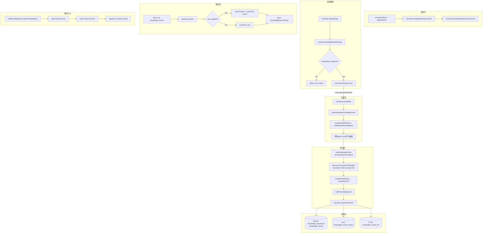

# 知识库后端引擎总览

<cite>
**本文引用的文件**
- [scripts/knowledge/run-repowiki.py](file://scripts/knowledge/run-repowiki.py)
- [src/electron/libs/knowledge/agent-cards.ts](file://src/electron/libs/knowledge/agent-cards.ts)
- [src/electron/libs/knowledge/embedding-client.ts](file://src/electron/libs/knowledge/embedding-client.ts)
- [src/electron/libs/knowledge/knowledge-indexer.ts](file://src/electron/libs/knowledge/knowledge-indexer.ts)
- [src/electron/libs/knowledge/knowledge-model-settings.ts](file://src/electron/libs/knowledge/knowledge-model-settings.ts)
- [src/electron/libs/knowledge/knowledge-overview.ts](file://src/electron/libs/knowledge/knowledge-overview.ts)
- [src/electron/libs/knowledge/knowledge-paths.ts](file://src/electron/libs/knowledge/knowledge-paths.ts)
- [src/electron/libs/knowledge/knowledge-repository.ts](file://src/electron/libs/knowledge/knowledge-repository.ts)
- [src/electron/libs/git/README.md](file://src/electron/libs/git/README.md)
</cite>

## 目录

- [职责定位](#职责定位)
- [核心模块与入口文件](#核心模块与入口文件)
- [调用链与数据流](#调用链与数据流)
- [数据结构与存储](#数据结构与存储)
- [配置体系](#配置体系)
- [失败模式与排障](#失败模式与排障)
- [扩展点与改造路径](#扩展点与改造路径)
- [验证命令](#验证命令)

---

## 职责定位

`knowledge-engine` 模块是 tech-cc-hub 的**知识摄取与检索引擎**，负责将项目文档、Agent Cards、Repo Wiki 文本转化为可向量检索的语义知识库，供会话时注入上下文或 MCP 工具调用。

它的核心职责有三层：

| 层级 | 职责 | 关键文件 |
|------|------|---------|
| **生成层** | 调用 LLM 生成 Repo Wiki 文档和 Agent Knowledge Cards | `agent-cards.ts`、`repowiki/engine.ts` |
| **索引层** | 将生成的 Markdown 文件分块、向量化、写入 SQLite + sqlite-vec | `knowledge-indexer.ts` |
| **检索层** | 支持向量搜索 + FTS5 混合检索，生成聊天 overview 注入片段 | `knowledge-repository.ts`、`knowledge-overview.ts` |

[章节来源](file://scripts/knowledge/run-repowiki.py#L247-L255)

---

## 核心模块与入口文件

### 2.1 入口：`knowledge-indexer.ts`

`indexKnowledgeWorkspace()` 是整个引擎的唯一公开入口函数。

```typescript
// 签名（knowledge-indexer.ts 第 170-175 行）
export async function indexKnowledgeWorkspace(options: {
  workspaceRoot: string;
  appDataPath: string;
  mode: KnowledgeIndexMode;  // "generate" | "refresh" | "index-only"
  onProgress?: (event: RepoWikiProgressEvent) => void;
}): Promise<KnowledgeIndexReport>
```

**调用流程概述：**

1. `resolveKnowledgeWorkspacePaths()` → 解析 workspace 路径和 `.tech/` 目录
2. `resolveKnowledgeModelSettings()` → 从配置读取 embedding/wiki 模型参数
3. 若 `mode === "generate"` 或 `"refresh"`，调用 `maybeGenerateWiki()` 生成 Repo Wiki
4. 调用 `generateAgentKnowledgeCards()` 生成 Agent Cards
5. `collectMarkdownFiles()` 收集 `.tech/repowiki/zh/content/` 下的所有 Markdown
6. `RecursiveCharacterTextSplitter` 分块（默认 chunkSize=1800，overlap=220）
7. `embedTextBatches()` 调用 embedding API 向量化
8. `KnowledgeRepository.upsertDocument()` 写入 SQLite + sqlite-vec

[章节来源](file://src/electron/libs/knowledge/knowledge-indexer.ts#L170-L337)

### 2.2 Agent Cards 生成：`agent-cards.ts`

`generateAgentKnowledgeCards()` 是卡片生成的入口，它依赖 RepoWiki 的分析能力：

```typescript
// 入口函数（agent-cards.ts 第 50-72 行）
export function generateAgentKnowledgeCards(paths: KnowledgeWorkspacePaths): AgentKnowledgeCardsResult {
  // 1. 扫描整个项目（最多 1800 个文件，240KB/文件）
  const scan = scanRepoWikiProject(paths.workspaceRoot, {
    maxFileSize: 240 * 1024,
    maxFiles: 1_800,
    previewLines: 80,
  });
  // 2. 构建依赖图
  const graph = RepoWikiDependencyGraph.buildFromProject(scan.project);
  // 3. 生成项目智能情报
  const intelligence = buildRepoWikiIntelligence(scan.project, graph);
  
  // 4. 生成 7 类卡片
  const cards = dedupeCards([
    ...buildRuntimeFlowCards(intelligence),    // 运行链路卡片
    ...buildModuleCards(intelligence),          // 模块改造入口卡片
    ...buildEntryPointCards(intelligence),     // 运行入口卡片
    ...buildMcpCards(intelligence),            // MCP 工具面卡片
    ...buildDatabaseCards(intelligence),       // 数据库存储面卡片
    ...buildQaCards(intelligence),             // 验证命令卡片
    ...buildAgentQuestionCards(intelligence), // Agent 问答卡片
  ]);
  
  // 5. 写入 .tech/repowiki/zh/agent-cards/ 目录
  return { cards, generatedFiles: writeAgentCards(paths, cards), skippedFiles: scan.skipped };
}
```

**卡片类型含义：**

| 类型 | 用途 | 关键字段 |
|------|------|---------|
| `runtime_flow` | 说明跨模块调用链路 | `runtimeSteps`（步骤序列）、`entryFiles`（证据文件） |
| `module` | 按模块组织高价值文件 | `sourceSignals`（代码信号如 `ipc`, `database`） |
| `entrypoint` | 项目启动入口 | 包含 Vite/Electron/main 等启动相关文件 |
| `mcp` | MCP 工具注册点 | 包含 `knowledge_search`, `knowledge_read` 等工具 |
| `database` | SQLite/FTS/vec 存储面 | 指向 `knowledge_documents`、`knowledge_chunks` 表 |
| `qa` | 验证命令入口 | `validation` 字段列出 `npm run` 命令 |
| `agent_question` | 常见问答 | 包含 `sourceQuestion`、`sourceAnswer` |

[章节来源](file://src/electron/libs/knowledge/agent-cards.ts#L50-L72)

### 2.3 向量嵌入客户端：`embedding-client.ts`

负责与 embedding API 交互，支持重试和批量处理：

```typescript
// 核心函数（embedding-client.ts 第 83-96 行）
export async function embedTexts(settings: EmbeddingModelSettings, texts: string[]): Promise<number[][]>

// 批量版本（embedding-client.ts 第 98-121 行）
export async function embedTextBatches(
  settings: EmbeddingModelSettings,
  texts: string[],
  onProgress?: (progress: { completed: number; total: number }) => void,
): Promise<number[][]>
```

**关键行为：**
- 重试机制：失败后最多重试 3 次，间隔 350ms × attempt
- 批量分页：`batchSize` 默认 16，最大 128
- 向量归一化：检查维度是否与配置的 `dimension` 匹配，不匹配抛出错误

### 2.4 模型配置解析：`knowledge-model-settings.ts`

从 `config-store` 读取 profile 配置：

```typescript
// 入口函数（knowledge-model-settings.ts 第 49-83 行）
export function resolveKnowledgeModelSettings(): KnowledgeModelSettings
```

**配置来源：**
- `embeddingProfile`：第一个配置了 `embeddingModel` 的 profile
- `wikiProfile`：第一个配置了 `wikiModel` 的 profile
- 维度自动推断：匹配 `qwen3-embedding-*`、`text-embedding-3-*` 等模型名

```typescript
const KNOWN_EMBEDDING_DIMENSIONS = [
  { pattern: /qwen3-embedding-0\.6b/i, dimension: 1024 },
  { pattern: /qwen3-embedding-4b/i, dimension: 2560 },
  { pattern: /qwen3-embedding-8b/i, dimension: 4096 },
  { pattern: /text-embedding-3-small/i, dimension: 1536 },
  { pattern: /text-embedding-3-large/i, dimension: 3072 },
];
```

---

## 调用链与数据流



[图表来源](file://src/electron/libs/knowledge/knowledge-indexer.ts#L170-L352)

---

## 数据结构与存储

### 5.1 核心表结构（`knowledge-repository.ts` 第 80-137 行）

| 表名 | 用途 | 关键字段 |
|------|------|---------|
| `knowledge_documents` | 文档元数据 | `id`, `workspace_scope`, `source_kind`, `source_path`, `title`, `summary`, `content_hash` |
| `knowledge_chunks` | 分块内容 | `id`, `document_id`, `chunk_index`, `token_estimate`, `embedding_model`, `embedding_dimension` |
| `knowledge_chunks_fts` | FTS5 全文索引 | `title`, `content`, `source_path`, `tags` |
| `knowledge_chunk_vectors` | sqlite-vec 向量 | `chunk_rowid`, `embedding float[N]` |
| `knowledge_index_runs` | 索引运行记录 | `workspace_scope`, `mode`, `status`, `report` |

### 5.2 路径结构（`knowledge-paths.ts` 第 36-72 行）

```
{workspaceRoot}/
├── .tech/                         # 产出目录
│   ├── repowiki/zh/
│   │   ├── content/               # Repo Wiki 生成的 Markdown
│   │   ├── agent-cards/           # Agent Knowledge Cards
│   │   └── meta/                  # 元数据
│   ├── memory/                    # Memory 系统数据
│   └── reports/                   # 索引状态报告
│       ├── index-state.json
│       ├── skipped-files.json
│       └── generation-report.json
└── appData/knowledge/{workspaceHash}/
    ├── knowledge.sqlite           # 主知识库
    └── memory.sqlite              # Memory 库
```

### 5.3 SourceKind 分类

| SourceKind | 来源 | 标签 |
|------------|------|------|
| `repowiki` | `generateRepoWiki()` 生成的文档 | `["repowiki", "markdown"]` |
| `agent_card` | `generateAgentKnowledgeCards()` 生成的卡片 | `["agent-card", "repowiki", "code-routing"]` |
| 自定义 | 未来扩展 | 按需定义 |

[章节来源](file://src/electron/libs/knowledge/knowledge-paths.ts#L36-L72)

---

## 配置体系

### 6.1 模型配置优先级

1. 从 `loadApiConfigSettings()` 获取所有 profile
2. 过滤 `enabled=true` 且 `apiKey` + `baseURL` 非空
3. 第一个有 `embeddingModel` 的 profile 作为 embedding 源
4. 第一个有 `wikiModel` 的 profile 作为 wiki 生成源

### 6.2 必需配置项

```typescript
// 最小可用配置（knowledge-model-settings.ts 第 85-90 行）
export function assertEmbeddingConfigured(): EmbeddingModelSettings {
  if (!settings.embedding) {
    throw new Error("Knowledge Engine 未启用：请先在模型设置里配置向量模型 embeddingModel。");
  }
}
```

**最小配置要求：**

| 配置项 | 说明 | 示例 |
|--------|------|------|
| `embeddingModel` | 向量模型名称 | `text-embedding-3-small` |
| `apiKey` | API 密钥 | - |
| `baseURL` | API 端点 | `https://api.openai.com/v1` |

**可选配置项：**

| 配置项 | 默认值 | 说明 |
|--------|--------|------|
| `embeddingDimension` | 1536 | 向量维度，需与模型匹配 |
| `embeddingBatchSize` | 16 | 批处理大小，最大 128 |
| `wikiModel` | - | Wiki 生成模型 |
| `wikiModelMaxInputTokens` | 16000 | Wiki 输入上限 |
| `wikiModelMaxOutputTokens` | 4000 | Wiki 输出上限 |

[章节来源](file://src/electron/libs/knowledge/knowledge-model-settings.ts#L49-L83)

---

## 失败模式与排障

### 7.1 常见失败场景

| 错误码 | 原因 | 处理方式 |
|--------|------|---------|
| `missing-embedding-model` | 未配置 embeddingModel | 在模型设置中添加 embedding 配置 |
| `sqlite-vec-unavailable` | sqlite-vec 扩展未加载 | 检查 better-sqlite3 和 sqlite-vec 版本兼容性 |
| 向量维度不匹配 | 配置的 dimension 与实际模型不符 | 检查 `embeddingDimension` 或使用已知模型映射 |
| 非 JSON 响应 | embedding API 返回非 JSON | 检查 API 端点和网络 |
| 缺少 chunk 向量 | embedding 数量与 chunk 数量不一致 | 重新触发索引 |

### 7.2 诊断步骤

**检查索引状态：**

```bash
cat {workspaceRoot}/.tech/reports/index-state.json
```

正常输出示例：

```json
{
  "success": true,
  "vectorStoreReady": true,
  "indexedDocuments": 42,
  "indexedChunks": 312,
  "generatedFiles": ["content/模块索引.md", "agent-cards/运行链路-知识库索引.md"]
}
```

**检查 skipped 文件：**

```bash
cat {workspaceRoot}/.tech/reports/skipped-files.json
```

**检查生成报告：**

```bash
cat {workspaceRoot}/.tech/reports/generation-report.json
```

[章节来源](file://src/electron/libs/knowledge/knowledge-indexer.ts#L323-L335)

### 7.3 聊天注入失败诊断

`buildKnowledgeOverviewPromptAppend()` 返回 XML 格式的 overview，失败时：

```xml
<!-- 未配置 embedding -->
<knowledge_overview enabled="false" scope="workspace:tech-cc-hub" reason="missing_embedding_model">
  Knowledge Engine requires an embeddingModel...
</knowledge_overview>

<!-- 无索引内容 -->
<knowledge_overview enabled="true" indexed="false" scope="workspace:tech-cc-hub">
  No indexed knowledge yet...
</knowledge_overview>
```

[章节来源](file://src/electron/libs/knowledge/knowledge-overview.ts#L30-L73)

---

## 扩展点与改造路径

### 8.1 新增 SourceKind

1. 在 `knowledge-types.ts` 定义新的 `KnowledgeSourceKind`
2. 在 `knowledge-indexer.ts` 的 `allFiles` 构建逻辑中添加对应处理
3. 在 `knowledge-repository.ts` 确保 `deleteWorkspaceDocumentsNotIn` 能正确清理

### 8.2 替换 Embedding Provider

修改 `embedding-client.ts` 的 `requestEmbeddings()` 函数：

```typescript
// 当前实现仅支持 OpenAI compatible API
// 替换时需保持以下契约：
// 1. 输入：{ model, input: string[] }
// 2. 输出：{ data: [{ embedding: number[], index: number }] }
// 3. 异常：抛出 Error 对象
```

### 8.3 自定义卡片类型

在 `agent-cards.ts` 的 `dedupeCards()` 之前添加新的 builder 函数：

```typescript
function buildCustomCards(intelligence: RepoWikiProjectIntelligence): AgentKnowledgeCard[] {
  // 1. 从 intelligence 提取所需数据
  // 2. 返回 AgentKnowledgeCard[] 数组
}
```

### 8.4 修改分块策略

`knowledge-indexer.ts` 第 253-256 行：

```typescript
const splitter = new RecursiveCharacterTextSplitter({
  chunkSize: DEFAULT_CHUNK_SIZE,    // 默认 1800
  chunkOverlap: DEFAULT_CHUNK_OVERLAP,  // 默认 220
});
```

调整这两个常量可改变分块粒度。

### 8.5 自定义 Overview 渲染

`knowledge-overview.ts` 的 `groupKnowledge()` 和 `groupMemory()` 控制分类逻辑，可通过修改这两个函数改变 overview 的 XML 结构。

[章节来源](file://src/electron/libs/knowledge/agent-cards.ts#L60-L68)

---

## 验证命令

### 9.1 触发完整索引

```bash
# 通过 MCP tool 触发
mcp__tech-cc-hub-knowledge__knowledge_index

# 或通过 Electron IPC
```

### 9.2 验证 embedding 可用性

检查 `.tech/reports/index-state.json` 中的 `embeddingEnabled` 和 `vectorStoreReady`：

```bash
cat .tech/reports/index-state.json | jq '.embeddingEnabled, .vectorStoreReady'
```

### 9.3 验证聊天注入

检查会话 system prompt 中是否包含 `<knowledge_overview>` 标签。

### 9.4 QA 命令

| 命令 | 验证内容 |
|------|---------|
| `npm run build` | 打包验证，间接验证索引入口正确 |
| `npm run qa:knowledge` | 知识库相关 QA |
| `npm run qa:knowledge-chat` | 聊天注入链路验证 |
| `npm run qa:knowledge-ui` | UI 层知识库组件验证 |

[章节来源](file://src/electron/libs/knowledge/agent-cards.ts#L337-L358)

---

## 总结

`knowledge-engine` 是一个**生成-索引-检索**三层架构的知识库引擎。核心数据流是：`Repo Wiki / Agent Cards` → `Markdown 分块` → `Embedding 向量化` → `SQLite + sqlite-vec 存储` → `MCP 工具检索` + `会话 Overview 注入`。

理解这个流程后，定位问题的入口是 `index-state.json`，修改分块逻辑在 `knowledge-indexer.ts`，修改检索逻辑在 `knowledge-repository.ts`，修改聊天注入在 `knowledge-overview.ts`。