# 知识库后端引擎总览

<cite>

**本文引用的文件**

- [scripts/knowledge/run-repowiki.py](file://scripts/knowledge/run-repowiki.py)
- [src/electron/libs/knowledge/agent-cards.ts](file://src/electron/libs/knowledge/agent-cards.ts)
- [src/electron/libs/knowledge/embedding-client.ts](file://src/electron/libs/knowledge/embedding-client.ts)
- [src/electron/libs/knowledge/knowledge-indexer.ts](file://src/electron/libs/knowledge/knowledge-indexer.ts)
- [src/electron/libs/knowledge/knowledge-model-settings.ts](file://src/electron/libs/knowledge/knowledge-model-settings.ts)
- [src/electron/libs/knowledge/knowledge-overview.ts](file://src/electron/libs/knowledge/knowledge-overview.ts)
- [src/electron/libs/knowledge/knowledge-paths.ts](file://src/electron/libs/knowledge/knowledge-paths.ts)
- [src/electron/libs/knowledge/knowledge-repository.ts](file://src/electron/libs/knowledge/knowledge-repository.ts)
- [src/electron/libs/git/README.md](file://src/electron/libs/git/README.md)

</cite>

---

## 目录

- [模块定位与职责边界](#模块定位与职责边界)
- [核心入口文件](#核心入口文件)
- [调用链路与数据流](#调用链路与数据流)
- [关键数据结构](#关键数据结构)
- [配置与参数](#配置与参数)
- [失败模式与诊断](#失败模式与诊断)
- [扩展点与改造路径](#扩展点与改造路径)
- [验证命令](#验证命令)

---

## 模块定位与职责边界

`knowledge-engine` 是 tech-cc-hub 的**知识库后端引擎**，隶属于 `src/electron/libs/knowledge/` 目录。它负责将项目代码和文档转化为可检索、可注入的知识资产，供 Agent 在会话中调用。

**核心职责**：

| 职责 | 说明 |
|------|------|
| Repo Wiki 生成 | 扫描项目源码，自动生成结构化 Markdown 文档 |
| Agent Cards 生成 | 根据模块、入口、依赖图生成面向 Agent 的知识卡片 |
| 向量索引构建 | 调用 embedding API 将文本 chunk 转为向量并写入 SQLite/vec0 |
| 聊天上下文注入 | 在会话开始时将知识库摘要注入 system prompt |
| 知识检索 | 支持 FTS5 全文检索和向量相似度检索 |

**边界**：知识库引擎运行在 Electron 主进程，通过 IPC 与 Renderer 交互。它不直接处理 UI 渲染（那是 `knowledge-ui` 的职责），也不处理 MCP 工具注册（那是 `mcp-tools` 的职责）。

> **章节来源**：[file://scripts/knowledge/run-repowiki.py#L288-L294](file://scripts/knowledge/run-repowiki.py#L288-L294) 模块路径映射逻辑

---

## 核心入口文件

### 1. `indexKnowledgeWorkspace` - 索引主入口

```typescript
// src/electron/libs/knowledge/knowledge-indexer.ts#L170
export async function indexKnowledgeWorkspace(options: {
  workspaceRoot: string;
  appDataPath: string;
  mode: KnowledgeIndexMode;
  onProgress?: (event: RepoWikiProgressEvent) => void;
}): Promise<KnowledgeIndexReport>
```

这是索引流程的唯一公开入口函数。接收工作区路径、应用数据路径和索引模式（`generate` | `refresh` | `incremental`），返回索引报告。

**调用顺序**：

1. 解析路径 → `resolveKnowledgeWorkspacePaths`
2. 加载模型配置 → `resolveKnowledgeModelSettings`
3. 检查 sqlite-vec 可用性
4. 生成 Repo Wiki（mode 允许时） → `generateRepoWiki`
5. 生成 Agent Cards → `generateAgentKnowledgeCards`
6. 收集 markdown 文件 → `collectMarkdownFiles`
7. 文本分块 → `RecursiveCharacterTextSplitter`
8. 调用 embedding API → `embedTextBatches`
9. 写入数据库 → `buildKnowledgeInputs`

> **章节来源**：[file://src/electron/libs/knowledge/knowledge-indexer.ts#L170-L352](file://src/electron/libs/knowledge/knowledge-indexer.ts#L170-L352) 完整索引流程

### 2. `buildKnowledgeOverviewPromptAppend` - 上下文注入入口

```typescript
// src/electron/libs/knowledge/knowledge-overview.ts#L30
export function buildKnowledgeOverviewPromptAppend(projectCwd?: string): string | undefined
```

在会话开始时被调用，将知识库状态摘要注入 system prompt。返回 `<knowledge_overview>` XML 标签块，包含：

- `agent_cards` 列表（最多 18 张）
- `repowiki` 按 category 分组的条目
- `memory` 记忆条目

### 3. `generateAgentKnowledgeCards` - Agent 知识卡片生成入口

```typescript
// src/electron/libs/knowledge/agent-cards.ts#L50
export function generateAgentKnowledgeCards(paths: KnowledgeWorkspacePaths): AgentKnowledgeCardsResult
```

生成七类知识卡片：runtime_flow、module、entrypoint、mcp、database、qa、agent_question。每张卡片包含 `entryFiles`、`relatedFiles`、`changeGuide`、`validation` 和 `risks` 字段。

> **章节来源**：[file://src/electron/libs/knowledge/agent-cards.ts#L50-L72](file://src/electron/libs/knowledge/agent-cards.ts#L50-L72) 卡片生成入口

### 4. Python Runner - Repo Wiki 自动化入口

```bash
# scripts/knowledge/run-repowiki.py
python scripts/knowledge/run-repowiki.py --workspace /path/to/workspace
```

支持通过环境变量配置目标模型：
- `TECH_CC_HUB_REPOWIKI_TARGET_PAGES`：目标页面数（默认 48）

> **章节来源**：[file://scripts/knowledge/run-repowiki.py#L277-L285](file://scripts/knowledge/run-repowiki.py#L277-L285) 目标页面数计算

---

## 调用链路与数据流

```mermaid
flowchart TD
    subgraph 索引流程["索引流程 (indexKnowledgeWorkspace)"]
        A["resolveKnowledgeWorkspacePaths<br/>knowledge-paths.ts"] --> B["resolveKnowledgeModelSettings<br/>knowledge-model-settings.ts"]
        B --> C{"sqlite-vec<br/>可用?"}
        C -->|是| D["generateRepoWiki<br/>repowiki/engine.ts"]
        D --> E["generateAgentKnowledgeCards<br/>agent-cards.ts"]
        C -->|否| F["返回错误报告"]
        E --> G["collectMarkdownFiles<br/>knowledge-indexer.ts"]
        G --> H["RecursiveCharacterTextSplitter<br/>分块"]
        H --> I["embedTextBatches<br/>embedding-client.ts"]
        I --> J["Embedding API<br/>外部服务"]
        J --> K["buildKnowledgeInputs<br/>knowledge-indexer.ts"]
        K --> L["KnowledgeRepository.upsertDocument<br/>knowledge-repository.ts"]
        L --> M["SQLite + vec0<br/>本地存储"]
    end

    subgraph 检索流程["检索流程 (MCP Tool 调用)"]
        N["search() 调用"] --> O["KnowledgeRepository.search"]
        O -->|mode=deep| P["向量检索"]
        O -->|mode=shallow| Q["FTS5 检索"]
        P --> R["向量相似度计算"]
        Q --> R
        R --> S["返回 KnowledgeSearchResult[]"]
    end

    subgraph 注入流程["上下文注入 (buildKnowledgeOverviewPromptAppend)"]
        T["buildKnowledgeOverviewPromptAppend"] --> U["repo.buildOverview<br/>获取摘要"]
        U --> V["渲染 XML 结构"]
        V --> W["注入 system prompt"]
    end
```



**索引流程说明**：

1. **路径解析** → `knowledge-paths.ts` 生成所有目录路径
2. **配置加载** → `knowledge-model-settings.ts` 从 `config-store.ts` 读取 API 配置
3. **Wiki 生成** → 调用 `repowiki/engine.ts` 扫描源码生成 Markdown
4. **Agent Cards** → 调用 `agent-cards.ts` 生成结构化知识卡片
5. **文本分块** → 使用 LangChain 的 `RecursiveCharacterTextSplitter`（chunkSize=1800, overlap=220）
6. **向量生成** → `embedding-client.ts` 调用外部 embedding API，失败自动重试 3 次
7. **持久化写入** → `knowledge-repository.ts` 写入 SQLite（文档表、chunk 表、FTS5、vec0）

> **图表来源**：[file://src/electron/libs/knowledge/knowledge-indexer.ts#L170-L352](file://src/electron/libs/knowledge/knowledge-indexer.ts#L170-L352) 索引主流程

---

## 关键数据结构

### KnowledgeWorkspacePaths

```typescript
// src/electron/libs/knowledge/knowledge-paths.ts#L5-L26
export type KnowledgeWorkspacePaths = {
  workspaceRoot: string;
  workspaceScope: string;        // "workspace:{dirname}"
  workspaceHash: string;        // sha256 前 16 位
  techRoot: string;             // .tech/
  repowikiContentDir: string;    // .tech/repowiki/zh/content/
  agentCardsDir: string;        // .tech/repowiki/zh/agent-cards/
  knowledgeDbPath: string;       // appData/knowledge/{hash}/knowledge.sqlite
  memoryDbPath: string;          // appData/knowledge/{hash}/memory.sqlite
  // ...
};
```

**关键约定**：
- `.tech/` 目录为用户可见的文档输出目录
- `appData/knowledge/` 为运行时数据库，不应放入用户代码库

### EmbeddingModelSettings

```typescript
// src/electron/libs/knowledge/knowledge-model-settings.ts#L54-L66
interface EmbeddingModelSettings {
  profileId: string;
  profileName: string;
  apiKey: string;
  baseURL: string;
  model: string;
  dimension: number;           // 1536 (text-embedding-3-small) | 3072 | 1024 | 2560 | 4096
  batchSize: number;         // 默认 16，最大 128
}
```

已知模型维度映射：

| 模型名 | 维度 |
|--------|------|
| text-embedding-3-small | 1536 |
| text-embedding-3-large | 3072 |
| qwen3-embedding-0.6b | 1024 |
| qwen3-embedding-4b | 2560 |
| qwen3-embedding-8b | 4096 |

> **章节来源**：[file://src/electron/libs/knowledge/knowledge-model-settings.ts#L16-L22](file://src/electron/libs/knowledge/knowledge-model-settings.ts#L16-L22) 已知维度映射

### KnowledgeRepository 数据库 Schema

```sql
-- src/electron/libs/knowledge/knowledge-repository.ts#L83-L137
-- 文档表
CREATE TABLE knowledge_documents (
  id TEXT PRIMARY KEY,
  workspace_scope TEXT NOT NULL,
  source_kind TEXT NOT NULL,      -- "repowiki" | "agent_card"
  source_path TEXT NOT NULL,
  title TEXT NOT NULL,
  summary TEXT,
  tags TEXT,
  metadata TEXT,
  content_hash TEXT NOT NULL,
  created_at INTEGER NOT NULL,
  updated_at INTEGER NOT NULL,
  UNIQUE(workspace_scope, source_kind, source_path)
);

-- Chunk 表
CREATE TABLE knowledge_chunks (
  id TEXT PRIMARY KEY,
  document_id TEXT REFERENCES knowledge_documents(id) ON DELETE CASCADE,
  chunk_index INTEGER NOT NULL,
  token_estimate INTEGER NOT NULL,
  embedding_model TEXT,
  embedding_dimension INTEGER,
  -- ...
);

-- FTS5 全文索引
CREATE VIRTUAL TABLE knowledge_chunks_fts USING fts5(
  title, content, source_path, tags
);

-- 向量索引
CREATE VIRTUAL TABLE knowledge_chunk_vectors USING vec0(
  chunk_rowid integer primary key,
  embedding float[{dimension}]
);
```

---

## 配置与参数

### 模型配置来源

配置通过 `loadApiConfigSettings()` 从配置文件读取，必须满足以下条件才被视为可用：

```typescript
// src/electron/libs/knowledge/knowledge-model-settings.ts#L38-L40
function isUsableProfile(profile: ApiConfig): boolean {
  return Boolean(profile.enabled && profile.apiKey.trim() && profile.baseURL.trim());
}
```

**profile 筛选规则**（`knowledge-model-settings.ts#L49-L52`）：

| 字段 | 用途 | 来源 profile |
|------|------|-------------|
| `embeddingModel` | 向量生成模型 | embeddingModel 非空的第一个 profile |
| `wikiModel` | Wiki 生成模型 | wikiModel 非空的第一个 profile |

### Embedding 请求参数

```typescript
// src/electron/libs/knowledge/embedding-client.ts#L41-L51
const body = {
  model: settings.model,         // 如 "text-embedding-3-small"
  input: texts,                 // 批量文本数组
};
```

- **重试策略**：失败后指数退避（350ms × attempt），最多 3 次
- **批处理大小**：由 `settings.batchSize` 控制，默认 16
- **单条失败回退**：批量失败时自动降级为逐条请求（`embedding-client.ts#L114-L117`）

---

## 失败模式与诊断

### 1. 缺少 embedding 模型

**表现**：

```json
{
  "success": false,
  "error": "missing-embedding-model",
  "message": "Knowledge Engine 未启用：缺少 embeddingModel，不能只用 FTS5 开启知识库。"
}
```

**诊断**：

```typescript
// knowledge-indexer.ts#L192-L201
if (!settings.embedding) {
  const report: KnowledgeIndexReport = {
    success: false,
    error: "missing-embedding-model",
  };
  writeJson(paths.indexStatePath, report);
  return report;
}
```

**排查步骤**：

1. 检查 `config-store.ts` 中是否存在 `embeddingModel` 配置
2. 确认 profile 的 `enabled`、`apiKey`、`baseURL` 均已填写

### 2. sqlite-vec 扩展不可用

**表现**：

```json
{
  "success": false,
  "error": "sqlite-vec-unavailable",
  "message": "Knowledge Engine 未启用：sqlite-vec 扩展不可用。"
}
```

**诊断路径**：

```typescript
// knowledge-repository.ts#L156-L159
} catch (error) {
  this.vectorAvailable = false;
  console.warn("[knowledge] sqlite-vec unavailable:", error);
}
```

**排查步骤**：

1. 检查 Electron 是否使用了正确版本的 better-sqlite3（含 vec 扩展）
2. 确认 `loadSqliteVec` 能成功加载

### 3. Embedding API 调用失败

**表现**：`embedding-client.ts` 抛出 `RuntimeError: LLM returned empty content`

**诊断**：

```typescript
// embedding-client.ts#L85-L96
for (let attempt = 1; attempt <= 3; attempt += 1) {
  try {
    return await requestEmbeddings(settings, texts);
  } catch (error) {
    if (attempt < 3) {
      await sleep(350 * attempt);  // 指数退避
    }
  }
}
```

**常见原因**：

- API Key 无效或过期
- baseURL 配置错误（缺少尾部斜杠已被 `normalizeBase` 处理）
- 模型名不匹配
- 网络超时

### 4. 索引状态文件

每次索引运行后，结果写入 `paths.indexStatePath`：

```typescript
// knowledge-indexer.ts#L322
writeJson(paths.indexStatePath, report);
```

可通过读取 `.tech/reports/index-state.json` 快速诊断上次运行状态。

---

## 扩展点与改造路径

### 扩展点 1：新增知识来源类型

当前支持 `sourceKind: "repowiki" | "agent_card"`。

**改造步骤**：

1. 在 `knowledge-types.ts` 中添加新的 `KnowledgeSourceKind`
2. 在 `knowledge-indexer.ts` 的 `allFiles` 数组中新增来源
3. 在 `knowledge-repository.ts` 的 `initialize()` 中确保索引正确

> **章节来源**：[file://src/electron/libs/knowledge/knowledge-indexer.ts#L231-L246](file://src/electron/libs/knowledge/knowledge-indexer.ts#L231-L246) 来源类型映射

### 扩展点 2：自定义 Agent Card 类型

`agent-cards.ts` 的 `buildXxxCards` 函数家族是开放的扩展点：

```typescript
// agent-cards.ts#L60-L68
const cards = dedupeCards([
  ...buildRuntimeFlowCards(intelligence),
  ...buildModuleCards(intelligence),
  ...buildEntryPointCards(intelligence),
  ...buildMcpCards(intelligence),
  ...buildDatabaseCards(intelligence),
  ...buildQaCards(intelligence),
  ...buildAgentQuestionCards(intelligence),
]);
```

**改造步骤**：

1. 新增 `buildCustomCards(intelligence)` 函数
2. 在数组中追加 `[...buildCustomCards(intelligence)]`
3. 在 `inferValidation` 中添加对应的脚本匹配规则

### 扩展点 3：切换 Embedding Provider

当前使用 OpenAI 兼容 API。切换步骤：

1. 在 `knowledge-model-settings.ts` 添加新的 provider 识别逻辑
2. 在 `embedding-client.ts` 中调整 `requestEmbeddings` 的请求格式
3. 维护 `KNOWN_EMBEDDING_DIMENSIONS` 映射表

### 扩展点 4：调整 Chunk 分块策略

当前默认值：

```typescript
// knowledge-indexer.ts#L28-L29
const DEFAULT_CHUNK_SIZE = 1_800;    // tokens
const DEFAULT_CHUNK_OVERLAP = 220;  // tokens
```

**改造方式**：在 `indexKnowledgeWorkspace` 调用 `RecursiveCharacterTextSplitter` 前调整参数，或从配置读取。

### 扩展点 5：Python Runner 自定义 Catalog

`run-repowiki.py` 的 `_fallback_catalogs` 函数定义了默认生成主题：

```python
# scripts/knowledge/run-repowiki.py#L190-L273
if any("knowledge" in path for path in paths):
    catalogs.append({
        "name": "知识库和Repo Wiki系统",
        "description": "knowledge-engine",
        "prompt": "详细说明知识库、Repo Wiki 生成、向量索引...",
        "dependent_files": ["src/electron/libs/knowledge/", ...],
        "parent": "核心架构设计",
        "order": 5,
    })
```

**改造步骤**：

1. 在 `_module_for_path` 中添加新模块识别规则
2. 在 `_module_title` 中添加中文标题
3. 在 `_fallback_catalogs` 中添加 catalog 条目

---

## 验证命令

### 构建和索引

```bash
# 完整构建
npm run build

# 索引知识库
npm run qa:knowledge

# 仅索引聊天注入链路
npm run qa:knowledge-chat

# 仅验证 UI 相关知识
npm run qa:knowledge-ui
```

### 手动触发索引（Electron IPC）

```typescript
// 调用 IPC 端点
ipcRenderer.invoke('knowledge:index', {
  workspaceRoot: '/path/to/workspace',
  mode: 'generate',  // 'generate' | 'refresh' | 'incremental'
});
```

### 检查索引状态

```bash
# 查看最近索引报告
cat .tech/reports/index-state.json

# 查看跳过的文件
cat .tech/reports/skipped-files.json

# 查看生成报告
cat .tech/reports/generation-report.json
```

### Agent Card 验证

```bash
# Agent Cards 输出目录
ls .tech/repowiki/zh/agent-cards/

# 检查特定卡片内容
cat ".tech/repowiki/zh/agent-cards/模块改造入口：knowledge-engine.md"
```

### 数据库直接查询

```sql
-- 查看已索引文档数
SELECT source_kind, COUNT(*) FROM knowledge_documents GROUP BY source_kind;

-- 查看 chunk 总数
SELECT COUNT(*) FROM knowledge_chunks;

-- FTS5 检索测试
SELECT * FROM knowledge_chunks_fts WHERE content MATCH '知识库';
```

> **章节来源**：[file://src/electron/libs/knowledge/agent-cards.ts#L337-L358](file://src/electron/libs/knowledge/agent-cards.ts#L337-L358) QA 脚本推断逻辑

---

## 总结

| 维度 | 说明 |
|------|------|
| **入口** | `indexKnowledgeWorkspace`（索引）、`buildKnowledgeOverviewPromptAppend`（注入）、`generateAgentKnowledgeCards`（卡片） |
| **核心依赖** | embedding API、SQLite + vec0、`config-store.ts` |
| **输出位置** | `.tech/repowiki/zh/content/`、`.tech/repowiki/zh/agent-cards/`、`appData/knowledge/*.sqlite` |
| **失败主因** | 缺少 embedding 配置、sqlite-vec 不可用、API 调用失败 |
| **主要扩展点** | 新增 sourceKind、新增 Card 类型、切换 provider、调整 chunk 策略 |

> **章节来源**：[file://scripts/knowledge/run-repowiki.py#L349-L355](file://scripts/knowledge/run-repowiki.py#L349-L355) 模块优先级配置