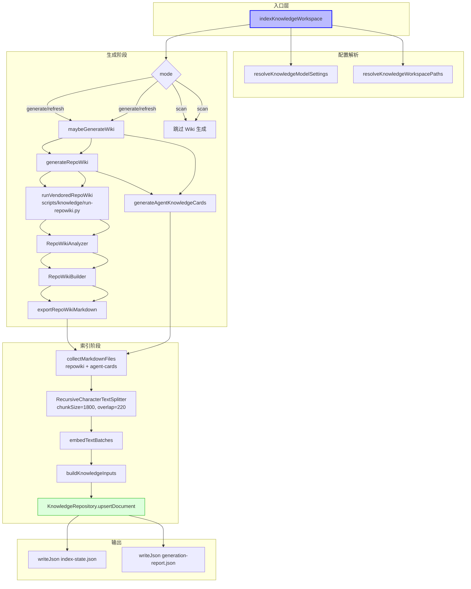
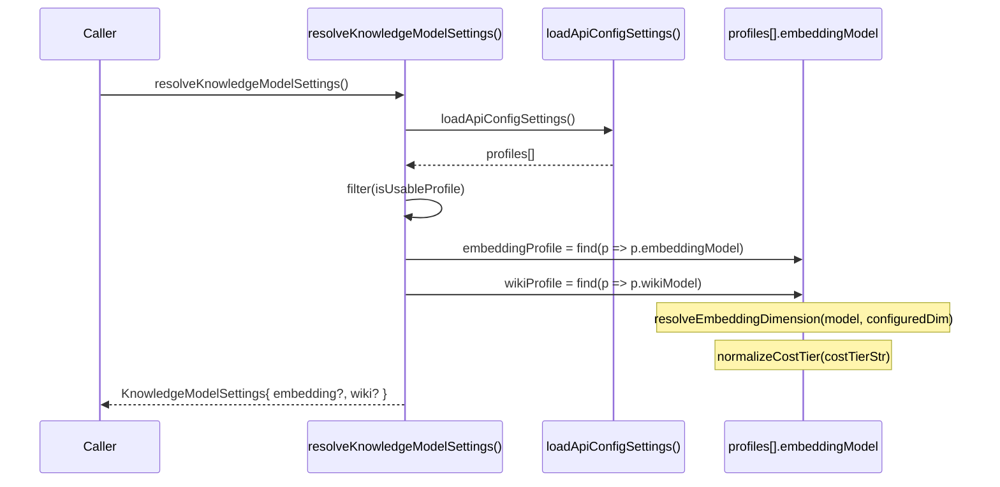
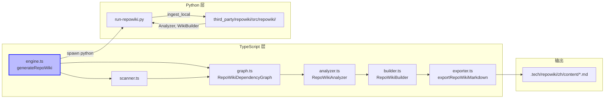

# 知识库后端引擎总览

<cite>
**本文引用的文件**

- [scripts/knowledge/run-repowiki.py](file://scripts/knowledge/run-repowiki.py)
- [src/electron/libs/knowledge/agent-cards.ts](file://src/electron/libs/knowledge/agent-cards.ts)
- [src/electron/libs/knowledge/embedding-client.ts](file://src/electron/libs/knowledge/embedding-client.ts)
- [src/electron/libs/knowledge/knowledge-indexer.ts](file://src/electron/libs/knowledge/knowledge-indexer.ts)
- [src/electron/libs/knowledge/knowledge-model-settings.ts](file://src/electron/libs/knowledge/knowledge-model-settings.ts)
- [src/electron/libs/knowledge/knowledge-overview.ts](file://src/electron/libs/knowledge/knowledge-overview.ts)
- [src/electron/libs/knowledge/knowledge-paths.ts](file://src/electron/libs/knowledge/knowledge-paths.ts)
- [src/electron/libs/knowledge/knowledge-repository.ts](file://src/electron/libs/knowledge/knowledge-repository.ts)
- [src/electron/libs/knowledge/knowledge-types.ts](file://src/electron/libs/knowledge/knowledge-types.ts)
- [src/electron/libs/knowledge/knowledge-ui-store.ts](file://src/electron/libs/knowledge/knowledge-ui-store.ts)
- [src/electron/libs/knowledge/knowledge-utils.ts](file://src/electron/libs/knowledge/knowledge-utils.ts)
- [src/electron/libs/knowledge/repowiki/analyzer.ts](file://src/electron/libs/knowledge/repowiki/analyzer.ts)
- [src/electron/libs/knowledge/repowiki/builder.ts](file://src/electron/libs/knowledge/repowiki/builder.ts)
- [src/electron/libs/knowledge/repowiki/engine.ts](file://src/electron/libs/knowledge/repowiki/engine.ts)
- [src/electron/libs/knowledge/repowiki/exporter.ts](file://src/electron/libs/knowledge/repowiki/exporter.ts)
- [src/electron/libs/knowledge/repowiki/graph.ts](file://src/electron/libs/knowledge/repowiki/graph.ts)
- [src/electron/libs/knowledge/repowiki/intelligence.ts](file://src/electron/libs/knowledge/repowiki/intelligence.ts)
- [src/electron/libs/knowledge/repowiki/prompts.ts](file://src/electron/libs/knowledge/repowiki/prompts.ts)
</cite>

---

## 目录

- [模块职责与边界](#模块职责与边界)
- [核心数据结构](#核心数据结构)
- [入口文件与调用链](#入口文件与调用链)
- [配置体系](#配置体系)
- [存储层：SQLite + FTS5 + sqlite-vec](#存储层sqlite--fts5--sqlite-vec)
- [RepoWiki 生成流程](#repowiki-生成流程)
- [Agent Cards 生成流程](#agent-cards-生成流程)
- [聊天注入链路](#聊天注入链路)
- [常见失败模式与排障](#常见失败模式与排障)
- [扩展点与改造路径](#扩展点与改造路径)
- [Agent 改代码地图](#agent-改代码地图)

---

## 模块职责与边界

知识库后端引擎（`knowledge-engine`）负责三大核心任务：

1. **RepoWiki 生成**：扫描项目源码、提取代码智能（符号、依赖、IPC/MCP/DB 信号），通过 LLM 生成结构化 Markdown 文档，放入 `.tech/repowiki/`。
2. **Agent Cards 生成**：在 RepoWiki 基础上生成面向 Agent 的导航卡片（运行链路、模块改造入口、MCP 工具面、数据库存储面、验证命令），放入 `.tech/repowiki/agent-cards/`。
3. **向量索引与检索**：将生成的 Markdown 分块、调用 embedding 模型生成向量、写入 SQLite + sqlite-vec，供 MCP 工具 `knowledge_search` / `knowledge_read` 使用。

模块边界清晰：`src/electron/libs/knowledge/` 下，`repowiki/` 子目录封装 RepoWiki 引擎，`agent-cards.ts` 单独处理卡片生成，入口统一经由 `knowledge-indexer.ts`。

[章节来源：repowiki/intelligence.ts#L32-L48](file://src/electron/libs/knowledge/repowiki/intelligence.ts#L32-L48) 定义了高价值文件清单，直接决定哪些源码会被优先分析。

---

## 核心数据结构

### 关键 TypeScript 类型（来源：[knowledge-types.ts](file://src/electron/libs/knowledge/knowledge-types.ts)）

| 类型 | 文件 | 用途 |
|------|------|------|
| `KnowledgeDocument` | knowledge-types.ts#L9-L21 | SQLite `knowledge_documents` 表的行映射 |
| `KnowledgeChunk` | knowledge-types.ts#L23-L38 | 分块后每个 chunk，含 embedding 向量和 token 估计 |
| `KnowledgeSearchResult` | knowledge-types.ts#L63-L75 | 检索返回结果，含 vector distance 和 rank |
| `EmbeddingModelSettings` | knowledge-types.ts#L99-L108 | embedding 模型配置（profileId、dimension、batchSize） |
| `WikiModelSettings` | knowledge-types.ts#L109-L119 | Wiki 生成模型配置（costTier、maxInputTokens、maxOutputTokens） |
| `KnowledgeIndexMode` | knowledge-types.ts#L3 | 索引模式：`"scan"` / `"generate"` / `"refresh"` |

### 工作区路径结构（来源：[knowledge-paths.ts](file://src/electron/libs/knowledge/knowledge-paths.ts#L5-L26)）

```typescript
KnowledgeWorkspacePaths = {
  workspaceRoot,        // 项目根目录
  workspaceScope,       // "workspace:{basename}"
  workspaceHash,        // sha256(root)[:16]
  techRoot,            // .tech/
  repowikiRoot,        // .tech/repowiki/zh/
  repowikiContentDir,  // .tech/repowiki/zh/content/
  agentCardsDir,       // .tech/repowiki/zh/agent-cards/
  knowledgeDbPath,     // appData/knowledge/{hash}/knowledge.sqlite
  memoryDbPath,        // appData/knowledge/{hash}/memory.sqlite
  indexStatePath,      // .tech/reports/index-state.json
  // ...其他报告路径
}
```

工作区 scope 用 `workspace:{dirname}` 格式，确保多项目索引隔离。`workspaceHash` 用于 appData 子目录，确保每个项目有独立的 SQLite 和 cache。

---

## 入口文件与调用链

### 主入口：`indexKnowledgeWorkspace()`

函数签名（来源：[knowledge-indexer.ts#L170-L175](file://src/electron/libs/knowledge/knowledge-indexer.ts#L170-L175)）：

```typescript
export async function indexKnowledgeWorkspace(options: {
  workspaceRoot: string;
  appDataPath: string;
  mode: KnowledgeIndexMode;
  onProgress?: (event: RepoWikiProgressEvent) => void;
}): Promise<KnowledgeIndexReport>
```

### 完整调用流程图



关键串行点：
1. Wiki 生成必须先完成，因为 Agent Cards 依赖扫描到的项目文件上下文。
2. 向量生成在 embedding 可用时执行；若 embedding 未配置，整个索引失败并写 `error: "missing-embedding-model"`。
3. `buildKnowledgeInputs()` 先删不在本次索引集中的文档（按 sourceKind + relativePath），再批量 upsert。

[图表来源：knowledge-indexer.ts#L169-L351](file://src/electron/libs/knowledge/knowledge-indexer.ts#L169-L351)

---

## 配置体系

### 配置读取链路



配置必须满足（来源：[knowledge-model-settings.ts#L37-L39](file://src/electron/libs/knowledge/knowledge-model-settings.ts#L37-L39)）：

```typescript
function isUsableProfile(profile: ApiConfig): boolean {
  return Boolean(profile.enabled && profile.apiKey.trim() && profile.baseURL.trim());
}
```

embedding 维度可通过已知模型自动推断（来源：[knowledge-model-settings.ts#L16-L22](file://src/electron/libs/knowledge/knowledge-model-settings.ts#L16-L22)）：

```typescript
const KNOWN_EMBEDDING_DIMENSIONS = [
  { pattern: /qwen3-embedding-0\.6b/i, dimension: 1024 },
  { pattern: /text-embedding-3-small/i, dimension: 1536 },
  { pattern: /text-embedding-3-large/i, dimension: 3072 },
  // ...
];
```

若未匹配到已知模型，使用配置的 `embeddingDimension` 或回退到 1536（`DEFAULT_EMBEDDING_DIMENSION`）。

**运行时刷新边界**：模型配置从 `src/electron/libs/config-store.ts` 读取，每次索引调用 `resolveKnowledgeModelSettings()` 实时读取，不缓存。修改模型设置后下次索引自动生效，无需重启。

---

## 存储层：SQLite + FTS5 + sqlite-vec

### Schema 与虚拟表（来源：[knowledge-repository.ts#L80-L138](file://src/electron/libs/knowledge/knowledge-repository.ts#L80-L138)）

```sql
-- 物理表
CREATE TABLE knowledge_documents (
  id TEXT PRIMARY KEY,
  workspace_scope TEXT NOT NULL,
  source_kind TEXT NOT NULL,  -- "repowiki" | "agent_card" | "memory" | "manual"
  source_path TEXT NOT NULL,  -- 相对路径，如 content/index.md
  title TEXT NOT NULL,
  summary TEXT,
  tags TEXT NOT NULL DEFAULT '',
  metadata TEXT NOT NULL DEFAULT '{}',
  content_hash TEXT NOT NULL,
  created_at INTEGER NOT NULL,
  updated_at INTEGER NOT NULL,
  UNIQUE(workspace_scope, source_kind, source_path)
);

CREATE TABLE knowledge_chunks (
  id TEXT PRIMARY KEY,
  document_id TEXT NOT NULL REFERENCES knowledge_documents(id) ON DELETE CASCADE,
  -- ... source_kind, source_path, title, content, chunkIndex, tokenEstimate
  embedding_model TEXT,
  embedding_dimension INTEGER
);

CREATE TABLE knowledge_index_runs (
  id TEXT PRIMARY KEY,
  workspace_scope TEXT,
  mode TEXT,
  status TEXT,
  report TEXT,
  created_at INTEGER
);

-- 虚拟表
CREATE VIRTUAL TABLE knowledge_chunks_fts USING fts5(
  title, content, source_path, tags, tokenize='unicode61'
);

CREATE VIRTUAL TABLE knowledge_chunk_vectors USING vec0(
  chunk_rowid integer primary key,
  embedding float[dimension]
);
```

### 向量初始化（来源：[knowledge-repository.ts#L141-L159](file://src/electron/libs/knowledge/knowledge-repository.ts#L141-L159)）

```typescript
private initializeVectorStore(): void {
  try {
    loadSqliteVec(this.db);
    // 检查维度是否匹配，若不匹配则删除旧表重建
    const existing = db.prepare(
      "SELECT sql FROM sqlite_master WHERE type='table' AND name='knowledge_chunk_vectors'"
    ).get();
    const expectedDimensionSql = `float[${this.embeddingDimension}]`;
    if (existing?.sql && !existing.sql.includes(expectedDimensionSql)) {
      this.db.exec("DROP TABLE IF EXISTS knowledge_chunk_vectors");
    }
    this.db.exec(
      `CREATE VIRTUAL TABLE IF NOT EXISTS knowledge_chunk_vectors
       USING vec0(chunk_rowid integer primary key, embedding float[${this.embeddingDimension}])`
    );
    this.vectorAvailable = true;
  } catch {
    this.vectorAvailable = false;
    console.warn("[knowledge] sqlite-vec unavailable:", error);
  }
}
```

**关键约束**：sqlite-vec 维度在表创建后不可修改。如果 embedding 模型从 1536 切换到 3072，旧表的向量全部失效。解决方案是删除旧 SQLite 文件或触发 `initializeVectorStore()` 的重建逻辑（检测到维度变化时自动 `DROP TABLE IF EXISTS`）。

### 文档优先级（来源：[knowledge-repository.ts#L26-L59](file://src/electron/libs/knowledge/knowledge-repository.ts#L26-L59)）

`overviewPriority()` 函数决定哪些文档在 system prompt 注入中优先展示：

```typescript
function overviewPriority(sourcePath: string, title: string): number {
  if (sourcePath.includes("/agent-cards/")) return 12_000;  // Agent Cards 最高优先
  if (/content\/index\.md$/.test(sourcePath)) return 10_000;
  if (/content\/agent-playbook\.md$/.test(sourcePath)) return 9_800;
  if (/modules\/knowledge-engine\/index\.md$/.test(sourcePath)) return 9_000;
  if (/modules\/mcp-tools\/index\.md$/.test(sourcePath)) return 8_900;
  // ...
}
```

优先级用于 `buildOverview(workspaceScope, limit)` 返回有序的文档列表，供 `buildKnowledgeOverviewPromptAppend()` 渲染 `<knowledge_overview>` XML 块。

---

## RepoWiki 生成流程

### 架构概览



### Scanner：`scanRepoWikiProject()`

扫描项目文件，提取文件元信息（路径、行数、语言、符号、导入/导出、信号标注）。扫描时过滤（来源：[run-repowiki.py#L111-L134](file://scripts/knowledge/run-repowiki.py#L111-L134)）：
- 目录：`.git/`、`node_modules/`、`dist/`、`third_party/` 等
- 扩展名：`.png`、`.lock`、`.wasm`、`.ttf` 等

### Dependency Graph：`RepoWikiDependencyGraph`

基于 import 语句构建依赖图，运行 PageRank 计算文件重要性分数（来源：[graph.ts#L66-L92](file://src/electron/libs/knowledge/repowiki/graph.ts#L66-L92)）。支持多语言 import 解析：Python (`import`/`from`)、JS/TS (`import from`/`require`)、Go (`"..."`)、Rust (`use`/`mod`)、Java (`import`)、C#。

```typescript
rankFiles(): Array<[path: string, score: number]> {
  // damping=0.85, 30 次迭代
}
getCoreFiles(topN): string[]     // 高分文件
getEntryPoints(): string[]      // 入度 ≤1 的文件
getModuleDependencies(): Map<moduleName, Set<moduleName>>
toMermaid(): string              // 生成依赖关系图 Mermaid 代码
```

### Analyzer：`RepoWikiAnalyzer.analyze()`

分阶段调用 LLM（来源：[analyzer.ts#L50-L87](file://src/electron/libs/knowledge/repowiki/analyzer.ts#L50-L87)）：

| 阶段 | 调用的 prompt 函数 | 温度 | maxTokens |
|------|------------------|------|-----------|
| Overview | `buildOverviewPrompt()` | 0.2 | 6144 |
| Module (并行) | `buildModulePrompt()` | 0.22 | 6144 |
| Architecture | `buildArchitecturePrompt()` | 0.2 | 6144 |
| Reading Guide | `buildReadingGuidePrompt()` | 0.2 | 6144 |

并行度由 `resolveRepoWikiConcurrency(wiki)` 决定（来源：[engine.ts#L54-L59](file://src/electron/libs/knowledge/repowiki/engine.ts#L54-L59)）：
- `costTier === "free"` → 并发 2
- 其他 → 并发 6
- 可通过 `TECH_CC_HUB_REPOWIKI_CONCURRENCY` 环境变量覆盖（1-12）

### Builder：`RepoWikiBuilder.build()`

将分析结果转换为 Wiki 结构（来源：[builder.ts#L14-L85](file://src/electron/libs/knowledge/repowiki/builder.ts#L14-L85)）：

```typescript
pages = [
  { id: "index", title: "项目概览", order: 0 },
  { id: "agent-playbook", title: "Agent 作业手册", order: 1 },
  { id: "architecture", title: "架构", order: 2 },
  { id: "runtime-flows", title: "关键运行链路", order: 3 },
  { id: "api-surface", title: "接口与存储面", order: 4 },
  { id: "modules/{slugify(name)}", title: "{module}", order: 100+i },
  { id: "reading-guide", title: "阅读指南", order: 900 },
  { id: "dependencies", title: "依赖关系", order: 910 },
]
```

### Exporter：`exportRepoWikiMarkdown()`

```typescript
export function exportRepoWikiMarkdown(wiki: RepoWiki, outputDir: string, workspaceRoot: string): string[] {
  // 1. 删除并重建 outputDir
  // 2. 每个 page 写入 {page.id}.md
  // 3. 生成 _sidebar.md
}
```

---

## Agent Cards 生成流程

### 主函数：`generateAgentKnowledgeCards(paths)`

来源：[agent-cards.ts#L50-L72](file://src/electron/libs/knowledge/agent-cards.ts#L50-L72)

```typescript
export function generateAgentKnowledgeCards(paths: KnowledgeWorkspacePaths): AgentKnowledgeCardsResult {
  const scan = scanRepoWikiProject(paths.workspaceRoot, { maxFiles: 1800, previewLines: 80 });
  const graph = RepoWikiDependencyGraph.buildFromProject(scan.project);
  const intelligence = buildRepoWikiIntelligence(scan.project, graph);
  scan.project.intelligence = intelligence;

  const cards = dedupeCards([
    ...buildRuntimeFlowCards(intelligence),
    ...buildModuleCards(intelligence),
    ...buildEntryPointCards(intelligence),
    ...buildMcpCards(intelligence),
    ...buildDatabaseCards(intelligence),
    ...buildQaCards(intelligence),
    ...buildAgentQuestionCards(intelligence),
  ]);

  return writeAgentCards(paths, cards);
}
```

### 七类 Agent Cards

| 类型 | 函数 | 用途 | ID 前缀 |
|------|------|------|---------|
| `runtime_flow` | `buildRuntimeFlowCards()` | 运行链路证据和步骤 | `flow-{slug}` |
| `module` | `buildModuleCards()` | 模块改造入口（最多 18 个模块） | `module-{slug}` |
| `entrypoint` | `buildEntryPointCards()` | 运行入口与启动链路 | `entrypoints-runtime-start` |
| `mcp` | `buildMcpCards()` | MCP 工具面与 Agent 能力入口 | `mcp-tools-surface` |
| `database` | `buildDatabaseCards()` | SQLite/FTS/Vector 存储面 | `sqlite-fts-vector-storage` |
| `qa` | `buildQaCards()` | 验证命令与质量门槛 | `qa-and-verification` |
| `agent_question` | `buildAgentQuestionCards()` | 已知问答（来自 intelligence.agentQuestions） | `question-{slug}` |

每张 Card 的结构（来源：[agent-cards.ts#L24-L39](file://src/electron/libs/knowledge/agent-cards.ts#L24-L39)）：

```typescript
AgentKnowledgeCard = {
  id: string;
  title: string;
  kind: AgentKnowledgeCardKind;
  summary: string;
  entryFiles: Array<{ path: string; reason: string }>;  // 优先阅读文件
  relatedFiles: string[];
  changeGuide: string[];        // 改代码指南
  validation: string[];         // 验证方式
  risks: string[];              // 风险点
  keywords: string[];
  runtimeSteps?: string[];      // 仅 runtime_flow 有
  sourceSignals?: string[];     // 提取的代码信号
  sourceQuestion?: string;      // 仅 agent_question 有
  sourceAnswer?: string;
}
```

### 输出写入

`writeAgentCards()` 清理 `agentCardsDir` 后逐个写入 `{slugified-title}.md`，并生成 `_index.json` 记录版本、时间戳和所有卡片元数据（来源：[agent-cards.ts#L236-L265](file://src/electron/libs/knowledge/agent-cards.ts#L236-L265)）。

---

## 聊天注入链路

### 注入入口：`buildKnowledgeOverviewPromptAppend(projectCwd?)`

来源：[knowledge-overview.ts#L30-L119](file://src/electron/libs/knowledge/knowledge-overview.ts#L30-L119)

```typescript
export function buildKnowledgeOverviewPromptAppend(projectCwd?: string): string | undefined {
  const settings = resolveKnowledgeModelSettings();
  const paths = resolveKnowledgeWorkspacePaths(projectCwd, app.getPath("userData"));

  // 未配置 embedding 时返回 disabled 标记
  if (!settings.embedding) {
    return `<knowledge_overview enabled="false" scope="${paths.workspaceScope}" reason="missing_embedding_model">...`;
  }

  // 从 SQLite 读取 Repo Wiki + Agent Cards + Memory 概览
  const repo = new KnowledgeRepository(paths.knowledgeDbPath, { ... });
  const knowledgeEntries = repo.buildOverview(paths.workspaceScope, 80);

  // 渲染 XML
  return `<knowledge_overview enabled="true" scope="${paths.workspaceScope}"
       knowledge_count="${knowledgeEntries.length}" memory_count="${memoryEntries.length}">
    <agent_cards count="...">
      <card title="..." path="..." />
    </agent_cards>
    <repowiki>
      <category name="..." count="...">
        <entry title="..." path="..." />
      </category>
    </repowiki>
    <memory>...</memory>
  </knowledge_overview>`;
}
```

### 注入时机

`buildKnowledgeOverviewPromptAppend()` 在 `src/electron/libs/runner.ts` 中被调用，构建 Agent 的 system prompt 片段。调用发生在每次会话启动或新消息处理时，确保 Agent 能感知当前工作区的知识库状态。

**前后端桥接点**：Electron 主进程通过 IPC channel `knowledge:overview` 将结果传给渲染进程，渲染进程在 UI 层消费（`KnowledgePanel.tsx`）。

**运行时刷新**：每次新消息时 `resolveKnowledgeModelSettings()` 和 `resolveKnowledgeWorkspacePaths()` 实时调用，修改模型设置或添加工作区后无需重启 Electron。

---

## 常见失败模式与排障

### 1. 缺少 embedding 模型

```json
{
  "success": false,
  "error": "missing-embedding-model",
  "message": "Knowledge Engine 未启用：缺少 embeddingModel，不能只用 FTS5 开启知识库。"
}
```

**原因**：`resolveKnowledgeModelSettings()` 未找到 `embeddingModel` 字段非空的 profile。
**解决**：在模型设置中配置 embedding profile，填入 `embeddingModel`（如 `text-embedding-3-small`）和 API key。

---

### 2. sqlite-vec 不可用

```json
{
  "success": false,
  "error": "sqlite-vec-unavailable",
  "vectorStoreReady": false
}
```

**原因**：`loadSqliteVec()` 失败，通常是 native addon 未正确编译或 Node.js 版本不兼容。
**排查**：检查 `better-sqlite3` 和 `sqlite-vec` 的 native build 是否完成；Electron 版本与 Node.js ABI 兼容性。
**解决**：`npm run rebuild` 或重新 `npm install`。

---

### 3. 向量维度不匹配

```typescript
// 运行时抛出
throw new Error(`embedding dimension mismatch: expected ${expectedDimension}, got ${normalized.length}`);
```

**原因**：embedding 模型切换后，旧的 `knowledge_chunk_vectors` 表维度与新模型不一致。
**解决**：`indexKnowledgeWorkspace()` 在 `initializeVectorStore()` 时检测到维度变化会自动 `DROP TABLE IF EXISTS knowledge_chunk_vectors`。用户需重新触发一次完整索引。

---

### 4. RepoWiki LLM 调用失败

Python 层返回：
```
[LLM Error: ...] 或 RuntimeError(last_text)
```

**排查路径**（来源：[run-repowiki.py#L88-L104](file://scripts/knowledge/run-repowiki.py#L88-L104)）：
1. `_complete_with_retries()` 最多重试 3 次，指数退避（1s, 2s, 4s）
2. 检查 `TECH_WIKI_API_KEY` / `TECH_WIKI_API_BASE` 环境变量
3. 查看 `third_party/repowiki/src/repowiki/llm/client.py` 的详细错误日志

---

### 5. 工作区索引状态卡在 generating

`knowledge-ui-store.ts` 有 `repairCompletedGenerations()` 机制（来源：[knowledge-ui-store.ts#L161-L186](file://src/electron/libs/knowledge/knowledge-ui-store.ts#L161-L186)）：若 workspace key 不在 `ACTIVE_KNOWLEDGE_GENERATIONS` 集合中，且距上次更新超过 5 分钟（`STALE_GENERATION_REPAIR_MS`），自动修复为 `completed`。

---

## 扩展点与改造路径

### 扩展点 1：新增知识源类型

在 `knowledge-types.ts` 的 `KnowledgeSourceKind` 联合类型中添加新值（如 `"custom"`），然后：

1. 在 `knowledge-repository.ts` 的 `initialize()` 中扩展 schema（可选，若需要持久化）
2. 在 `knowledge-indexer.ts` 的 `collectMarkdownFiles()` 逻辑中新增收集分支
3. 在 `knowledge-overview.ts` 的 `buildKnowledgeOverviewPromptAppend()` 中处理新 category

[章节来源：knowledge-types.ts#L1](file://src/electron/libs/knowledge/knowledge-types.ts#L1)

---

### 扩展点 2：调整 chunk 策略

`DEFAULT_CHUNK_SIZE = 1800`、`DEFAULT_CHUNK_OVERLAP = 220` 定义在 [knowledge-indexer.ts#L28-L29](file://src/electron/libs/knowledge/knowledge-indexer.ts#L28-L29)。改为环境变量或配置文件的步骤：
1. 在 `knowledge-model-settings.ts` 的 `KnowledgeModelSettings` 中新增 chunk 配置字段
2. 在 `resolveKnowledgeModelSettings()` 中读取
3. 在 `indexKnowledgeWorkspace()` 调用 `RecursiveCharacterTextSplitter` 时注入

---

### 扩展点 3：自定义 Prompt 模板

`repowiki/prompts.ts` 导出 `buildOverviewPrompt`、`buildModulePrompt`、`buildArchitecturePrompt`、`buildReadingGuidePrompt`（来源：[prompts.ts#L6-L105](file://src/electron/libs/knowledge/repowiki/prompts.ts#L6-L105)）。新增 prompt 函数或修改现有 prompt 的步骤：
1. 直接编辑 `prompts.ts` 中的 `languageInstruction()` 或 `jsonInstruction()`
2. 或在 `analyzer.ts` 的 `generateOverview()` / `generateModule()` 等方法中替换 prompt 构建方式

---

### 扩展点 4：添加新的信号类型

`RepoWikiFileSignal` 在 `repowiki/types.ts` 中定义（未在引用列表中，但从 `intelligence.ts` 的使用可推断）。在 `intelligence.ts` 的 `buildRepoWikiIntelligence()` 中（来源：[intelligence.ts#L56-L62](file://src/electron/libs/knowledge/repowiki/intelligence.ts#L56-L62)）按 `signal.kind` 过滤：

```typescript
const ipcChannels = signals.filter(s => s.kind === "ipc").slice(0, 80);
const mcpTools = signals.filter(s => s.kind === "mcp_tool").slice(0, 120);
const databaseTables = signals.filter(s => s.kind === "database").slice(0, 80);
```

新增信号类型后，同步更新这里的过滤器和 `formatRepoWikiIntelligenceForPrompt()` 中的渲染逻辑。

---

## Agent 改代码地图

### 先读文件（按优先级）

| 顺序 | 文件 | 原因 |
|------|------|------|
| 1 | `knowledge-types.ts` | 定义所有核心类型，修改前必须确认类型是否需要更新 |
| 2 | `knowledge-repository.ts` | SQLite schema 和 upsert 逻辑，修改 schema 必须处理迁移 |
| 3 | `knowledge-indexer.ts` | 主调用链，修改流程必须考虑所有分支（generate/scan/refresh） |
| 4 | `knowledge-model-settings.ts` | 配置解析，模型切换时需同步更新 |
| 5 | `repowiki/engine.ts` | Python 桥接层，修改并发或环境变量时需阅读 |

### 关键符号表

| 符号名 | 文件:行号 | 用途 |
|--------|----------|------|
| `indexKnowledgeWorkspace()` | knowledge-indexer.ts#L170 | 主入口，Agent 索引的起点 |
| `resolveKnowledgeModelSettings()` | knowledge-model-settings.ts#L49 | 配置解析，source-of-truth |
| `KnowledgeRepository` | knowledge-repository.ts#L61 | 数据库操作类 |
| `upsertDocument()` | knowledge-repository.ts#L162 | 文档写入，含 chunk 和 vector |
| `buildKnowledgeOverviewPromptAppend()` | knowledge-overview.ts#L30 | system prompt 注入 |
| `generateRepoWiki()` | repowiki/engine.ts#L215 | Wiki 生成入口 |
| `generateAgentKnowledgeCards()` | agent-cards.ts#L50 | Agent Cards 生成入口 |
| `embedTextBatches()` | embedding-client.ts#L98 | 向量生成，含重试逻辑 |
| `RepoWikiDependencyGraph` | repowiki/graph.ts#L33 | 依赖图和 PageRank |
| `handleKnowledgeUiInvoke()` | knowledge-ui-store.ts#L323 | IPC handler，处理前端请求 |

### IPC / MCP 工具

| Channel / Tool | 处理文件 | 说明 |
|---------------|---------|------|
| `knowledge:overview` | 渲染进程消费 | 返回 `<knowledge_overview>` XML 字符串 |
| `mcp__tech-cc-hub-knowledge__knowledge_index` | knowledge-indexer.ts | 触发索引生成 |
| `mcp__tech-cc-hub-knowledge__knowledge_search` | knowledge-repository.ts (推测) | 向量搜索 |
| `mcp__tech-cc-hub-knowledge__knowledge_read` | knowledge-repository.ts (推测) | 读取具体文档 |

### 数据库表结构

| 表名 | 列 | 索引 |
|------|-----|------|
| `knowledge_documents` | id, workspace_scope, source_kind, source_path, title, summary, tags, metadata, content_hash | `idx_knowledge_documents_workspace`, `idx_knowledge_documents_source` |
| `knowledge_chunks` | id, document_id, workspace_scope, source_kind, source_path, content, chunk_index, token_estimate | `idx_knowledge_chunks_document`, `idx_knowledge_chunks_workspace` |
| `knowledge_chunks_fts` | (FTS5 虚拟表) title, content, source_path, tags | - |
| `knowledge_chunk_vectors` | (vec 虚拟表) chunk_rowid, embedding | - |
| `knowledge_index_runs` | id, workspace_scope, mode, status, report | - |

### 修改入口速查

| 改动目标 | 优先修改文件 | 验证命令 |
|---------|------------|---------|
| 改 chunk 策略 | `knowledge-indexer.ts#L28-L29` | `npm run qa:knowledge` |
| 改 embedding 模型 | `knowledge-model-settings.ts#L49-L67` | 检查 `index-state.json` 的 `embeddingEnabled` |
| 改 Wiki 生成 prompt | `repowiki/prompts.ts` | 观察 `.tech/repowiki/zh/content/` 输出质量