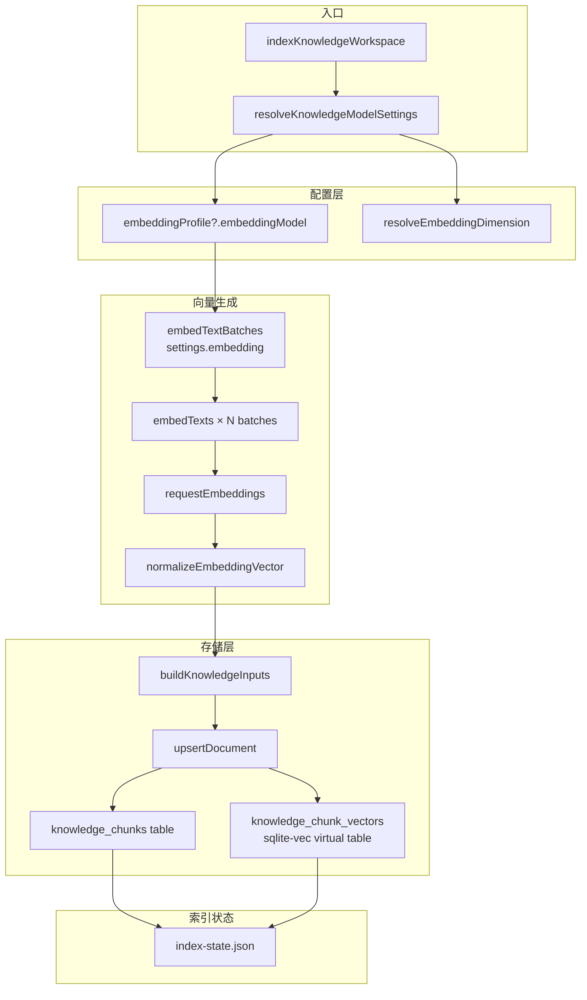
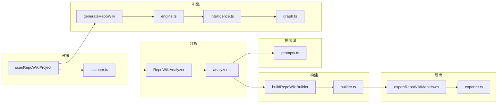

# 知识库后端引擎：embedding client

<cite>

**本文引用的文件**

- [src/electron/libs/knowledge/embedding-client.ts](file://src/electron/libs/knowledge/embedding-client.ts)
- [src/electron/libs/knowledge/knowledge-types.ts](file://src/electron/libs/knowledge/knowledge-types.ts)
- [src/electron/libs/knowledge/knowledge-model-settings.ts](file://src/electron/libs/knowledge/knowledge-model-settings.ts)
- [src/electron/libs/knowledge/knowledge-indexer.ts](file://src/electron/libs/knowledge/knowledge-indexer.ts)
- [src/electron/libs/knowledge/knowledge-repository.ts](file://src/electron/libs/knowledge/knowledge-repository.ts)
- [src/electron/libs/knowledge/knowledge-paths.ts](file://src/electron/libs/knowledge/knowledge-paths.ts)
- [src/electron/libs/knowledge/knowledge-ui-store.ts](file://src/electron/libs/knowledge/knowledge-ui-store.ts)
- [src/electron/libs/knowledge/knowledge-overview.ts](file://src/electron/libs/knowledge/knowledge-overview.ts)
- [src/electron/libs/knowledge/agent-cards.ts](file://src/electron/libs/knowledge/agent-cards.ts)
- [src/electron/libs/knowledge/knowledge-utils.ts](file://src/electron/libs/knowledge/knowledge-utils.ts)
- [src/electron/libs/knowledge/repowiki/analyzer.ts](file://src/electron/libs/knowledge/repowiki/analyzer.ts)
- [src/electron/libs/knowledge/repowiki/builder.ts](file://src/electron/libs/knowledge/repowiki/builder.ts)
- [src/electron/libs/knowledge/repowiki/engine.ts](file://src/electron/libs/knowledge/repowiki/engine.ts)
- [src/electron/libs/knowledge/repowiki/exporter.ts](file://src/electron/libs/knowledge/repowiki/exporter.ts)
- [src/electron/libs/knowledge/repowiki/graph.ts](file://src/electron/libs/knowledge/repowiki/graph.ts)
- [src/electron/libs/knowledge/repowiki/intelligence.ts](file://src/electron/libs/knowledge/repowiki/intelligence.ts)
- [src/electron/libs/knowledge/repowiki/prompts.ts](file://src/electron/libs/knowledge/repowiki/prompts.ts)
- [src/electron/libs/knowledge/repowiki/scanner.ts](file://src/electron/libs/knowledge/repowiki/scanner.ts)

</cite>

# 知识库后端引擎：embedding client

## 目录

- [1. 入口职责与定位](#1-入口职责与定位)
- [2. 核心函数与符号清单](#2-核心函数与符号清单)
- [3. 调用链路与数据流](#3-调用链路与数据流)
- [4. 配置体系与数据来源](#4-配置体系与数据来源)
- [5. 存储层与向量持久化](#5-存储层与向量持久化)
- [6. 常见失败模式与排障](#6-常见失败模式与排障)
- [7. 扩展点与修改指南](#7-扩展点与修改指南)
- [8. Agent 改代码地图](#8-agent-改代码地图)
- [9. 相关模块速查](#9-相关模块速查)

---

## 1. 入口职责与定位

`embedding-client.ts` 是知识库引擎的**向量生成层**，负责将文本内容转换为高维浮点向量，存入 SQLite + sqlite-vec 索引，供后续语义检索使用。

### 职责边界

| 职责 | 归属 |
|------|------|
| 文本 → 向量生成 | `embedding-client.ts` |
| 向量维度验证与标准化 | `normalizeEmbeddingVector` |
| 批量分页与进度回调 | `embedTextBatches` |
| API 请求重试与错误处理 | `embedTexts` |
| 模型配置解析与 profile 映射 | `knowledge-model-settings.ts` |
| 向量写入 SQLite / sqlite-vec | `knowledge-repository.ts` |

**不属于 embedding-client 的职责**：
- Markdown 文件扫描（`scanner.ts`）
- Repo Wiki 生成（`engine.ts` → `analyzer.ts` → `builder.ts`）
- UI 状态管理（`knowledge-ui-store.ts`）
- Agent Cards 生成（`agent-cards.ts`）
- system prompt 注入（`knowledge-overview.ts`）

[章节来源](file://src/electron/libs/knowledge/embedding-client.ts#L1-L15)

---

## 2. 核心函数与符号清单

```typescript
// src/electron/libs/knowledge/embedding-client.ts
export async function embedTexts(
  settings: EmbeddingModelSettings,
  texts: string[]
): Promise<number[][]>  // line 83-96

export async function embedTextBatches(
  settings: EmbeddingModelSettings,
  texts: string[],
  onProgress?: (progress: { completed: number; total: number }) => void,
): Promise<number[][]>  // line 98-121

// 内部函数
function requestEmbeddings(settings, texts): Promise<number[][]>  // line 36-81
function normalizeEmbeddingVector(vector, expectedDimension): number[]  // line 22-34
function joinEndpoint(baseURL, path): string  // line 13-16
function sleep(ms): Promise<void>  // line 18-20
```

### EmbeddingModelSettings 类型

```typescript
// src/electron/libs/knowledge/knowledge-types.ts#L100-108
export type EmbeddingModelSettings = {
  profileId: string;
  profileName: string;
  apiKey: string;
  baseURL: string;
  model: string;
  dimension: number;
  batchSize: number;
};
```

### 关键行为说明

| 函数 | 重试策略 | batch 处理 | 向量验证 |
|------|----------|-----------|---------|
| `embedTexts` | 3 次指数退避（350ms × attempt） | 无 | `normalizeEmbeddingVector` 校验维度与数值 |
| `embedTextBatches` | 继承 `embedTexts` 重试 | 按 `settings.batchSize` 分页 | 同上 |

[章节来源](file://src/electron/libs/knowledge/embedding-client.ts#L83-L121)

---

## 3. 调用链路与数据流



### 调用序列

```text
indexKnowledgeWorkspace (knowledge-indexer.ts#L170)
  ├─ resolveKnowledgeModelSettings (knowledge-model-settings.ts#L49)
  │   └─ loadApiConfigSettings().profiles
  ├─ KnowledgeRepository (knowledge-repository.ts#L203)
  │   └─ isVectorStoreReady → sqlite-vec check
  ├─ collectMarkdownFiles (knowledge-indexer.ts#L56)
  ├─ generateAgentKnowledgeCards (agent-cards.ts#L50)
  ├─ embedTextBatches (embedding-client.ts#L282)
  │   └─ embedTexts × ceil(texts.length / batchSize)
  │       └─ requestEmbeddings → POST /embeddings
  └─ buildKnowledgeInputs (knowledge-indexer.ts#L105)
      └─ repository.upsertDocument → chunks + vectors
```

[图表来源](file://src/electron/libs/knowledge/knowledge-indexer.ts#L170-L310)

---

## 4. 配置体系与数据来源

### source-of-truth

`EmbeddingModelSettings` 的配置来源顺序：

1. **用户配置的 API Profile**（`src/electron/libs/config-store.ts`）
   - `loadApiConfigSettings().profiles`
   - 筛选条件：`profile.enabled && profile.apiKey.trim() && profile.baseURL.trim()`
   - 必须有 `profile.embeddingModel` 非空

2. **维度自动推断**（`resolveEmbeddingDimension`）
   ```typescript
   // knowledge-model-settings.ts#L16-22
   const KNOWN_EMBEDDING_DIMENSIONS = [
     { pattern: /qwen3-embedding-0\.6b/i, dimension: 1024 },
     { pattern: /qwen3-embedding-4b/i, dimension: 2560 },
     { pattern: /qwen3-embedding-8b/i, dimension: 4096 },
     { pattern: /text-embedding-3-small/i, dimension: 1536 },
     { pattern: /text-embedding-3-large/i, dimension: 3072 },
   ];
   ```

3. **batchSize 约束**
   ```typescript
   // knowledge-model-settings.ts#L62-65
   batchSize: Math.min(128, normalizePositiveInteger(embeddingProfile.embeddingBatchSize, 16))
   ```

### 配置校验

`assertEmbeddingConfigured`（knowledge-model-settings.ts#L85-90）在索引启动时校验：
- 若 `settings.embedding` 为 `undefined`，抛出错误：**"Knowledge Engine 未启用：请先在模型设置里配置向量模型 embeddingModel。"**

[章节来源](file://src/electron/libs/knowledge/knowledge-model-settings.ts#L49-L90)

---

## 5. 存储层与向量持久化

### SQLite 表结构

```sql
-- knowledge_documents (主文档表)
CREATE TABLE knowledge_documents (
  id TEXT PRIMARY KEY,
  workspace_scope TEXT NOT NULL,
  source_kind TEXT NOT NULL,          -- repowiki | agent_card | memory | manual | source
  source_path TEXT NOT NULL,
  title TEXT NOT NULL,
  content_hash TEXT NOT NULL,
  ...
);

-- knowledge_chunks (文本块表)
CREATE TABLE knowledge_chunks (
  id TEXT PRIMARY KEY,
  document_id TEXT NOT NULL REFERENCES knowledge_documents(id) ON DELETE CASCADE,
  chunk_index INTEGER NOT NULL,
  token_estimate INTEGER NOT NULL,
  ...
);

-- knowledge_chunks_fts (FTS5 全文索引)
CREATE VIRTUAL TABLE knowledge_chunks_fts USING fts5(title, content, source_path, tags);

-- knowledge_chunk_vectors (向量索引)
CREATE VIRTUAL TABLE knowledge_chunk_vectors USING vec0(
  chunk_rowid integer primary key,
  embedding float[dimension]
);
```

[章节来源](file://src/electron/libs/knowledge/knowledge-repository.ts#L83-L137)

### 向量写入流程

```typescript
// knowledge-repository.ts#L162-170
upsertDocument(input: KnowledgeUpsertInput): KnowledgeDocument {
  const id = existing?.id ?? crypto.randomUUID();
  const contentHash = stableHash(input.content);
  // ...
  this.db.prepare(`INSERT INTO knowledge_chunks ...`).run(...);

  // 向量写入 sqlite-vec
  this.db.prepare(`
    INSERT INTO knowledge_chunk_vectors (chunk_rowid, embedding)
    VALUES (?, ?)
  `).run(chunkRowid, JSON.stringify(embedding));
}
```

### 运行时刷新边界

| 操作 | 需重启 Electron？ | 需清 DB？ |
|------|------------------|----------|
| 修改 embedding model | 否，下次索引自动生效 | 否 |
| 修改维度 | 否，但需要重建向量表 | **是**，维度不兼容时自动 `DROP TABLE IF EXISTS knowledge_chunk_vectors` |
| 修改 batchSize | 否 | 否 |

[章节来源](file://src/electron/libs/knowledge/knowledge-repository.ts#L141-L160)

---

## 6. 常见失败模式与排障

### 6.1 向量维度不匹配

**症状**：`embedding dimension mismatch: expected X, got Y`

**原因**：模型切换后维度变更，但 sqlite-vec 表用旧维度创建

**排查步骤**：
```bash
# 1. 检查 index-state.json
cat .tech/reports/index-state.json | jq '.vectorStoreReady, .embeddingEnabled'

# 2. 检查 sqlite-vec 表维度
sqlite3 appData/knowledge/workspace_xxx/knowledge.sqlite \
  "SELECT sql FROM sqlite_master WHERE name='knowledge_chunk_vectors'"

# 3. 清除旧向量重新索引
rm appData/knowledge/workspace_xxx/knowledge.sqlite
# 下次索引时自动重建
```

[章节来源](file://src/electron/libs/knowledge/knowledge-repository.ts#L149-L154)

### 6.2 API 请求失败（3 次重试后）

**症状**：`Knowledge Engine 未启用：缺少 embeddingModel`

**排查**：
1. 检查模型设置里 `embeddingModel` 是否填入
2. 验证 `baseURL` 可访问（不能以 `/` 结尾）
3. 验证 `apiKey` 有效

```bash
# 测试 API 连通性
curl -X POST https://your-api/v1/embeddings \
  -H "Authorization: Bearer YOUR_KEY" \
  -H "Content-Type: application/json" \
  -d '{"model":"text-embedding-3-small","input":"test"}'
```

### 6.3 非 JSON 响应

**症状**：`embedding API returned non-JSON response`

**原因**：API 返回了 HTML 错误页或纯文本

**定位**：查看 `rawText.slice(0, 200)` 的前 200 字符

[章节来源](file://src/electron/libs/knowledge/embedding-client.ts#L53-L59)

### 6.4 sqlite-vec 扩展不可用

**症状**：`sqlite-vec unavailable` 警告，向量存储回退到只写 FTS

```bash
# 检查 sqlite-vec 加载
node -e "const { load } = require('sqlite-vec'); console.log('loaded')"

# 验证 better-sqlite3 扩展支持
sqlite3 appData/knowledge/workspace_xxx/knowledge.sqlite \
  "SELECT name FROM sqlite_temp_master WHERE name LIKE '%vec%'"
```

[章节来源](file://src/electron/libs/knowledge/knowledge-repository.ts#L141-L159)

---

## 7. 扩展点与修改指南

### 7.1 切换 embedding 模型

**步骤**：
1. 在模型设置 UI 添加新 profile，选择 `embeddingModel`
2. `resolveKnowledgeModelSettings` 在下次索引时自动读取
3. 如维度变更，需要清除旧 DB

### 7.2 添加新的向量验证规则

在 `normalizeEmbeddingVector`（embedding-client.ts#L22-34）中添加：

```typescript
// 示例：添加最小值约束
function normalizeEmbeddingVector(vector: unknown, expectedDimension: number): number[] {
  // ... 现有校验 ...

  // 新增：检查向量稀疏性
  const zeroCount = normalized.filter(v => v === 0).length;
  if (zeroCount / normalized.length > 0.9) {
    console.warn("[embedding] high sparsity detected, index may be degraded");
  }

  return normalized;
}
```

### 7.3 修改 batch 分页逻辑

当前 `embedTextBatches` 按固定 `batchSize` 分页。如果需要动态 batch：
- 读取 `settings.batchSize` 调整
- 可以添加环境变量 `TECH_CC_HUB_EMBEDDING_BATCH_SIZE` 覆盖

[章节来源](file://src/electron/libs/knowledge/embedding-client.ts#L98-L121)

---

## 8. Agent 改代码地图

### 8.1 先读文件（按优先级）

| 优先级 | 文件 | 原因 |
|--------|------|------|
| 1 | `embedding-client.ts` | 直接改向量生成逻辑 |
| 2 | `knowledge-model-settings.ts` | 改配置解析或维度推断 |
| 3 | `knowledge-repository.ts` | 改向量写入或表结构 |
| 4 | `knowledge-indexer.ts` | 看完整索引流程 |
| 5 | `knowledge-types.ts` | 改类型定义 |

### 8.2 关键符号速查

| 符号 | 文件:行 | 用途 |
|------|---------|------|
| `embedTexts` | embedding-client.ts:83 | 文本→向量主入口，带重试 |
| `embedTextBatches` | embedding-client.ts:98 | 批量封装，带进度回调 |
| `normalizeEmbeddingVector` | embedding-client.ts:22 | 向量校验与标准化 |
| `requestEmbeddings` | embedding-client.ts:36 | HTTP 请求底层 |
| `resolveKnowledgeModelSettings` | knowledge-model-settings.ts:49 | 配置解析入口 |
| `assertEmbeddingConfigured` | knowledge-model-settings.ts:85 | 配置校验断言 |
| `upsertDocument` | knowledge-repository.ts:162 | 文档+向量写入 |
| `initializeVectorStore` | knowledge-repository.ts:141 | sqlite-vec 初始化 |

### 8.3 修改入口

| 要修改的功能 | 首选文件 | 入口函数 |
|-------------|---------|---------|
| 改重试策略 | `embedding-client.ts` | `embedTexts` |
| 改维度校验 | `embedding-client.ts` | `normalizeEmbeddingVector` |
| 改批量大小 | `knowledge-model-settings.ts` | `resolveKnowledgeModelSettings` |
| 改模型名推断 | `knowledge-model-settings.ts` | `KNOWN_EMBEDDING_DIMENSIONS` |
| 改向量表结构 | `knowledge-repository.ts` | `initializeVectorStore` |

### 8.4 验证命令

```bash
# 1. 类型检查
npm run typecheck

# 2. 单元测试（如果有）
npm test -- --grep "embedding"

# 3. 端到端索引测试
# - 在 UI 触发"刷新知识库"
# - 检查 .tech/reports/index-state.json 的 success 和 indexedChunks

# 4. 检查向量表
sqlite3 appData/knowledge/workspace_xxx/knowledge.sqlite \
  "SELECT COUNT(*) FROM knowledge_chunk_vectors"
```

### 8.5 常见回归风险

| 风险 | 触发场景 | 预防 |
|------|---------|------|
| 维度不匹配 | 切换模型后未清 DB | 索引前检查 vectorStoreReady |
| API 超时 | batchSize 过大 | 保持 batchSize ≤ 128 |
| 非 JSON 响应未处理 | API 返回错误 HTML | `normalizeEmbeddingVector` 校验数值 |
| 重试耗尽后静默失败 | 网络不稳定 | `lastError` 必须抛出 |

[章节来源](file://src/electron/libs/knowledge/embedding-client.ts#L83-L96)

---

## 9. 相关模块速查

### repowiki 生成链路



### MCP 工具关联

| MCP 工具 | 功能 |
|---------|------|
| `mcp__tech-cc-hub-knowledge__knowledge_index` | 触发完整索引（含 embedding） |
| `mcp__tech-cc-hub-knowledge__knowledge_search` | 语义检索（使用已有向量） |

[章节来源](file://src/electron/libs/knowledge/repowiki/engine.ts#L215-L278)

### UI 状态管理

`KnowledgeUiStore`（knowledge-ui-store.ts）管理：
- `knowledge_ui_workspaces` 表：工作区列表
- `knowledge_ui_generation` 表：生成状态
- `knowledge_ui_documents` 表：UI 文档缓存

与 embedding 无直接依赖，但共享 `workspaceScope` 和 `appDataWorkspaceRoot` 路径。

[章节来源](file://src/electron/libs/knowledge/knowledge-ui-store.ts#L84-L139)

---

## 快速参考

| 操作 | 关键文件 | 关键符号 |
|------|---------|---------|
| 生成向量 | `embedding-client.ts` | `embedTexts`, `embedTextBatches` |
| 配置模型 | `knowledge-model-settings.ts` | `resolveKnowledgeModelSettings` |
| 写入存储 | `knowledge-repository.ts` | `upsertDocument`, `initializeVectorStore` |
| 触发索引 | `knowledge-indexer.ts` | `indexKnowledgeWorkspace` |
| 检查状态 | `.tech/reports/index-state.json` | `success`, `vectorStoreReady` |

---

**文档元信息**

- 版本：1.0
- 主题：topic-知识库后端引擎-embedding-client
- 维护者：tech-cc-hub team
- 适用场景：修改 embedding 模型、排查向量生成失败、扩展知识库索引能力