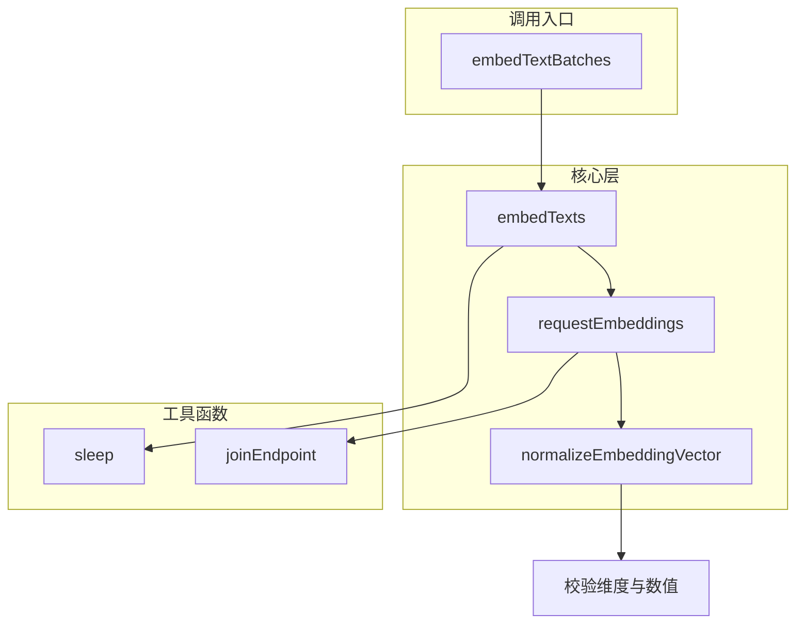
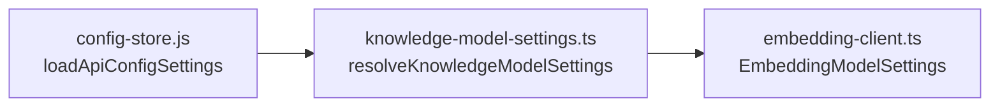
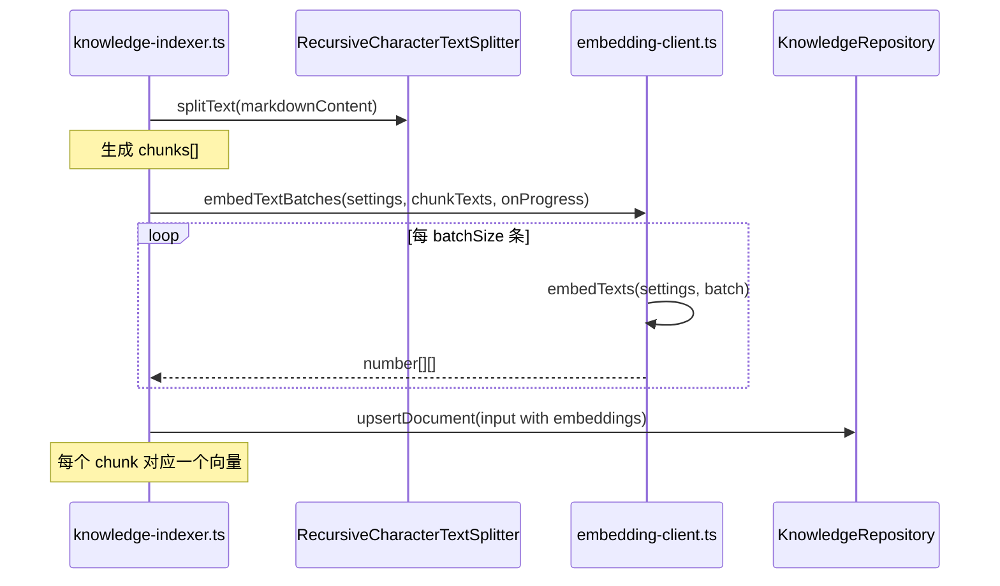
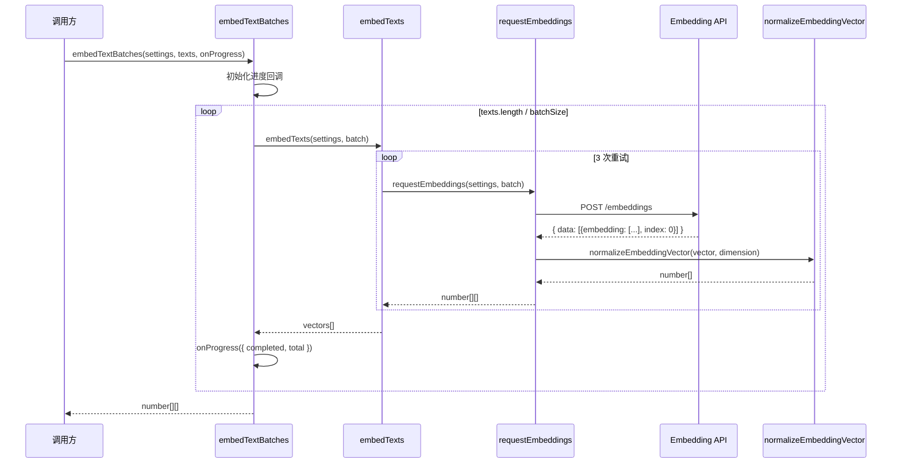

# 知识库后端引擎：embedding client

<cite>
**本文引用的文件**
- [src/electron/libs/knowledge/embedding-client.ts](file://src/electron/libs/knowledge/embedding-client.ts)
- [src/electron/libs/knowledge/knowledge-indexer.ts](file://src/electron/libs/knowledge/knowledge-indexer.ts)
- [src/electron/libs/knowledge/knowledge-model-settings.ts](file://src/electron/libs/knowledge/knowledge-model-settings.ts)
- [src/electron/libs/knowledge/knowledge-types.ts](file://src/electron/libs/knowledge/knowledge-types.ts)
- [src/electron/libs/knowledge/wiki-model-client.ts](file://src/electron/libs/knowledge/wiki-model-client.ts)
- [src/electron/libs/note-types.ts](file://src/electron/libs/note-types.ts)
- [src/electron/dev-backend-bridge.ts](file://src/electron/dev-backend-bridge.ts)
- [src/electron/libs/git/index.ts](file://src/electron/libs/git/index.ts)
- [src/electron/libs/skill-manager/index.ts](file://src/electron/libs/skill-manager/index.ts)
</cite>

# 知识库后端引擎：embedding client

## 目录

- [1. 模块职责与定位](#1-模块职责与定位)
- [2. 核心数据结构](#2-核心数据结构)
- [3. 函数调用链](#3-函数调用链)
- [4. 入口函数详解](#4-入口函数详解)
- [5. 与上下游文件的关系](#5-与上下游文件的关系)
- [6. 配置与参数说明](#6-配置与参数说明)
- [7. 常见失败模式与排障](#7-常见失败模式与排障)
- [8. 修改与扩展指南](#8-修改与扩展指南)
- [9. 回归验证方式](#9-回归验证方式)
- [10. 附录：调用时序图](#10-附录调用时序图)

---

## 1. 模块职责与定位

`embedding-client.ts` 是知识库引擎中 **向量嵌入（vector embedding）的调用层**。它负责：

1. 将文本片段（chunks）发送给配置的 embedding API
2. 接收并解析 API 返回的 float 向量
3. 按批次分装请求，支持进度回调
4. 处理重试逻辑和维度校验

该模块不负责：
- 向量存储（由 `KnowledgeRepository` + sqlite-vec 处理）
- 文本分块（由 `RecursiveCharacterTextSplitter` 处理）
- 模型配置解析（由 `knowledge-model-settings.ts` 处理）

章节来源：[src/electron/libs/knowledge/embedding-client.ts#L1-L35](file://src/electron/libs/knowledge/embedding-client.ts#L1-L35)

---

## 2. 核心数据结构

### EmbeddingModelSettings

由 `knowledge-types.ts` 定义，是调用 embedding API 所需的完整配置：

```typescript
export type EmbeddingModelSettings = {
  profileId: string;       // 配置 profile 的唯一标识
  profileName: string;    // profile 名称，用于日志
  apiKey: string;          // API 密钥
  baseURL: string;         // API 基础地址（不含尾斜杠）
  model: string;           // 模型名称，如 text-embedding-3-small
  dimension: number;       // 向量维度（必须与模型匹配）
  batchSize: number;       // 每批发送的文本数量上限（默认16，最大128）
};
```

章节来源：[src/electron/libs/knowledge/knowledge-types.ts#L100-L108](file://src/electron/libs/knowledge/knowledge-types.ts#L100-L108)

### OpenAIEmbeddingResponse

API 返回的标准化响应结构：

```typescript
type OpenAIEmbeddingResponse = {
  data?: Array<{
    embedding?: number[];
    index?: number;
  }>;
  error?: {
    message?: string;
  };
};
```

章节来源：[src/electron/libs/knowledge/embedding-client.ts#L3-L11](file://src/electron/libs/knowledge/embedding-client.ts#L3-L11)

---

## 3. 函数调用链



**调用层次说明：**

| 层级 | 函数 | 职责 | 导出 |
|------|------|------|------|
| L1 | `embedTextBatches` | 分批调度 + 进度回调 | ✅ 公开 |
| L2 | `embedTexts` | 重试包装（3次） | ✅ 公开 |
| L3 | `requestEmbeddings` | HTTP 请求 + 响应解析 | ❌ 内部 |
| L4 | `normalizeEmbeddingVector` | 向量校验与类型转换 | ❌ 内部 |

章节来源：[src/electron/libs/knowledge/embedding-client.ts#L83-L121](file://src/electron/libs/knowledge/embedding-client.ts#L83-L121)

---

## 4. 入口函数详解

### 4.1 embedTextBatches（主入口）

```typescript
export async function embedTextBatches(
  settings: EmbeddingModelSettings,
  texts: string[],
  onProgress?: (progress: { completed: number; total: number }) => void,
): Promise<number[][]>
```

**参数说明：**

| 参数 | 类型 | 必填 | 说明 |
|------|------|------|------|
| `settings` | `EmbeddingModelSettings` | ✅ | 模型配置对象 |
| `texts` | `string[]` | ✅ | 待嵌入文本数组 |
| `onProgress` | `Function` | ❌ | 进度回调，每批次完成后调用 |

**返回：**
- `number[][]` — 二维数组，每个子数组对应 `texts[index]` 的嵌入向量

**核心逻辑：**
1. 初始化空向量数组，触发初始进度回调 `{ completed: 0, total: texts.length }`
2. 按 `settings.batchSize` 步长遍历 `texts`
3. 对每个批次调用 `embedTexts`，传入单批文本
4. 若整批失败且批次 > 1，**降级为逐条重试**（避免单条失败导致整批丢失）
5. 更新进度回调 `{ completed, total }`

**典型用法：**
```typescript
import { embedTextBatches } from "./embedding-client.js";
import { resolveKnowledgeModelSettings } from "./knowledge-model-settings.js";

const settings = resolveKnowledgeModelSettings().embedding;
if (!settings) {
  throw new Error("未配置 embedding 模型");
}

const chunks = ["这是第一段文本", "这是第二段文本", "这是第三段文本"];

const embeddings = await embedTextBatches(settings, chunks, ({ completed, total }) => {
  console.log(`嵌入进度: ${completed}/${total}`);
});

console.log(`生成了 ${embeddings.length} 个向量`);
```

章节来源：[src/electron/libs/knowledge/embedding-client.ts#L98-L121](file://src/electron/libs/knowledge/embedding-client.ts#L98-L121)

### 4.2 embedTexts（重试包装器）

```typescript
export async function embedTexts(settings: EmbeddingModelSettings, texts: string[]): Promise<number[][]>
```

**重试策略：**
- 最多尝试 3 次
- 每次失败后等待 `350 * attempt` 毫秒再重试（第1次350ms，第2次700ms）
- 最终抛出最后一次的错误

**使用场景：**
- 适用于需要单批次完整成功的场景
- 由 `embedTextBatches` 在内部调用

章节来源：[src/electron/libs/knowledge/embedding-client.ts#L83-L96](file://src/electron/libs/knowledge/embedding-client.ts#L83-L96)

### 4.3 requestEmbeddings（HTTP 层）

```typescript
async function requestEmbeddings(settings: EmbeddingModelSettings, texts: string[]): Promise<number[][]>
```

**关键行为：**

1. **空数组处理**：直接返回空数组，不发请求
2. **URL 拼接**：调用 `joinEndpoint` 确保 baseURL 不含尾斜杠
3. **请求体格式**：遵循 OpenAI兼容 API 格式
   ```json
   { "model": "text-embedding-3-small", "input": ["text1", "text2"] }
   ```
4. **响应校验**：
   - 非 200 状态码抛出错误
   - 响应非 JSON 格式抛出错误
   - 缺少 `data[]` 数组抛出错误
5. **索引匹配**：通过 `item.index` 建立输入输出对应关系

**错误场景示例：**
```typescript
// 响应格式异常
{ "error": { "message": "Invalid API key" } }
// → 抛出 "Invalid API key"

// 响应缺少 data
{ }
// → 抛出 "embedding API response missing data[]"

// 向量维度不匹配
// → 抛出 "embedding dimension mismatch: expected 1536, got 1024"
```

章节来源：[src/electron/libs/knowledge/embedding-client.ts#L36-L81](file://src/electron/libs/knowledge/embedding-client.ts#L36-L81)

---

## 5. 与上下游文件的关系

### 5.1 上游：配置解析



**配置来源链路：**
1. `loadApiConfigSettings()` 从 `config/` 读取用户配置的 profiles
2. 过滤 `isUsableProfile`（`enabled=true`, `apiKey` 非空, `baseURL` 非空）
3. 查找包含 `embeddingModel` 字段的 profile
4. 通过 `resolveEmbeddingDimension` 推断维度（基于模型名正则匹配）

**已知模型维度表：**

| 模型名模式 | 维度 |
|-----------|------|
| `qwen3-embedding-0.6b` | 1024 |
| `qwen3-embedding-4b` | 2560 |
| `qwen3-embedding-8b` | 4096 |
| `text-embedding-3-small` | 1536 |
| `text-embedding-3-large` | 3072 |

章节来源：[src/electron/libs/knowledge/knowledge-model-settings.ts#L16-L22](file://src/electron/libs/knowledge/knowledge-model-settings.ts#L16-L22)

### 5.2 下游：知识库索引器



**调用入口：**
```typescript
// knowledge-indexer.ts#L282
const embeddings = await embedTextBatches(settings.embedding, chunkTexts, ({ completed, total }) => {
  options.onProgress?.({
    stage: "embedding",
    message: `正在生成向量 ${completed}/${total}。`,
    completed,
    total: Math.max(1, total),
  });
});
```

章节来源：[src/electron/libs/knowledge/knowledge-indexer.ts#L282-L289](file://src/electron/libs/knowledge/knowledge-indexer.ts#L282-L289)

### 5.3 并列模块：wiki-model-client

两个 client 模块结构相似，但用途不同：

| 模块 | 用途 | API 端点 |
|------|------|----------|
| `embedding-client.ts` | 向量化文本 | `POST /embeddings` |
| `wiki-model-client.ts` | 生成 Wiki 内容 | `POST /chat/completions` |

`wiki-model-client.ts` 的 `completeWikiChat` 额外包含：
- 超时控制（默认120秒）
- Markdown 清洗（移除 `` 标签和代码围栏）

章节来源：[src/electron/libs/knowledge/wiki-model-client.ts#L1-L85](file://src/electron/libs/knowledge/wiki-model-client.ts#L1-L85)

---

## 6. 配置与参数说明

### 6.1 EmbeddingModelSettings 完整字段

| 字段 | 默认值 | 来源 | 说明 |
|------|--------|------|------|
| `profileId` | — | 配置 | profile 唯一标识 |
| `profileName` | — | 配置 | profile 显示名 |
| `apiKey` | — | 配置 | API 密钥 |
| `baseURL` | — | 配置 | 去掉尾斜杠后的基础 URL |
| `model` | — | 配置 | embedding 模型名 |
| `dimension` | `1536` | 推断/配置 | 向量维度 |
| `batchSize` | `16` | 配置（上限128） | 每批文本数 |

### 6.2 维度自动推断逻辑

```typescript
// knowledge-model-settings.ts#L32-L36
function resolveEmbeddingDimension(model: string, configured: number | undefined): number {
  const known = KNOWN_EMBEDDING_DIMENSIONS.find((entry) => entry.pattern.test(model));
  if (known) return known.dimension;  // 匹配到已知模型
  return normalizePositiveInteger(configured, DEFAULT_EMBEDDING_DIMENSION);  // 回退到配置值或默认
}
```

### 6.3 批量大小限制

```typescript
// 限制最大为 128，防止 API 超限
batchSize: Math.min(
  128,
  normalizePositiveInteger(embeddingProfile.embeddingBatchSize, DEFAULT_EMBEDDING_BATCH_SIZE),
)
```

章节来源：[src/electron/libs/knowledge/knowledge-model-settings.ts#L54-L66](file://src/electron/libs/knowledge/knowledge-model-settings.ts#L54-L66)

---

## 7. 常见失败模式与排障

### 7.1 错误清单

| 错误信息 | 根因 | 排查方向 |
|---------|------|----------|
| `embedding response missing vector` | API 返回的 `embedding` 字段为 undefined | 检查 API 响应格式是否正确 |
| `embedding dimension mismatch: expected X, got Y` | 使用的模型与配置的维度不一致 | 确认模型配置正确 |
| `embedding API response missing data[]` | API 响应缺少 `data` 数组 | 检查 API 是否返回正确格式 |
| `embedding API returned non-JSON response` | API 返回了非 JSON 响应 | 检查 baseURL 是否正确、API 是否可用 |
| `Invalid API key` | API 密钥无效 | 检查 `apiKey` 配置 |
| `Knowledge Engine 未启用：缺少 embeddingModel` | 未在模型设置中配置 embedding 模型 | 运行 `assertEmbeddingConfigured()` |

### 7.2 排障步骤

**步骤 1：验证配置加载**
```typescript
import { resolveKnowledgeModelSettings } from "./knowledge-model-settings.js";

const settings = resolveKnowledgeModelSettings();
console.log("embedding enabled:", settings.embedding);
```

**步骤 2：验证 API 连通性**
```bash
curl -X POST https://your-api.com/embeddings \
  -H "Content-Type: application/json" \
  -H "Authorization: Bearer YOUR_API_KEY" \
  -d '{"model":"text-embedding-3-small","input":["test"]}'
```

**步骤 3：检查 sqlite-vec 扩展**
```typescript
// knowledge-indexer.ts#L208 检查向量存储就绪状态
if (!repository.isVectorStoreReady()) {
  // sqlite-vec 扩展不可用
}
```

### 7.3 降级行为

当 `embedTextBatches` 的整批请求失败时，会**降级为逐条重试**：

```typescript
// embedding-client.ts#L107-L117
try {
  vectors.push(...await embedTexts(settings, batch));
} catch (error) {
  if (batch.length === 1) {
    throw error;  // 单条失败直接抛出
  }
  for (const text of batch) {
    vectors.push(...await embedTexts(settings, [text]));  // 降级逐条处理
    onProgress?.({ completed: Math.min(texts.length, vectors.length), total: texts.length });
  }
}
```

这保证了即使个别文本导致整批失败，也不会阻塞整个索引流程。

章节来源：[src/electron/libs/knowledge/embedding-client.ts#L107-L117](file://src/electron/libs/knowledge/embedding-client.ts#L107-L117)

---

## 8. 修改与扩展指南

### 8.1 添加新的模型维度

在 `knowledge-model-settings.ts` 的 `KNOWN_EMBEDDING_DIMENSIONS` 数组中添加新条目：

```typescript
{ pattern: /new-model-name/i, dimension: 2048 },
```

### 8.2 修改重试策略

编辑 `embedTexts` 函数的重试次数和延迟：

```typescript
// embedding-client.ts#L85-92
for (let attempt = 1; attempt <= 3; attempt += 1) {
  try {
    return await requestEmbeddings(settings, texts);
  } catch (error) {
    lastError = error;
    if (attempt < 3) {
      await sleep(350 * attempt);  // 修改此处调整延迟
    }
  }
}
```

### 8.3 添加请求超时

在 `requestEmbeddings` 中添加 `AbortController`：

```typescript
const controller = new AbortController();
const timer = setTimeout(() => controller.abort(), 60_000);

const response = await fetch(joinEndpoint(settings.baseURL, "/embeddings"), {
  method: "POST",
  signal: controller.signal,  // 添加超时控制
  // ...
}).finally(() => clearTimeout(timer));
```

### 8.4 扩展进度回调事件

在 `embedTextBatches` 中添加更多事件类型：

```typescript
onProgress?.({
  stage: "embedding",          // 新增阶段标识
  batchIndex: index / settings.batchSize,
  progress: { completed, total }
});
```

---

## 9. 回归验证方式

### 9.1 单元测试检查点

| 测试场景 | 预期行为 |
|---------|---------|
| 空文本数组 `[]` | 返回 `[]`，不发起请求 |
| 单条文本 | 正确返回单向量 |
| 多条文本（< batchSize） | 返回对应数量的向量 |
| 批次请求失败 | 降级为逐条处理 |
| 向量维度错误 | 抛出 `dimension mismatch` 错误 |
| API 返回非 200 | 抛出带错误信息的异常 |

### 9.2 集成测试检查点

**测试链路：**
```
indexKnowledgeWorkspace → embedTextBatches → KnowledgeRepository.upsertDocument
```

**验证方法：**
1. 启动应用，打开知识库功能
2. 修改工作区中的一篇 Repo Wiki Markdown 文件
3. 触发重新索引
4. 检查 `indexStatePath` 中的 `KnowledgeIndexReport`：
   ```json
   {
     "success": true,
     "indexedDocuments": 1,
     "indexedChunks": 3,
     "vectorStoreReady": true
   }
   ```

### 9.3 常见回归场景

| 场景 | 检查点 |
|------|--------|
| 修改默认 batchSize 后 | 索引报告中 `indexedChunks` 数量是否正确 |
| 修改模型维度后 | sqlite-vec 查询是否正常 |
| 修改 baseURL 后 | 是否正确拼接路径（无双重斜杠） |
| API 超时后 | 是否按预期抛出错误而非静默失败 |

---

## 10. 附录：调用时序图



图表来源：[src/electron/libs/knowledge/embedding-client.ts#L98-L121](file://src/electron/libs/knowledge/embedding-client.ts#L98-L121)

---

## 总结

| 项目 | 说明 |
|------|------|
| **模块文件** | `src/electron/libs/knowledge/embedding-client.ts` |
| **主入口** | `embedTextBatches(settings, texts, onProgress?)` |
| **核心依赖** | `EmbeddingModelSettings` ← `knowledge-model-settings.ts` |
| **消费者** | `knowledge-indexer.ts` |
| **向量维度** | 由模型名自动推断或用户配置 |
| **批量大小** | 默认 16，最大 128 |
| **重试策略** | 3 次重试，指数退避（350ms × attempt） |
| **降级行为** | 批次失败时逐条重试 |

如需修改向量生成逻辑，优先检查 `EmbeddingModelSettings` 配置来源；若需扩展批次行为，关注 `embedTextBatches` 中的进度回调机制。