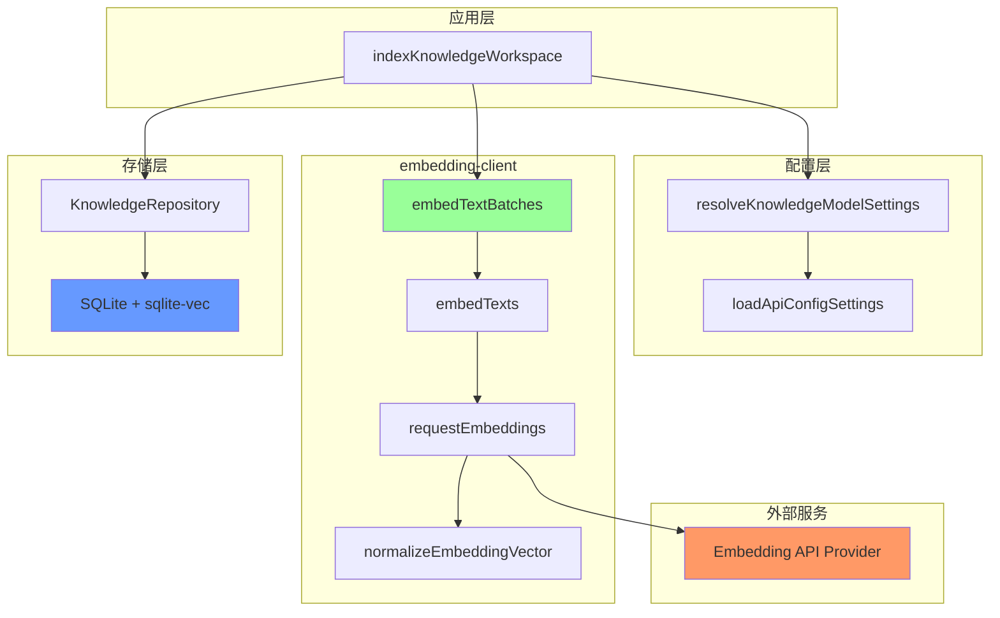
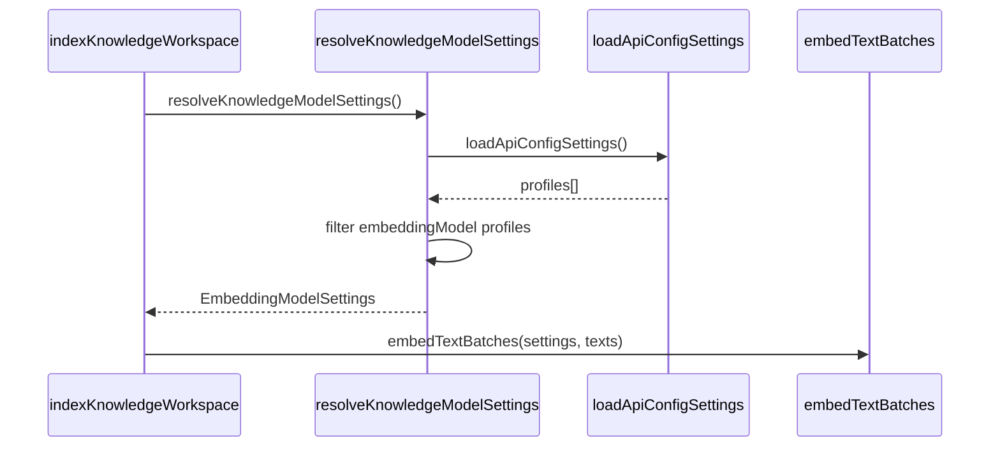
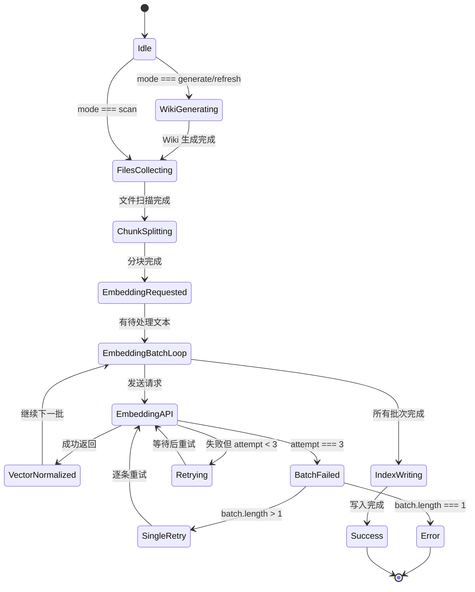

# 知识库后端引擎：embedding client

<cite>

**本文引用的文件**

- [src/electron/libs/knowledge/embedding-client.ts](file://src/electron/libs/knowledge/embedding-client.ts)
- [src/electron/libs/knowledge/knowledge-indexer.ts](file://src/electron/libs/knowledge/knowledge-indexer.ts)
- [src/electron/libs/knowledge/knowledge-model-settings.ts](file://src/electron/libs/knowledge/knowledge-model-settings.ts)
- [src/electron/libs/knowledge/knowledge-types.ts](file://src/electron/libs/knowledge/knowledge-types.ts)
- [src/electron/libs/knowledge/wiki-model-client.ts](file://src/electron/libs/knowledge/wiki-model-client.ts)
- [src/electron/libs/note-types.ts](file://src/electron/libs/note-types.ts)
- [src/electron/dev-backend-bridge.ts](file://src/electron/dev-backend-bridge.ts)
- [src/electron/libs/git/index.ts](file://src/electron/libs/git/index.ts)
- [src/electron/libs/skill-manager/index.ts](file://src/electron/libs/skill-manager/index.ts)

</cite>

---

## 目录

- [概述](#概述)
- [入口职责](#入口职责)
- [核心数据结构](#核心数据结构)
- [核心函数详解](#核心函数详解)
- [调用链与上下游关系](#调用链与上下游关系)
- [状态流](#状态流)
- [配置与默认值](#配置与默认值)
- [常见失败模式与排障](#常见失败模式与排障)
- [修改步骤与回归验证](#修改步骤与回归验证)
- [扩展点](#扩展点)

---

## 概述

`embedding-client.ts` 是 tech-cc-hub 知识库后端引擎的核心模块，负责将文本转换为向量表示（embedding）。它是连接应用层与外部 embedding API 的唯一通道，所有知识库文档的向量化都经由此模块完成。

该模块不依赖任何外部 AI/ML 库，仅使用原生 `fetch` 与远程 embedding 服务通信。这种设计保持了轻量级依赖，同时将模型推理的复杂度外部化到配置的可插拔 API profile 中。

---

## 入口职责

`embedding-client.ts` 的入口职责可以概括为：

1. **封装 HTTP 调用**：将文本列表发送到 `/embeddings` 端点，解析 OpenAI 兼容格式的响应
2. **可靠性保障**：实现 3 次重试 + 指数退避机制，应对瞬时网络抖动
3. **批量编排**：支持大批量文本的分批发送与进度回调
4. **数据校验**：验证返回向量的维度与数值有效性，防御性抛出明确错误

导出接口只有两个：`embedTexts` 和 `embedTextBatches`。所有内部函数（`joinEndpoint`、`sleep`、`normalizeEmbeddingVector`、`requestEmbeddings`）均为私有辅助。

---

## 核心数据结构

### EmbeddingModelSettings

```typescript
type EmbeddingModelSettings = {
  profileId: string;       // 来源 profile 的唯一标识
  profileName: string;    // 来源 profile 的显示名称
  apiKey: string;         // Bearer Token
  baseURL: string;        // API 基础地址（不含末尾斜杠）
  model: string;          // 模型名称，如 text-embedding-3-small
  dimension: number;      // 向量维度，与模型匹配
  batchSize: number;      // 单次请求的最大文本条数
};
```

章节来源：[knowledge-types.ts#L100-L108](file://src/electron/libs/knowledge/knowledge-types.ts#L100-L108)

### OpenAIEmbeddingResponse

```typescript
type OpenAIEmbeddingResponse = {
  data?: Array<{
    embedding?: number[];
    index?: number;
  }>;
  error?: {
    message?: string;
  };
};
```

这是 embedding API 的标准响应格式，`data[].embedding` 是向量数组，`data[].index` 用于匹配请求顺序。

---

## 核心函数详解

### 1. joinEndpoint (L13-L16)

```typescript
function joinEndpoint(baseURL: string, path: string): string {
  const normalizedBase = baseURL.replace(/\/$/, "");
  return `${normalizedBase}${path}`;
}
```

**职责**：安全拼接 baseURL 与路径，移除 baseURL 末尾的斜杠避免重复。

**注意**：此函数与 `wiki-model-client.ts` 中的同名函数实现完全一致，存在一定重复，未来可考虑提取为共享工具函数。

章节来源：[embedding-client.ts#L13-L16](file://src/electron/libs/knowledge/embedding-client.ts#L13-L16)

### 2. normalizeEmbeddingVector (L22-L34)

```typescript
function normalizeEmbeddingVector(vector: unknown, expectedDimension: number): number[] {
  if (!Array.isArray(vector)) {
    throw new Error("embedding response missing vector");
  }
  const normalized = vector.map((item) => Number(item));
  if (normalized.some((item) => !Number.isFinite(item))) {
    throw new Error("embedding response contains non-numeric values");
  }
  if (normalized.length !== expectedDimension) {
    throw new Error(`embedding dimension mismatch: expected ${expectedDimension}, got ${normalized.length}`);
  }
  return normalized;
}
```

**职责**：三重校验 — 类型校验 → 数值有限性校验 → 维度校验。任意一层失败都抛出明确错误。

**典型错误信息**：

- `"embedding response missing vector"` — API 返回了空 embedding
- `"embedding response contains non-numeric values"` — 向量包含 NaN/Infinity
- `"embedding dimension mismatch: expected X, got Y"` — 模型维度配置错误

章节来源：[embedding-client.ts#L22-L34](file://src/electron/libs/knowledge/embedding-client.ts#L22-L34)

### 3. requestEmbeddings (L36-L81)

```typescript
async function requestEmbeddings(settings: EmbeddingModelSettings, texts: string[]): Promise<number[][]> {
  if (texts.length === 0) return [];

  const response = await fetch(joinEndpoint(settings.baseURL, "/embeddings"), {
    method: "POST",
    headers: {
      "Authorization": `Bearer ${settings.apiKey}`,
      "Content-Type": "application/json",
    },
    body: JSON.stringify({
      model: settings.model,
      input: texts,
    }),
  });

  const rawText = await response.text();
  let payload: OpenAIEmbeddingResponse;
  try {
    payload = rawText ? JSON.parse(rawText) as OpenAIEmbeddingResponse : {};
  } catch {
    throw new Error(`embedding API returned non-JSON response: ${rawText.slice(0, 200)}`);
  }

  if (!response.ok) {
    throw new Error(payload.error?.message || rawText || response.statusText);
  }
  if (!Array.isArray(payload.data)) {
    throw new Error("embedding API response missing data[]");
  }

  const byIndex = new Map<number, number[]>();
  payload.data.forEach((item, fallbackIndex) => {
    const index = typeof item.index === "number" ? item.index : fallbackIndex;
    byIndex.set(index, normalizeEmbeddingVector(item.embedding, settings.dimension));
  });

  return texts.map((_, index) => {
    const vector = byIndex.get(index);
    if (!vector) {
      throw new Error(`embedding API response missing vector for input ${index}`);
    }
    return vector;
  });
}
```

**职责**：单次 HTTP 请求的核心逻辑，包含请求构建、响应解析、向量提取三个阶段。

**关键设计**：

- `byIndex` Map 使用 `item.index` 或 `fallbackIndex` 双保险匹配，确保返回向量顺序与输入一致
- 错误信息截取 `rawText.slice(0, 200)` 避免日志过长

章节来源：[embedding-client.ts#L36-L81](file://src/electron/libs/knowledge/embedding-client.ts#L36-L81)

### 4. embedTexts (L83-L96) — 公开导出

```typescript
export async function embedTexts(settings: EmbeddingModelSettings, texts: string[]): Promise<number[][]> {
  let lastError: unknown;
  for (let attempt = 1; attempt <= 3; attempt += 1) {
    try {
      return await requestEmbeddings(settings, texts);
    } catch (error) {
      lastError = error;
      if (attempt < 3) {
        await sleep(350 * attempt); // 350, 700, 1050 ms
      }
    }
  }
  throw lastError instanceof Error ? lastError : new Error(String(lastError));
}
```

**职责**：带重试的上层封装，最多重试 3 次，退避间隔为 350ms × attempt。

**重试策略**：

| attempt | 等待时间 |
|---------|----------|
| 1 (首次) | 0 |
| 2 (第一次重试) | 350ms |
| 3 (第二次重试) | 700ms |

章节来源：[embedding-client.ts#L83-L96](file://src/electron/libs/knowledge/embedding-client.ts#L83-L96)

### 5. embedTextBatches (L98-L121) — 公开导出

```typescript
export async function embedTextBatches(
  settings: EmbeddingModelSettings,
  texts: string[],
  onProgress?: (progress: { completed: number; total: number }) => void,
): Promise<number[][]> {
  const vectors: number[][] = [];
  onProgress?.({ completed: 0, total: texts.length });
  for (let index = 0; index < texts.length; index += settings.batchSize) {
    const batch = texts.slice(index, index + settings.batchSize);
    try {
      vectors.push(...await embedTexts(settings, batch));
      onProgress?.({ completed: Math.min(texts.length, vectors.length), total: texts.length });
    } catch (error) {
      if (batch.length === 1) {
        throw error;
      }
      for (const text of batch) {
        vectors.push(...await embedTexts(settings, [text]));
        onProgress?.({ completed: Math.min(texts.length, vectors.length), total: texts.length });
      }
    }
  }
  return vectors;
}
```

**职责**：批量嵌入的主入口，按 `settings.batchSize` 分批发送请求，支持进度回调。

**降级策略**：当整批请求失败且该批包含多个文本时，会退为逐条请求，最大化产出有效向量。

**参数说明**：

| 参数 | 类型 | 必填 | 说明 |
|------|------|------|------|
| `settings` | EmbeddingModelSettings | 是 | 模型配置 |
| `texts` | string[] | 是 | 待嵌入的文本数组 |
| `onProgress` | (progress) => void | 否 | 进度回调， `{completed, total}` |

**返回值**：`number[][]` — 与输入 `texts` 一一对应的向量数组。

章节来源：[embedding-client.ts#L98-L121](file://src/electron/libs/knowledge/embedding-client.ts#L98-L121)

---

## 调用链与上下游关系

### 调用链 Mermaid 图



### 上游调用方

**直接调用方**：仅 `knowledge-indexer.ts`

```typescript
// knowledge-indexer.ts#L282
const embeddings = await embedTextBatches(settings.embedding, chunkTexts, ({ completed, total }) => {
  options.onProgress?.({ stage: "embedding", message: `正在生成向量 ${completed}/${total}。`, completed, total });
});
```

在 `indexKnowledgeWorkspace` 函数中，`embedTextBatches` 是生成向量的唯一入口。调用时机位于 `RecursiveCharacterTextSplitter` 分块之后、写入数据库之前。

章节来源：[knowledge-indexer.ts#L282-L289](file://src/electron/libs/knowledge/knowledge-indexer.ts#L282-L289)

### 配置来源



`EmbeddingModelSettings` 由 `knowledge-model-settings.ts` 的 `resolveKnowledgeModelSettings()` 构造。从 `ApiConfig` profiles 中筛选出配置了 `embeddingModel` 的 profile，提取字段并填充默认值。

**已知模型维度自动推断**（`knowledge-model-settings.ts#L16-L22`）：

| 模型名称 | 维度 |
|----------|------|
| `qwen3-embedding-0.6b` | 1024 |
| `qwen3-embedding-4b` | 2560 |
| `qwen3-embedding-8b` | 4096 |
| `text-embedding-3-small` | 1536 |
| `text-embedding-3-large` | 3072 |

章节来源：[knowledge-model-settings.ts#L49-L67](file://src/electron/libs/knowledge/knowledge-model-settings.ts#L49-L67)

### 下游存储

嵌入完成后，向量与元数据通过 `KnowledgeRepository.upsertDocument()` 写入 SQLite（使用 sqlite-vec 扩展存储向量）。向量维度必须在创建 repository 时声明：

```typescript
// knowledge-indexer.ts#L203-L205
const repository = new KnowledgeRepository(paths.knowledgeDbPath, {
  embeddingDimension: settings.embedding.dimension,
});
```

章节来源：[knowledge-indexer.ts#L203-L205](file://src/electron/libs/knowledge/knowledge-indexer.ts#L203-L205)

### 与其他模块的关系

| 模块 | 关系类型 | 说明 |
|------|----------|------|
| `knowledge-types.ts` | 类型定义依赖 | 定义 `EmbeddingModelSettings` 等类型 |
| `knowledge-model-settings.ts` | 配置依赖 | 提供 `resolveKnowledgeModelSettings` |
| `knowledge-indexer.ts` | 直接调用方 | 调用 `embedTextBatches` |
| `wiki-model-client.ts` | 同级相似模式 | 同样封装 HTTP 调用，但用于 chat/completions |
| `dev-backend-bridge.ts` | 无关 | 用于开发模式 RPC，不直接涉及 embedding |
| `git/index.ts` | 无关 | Git 工作台模块 |
| `skill-manager/index.ts` | 无关 | Skill 管理模块 |
| `note-types.ts` | 无关 | 笔记 CRUD 类型 |

---

## 状态流

### 正常索引流程状态机



### 关键状态节点

| 状态 | 触发条件 | 后续行为 |
|------|----------|----------|
| `embedding API called` | `embedTextBatches` 开始 | 发送 POST 到 `/embeddings` |
| `retrying` | `requestEmbeddings` 抛出异常 | 等待 350×attempt ms 后重试 |
| `batch degraded to single` | 整批失败且 batch.length > 1 | 退化为逐条请求 |
| `embedding done` | 所有文本完成向量化 | 进入 `buildKnowledgeInputs` |

---

## 配置与默认值

### 从配置到 EmbeddingModelSettings 的完整路径

```typescript
// 1. 加载所有 profiles
const profiles = loadApiConfigSettings().profiles.filter(isUsableProfile);

// 2. 找到配置了 embeddingModel 的 profile
const embeddingProfile = profiles.find((profile) => profile.embeddingModel?.trim());

// 3. 构造 EmbeddingModelSettings
const embedding: EmbeddingModelSettings = {
  profileId: embeddingProfile.id,
  profileName: embeddingProfile.name,
  apiKey: embeddingProfile.apiKey.trim(),
  baseURL: embeddingProfile.baseURL.replace(/\/$/, ""),
  model: embeddingProfile.embeddingModel.trim(),
  dimension: resolveEmbeddingDimension(embeddingProfile.embeddingModel, embeddingProfile.embeddingDimension),
  batchSize: Math.min(128, normalizePositiveInteger(embeddingProfile.embeddingBatchSize, 16)),
};
```

章节来源：[knowledge-model-settings.ts#L49-L67](file://src/electron/libs/knowledge/knowledge-model-settings.ts#L49-L67)

### 默认值汇总

| 字段 | 默认值 | 上限 | 来源 |
|------|--------|------|------|
| `dimension` | 1536 | — | `DEFAULT_EMBEDDING_DIMENSION` |
| `batchSize` | 16 | 128 | `DEFAULT_EMBEDDING_BATCH_SIZE` |
| 重试次数 | 3 | — | 硬编码在 `embedTexts` |
| 重试退避 | 350ms × attempt | — | 硬编码在 `embedTexts` |

---

## 常见失败模式与排障

### 1. "Knowledge Engine 未启用：缺少 embeddingModel"

**原因**：没有任何 profile 配置了 `embeddingModel` 字段。

**排查步骤**：

1. 检查 `loadApiConfigSettings()` 返回的 profiles
2. 确认至少有一个 profile 的 `embeddingModel` 字段非空
3. 确认该 profile 的 `enabled` 为 true，且 `apiKey`/`baseURL` 已填写

章节来源：[knowledge-indexer.ts#L192-L201](file://src/electron/libs/knowledge/knowledge-indexer.ts#L192-L201)

### 2. embedding API 返回非 JSON 响应

**典型错误**：`embedding API returned non-JSON response: <truncated>`

**排查步骤**：

1. 检查 `baseURL` 是否正确（不含 `/embeddings` 后缀）
2. 检查网络是否可达
3. 确认 API Key 具有访问 `/embeddings` 端点的权限
4. 查看 API 服务端日志

章节来源：[embedding-client.ts#L55-L59](file://src/electron/libs/knowledge/embedding-client.ts#L55-L59)

### 3. "embedding dimension mismatch: expected X, got Y"

**原因**：`settings.dimension` 与 API 返回的实际向量维度不匹配。

**排查步骤**：

1. 确认使用的是哪个 embedding 模型
2. 对照 `KNOWN_EMBEDDING_DIMENSIONS` 确认正确维度
3. 如果使用自定义模型，在 profile 中设置 `embeddingDimension` 覆盖默认值
4. 检查是否是模型切换后未重新索引（SQLite 中的旧向量维度不匹配）

章节来源：[embedding-client.ts#L30-L32](file://src/electron/libs/knowledge/embedding-client.ts#L30-L32)

### 4. 重试耗尽后仍然失败

**典型错误**：在 3 次重试后抛出原始错误。

**排查步骤**：

1. 查看 `indexStatePath` 中的 `error` 字段获取详细错误
2. 如果是 4xx 错误，检查 API Key 是否有效
3. 如果是 5xx 错误，检查 embedding API 服务的健康状态
4. 如果是超时，检查网络路由和防火墙设置

章节来源：[embedding-client.ts#L83-L96](file://src/electron/libs/knowledge/embedding-client.ts#L83-L96)

### 5. 批量嵌入中部分文本失败

`embedTextBatches` 实现了优雅降级：当整批失败且批次包含多个文本时，会退为逐条重试。

**日志观察点**：注意 `onProgress` 回调会报告不连续的 `completed` 值（因为降级过程逐条完成）。

章节来源：[embedding-client.ts#L107-L117](file://src/electron/libs/knowledge/embedding-client.ts#L107-L117)

---

## 修改步骤与回归验证

### 修改步骤

当需要修改 embedding 行为时（例如更换 API 协议版本、调整重试策略）：

1. **定位入口**：`embedTexts` 和 `embedTextBatches` 是公开导出函数，所有修改应保持其签名兼容
2. **修改内部实现**：`requestEmbeddings` 可以自由修改，但需要保持对 `OpenAIEmbeddingResponse` 格式的兼容性，或同步修改类型定义
3. **更新配置逻辑**：如果修改了 `EmbeddingModelSettings` 的结构，需要同步更新 `resolveKnowledgeModelSettings` 和 `knowledge-indexer.ts` 中的使用处
4. **更新知识类型**：修改 `knowledge-types.ts` 中的类型定义后，确保所有引用处一致

### 回归验证清单

| # | 验证项 | 预期结果 |
|---|--------|----------|
| 1 | 空文本数组 | `embedTextBatches` 立即返回 `[]`，不发送请求 |
| 2 | 单个文本 | 返回长度为 1 的向量数组 |
| 3 | 维度校验 | 维度不匹配时抛出明确错误 |
| 4 | 3 次重试 | 网络错误触发 3 次重试，间隔递增 |
| 5 | 批量降级 | 整批失败时退化为逐条请求 |
| 6 | 进度回调 | `onProgress` 正确报告 `{completed, total}` |
| 7 | API Key 无效 | 返回 401 错误（重试后抛出） |
| 8 | 非 JSON 响应 | 抛出非 JSON 解析错误 |

### 最小验证脚本

```typescript
import { embedTextBatches } from "./embedding-client.js";
import { resolveKnowledgeModelSettings } from "./knowledge-model-settings.js";

// 验证配置可用
const settings = resolveKnowledgeModelSettings();
if (!settings.embedding) {
  throw new Error("embedding not configured");
}

// 验证空输入
const empty = await embedTextBatches(settings.embedding, []);
if (empty.length !== 0) throw new Error("empty input should return []");

// 验证单条文本
const single = await embedTextBatches(settings.embedding, ["Hello world"]);
if (single.length !== 1) throw new Error("should return 1 vector");
if (single[0].length !== settings.embedding.dimension) {
  throw new Error(`dimension mismatch: ${single[0].length} vs ${settings.embedding.dimension}`);
}

console.log("✓ embedding-client regression passed");
```

---

## 扩展点

### 1. 增加新的已知模型维度

在 `knowledge-model-settings.ts` 的 `KNOWN_EMBEDDING_DIMENSIONS` 数组中新增条目：

```typescript
{ pattern: /new-embedding-model/i, dimension: 2048 },
```

章节来源：[knowledge-model-settings.ts#L16-L22](file://src/electron/libs/knowledge/knowledge-model-settings.ts#L16-L22)

### 2. 调整批处理大小上限

当前 `batchSize` 上限硬编码为 128（`Math.min(128, ...)`）。如需调整：

```typescript
// knowledge-model-settings.ts#L62-L65
batchSize: Math.min(
  128, // 修改此值
  normalizePositiveInteger(embeddingProfile.embeddingBatchSize, DEFAULT_EMBEDDING_BATCH_SIZE),
),
```

章节来源：[knowledge-model-settings.ts#L62-L65](file://src/electron/libs/knowledge/knowledge-model-settings.ts#L62-L65)

### 3. 支持不同的 API 响应格式

当前仅支持 OpenAI 兼容的 `data[]` 格式。如需支持其他格式（如 Cohere、VoyageAI），可以在 `embedding-client.ts` 中新增解析函数，或创建新的 client 文件（如 `cohere-embedding-client.ts`），在调用层根据 `settings.model` 动态选择。

### 4. 添加请求限流

当前没有内置限流机制。如需添加，可以在 `embedTextBatches` 中引入信号量或计数器，限制并发请求数量：

```typescript
// 伪代码示例
const semaphore = new Semaphore(maxConcurrent);
for (const batch of batches) {
  await semaphore.acquire();
  embedTexts(settings, batch).finally(() => semaphore.release());
}
```

### 5. 缓存已嵌入文本

当前每次索引都重新计算所有变化的 chunk 向量。可以考虑在 `embedding-client` 层引入基于 `contentHash` 的内存缓存，减少 API 调用次数和成本。

---

## 总结

`embedding-client.ts` 是知识库后端引擎中职责单一的向量化模块，通过 `embedTextBatches` 暴露批量嵌入能力，内置 3 次重试 + 指数退避保证可靠性，并通过降级策略最大化批量处理的成功率。配置通过 `EmbeddingModelSettings` 从 profile 注入，支持多种 embedding 模型和自定义维度。

理解此模块的关键是把握其**单向依赖**特点：不持有状态，仅做 HTTP 桥接，所有配置和存储逻辑都分布在上下游模块中。

---

**文档信息**

- 归属：tech-cc-hub / 知识库后端引擎
- 编写风格：Qoder Repo Wiki
- 适用对象：开发者、Code Agent