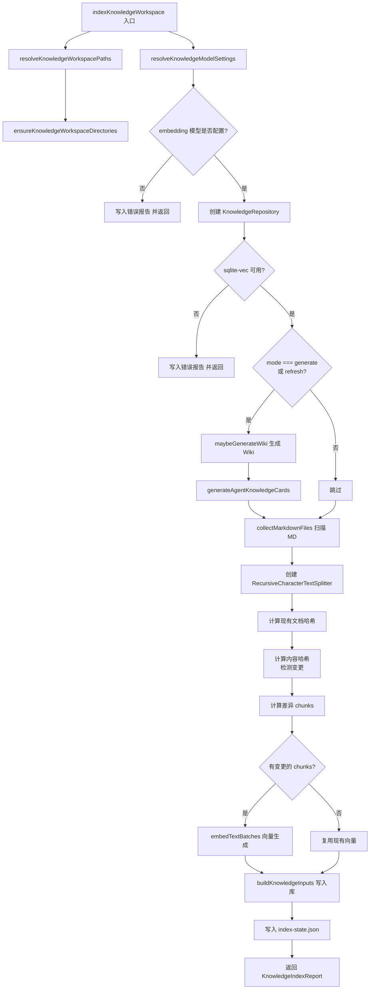
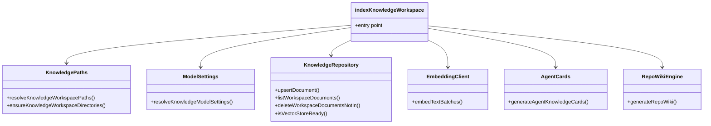
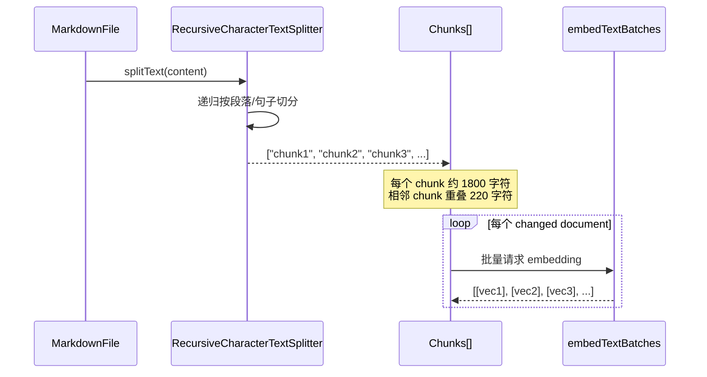
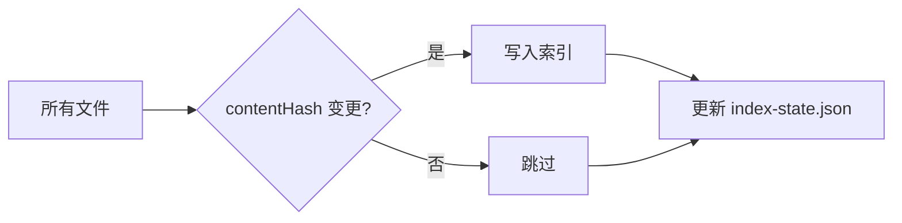

# 知识索引与向量写入

<cite>
**本文引用的文件**

- [src/electron/libs/knowledge/knowledge-indexer.ts](file://src/electron/libs/knowledge/knowledge-indexer.ts#L1-L353)
- [src/electron/libs/git/index.ts](file://src/electron/libs/git/index.ts#L1-L4)
- [src/electron/libs/skill-manager/index.ts](file://src/electron/libs/skill-manager/index.ts#L1-L88)
- [src/electron/libs/task/index.ts](file://src/electron/libs/task/index.ts#L1-L37)
- [src/electron/libs/knowledge/agent-cards.ts](file://src/electron/libs/knowledge/agent-cards.ts#L1-L424)
- [src/electron/libs/knowledge/embedding-client.ts](file://src/electron/libs/knowledge/embedding-client.ts#L1-L122)
- [src/electron/libs/knowledge/knowledge-model-settings.ts](file://src/electron/libs/knowledge/knowledge-model-settings.ts#L1-L91)
- [src/electron/libs/knowledge/knowledge-overview.ts](file://src/electron/libs/knowledge/knowledge-overview.ts#L1-L128)
- [src/electron/libs/knowledge/knowledge-paths.ts](file://src/electron/libs/knowledge/knowledge-paths.ts#L1-L88)
</cite>

---

## 目录

- [职责概述](#职责概述)
- [入口函数与核心流程](#入口函数与核心流程)
- [数据结构与类型定义](#数据结构与类型定义)
- [调用链与模块协作](#调用链与模块协作)
- [配置与路径解析](#配置与路径解析)
- [Chunk 分块策略](#chunk-分块策略)
- [向量生成与批处理](#向量生成与批处理)
- [增量索引与变更检测](#增量索引与变更检测)
- [常见失败模式与排障](#常见失败模式与排障)
- [扩展点与修改步骤](#扩展点与修改步骤)

---

## 职责概述

`knowledge-indexer.ts` 是知识引擎的核心模块，负责将项目的 Markdown 文档（Repo Wiki 和 Agent Cards）转换为可检索的向量索引。其核心职责包括：

1. **文件扫描**：递归收集 `.tech/repowiki/content/` 和 `.tech/repowiki/agent-cards/` 下的 Markdown 文件
2. **内容分块**：使用 `RecursiveCharacterTextSplitter` 将文档切分为固定大小的 chunk
3. **向量生成**：调用 embedding API 将 chunk 转换为高维向量
4. **增量写入**：仅写入内容哈希发生变化的文档，避免全量重索引
5. **状态报告**：生成索引状态报告到 `.tech/reports/index-state.json`

[章节来源](file://src/electron/libs/knowledge/knowledge-indexer.ts#L170-L176)

---

## 入口函数与核心流程

### 主入口 `indexKnowledgeWorkspace`

```typescript
export async function indexKnowledgeWorkspace(options: {
  workspaceRoot: string;
  appDataPath: string;
  mode: KnowledgeIndexMode;
  onProgress?: (event: RepoWikiProgressEvent) => void;
}): Promise<KnowledgeIndexReport>
```

[图表来源](file://src/electron/libs/knowledge/knowledge-indexer.ts#L170)

### 执行流程图



[图表来源](file://src/electron/libs/knowledge/knowledge-indexer.ts#L170-L337)

---

## 数据结构与类型定义

### MarkdownFile

```typescript
type MarkdownFile = {
  absolutePath: string;   // 绝对路径
  relativePath: string;   // 相对于 workspaceRoot 的路径
  title: string;          // 从首个 # 标题提取，或文件名
  content: string;        // 原始内容
};
```

[章节来源](file://src/electron/libs/knowledge/knowledge-indexer.ts#L31-L36)

### MarkdownIndexItem

```typescript
type MarkdownIndexItem = MarkdownFile & {
  sourceKind: KnowledgeSourceKind;  // "repowiki" | "agent_card"
  tags: string[];
  metadata: Record<string, unknown>;
  chunks: string[];                // 分块后的文本片段
  contentHash: string;            // stableHash(content) 用于变更检测
  changed: boolean;                // 是否与库中版本不同
};
```

[章节来源](file://src/electron/libs/knowledge/knowledge-indexer.ts#L38-L45)

### 知识写入输入

```typescript
const input: KnowledgeUpsertInput = {
  workspaceScope: paths.workspaceScope,
  sourceKind: file.sourceKind,
  sourcePath: file.relativePath,
  title: file.title,
  summary: compactWhitespace(file.content, 320),  // 320 字符摘要
  tags: file.tags,
  metadata: {
    absolutePath: file.absolutePath,
    contentHash: file.contentHash,
    ...file.metadata,
  },
  content: file.content,
  chunks: file.chunks.map((content, chunkIndex) => ({
    content,
    chunkIndex,
    tokenEstimate: estimateTokens(content),
    embedding,        // 从 embedding API 获取的向量
    embeddingModel,
    metadata: { title: file.title },
  })),
};
```

[章节来源](file://src/electron/libs/knowledge/knowledge-indexer.ts#L128-L155)

---

## 调用链与模块协作

### 模块依赖关系



### 关键调用序列

| 阶段 | 函数 | 职责 |
|------|------|------|
| 路径解析 | `resolveKnowledgeWorkspacePaths` | 构建 `.tech` 目录结构和 appData 路径 |
| 配置读取 | `resolveKnowledgeModelSettings` | 从 `loadApiConfigSettings` 获取 embedding/wiki 模型配置 |
| Wiki 生成 | `maybeGenerateWiki` | 若 mode 为 `generate`/`refresh`，调用 `generateRepoWiki` |
| Agent Cards | `generateAgentKnowledgeCards` | 扫描项目源码，生成 Agent 知识卡片 |
| 文件收集 | `collectMarkdownFiles` | 递归收集目录下的 `.md` 文件 |
| 内容分块 | `RecursiveCharacterTextSplitter` | 按 `chunkSize=1800`, `chunkOverlap=220` 切分 |
| 向量生成 | `embedTextBatches` | 调用 embedding API，分批处理 |
| 索引写入 | `buildKnowledgeInputs` | 对变更文档执行 upsert |

[章节来源](file://src/electron/libs/knowledge/knowledge-indexer.ts#L105-L168)

---

## 配置与路径解析

### 路径结构

```typescript
KnowledgeWorkspacePaths = {
  // 工作区路径
  workspaceRoot: string,       // 如 /project/xxx
  workspaceSlug: string,       // 如 xxx (目录名)
  workspaceScope: string,      // 如 workspace:xxx
  workspaceHash: string,       // sha256 前 16 位

  // .tech 目录结构
  techRoot: string,             // .tech/
  repowikiRoot: string,         // .tech/repowiki/zh/
  repowikiContentDir: string,   // .tech/repowiki/zh/content/
  agentCardsDir: string,       // .tech/repowiki/zh/agent-cards/

  // appData 路径 (不可见目录)
  appDataRoot: string,         // appData/knowledge/
  appDataWorkspaceRoot: string, // appData/knowledge/<hash>/
  knowledgeDbPath: string,      // appData/knowledge/<hash>/knowledge.sqlite
  memoryDbPath: string,        // appData/knowledge/<hash>/memory.sqlite

  // 报告文件
  reportsDir: string,          // .tech/reports/
  indexStatePath: string,      // .tech/reports/index-state.json
  skippedFilesPath: string,    // .tech/reports/skipped-files.json
  generationReportPath: string, // .tech/reports/generation-report.json
}
```

[章节来源](file://src/electron/libs/knowledge/knowledge-paths.ts#L5-L26)

### 嵌入模型配置

```typescript
// 从 profiles 中查找 embeddingModel 配置
interface EmbeddingModelSettings {
  profileId: string;
  profileName: string;
  apiKey: string;
  baseURL: string;
  model: string;           // 如 text-embedding-3-small
  dimension: number;       // 1536 (text-embedding-3-small) 或 1024/2560/4096
  batchSize: number;       // 默认 16，最大 128
}
```

已知维度映射：
- `text-embedding-3-small` → 1536
- `text-embedding-3-large` → 3072
- `qwen3-embedding-0.6b` → 1024
- `qwen3-embedding-4b` → 2560
- `qwen3-embedding-8b` → 4096

[章节来源](file://src/electron/libs/knowledge/knowledge-model-settings.ts#L11-L22)

---

## Chunk 分块策略

```typescript
const DEFAULT_CHUNK_SIZE = 1_800;    // 每个 chunk 的字符数
const DEFAULT_CHUNK_OVERLAP = 220;    // 相邻 chunk 之间的重叠字符数
```

[章节来源](file://src/electron/libs/knowledge/knowledge-indexer.ts#L28-L29)

### 分块流程



### 变更检测

```typescript
// 读取库中现有文档的 contentHash
const existingDocuments = new Map(
  repository
    .listWorkspaceDocuments(paths.workspaceScope)
    .map((doc) => [`${doc.sourceKind}:${doc.sourcePath}`, doc.contentHash])
);

// 对比计算新的 contentHash
const indexItems = allFiles.map((file) => ({
  ...file,
  contentHash: stableHash(file.content),
  changed: existingDocuments.get(`${file.sourceKind}:${file.relativePath}`) !== contentHash,
}));
```

[章节来源](file://src/electron/libs/knowledge/knowledge-indexer.ts#L257-L271)

---

## 向量生成与批处理

### embedding-client.ts 关键函数

#### `embedTextBatches`

```typescript
export async function embedTextBatches(
  settings: EmbeddingModelSettings,
  texts: string[],
  onProgress?: (progress: { completed: number; total: number }) => void,
): Promise<number[][]>
```

**批处理逻辑**：

```mermaid
flowchart TD
    A[texts: string[]] --> B[按 batchSize=16 分批]
    B --> C{批量请求成功?}
    C -->|成功| D[收集向量]
    C -->|失败| E{单条请求成功?}
    E -->|是| D
    E -->|否| F[抛出错误]
    D --> G{还有更多批次?}
    G -->|是| B
    G -->|否| H[返回 vectors]
```

**重试策略**：

- 单次请求失败后重试 3 次，间隔 `350 * attempt` 毫秒
- 批量请求失败时，回退到逐条请求

[章节来源](file://src/electron/libs/knowledge/embedding-client.ts#L98-L121)

#### `normalizeEmbeddingVector`

向量验证逻辑：

```typescript
function normalizeEmbeddingVector(vector: unknown, expectedDimension: number): number[] {
  // 1. 必须是数组
  // 2. 每个元素必须是有限数值
  // 3. 维度必须匹配 expectedDimension
  return normalized;
}
```

维度不匹配时抛出：
```
embedding dimension mismatch: expected 1536, got 1024
```

[章节来源](file://src/electron/libs/knowledge/embedding-client.ts#L22-L34)

---

## 增量索引与变更检测

### 增量索引流程



### 写入前清理

```typescript
// 删除已移除的文件对应的文档
for (const sourceKind of sourceKinds) {
  repository.deleteWorkspaceDocumentsNotIn(
    paths.workspaceScope,
    sourceKind,
    new Set(indexItems.filter((item) => item.sourceKind === sourceKind).map((item) => item.relativePath)),
  );
}
```

[章节来源](file://src/electron/libs/knowledge/knowledge-indexer.ts#L119-L125)

### 索引报告结构

```typescript
const report: KnowledgeIndexReport = {
  workspaceScope: paths.workspaceScope,
  techRoot: paths.techRoot,
  repositoryReady: true,
  embeddingEnabled: Boolean(settings.embedding),
  vectorStoreReady: true,
  wikiGenerationEnabled: Boolean(settings.wiki),
  indexedDocuments: 15,       // 总文档数
  indexedChunks: 120,         // 总 chunk 数
  skippedFiles: 3,            // 跳过的文件数
  generatedFiles: ["...", "..."],  // 本次生成的文件列表
  success: true,
  message: "Knowledge Engine 索引完成：15 个文档，120 个 chunks，刷新 3 个文档/25 个 chunks。",
};
```

[章节来源](file://src/electron/libs/knowledge/knowledge-indexer.ts#L311-L321)

---

## 常见失败模式与排障

### 1. 缺少 embedding 模型配置

**错误信息**：
```
Knowledge Engine 未启用：缺少 embeddingModel，不能只用 FTS5 开启知识库。
```

**错误码**：`missing-embedding-model`

**原因**：`settings.embedding` 为 `undefined`，即 `loadApiConfigSettings().profiles` 中没有配置 `embeddingModel` 的 profile。

**排障步骤**：

1. 检查 `src/electron/libs/config-store.ts` 的 `loadApiConfigSettings` 返回值
2. 确认 profiles 中至少有一个 profile 配置了 `embeddingModel`
3. 验证 `embeddingModel` 字段非空且有效

[章节来源](file://src/electron/libs/knowledge/knowledge-indexer.ts#L192-L200)

### 2. sqlite-vec 扩展不可用

**错误信息**：
```
Knowledge Engine 未启用：sqlite-vec 扩展不可用。
```

**错误码**：`sqlite-vec-unavailable`

**原因**：`repository.isVectorStoreReady()` 返回 `false`，即 SQLite 没有加载 `sqlite-vec` 扩展。

**排障步骤**：

1. 检查 `src/electron/libs/knowledge/knowledge-repository.ts` 中 sqlite-vec 的加载逻辑
2. 确认 electron-builder 配置中 `sqlite-vec` native 模块正确打包
3. 检查 app 启动时是否有 native 模块加载错误日志

[章节来源](file://src/electron/libs/knowledge/knowledge-indexer.ts#L207-L218)

### 3. embedding API 请求失败

**错误场景**：批量请求 embedding 时返回非 200 状态码或 JSON 解析失败。

**错误信息**：
```
embedding API returned non-JSON response: ...
embedding API response missing data[]
embedding API response missing vector for input 0
```

**排障步骤**：

1. 检查 `embedding-baseURL` 是否可访问
2. 确认 `embedding-apiKey` 有效且未过期
3. 检查网络代理设置
4. 查看 `.tech/reports/generation-report.json` 中的 embedding 调用记录

[章节来源](file://src/electron/libs/knowledge/embedding-client.ts#L52-L80)

### 4. 向量维度不匹配

**错误信息**：
```
embedding dimension mismatch: expected 1536, got 1024
```

**原因**：配置的 embedding 模型与 `knowledge-model-settings.ts` 中硬编码的维度映射不匹配。

**排障步骤**：

1. 确认使用的模型名称与 `KNOWN_EMBEDDING_DIMENSIONS` 中的正则匹配
2. 若使用新模型，需在 `knowledge-model-settings.ts` 的 `KNOWN_EMBEDDING_DIMENSIONS` 中添加映射
3. 或在 profile 配置中明确设置 `embeddingDimension`

[章节来源](file://src/electron/libs/knowledge/knowledge-model-settings.ts#L16-L36)

---

## 扩展点与修改步骤

### 修改 chunk 分块策略

**步骤 1**：修改常量

```typescript
// knowledge-indexer.ts#L28-L29
const DEFAULT_CHUNK_SIZE = 1_800;   // 修改为新值
const DEFAULT_CHUNK_OVERLAP = 220;  // 修改为新值
```

**步骤 2**：回归验证

```bash
# 验证不同大小文档的分块效果
npm run qa:knowledge

# 检查 chunk 数量是否合理
```

[章节来源](file://src/electron/libs/knowledge/knowledge-indexer.ts#L253-L256)

### 添加新的 SourceKind

**步骤 1**：在 `knowledge-types.ts` 中添加新的 `KnowledgeSourceKind`

**步骤 2**：在 `indexKnowledgeWorkspace` 中添加收集逻辑

```typescript
// 新增收集函数
function collectNewSourceFiles(dir: string): MarkdownFile[] {
  // 实现收集逻辑
}

// 在 allFiles 合并时加入
const allFiles = [
  ...markdownFiles.map((file) => ({ ...file, sourceKind: "repowiki" as const })),
  ...agentCardFiles.map((file) => ({ ...file, sourceKind: "agent_card" as const })),
  ...newSourceFiles.map((file) => ({ ...file, sourceKind: "new_source" as const })),
];
```

[章节来源](file://src/electron/libs/knowledge/knowledge-indexer.ts#L229-L246)

### 添加新的 embedding 提供商

**步骤 1**：修改 `embedding-client.ts` 的请求逻辑

```typescript
// 根据 settings.model 判断使用不同的请求格式
if (settings.model.startsWith("voyage")) {
  // voyage-api 格式
} else {
  // OpenAI 兼容格式
}
```

**步骤 2**：更新 `normalizeEmbeddingVector` 以处理提供商特有的响应格式

[章节来源](file://src/electron/libs/knowledge/embedding-client.ts#L36-L81)

### 回归验证方式

| 改动范围 | 验证命令 | 验证内容 |
|----------|----------|----------|
| 仅索引逻辑 | `npm run qa:knowledge` | chunk 数、向量维度、写入成功 |
| 涉及 Wiki 生成 | `npm run build && npm run qa:knowledge-chat` | wiki 内容、chat 注入 |
| 涉及 UI | `npm run build && npm run qa:knowledge-ui` | 侧边栏显示、搜索结果 |
| 涉及向量模型 | 手动搜索测试 | 搜索结果相关性 |
| 全量改动 | 完整 smoke test | build + 索引 + 聊天 + 搜索 |

[图表来源](file://src/electron/libs/knowledge/agent-cards.ts#L337-L357)

---

## 总结

`knowledge-indexer.ts` 是知识引擎的执行引擎，它将文件系统中的 Markdown 文档转换为可向量检索的知识库。核心设计包括：

- **增量索引**：通过 `stableHash` 对比内容，仅重索引变更文档
- **分块策略**：使用 `RecursiveCharacterTextSplitter` 保持语义完整性
- **批处理重试**：embedding 请求失败自动重试并降级到单条处理
- **模块化**：路径解析、模型配置、向量生成、写入存储各自独立

修改此模块时，重点关注：
1. 配置是否正确加载（embedding model, wiki model）
2. 路径是否正确解析（workspaceScope, appDataPath）
3. 向量维度是否匹配（dimension vs expectedDimension）
4. 增量逻辑是否正确（contentHash 对比）