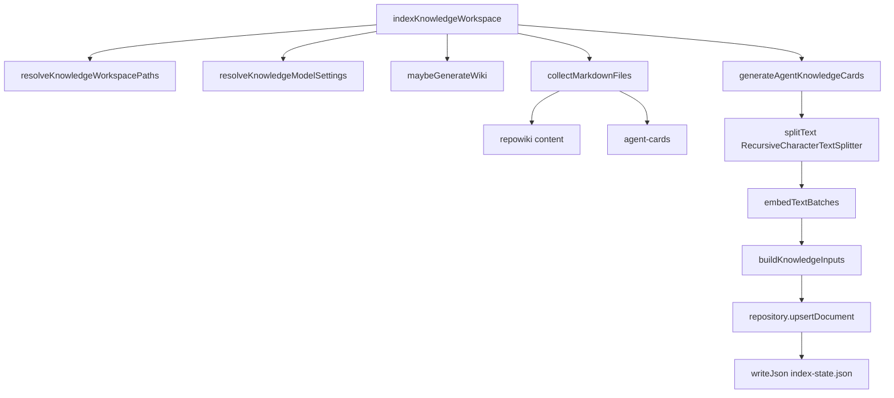
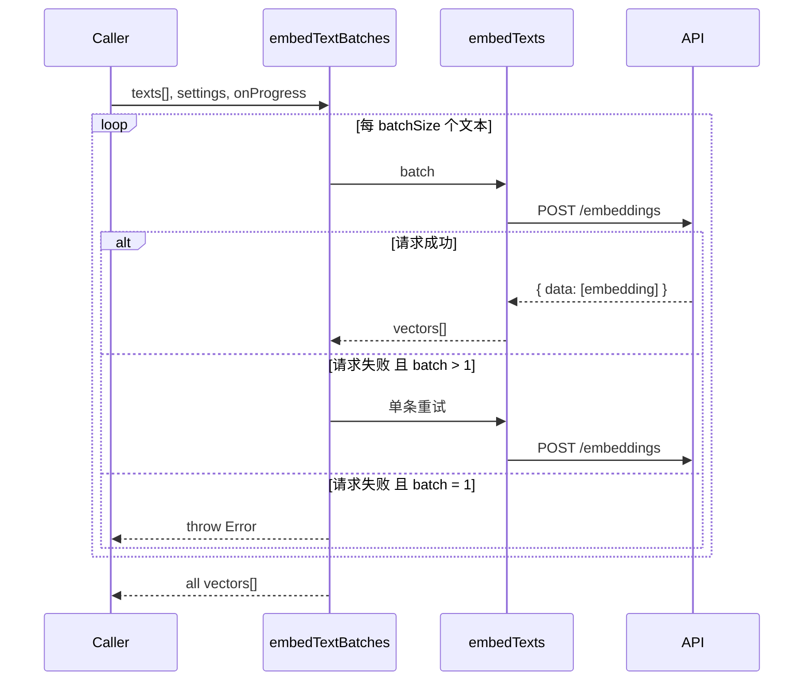
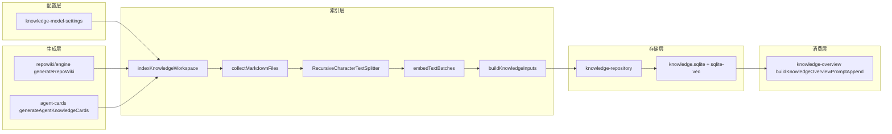

# 知识索引与向量写入

<cite>

**本文引用的文件**

- [src/electron/libs/knowledge/knowledge-indexer.ts](file://src/electron/libs/knowledge/knowledge-indexer.ts)
- [src/electron/libs/git/index.ts](file://src/electron/libs/git/index.ts)
- [src/electron/libs/skill-manager/index.ts](file://src/electron/libs/skill-manager/index.ts)
- [src/electron/libs/task/index.ts](file://src/electron/libs/task/index.ts)
- [src/electron/libs/knowledge/agent-cards.ts](file://src/electron/libs/knowledge/agent-cards.ts)
- [src/electron/libs/knowledge/embedding-client.ts](file://src/electron/libs/knowledge/embedding-client.ts)
- [src/electron/libs/knowledge/knowledge-model-settings.ts](file://src/electron/libs/knowledge/knowledge-model-settings.ts)
- [src/electron/libs/knowledge/knowledge-overview.ts](file://src/electron/libs/knowledge/knowledge-overview.ts)
- [src/electron/libs/knowledge/knowledge-paths.ts](file://src/electron/libs/knowledge/knowledge-paths.ts)

</cite>

## 目录

- [职责概览](#职责概览)
- [入口函数与调用链](#入口函数与调用链)
- [核心数据结构](#核心数据结构)
- [配置解析机制](#配置解析机制)
- [文件扫描与分块策略](#文件扫描与分块策略)
- [向量生成与批处理](#向量生成与批处理)
- [索引写入流程](#索引写入流程)
- [上下游依赖关系](#上下游依赖关系)
- [修改步骤与回归验证](#修改步骤与回归验证)
- [常见失败模式与排障](#常见失败模式与排障)

---

## 职责概览

`knowledge-indexer.ts` 是知识引擎的**索引编排层**，负责将 Repo Wiki 文档和 Agent Cards 转换为可检索的向量索引。其核心职责包括：

1. **编排全量管道**：协调 Wiki 生成 → Agent Cards → 文件扫描 → 分块 → 向量 → 写入的完整流程
2. **增量检测**：通过 `stableHash` 对比内容变化，只对变更文档重新生成向量
3. **状态持久化**：将索引结果写入 `index-state.json`，便于前端展示和会话恢复
4. **错误兜底**：任何阶段失败都写入报告，防止静默失败

章节来源：[knowledge-indexer.ts#L170-L351](file://src/electron/libs/knowledge/knowledge-indexer.ts#L170-L351)

---

## 入口函数与调用链

### 主入口

```typescript
export async function indexKnowledgeWorkspace(options: {
  workspaceRoot: string;
  appDataPath: string;
  mode: KnowledgeIndexMode;  // 'full' | 'incremental' | 'generate' | 'refresh'
  onProgress?: (event: RepoWikiProgressEvent) => void;
}): Promise<KnowledgeIndexReport>
```

### 阶段化调用链



关键参数：

| 参数 | 来源 | 说明 |
|------|------|------|
| `workspaceRoot` | 调用方传入 | 项目根目录 |
| `appDataPath` | `app.getPath("userData")` | Electron 用户数据目录 |
| `mode` | 调用方传入 | `generate` 会触发 Wiki 生成，`refresh` 会重新索引，`incremental` 仅变更部分 |

章节来源：[knowledge-indexer.ts#L170-L175](file://src/electron/libs/knowledge/knowledge-indexer.ts#L170-L175)

---

## 核心数据结构

### 索引过程中的关键类型

```typescript
// 单个 Markdown 文件元数据
type MarkdownFile = {
  absolutePath: string;
  relativePath: string;
  title: string;       // 从 H1 提取或 fallback 到文件名
  content: string;
};

// 准备写入索引的完整项
type MarkdownIndexItem = MarkdownFile & {
  sourceKind: KnowledgeSourceKind;  // 'repowiki' | 'agent_card'
  tags: string[];
  metadata: Record<string, unknown>;
  chunks: string[];                // 分块后的文本片段
  contentHash: string;             // 用于增量检测
  changed: boolean;                // 与已有索引对比的结果
};
```

### `KnowledgeIndexReport` 结构

```typescript
type KnowledgeIndexReport = {
  workspaceScope: string;
  techRoot: string;
  repositoryReady: boolean;
  embeddingEnabled: boolean;
  vectorStoreReady: boolean;
  wikiGenerationEnabled: boolean;
  indexedDocuments: number;
  indexedChunks: number;
  skippedFiles: number;
  generatedFiles: string[];
  success: boolean;
  message: string;
  error?: string;
};
```

章节来源：[knowledge-indexer.ts#L31-L45](file://src/electron/libs/knowledge/knowledge-indexer.ts#L31-L45)

---

## 配置解析机制

### 双配置源

配置从两个来源读取：

1. **API Profile 配置**：通过 `loadApiConfigSettings()` 读取 `settings.json` 中的 profile 列表
2. **embedding/wiki 模型选择**：从 profile 中筛选出配置了 `embeddingModel` 和 `wikiModel` 的有效 profile

### `resolveKnowledgeModelSettings` 逻辑

```typescript
export function resolveKnowledgeModelSettings(): KnowledgeModelSettings {
  const profiles = loadApiConfigSettings().profiles.filter(isUsableProfile);
  const embeddingProfile = profiles.find(p => p.embeddingModel?.trim());
  const wikiProfile = profiles.find(p => p.wikiModel?.trim());
  // ... 构建 EmbeddingModelSettings 和 WikiModelSettings
}
```

**关键点**：

- 只有同时满足 `enabled`、`apiKey` 非空、`baseURL` 非空的 profile 才会被使用
- embedding 维度自动识别（常见模型如 `text-embedding-3-small` → 1536），也可手动配置
- batchSize 默认 16，最大限制 128

章节来源：[knowledge-model-settings.ts#L49-L83](file://src/electron/libs/knowledge/knowledge-model-settings.ts#L49-L83)

### 入口校验

```typescript
if (!settings.embedding) {
  return report { success: false, error: "missing-embedding-model" };
}
```

这是强制前置条件，不能只靠 FTS5 开启知识库。

章节来源：[knowledge-indexer.ts#L192-L201](file://src/electron/libs/knowledge/knowledge-indexer.ts#L192-L201)

---

## 文件扫描与分块策略

### `collectMarkdownFiles` 规则

```typescript
function collectMarkdownFiles(dir: string, root: string): MarkdownFile[] {
  // 1. 跳过不存在的目录
  // 2. 递归遍历所有子目录
  // 3. 仅收集 .md 文件（忽略 _sidebar.md）
  // 4. 提取首行 H1 作为标题
}
```

**标题提取逻辑**：
```typescript
function extractMarkdownTitle(content: string, fallback: string): string {
  const firstHeading = content.match(/^#\s+(.+)$/m)?.[1]?.trim();
  return firstHeading || fallback.replace(/\.md$/i, "");
}
```

章节来源：[knowledge-indexer.ts#L51-L54](file://src/electron/libs/knowledge/knowledge-indexer.ts#L51-L54)

### 分块参数

| 参数 | 值 | 说明 |
|------|-----|------|
| `chunkSize` | 1800 tokens | 单个 chunk 目标大小 |
| `chunkOverlap` | 220 tokens | 块间重叠，防止上下文丢失 |

分块由 `@langchain/textsplitters` 的 `RecursiveCharacterTextSplitter` 实现，支持 Markdown 语法感知。

章节来源：[knowledge-indexer.ts#L253-L256](file://src/electron/libs/knowledge/knowledge-indexer.ts#L253-L256)

### 增量检测机制

```typescript
const existingDocuments = new Map(
  repository
    .listWorkspaceDocuments(paths.workspaceScope)
    .map(doc => [`${doc.sourceKind}:${doc.sourcePath}`, doc.contentHash])
);

const changedItems = indexItems.filter(item => item.changed);
// changed = existingDocuments.get(...) !== contentHash
```

只有 `changed = true` 的文档会重新生成向量，复用现有向量。

章节来源：[knowledge-indexer.ts#L257-L272](file://src/electron/libs/knowledge/knowledge-indexer.ts#L257-L272)

---

## 向量生成与批处理

### `embedTextBatches` 流程



### 重试策略

- 单次请求最多 3 次重试
- 失败后等待 `350 * attempt` ms 再重试
- 批量失败时，拆分为单条重试（保证至少拿到部分向量）

章节来源：[embedding-client.ts#L83-L96](file://src/electron/libs/knowledge/embedding-client.ts#L83-L96)

### 向量维度校验

```typescript
function normalizeEmbeddingVector(vector: unknown, expectedDimension: number): number[] {
  if (normalized.length !== expectedDimension) {
    throw new Error(`embedding dimension mismatch: expected ${expectedDimension}, got ${normalized.length}`);
  }
  return normalized;
}
```

维度不匹配会直接抛错，防止写入错误的向量维度。

章节来源：[embedding-client.ts#L30-L31](file://src/electron/libs/knowledge/embedding-client.ts#L30-L31)

---

## 索引写入流程

### `buildKnowledgeInputs` 核心逻辑

```typescript
async function buildKnowledgeInputs(
  paths, repository, embeddingModel,
  embeddings, indexItems, onProgress
): Promise<{ indexedDocuments, indexedChunks, changedDocuments, changedChunks }>
```

**写入步骤**：

1. **清理旧文档**：对每个 sourceKind，删除不在当前文件列表中的文档
   ```typescript
   repository.deleteWorkspaceDocumentsNotIn(
     paths.workspaceScope,
     sourceKind,
     new Set(currentFilePaths)
   );
   ```

2. **组装 upsert 输入**：每个 chunk 对应一个向量
   ```typescript
   const input: KnowledgeUpsertInput = {
     chunks: file.chunks.map((content, chunkIndex) => ({
       content,
       chunkIndex,
       tokenEstimate: estimateTokens(content),
       embedding: embeddings[vectorIndex++],
       embeddingModel,
     })),
   };
   ```

3. **写入 repository**：
   ```typescript
   repository.upsertDocument(input);
   ```

章节来源：[knowledge-indexer.ts#L105-L168](file://src/electron/libs/knowledge/knowledge-indexer.ts#L105-L168)

### 报告写入

索引完成后会写入三个文件：

| 文件 | 位置 | 内容 |
|------|------|------|
| `index-state.json` | `.tech/reports/` | 当前索引状态 |
| `skipped-files.json` | `.tech/reports/` | 跳过文件列表及原因 |
| `generation-report.json` | `.tech/reports/` | 本次生成的完整报告 |

章节来源：[knowledge-indexer.ts#L322-L335](file://src/electron/libs/knowledge/knowledge-indexer.ts#L322-L335)

---

## 上下游依赖关系

### 上游依赖

| 模块 | 用途 |
|------|------|
| `knowledge-model-settings.ts` | 读取 embedding/wiki 模型配置 |
| `knowledge-paths.ts` | 解析 workspace 路径结构 |
| `embedding-client.ts` | 调用外部 embedding API |
| `agent-cards.ts` | 生成 Agent Cards（上游还依赖 `repowiki/` 模块） |

### 下游依赖

| 模块 | 被调用方式 |
|------|-----------|
| `knowledge-repository.ts` | `new KnowledgeRepository()` 创建实例，`upsertDocument()` 写入 |
| `knowledge-overview.ts` | 读取已写入的索引，构建 system prompt 注入内容 |

### 数据流总览



章节来源：[knowledge-overview.ts#L30-L119](file://src/electron/libs/knowledge/knowledge-overview.ts#L30-L119)

---

## 修改步骤与回归验证

### 修改配置解析

**步骤**：
1. 确认修改的字段在 `ApiConfig` 类型中的位置
2. 检查 `knowledge-model-settings.ts` 中对应字段的读取逻辑
3. 更新 `isUsableProfile` 的筛选条件（如需要）

**回归验证**：
```bash
# 测试无效 profile 被正确过滤
npm run qa:knowledge
```

### 修改分块策略

**步骤**：
1. 修改 `DEFAULT_CHUNK_SIZE` 或 `DEFAULT_CHUNK_OVERLAP` 常量
2. 确认新参数在 `RecursiveCharacterTextSplitter` 中的传递

**回归验证**：
```bash
# 触发一次完整索引
npm run qa:knowledge-chat

# 检查生成报告中 changedDocuments/changedChunks 是否符合预期
cat .tech/reports/generation-report.json
```

### 修改向量维度

**步骤**：
1. 在 `knowledge-model-settings.ts` 的 `KNOWN_EMBEDDING_DIMENSIONS` 中添加新模型映射
2. 或在 profile 配置中设置 `embeddingDimension`

**回归验证**：
```bash
# 检查向量写入时维度是否匹配
npm run qa:knowledge

# 验证已写入的向量维度（需要 sqlite-vec 支持）
```

图表来源：流程图由 `knowledge-indexer.ts` 调用逻辑生成

---

## 常见失败模式与排障

### 1. `missing-embedding-model`

**错误信息**：
```
Knowledge Engine 未启用：缺少 embeddingModel，不能只用 FTS5 开启知识库。
```

**原因**：未在 settings 中配置 embeddingModel 或 profile 未启用

**排查步骤**：
1. 检查 `settings.json` 中是否存在 enabled=true 且 apiKey/baseURL/embeddingModel 非空的 profile
2. 确认 `resolveKnowledgeModelSettings` 能找到符合条件的 embeddingProfile

章节来源：[knowledge-indexer.ts#L192-L201](file://src/electron/libs/knowledge/knowledge-indexer.ts#L192-L201)

### 2. `sqlite-vec-unavailable`

**错误信息**：
```
Knowledge Engine 未启用：sqlite-vec 扩展不可用。
```

**原因**：`repository.isVectorStoreReady()` 返回 false

**排查步骤**：
1. 确认 sqlite-vec 扩展已加载：`SELECT * FROM pragma_module_list()`
2. 检查 `knowledge-repository.ts` 中 vector store 初始化逻辑
3. 验证 `embeddingDimension` 配置与已有表结构兼容

章节来源：[knowledge-indexer.ts#L207-L219](file://src/electron/libs/knowledge/knowledge-indexer.ts#L207-L219)

### 3. embedding 维度不匹配

**错误信息**：
```
embedding dimension mismatch: expected 1536, got 1024
```

**原因**：模型返回的向量维度与配置不一致

**排查步骤**：
1. 检查 `KNOWN_EMBEDDING_DIMENSIONS` 中是否遗漏该模型
2. 确认 profile 中 `embeddingDimension` 配置正确
3. 如果是新模型，添加映射或在配置中显式指定

章节来源：[embedding-client.ts#L30-L31](file://src/electron/libs/knowledge/embedding-client.ts#L30-L31)

### 4. 向量 API 请求失败

**错误信息**：
```
embedding API returned non-JSON response: ...
```

**排查步骤**：
1. 检查 `baseURL` 是否正确（不含尾部斜杠）
2. 确认 `apiKey` 有效且有 embedding 权限
3. 查看 `generation-report.json` 中记录的失败 chunk
4. 验证 API 服务状态（如 OpenAI/Azure/本地模型）

章节来源：[embedding-client.ts#L53-L58](file://src/electron/libs/knowledge/embedding-client.ts#L53-L58)

### 5. 增量索引未生效

**现象**：文档内容变更但向量未更新

**排查步骤**：
1. 检查 `index-state.json` 中 `indexedDocuments` 数量
2. 确认 `stableHash` 计算未受影响（文件编码问题）
3. 查看 `generation-report.json` 中 `changedDocuments` 是否为 0
4. 强制刷新：`mode = 'refresh'` 绕过增量检测

章节来源：[knowledge-indexer.ts#L257-L272](file://src/electron/libs/knowledge/knowledge-indexer.ts#L257-L272)

---

## 扩展点

### 1. 支持新的 sourceKind

在 `collectMarkdownFiles` 调用处添加新类型映射：

```typescript
const allFiles = [
  ...markdownFiles.map(file => ({
    ...file,
    sourceKind: "repowiki" as const,
    tags: ["repowiki", "markdown"],
  })),
  ...agentCardFiles.map(file => ({
    ...file,
    sourceKind: "agent_card" as const,
    tags: ["agent-card", "repowiki", "code-routing"],
  })),
  // 新增：自定义 sourceKind
];
```

### 2. 调整分块策略

`RecursiveCharacterTextSplitter` 支持自定义分隔符。对于 Markdown 文件，可以考虑优先在标题层级分割。

### 3. Wiki 生成配置

通过 `WikiModelSettings` 可配置生成模型、成本等级和 token 上限：

```typescript
const wiki: WikiModelSettings = {
  model: "qwen3-8b",
  costTier: "cheap",
  maxInputTokens: 16_000,
  maxOutputTokens: 4_000,
};
```

章节来源：[knowledge-model-settings.ts#L69-L80](file://src/electron/libs/knowledge/knowledge-model-settings.ts#L69-L80)

---

## 相关文档

- [知识库概览与 system prompt 注入](file://src/electron/libs/knowledge/knowledge-overview.ts)
- [向量嵌入客户端配置](file://src/electron/libs/knowledge/embedding-client.ts)
- [Agent Cards 生成逻辑](file://src/electron/libs/knowledge/agent-cards.ts)
- [工作区路径解析](file://src/electron/libs/knowledge/knowledge-paths.ts)