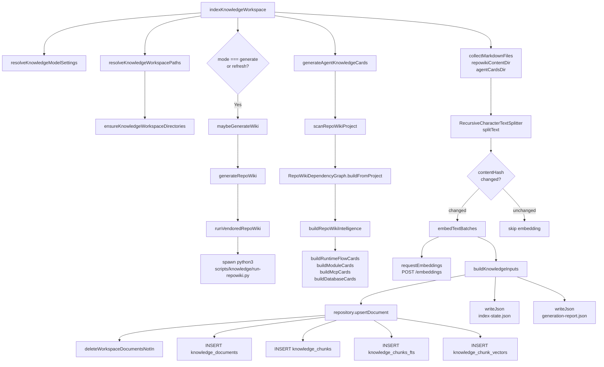
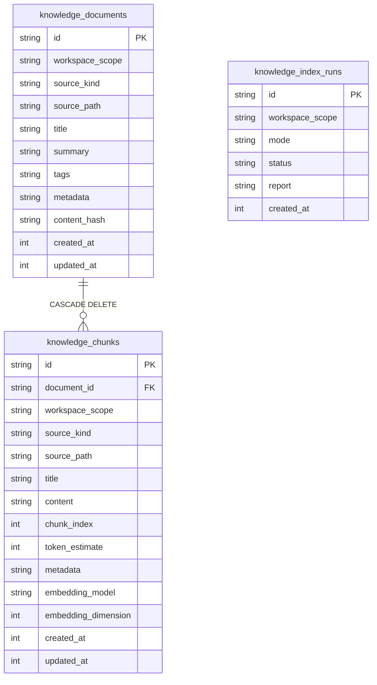

# 知识索引与向量写入

<cite>
**本文引用的文件**
- [src/electron/libs/knowledge/knowledge-indexer.ts](file://src/electron/libs/knowledge/knowledge-indexer.ts)
- [src/electron/libs/knowledge/agent-cards.ts](file://src/electron/libs/knowledge/agent-cards.ts)
- [src/electron/libs/knowledge/embedding-client.ts](file://src/electron/libs/knowledge/embedding-client.ts)
- [src/electron/libs/knowledge/knowledge-model-settings.ts](file://src/electron/libs/knowledge/knowledge-model-settings.ts)
- [src/electron/libs/knowledge/knowledge-overview.ts](file://src/electron/libs/knowledge/knowledge-overview.ts)
- [src/electron/libs/knowledge/knowledge-paths.ts](file://src/electron/libs/knowledge/knowledge-paths.ts)
- [src/electron/libs/knowledge/knowledge-repository.ts](file://src/electron/libs/knowledge/knowledge-repository.ts)
- [src/electron/libs/knowledge/knowledge-types.ts](file://src/electron/libs/knowledge/knowledge-types.ts)
- [src/electron/libs/knowledge/knowledge-ui-store.ts](file://src/electron/libs/knowledge/knowledge-ui-store.ts)
- [src/electron/libs/knowledge/knowledge-utils.ts](file://src/electron/libs/knowledge/knowledge-utils.ts)
- [src/electron/libs/knowledge/repowiki/engine.ts](file://src/electron/libs/knowledge/repowiki/engine.ts)
- [src/electron/libs/knowledge/repowiki/graph.ts](file://src/electron/libs/knowledge/repowiki/graph.ts)
- [src/electron/libs/knowledge/repowiki/intelligence.ts](file://src/electron/libs/knowledge/repowiki/intelligence.ts)
- [src/electron/libs/knowledge/repowiki/scanner.ts](file://src/electron/libs/knowledge/repowiki/scanner.ts)
</cite>

---

## 目录

- [系统职责与边界](#系统职责与边界)
- [入口函数与调用链路](#入口函数与调用链路)
- [核心数据结构](#核心数据结构)
- [配置与模型设置](#配置与模型设置)
- [数据库 Schema 与写入流程](#数据库-schema-与写入流程)
- [常见失败模式与排障](#常见失败模式与排障)
- [扩展点与修改指南](#扩展点与修改指南)
- [Agent 改代码地图](#agent-改代码地图)

---

## 系统职责与边界

知识索引与向量写入是 `tech-cc-hub` 的 **Knowledge Engine** 核心子系统，负责：

1. **文档采集**：从 `.tech/repowiki/` 和 `.tech/repowiki/agent-cards/` 目录收集 Markdown 文件
2. **智能分块**：使用 `RecursiveCharacterTextSplitter` 按 `DEFAULT_CHUNK_SIZE=1800` 字符、`DEFAULT_CHUNK_OVERLAP=220` 进行切分
3. **向量生成**：调用 embedding API 将文本块转为高维向量（默认 1536 维）
4. **混合存储**：同时写入 SQLite FTS5（全文检索）和 sqlite-vec（向量检索）
5. **Agent Cards 生成**：从代码库提取运行时链路、模块入口、MCP 工具等结构化知识卡片
6. **Wiki 生成**：调用 vendored RepoWiki Python 引擎生成项目文档

子系统边界：
- **上游**：`.tech/` 目录下的 Markdown 文档（Repo Wiki 输出）或代码扫描结果
- **下游**：聊天 system prompt 注入（`knowledge-overview.ts`）、MCP 工具 `knowledge_search`、UI 知识面板

---

## 入口函数与调用链路

### 主入口：`indexKnowledgeWorkspace`

```typescript
// src/electron/libs/knowledge/knowledge-indexer.ts:170
export async function indexKnowledgeWorkspace(options: {
  workspaceRoot: string;
  appDataPath: string;
  mode: KnowledgeIndexMode;  // "scan" | "generate" | "refresh"
  onProgress?: (event: RepoWikiProgressEvent) => void;
}): Promise<KnowledgeIndexReport>
```

**调用链路图**



[章节来源](file://src/electron/libs/knowledge/knowledge-indexer.ts#L170-L352)

### 辅助入口

| 函数 | 文件 | 用途 |
|------|------|------|
| `handleKnowledgeUiInvoke` | `knowledge-ui-store.ts:323` | UI 层触发知识生成的 IPC 处理器 |
| `buildKnowledgeOverviewPromptAppend` | `knowledge-overview.ts:30` | 将知识库索引摘要注入 system prompt |
| `generateRepoWiki` | `repowiki/engine.ts:214` | 独立触发 RepoWiki Python 生成器 |
| `generateAgentKnowledgeCards` | `agent-cards.ts:49` | 独立生成 Agent Cards |

---

## 核心数据结构

### `MarkdownIndexItem` — 索引项

```typescript
// knowledge-indexer.ts:38-45
type MarkdownIndexItem = MarkdownFile & {
  sourceKind: KnowledgeSourceKind;  // "repowiki" | "agent_card"
  tags: string[];
  metadata: Record<string, unknown>;
  chunks: string[];
  contentHash: string;
  changed: boolean;
};
```

### `KnowledgeUpsertInput` — 写入结构

```typescript
// knowledge-types.ts:60-62
export type KnowledgeUpsertInput = KnowledgeDocumentInput & {
  chunks: KnowledgeChunkInput[];
};

// knowledge-types.ts:51-58
export type KnowledgeChunkInput = {
  content: string;
  chunkIndex: number;
  tokenEstimate: number;
  metadata?: Record<string, unknown>;
  embedding?: number[];
  embeddingModel?: string;
};
```

### `KnowledgeIndexReport` — 索引结果

```typescript
// knowledge-types.ts:84-98
export type KnowledgeIndexReport = {
  success: boolean;
  workspaceScope: string;
  techRoot: string;
  repositoryReady: boolean;
  embeddingEnabled: boolean;
  vectorStoreReady: boolean;       // sqlite-vec 是否可用
  wikiGenerationEnabled: boolean;
  indexedDocuments: number;
  indexedChunks: number;
  skippedFiles: number;
  generatedFiles: string[];
  message: string;
  error?: string;
};
```

[章节来源](file://src/electron/libs/knowledge/knowledge-types.ts#L84-L98)

---

## 配置与模型设置

### 解析入口：`resolveKnowledgeModelSettings`

```typescript
// knowledge-model-settings.ts:49
export function resolveKnowledgeModelSettings(): KnowledgeModelSettings
```

配置读取链路：

1. 调用 `loadApiConfigSettings()` 获取 `profiles`
2. 过滤 `isUsableProfile`（`enabled && apiKey && baseURL`）
3. 找 `embeddingModel` 和 `wikiModel` 分别配置

### 嵌入维度自动推断

```typescript
// knowledge-model-settings.ts:16-22
const KNOWN_EMBEDDING_DIMENSIONS = [
  { pattern: /qwen3-embedding-0.6b/i, dimension: 1024 },
  { pattern: /qwen3-embedding-4b/i, dimension: 2560 },
  { pattern: /qwen3-embedding-8b/i, dimension: 4096 },
  { pattern: /text-embedding-3-small/i, dimension: 1536 },
  { pattern: /text-embedding-3-large/i, dimension: 3072 },
];
```

### Wiki 模型成本层级

```typescript
// knowledge-model-settings.ts:42-47
function normalizeCostTier(value: string | undefined): WikiModelSettings["costTier"] {
  if (value === "free" || value === "cheap" || value === "standard") {
    return value;
  }
  return "cheap";
}
```

成本层级决定 RepoWiki 并发数：

```typescript
// repowiki/engine.ts:54-59
function resolveRepoWikiConcurrency(wiki: WikiModelSettings): string {
  // free: 2, cheap/standard: 6
  return wiki.costTier === "free" ? "2" : "6";
}
```

[章节来源](file://src/electron/libs/knowledge/knowledge-model-settings.ts#L16-L82)

### 工作区路径解析

```typescript
// knowledge-paths.ts:36
export function resolveKnowledgeWorkspacePaths(workspaceRoot: string, appDataPath: string): KnowledgeWorkspacePaths
```

关键路径：
| 字段 | 路径模式 |
|------|----------|
| `techRoot` | `{workspaceRoot}/.tech` |
| `repowikiContentDir` | `{workspaceRoot}/.tech/repowiki/zh/content` |
| `agentCardsDir` | `{workspaceRoot}/.tech/repowiki/agent-cards` |
| `knowledgeDbPath` | `{appDataPath}/knowledge/{workspaceHash}/knowledge.sqlite` |
| `memoryDbPath` | `{appDataPath}/knowledge/{workspaceHash}/memory.sqlite` |

[章节来源](file://src/electron/libs/knowledge/knowledge-paths.ts#L36-L72)

---

## 数据库 Schema 与写入流程

### 表结构



**虚拟表**：
- `knowledge_chunks_fts` — FTS5 全文索引
- `knowledge_chunk_vectors` — sqlite-vec 向量索引

### 向量存储初始化

```typescript
// knowledge-repository.ts:141-160
private initializeVectorStore(): void {
  try {
    loadSqliteVec(this.db);
    const existing = this.db.prepare(
      "SELECT sql FROM sqlite_master WHERE type = 'table' AND name = 'knowledge_chunk_vectors'"
    ).get();

    // 维度变更时删除旧表重建
    if (existing?.sql && !existing.sql.includes(`float[${this.embeddingDimension}]`)) {
      this.db.exec("DROP TABLE IF EXISTS knowledge_chunk_vectors");
    }

    this.db.exec(
      `CREATE VIRTUAL TABLE IF NOT EXISTS knowledge_chunk_vectors
       USING vec0(chunk_rowid integer primary key, embedding float[${this.embeddingDimension}])`
    );
    this.vectorAvailable = true;
  } catch (error) {
    this.vectorAvailable = false;  // sqlite-vec 不可用时降级
  }
}
```

### 写入流程（`buildKnowledgeInputs`）

```typescript
// knowledge-indexer.ts:105-168
async function buildKnowledgeInputs(
  paths, repository, embeddingModel, embeddings, indexItems, onProgress
): Promise<{ indexedDocuments; indexedChunks; changedDocuments; changedChunks }>
```

步骤：
1. **清理**：对每个 `sourceKind`，调用 `deleteWorkspaceDocumentsNotIn` 删除不在新文件列表中的文档
2. **遍历 changedItems**：
   - 构建 `KnowledgeUpsertInput`
   - 关联 `embeddings[vectorIndex++]`
   - 调用 `repository.upsertDocument(input)`
3. **累计报告**：返回 `indexedDocuments`、`indexedChunks`、`changedDocuments`、`changedChunks`

[章节来源](file://src/electron/libs/knowledge/knowledge-indexer.ts#L105-L168)

---

## 常见失败模式与排障

### 1. 缺失 embedding 模型

**错误**：`missing-embedding-model`

```typescript
// knowledge-indexer.ts:192-200
if (!settings.embedding) {
  return {
    success: false,
    error: "missing-embedding-model",
    message: "Knowledge Engine 未启用：缺少 embeddingModel，不能只用 FTS5 开启知识库。",
  };
}
```

**排障**：在模型设置中配置 `embeddingModel`，确保 profile 的 `apiKey`、`baseURL`、`embeddingModel` 均已填写。

### 2. sqlite-vec 扩展不可用

**错误**：`sqlite-vec-unavailable`

```typescript
// knowledge-indexer.ts:207-218
if (!repository.isVectorStoreReady()) {
  return {
    success: false,
    error: "sqlite-vec-unavailable",
    message: "Knowledge Engine 未启用：sqlite-vec 扩展不可用。",
  };
}
```

**排障**：
```bash
# 检查 sqlite-vec 是否正确加载
node -e "const { load } = require('sqlite-vec'); console.log('sqlite-vec loaded')"
```

### 3. 向量维度不匹配

```typescript
// embedding-client.ts:30-32
if (normalized.length !== expectedDimension) {
  throw new Error(`embedding dimension mismatch: expected ${expectedDimension}, got ${normalized.length}`);
}
```

**排障**：检查 `embeddingModel` 是否在 `KNOWN_EMBEDDING_DIMENSIONS` 中，若使用自定义模型需显式设置 `embeddingDimension`。

### 4. RepoWiki Python 脚本找不到

```typescript
// repowiki/engine.ts:40-48
function findRepoRoot(): string {
  const candidates = [process.cwd(), resolve(process.cwd(), ".."), resolve(process.cwd(), "../..")];
  for (const candidate of candidates) {
    if (existsSync(join(candidate, "third_party", "repowiki", "src", "repowiki"))) {
      return candidate;
    }
  }
  throw new Error("找不到 vendored RepoWiki：third_party/repowiki。");
}
```

**排障**：确认 `third_party/repowiki` 目录存在且包含 Python 包。

### 5. 内容哈希冲突导致索引不更新

```typescript
// knowledge-indexer.ts:263-269
const contentHash = stableHash(file.content);
return {
  ...file,
  contentHash,
  chunks: await splitter.splitText(file.content),
  changed: existingDocuments.get(`${file.sourceKind}:${file.relativePath}`) !== contentHash,
};
```

使用 `stableHash`（SHA-256）检测变更，文件内容不变则不会重新 embedding。

[章节来源](file://src/electron/libs/knowledge/knowledge-indexer.ts#L264-L265)

---

## 扩展点与修改指南

### 修改 chunk 分块策略

编辑 `knowledge-indexer.ts:28-29`：

```typescript
const DEFAULT_CHUNK_SIZE = 1_800;  // 默认 1800 字符
const DEFAULT_CHUNK_OVERLAP = 220; // 默认 220 字符重叠
```

### 添加新的 `KnowledgeSourceKind`

1. 在 `knowledge-types.ts:1` 添加枚举值
2. 在 `knowledge-repository.ts:83-137` 确认 schema 兼容
3. 在 `knowledge-indexer.ts:257-261` 添加 sourceKind 过滤逻辑

### 替换 embedding 后端

修改 `embedding-client.ts:36-81` 中的 `requestEmbeddings` 函数，当前实现：
- 调用 `{baseURL}/embeddings`
- 请求体 `{ model, input: texts[] }`
- 响应解析 `payload.data[].embedding`

### 扩展 Agent Cards 类型

在 `agent-cards.ts:15-22` 添加新的 `AgentKnowledgeCardKind`：

```typescript
export type AgentKnowledgeCardKind =
  | "runtime_flow" | "module" | "entrypoint" | "mcp"
  | "database" | "qa" | "agent_question"
  | "新增类型";
```

然后在 `generateAgentKnowledgeCards` 中添加对应的 builder 函数。

---

## Agent 改代码地图

### 1. 改之前先读这些文件

| 优先级 | 文件 | 读取理由 |
|--------|------|----------|
| P0 | `knowledge-indexer.ts` | 主入口，索引逻辑核心 |
| P0 | `knowledge-repository.ts` | SQLite 写入和 schema |
| P0 | `embedding-client.ts` | 向量生成调用 |
| P1 | `knowledge-model-settings.ts` | 配置解析和默认值 |
| P1 | `repowiki/engine.ts` | Wiki 生成入口 |
| P2 | `repowiki/graph.ts` | 依赖图分析 |
| P2 | `repowiki/scanner.ts` | 代码扫描和信号提取 |

### 2. 关键符号表

| 符号 | 类型 | 所在文件 | 说明 |
|------|------|----------|------|
| `indexKnowledgeWorkspace` | 函数 | knowledge-indexer.ts:170 | 主入口 |
| `KnowledgeRepository` | 类 | knowledge-repository.ts:61 | 数据库操作 |
| `embedTextBatches` | 函数 | embedding-client.ts:98 | 批量 embedding |
| `resolveKnowledgeModelSettings` | 函数 | knowledge-model-settings.ts:49 | 配置解析 |
| `generateRepoWiki` | 函数 | repowiki/engine.ts:215 | Wiki 生成 |
| `generateAgentKnowledgeCards` | 函数 | agent-cards.ts:50 | Agent Cards |
| `KnowledgeUpsertInput` | 类型 | knowledge-types.ts:60 | 写入输入 |
| `KnowledgeIndexReport` | 类型 | knowledge-types.ts:84 | 索引结果 |
| `DEFAULT_CHUNK_SIZE` | 常量 | knowledge-indexer.ts:27 | 1800 |
| `DEFAULT_CHUNK_OVERLAP` | 常量 | knowledge-indexer.ts:29 | 220 |

### 3. IPC / MCP 工具

- **UI 层触发**：`handleKnowledgeUiInvoke` (`knowledge-ui-store.ts:323`)
- **聊天注入**：`buildKnowledgeOverviewPromptAppend` (`knowledge-overview.ts:30`)
- **MCP 工具**：`mcp__tech-cc-hub-knowledge__knowledge_index`

### 4. 数据库表

| 表名 | 用途 |
|------|------|
| `knowledge_documents` | 文档元数据 |
| `knowledge_chunks` | 分块内容 |
| `knowledge_index_runs` | 索引运行记录 |
| `knowledge_chunks_fts` | FTS5 全文索引 |
| `knowledge_chunk_vectors` | sqlite-vec 向量索引 |

### 5. 修改入口

- **索引流程**：从 `indexKnowledgeWorkspace` 开始追踪
- **Wiki 生成**：从 `generateRepoWiki` 开始（调用 Python）
- **Agent Cards**：从 `generateAgentKnowledgeCards` 开始
- **配置变更**：从 `resolveKnowledgeModelSettings` 开始

### 6. 验证命令

```bash
# 检查索引状态
cat .tech/reports/index-state.json

# 检查生成报告
cat .tech/reports/generation-report.json

# 检查知识库数据库
sqlite3 "$APPDATA/tech-cc-hub/knowledge/*/knowledge.sqlite" \
  "SELECT COUNT(*) FROM knowledge_documents; SELECT COUNT(*) FROM knowledge_chunks;"

# 验证向量存储
sqlite3 "$APPDATA/tech-cc-hub/knowledge/*/knowledge.sqlite" \
  "SELECT COUNT(*) FROM knowledge_chunk_vectors;"
```

### 7. 常见回归风险

| 风险点 | 描述 | 预防 |
|--------|------|------|
| embedding 维度变更 | 旧向量表维度与新模型不匹配 | 初始化时检测并 DROP 重建 |
| contentHash 逻辑变化 | 已索引文档状态漂移 | 保持 `stableHash` 稳定性 |
| Wiki 生成阻塞 | Python 脚本超时或卡死 | 设置 `REPOWIKI_CONCURRENCY` 环境变量 |
| sqlite-vec 加载失败 | native 扩展不可用 | 降级到纯 FTS5 模式 |
| workspaceScope 不一致 | 不同目录使用同一 scope | 依赖 `workspaceHash` 隔离 |

---

**图表来源**
- 调用链路图：[knowledge-indexer.ts#L170-L352](file://src/electron/libs/knowledge/knowledge-indexer.ts#L170-L352)
- ER 图 schema：[knowledge-repository.ts#L83-L137](file://src/electron/libs/knowledge/knowledge-repository.ts#L83-L137)
- 失败模式判断：[knowledge-indexer.ts#L192-L218](file://src/electron/libs/knowledge/knowledge-indexer.ts#L192-L218)