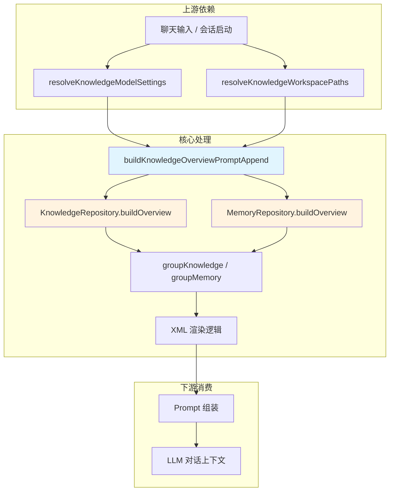

# 聊天上下文知识注入

<cite>

**本文引用的文件**

- [src/electron/libs/knowledge/knowledge-overview.ts](file://src/electron/libs/knowledge/knowledge-overview.ts)
- [src/electron/libs/knowledge/knowledge-repository.ts](file://src/electron/libs/knowledge/knowledge-repository.ts)
- [src/electron/libs/knowledge/knowledge-types.ts](file://src/electron/libs/knowledge/knowledge-types.ts)
- [src/electron/libs/knowledge/repowiki/builder.ts](file://src/electron/libs/knowledge/repowiki/builder.ts)
- [src/electron/libs/knowledge/repowiki/prompts.ts](file://src/electron/libs/knowledge/repowiki/prompts.ts)
- [src/electron/libs/knowledge/repowiki/types.ts](file://src/electron/libs/knowledge/repowiki/types.ts)
- [src/electron/libs/git/index.ts](file://src/electron/libs/git/index.ts)
- [src/electron/libs/skill-manager/index.ts](file://src/electron/libs/skill-manager/index.ts)
- [src/electron/libs/task/index.ts](file://src/electron/libs/task/index.ts)

</cite>

---

## 目录

- [功能概述](#功能概述)
- [核心入口函数](#核心入口函数)
- [数据结构与类型定义](#数据结构与类型定义)
- [调用链与上下游关系](#调用链与上下游关系)
- [优先级评分机制](#优先级评分机制)
- [输出格式详解](#输出格式详解)
- [修改功能时的步骤](#修改功能时的步骤)
- [回归验证方式](#回归验证方式)
- [常见失败模式与排障](#常见失败模式与排障)
- [扩展点](#扩展点)

---

## 功能概述

聊天上下文知识注入是将知识库中的结构化信息（RepoWiki、Agent Card、Memory）注入到 LLM 对话上下文的机制。其核心目标是在用户发起聊天时，让 Agent 能够感知到当前项目的关键信息、可用工具和上下文状态。

该功能由 `buildKnowledgeOverviewPromptAppend` 函数驱动，在每次构建聊天 Prompt 时被调用，返回一段 XML 格式的上下文片段。

---

## 核心入口函数

```typescript
export function buildKnowledgeOverviewPromptAppend(projectCwd?: string): string | undefined
```

**所在文件**: `src/electron/libs/knowledge/knowledge-overview.ts#L30`

### 职责

1. **前置校验** — 验证 `projectCwd` 是否存在，不存在则直接返回 `undefined`
2. **配置读取** — 从 `knowledge-model-settings.js` 加载 Embedding 配置
3. **数据聚合** — 从 `KnowledgeRepository` 和 `MemoryRepository` 拉取知识条目
4. **分组渲染** — 按类别（agent_card / repowiki / memory）分组并渲染为 XML

### 参数说明

| 参数 | 类型 | 必填 | 说明 |
|------|------|------|------|
| `projectCwd` | `string` | 否 | 项目根目录路径。若不传或路径不存在，函数返回 `undefined`，调用方应跳过知识注入 |

### 返回值

- **有数据时**: 返回 XML 字符串，格式为 `<knowledge_overview>...</knowledge_overview>`
- **无数据时**: 返回包含 `indexed="false"` 属性的 XML，表示已启用但暂无索引
- **配置缺失时**: 返回包含 `enabled="false"` 的 XML，reason 字段说明原因
- **参数无效时**: 返回 `undefined`

---

## 数据结构与类型定义

### KnowledgeOverviewEntry

```typescript
// 章节来源: file://src/electron/libs/knowledge/knowledge-types.ts#L77-L82
export type KnowledgeOverviewEntry = {
  category: KnowledgeSourceKind;  // "repowiki" | "agent_card" | "memory" | "manual" | "source"
  title: string;
  sourcePath: string;
  updatedAt: number;
};
```

### KnowledgeSourceKind

```typescript
// 章节来源: file://src/electron/libs/knowledge/knowledge-types.ts#L1
export type KnowledgeSourceKind = "repowiki" | "agent_card" | "memory" | "manual" | "source";
```

| 枚举值 | 含义 | 来源 |
|--------|------|------|
| `repowiki` | 由 RepoWiki 生成器自动生成的文档 | `knowledge-repository.ts` |
| `agent_card` | Agent 问答卡片，手动或自动生成 | `knowledge-repository.ts` |
| `memory` | 用户长期记忆条目 | `memory-repository.ts` |
| `manual` | 手动上传的文档 | `knowledge-repository.ts` |
| `source` | 项目源代码扫描结果 | `knowledge-repository.ts` |

---

## 调用链与上下游关系

### 调用流程图



### 关键路径说明

1. **入口点**: `buildKnowledgeOverviewPromptAppend` 由聊天 Composer 或 Prompt Builder 调用
2. **配置层**: `resolveKnowledgeModelSettings()` 读取用户配置的 Embedding 模型信息
3. **路径层**: `resolveKnowledgeWorkspacePaths(projectCwd, userDataPath)` 解析数据库路径
4. **数据层**: `KnowledgeRepository` 从 SQLite 数据库拉取文档元数据
5. **渲染层**: 按类别分组后生成 XML 片段，注入到 Prompt 中

### 上下游文件关系表

| 文件 | 角色 | 章节来源 |
|------|------|----------|
| `knowledge-overview.ts` | 核心入口，聚合与渲染 | `L30-L119` |
| `knowledge-repository.ts` | 数据库操作，提供 `buildOverview` | `L339-L363` |
| `knowledge-types.ts` | 类型定义 | `L77-L82` |
| `repowiki/builder.ts` | 生成 Wiki 页面的构建器 | `L14-L85` |
| `repowiki/prompts.ts` | LLM Prompt 模板 | `L6-L52` |
| `repowiki/types.ts` | RepoWiki 类型定义 | `L60-L84` |

---

## 优先级评分机制

当知识条目数量超过展示上限时，系统通过 `overviewPriority` 函数对条目进行排序，确保最重要的信息优先展示。

```typescript
// 章节来源: file://src/electron/libs/knowledge/knowledge-repository.ts#L26-L59
function overviewPriority(sourcePath: string, title: string): number {
  const normalized = sourcePath.replace(/\\/g, "/").toLowerCase();
  const normalizedTitle = title.toLowerCase();

  // 最高优先级：Agent Card
  if (normalized.includes("/agent-cards/") || normalizedTitle.includes("agent card") || normalizedTitle.includes("agent 问答")) {
    return 12_000;
  }

  // 预定义路径优先级（递减）
  const curated: Array<[RegExp, number]> = [
    [/\/content\/index\.md$/, 10_000],      // 内容索引
    [/\/content\/agent-playbook\.md$/, 9_800], // Agent 手册
    [/\/content\/api-surface\.md$/, 9_700],    // API 面
    [/\/content\/runtime-flows\.md$/, 9_600],  // 运行链路
    [/\/content\/architecture\.md$/, 9_500],   // 架构文档
    [/\/modules\/[^/]+\/index\.md$/, 7_500],   // 模块入口
    // ... 其他规则
  ];

  // 动态加分：文件名含知识引擎关键词
  if (/(knowledge-indexer|knowledge-repository|knowledge-overview|repowiki)/.test(normalizedTitle)) {
    score += 450;
  }
  return score;
}
```

### 优先级速查表

| 排名 | 分数 | 文件类型 | 示例路径 |
|------|------|----------|----------|
| 1 | 12,000+ | Agent Card | `/agent-cards/xxx.md` |
| 2 | 10,000 | 内容索引 | `/content/index.md` |
| 3 | 9,800 | Agent 手册 | `/content/agent-playbook.md` |
| 4 | 9,700 | API 面 | `/content/api-surface.md` |
| 5 | 9,600 | 运行链路 | `/content/runtime-flows.md` |
| 6 | 7,500 | 模块入口 | `/modules/xxx/index.md` |
| 7 | 0~650 | 普通文件 | 按路径加分 |

---

## 输出格式详解

### 完整输出示例

```xml
<knowledge_overview enabled="true" scope="my-project" knowledge_count="45" memory_count="12">
  <agent_cards count="3">
    <card title="如何提交代码" path="agent-cards/submit-code.md" />
    <card title="调试技巧" path="agent-cards/debug-tips.md" />
  </agent_cards>
  <repowiki>
    <category name="repowiki" count="20">
      <entry title="项目概览" path="modules/overview/index.md" />
      <entry title="架构设计" path="modules/architecture/index.md" />
    </category>
  </repowiki>
  <memory>
    <category name="user_pref" count="5">
      <entry title="偏好 Node 18" scope="project" tags="node,version" />
    </category>
  </memory>
</knowledge_overview>
```

### 各节截断限制

| 区域 | 最大条目数 | 章节来源 |
|------|------------|----------|
| `agent_cards` | 18 条 | `knowledge-overview.ts#L84` |
| `repowiki` 每类 | 24 条 | `knowledge-overview.ts#L95` |
| `memory` 每类 | 18 条 | `knowledge-overview.ts#L108` |

### XML 转义

所有用户可控字段（`title`、`path`、`tags`）均经过 `escapeXml` 转义：

```typescript
// 章节来源: file://src/electron/libs/knowledge/knowledge-overview.ts#L121-L127
function escapeXml(value: string): string {
  return value
    .replace(/&/g, "&amp;")
    .replace(/"/g, "&quot;")
    .replace(/</g, "&lt;")
    .replace(/>/g, "&gt;");
}
```

---

## 修改功能时的步骤

### 场景 1: 增加新的知识来源类型

1. **修改类型定义** — 在 `knowledge-types.ts` 的 `KnowledgeSourceKind` 中添加新枚举值
2. **更新 Repository** — 在 `knowledge-repository.ts` 的 `buildOverview` 中处理新类型
3. **更新渲染逻辑** — 在 `knowledge-overview.ts` 中添加新的分组渲染分支
4. **更新上限** — 在对应的 `slice()` 调用处调整截断数量
5. **更新优先级** — 在 `overviewPriority` 中添加新类型的评分规则

### 场景 2: 修改输出格式

1. **定位渲染逻辑** — `knowledge-overview.ts#L76-L118` 的 `lines` 数组构建逻辑
2. **修改 XML 结构** — 添加新标签或属性
3. **同步文档** — 更新本文档的「输出格式详解」小节
4. **添加测试** — 验证 XML 格式符合规范

### 场景 3: 调整条目上限

1. **定位截断点** — 搜索 `slice(0, N)` 调用
2. **评估 Token 影响** — 知识注入会占用 Prompt 的上下文窗口
3. **回归验证** — 确保调整后对话仍可正常进行

---

## 回归验证方式

### 单元测试检查点

| 检查点 | 预期行为 | 验证方法 |
|--------|----------|----------|
| `projectCwd` 不存在 | 返回 `undefined` | `expect(buildKnowledgeOverviewPromptAppend("/nonexistent")).toBeUndefined()` |
| Embedding 未配置 | 返回 `enabled="false"` XML | 检查输出包含 `missing_embedding_model` |
| 数据库不存在 | 返回 `indexed="false"` XML | 检查输出包含 `indexed="false"` |
| 正常情况 | 返回完整 XML | 检查根标签存在且包含子项 |
| XML 转义 | 特殊字符被正确转义 | 输入含 `<>&"` 应输出 `&lt;&gt;&amp;&quot;` |

### 集成测试场景

1. **完整流程**: 启动 Electron → 创建会话 → 发送消息 → 验证知识注入片段出现在 Prompt 中
2. **性能**: 100+ 知识条目时，注入函数执行时间应 < 100ms
3. **边界**: 0 条知识、5000+ 条知识时的表现

---

## 常见失败模式与排障

### 1. 知识注入完全未出现

**排查步骤**:

```bash
# 1. 检查配置是否存在
cat ~/.config/tech-cc-hub/knowledge-model-settings.json

# 2. 检查数据库文件是否存在
ls -la <project>/.tech-cc-hub/knowledge.db

# 3. 检查 Electron 日志中的错误
grep -i "knowledge" ~/Library/Logs/tech-cc-hub/*.log
```

**常见原因**:
- `embedding` 配置项缺失或为空对象
- 数据库文件被删除或权限问题
- `projectCwd` 传入为空

### 2. Agent Card 数量为 0

**排查步骤**:

```sql
-- 直接查询数据库
SELECT source_kind, COUNT(*) FROM knowledge_documents
WHERE workspace_scope = '<project>'
GROUP BY source_kind;
```

**常见原因**:
- 尚未执行 `mcp__tech-cc-hub-knowledge__knowledge_index` 工具
- Agent Card 目录 `/agent-cards/` 下无 `.md` 文件
- `overviewPriority` 中 Agent Card 路径正则匹配失败

### 3. Memory 注入失败

**排查步骤**:

```bash
# 检查 memory 数据库
ls -la <userData>/memory.db
```

**常见原因**:
- `MemoryRepository` 未正确初始化
- `memoryDbPath` 路径解析错误

### 4. XML 输出格式错误

**排查步骤**:

```bash
# 检查是否包含非法 XML 字符
grep -P '[&<>"]' output.xml | head -20
```

**常见原因**:
- `escapeXml` 函数未覆盖所有需要转义的场景
- 第三方数据源返回了未转义的内容

---

## 扩展点

### 1. 自定义知识来源

如需接入新的知识来源（如 Confluence、Notion）：

1. 在 `KnowledgeSourceKind` 中添加新类型
2. 实现对应的 `Repository` 类或扩展 `KnowledgeRepository`
3. 在 `knowledge-overview.ts` 中添加分组渲染逻辑

### 2. 动态上限调整

当前上限是硬编码的 `slice(0, N)`。如需根据 Prompt 剩余 Token 动态调整：

```typescript
// 示例：基于剩余 Token 调整上限
function adaptiveSliceLimit(remainingTokens: number): number {
  if (remainingTokens > 8000) return 24;
  if (remainingTokens > 4000) return 12;
  return 6;
}
```

### 3. 多语言输出

当前输出固定为中文标签。如需支持多语言：

```typescript
// 在 knowledge-overview.ts 中添加
function getLocalizedTag(tag: string, locale: string): string {
  const map: Record<string, Record<string, string>> = {
    agent_cards: { zh: "智能体卡片", en: "Agent Cards" },
    repowiki: { zh: "仓库文档", en: "Repo Wiki" },
    memory: { zh: "记忆", en: "Memory" },
  };
  return map[tag]?.[locale] ?? tag;
}
```

### 4. 知识条目的自定义排序

`overviewPriority` 函数可通过配置文件扩展：

```typescript
// future: 从配置读取优先级规则
const customRules = resolveKnowledgePriorityRules();
for (const rule of customRules) {
  if (rule.pattern.test(normalized)) return rule.priority;
}
```

---

## 图表来源

- 调用流程图: 基于 `knowledge-overview.ts#L30-L118` 和 `knowledge-repository.ts#L339-L363` 的逻辑推导