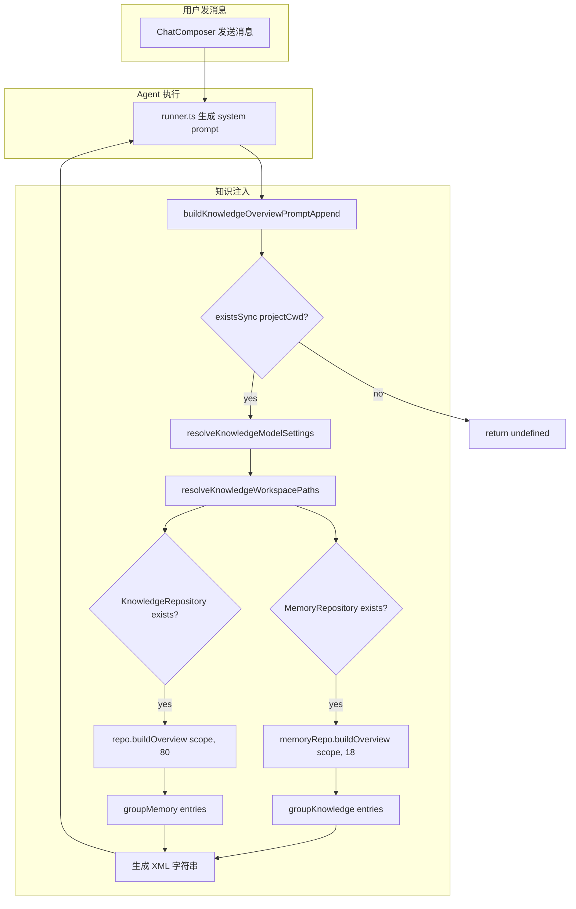
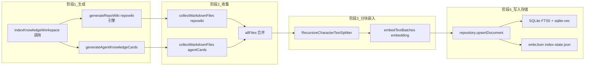
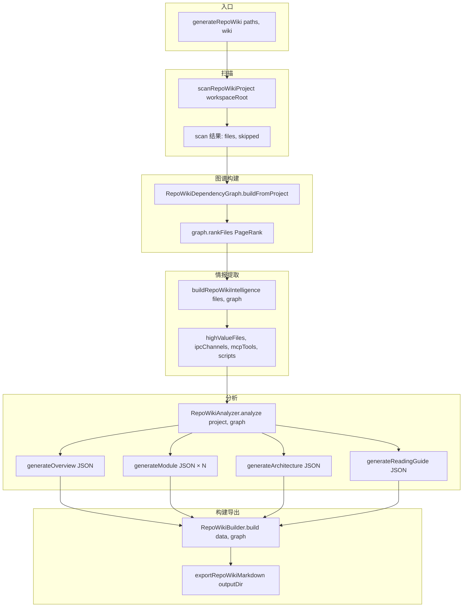

# 聊天上下文知识注入

<cite>

**本文引用的文件**

- [src/electron/libs/knowledge/knowledge-overview.ts](file://src/electron/libs/knowledge/knowledge-overview.ts#L1-L128)
- [src/electron/libs/knowledge/agent-cards.ts](file://src/electron/libs/knowledge/agent-cards.ts#L1-L424)
- [src/electron/libs/knowledge/embedding-client.ts](file://src/electron/libs/knowledge/embedding-client.ts#L1-L122)
- [src/electron/libs/knowledge/knowledge-indexer.ts](file://src/electron/libs/knowledge/knowledge-indexer.ts#L1-L353)
- [src/electron/libs/knowledge/knowledge-model-settings.ts](file://src/electron/libs/knowledge/knowledge-model-settings.ts#L1-L91)
- [src/electron/libs/knowledge/knowledge-paths.ts](file://src/electron/libs/knowledge/knowledge-paths.ts#L1-L88)
- [src/electron/libs/knowledge/knowledge-repository.ts](file://src/electron/libs/knowledge/knowledge-repository.ts#L1-L494)
- [src/electron/libs/knowledge/knowledge-types.ts](file://src/electron/libs/knowledge/knowledge-types.ts#L1-L125)
- [src/electron/libs/knowledge/knowledge-ui-store.ts](file://src/electron/libs/knowledge/knowledge-ui-store.ts#L1-L784)
- [src/electron/libs/knowledge/knowledge-utils.ts](file://src/electron/libs/knowledge/knowledge-utils.ts#L1-L256)
- [src/electron/libs/knowledge/repowiki/analyzer.ts](file://src/electron/libs/knowledge/repowiki/analyzer.ts#L1-L560)
- [src/electron/libs/knowledge/repowiki/builder.ts](file://src/electron/libs/knowledge/repowiki/builder.ts#L1-L489)
- [src/electron/libs/knowledge/repowiki/engine.ts](file://src/electron/libs/knowledge/repowiki/engine.ts#L1-L279)
- [src/electron/libs/knowledge/repowiki/exporter.ts](file://src/electron/libs/knowledge/repowiki/exporter.ts#L1-L44)
- [src/electron/libs/knowledge/repowiki/graph.ts](file://src/electron/libs/knowledge/repowiki/graph.ts#L1-L218)
- [src/electron/libs/knowledge/repowiki/intelligence.ts](file://src/electron/libs/knowledge/repowiki/intelligence.ts#L1-L370)
- [src/electron/libs/knowledge/repowiki/prompts.ts](file://src/electron/libs/knowledge/repowiki/prompts.ts#L1-L235)
- [src/electron/libs/knowledge/repowiki/scanner.ts](file://src/electron/libs/knowledge/repowiki/scanner.ts#L1-L609)

</cite>

---

## 目录

- [1. 功能概述](#1-功能概述)
- [2. 入口职责与核心函数](#2-入口职责与核心函数)
- [3. 调用链与数据流](#3-调用链与数据流)
- [4. 状态存储与配置边界](#4-状态存储与配置边界)
- [5. 修改步骤与回归验证](#5-修改步骤与回归验证)
- [6. 常见失败模式](#6-常见失败模式)
- [7. Agent 改代码地图](#7-agent-改代码地图)
- [8. 相关文档](#8-相关文档)

---

## 1. 功能概述

聊天上下文知识注入是 Tech-CC-Hub 的核心能力之一，它将知识库（Repo Wiki 和 Agent Cards）的内容以结构化 XML 格式注入到 Agent 的 system prompt 中，使 Agent 在回复时能感知当前项目的代码路由、入口文件和验证命令。

注入的数据来源有两个：

1. **KnowledgeRepository** (`knowledge-repository.ts`) — 索引的 Repo Wiki 文档和 Agent Cards，存储在 `knowledge.sqlite` 中
2. **MemoryRepository** (`memory-repository.ts`) — 用户积累的 Memory，存储在 `memory.sqlite` 中

知识注入发生在每次会话发消息时，由 `buildKnowledgeOverviewPromptAppend(projectCwd?)` 函数生成追加内容。

---

## 2. 入口职责与核心函数

### 2.1 主入口函数

```typescript
// src/electron/libs/knowledge/knowledge-overview.ts#L30
export function buildKnowledgeOverviewPromptAppend(projectCwd?: string): string | undefined
```

**职责**：根据项目路径，读取知识库状态，生成一段 XML 片段追加到 system prompt。

**返回值类型**：`string | undefined`，若项目目录不存在则返回 `undefined`。

**副作用**：打开并关闭 `KnowledgeRepository` 和 `MemoryRepository`，**不保留连接**。每次调用都会重新打开数据库。

[章节来源](file://src/electron/libs/knowledge/knowledge-overview.ts#L30-L33)

### 2.2 核心数据结构

```typescript
// src/electron/libs/knowledge/knowledge-types.ts#L76-L82
export type KnowledgeOverviewEntry = {
  category: KnowledgeSourceKind;   // "repowiki" | "agent_card" | "memory" | "manual" | "source"
  title: string;
  sourcePath: string;
  updatedAt: number;
};
```

`KnowledgeOverviewEntry` 是知识注入的基本单元。每个条目代表一篇可检索的文档。

[章节来源](file://src/electron/libs/knowledge/knowledge-types.ts#L76-L82)

### 2.3 路径解析

```typescript
// src/electron/libs/knowledge/knowledge-paths.ts#L36-L72
export function resolveKnowledgeWorkspacePaths(
  workspaceRoot: string,
  appDataPath: string
): KnowledgeWorkspacePaths
```

返回一组关键路径：

| 字段 | 用途 |
|------|------|
| `knowledgeDbPath` | `appData/knowledge/{workspaceHash}/knowledge.sqlite` |
| `memoryDbPath` | `appData/knowledge/{workspaceHash}/memory.sqlite` |
| `repowikiContentDir` | `{workspaceRoot}/.tech/repowiki/zh/content` |
| `agentCardsDir` | `{workspaceRoot}/.tech/repowiki/agent-cards` |

[章节来源](file://src/electron/libs/knowledge/knowledge-paths.ts#L36-L72)

### 2.4 注入输出的 XML 结构

```xml
<knowledge_overview enabled="true" scope="workspace:project-name" knowledge_count="N" memory_count="M">
  <agent_cards count="X">
    <card title="..." path="..." />
    ...
  </agent_cards>
  <repowiki>
    <category name="..." count="N">
      <entry title="..." path="..." />
      ...
    </category>
    ...
  </repowiki>
  <memory>
    <category name="..." count="N">
      <entry title="..." scope="..." tags="..." />
      ...
    </category>
    ...
  </memory>
</knowledge_overview>
```

[章节来源](file://src/electron/libs/knowledge/knowledge-overview.ts#L76-L118)

---

## 3. 调用链与数据流

### 3.1 完整调用链



[图表来源](file://src/electron/libs/knowledge/knowledge-overview.ts#L30-L119)

### 3.2 知识索引管道的完整流程

当用户触发 `mcp__tech-cc-hub-knowledge__knowledge_index` 时，知识索引管道按以下顺序执行：



[图表来源](file://src/electron/libs/knowledge/knowledge-indexer.ts#L170-L351)

### 3.3 Repo Wiki 生成流程



[图表来源](file://src/electron/libs/knowledge/repowiki/engine.ts#L215-L251)

---

## 4. 状态存储与配置边界

### 4.1 数据库 Schema

**KnowledgeRepository** 创建以下表：

| 表名 | 用途 | 关键字段 |
|------|------|----------|
| `knowledge_documents` | 文档元数据 | `id, workspace_scope, source_kind, source_path, title, content_hash` |
| `knowledge_chunks` | 分块数据 | `id, document_id, chunk_index, token_estimate, embedding_model` |
| `knowledge_index_runs` | 索引运行记录 | `id, workspace_scope, mode, status, report` |
| `knowledge_chunks_fts` | FTS5 全文索引 | `title, content, source_path, tags` (virtual) |
| `knowledge_chunk_vectors` | 向量索引 | `chunk_rowid, embedding float[N]` (virtual, sqlite-vec) |

[章节来源](file://src/electron/libs/knowledge/knowledge-repository.ts#L83-L137)

**KnowledgeUiStore** 创建以下表：

| 表名 | 用途 | 关键字段 |
|------|------|----------|
| `knowledge_ui_workspaces` | 工作区元数据 | `key, cwd, name, source, hidden` |
| `knowledge_ui_generation` | 生成进度 | `workspace_key, status, completed, total, phase, commit_id` |
| `knowledge_ui_documents` | UI 侧渲染文档 | `id, workspace_key, section, title, content, sort_order` |

[章节来源](file://src/electron/libs/knowledge/knowledge-ui-store.ts#L98-L139)

### 4.2 模型配置

```typescript
// src/electron/libs/knowledge/knowledge-model-settings.ts#L49-L83
export function resolveKnowledgeModelSettings(): KnowledgeModelSettings {
  const profiles = loadApiConfigSettings().profiles.filter(isUsableProfile);
  const embeddingProfile = profiles.find(p => p.embeddingModel?.trim());
  const wikiProfile = profiles.find(p => p.wikiModel?.trim());
  // ...
}
```

配置来自 `loadApiConfigSettings()`，通过模型设置界面的 `embeddingModel` 和 `wikiModel` 字段提供。

**关键约束**：

- `embeddingModel` 必须配置才能开启知识注入（`buildKnowledgeOverviewPromptAppend` 会返回 disabled XML）
- `wikiModel` 控制 Repo Wiki 生成的质量档位：`free` → 并发 2，`cheap` → 并发 6，`standard` → 并发 6

[章节来源](file://src/electron/libs/knowledge/knowledge-model-settings.ts#L49-L83)

### 4.3 运行时状态刷新边界

| 状态类型 | 刷新时机 | 刷新方式 |
|----------|----------|----------|
| KnowledgeRepository overview | 每次发消息时重新打开 | `repo.buildOverview()` 返回 `KnowledgeOverviewEntry[]` |
| Index 状态 | 每次 `knowledge_index` 触发时 | `writeJson(index-state.json)` 持久化 |
| UI 生成进度 | `KnowledgeUiStore.repairCompletedGenerations()` | 修复 stale generating 状态 (5分钟超时) |
| embedding 配置 | 应用启动时加载 | 运行时不支持热更新 |

---

## 5. 修改步骤与回归验证

### 5.1 修改知识注入输出格式

**场景**：修改 XML 标签结构或增加新字段。

**步骤**：

1. 修改 `buildKnowledgeOverviewPromptAppend` 中的输出逻辑（`knowledge-overview.ts#L76-L118`）
2. 检查 `groupKnowledge` 和 `groupMemory` 的数据结构是否兼容
3. 在 `AgentCardEntry` 和 `MemoryEntry` 取值处确认字段存在

**验证命令**：

```bash
# 触发一次知识索引
node -e "
import('./src/electron/libs/knowledge/knowledge-indexer.js').then(m =>
  m.indexKnowledgeWorkspace({
    workspaceRoot: process.cwd(),
    appDataPath: '/tmp/appdata',
    mode: 'scan'
  })
)
"

# 检查 index-state.json
cat .tech/reports/index-state.json

# 检查 overview 输出（需模拟发消息流程或直接调用函数）
node -e "
import('./src/electron/libs/knowledge/knowledge-overview.js').then(m =>
  console.log(m.buildKnowledgeOverviewPromptAppend(process.cwd()))
)
"
```

### 5.2 修改 Agent Card 生成逻辑

**场景**：添加新的 Card 类型或修改 Card 结构。

**步骤**：

1. 在 `agent-cards.ts` 的 `AgentKnowledgeCardKind` 中添加新类型（`agent-cards.ts#L15-L22`）
2. 在 `generateAgentKnowledgeCards` 中增加对应的构建函数（`agent-cards.ts#L50-L72`）
3. 修改 `renderAgentCardMarkdown` 以支持新字段渲染（`agent-cards.ts#L267-L310`）

**关键函数**：

- `buildRuntimeFlowCards` — 运行链路卡片
- `buildModuleCards` — 模块改造入口
- `buildMcpCards` — MCP 工具面
- `buildDatabaseCards` — SQLite/Vector 存储面

[章节来源](file://src/electron/libs/knowledge/agent-cards.ts#L50-L196)

**验证命令**：

```bash
# 查看生成的 Agent Cards
ls -la .tech/repowiki/agent-cards/
cat .tech/repowiki/agent-cards/_index.json | jq '.cards | length'
```

### 5.3 修改向量配置或 Embedding 模型

**场景**：切换 embedding 模型或调整维度。

**步骤**：

1. 修改 `knowledge-model-settings.ts` 中的 `KNOWN_EMBEDDING_DIMENSIONS`（`knowledge-model-settings.ts#L16-L22`）
2. 在模型设置中更新 `embeddingModel` 和 `embeddingDimension`
3. 删除旧的 `knowledge.sqlite` 重新索引：
   ```bash
   rm -rf ~/.config/TechCCHub/knowledge/
   ```

**注意**：sqlite-vec 的维度变更会导致旧表不可复用，`KnowledgeRepository.initializeVectorStore()` 会检测维度不匹配并删除旧表。

[章节来源](file://src/electron/libs/knowledge/knowledge-repository.ts#L141-L160)

---

## 6. 常见失败模式

### 6.1 Embedding 模型未配置

**表现**：`buildKnowledgeOverviewPromptAppend` 返回 `<knowledge_overview enabled="false" reason="missing_embedding_model">`。

**原因**：`settings.embedding` 为 undefined，导致函数在 L37-L42 处返回禁用提示。

**排查**：
```bash
# 检查模型设置
cat ~/.config/TechCCHub/settings.json | jq '.profiles[] | select(.embeddingModel)'
```

[章节来源](file://src/electron/libs/knowledge/knowledge-overview.ts#L37-L43)

### 6.2 sqlite-vec 扩展不可用

**表现**：`indexKnowledgeWorkspace` 返回 `vectorStoreReady: false`，错误码 `sqlite-vec-unavailable`。

**原因**：`loadSqliteVec()` 失败或向量表维度不匹配。

**排查**：
```bash
# 检查 Node.js 是否加载了 sqlite-vec
node -e "require('sqlite-vec')" 2>&1

# 检查现有的 knowledge.sqlite 向量表维度
sqlite3 ~/.config/TechCCHub/knowledge/*/knowledge.sqlite \
  "SELECT sql FROM sqlite_master WHERE name='knowledge_chunk_vectors'"
```

[章节来源](file://src/electron/libs/knowledge/knowledge-repository.ts#L141-L160)

### 6.3 Workspace 目录不存在

**表现**：`buildKnowledgeOverviewPromptAppend` 返回 `undefined`。

**原因**：传入的 `projectCwd` 不存在或 `app.getPath("userData")` 返回的路径异常。

**排查**：
```bash
ls -la "$projectCwd"
echo $XAUTHORITY  # Electron 在某些环境下需要 X11
```

[章节来源](file://src/electron/libs/knowledge/knowledge-overview.ts#L31-L33)

### 6.4 Repo Wiki 生成超时

**表现**：`knowledge_ui_generation` 表状态为 `generating` 但超过 5 分钟未更新。

**修复**：`KnowledgeUiStore.repairCompletedGenerations()` 会自动修复（5分钟超时），或手动重启应用。

[章节来源](file://src/electron/libs/knowledge/knowledge-ui-store.ts#L161-L186)

### 6.5 Chunk 数量与向量数量不一致

**表现**：`buildKnowledgeInputs` 在 `embeddings[vectorIndex++]` 时数组越界。

**原因**：分块后文本数与返回的向量数不匹配，通常是 embedding API 返回格式错误。

**排查**：检查 `embedding-client.ts` 的 `normalizeEmbeddingVector` 是否对维度做了校验。

[章节来源](file://src/electron/libs/knowledge/embedding-client.ts#L22-L34)

---

## 7. Agent 改代码地图

### 7.1 先读文件清单

| 优先级 | 文件 | 理由 |
|--------|------|------|
| P0 | `src/electron/libs/knowledge/knowledge-overview.ts` | 入口函数，修改后直接影响 prompt 注入 |
| P0 | `src/electron/libs/knowledge/knowledge-repository.ts` | 数据库 schema 和检索 API |
| P1 | `src/electron/libs/knowledge/knowledge-types.ts` | 类型定义，新增字段需同步修改 |
| P1 | `src/electron/libs/knowledge/knowledge-model-settings.ts` | 配置解析逻辑 |
| P2 | `src/electron/libs/knowledge/agent-cards.ts` | Card 生成逻辑 |
| P2 | `src/electron/libs/knowledge/repowiki/scanner.ts` | 文件扫描和信号提取 |
| P2 | `src/electron/libs/knowledge/repowiki/graph.ts` | 依赖图构建和排序 |

### 7.2 关键符号速查

| 符号 | 文件:行号 | 用途 |
|------|-----------|------|
| `buildKnowledgeOverviewPromptAppend` | `knowledge-overview.ts:30` | 入口函数 |
| `groupKnowledge` | `knowledge-overview.ts:10` | 按 category 分组 |
| `groupMemory` | `knowledge-overview.ts:20` | Memory 分组 |
| `KnowledgeRepository.buildOverview` | `knowledge-repository.ts:203` | 构建 overview 列表 |
| `resolveKnowledgeModelSettings` | `knowledge-model-settings.ts:49` | 解析 embedding/wiki 配置 |
| `indexKnowledgeWorkspace` | `knowledge-indexer.ts:170` | 索引管道入口 |
| `generateAgentKnowledgeCards` | `agent-cards.ts:50` | 生成 Agent Cards |
| `scanRepoWikiProject` | `repowiki/scanner.ts:250` | 扫描项目文件 |
| `RepoWikiDependencyGraph.buildFromProject` | `repowiki/graph.ts:38` | 构建依赖图 |
| `embedTextBatches` | `embedding-client.ts:98` | 批量生成 embedding |

### 7.3 IPC / MCP 工具

| 工具名 | 用途 | 通道 |
|--------|------|------|
| `mcp__tech-cc-hub-knowledge__knowledge_index` | 触发完整索引管道 | MCP |
| `knowledge_search` | 向量检索（若实现） | MCP |
| `knowledge_read` | 读取文档内容（若实现） | MCP |

### 7.4 数据库表

| 表 | 说明 |
|----|------|
| `knowledge_documents` | 文档主表，按 `workspace_scope + source_kind + source_path` 唯一 |
| `knowledge_chunks` | 分块表，`document_id` 外键级联删除 |
| `knowledge_chunks_fts` | FTS5 全文索引 |
| `knowledge_chunk_vectors` | sqlite-vec 向量索引 |
| `knowledge_ui_workspaces` | UI 工作区元数据 |
| `knowledge_ui_generation` | 生成进度状态 |

### 7.5 修改入口

**修改注入格式**：直接修改 `knowledge-overview.ts` L76-L118 的 XML 生成逻辑。

**修改索引行为**：修改 `knowledge-indexer.ts` 的 `indexKnowledgeWorkspace` 或 `buildKnowledgeInputs`。

**修改 Agent Card 结构**：在 `agent-cards.ts` 的 `AgentKnowledgeCardKind` 添加枚举，并在对应构建函数中处理。

### 7.6 验证命令

```bash
# 类型检查
npx tsc --noEmit src/electron/libs/knowledge/**/*.ts

# 单元测试（若有）
npm test -- --grep "knowledge"

# 端到端验证：触发索引并检查输出
npm run qa:knowledge

# 检查注入结果（需要运行 Electron）
# 在 DevTools 控制台执行
window.__electronInvoke('knowledge:get-overview', { projectCwd: process.cwd() })
```

### 7.7 常见回归风险

| 风险 | 影响 | 规避 |
|------|------|------|
| 修改 `KnowledgeOverviewEntry` 类型 | 序列化失败 | 保持字段向后兼容 |
| 修改 `KnowledgeRepository` schema | 已有数据不可读 | 保留字段或做数据迁移 |
| 修改 embedding 维度 | 旧向量不可用 | 重新索引前清理旧 DB |
| 修改 `resolveKnowledgeWorkspacePaths` | 路径不匹配导致找不到文件 | 测试多 workspace 场景 |
| 修改 RepoWikiAnalyzer 的 prompt | 生成的 Wiki 内容质量下降 | 对比新旧输出的文件覆盖度 |

---

## 8. 相关文档

- [MCP 工具规范](file://doc/20-contracts/ipc/spec.md) — MCP 工具定义和注册契约
- [上下文同步与合并规范](file://doc/20-specs/23-上下文同步与合并规范.md) — system prompt 构造规范
- [AgentOS 能力映射矩阵](file://doc/20-specs/29-AgentOS能力映射矩阵.md) — Agent 能力边界定义
- [知识库前端文档](file://src/ui/components/KnowledgePanel.tsx) — UI 侧工作区管理和生成进度展示