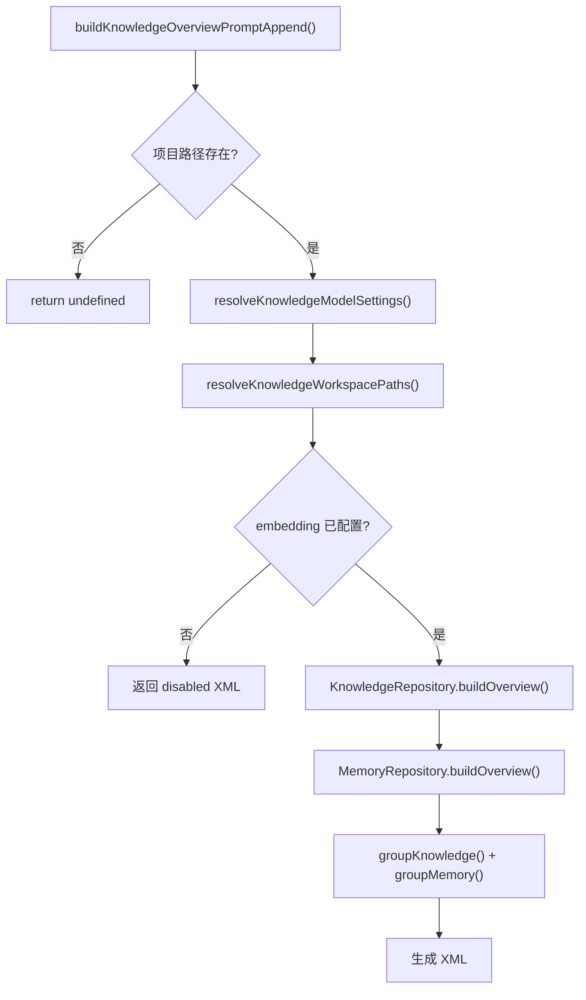
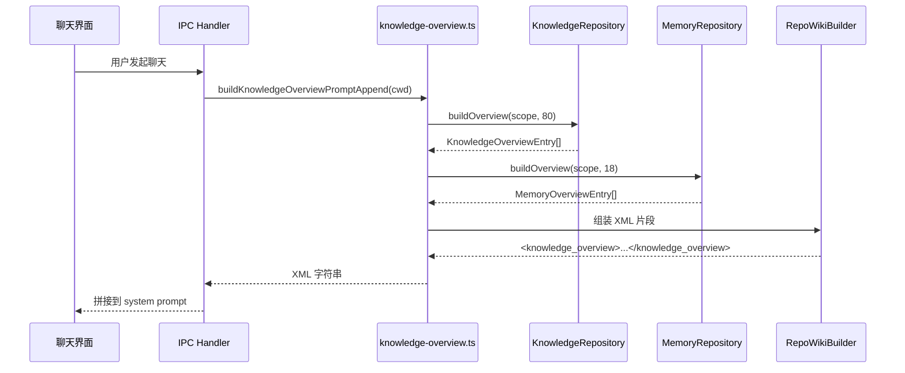
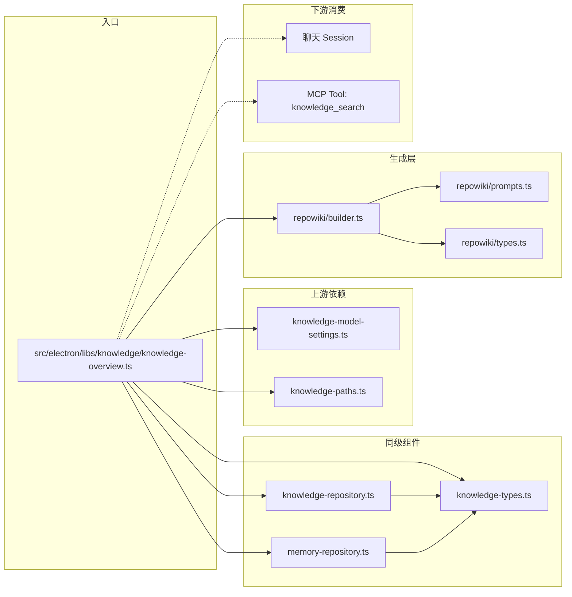
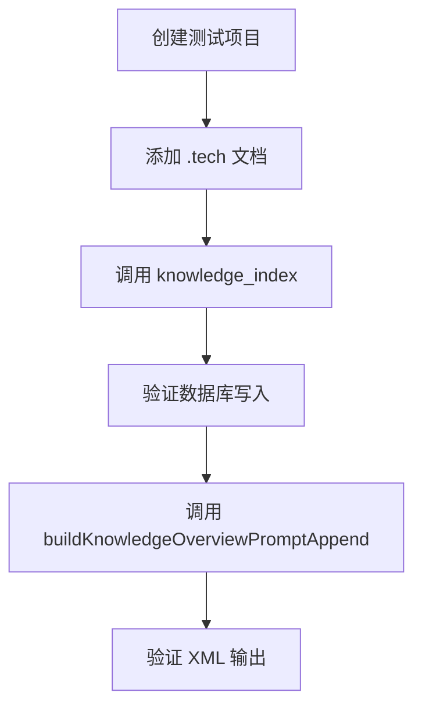

# 聊天上下文知识注入

<cite>

**本文引用的文件**

- [src/electron/libs/knowledge/knowledge-overview.ts](file://src/electron/libs/knowledge/knowledge-overview.ts)
- [src/electron/libs/knowledge/knowledge-repository.ts](file://src/electron/libs/knowledge/knowledge-repository.ts)
- [src/electron/libs/knowledge/knowledge-types.ts](file://src/electron/libs/knowledge/knowledge-types.ts)
- [src/electron/libs/knowledge/repowiki/builder.ts](file://src/electron/libs/knowledge/repowiki/builder.ts)
- [src/electron/libs/knowledge/repowiki/prompts.ts](file://src/electron/libs/knowledge/repowiki/prompts.ts)
- [src/electron/libs/knowledge/repowiki/types.ts](file://src/electron/libs/knowledge/repowiki/types.ts)
- [src/electron/libs/git/index.ts](file://src/electron/libs/git/index.ts)
- [src/electron/libs/skill-manager/index.ts](file://src/electron/libs/skill-manager/index.ts)
- [src/electron/libs/task/index.ts](file://src/electron/libs/task/index.ts)

</cite>

## 目录

- [1. 功能概述](#1-功能概述)
- [2. 核心入口与职责](#2-核心入口与职责)
- [3. 数据流与组件关系](#3-数据流与组件关系)
- [4. 关键数据结构](#4-关键数据结构)
- [5. 配置与依赖](#5-配置与依赖)
- [6. 修改功能时的步骤](#6-修改功能时的步骤)
- [7. 回归验证方式](#7-回归验证方式)
- [8. 常见失败模式](#8-常见失败模式)
- [9. 扩展点](#9-扩展点)

---

## 1. 功能概述

聊天上下文知识注入是 tech-cc-hub 将结构化知识注入大模型（LLM）上下文的机制。它在每次聊天发起前读取本地知识库和记忆系统，生成一个 XML 格式的知识概览片段，拼接到系统提示词中，使模型能感知项目状态、历史记忆和可用工具。

核心功能包括：

| 功能 | 描述 | 章节来源 |
|------|------|----------|
| 知识概览构建 | 从 SQLite 知识库读取文档，按优先级排序后生成 XML 片段 | [L30-L118](file://src/electron/libs/knowledge/knowledge-overview.ts#L30-L118) |
| 记忆系统集成 | 合并 Agent Cards、Repo Wiki、Memory 三个来源的知识 | [L45-L66](file://src/electron/libs/knowledge/knowledge-overview.ts#L45-L66) |
| 优先级排序 | Agent Cards > 核心文档 > 模块文档 > 其他 | [L26-L58](file://src/electron/libs/knowledge/knowledge-repository.ts#L26-L58) |

---

## 2. 核心入口与职责

### 2.1 主入口函数

**`buildKnowledgeOverviewPromptAppend(projectCwd?: string): string | undefined`**

位于 `knowledge-overview.ts` 第 30 行，是聊天上下文知识注入的单一入口。

**职责链：**



**关键参数：**

| 参数 | 类型 | 必填 | 说明 |
|------|------|------|------|
| `projectCwd` | `string` | 否 | 项目根目录路径。空时直接返回 `undefined` |

**返回值：**

- 返回 `undefined` → 不注入知识概览
- 返回 XML 字符串 → 拼接到系统提示词

章节来源：[L30-L33](file://src/electron/libs/knowledge/knowledge-overview.ts#L30-L33)

### 2.2 核心组件

| 组件 | 文件 | 职责 |
|------|------|------|
| `KnowledgeRepository` | `knowledge-repository.ts` | 管理知识文档的 CRUD、搜索、概览构建 |
| `MemoryRepository` | `memory-repository.ts` | 管理 Agent 记忆（从 skill-manager 集成） |
| `RepoWikiBuilder` | `repowiki/builder.ts` | 生成 AI 友好的项目 Wiki 页面 |
| `overviewPriority()` | `knowledge-repository.ts` | 计算文档优先级分数 |

---

## 3. 数据流与组件关系

### 3.1 调用链路



### 3.2 上下游文件关系



**下游消费方：**
- MCP Tool `knowledge_index` → 写入知识库
- MCP Tool `knowledge_search` → 读取知识库
- 聊天 Session → 将 XML 片段注入 system prompt

章节来源：[L45-L66](file://src/electron/libs/knowledge/knowledge-overview.ts#L45-L66)

---

## 4. 关键数据结构

### 4.1 KnowledgeOverviewEntry

```typescript
// 来源: knowledge-types.ts L77-L82
type KnowledgeOverviewEntry = {
  category: KnowledgeSourceKind;  // "repowiki" | "agent_card" | "memory" | "manual" | "source"
  title: string;
  sourcePath: string;
  updatedAt: number;
};
```

### 4.2 KnowledgeDocument

```typescript
// 来源: knowledge-types.ts L9-L21
type KnowledgeDocument = {
  id: string;
  workspaceScope: string;
  sourceKind: KnowledgeSourceKind;
  sourcePath: string;
  title: string;
  summary?: string;
  tags: string[];
  metadata: Record<string, unknown>;
  contentHash: string;
  createdAt: number;
  updatedAt: number;
};
```

### 4.3 输出 XML 格式

```xml
<!-- 来源: knowledge-overview.ts L76-L118 -->
<knowledge_overview enabled="true" scope="${workspaceScope}" knowledge_count="${n}" memory_count="${m}">
  <agent_cards count="${n}">
    <card title="${title}" path="${sourcePath}" />
    <!-- 最多 18 条 -->
  </agent_cards>
  <repowiki>
    <category name="${category}" count="${n}">
      <entry title="${title}" path="${sourcePath}" />
      <!-- 每个分类最多 24 条 -->
    </category>
  </repowiki>
  <memory>
    <category name="${category}" count="${n}">
      <entry title="${title}" scope="${scope}" tags="${tags}" />
      <!-- 每个分类最多 18 条 -->
    </category>
  </memory>
</knowledge_overview>
```

### 4.4 优先级计算

`overviewPriority()` 函数决定文档在概览中的排序：

```typescript
// 来源: knowledge-repository.ts L26-L58
function overviewPriority(sourcePath: string, title: string): number {
  // Agent Cards 最高优先级
  if (/agent-cards/.test(path) || /agent card/.test(title)) return 12_000;

  // 核心文档
  const curated = [
    [/content\/index\.md$/, 10_000],
    [/content\/agent-playbook\.md$/, 9_800],
    [/content\/api-surface\.md$/, 9_700],
    // ...更多模式
  ];

  // 模块文档次之
  if (/\/modules\/[^/]+\/index\.md$/) return 7_500;
}
```

章节来源：[L26-L58](file://src/electron/libs/knowledge/knowledge-repository.ts#L26-L58)

---

## 5. 配置与依赖

### 5.1 必需配置

**Embedding 模型配置**（`knowledge-model-settings.ts`）：

```typescript
// 来源: knowledge-types.ts L100-L108
type EmbeddingModelSettings = {
  profileId: string;
  profileName: string;
  apiKey: string;
  baseURL: string;
  model: string;
  dimension: number;      // 必需，传入 RepositoryOptions
  batchSize: number;
};
```

**KnowledgeModelSettings 结构：**

```typescript
// 来源: knowledge-types.ts L121-L124
type KnowledgeModelSettings = {
  embedding?: EmbeddingModelSettings;  // 向量检索必需
  wiki?: WikiModelSettings;           // Wiki 生成必需
};
```

### 5.2 路径解析

`resolveKnowledgeWorkspacePaths(projectCwd, userData)` 返回：

| 路径字段 | 说明 |
|----------|------|
| `knowledgeDbPath` | `userData/knowledge/<scope>.db` |
| `memoryDbPath` | `userData/memory/<scope>.db` |
| `workspaceScope` | 相对于项目根目录的路径 |

章节来源：[L36](file://src/electron/libs/knowledge/knowledge-overview.ts#L36)

### 5.3 数据库 Schema

**knowledge_documents 表：**

| 列 | 类型 | 约束 |
|----|------|------|
| `id` | TEXT | PRIMARY KEY |
| `workspace_scope` | TEXT | NOT NULL |
| `source_kind` | TEXT | NOT NULL |
| `source_path` | TEXT | NOT NULL |
| `title` | TEXT | NOT NULL |

章节来源：[L83-L97](file://src/electron/libs/knowledge/knowledge-repository.ts#L83-L97)

---

## 6. 修改功能时的步骤

### 6.1 修改优先级排序

1. 编辑 `knowledge-repository.ts` 的 `overviewPriority()` 函数
2. 添加新的正则模式或调整分数
3. 测试不同的 `sourcePath` 和 `title` 组合

```typescript
// 示例：添加新的优先级规则
const curated: Array<[RegExp, number]> = [
  // ... 现有规则
  [/\/modules\/my-module\/index\.md$/, 9_000],  // 新规则
];
```

章节来源：[L32-L47](file://src/electron/libs/knowledge/knowledge-repository.ts#L32-L47)

### 6.2 修改 XML 输出格式

1. 编辑 `knowledge-overview.ts` 的输出生成逻辑（L76-L118）
2. 添加新的 XML 字段或结构调整
3. 确保 `escapeXml()` 函数能正确转义

```typescript
// 示例：添加新字段
if (newFieldEntries.length > 0) {
  lines.push(`  <new_field count="${newFieldEntries.length}">`);
  for (const entry of newFieldEntries.slice(0, 18)) {
    lines.push(`    <item value="${escapeXml(entry.value)}" />`);
  }
  lines.push("  </new_field>");
}
```

章节来源：[L76-L118](file://src/electron/libs/knowledge/knowledge-overview.ts#L76-L118)

### 6.3 添加新的知识来源

1. 在 `knowledge-types.ts` 添加新的 `KnowledgeSourceKind`
2. 在 `knowledge-repository.ts` 实现对应的存储逻辑
3. 在 `knowledge-overview.ts` 添加分支处理

---

## 7. 回归验证方式

### 7.1 单元测试覆盖

| 测试场景 | 验证点 |
|----------|--------|
| 项目路径不存在 | 返回 `undefined` |
| embedding 未配置 | 返回 `enabled="false"` XML |
| 知识库为空 | 返回 `indexed="false"` XML |
| 有知识数据 | 返回完整 XML 且 `enabled="true"` |
| Agent Cards 排序 | Agent Cards 在 `agent_cards` 节点内且最多 18 条 |
| Repo Wiki 分组 | 按 `category` 分组，每个分类最多 24 条 |
| XML 转义 | 含 `&`, `<`, `>`, `"` 的 title 正确转义 |

### 7.2 手动验证步骤

1. **检查 embedding 配置**：
   ```bash
   # 查看当前 embedding 配置
   cat ~/.config/tech-cc-hub/settings.json | jq '.knowledge.embedding'
   ```

2. **模拟知识注入调用**：
   ```typescript
   // 在 dev console 中执行
   const result = await window.invocations.knowledgeOverview("/path/to/project");
   console.log(result);
   ```

3. **验证输出格式**：
   - 检查 XML 是否符合 schema
   - 确认各节点数量不超过限制
   - 验证转义字符正确

### 7.3 集成测试



---

## 8. 常见失败模式

### 8.1 知识注入返回 undefined

**症状**：`buildKnowledgeOverviewPromptAppend()` 返回 `undefined`，聊天无知识上下文。

**排查步骤：**

1. 检查项目路径是否存在：`existsSync(projectCwd)` → [L31](file://src/electron/libs/knowledge/knowledge-overview.ts#L31)
2. 检查 embedding 配置：`settings.embedding` → [L37](file://src/electron/libs/knowledge/knowledge-overview.ts#L37)
3. 检查数据库文件：`existsSync(paths.knowledgeDbPath)` → [L47](file://src/electron/libs/knowledge/knowledge-overview.ts#L47)

**常见原因：**
- 项目路径为空或不存在
- 用户未配置 embedding 模型
- 知识库文件权限不足

### 8.2 向量检索失败

**症状**：向量搜索返回空结果，但 FTS5 搜索正常。

**排查步骤：**

1. 检查 `sqlite-vec` 是否加载成功：查看日志 `[knowledge] sqlite-vec unavailable:` → [L156-L159](file://src/electron/libs/knowledge/knowledge-repository.ts#L156-L159)
2. 检查 vector 表 schema：`expectedDimensionSql` 与实际是否匹配 → [L147-L149](file://src/electron/libs/knowledge/knowledge-repository.ts#L147-L149)
3. 检查 embedding 维度：传入的 `embeddingDimension` 是否与配置一致

**常见原因：**
- sqlite-vec 扩展未正确加载
- embedding 模型维度变更后未重建向量表
- 向量维度不匹配导致插入失败

### 8.3 XML 输出格式错误

**症状**：聊天时模型收到格式异常的 XML。

**排查步骤：**

1. 检查 `escapeXml()` 函数是否处理了所有特殊字符 → [L121-L127](file://src/electron/libs/knowledge/knowledge-overview.ts#L121-L127)
2. 检查字符串拼接是否正确闭合标签
3. 验证 `groupKnowledge()` 和 `groupMemory()` 不会返回 undefined 键

**常见原因：**
- title 包含 `&`, `"`, `<`, `>` 未转义
- 标签未正确嵌套（`<category>` 缺少 `</category>`）
- `slice()` 超出数组边界

### 8.4 优先级排序不符合预期

**症状**：某个文档应该排在前面但实际没有。

**排查步骤：**

1. 检查 `overviewPriority()` 的模式匹配 → [L26-L58](file://src/electron/libs/knowledge/knowledge-repository.ts#L26-L58)
2. 确认文件名转换：`normalized.replace(/\\/, "/")` 处理 Windows 路径
3. 检查 `slice(0, maxItems)` 截断位置 → [L84](file://src/electron/libs/knowledge/knowledge-overview.ts#L84)

---

## 9. 扩展点

### 9.1 添加新的知识来源类型

1. 在 `knowledge-types.ts` 添加新的 `KnowledgeSourceKind`：
   ```typescript
   export type KnowledgeSourceKind = "repowiki" | "agent_card" | "memory" | "manual" | "source" | "new_type";
   ```

2. 在 `KnowledgeRepository` 实现 `upsertDocument()` 和 `buildOverview()` 支持新类型

3. 在 `buildKnowledgeOverviewPromptAppend()` 添加新类型的输出逻辑

章节来源：[L45-L66](file://src/electron/libs/knowledge/knowledge-overview.ts#L45-L66)

### 9.2 扩展 Wiki 生成

`RepoWikiBuilder` 支持生成以下 Wiki 页面：

| 页面 | Builder 函数 | 来源 |
|------|--------------|------|
| 项目概览 | `buildOverviewPage()` | [L88-L195](file://src/electron/libs/knowledge/repowiki/builder.ts#L88-L195) |
| 架构图 | `buildArchitecturePage()` | [L197-L250](file://src/electron/libs/knowledge/repowiki/builder.ts#L197-L250) |
| 模块页 | `buildModulePage()` | [L252-L332](file://src/electron/libs/knowledge/repowiki/builder.ts#L252-L332) |
| 阅读指南 | `buildReadingGuidePage()` | [L334-L365](file://src/electron/libs/knowledge/repowiki/builder.ts#L334-L365) |
| Agent 作业手册 | `buildAgentPlaybookPage()` | [L367-L405](file://src/electron/libs/knowledge/repowiki/builder.ts#L367-L405) |
| 依赖关系图 | `buildDependencyPage()` | [L448-L465](file://src/electron/libs/knowledge/repowiki/builder.ts#L448-L465) |

### 9.3 自定义提示词模板

`repowiki/prompts.ts` 提供了 LLM 生成 Wiki 内容的提示词模板：

| 模板函数 | 用途 |
|----------|------|
| `buildOverviewPrompt()` | 生成项目概览 JSON |
| `buildModulePrompt()` | 生成模块文档 JSON |
| `buildArchitecturePrompt()` | 生成架构图 Mermaid |
| `buildReadingGuidePrompt()` | 生成阅读指南 |

章节来源：[L6-L53](file://src/electron/libs/knowledge/repowiki/prompts.ts#L6-L53)

### 9.4 与其他模块集成

| 集成点 | 文件 | 说明 |
|--------|------|------|
| Git 工作台 | `git/index.ts` | 提供仓库信息 |
| Skill 管理器 | `skill-manager/index.ts` | 管理 Agent Cards |
| 任务系统 | `task/index.ts` | 提供任务上下文 |

---

## 附录：快速参考

**入口函数：**
```typescript
buildKnowledgeOverviewPromptAppend(projectCwd?: string): string | undefined
```

**关键配置：**
```typescript
KnowledgeModelSettings = {
  embedding?: {
    dimension: number;  // 必需，用于向量表初始化
  };
  wiki?: WikiModelSettings;
};
```

**输出限制：**
- Agent Cards：最多 18 条
- 每个 Repo Wiki 分类：最多 24 条
- 每个 Memory 分类：最多 18 条