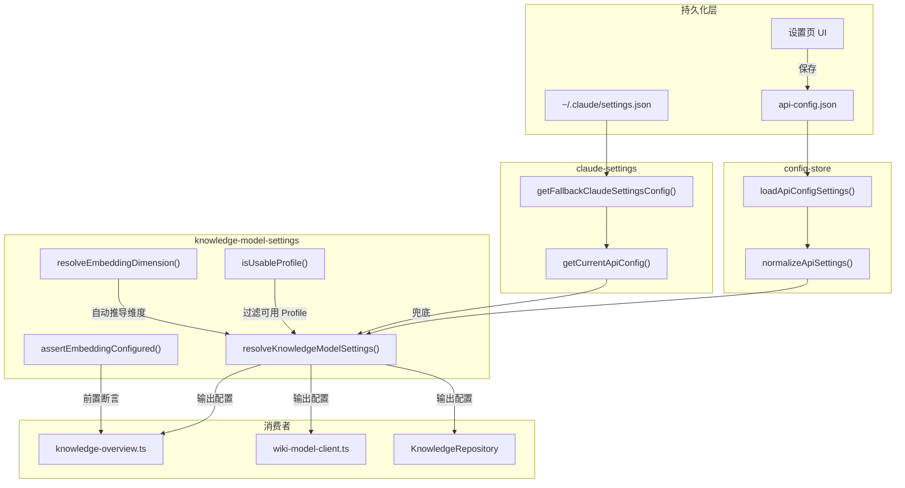

# 设置页与配置读写

<cite>
**本文引用的文件**

- [src/electron/libs/knowledge/knowledge-model-settings.ts](file://src/electron/libs/knowledge/knowledge-model-settings.ts)
- [src/electron/libs/knowledge/knowledge-types.ts](file://src/electron/libs/knowledge/knowledge-types.ts)
- [src/electron/libs/knowledge/knowledge-overview.ts](file://src/electron/libs/knowledge/knowledge-overview.ts)
- [src/electron/libs/knowledge/wiki-model-client.ts](file://src/electron/libs/knowledge/wiki-model-client.ts)
- [src/electron/libs/git/index.ts](file://src/electron/libs/git/index.ts)
- [src/electron/libs/skill-manager/index.ts](file://src/electron/libs/skill-manager/index.ts)
- [src/electron/libs/task/index.ts](file://src/electron/libs/task/index.ts)
- [src/electron/libs/claude-settings.ts](file://src/electron/libs/claude-settings.ts)
- [src/electron/libs/config-store.ts](file://src/electron/libs/config-store.ts)
</cite>

---

## 目录

- [职责概述](#职责概述)
- [核心数据结构](#核心数据结构)
- [入口函数与调用链](#入口函数与调用链)
- [配置读写流程](#配置读写流程)
- [配置验证规则](#配置验证规则)
- [上下游依赖关系](#上下游依赖关系)
- [修改功能步骤](#修改功能步骤)
- [回归验证方式](#回归验证方式)
- [常见失败模式与排障](#常见失败模式与排障)

---

## 职责概述

本模块负责 **设置页数据的读取、规范化与分发**。具体职责：

1. **持久化层**：从 `config-store.ts` 读取 `api-config.json`，经规范化后生成 `KnowledgeModelSettings`
2. **配置分发**：将设置页配置（embedding / wiki 双模型）注入知识引擎各组件
3. **兜底机制**：当 UI 配置缺失时，回退读取用户级 Claude 配置文件
4. **前置断言**：在知识引擎启动前断言 embedding 模型已正确配置

> 章节来源：[file://src/electron/libs/knowledge/knowledge-model-settings.ts#L48-L83](file://src/electron/libs/knowledge/knowledge-model-settings.ts#L48-L83)

---

## 核心数据结构

### 1. `KnowledgeModelSettings`

```typescript
type KnowledgeModelSettings = {
  embedding?: EmbeddingModelSettings;
  wiki?: WikiModelSettings;
};
```

### 2. `EmbeddingModelSettings`

| 字段 | 类型 | 说明 |
|------|------|------|
| `profileId` | `string` | 配置 Profile 唯一标识 |
| `profileName` | `string` | 配置 Profile 名称 |
| `apiKey` | `string` | API 密钥（已 trim） |
| `baseURL` | `string` | API 端点（已去除尾部斜杠） |
| `model` | `string` | 向量模型名称 |
| `dimension` | `number` | 向量维度（自动推导或显式指定） |
| `batchSize` | `number` | 批处理大小，上限 128 |

> 章节来源：[file://src/electron/libs/knowledge/knowledge-types.ts#L100-L108](file://src/electron/libs/knowledge/knowledge-types.ts#L100-L108)

### 3. `WikiModelSettings`

| 字段 | 类型 | 说明 |
|------|------|------|
| `profileId` | `string` | 配置 Profile 唯一标识 |
| `profileName` | `string` | 配置 Profile 名称 |
| `apiKey` | `string` | API 密钥 |
| `baseURL` | `string` | API 端点 |
| `model` | `string` | Wiki 生成模型名称 |
| `costTier` | `"free" \| "cheap" \| "standard"` | 成本层级 |
| `maxInputTokens` | `number` | 最大输入 token |
| `maxOutputTokens` | `number` | 最大输出 token |

> 章节来源：[file://src/electron/libs/knowledge/knowledge-types.ts#L110-L119](file://src/electron/libs/knowledge/knowledge-types.ts#L110-L119)

---

## 入口函数与调用链

### 主入口：`resolveKnowledgeModelSettings()`

```typescript
export function resolveKnowledgeModelSettings(): KnowledgeModelSettings {
  const profiles = loadApiConfigSettings().profiles.filter(isUsableProfile);
  const embeddingProfile = profiles.find((profile) => profile.embeddingModel?.trim());
  const wikiProfile = profiles.find((profile) => profile.wikiModel?.trim());
  // ... 构建 embedding 和 wiki 配置对象
  return { embedding, wiki };
}
```

### 断言入口：`assertEmbeddingConfigured()`

```typescript
export function assertEmbeddingConfigured(settings = resolveKnowledgeModelSettings()): EmbeddingModelSettings {
  if (!settings.embedding) {
    throw new Error("Knowledge Engine 未启用：请先在模型设置里配置向量模型 embeddingModel。");
  }
  return settings.embedding;
}
```

> 图表来源：[file://src/electron/libs/knowledge/knowledge-model-settings.ts#L49-L89](file://src/electron/libs/knowledge/knowledge-model-settings.ts#L49-L89)

### 调用链路图



---

## 配置读写流程

### 1. 读取流程（Read）

```
config-store.ts
  └── loadApiConfigSettings()
        ├── 读取 ${userData}/api-config.json
        ├── JSON.parse(raw)
        └── normalizeApiSettings(parsed)
              └── 对每个 profile 调用 normalizeApiConfig()
                    ├── normalizeProvider()  // 从 URL 推断 provider
                    ├── normalizeBaseURL()   // 规范化 URL
                    ├── normalizeModelConfig() // 去重 models[]
                    └── normalizeOptionalModel() // embeddingModel / wikiModel
                          └── 仅当值在 dedupedModels 列表中才保留
```

> 章节来源：[file://src/electron/libs/config-store.ts#L100-L113](file://src/electron/libs/config-store.ts#L100-L113)

### 2. 分发流程（Resolve）

```
knowledge-model-settings.ts
  └── resolveKnowledgeModelSettings()
        ├── loadApiConfigSettings() 获取规范化后的 profiles
        ├── filter(isUsableProfile)  // 移除 disabled / 无 apiKey / 无 baseURL 的 profile
        ├── find(profile.embeddingModel?.trim())  // 找到 embedding 配置
        ├── find(profile.wikiModel?.trim())        // 找到 wiki 配置
        ├── resolveEmbeddingDimension()  // 自动映射或使用 configured
        └── normalizeCostTier()          // 标准化 costTier
```

> 章节来源：[file://src/electron/libs/knowledge/knowledge-model-settings.ts#L49-L83](file://src/electron/libs/knowledge/knowledge-model-settings.ts#L49-L83)

### 3. 保存流程（Write）

```
设置页 UI
  └── saveApiConfigSettings(settings: ApiConfigSettings)
        ├── normalizeApiSettings(settings)  // 再次规范化
        ├── writeFileSync(configPath, JSON.stringify(...))
        └── console.info("[config-store] API config saved successfully")
```

> 章节来源：[file://src/electron/libs/config-store.ts#L115-L134](file://src/electron/libs/config-store.ts#L115-L134)

---

## 配置验证规则

### `isUsableProfile` 验证

Profile 必须同时满足以下条件才被视为"可用"：

```typescript
function isUsableProfile(profile: ApiConfig): boolean {
  return Boolean(
    profile.enabled &&
    profile.apiKey.trim() &&
    profile.baseURL.trim()
  );
}
```

即：**启用状态=ON** 且 **apiKey 非空** 且 **baseURL 非空**。

> 章节来源：[file://src/electron/libs/knowledge/knowledge-model-settings.ts#L38-L40](file://src/electron/libs/knowledge/knowledge-model-settings.ts#L38-L40)

### 向量维度自动推导

已知模型与维度映射表：

| 模型名称（正则匹配） | 维度 |
|---------------------|------|
| `qwen3-embedding-0.6b` | 1024 |
| `qwen3-embedding-4b` | 2560 |
| `qwen3-embedding-8b` | 4096 |
| `text-embedding-3-small` | 1536 |
| `text-embedding-3-large` | 3072 |
| **其他** | `embeddingDimension` 配置值（默认 1536） |

> 章节来源：[file://src/electron/libs/knowledge/knowledge-model-settings.ts#L16-L21](file://src/electron/libs/knowledge/knowledge-model-settings.ts#L16-L21)

### `costTier` 标准化

仅接受 `"free"`、`"cheap"`、`"standard"` 三个枚举值，其他值默认回退为 `"cheap"`。

> 章节来源：[file://src/electron/libs/knowledge/knowledge-model-settings.ts#L42-L47](file://src/electron/libs/knowledge/knowledge-model-settings.ts#L42-L47)

### `normalizePositiveInteger` 验证

```typescript
function normalizePositiveInteger(value: number | undefined, fallback: number): number {
  if (typeof value !== "number" || !Number.isFinite(value)) {
    return fallback;  // 非数字 → 回退
  }
  const normalized = Math.floor(value);
  return normalized > 0 ? normalized : fallback;  // ≤0 → 回退
}
```

> 章节来源：[file://src/electron/libs/knowledge/knowledge-model-settings.ts#L24-L30](file://src/electron/libs/knowledge/knowledge-model-settings.ts#L24-L30)

---

## 上下游依赖关系

### 上游依赖

| 上游模块 | 提供的功能 |
|---------|-----------|
| `config-store.ts` | 持久化读写、`normalizeApiConfig()`、`normalizeApiSettings()` |
| `claude-settings.ts` | `getCurrentApiConfig()` 兜底逻辑、模型名称汇总 |

### 下游消费者

| 下游模块 | 消费方式 |
|---------|--------|
| `knowledge-overview.ts` | `resolveKnowledgeModelSettings()` 检查 embedding 是否配置 |
| `wiki-model-client.ts` | 接收 `WikiModelSettings` 调用 LLM API |
| `KnowledgeRepository` | 接收 `dimension` 初始化向量存储 |

> 图表来源：以下行展示了从 `knowledge-overview.ts` 调用的完整链路
> [file://src/electron/libs/knowledge/knowledge-overview.ts#L35-L50](file://src/electron/libs/knowledge/knowledge-overview.ts#L35-L50)

---

## 修改功能步骤

### 场景 1：新增一个模型配置项（如新增 `rerankModel`）

1. **修改 `knowledge-types.ts`**
   - 新增 `RerankModelSettings` 类型定义
   - 在 `KnowledgeModelSettings` 中添加可选字段

2. **修改 `config-store.ts`**
   - 在 `ApiConfig` 类型中添加 `rerankModel?: string`
   - 在 `normalizeApiConfig()` 中添加 `rerankModel: ...` 字段

3. **修改 `knowledge-model-settings.ts`**
   - 新增 `resolveRerankSettings()` 函数
   - 在 `resolveKnowledgeModelSettings()` 中调用并组装返回

4. **修改消费者**
   - 在对应消费者模块导入并使用新配置

### 场景 2：修改向量维度默认值

**仅需修改 `knowledge-model-settings.ts` 中的常量**：

```typescript
const DEFAULT_EMBEDDING_DIMENSION = 2048;  // 从 1536 改为 2048
```

> 章节来源：[file://src/electron/libs/knowledge/knowledge-model-settings.ts#L11](file://src/electron/libs/knowledge/knowledge-model-settings.ts#L11)

### 场景 3：调整 embedding 批处理上限

**修改 `knowledge-model-settings.ts` 第 62-65 行**：

```typescript
batchSize: Math.min(
  256,  // 从 128 改为 256
  normalizePositiveInteger(embeddingProfile.embeddingBatchSize, DEFAULT_EMBEDDING_BATCH_SIZE),
),
```

> 章节来源：[file://src/electron/libs/knowledge/knowledge-model-settings.ts#L62-L65](file://src/electron/libs/knowledge/knowledge-model-settings.ts#L62-L65)

---

## 回归验证方式

### 单元测试验证点

| 测试编号 | 验证内容 | 预期结果 |
|---------|---------|---------|
| T-01 | `resolveKnowledgeModelSettings()` 空配置 | 返回 `{ embedding: undefined, wiki: undefined }` |
| T-02 | 有效 embeddingModel 但无 apiKey | embedding 为 undefined |
| T-03 | embeddingModel 配置为 `qwen3-embedding-4b` | dimension 自动推导为 2560 |
| T-04 | embeddingDimension 显式配置为 512 | 返回 dimension = 512 |
| T-05 | batchSize 配置为 200 | 返回 batchSize = 128（上限截断） |
| T-06 | costTier 配置为 `"unknown"` | 标准化为 `"cheap"` |
| T-07 | `assertEmbeddingConfigured()` embedding 未配置 | 抛出 Error |
| T-08 | `assertEmbeddingConfigured()` embedding 已配置 | 返回 EmbeddingModelSettings |

### 集成验证流程

1. **启动验证**：打开设置页，确认知识引擎状态指示正确
2. **配置切换**：
   - 切换到无 embeddingModel 的 Profile → 知识引擎应禁用
   - 切换到有 embeddingModel 的 Profile → 知识引擎应启用
3. **持久化验证**：
   - 修改配置后重启应用 → 配置应保留
   - 手动删除 `api-config.json` → 重启后使用默认值

---

## 常见失败模式与排障

### 失败模式 1：embedding 模型维度不匹配

**症状**：向量检索结果全为 0 或检索失败

**原因**：配置的 `embeddingDimension` 与模型实际输出维度不一致

**排障步骤**：

```bash
# 1. 检查当前配置的维度
grep -A5 '"embeddingModel"' ~/Library/Application\ Support/tech-cc-hub/api-config.json

# 2. 对照已知模型维度表（见上方"向量维度自动推导"节）

# 3. 如使用自定义模型，添加维度配置
# 在 api-config.json 中添加 "embeddingDimension": 2048
```

### 失败模式 2：Wiki 模型配置但 costTier 错误

**症状**：Wiki 生成提示 "costTier 非法" 或使用错误的定价层

**原因**：`costTier` 未标准化，或在 `normalizeWikiModelCostTier` 之前使用了原始值

**排障步骤**：

```bash
# 检查 wikiModelCostTier 配置
grep '"wikiModelCostTier"' ~/Library/Application\ Support/tech-cc-hub/api-config.json

# 有效值：free | cheap | standard
# 任何其他值会自动修正为 "cheap"
```

> 章节来源：[file://src/electron/libs/config-store.ts#L406-L410](file://src/electron/libs/config-store.ts#L406-L410)

### 失败模式 3：Profile 被 `isUsableProfile` 过滤

**症状**：配置了 embeddingModel 但知识引擎仍显示未启用

**排查条件**：使用 F12 DevTools 在 `resolveKnowledgeModelSettings()` 入口加断点，确认：

1. `profile.enabled === true`
2. `profile.apiKey.trim()` 非空
3. `profile.baseURL.trim()` 非空

> 章节来源：[file://src/electron/libs/knowledge/knowledge-model-settings.ts#L38-L40](file://src/electron/libs/knowledge/knowledge-model-settings.ts#L38-L40)

### 失败模式 4：模型名称不在 dedupedModels 列表中

**症状**：`embeddingModel` / `wikiModel` 配置后被静默忽略

**原因**：在 `normalizeOptionalModel()` 中校验时，模型名称必须同时存在于主配置和 `models[]` 数组

**排障步骤**：

```bash
# 检查 models 数组是否包含 embeddingModel
grep -A10 '"models"' ~/Library/Application\ Support/tech-cc-hub/api-config.json
```

> 章节来源：[file://src/electron/libs/config-store.ts#L397-L403](file://src/electron/libs/config-store.ts#L397-L403)

### 失败模式 5：baseURL 尾部斜杠导致拼接失败

**症状**：API 调用返回 "Invalid URL" 或 404

**原因**：`joinEndpoint()` 会对 baseURL 进行 `replace(/\/$/, "")` 去尾部斜杠，但原始配置已手动处理则正常；未处理则可能导致 `//chat/completions`

**修复**：确保配置中的 baseURL 格式正确（已由 `normalizeBaseURL()` 处理）

> 章节来源：[file://src/electron/libs/wiki-model-client.ts#L18-L20](file://src/electron/libs/wiki-model-client.ts#L18-L20)

---

## 扩展点

| 扩展点 | 说明 | 触发位置 |
|-------|------|---------|
| 新增模型配置类型 | 参考 `EmbeddingModelSettings` / `WikiModelSettings` 添加新类型 | `knowledge-types.ts` |
| 自动维度推导 | 在 `KNOWN_EMBEDDING_DIMENSIONS` 数组添加新映射 | `knowledge-model-settings.ts#L16-21` |
| Profile 验证规则 | 修改 `isUsableProfile()` 逻辑 | `knowledge-model-settings.ts#L38-40` |
| 持久化路径 | 修改 `CONFIG_FILE_NAME` / `GLOBAL_CONFIG_FILE_NAME` | `config-store.ts#L58-59` |
| 兜底配置源 | 在 `getFallbackClaudeSettingsConfig()` 添加新回退路径 | `claude-settings.ts#L228-268` |

---

*本文档由 Qoder Repo Wiki 生成，最后更新于 2025-01-19*