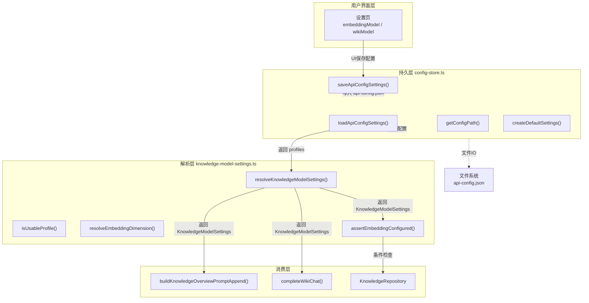
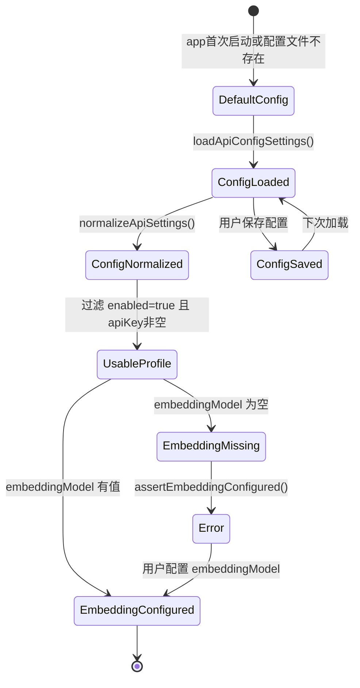

# 设置页与配置读写

<cite>

**本文引用的文件**

- [src/electron/libs/knowledge/knowledge-model-settings.ts](file://src/electron/libs/knowledge/knowledge-model-settings.ts)
- [src/electron/libs/knowledge/knowledge-types.ts](file://src/electron/libs/knowledge/knowledge-types.ts)
- [src/electron/libs/knowledge/knowledge-overview.ts](file://src/electron/libs/knowledge/knowledge-overview.ts)
- [src/electron/libs/knowledge/wiki-model-client.ts](file://src/electron/libs/knowledge/wiki-model-client.ts)
- [src/electron/libs/git/index.ts](file://src/electron/libs/git/index.ts)
- [src/electron/libs/skill-manager/index.ts](file://src/electron/libs/skill-manager/index.ts)
- [src/electron/libs/task/index.ts](file://src/electron/libs/task/index.ts)
- [src/electron/libs/claude-settings.ts](file://src/electron/libs/claude-settings.ts)
- [src/electron/libs/config-store.ts](file://src/electron/libs/config-store.ts)

</cite>

## 目录

- [概述](#概述)
- [入口职责划分](#入口职责划分)
- [配置数据结构](#配置数据结构)
- [核心函数详解](#核心函数详解)
- [调用链路与依赖关系](#调用链路与依赖关系)
- [实际用法与参数说明](#实际用法与参数说明)
- [状态流与错误处理](#状态流与错误处理)
- [修改功能时的步骤](#修改功能时的步骤)
- [回归验证方式](#回归验证方式)
- [常见失败模式](#常见失败模式)
- [扩展点](#扩展点)

---

## 概述

设置页与配置读写是 tech-cc-hub 的核心基础设施之一。它负责将用户界面配置持久化到磁盘，并在需要时将配置解析为业务层可直接使用的结构化对象。

整个配置体系分为三层：

| 层级 | 模块 | 职责 |
|------|------|------|
| 持久层 | `config-store.ts` | 文件读写、默认值生成、配置规范化 |
| 解析层 | `knowledge-model-settings.ts` | 从配置中提取知识引擎专用设置 |
| 使用层 | `knowledge-overview.ts`、`wiki-model-client.ts` 等 | 消费解析后的配置对象 |

章节来源：[file://src/electron/libs/knowledge/knowledge-model-settings.ts#L1-L14](file://src/electron/libs/knowledge/knowledge-model-settings.ts#L1-L14)

---

## 入口职责划分

### config-store.ts —— 配置持久层

`config-store.ts` 是整个配置系统的入口，负责：

1. **文件路径管理**：通过 `getConfigPath()` 获取配置文件的绝对路径，位于 `app.getPath("userData")` 目录下
2. **配置读写**：`loadApiConfigSettings()` 和 `saveApiConfigSettings()` 分别负责从磁盘读取和写入配置
3. **默认值生成**：`createDefaultSettings()` 在配置文件不存在时返回默认配置
4. **配置规范化**：`normalizeApiSettings()`、`normalizeApiConfig()` 等函数确保配置数据的完整性和合法性

章节来源：[file://src/electron/libs/config-store.ts#L60-L98](file://src/electron/libs/config-store.ts#L60-L98)

### knowledge-model-settings.ts —— 知识引擎配置解析层

此模块从 config-store 的原始配置中提取知识引擎所需的专用配置：

1. **过滤可用 Profile**：`isUsableProfile()` 筛选出 enabled=true 且 apiKey/baseURL 非空的配置
2. **解析 Embedding 设置**：提取 embeddingModel、dimension、batchSize 等参数
3. **解析 Wiki 模型设置**：提取 wikiModel、costTier、maxTokens 等参数
4. **兜底与断言**：`assertEmbeddingConfigured()` 在 embedding 未配置时抛出明确错误

章节来源：[file://src/electron/libs/knowledge/knowledge-model-settings.ts#L38-L90](file://src/electron/libs/knowledge/knowledge-model-settings.ts#L38-L90)

---

## 配置数据结构

### ApiConfig（持久层）

`ApiConfig` 是配置文件中存储的原始数据结构，定义于 `config-store.ts`：

```typescript
type ApiConfig = {
  id: string;
  name: string;
  apiKey: string;
  baseURL: string;
  model: string;
  // 知识引擎相关字段
  embeddingModel?: string;
  embeddingDimension?: number;
  embeddingBatchSize?: number;
  wikiModel?: string;
  wikiModelCostTier?: "free" | "cheap" | "standard";
  wikiModelMaxInputTokens?: number;
  wikiModelMaxOutputTokens?: number;
  enabled: boolean;
  provider?: "custom" | "deepseek" | "codex";
};
```

章节来源：[file://src/electron/libs/config-store.ts#L21-L42](file://src/electron/libs/config-store.ts#L21-L42)

### EmbeddingModelSettings（使用层）

```typescript
type EmbeddingModelSettings = {
  profileId: string;
  profileName: string;
  apiKey: string;
  baseURL: string;
  model: string;
  dimension: number;        // 向量维度（自动推断或手动指定）
  batchSize: number;       // 批处理大小（上限128）
};
```

章节来源：[file://src/electron/libs/knowledge/knowledge-types.ts#L100-L108](file://src/electron/libs/knowledge/knowledge-types.ts#L100-L108)

### WikiModelSettings（使用层）

```typescript
type WikiModelSettings = {
  profileId: string;
  profileName: string;
  apiKey: string;
  baseURL: string;
  model: string;
  costTier: "free" | "cheap" | "standard";  // 费用层级
  maxInputTokens: number;
  maxOutputTokens: number;
};
```

章节来源：[file://src/electron/libs/knowledge/knowledge-types.ts#L110-L119](file://src/electron/libs/knowledge/knowledge-types.ts#L110-L119)

---

## 核心函数详解

### loadApiConfigSettings()

**位置**：`config-store.ts` 第 100-113 行

**职责**：从磁盘加载配置，如果文件不存在则返回默认值。

```typescript
export function loadApiConfigSettings(): ApiConfigSettings {
  try {
    const configPath = getConfigPath();
    if (!existsSync(configPath)) {
      return createDefaultSettings();
    }
    const raw = readFileSync(configPath, "utf8");
    const parsed = JSON.parse(raw) as ApiConfig | ApiConfigSettings;
    return normalizeApiSettings(parsed);
  } catch (error) {
    console.error("[config-store] Failed to load API config:", error);
    return createDefaultSettings();
  }
}
```

**返回值**：`ApiConfigSettings` 结构体，包含 `profiles: ApiConfig[]` 数组。

章节来源：[file://src/electron/libs/config-store.ts#L100-L113](file://src/electron/libs/config-store.ts#L100-L113)

### resolveKnowledgeModelSettings()

**位置**：`knowledge-model-settings.ts` 第 49-83 行

**职责**：从配置文件中提取知识引擎专用配置，返回 `KnowledgeModelSettings` 对象。

```typescript
export function resolveKnowledgeModelSettings(): KnowledgeModelSettings {
  const profiles = loadApiConfigSettings().profiles.filter(isUsableProfile);
  const embeddingProfile = profiles.find((profile) => profile.embeddingModel?.trim());
  const wikiProfile = profiles.find((profile) => profile.wikiModel?.trim());
  // ... 构造 embedding 和 wiki 设置对象
  return { embedding, wiki };
}
```

**关键逻辑**：

1. 只保留 enabled=true 且 apiKey/baseURL 非空的 profile
2. 优先使用第一个配置了 embeddingModel 的 profile
3. 向量维度通过 `resolveEmbeddingDimension()` 自动推断或使用配置值

章节来源：[file://src/electron/libs/knowledge/knowledge-model-settings.ts#L49-L83](file://src/electron/libs/knowledge/knowledge-model-settings.ts#L49-L83)

### resolveEmbeddingDimension()

**位置**：`knowledge-model-settings.ts` 第 32-36 行

**职责**：根据模型名称自动推断向量维度。

```typescript
const KNOWN_EMBEDDING_DIMENSIONS: Array<{ pattern: RegExp; dimension: number }> = [
  { pattern: /qwen3-embedding-0\.6b/i, dimension: 1024 },
  { pattern: /qwen3-embedding-4b/i, dimension: 2560 },
  { pattern: /text-embedding-3-small/i, dimension: 1536 },
  { pattern: /text-embedding-3-large/i, dimension: 3072 },
  // ...
];
```

**匹配逻辑**：按顺序遍历预定义模型名模式，匹配成功则返回对应维度；否则使用配置值或默认值 1536。

章节来源：[file://src/electron/libs/knowledge/knowledge-model-settings.ts#L16-L36](file://src/electron/libs/knowledge/knowledge-model-settings.ts#L16-L36)

### assertEmbeddingConfigured()

**位置**：`knowledge-model-settings.ts` 第 85-90 行

**职责**：断言 embedding 已配置，未配置时抛出明确错误。

```typescript
export function assertEmbeddingConfigured(settings = resolveKnowledgeModelSettings()): EmbeddingModelSettings {
  if (!settings.embedding) {
    throw new Error("Knowledge Engine 未启用：请先在模型设置里配置向量模型 embeddingModel。");
  }
  return settings.embedding;
}
```

**使用场景**：在任何需要 embedding 的操作前调用此函数进行前置检查。

章节来源：[file://src/electron/libs/knowledge/knowledge-model-settings.ts#L85-L90](file://src/electron/libs/knowledge/knowledge-model-settings.ts#L85-L90)

---

## 调用链路与依赖关系

以下 Mermaid 图展示了配置从持久化到使用的完整调用链路：



**图表来源**：[file://src/electron/libs/config-store.ts](file://src/electron/libs/config-store.ts)、[file://src/electron/libs/knowledge/knowledge-model-settings.ts](file://src/electron/libs/knowledge/knowledge-model-settings.ts)

### 关键依赖路径

| 消费者 | 依赖路径 | 用途 |
|--------|----------|------|
| `knowledge-overview.ts` | `resolveKnowledgeModelSettings()` → `buildKnowledgeOverviewPromptAppend()` | 生成知识概览 XML |
| `wiki-model-client.ts` | Wiki 模型调用时消费 `WikiModelSettings` | Wiki 生成 API 请求 |
| `knowledge-repository.ts` | `assertEmbeddingConfigured()` | 向量数据库初始化前检查 |

章节来源：[file://src/electron/libs/knowledge/knowledge-overview.ts#L35](file://src/electron/libs/knowledge/knowledge-overview.ts#L35)

---

## 实际用法与参数说明

### 场景一：在 UI 中保存配置

```typescript
import { saveApiConfigSettings, loadApiConfigSettings } from "../config-store.js";

// 用户在设置页修改配置后调用
function onSaveSettings(newProfile: ApiConfig) {
  const settings = loadApiConfigSettings();
  const index = settings.profiles.findIndex(p => p.id === newProfile.id);
  if (index >= 0) {
    settings.profiles[index] = newProfile;
  } else {
    settings.profiles.push(newProfile);
  }
  saveApiConfigSettings(settings);
}
```

章节来源：[file://src/electron/libs/config-store.ts#L115-L134](file://src/electron/libs/config-store.ts#L115-L134)

### 场景二：消费知识引擎配置

```typescript
import { resolveKnowledgeModelSettings, assertEmbeddingConfigured } from "./knowledge-model-settings.js";

// 在需要 embedding 的操作前检查
function initializeVectorStore() {
  const embeddingSettings = assertEmbeddingConfigured();
  // embeddingSettings 包含 profileId, profileName, apiKey, baseURL, model, dimension, batchSize
  const repo = new KnowledgeRepository(dbPath, {
    embeddingDimension: embeddingSettings.dimension,
  });
}

// 在不需要强制检查的地方使用可选配置
function generateKnowledgeOverview(projectCwd: string) {
  const settings = resolveKnowledgeModelSettings();
  if (!settings.embedding) {
    return "Knowledge Engine 未配置 embeddingModel";
  }
  // ... 生成 overview
}
```

章节来源：[file://src/electron/libs/knowledge/knowledge-model-settings.ts#L85-L90](file://src/electron/libs/knowledge/knowledge-model-settings.ts#L85-L90)

### 场景三：Wiki 模型调用

```typescript
import { generateWikiMarkdown } from "./wiki-model-client.js";

async function createWiki(projectCwd: string, prompt: string) {
  const settings = resolveKnowledgeModelSettings();
  if (!settings.wiki) {
    throw new Error("Wiki 模型未配置");
  }

  const markdown = await generateWikiMarkdown(settings.wiki, prompt);
  return markdown;
}
```

章节来源：[file://src/electron/libs/knowledge/wiki-model-client.ts#L74-L85](file://src/electron/libs/knowledge/wiki-model-client.ts#L74-L85)

---

## 状态流与错误处理

### 配置状态流转



### 错误处理策略

| 场景 | 处理方式 | 来源 |
|------|----------|------|
| 配置文件读取失败 | 静默回退到 `createDefaultSettings()` | [config-store.ts#L110](file://src/electron/libs/config-store.ts#L110) |
| embedding 未配置 | 抛出明确错误 `"Knowledge Engine 未启用..."` | [knowledge-model-settings.ts#L87](file://src/electron/libs/knowledge/knowledge-model-settings.ts#L87) |
| Wiki 模型未配置 | 返回 `settings.wiki` 为 `undefined` | [knowledge-model-settings.ts#L69-L80](file://src/electron/libs/knowledge/knowledge-model-settings.ts#L69-L80) |
| Wiki API 调用超时 | 120秒超时，抛出 `AbortError` | [wiki-model-client.ts#L39](file://src/electron/libs/knowledge/wiki-model-client.ts#L39) |

章节来源：[file://src/electron/libs/config-store.ts#L100-L112](file://src/electron/libs/config-store.ts#L100-L112)

---

## 修改功能时的步骤

### 步骤 1：定位入口

根据修改目标定位入口文件：

| 修改目标 | 入口文件 |
|----------|----------|
| 修改持久化格式 | `config-store.ts` |
| 修改解析逻辑 | `knowledge-model-settings.ts` |
| 添加新配置字段 | `config-store.ts` + `knowledge-model-settings.ts` |

### 步骤 2：修改持久层

在 `config-store.ts` 中添加新字段时，需要：

1. 在 `ApiConfig` 类型中添加字段
2. 在 `createDefaultSettings()` 中添加默认值
3. 在 `normalizeApiConfig()` 中添加规范化逻辑
4. 确保 `normalizeApiSettings()` 能正确处理新字段

```typescript
// 示例：添加 wikiModelTemperature
export type ApiConfig = {
  // ... 已有字段
  wikiModelTemperature?: number;  // 新增
};

// createDefaultSettings() 中
wikiModelTemperature: 0.2,  // 新增

// normalizeApiConfig() 中
wikiModelTemperature: normalizePositiveInteger(config.wikiModelTemperature) ?? undefined,
```

章节来源：[file://src/electron/libs/config-store.ts#L21-L42](file://src/electron/libs/config-store.ts#L21-L42)

### 步骤 3：修改解析层（如需要）

在 `knowledge-model-settings.ts` 中使用新字段时：

1. 在 `WikiModelSettings` 或 `EmbeddingModelSettings` 类型中添加字段
2. 在 `resolveKnowledgeModelSettings()` 中提取字段
3. 添加必要的默认值处理

### 步骤 4：更新消费层

找到所有使用相关配置的消费者文件，更新使用方式。

---

## 回归验证方式

### 单元测试验证点

| 测试场景 | 预期结果 | 验证文件 |
|----------|----------|----------|
| 配置文件不存在 | 返回默认配置 | `config-store.ts` |
| embeddingModel 为空 | `resolveKnowledgeModelSettings().embedding === undefined` | `knowledge-model-settings.ts` |
| 已知模型名推断维度 | `resolveEmbeddingDimension("text-embedding-3-small")` 返回 1536 | `knowledge-model-settings.ts` |
| `assertEmbeddingConfigured()` embedding为空 | 抛出特定错误信息 | `knowledge-model-settings.ts` |

### 集成验证步骤

1. **清除配置**：删除 `userData/api-config.json`
2. **重启应用**：验证默认值生成正确
3. **配置 embedding**：在设置页填入 embeddingModel
4. **触发知识概览**：验证 `<knowledge_overview enabled="true">` 正确生成

### 回归检查清单

- [ ] 配置保存后重新加载，值一致
- [ ] embeddingModel 为空时，assertEmbeddingConfigured 抛出明确错误
- [ ] 已知模型名能正确推断维度
- [ ] batchSize 上限 128 正确生效
- [ ] costTier 只接受 "free"|"cheap"|"standard"

章节来源：[file://src/electron/libs/knowledge/knowledge-model-settings.ts#L42-L47](file://src/electron/libs/knowledge/knowledge-model-settings.ts#L42-L47)

---

## 常见失败模式

### 1. embedding 未配置导致功能不可用

**症状**：调用 `assertEmbeddingConfigured()` 时抛出 `"Knowledge Engine 未启用：请先在模型设置里配置向量模型 embeddingModel。"`

**排查步骤**：
1. 检查 `src/electron/libs/config-store.ts` 中配置文件的 `embeddingModel` 字段
2. 确认 `userData/api-config.json` 中至少有一个 profile 设置了 `embeddingModel`
3. 确认该 profile 的 `enabled` 为 `true`

**章节来源**：[file://src/electron/libs/knowledge/knowledge-model-settings.ts#L85-L90](file://src/electron/libs/knowledge/knowledge-model-settings.ts#L85-L90)

### 2. 向量维度不匹配

**症状**：向量数据库查询返回结果异常，或 embedding 服务报错

**排查步骤**：
1. 确认使用的 embedding 模型在 `KNOWN_EMBEDDING_DIMENSIONS` 中有定义
2. 如果使用自定义维度，确认 `embeddingDimension` 配置值正确
3. 检查模型实际输出的向量维度

**章节来源**：[file://src/electron/libs/knowledge/knowledge-model-settings.ts#L16-L36](file://src/electron/libs/knowledge/knowledge-model-settings.ts#L16-L36)

### 3. batchSize 过大

**症状**：embedding 服务报内存错误或超时

**原因**：`resolveKnowledgeModelSettings()` 中 `batchSize` 上限为 128，如果配置值超过 128 会被截断

**章节来源**：[file://src/electron/libs/knowledge/knowledge-model-settings.ts#L62-L65](file://src/electron/libs/knowledge/knowledge-model-settings.ts#L62-L65)

### 4. Wiki API 超时

**症状**：`completeWikiChat()` 抛出 AbortError

**排查步骤**：
1. 检查网络连通性
2. 确认 `wikiModel` 配置的 baseURL 正确
3. 考虑增加 `TECH_CC_HUB_WIKI_CALL_TIMEOUT_MS` 环境变量（默认 120 秒）

**章节来源**：[file://src/electron/libs/knowledge/wiki-model-client.ts#L16-L39](file://src/electron/libs/knowledge/wiki-model-client.ts#L16-L39)

### 5. costTier 解析错误

**症状**：Wiki 模型调用行为不符合预期

**原因**：`normalizeCostTier()` 只接受 "free"|"cheap"|"standard"，其他值回退为 "cheap"

**章节来源**：[file://src/electron/libs/knowledge/knowledge-model-settings.ts#L42-L47](file://src/electron/libs/knowledge/knowledge-model-settings.ts#L42-L47)

---

## 扩展点

### 扩展点 1：添加新的知识引擎模型类型

在 `knowledge-types.ts` 中扩展类型定义，然后在 `knowledge-model-settings.ts` 中添加解析逻辑。

### 扩展点 2：自定义 embedding 模型维度映射

在 `KNOWN_EMBEDDING_DIMENSIONS` 数组中添加新的模型模式匹配：

```typescript
{ pattern: /your-model-name/i, dimension: 2048 }
```

章节来源：[file://src/electron/libs/knowledge/knowledge-model-settings.ts#L16-L22](file://src/electron/libs/knowledge/knowledge-model-settings.ts#L16-L22)

### 扩展点 3：配置验证器

在 `normalizeApiConfig()` 中添加更严格的字段验证，例如：

- API Key 格式校验
- BaseURL 格式校验
- 模型名称白名单

章节来源：[file://src/electron/libs/config-store.ts#L196-L252](file://src/electron/libs/config-store.ts#L196-L252)

### 扩展点 4：配置热重载

当前配置需要重启应用才能生效。如需支持热重载：

1. 在 `config-store.ts` 中导出配置变更事件
2. 在消费者模块中监听事件并重新调用 `resolveKnowledgeModelSettings()`

---

*文档版本：1.0.0 | 最后更新：基于当前代码库状态*