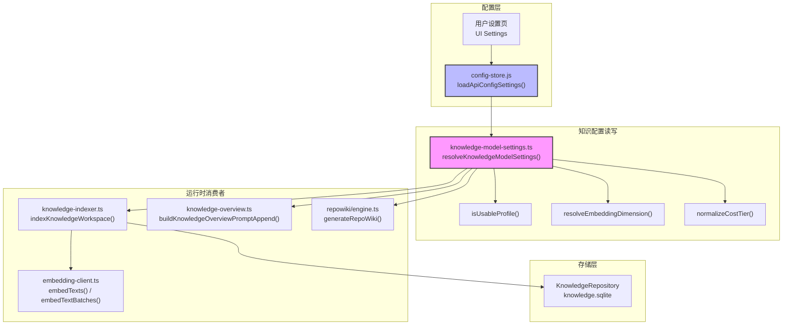
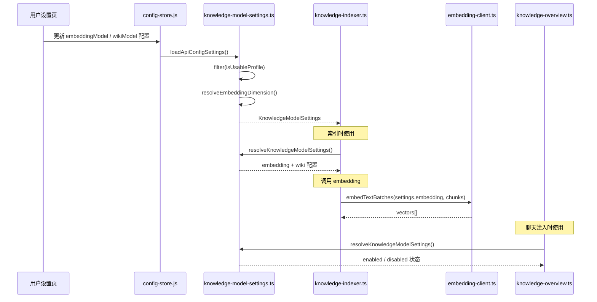
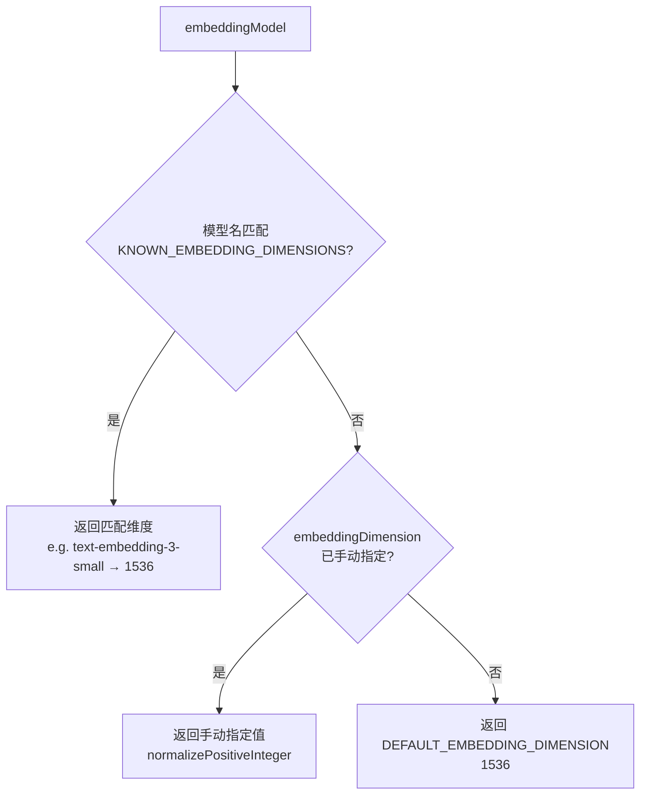
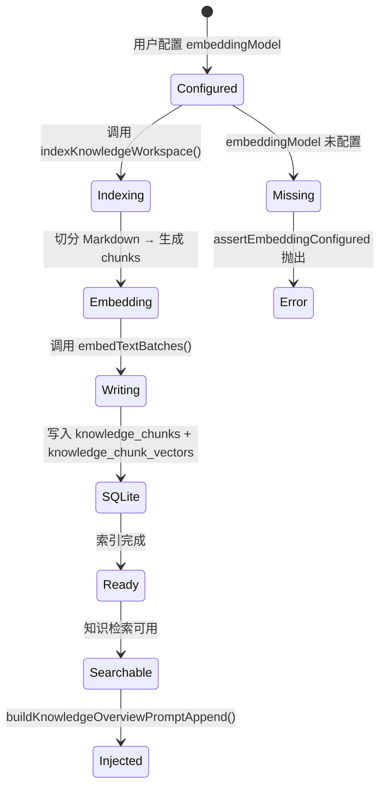
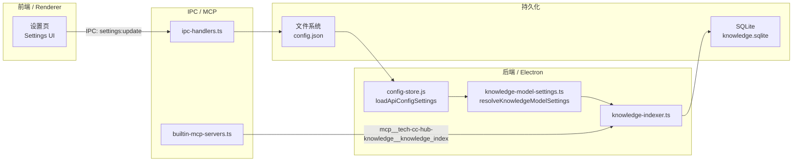

# 设置页与配置读写

<cite>
**本文引用的文件**
- [src/electron/libs/knowledge/knowledge-model-settings.ts](file://src/electron/libs/knowledge/knowledge-model-settings.ts)
- [src/electron/libs/knowledge/agent-cards.ts](file://src/electron/libs/knowledge/agent-cards.ts)
- [src/electron/libs/knowledge/embedding-client.ts](file://src/electron/libs/knowledge/embedding-client.ts)
- [src/electron/libs/knowledge/knowledge-indexer.ts](file://src/electron/libs/knowledge/knowledge-indexer.ts)
- [src/electron/libs/knowledge/knowledge-overview.ts](file://src/electron/libs/knowledge/knowledge-overview.ts)
- [src/electron/libs/knowledge/knowledge-paths.ts](file://src/electron/libs/knowledge/knowledge-paths.ts)
- [src/electron/libs/knowledge/knowledge-repository.ts](file://src/electron/libs/knowledge/knowledge-repository.ts)
- [src/electron/libs/knowledge/knowledge-types.ts](file://src/electron/libs/knowledge/knowledge-types.ts)
- [src/electron/libs/knowledge/knowledge-ui-store.ts](file://src/electron/libs/knowledge/knowledge-ui-store.ts)
- [src/electron/libs/knowledge/knowledge-utils.ts](file://src/electron/libs/knowledge/knowledge-utils.ts)
- [src/electron/libs/knowledge/repowiki/analyzer.ts](file://src/electron/libs/knowledge/repowiki/analyzer.ts)
- [src/electron/libs/knowledge/repowiki/builder.ts](file://src/electron/libs/knowledge/repowiki/builder.ts)
- [src/electron/libs/knowledge/repowiki/engine.ts](file://src/electron/libs/knowledge/repowiki/engine.ts)
- [src/electron/libs/knowledge/repowiki/exporter.ts](file://src/electron/libs/knowledge/repowiki/exporter.ts)
- [src/electron/libs/knowledge/repowiki/graph.ts](file://src/electron/libs/knowledge/repowiki/graph.ts)
- [src/electron/libs/knowledge/repowiki/intelligence.ts](file://src/electron/libs/knowledge/repowiki/intelligence.ts)
- [src/electron/libs/knowledge/repowiki/prompts.ts](file://src/electron/libs/knowledge/repowiki/prompts.ts)
- [src/electron/libs/knowledge/repowiki/scanner.ts](file://src/electron/libs/knowledge/repowiki/scanner.ts)
</cite>

---

## 目录

- [职责定位：配置读写中心](#职责定位配置读写中心)
- [入口函数与核心符号](#入口函数与核心符号)
- [调用链：从设置页到运行时](#调用链从设置页到运行时)
- [数据结构与类型定义](#数据结构与类型定义)
- [配置参数详解](#配置参数详解)
- [状态流：配置 → 索引 → 检索](#状态流配置--索引--检索)
- [常见失败模式与排障步骤](#常见失败模式与排障步骤)
- [扩展点：添加新模型类型](#扩展点添加新模型类型)
- [Agent 改代码地图](#agent-改代码地图)

---

## 职责定位：配置读写中心

`knowledge-model-settings.ts` 是知识引擎的**配置读写中心**，负责从用户设置页（`config-store.js`）读取 API 配置，将其转换为知识引擎所需的运行时结构。

### 核心职责

1. **读取来源**：从 `loadApiConfigSettings()` 读取所有启用的 API Profile
2. **过滤可用配置**：筛选出 `embeddingModel` 和 `wikiModel` 非空的 Profile
3. **规范化参数**：处理 embedding dimension、batch size、token limit 等数值
4. **生成运行时配置**：输出 `EmbeddingModelSettings` 和 `WikiModelSettings`
5. **守卫检查**：`assertEmbeddingConfigured` 提供运行时守卫，确保 embedding 配置存在

> **章节来源**：[src/electron/libs/knowledge/knowledge-model-settings.ts#L49-L83](file://src/electron/libs/knowledge/knowledge-model-settings.ts#L49-L83)

---

## 入口函数与核心符号

### 导出的公共符号

| 符号 | 行号 | 职责 |
|------|------|------|
| `resolveKnowledgeModelSettings()` | L49 | 主入口，从 config-store 读取并组装配置 |
| `assertEmbeddingConfigured()` | L85 | 守卫函数，embedding 未配置时抛错 |

### 内部辅助符号

| 符号 | 行号 | 职责 |
|------|------|------|
| `normalizePositiveInteger()` | L24 | 规范化正整数，非法值回退到 fallback |
| `resolveEmbeddingDimension()` | L32 | 根据模型名匹配已知维度 |
| `isUsableProfile()` | L38 | 判断 Profile 是否可用（enabled + apiKey + baseURL） |
| `normalizeCostTier()` | L42 | 规范化 costTier，只接受 free/cheap/standard |

### 常量定义

```typescript
const DEFAULT_EMBEDDING_DIMENSION = 1536;     // L11
const DEFAULT_EMBEDDING_BATCH_SIZE = 16;      // L12
const DEFAULT_WIKI_MAX_INPUT_TOKENS = 16_000;  // L13
const DEFAULT_WIKI_MAX_OUTPUT_TOKENS = 4_000;  // L14
```

> **章节来源**：[src/electron/libs/knowledge/knowledge-model-settings.ts#L11-L14](file://src/electron/libs/knowledge/knowledge-model-settings.ts#L11-L14)

---

## 调用链：从设置页到运行时

### 调用链图



### 调用顺序



### 关键调用点

1. **`knowledge-indexer.ts` L178**：`const settings = resolveKnowledgeModelSettings();`
2. **`knowledge-overview.ts` L35**：`const settings = resolveKnowledgeModelSettings();`
3. **`repowiki/engine.ts`**：通过 `WikiModelSettings` 传递给 Python runner
4. **`repowiki/analyzer.ts` L46**：`WikiModelSettings` 作为 `RepoWikiAnalyzer` 构造参数

> **图表来源**：[src/electron/libs/knowledge/knowledge-indexer.ts#L178](file://src/electron/libs/knowledge/knowledge-indexer.ts#L178) / [src/electron/libs/knowledge/knowledge-overview.ts#L35](file://src/electron/libs/knowledge/knowledge-overview.ts#L35)

---

## 数据结构与类型定义

### 输入类型：`ApiConfig`

来自 `config-store.js`，包含以下关键字段：

```typescript
// 隐式类型，从 loadApiConfigSettings() 返回
interface ApiConfig {
  id: string;
  name: string;
  enabled: boolean;
  apiKey: string;
  baseURL: string;
  embeddingModel?: string;       // 用于向量模型
  embeddingDimension?: number;   // 手动指定维度
  embeddingBatchSize?: number;  // 批处理大小
  wikiModel?: string;            // 用于 Wiki 生成
  wikiModelCostTier?: string;    // free | cheap | standard
  wikiModelMaxInputTokens?: number;
  wikiModelMaxOutputTokens?: number;
}
```

### 输出类型：`KnowledgeModelSettings`

```typescript
// knowledge-types.ts L121
export type KnowledgeModelSettings = {
  embedding?: EmbeddingModelSettings;
  wiki?: WikiModelSettings;
};

// knowledge-types.ts L100
export type EmbeddingModelSettings = {
  profileId: string;
  profileName: string;
  apiKey: string;
  baseURL: string;
  model: string;
  dimension: number;      // 从 KNOWN_EMBEDDING_DIMENSIONS 匹配或手动指定
  batchSize: number;     // 最大 128
};

// knowledge-types.ts L110
export type WikiModelSettings = {
  profileId: string;
  profileName: string;
  apiKey: string;
  baseURL: string;
  model: string;
  costTier: "free" | "cheap" | "standard";
  maxInputTokens: number;
  maxOutputTokens: number;
};
```

> **章节来源**：[src/electron/libs/knowledge/knowledge-types.ts#L100-L124](file://src/electron/libs/knowledge/knowledge-types.ts#L100-L124)

---

## 配置参数详解

### Embedding 配置参数

| 参数 | 类型 | 默认值 | 合法范围 | 作用 |
|------|------|--------|----------|------|
| `embeddingModel` | string | - | 非空字符串 | 向量模型名称，匹配 `KNOWN_EMBEDDING_DIMENSIONS` |
| `embeddingDimension` | number | 1536 | 正整数 | 手动指定向量维度 |
| `embeddingBatchSize` | number | 16 | 1-128 | 批处理大小，实际使用 `Math.min(128, value)` |

### 已知 Embedding 维度映射

```typescript
// knowledge-model-settings.ts L16
const KNOWN_EMBEDDING_DIMENSIONS: Array<{ pattern: RegExp; dimension: number }> = [
  { pattern: /qwen3-embedding-0\.6b/i, dimension: 1024 },
  { pattern: /qwen3-embedding-4b/i, dimension: 2560 },
  { pattern: /qwen3-embedding-8b/i, dimension: 4096 },
  { pattern: /text-embedding-3-small/i, dimension: 1536 },
  { pattern: /text-embedding-3-large/i, dimension: 3072 },
];
```

### Wiki 模型配置参数

| 参数 | 类型 | 默认值 | 合法值 | 作用 |
|------|------|--------|--------|------|
| `wikiModel` | string | - | 非空字符串 | Wiki 生成模型 |
| `wikiModelCostTier` | string | "cheap" | free/cheap/standard | 控制并发数 |
| `wikiModelMaxInputTokens` | number | 16000 | 正整数 | 输入 token 上限 |
| `wikiModelMaxOutputTokens` | number | 4000 | 正整数 | 输出 token 上限 |

### 维度解析优先级



> **章节来源**：[src/electron/libs/knowledge/knowledge-model-settings.ts#L16-L36](file://src/electron/libs/knowledge/knowledge-model-settings.ts#L16-L36)

---

## 状态流：配置 → 索引 → 检索

### 完整状态流



### Source of Truth

| 数据源 | Source of Truth | 运行时刷新边界 |
|--------|-----------------|----------------|
| API 配置 | `config-store.js` (文件系统) | 重启 Electron 后生效 |
| 运行时设置 | `knowledge-model-settings.ts` (内存) | 每次调用 `resolveKnowledgeModelSettings()` 重新读取 |
| 向量索引 | `appData/knowledge/<hash>/knowledge.sqlite` | 索引完成后持久化 |

### 前后端桥接点



> **图表来源**：[src/electron/libs/knowledge/knowledge-paths.ts#L48-L69](file://src/electron/libs/knowledge/knowledge-paths.ts#L48-L69)

---

## 常见失败模式与排障步骤

### 失败模式 1：Embedding 未配置

**错误信息**：
```
"Knowledge Engine 未启用：请先在模型设置里配置向量模型 embeddingModel。"
```

**来源**：`assertEmbeddingConfigured()` L87

**触发条件**：
- `settings.embedding` 为 `undefined`
- Profile 的 `embeddingModel` 为空或未设置

**排障步骤**：
```bash
# 1. 检查 config-store 中是否有 embeddingModel 配置
# 2. 确认 Profile 已启用 (enabled: true)
# 3. 确认 apiKey 和 baseURL 已填写
```

### 失败模式 2：维度不匹配

**错误信息**：
```
"embedding dimension mismatch: expected 1536, got 2048"
```

**来源**：`embedding-client.ts` L30 `normalizeEmbeddingVector()`

**触发条件**：
- 模型返回的向量维度与配置不符
- `KNOWN_EMBEDDING_DIMENSIONS` 中没有该模型

**排障步骤**：
```typescript
// 1. 在 knowledge-model-settings.ts 中添加新模型的维度映射
const KNOWN_EMBEDDING_DIMENSIONS: Array<{ pattern: RegExp; dimension: number }> = [
  // ... existing
  { pattern: /your-new-model/i, dimension: 2048 },
];
```

### 失败模式 3：sqlite-vec 不可用

**错误信息**：
```
"Knowledge Engine 未启用：sqlite-vec 扩展不可用。"
```

**来源**：`knowledge-indexer.ts` L213

**触发条件**：
- Electron 环境未加载 `sqlite-vec` 扩展
- Native addon 加载失败

**排障步骤**：
```bash
# 1. 检查 Electron 是否支持 native modules
# 2. 验证 sqlite-vec 扩展是否正确打包
# 3. 查看控制台日志：[knowledge] sqlite-vec unavailable: <error>
```

### 失败模式 4：Wiki 模型配置但 costTier 错误

**错误信息**：Python runner 使用错误的并发数

**来源**：`repowiki/engine.ts` L54-59

```typescript
function resolveRepoWikiConcurrency(wiki: WikiModelSettings): string {
  const configured = Number(process.env.TECH_CC_HUB_REPOWIKI_CONCURRENCY || ...);
  if (configured > 0) return String(configured);
  return wiki.costTier === "free" ? "2" : "6";  // free=2, 其他=6
}
```

**排障步骤**：
- 设置 `TECH_CC_HUB_REPOWIKI_CONCURRENCY` 环境变量覆盖
- 确认 `wikiModelCostTier` 填写正确

### 失败模式 5：Profile 过滤后为空

**来源**：`isUsableProfile()` L38-40

```typescript
function isUsableProfile(profile: ApiConfig): boolean {
  return Boolean(profile.enabled && profile.apiKey.trim() && profile.baseURL.trim());
}
```

**排障步骤**：
```typescript
// 检查 loadApiConfigSettings() 返回的 profiles
const profiles = loadApiConfigSettings().profiles;
console.log(profiles.filter(isUsableProfile));
```

> **章节来源**：[src/electron/libs/knowledge/knowledge-model-settings.ts#L38-L40](file://src/electron/libs/knowledge/knowledge-model-settings.ts#L38-L40)

---

## 扩展点：添加新模型类型

### 扩展点 1：新的 Embedding 模型维度

在 `KNOWN_EMBEDDING_DIMENSIONS` 数组中添加新条目：

```typescript
// knowledge-model-settings.ts L16-22
const KNOWN_EMBEDDING_DIMENSIONS: Array<{ pattern: RegExp; dimension: number }> = [
  // ... existing
  { pattern: /your-new-embedding-model/i, dimension: 1024 },  // 新增
];
```

### 扩展点 2：新的 Cost Tier

修改 `normalizeCostTier()` 支持新层级：

```typescript
// knowledge-model-settings.ts L42-47
function normalizeCostTier(value: string | undefined): WikiModelSettings["costTier"] {
  if (value === "free" || value === "cheap" || value === "standard") {
    return value;
  }
  // 可扩展：if (value === "premium") return "premium";
  return "cheap";
}
```

### 扩展点 3：新的 Wiki 模型设置

在 `resolveKnowledgeModelSettings()` 中添加新的模型配置：

```typescript
// knowledge-model-settings.ts L49-82
export function resolveKnowledgeModelSettings(): KnowledgeModelSettings {
  // ... existing code

  // 添加新模型类型配置：
  // const codeModel = codeProfiles?.codeModel?.trim()
  //   ? { profileId: codeProfile.id, model: codeProfile.codeModel.trim(), ... }
  //   : undefined;

  return { embedding, wiki };
}
```

---

## Agent 改代码地图

### 先读文件

1. **设置页配置读取**：`src/electron/libs/knowledge/knowledge-model-settings.ts`
2. **类型定义**：`src/electron/libs/knowledge/knowledge-types.ts` (L100-L124)
3. **调用方**：
   - `src/electron/libs/knowledge/knowledge-indexer.ts` (L178)
   - `src/electron/libs/knowledge/knowledge-overview.ts` (L35)
4. **配置存储**：`src/electron/libs/config-store.js` (由 `loadApiConfigSettings` 读取)

### 关键符号 / IPC / MCP 工具

| 类型 | 名称 | 位置 |
|------|------|------|
| 核心函数 | `resolveKnowledgeModelSettings()` | knowledge-model-settings.ts:49 |
| 守卫函数 | `assertEmbeddingConfigured()` | knowledge-model-settings.ts:85 |
| 过滤函数 | `isUsableProfile()` | knowledge-model-settings.ts:38 |
| 维度解析 | `resolveEmbeddingDimension()` | knowledge-model-settings.ts:32 |
| 输入类型 | `ApiConfig` (隐式) | config-store.js |
| 输出类型 | `KnowledgeModelSettings` | knowledge-types.ts:121 |
| 嵌入类型 | `EmbeddingModelSettings` | knowledge-types.ts:100 |
| Wiki 类型 | `WikiModelSettings` | knowledge-types.ts:110 |
| MCP 工具 | `mcp__tech-cc-hub-knowledge__knowledge_index` | knowledge-ui-store.ts |

### 修改入口

| 场景 | 修改位置 | 注意事项 |
|------|----------|----------|
| 添加新 Embedding 模型 | `KNOWN_EMBEDDING_DIMENSIONS` L16 | 添加正则匹配和对应维度 |
| 修改默认维度 | `DEFAULT_EMBEDDING_DIMENSION` L11 | 影响所有未匹配模型 |
| 添加 Cost Tier | `normalizeCostTier()` L42 | 同步修改 `WikiModelSettings["costTier"]` |
| 修改 Batch Size 上限 | `knowledge-model-settings.ts` L62 | 同步检查 `embedding-client.ts` |
| 添加新模型配置 | `resolveKnowledgeModelSettings()` L49 | 同步 `knowledge-types.ts` 类型定义 |

### 验证命令

```bash
# 1. 验证类型检查通过
npm run typecheck

# 2. 验证 Embedding 配置解析
# 在 knowledge-indexer.ts 中添加调试输出：
# console.log('Embedding settings:', resolveKnowledgeModelSettings().embedding);

# 3. 验证完整索引流程
npm run qa:knowledge

# 4. 验证 Wiki 生成配置
# 调用 resolveKnowledgeModelSettings() 并检查 wiki 对象非空
```

### 常见回归风险

| 风险点 | 描述 | 缓解措施 |
|--------|------|----------|
| Embedding 维度不匹配 | 模型返回向量维度与预期不符 | 确保 `KNOWN_EMBEDDING_DIMENSIONS` 覆盖所有使用模型 |
| 空 Profile 过滤 | 多个 Profile 但都不可用 | 验证 `isUsableProfile()` 条件完整 |
| Batch Size 溢出 | batchSize > 128 | `Math.min(128, value)` 已处理 |
| Cost Tier 默认值错误 | 未识别 tier 值时回退到意外值 | 单元测试覆盖边界值 |
| 配置变更不生效 | Electron 未重启 | 知识引擎每次调用重新读取配置 |

### 测试入口

```typescript
// 测试 normalizePositiveInteger
assert(normalizePositiveInteger(undefined, 10) === 10);
assert(normalizePositiveInteger(-5, 10) === 10);
assert(normalizePositiveInteger(3.7, 10) === 3);
assert(normalizePositiveInteger(100, 10) === 100);

// 测试 resolveEmbeddingDimension
assert(resolveEmbeddingDimension('text-embedding-3-small', undefined) === 1536);
assert(resolveEmbeddingDimension('qwen3-embedding-8b', undefined) === 4096);
assert(resolveEmbeddingDimension('unknown-model', 2048) === 2048);

// 测试 isUsableProfile
assert(isUsableProfile({ enabled: true, apiKey: 'key', baseURL: 'url' }) === true);
assert(isUsableProfile({ enabled: false, apiKey: 'key', baseURL: 'url' }) === false);

// 测试 assertEmbeddingConfigured
assertThrows(() => assertEmbeddingConfigured({ embedding: undefined }),
  /未启用.*embeddingModel/);
```

> **章节来源**：[src/electron/libs/knowledge/knowledge-model-settings.ts#L1-L90](file://src/electron/libs/knowledge/knowledge-model-settings.ts#L1-L90)

---

## 总结

`knowledge-model-settings.ts` 是知识引擎配置的核心读写层，连接用户设置页与运行时索引/检索流程：

1. **单向数据流**：用户设置 → `config-store` → `knowledge-model-settings` → 消费者
2. **运行时重新读取**：每次调用 `resolveKnowledgeModelSettings()` 都会从 `config-store` 读取最新配置
3. **守卫机制**：`assertEmbeddingConfigured` 提供明确的错误信息指导用户配置
4. **可扩展维度映射**：通过 `KNOWN_EMBEDDING_DIMENSIONS` 支持主流 Embedding 模型

修改此模块时，优先确认模型名称匹配逻辑和默认值是否符合预期，再验证索引和检索流程不受影响。