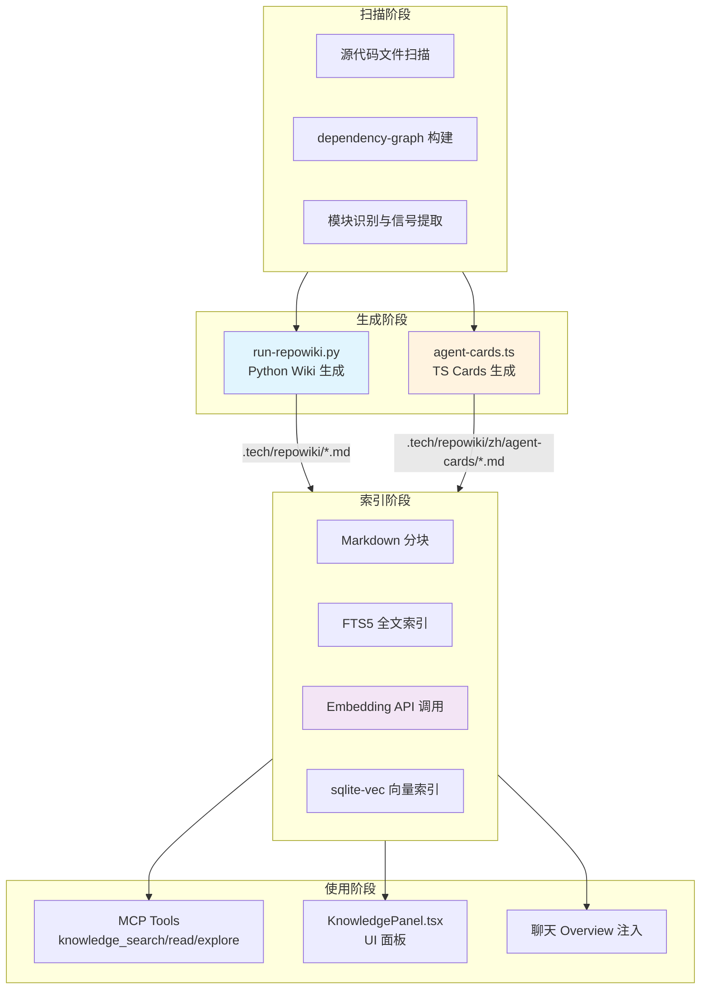
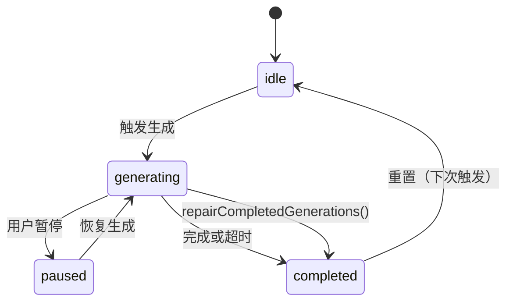
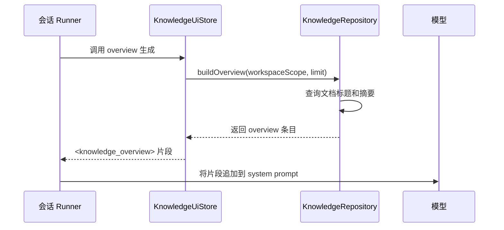

# 知识库与 Repo Wiki 系统

<cite>
**本文引用的文件**

- [src/electron/libs/knowledge/agent-cards.ts](file://src/electron/libs/knowledge/agent-cards.ts)
- [src/electron/libs/knowledge/embedding-client.ts](file://src/electron/libs/knowledge/embedding-client.ts)
- [src/electron/libs/mcp-tools/knowledge.ts](file://src/electron/libs/mcp-tools/knowledge.ts)
- [src/ui/components/KnowledgePanel.tsx](file://src/ui/components/KnowledgePanel.tsx)
- [scripts/knowledge/run-repowiki.py](file://scripts/knowledge/run-repowiki.py)
- [scripts/qa/knowledge-engine-smoke.mjs](file://scripts/qa/knowledge-engine-smoke.mjs)
- [scripts/qa/knowledge-chat-injection-smoke.mjs](file://scripts/qa/knowledge-chat-injection-smoke.mjs)
- [src/electron/libs/knowledge/knowledge-ui-store.ts](file://src/electron/libs/knowledge/knowledge-ui-store.ts)
- [src/electron/libs/knowledge/repowiki/engine.ts](file://src/electron/libs/knowledge/repowiki/engine.ts)
</cite>

## 目录

- [系统概述](#系统概述)
- [整体数据流](#整体数据流)
- [Repo Wiki 生成引擎](#repo-wiki-生成引擎)
- [Agent Knowledge Cards](#agent-knowledge-cards)
- [向量嵌入与检索](#向量嵌入与检索)
- [MCP 工具面](#mcp-工具面)
- [SQLite 表结构](#sqlite-表结构)
- [UI 状态与持久化](#ui-状态与持久化)
- [进度状态与失败恢复](#进度状态与失败恢复)
- [聊天注入链路](#聊天注入链路)
- [调试入口与 Smoke 测试](#调试入口与-smoke-测试)

---

## 系统概述

知识库与 Repo Wiki 系统是 tech-cc-hub 的内置能力，为 Agent 和开发者提供代码理解、上下文注入和检索增强。系统分为三层：

| 层级 | 职责 | 产物位置 |
|------|------|----------|
| 生成层 | 分析源码，生成 Markdown Wiki 和结构化 Cards | `.tech/repowiki/` |
| 索引层 | 对 Markdown 文本分块，建立 FTS5 和 sqlite-vec 向量索引 | `appData/knowledge/` |
| 使用层 | MCP 工具供 Agent 调用，UI 面板供人类浏览，聊天注入供上下文增强 | 运行态 |

本系统依赖 embedding 模型（用于向量检索）和 LLM（用于 Wiki 生成），不依赖 FTS5 作为独立检索能力。
[章节来源](file://src/electron/libs/mcp-tools/knowledge.ts#L137-L138)

---

## 整体数据流



生成层输出两类产物：
- **Repo Wiki Markdown**：面向人类阅读，按模块/主题组织
- **Agent Knowledge Cards**：面向 Agent 调用，含 entryFiles、validation、risks 等结构化字段

两类产物共用同一个 SQLite 索引库，通过 `sourceKind` 字段区分。
[章节来源](file://src/electron/libs/knowledge/agent-cards.ts#L50-L72)

---

## Repo Wiki 生成引擎

### 入口与调用链

`repowiki/engine.ts` 是 TypeScript 适配层，核心函数是 `generateRepoWiki`：

```typescript
export async function generateRepoWiki(
  paths: KnowledgeWorkspacePaths,
  wiki: WikiModelSettings,
  onProgress?: (event: RepoWikiProgressEvent) => void,
): Promise<RepoWikiGenerationResult>
```

调用顺序：

1. `generateRepoWiki` 调用 `runVendoredRepoWiki`
2. `runVendoredRepoWiki` 启动 `python3 scripts/knowledge/run-repowiki.py` 子进程
3. Python 脚本加载 vendored RepoWiki 引擎（`third_party/repowiki/src/`）
4. Python 生成 Markdown 文件到 `.tech/repowiki/zh/content/`
5. Python 脚本以 JSON 形式返回 `generatedFiles`、`pageCount` 等元数据

### 并发控制

```typescript
function resolveRepoWikiConcurrency(wiki: WikiModelSettings): string {
  const configured = Number(process.env.TECH_CC_HUB_REPOWIKI_CONCURRENCY || 0);
  if (Number.isFinite(configured) && configured > 0) {
    return String(Math.max(1, Math.min(12, Math.floor(configured))));
  }
  return wiki.costTier === "free" ? "2" : "6";  // 免费模型用 2 并发，付费用 6
}
```

### 进度事件解析

Python 脚本通过 stderr 输出进度 JSON，`parseRepoWikiProgress` 解析为 `RepoWikiProgressEvent`：

| stage | 含义 |
|-------|------|
| `planning` | 正在规划 Wiki 目录结构 |
| `modules` | 分析模块，`completed/total` 表示进度 |
| `architecture` | 正在构建架构文档 |
| `reading-guide` | 正在生成阅读指南 |
| `done` | Wiki 生成完成 |
| `embedding` | 向量嵌入阶段 |
| `indexing` | 索引写入阶段 |

[章节来源](file://src/electron/libs/knowledge/repowiki/engine.ts#L86-L142)

---

## Agent Knowledge Cards

### 生成流程

`generateAgentKnowledgeCards` 是主入口，位于 `agent-cards.ts`：

```typescript
export function generateAgentKnowledgeCards(paths: KnowledgeWorkspacePaths): AgentKnowledgeCard[] {
  const scan = scanRepoWikiProject(paths.workspaceRoot, {
    maxFileSize: 240 * 1024,
    maxFiles: 1_800,
    previewLines: 80,
  });
  const graph = RepoWikiDependencyGraph.buildFromProject(scan.project);
  const intelligence = buildRepoWikiIntelligence(scan.project, graph);
  // ... 构建七类 Cards
  return writeAgentCards(paths, cards);
}
```

### 七类卡片

| 类型 | 用途 | 关键字段 |
|------|------|----------|
| `runtime_flow` | 运行链路说明 | `runtimeSteps`、`entryFiles` |
| `module` | 模块改造入口 | 按模块分组的 `entryFiles` |
| `entrypoint` | 启动链路入口 | 启动相关文件 |
| `mcp` | MCP 工具面 | MCP server/tool 定义 |
| `database` | SQLite/FTS/Vector | schema 和索引文件 |
| `qa` | 验证命令 | QA 脚本路径 |
| `agent_question` | 已知问答 | `sourceQuestion/Answer` |

### 卡片写盘结构

```
.tech/repowiki/zh/agent-cards/
  运行链路-xxx.md
  模块改造入口-knowledge-engine.md
  ...
  _index.json          # 包含所有 cards 完整元数据
```

每张卡片都是独立 Markdown，含 `<agent_card>` 标签块，字段包括：

- **entryFiles**：修改入口文件列表，含 `path` 和 `reason`
- **validation**：推荐验证命令（基于文件路径推断）
- **risks**：风险点提示
- **keywords**：检索关键词
- **sourceSignals**：代码信号（如 `import`、`mcp_tool`）

[章节来源](file://src/electron/libs/knowledge/agent-cards.ts#L50-L265)

---

## 向量嵌入与检索

### Embedding 客户端

`embedding-client.ts` 提供两种接口：

```typescript
// 单批嵌入（自动重试 3 次）
export async function embedTexts(settings: EmbeddingModelSettings, texts: string[]): Promise<number[][]>

// 分批嵌入（单条失败会降级为逐条调用）
export async function embedTextBatches(
  settings: EmbeddingModelSettings,
  texts: string[],
  onProgress?: (progress: { completed: number; total: number }) => void,
): Promise<number[][]>
```

### 向量校验逻辑

```typescript
function normalizeEmbeddingVector(vector: unknown, expectedDimension: number): number[] {
  if (normalized.length !== expectedDimension) {
    throw new Error(`embedding dimension mismatch: expected ${expectedDimension}, got ${normalized.length}`);
  }
  return normalized;
}
```

必须保证 dimension 匹配，否则拒绝写入向量库。
[章节来源](file://src/electron/libs/knowledge/embedding-client.ts#L22-L34)

### 检索模式

MCP 工具 `knowledge_search` 支持三种模式：

| mode | 实现 | 说明 |
|------|------|------|
| `shallow` | FTS5 | 仅全文检索，降级方案 |
| `deep` | sqlite-vec | 仅向量检索 |
| `hybrid` | vector → FTS | 先向量后 FTS 重排，**默认模式** |

source 参数控制检索范围：`cards`、`repowiki`、`memory`、`all`。
[章节来源](file://src/electron/libs/mcp-tools/knowledge.ts#L32-L39)

---

## MCP 工具面

### 工具注册

知识库 MCP Server 名称为 `tech-cc-hub-knowledge`，版本 `1.0.0`，通过 `getKnowledgeMcpServer` 工厂创建并缓存：

```typescript
export const KNOWLEDGE_TOOL_NAMES = [
  "knowledge_search",   // 向量/语义检索
  "knowledge_read",    // 读取文档完整内容
  "knowledge_explore", // 浏览概览（不加载正文）
  "knowledge_index",  // 触发索引重建
  "memory_update",    // Memory CRUD 操作
] as const;
```

### 各工具 Schema

**knowledge_search**

| 参数 | 类型 | 说明 |
|------|------|------|
| `query` | `string` (min: 1) | 检索词 |
| `mode` | `shallow \| deep \| hybrid` | 检索模式，默认 hybrid |
| `source` | `cards \| repowiki \| memory \| all` | 数据源，默认 all |
| `limit` | `number` (max: 20) | 返回数量，默认 6 |

**knowledge_read**

| 参数 | 类型 | 说明 |
|------|------|------|
| `id` | `string` | 文档 ID |
| `path` | `string` | 工作区相对路径 |
| `title` | `string` | 精确标题 |
| `source` | `cards \| repowiki \| memory \| all` | 数据源，默认 all |

**knowledge_index**

| 参数 | 类型 | 说明 |
|------|------|------|
| `mode` | `scan \| generate \| refresh` | 索引模式，默认 refresh |
| `workspaceRoot` | `string` | 工作区根路径 |

### 工具调用链路

```
Agent/LLM 调用 knowledge_search
  → openKnowledgeRepository()        // 打开知识库 DB
  → embedTexts(embedding, [query])   // 获取查询向量
  → repo.search({ queryEmbedding })  // 执行向量/FTS 检索
  → toTextToolResult(results)        // 返回结构化文本
```

[章节来源](file://src/electron/libs/mcp-tools/knowledge.ts#L128-L209)

---

## SQLite 表结构

### 知识库索引 DB

位于 `appData/knowledge/<workspaceSlug>/knowledge.sqlite`：

```sql
-- 文档主表
CREATE TABLE knowledge_documents (
  id TEXT PRIMARY KEY,
  workspace_scope TEXT NOT NULL,
  source_kind TEXT NOT NULL,      -- 'agent_card' | 'repowiki'
  path TEXT,
  title TEXT NOT NULL,
  content TEXT NOT NULL,
  chunk_count INTEGER DEFAULT 0,
  created_at INTEGER NOT NULL,
  updated_at INTEGER NOT NULL
);

-- 分块表（与 FTS 行数一致）
CREATE TABLE knowledge_chunks (
  id TEXT PRIMARY KEY,
  document_id TEXT NOT NULL,
  chunk_index INTEGER NOT NULL,
  content TEXT NOT NULL,
  created_at INTEGER NOT NULL
);

-- FTS5 全文索引
CREATE VIRTUAL TABLE knowledge_chunks_fts USING fts5(content);

-- sqlite-vec 向量索引
CREATE VIRTUAL TABLE knowledge_chunk_vectors_rowids USING vec0(
  workspace_scope, chunk_index, document_id, path, title, content
);
```

### UI 状态 DB

位于 `appData/knowledge/knowledge-ui.sqlite`：

```sql
CREATE TABLE knowledge_ui_workspaces (
  key TEXT PRIMARY KEY,
  cwd TEXT NOT NULL,
  name TEXT NOT NULL,
  source TEXT NOT NULL,         -- 'session' | 'manual'
  hidden INTEGER NOT NULL DEFAULT 0,
  created_at INTEGER NOT NULL,
  updated_at INTEGER NOT NULL
);

CREATE TABLE knowledge_ui_generation (
  workspace_key TEXT PRIMARY KEY,
  status TEXT NOT NULL,          -- 'idle' | 'generating' | 'paused' | 'completed'
  completed INTEGER NOT NULL,
  total INTEGER NOT NULL,
  processing INTEGER NOT NULL,
  failed INTEGER NOT NULL,
  phase TEXT,
  commit_id TEXT,
  commit_short_hash TEXT,
  branch TEXT,
  updated_at INTEGER NOT NULL
);

CREATE TABLE knowledge_ui_documents (
  id TEXT NOT NULL,
  workspace_key TEXT NOT NULL,
  section TEXT NOT NULL,
  title TEXT NOT NULL,
  content TEXT NOT NULL,
  sort_order INTEGER NOT NULL,
  PRIMARY KEY (workspace_key, id)
);
```

[章节来源](file://src/electron/libs/knowledge/knowledge-ui-store.ts#L98-L139)

---

## UI 状态与持久化

### 工作区管理

`KnowledgeUiStore` 通过 `syncSessionWorkspaces` 自动同步 Electron 会话工作区：

```typescript
syncSessionWorkspaces(inputs: Array<{ cwd: string; name?: string }>, systemWorkspace?: string)
```

调用时机：Electron 主进程启动时、用户切换工作区时。

### 进度状态机

```typescript
type GenerationState = {
  status: "idle" | "generating" | "paused" | "completed";
  completed: number;
  total: number;
  processing: number;
  failed: number;
  phase?: string;
  commitId?: string;
  branch?: string | null;
  updatedAt: number;
};
```

状态转移：



### 过期生成自动修复

```typescript
private repairCompletedGenerations(): void {
  // 5 分钟内无更新的 generating 状态视为过期
  const STALE_GENERATION_REPAIR_MS = 5 * 60 * 1000;
  // 如果有文档记录则标记为 completed
}
```

[章节来源](file://src/electron/libs/knowledge/knowledge-ui-store.ts#L161-L186)

---

## 进度状态与失败恢复

### 索引报告结构

```typescript
type KnowledgeIndexReport = {
  success: boolean;
  message?: string;
  error?: string;
  indexedDocuments: number;  // 必须 >= 60
  indexedChunks: number;      // 必须 >= 300
  generatedFiles: string[];  // 必须 >= 60
  vectorStoreReady: boolean;  // sqlite-vec 必须就绪
};
```

### 失败恢复策略

| 失败场景 | 处理方式 |
|----------|----------|
| embedding API 超时 | `embedTexts` 自动重试 3 次，指数退避 |
| 向量维度不匹配 | 拒绝写入，返回 dimension mismatch 错误 |
| sqlite-vec 不可用 | `isVectorStoreReady()` 返回 false，工具链报错 |
| 生成超时 | `repairCompletedGenerations` 将 stale 状态标记完成 |
| 分块写入失败 | 逐条重试降级，避免整批丢失 |

### 进度监听回调

`knowledge-indexer.ts`（未在引用列表但被调用）提供进度回调：

```typescript
await indexKnowledgeWorkspace({
  workspaceRoot,
  appDataPath,
  mode: "refresh",  // 或 "scan" / "generate"
}, (progress) => {
  // progress.completed / progress.total
});
```

[章节来源](file://src/electron/libs/knowledge/repowiki/engine.ts#L215-L278)

---

## 聊天注入链路

### Overview 构建

`knowledge-overview.ts` 构建注入聊天上下文的 Markdown 片段，通过 `buildKnowledgeOverviewPromptAppend` 生成 `<knowledge_overview>` 标签块：



### 注入验证

`knowledge-chat-injection-smoke.mjs` 通过以下断言验证注入：

```javascript
// 1. overview 必须包含 <knowledge_overview> 标签
if (!overview.includes("<knowledge_overview")) {
  fail("Knowledge overview is missing");
}

// 2. overview 必须包含生成的 Wiki 标题
if (!overview.includes(EXPECTED_TITLE)) {
  fail(`Knowledge overview does not include generated title`);
}

// 3. overview 必须暴露 Agent Cards 关键词
if (!overview.includes("<agent_cards") || !overview.includes("运行链路")) {
  fail("Knowledge overview does not expose Agent Cards");
}

// 4. 实际发送消息给模型，确认模型能看到注入内容
const assistantText = ...;
if (!assistantText.includes(EXPECTED_REPLY)) {
  fail("Assistant did not confirm injected knowledge overview");
}
```

[章节来源](file://scripts/qa/knowledge-chat-injection-smoke.mjs#L78-L90)

---

## 调试入口与 Smoke 测试

### 关键 Smoke 测试文件

| 脚本 | 验证内容 |
|------|----------|
| `scripts/qa/knowledge-engine-smoke.mjs` | 索引状态、Wiki 数量、Cards 结构、SQLite 行数一致性 |
| `scripts/qa/knowledge-chat-injection-smoke.mjs` | 聊天注入链路、模型可见性 |

### 快速排障步骤

**1. 检查 embedding 是否可用**

```typescript
const settings = resolveKnowledgeModelSettings();
const embedding = assertEmbeddingConfigured(settings);
// 抛出错误表示配置缺失
```

**2. 检查 sqlite-vec 是否加载**

```bash
sqlite3 appData/knowledge/<workspace>/knowledge.sqlite \
  "SELECT name FROM sqlite_master WHERE type='table';"
# 应该看到 knowledge_chunk_vectors_rowids
```

**3. 检查 FTS/Vector 行数一致性**

```bash
sqlite3 appData/knowledge/<workspace>/knowledge.sqlite \
  "SELECT
    (SELECT count(*) FROM knowledge_chunks),
    (SELECT count(*) FROM knowledge_chunks_fts),
    (SELECT count(*) FROM knowledge_chunk_vectors_rowids);"
# 三者必须相等
```

**4. 检查 UI 生成状态**

```bash
sqlite3 appData/knowledge/knowledge-ui.sqlite \
  "SELECT status, completed, total, failed
   FROM knowledge_ui_generation
   WHERE workspace_key = '<workspace>';"
```

**5. 触发重新索引（通过 MCP）**

```json
{
  "tool": "knowledge_index",
  "input": {
    "mode": "refresh",
    "workspaceRoot": "/path/to/workspace"
  }
}
```

### 环境变量

| 变量 | 用途 | 默认值 |
|------|------|--------|
| `TECH_CC_HUB_REPOWIKI_CONCURRENCY` | Wiki 生成并发数 | 自动（免费 2/付费 6） |
| `REPOWIKI_MAX_FILES` | 最大扫描文件数 | 0（无限制） |
| `REPOWIKI_FILE_PAGE_LIMIT` | 单文件最大 Token | 0（无限制） |
| `KNOWLEDGE_QA_WORKSPACE` | Smoke 测试工作区 | `process.cwd()` |
| `TECH_CC_HUB_DEV_BRIDGE_ORIGIN` | 聊天注入测试的 Bridge 地址 | `http://127.0.0.1:4317` |

[章节来源](file://scripts/qa/knowledge-engine-smoke.mjs#L65-L139)
[图表来源](file://src/electron/libs/knowledge/knowledge-ui-store.ts#L81-L82)

---

## 扩展点

### 新增知识卡片类型

在 `agent-cards.ts` 中：

1. 新增 `AgentKnowledgeCardKind` 类型枚举
2. 实现对应的 `buildXxxCards` 函数，返回 `AgentKnowledgeCard[]`
3. 在 `generateAgentKnowledgeCards` 的 `cards` 数组中追加

### 新增 MCP 工具

在 `mcp-tools/knowledge.ts` 中：

1. 定义 Zod Schema（参考 `SEARCH_SCHEMA`）
2. 实现 handler 函数
3. 在 `getKnowledgeMcpServer` 中注册 `tool()` 调用

### 自定义 Wiki 目录

在 `run-repowiki.py` 的 `_fallback_catalogs` 函数中添加新 catalog 条目：

```python
{
    "name": "新目录名",
    "description": "description",
    "prompt": "LLM 生成 prompt",
    "dependent_files": ["src/"],
    "order": 5,
}
```

---

## 相关文件索引

| 功能 | 主要文件 |
|------|----------|
| Wiki 生成引擎 | `src/electron/libs/knowledge/repowiki/engine.ts` |
| Python 适配器 | `scripts/knowledge/run-repowiki.py` |
| Agent Cards 生成 | `src/electron/libs/knowledge/agent-cards.ts` |
| 向量嵌入客户端 | `src/electron/libs/knowledge/embedding-client.ts` |
| MCP 工具注册 | `src/electron/libs/mcp-tools/knowledge.ts` |
| UI 面板 | `src/ui/components/KnowledgePanel.tsx` |
| UI 状态持久化 | `src/electron/libs/knowledge/knowledge-ui-store.ts` |
| 索引 Smoke | `scripts/qa/knowledge-engine-smoke.mjs` |
| 注入 Smoke | `scripts/qa/knowledge-chat-injection-smoke.mjs` |