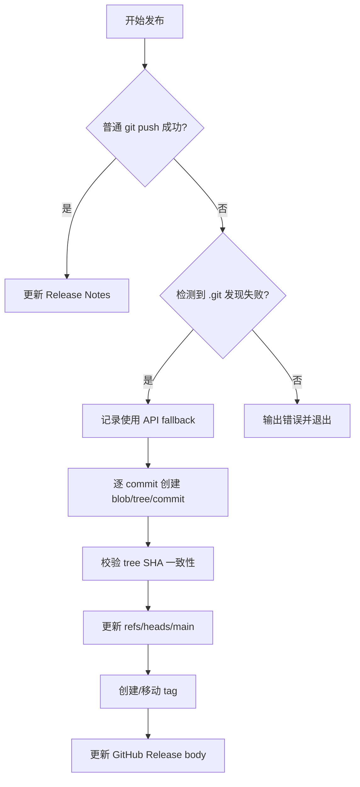
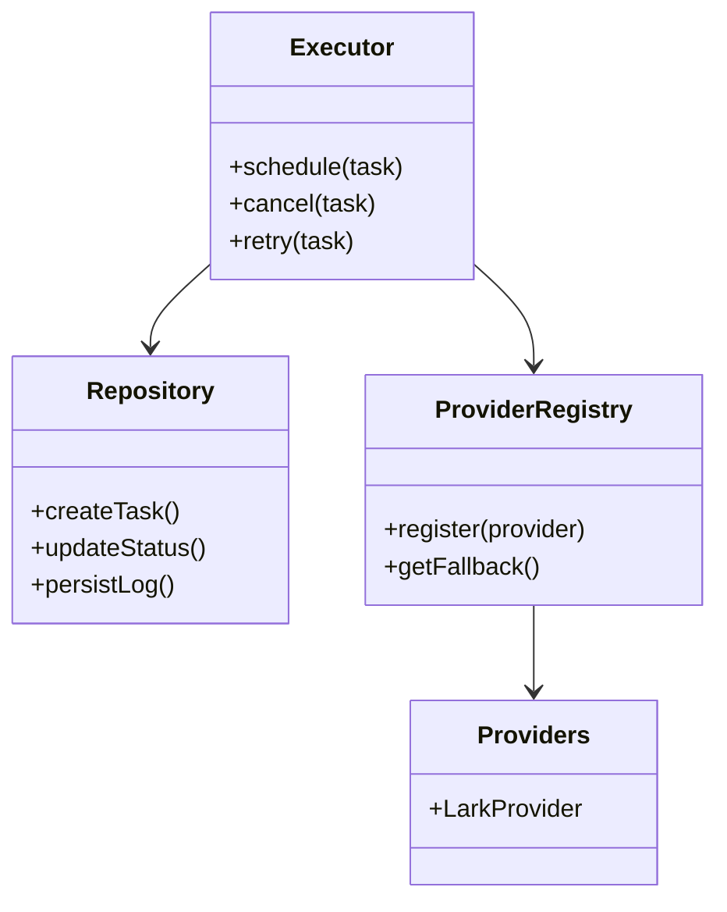
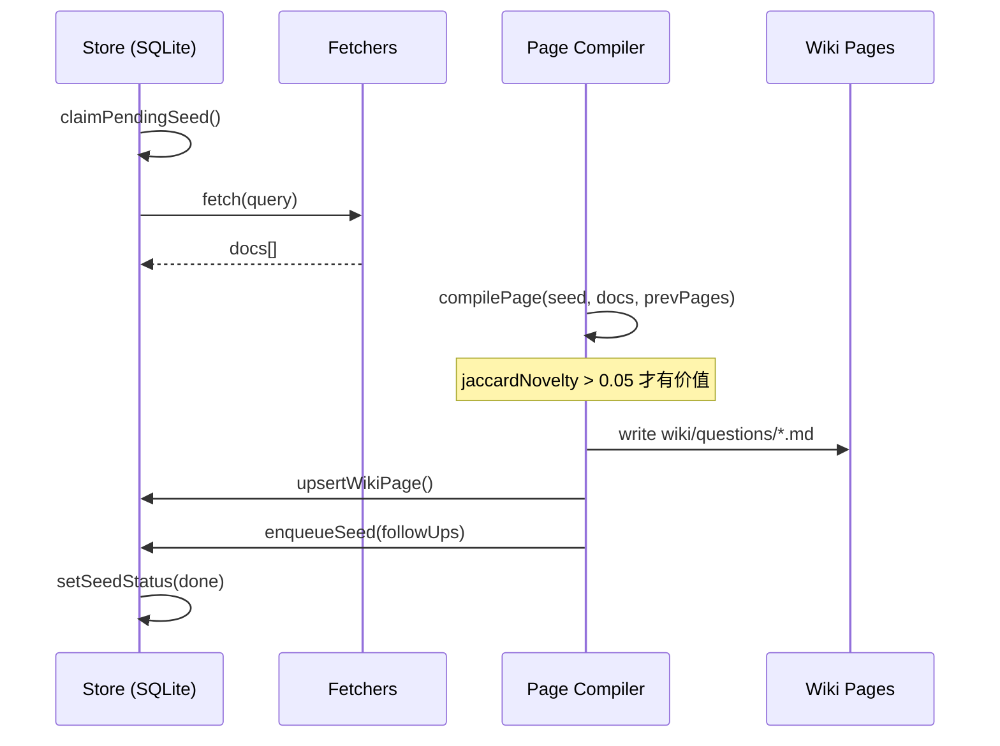

# 竞品功能分析

<cite>
**本文引用的文件**
- [skills/tech-cc-hub-release-deploy/scripts/publish-release.mjs](file://skills/tech-cc-hub-release-deploy/scripts/publish-release.mjs)
- [scripts/github-release.mjs](file://scripts/github-release.mjs)
- [src/electron/libs/system-prompt-presets.ts](file://src/electron/libs/system-prompt-presets.ts)
- [skills/tech-cc-hub-release-deploy/SKILL.md](file://skills/tech-cc-hub-release-deploy/SKILL.md)
- [skills/tech-cc-hub-release-deploy/agents/openai.yaml](file://skills/tech-cc-hub-release-deploy/agents/openai.yaml)
- [pro-workflow/skills/wiki-research-loop/scripts/research-loop.js](file://pro-workflow/skills/wiki-research-loop/scripts/research-loop.js)
- [src/electron/libs/git/README.md](file://src/electron/libs/git/README.md)
- [src/electron/libs/mcp-tools/README.md](file://src/electron/libs/mcp-tools/README.md)
- [src/electron/libs/task/README.md](file://src/electron/libs/task/README.md)
</cite>

## 目录

- [1. 发布与部署能力](#1-发布与部署能力)
- [2. Git 工作台集成](#2-git-工作台集成)
- [3. 任务编排与 Worker 系统](#3-任务编排与-worker-系统)
- [4. System Prompt 预设体系](#4-system-prompt-预设体系)
- [5. MCP 工具生态](#5-mcp-工具生态)
- [6. 知识研究与自动发现](#6-知识研究与自动发现)
- [7. 能力边界与第一版禁止项](#7-能力边界与第一版禁止项)
- [8. 扩展点与配置机制](#8-扩展点与配置机制)

---

## 1. 发布与部署能力

### 1.1 双轨发布机制

tech-cc-hub 采用**正常 Git push + API fallback 双轨机制**。正常情况下通过 `git push` 推送，当 Windows 环境下出现 `.git` 发现失败时，自动降级到 GitHub Git Data API 推送。

流程入口位于 `publish-release.mjs` 的 `main()` 函数（L354-387）：



### 1.2 API Fallback 核心约束

Git Data API 推送有以下硬约束，代码位于 `publish-release.mjs` L251-352：

| 约束 | 说明 | 代码位置 |
|------|------|----------|
| 线性提交范围 | 远端 `main` 必须是本地 `HEAD` 的祖先，否则拒绝 | L267-270 |
| 单父提交 | 每个 commit 必须只有一个父节点 | L175-181 |
| Tree SHA 校验 | GitHub API 返回的 commit SHA 必须等于本地 SHA | L247, L296-298 |
| 凭据优先级 | `GH_TOKEN` > `GITHUB_TOKEN` > `git credential fill` | L75-85 |

### 1.3 发布命令参数

```powershell
# 正常发布 + 移动 tag + 删除旧 release
node skills/tech-cc-hub-release-deploy/scripts/publish-release.mjs --tag v0.1.13 --retag --delete-release

# 只更新发布说明
node skills/tech-cc-hub-release-deploy/scripts/publish-release.mjs --tag v0.1.13 --notes .tmp/release-notes.md --notes-only

# 仅推送 HEAD（无 tag）
node skills/tech-cc-hub-release-deploy/scripts/publish-release.mjs
```

### 1.4 发布验证三连

API fallback 后必须验证一致性（来源：[SKILL.md#L74-81](file://skills/tech-cc-hub-release-deploy/SKILL.md#L74-L81)）：

```powershell
git rev-parse HEAD                    # 本地 HEAD
git rev-parse origin/main            # 本地缓存的远端
git ls-remote --heads origin main   # 真实远端
```

三者 SHA 必须相同，否则检查 tree/commit mismatch 输出。

---

## 2. Git 工作台集成

### 2.1 模块边界

Git 工作台作为 Electron 主进程模块，Renderer 层必须通过 IPC 调用，不直接执行 git 命令。目录结构见 [git/README.md#L1-15](file://src/electron/libs/git/README.md#L1-L15)：

| 文件 | 职责 |
|------|------|
| `types.ts` | Git 工作台领域类型和 IPC payload/result |
| `errors.ts` | Git 错误归一化 |
| `service.ts` | 唯一 Git 操作入口 |
| `history.ts` | Commit history parser |
| `graph.ts` | Lightweight graph lane 生成 |
| `operation-log.ts` | 本地高影响操作日志 |
| `ipc.ts` | Electron IPC handler 注册 |
| `index.ts` | 对外统一出口 |

### 2.2 第一版允许的操作

根据 [git/README.md#L16-25](file://src/electron/libs/git/README.md#L16-L25)，第一版支持：

- Status / diff
- Stage / unstage
- Commit
- Ordinary push
- Create / checkout branch
- Stash save / apply / drop
- Recent history / lightweight graph

### 2.3 第一版禁止的操作

| 禁止操作 | 说明 |
|----------|------|
| reset | 破坏性操作，暂不开放 |
| rebase | 复杂冲突处理超出 MVP 范围 |
| cherry-pick | 需要完整的冲突解决机制 |
| force push | 高风险操作 |
| amend | 需配合历史记录回溯 |
| squash | 需多轮协商和验证 |

---

## 3. 任务编排与 Worker 系统

### 3.1 架构分层

任务系统采用分层架构（来源：[task/README.md#L1-15](file://src/electron/libs/task/README.md#L1-L15)）：



### 3.2 各层职责

| 组件 | 职责 | 设计原则 |
|------|------|----------|
| Provider | 将第三方任务映射为 `ExternalTask`，不直接改 UI 或会话 | 单一职责 |
| Repository | SQLite 持久化：任务状态、执行记录、日志 | 只做持久化 |
| Executor | 唯一调度入口：同步、自动执行、并发控制、重试、恢复 | 编排器模式 |
| Workspace | 每个任务独立 workspace，避免互相污染 | 隔离原则 |

### 3.3 Workflow 配置参数

任务执行使用 Symphony-style workflow 配置（[task/README.md#L11](file://src/electron/libs/task/README.md#L11)）：

- 轮询间隔（stall detection）
- 重试策略与退避参数
- 默认超时阈值

---

## 4. System Prompt 预设体系

### 4.1 预设来源架构

System Prompt 通过 `system-prompt-presets.ts` 的 `buildTechCCHubSystemPromptSources()` 函数（L136-175）构建，返回多个 `PromptLedgerSource`：

```typescript
export function buildTechCCHubSystemPromptSources(): PromptLedgerSource[] {
  return [
    { id: "tech-cc-hub-browser-preset", sourceKind: "system" },
    { id: "tech-cc-hub-admin-preset", sourceKind: "system" },
    { id: "tech-cc-hub-tool-policy-preset", sourceKind: "system" },
    { id: "tech-cc-hub-design-preset", sourceKind: "system" },
    { id: "tech-cc-hub-builtin-mcp-registry-preset", sourceKind: "system" },
    { id: "tech-cc-hub-claude-code-2139-preset", sourceKind: "system" },
  ];
}
```

### 4.2 关键预设模块

| 预设 ID | 功能 | 核心规则 |
|---------|------|----------|
| `browser-preset` | 浏览器工作台规则 | 使用内置 MCP 工具而非外部 skill |
| `admin-preset` | 配置治理规则 | 通过 `set_global_runtime_config` 写 `agent-runtime.json`，不回显密钥明文 |
| `tool-policy-preset` | 工具调用优化 | 批量只读操作，独立并行执行；写操作分离 |
| `design-preset` | 设计还原规则 | 单张参考图先走 `design_inspect_image`；修 UI 先生成 diff 再调整 |
| `mcp-registry-preset` | 内置 MCP 注册 | 基于 `builtin-mcp-registry.js` 的服务器列表 |
| `claude-code-preset` | Claude Code 兼容性 | 调用 `claude-code-compat-registry.js` |

### 4.3 飞书文档直读

飞书文档链接（feishu.cn/wiki/docx/docs）支持直读（[system-prompt-presets.ts#L53-79](file://src/electron/libs/system-prompt-presets.ts#L53-L79)）：

```typescript
export function buildFeishuDocumentFetchPromptAppend(prompt, runtimeEnv) {
  // 需要 LARK_CLI_COMMAND 和 LARK_CLI_PROFILE 同时存在
  const hasLarkCliCommand = Boolean(runtimeEnv.LARK_CLI_COMMAND?.trim());
  const hasLarkCliProfile = Boolean(runtimeEnv.LARK_CLI_PROFILE?.trim());
  // 生成 lark-cli docs +fetch 命令
}
```

触发条件：`LARK_CLI_COMMAND` 和 `LARK_CLI_PROFILE` 环境变量均已设置。

---

## 5. MCP 工具生态

### 5.1 工具分层

MCP 工具集中存放在 `src/electron/libs/mcp-tools/` 目录（来源：[mcp-tools/README.md](file://src/electron/libs/mcp-tools/README.md)）：

| 工具 | 功能范围 | 设计原则 |
|------|----------|----------|
| `browser.ts` | 导航、截图摘要、DOM 查询、样式检查、标注模式 | 内置 BrowserView 工作台能力 |
| `design.ts` | 截图语义分析、截图对比、diff 图、热点区域、JSON report | 设计还原能力 |
| `figma-rest.ts` | Figma 文件/节点读取、设计树、token 提取、Dev Resources | 只读工具面 |
| `admin.ts` | 写入 `agent-runtime.json` 的 `env`、`skillCredentials` 等 | 受控管理能力 |

### 5.2 设计工具默认触发场景

根据 [mcp-tools/README.md#L16-22](file://src/electron/libs/mcp-tools/README.md#L16-L22)：

1. 用户给出截图、Figma 图、页面参考图，并要求生成/修改 UI/前端代码
2. 用户反馈页面和参考图不一致，需要按截图修 UI
3. 单张用户截图先走 `design_inspect_image` 做语义摘要
4. 已有页面候选图后再走截图比照，避免同一张图自己和自己比较

### 5.3 设计工具参数建议

| 参数 | 用途 | 适用场景 |
|------|------|----------|
| `ignoreRegions` | 忽略时间戳、头像、动画等动态区域 | 批量对比时 |
| `maxDifferenceRatio` | 形成通过/失败结论 | 需要验收结论时 |
| `ignoreAntialiasing` | 文字抗锯齿噪声较多时 | 字体对比时 |
| `diffColorMode: directional` | 区分变亮/变暗 | 样式微调时 |

---

## 6. 知识研究与自动发现

### 6.1 研究循环架构

`research-loop.js` 实现自动知识发现流程（[research-loop.js#L161-278](file://pro-workflow/skills/wiki-research-loop/scripts/research-loop.js#L161-L278)）：



### 6.2 关键参数

| 参数 | 默认值 | 说明 |
|------|--------|------|
| `max-pages-per-run` | 5 | 每次运行最多新增页面数 |
| `max-depth` | 3 | 种子查询最大深度 |
| `budget-usd` | 0.50 | 每次运行最大花费 |
| `convergeStreak` | 3 | 连续 3 次 novelty < 0.05 停止 |

### 6.3 种子命令

```bash
# 添加种子查询
research-loop.js seed tech-cc-hub "MCP tool browser integration" --depth 0

# 查看种子状态
research-loop.js seeds tech-cc-hub --status pending

# 取消所有 pending/active 种子
research-loop.js cancel tech-cc-hub

# 查看全局状态
research-loop.js status
```

### 6.4 文档编译逻辑

`compilePage()` 函数（L110-150）提取关键 claim 句子：

1. 按 `.!?` 断句，取前 8 句
2. 句子长度限制：40-400 字符
3. 计算与历史页面的 Jaccard novelty
4. novelty < 0.05 标记为收敛

---

## 7. 能力边界与第一版禁止项

### 7.1 Git 操作禁止清单

| 禁止项 | 原因 | 可替代方案 |
|--------|------|----------|
| reset | 破坏性操作 | 无（暂不支持） |
| rebase | 复杂冲突处理 | 无（暂不支持） |
| cherry-pick | 需完整冲突解决 | 无（暂不支持） |
| force push | 高风险 | 无（暂不支持） |
| amend | 需配合历史记录 | 无（暂不支持） |
| squash | 需多轮协商 | 无（暂不支持） |

### 7.2 设计工具边界

| 边界 | 说明 |
|------|------|
| Host 边界 | 每个工具不直接操作 React UI |
| 摘要原则 | 返回内容尽量是摘要、路径、JSON，避免大图或密钥明文 |
| 写入限制 | 涉及写入磁盘或配置的工具必须有字段 allowlist 和体积上限 |

---

## 8. 扩展点与配置机制

### 8.1 Agent 配置接口

`tech-cc-hub-release-deploy/agents/openai.yaml` 定义 Agent 接口：

```yaml
interface:
  display_name: "tech-cc-hub 发布部署"
  short_description: "提交、推送、移动 tag、打包并更新 tech-cc-hub 的 GitHub Release。"
```

### 8.2 Skill 入口规则

`SKILL.md` 定义了在 `D:\tool\tech-cc-hub` 仓库内的标准操作流程：

1. 先确认范围：`git status --short --branch`、`git diff --stat`
2. 提交前验证：UI/Electron 改动跑定向 `npx eslint`
3. 推送统一用脚本，不裸跑 `git push`
4. 轮询新的 `Release` workflow，不以旧的 `Build and Release` 为准

### 8.3 发布说明格式规范

（来源：[SKILL.md#L82-100](file://skills/tech-cc-hub-release-deploy/SKILL.md#L82-L100)）

- 默认写中文，照顾外部用户时中英双语
- 保持简短、具体
- 必须包含验证步骤
- 可选 English Notes 小节

### 8.4 排障清单

| 症状 | 原因 | 解决方案 |
|------|------|----------|
| `fatal: not a git repository` | Windows git push 抽风 | 加 `--api-only` |
| `origin/main is not an ancestor of HEAD` | 远端已前进 | 先 fetch/rebase |
| `Non-linear API fallback range` | merge commit | 需要手动 rebase 成线性 |
| `GitHub API commit mismatch` | SHA 不一致 | 检查 tree/commit mismatch |

---

## 总结

tech-cc-hub 的竞品能力集中在以下维度：

| 能力域 | 特色 | 竞品对标 |
|--------|------|----------|
| 发布部署 | API fallback 双轨 + 线性提交校验 | 高可靠性 CI/CD |
| Git 工作台 | 主进程 IPC 隔离 + 操作日志 | VS Code GitLens |
| 任务编排 | Provider 适配器 + 独立 Workspace | GitHub Actions |
| MCP 工具 | 设计还原 + 飞书直读 + BrowserView 集成 | Cursor Rules |
| 知识发现 | Jaccard novelty + 深度限制 + 预算控制 | Notion AI |

图表来源：[publish-release.mjs#L354-387](file://skills/tech-cc-hub-release-deploy/scripts/publish-release.mjs#L354-L387)