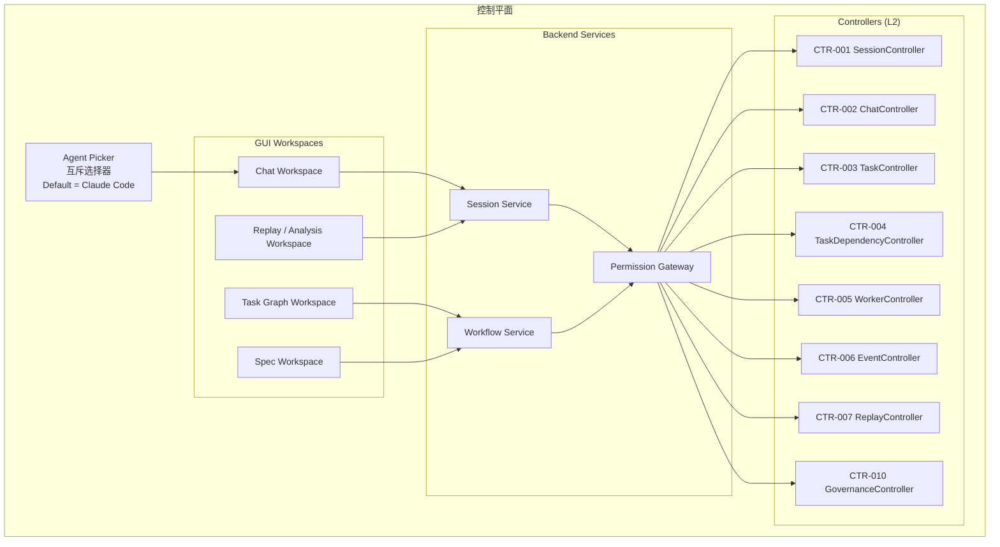
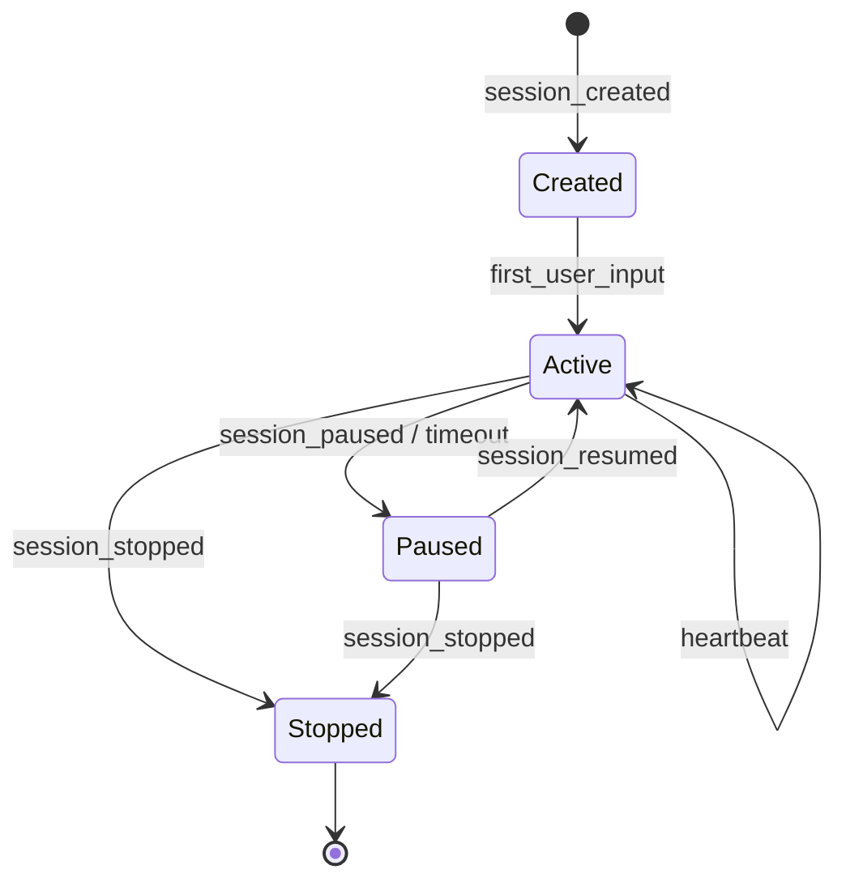
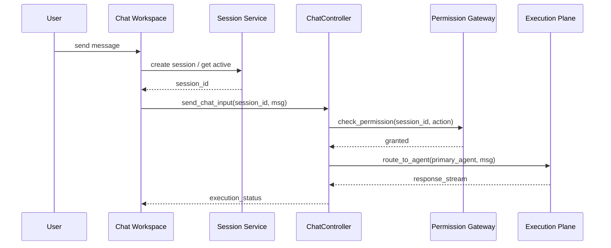
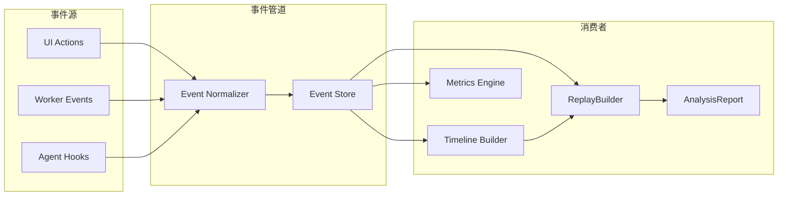
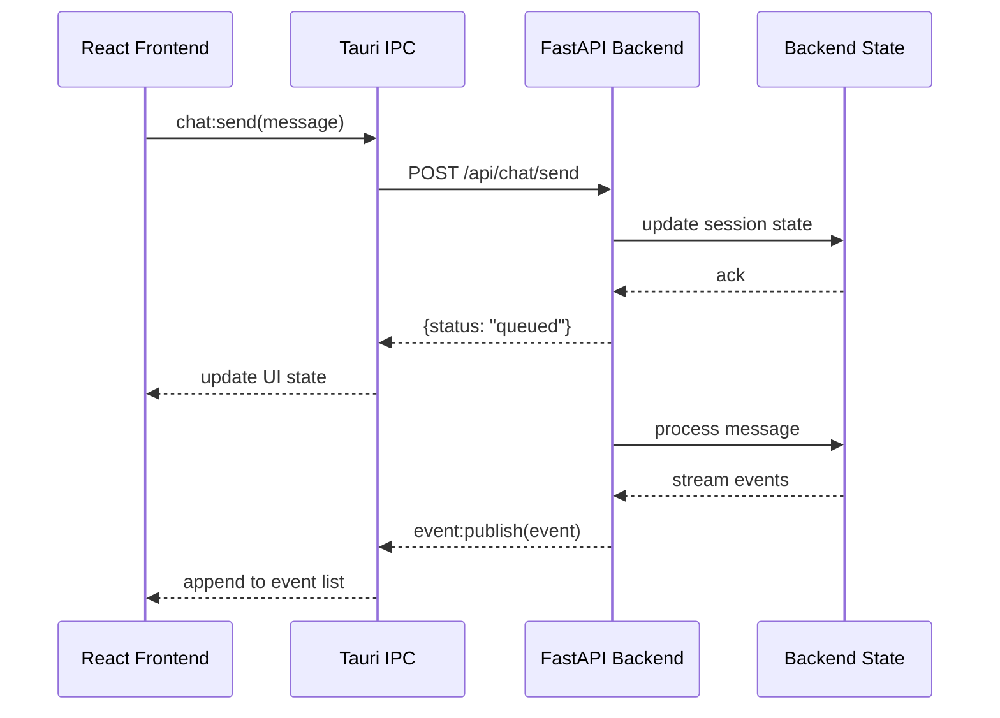

# 控制平面设计

---
doc_id: "CP-DESIGN-001"
title: "控制平面设计"
doc_type: "wiki"
layer: "L2"
status: "active"
version: "1.0.0"
last_updated: "2026-04-19"
owners:
  - "CLAW Core"
tags:
  - "claw"
  - "docs"
  - "control-plane"
  - "architecture"
  - "L2"
---

<cite>

**本文引用的文件**

- [doc/10-architecture/12-控制平面组件图.md](file://doc/10-architecture/12-控制平面组件图.md)
- [doc/10-architecture/10-系统上下文图.md](file://doc/10-architecture/10-系统上下文图.md)
- [doc/10-architecture/11-系统容器图.md](file://doc/10-architecture/11-系统容器图.md)
- [doc/10-architecture/13-执行平面组件图.md](file://doc/10-architecture/13-执行平面组件图.md)
- [doc/10-architecture/14-数据与智能平面组件图.md](file://doc/10-architecture/14-数据与智能平面组件图.md)
- [doc/10-architecture/15-核心流程图.md](file://doc/10-architecture/15-核心流程图.md)
- [doc/40-product/1.0.0/40-delivery/controllers/CTR-001-SessionController.md](file://doc/40-product/1.0.0/40-delivery/controllers/CTR-001-SessionController.md)
- [doc/40-product/1.0.0/40-delivery/controllers/CTR-002-ChatController.md](file://doc/40-product/1.0.0/40-delivery/controllers/CTR-002-ChatController.md)
- [doc/40-product/1.0.0/40-delivery/controllers/CTR-010-GovernanceController.md](file://doc/40-product/1.0.0/40-delivery/controllers/CTR-010-GovernanceController.md)
- [doc/40-product/1.0.0/40-delivery/controllers/CTR-003-TaskController.md](file://doc/40-product/1.0.0/40-delivery/controllers/CTR-003-TaskController.md)
- [doc/40-product/1.0.0/40-delivery/controllers/CTR-004-TaskDependencyController.md](file://doc/40-product/1.0.0/40-delivery/controllers/CTR-004-TaskDependencyController.md)
- [doc/40-product/1.0.0/40-delivery/controllers/CTR-005-WorkerController.md](file://doc/40-product/1.0.0/40-delivery/controllers/CTR-005-WorkerController.md)
- [doc/40-product/1.0.0/40-delivery/controllers/CTR-006-EventController.md](file://doc/40-product/1.0.0/40-delivery/controllers/CTR-006-EventController.md)
- [doc/40-product/1.0.0/40-delivery/controllers/CTR-007-ReplayController.md](file://doc/40-product/1.0.0/40-delivery/controllers/CTR-007-ReplayController.md)

</cite>

# 控制平面设计

## 目录

- [概述](#概述)
- [核心组件架构](#核心组件架构)
- [Session 控制器结构与职责](#session-控制器结构与职责)
- [状态机设计](#状态机设计)
- [控制命令下发机制](#控制命令下发机制)
- [关键代码路径伪代码](#关键代码路径伪代码)
- [事件流与可观测性](#事件流与可观测性)
- [失败模式与排障](#失败模式与排障)
- [前后端桥接与 IPC](#前后端桥接与-ipc)
- [Agent 改代码地图](#agent-改代码地图)

---

## 概述

控制平面是 CLAW Desktop 的**主进程控制链路核心**，负责用户交互、任务编排、状态管理和命令下发。

CLAW 的控制平面架构遵循以下原则：

- **单一 Session 归属**：聊天界面和任务图共享同一 `Session`，避免双轨状态漂移
- **互斥 Agent 选择**：同一时刻只允许一个 `Primary Interactive Agent`（`Claude Code` 或 `Codex`）
- **权限集中决策**：所有治理决策经由 `PermissionGateway` 统一路由
- **证据可回放**：所有控制命令及其结果均记录为 `EventEnvelope`

> **图表来源**：[12-控制平面组件图.md#L22-L25](file://doc/10-architecture/12-控制平面组件图.md#L22-L25)

---

## 核心组件架构

### 一级容器划分

根据系统容器图，控制平面位于 **Backend Runtime** 容器内，与以下容器并列：

| 容器 | 职责 | 关键组件 |
|------|------|----------|
| `Desktop GUI` | 用户交互入口（Tauri + React） | ChatWorkspace, TaskGraphWorkspace |
| `Backend Runtime` | 控制平面和实时接口 | SessionService, WorkflowService |
| `Agent Integration Runtime` | 对外接 Claude Code / Codex | AdapterRegistry, AgentSessionBridge |
| `Storage & Artifacts` | 本地状态持久化 | SpecAsset, RuntimeAsset |
| `Replay & Analysis Engine` | 事件回放与分析生成 | ReplayBuilder, MetricsEngine |

> **图表来源**：[11-系统容器图.md#L35-L53](file://doc/10-architecture/11-系统容器图.md#L35-L53)

### 控制平面内部组件



> **图表来源**：[12-控制平面组件图.md#L47-L58](file://doc/10-architecture/12-控制平面组件图.md#L47-L58)

---

## Session 控制器结构与职责

### CTR-001 SessionController

`SessionController` 是控制平面的**状态根节点**，所有用户发起的会话生命周期操作都必须经过此控制器。

#### 核心职责

| 职责 | 说明 | 事件信号 |
|------|------|----------|
| 创建 Session | 初始化新的会话上下文 | `session_created` |
| 查询 Session | 获取会话列表或详情 | - |
| 恢复 Session | 从快照恢复历史会话 | `session_resumed` |
| 停止 Session | 终止正在执行的会话 | `session_stopped` |

#### 数据结构

```
Session {
  id: string                    // 会话唯一标识
  primary_agent: AgentOS        // Claude Code | Codex
  state: SessionState           // active | paused | stopped
  context_snapshot: SnapshotRef // 指向 ContextStore
  created_at: timestamp
  updated_at: timestamp
}
```

#### 入口点

- **GUI 入口**：`ChatWorkspace` 发起 `create session request`
- **恢复入口**：`Replay / Analysis Workspace` 发起 `resume session request`
- **停止入口**：用户通过 UI 或 API 发起 `stop session request`

> **章节来源**：[CTR-001-SessionController.md#L21-L50](file://doc/40-product/1.0.0/40-delivery/controllers/CTR-001-SessionController.md#L21-L50)

---

## 状态机设计

### 会话状态机



### 任务节点状态机

每个 `TaskNode` 独立维护状态，与 `WorkerRun` 生命周期绑定：

| TaskNode State | WorkerRun State | 说明 |
|---------------|-----------------|------|
| `pending` | - | 等待调度 |
| `scheduled` | `queued` | 已分配 Worker |
| `running` | `running` | 执行中 |
| `completed` | `success` | 成功完成 |
| `failed` | `failed` / `timeout` | 执行失败 |
| `cancelled` | - | 用户取消 |

### ChatController 状态

`ChatController` 管理 `Primary Interactive Agent` 的执行状态：

```
ChatInput → Routing → Active Agent → Execution Status
                                    ↓
                               interrupt_request
```

> **章节来源**：[15-核心流程图.md#L46-L60](file://doc/10-architecture/15-核心流程图.md#L46-L60)
> **章节来源**：[CTR-002-ChatController.md#L33-L41](file://doc/40-product/1.0.0/40-delivery/controllers/CTR-002-ChatController.md#L33-L41)

---

## 控制命令下发机制

### 命令类型

| 命令类型 | 来源 | 目标 | 事件信号 |
|---------|------|------|----------|
| `create_session` | ChatWorkspace | SessionService | `session_created` |
| `send_chat_input` | ChatWorkspace | ChatController | `user_input_submitted` |
| `select_agent` | AgentPicker | ChatController | `chat_agent_selected` |
| `create_task` | TaskGraphWorkspace | TaskController | `task_created` |
| `add_dependency` | TaskGraphWorkspace | TaskDependencyController | `task_dependency_added` |
| `assign_worker` | WorkflowService | WorkerController | `worker_assigned` |
| `retry_task` | UI/API | WorkerController | `task_requeued` |
| `interrupt_session` | UI/API | SessionService | `session_interrupted` |
| `permission_decision` | GovernanceController | PermissionGateway | `permission_decided` |
| `conflict_resolve` | GovernanceController | PermissionGateway | `conflict_resolved` |

### 下发链路



### 命令路由规则

1. **Agent 互斥规则**：聊天输入区同一时刻只允许一个 `Primary Interactive Agent` 激活
2. **任务图多 Agent**：不同 `TaskNode` 可绑定不同 AgentOS，通过 `Hub Orchestrator` 协调
3. **权限集中**：所有敏感操作（文件写入、权限请求）经 `PermissionGateway` 决策

> **章节来源**：[12-控制平面组件图.md#L86-L95](file://doc/10-architecture/12-控制平面组件图.md#L86-L95)
> **章节来源**：[15-核心流程图.md#L77-L94](file://doc/10-architecture/15-核心流程图.md#L77-L94)

---

## 关键代码路径伪代码

### 1. 会话创建流程

```python
# 伪代码：SessionService.create_session()
def create_session(primary_agent: AgentOS) -> Session:
    session_id = generate_uuid()

    # 1. 创建 Session 记录
    session = Session(
        id=session_id,
        primary_agent=primary_agent,
        state=SessionState.ACTIVE,
        created_at=now()
    )

    # 2. 初始化 ContextSnapshot
    snapshot = ContextStore.create_snapshot(session_id)
    session.context_snapshot = snapshot.ref

    # 3. 发布事件
    EventBus.publish("session_created", {
        "session_id": session_id,
        "primary_agent": primary_agent
    })

    return session
```

### 2. 任务依赖校验

```python
# 伪代码：TaskDependencyController.add_dependency()
def add_dependency(parent_id: TaskID, child_id: TaskID) -> Result:
    # 1. 循环依赖检测
    if detect_cycle(parent_id, child_id):
        EventBus.publish("task_dependency_rejected", {
            "reason": "cycle_detected",
            "parent_id": parent_id,
            "child_id": child_id
        })
        raise CycleDetectedError()

    # 2. 添加依赖关系
    dependency = TaskDependency(parent=parent_id, child=child_id)
    DependencyStore.save(dependency)

    # 3. 触发调度重新评估
    WorkflowService.reevaluate_schedule(parent_id)

    EventBus.publish("task_dependency_added", {
        "parent_id": parent_id,
        "child_id": child_id
    })
```

### 3. Worker 分配与执行

```python
# 伪代码：WorkerController.assign_worker()
def assign_worker(task_id: TaskID, agent: AgentOS) -> WorkerRun:
    # 1. 创建 WorkerRun
    worker_run = WorkerRun(
        id=generate_uuid(),
        task_id=task_id,
        agent_os=agent,
        state=WorkerState.QUEUED
    )

    # 2. 从 AdapterRegistry 获取适配器
    adapter = AdapterRegistry.get(agent)

    # 3. 启动 Worker
    Hub.orchestrate(task_id, adapter, worker_run)

    EventBus.publish("worker_assigned", {
        "worker_run_id": worker_run.id,
        "task_id": task_id,
        "agent": agent
    })

    return worker_run
```

### 4. 治理决策流程

```python
# 伪代码：GovernanceController.handle_permission_request()
def handle_permission_request(session_id: SessionID, action: Action) -> Decision:
    # 1. 收集上下文
    context = {
        "session": SessionStore.get(session_id),
        "action": action,
        "risk_level": assess_risk(action)
    }

    # 2. 决策路由
    if context.risk_level == "low":
        decision = Decision.AUTO_APPROVED
    elif context.risk_level == "high":
        decision = Decision.REQUIRES_HUMAN_APPROVAL
    else:
        decision = Decision.REQUIRES_USER_CONFIRMATION

    EventBus.publish("permission_requested", {
        "session_id": session_id,
        "action": action,
        "decision": decision
    })

    return decision
```

> **图表来源**：[CTR-010-GovernanceController.md#L24-L37](file://doc/40-product/1.0.0/40-delivery/controllers/CTR-010-GovernanceController.md#L24-L37)

---

## 事件流与可观测性

### 关键事件类型

| 事件名 | 触发时机 | 关键字段 |
|--------|---------|----------|
| `session_created` | 新建会话 | session_id, primary_agent |
| `session_resumed` | 恢复会话 | session_id, snapshot_id |
| `session_stopped` | 停止会话 | session_id, reason |
| `session_interrupted` | 中断执行 | session_id |
| `chat_agent_selected` | 选择 Agent | session_id, agent |
| `user_input_submitted` | 提交输入 | session_id, content_hash |
| `task_created` | 创建任务 | task_id, session_id |
| `task_updated` | 更新任务 | task_id, changes |
| `task_dependency_added` | 添加依赖 | parent_id, child_id |
| `task_dependency_rejected` | 循环依赖拒绝 | parent_id, child_id |
| `worker_assigned` | 分配 Worker | worker_run_id, task_id |
| `worker_state_changed` | Worker 状态变更 | worker_run_id, new_state |
| `task_requeued` | 重试任务 | task_id |
| `task_result_written` | 结果回写 | task_id, result_summary |
| `permission_requested` | 权限请求 | session_id, action |
| `permission_decided` | 权限决策 | session_id, action, decision |
| `conflict_detected` | 冲突检测 | conflict_id, type |
| `conflict_resolved` | 冲突解决 | conflict_id |
| `human_intervened` | 人工介入 | session_id, action |
| `event_normalized` | 事件归一化 | event_id, source |
| `timeline_subscription_started` | 时间线订阅 | session_id |
| `replay_generated` | 回放生成 | replay_id, session_id |
| `replay_generation_failed` | 回放生成失败 | replay_id, error |

### 事件流向



> **图表来源**：[14-数据与智能平面组件图.md#L44-L54](file://doc/10-architecture/14-数据与智能平面组件图.md#L44-L54)

### 事件契约

```typescript
// EventEnvelope 结构
interface EventEnvelope {
  event_id: string;        // 全局唯一
  event_type: string;      // 如 "task_created"
  session_id: string;      // 关联会话
  task_id?: string;        // 关联任务（可选）
  timestamp: number;       // 事件时间戳
  source: string;          // 来源组件
  payload: object;         // 事件数据
  trace_id: string;        // 用于链路追踪
}
```

> **章节来源**：[CTR-006-EventController.md#L24-L35](file://doc/40-product/1.0.0/40-delivery/controllers/CTR-006-EventController.md#L24-L35)

---

## 失败模式与排障

### 常见失败模式

| 失败模式 | 症状 | 诊断步骤 |
|---------|------|----------|
| **双轨状态漂移** | 聊天和任务图状态不一致 | 检查 Session 共享是否正常 |
| **权限决策散落** | 人工干预链路不可回放 | 检查 PermissionGateway 调用路径 |
| **多 Agent 同时激活** | 会话归属混乱 | 检查 AgentPicker 互斥逻辑 |
| **Hook 差异污染** | Claude/Codex 输出格式不一 | 检查 HookNormalizer 实现 |
| **Merge 不完整** | 回放缺少关键上下文 | 检查 MergeEngine 逻辑 |
| **循环依赖** | 任务图死锁 | 检查 TaskDependencyController 校验 |
| **事件丢失** | 回放不完整 | 检查 EventStore 持久化 |
| **Worker 超时** | 任务永久阻塞 | 检查 WorkerManager 超时配置 |

### 排障命令

```bash
# 查看 Session 列表和状态
curl http://localhost:8080/api/sessions

# 查看特定 Session 的事件流
curl http://localhost:8080/api/sessions/{session_id}/events

# 查看 Worker 状态
curl http://localhost:8080/api/workers

# 查看任务依赖图
curl http://localhost:8080/api/tasks/{task_id}/dependencies

# 查看权限决策记录
curl http://localhost:8080/api/governance/decisions

# 查看回放文档
curl http://localhost:8080/api/replays/{replay_id}
```

### 运行时边界

- **ContextStore 刷新**：每次 `WorkerResult` 返回时触发 `full_sync`，需重启服务以清除内存缓存
- **EventStore 持久化**：事件写入后直接落盘，重启后仍可查询
- **Snapshot 更新**：通过 `ContextStore.load latest snapshot` 加载最新快照
- **冲突检测**：在 `Hub.orchestrate()` 中实时检测，发现冲突后写入 `ConflictRecord`

> **章节来源**：[12-控制平面组件图.md#L92-L95](file://doc/10-architecture/12-控制平面组件图.md#L92-L95)
> **章节来源**：[15-核心流程图.md#L77-L94](file://doc/10-architecture/15-核心流程图.md#L77-L94)

---

## 前后端桥接与 IPC

### IPC 通道定义

| 通道名 | 方向 | 用途 |
|--------|------|------|
| `session:create` | Frontend → Backend | 创建新会话 |
| `session:list` | Frontend → Backend | 获取会话列表 |
| `session:resume` | Frontend → Backend | 恢复会话 |
| `chat:send` | Frontend → Backend | 发送聊天消息 |
| `chat:stream` | Backend → Frontend | 流式响应 |
| `task:create` | Frontend → Backend | 创建任务 |
| `task:update` | Frontend → Backend | 更新任务 |
| `event:subscribe` | Frontend → Backend | 订阅事件流 |
| `event:publish` | Backend → Frontend | 推送事件 |
| `worker:state` | Backend → Frontend | Worker 状态更新 |
| `governance:decision` | Frontend → Backend | 提交治理决策 |

### 技术栈

- **Frontend**：Tauri + React，通过 IPC 调用后端 API
- **Backend**：FastAPI + WebSocket，处理请求并推送实时更新
- **协议**：`JSON over IPC`，详见 [doc/20-contracts/ipc/spec.md](file://doc/20-contracts/ipc/spec.md)

### Source of Truth

| 数据类型 | Source of Truth | 运行时刷新 |
|---------|-----------------|-----------|
| Session 状态 | Backend Runtime | 内存 + EventStore |
| Task 图 | Backend Runtime | 内存 + EventStore |
| Context | ContextStore | 每次 WorkerResult 刷新 |
| 事件流 | EventStore | 追加写入 |
| Worker 状态 | WorkerManager | 内存 |

### UI 状态与后端同步



> **章节来源**：[doc/40-product/1.0.0/40-delivery/45-API与服务映射.md](file://doc/40-product/1.0.0/40-delivery/45-API与服务映射.md)

---

## Agent 改代码地图

### 先读文件顺序

1. **架构总览**：先读 `12-控制平面组件图.md` 理解组件关系
2. **容器位置**：读 `11-系统容器图.md` 定位 Backend Runtime 容器
3. **流程联动**：读 `15-核心流程图.md` 理解消息路由链路
4. **控制器规格**：按需读取对应 Controller 的 PRD 文档
5. **事件规范**：读 `24-事件模型与可观测规范.md` 理解事件契约

### 关键符号与 IPC

| 符号类型 | 名称 | 位置/定义 |
|---------|------|----------|
| **Service** | `SessionService` | Backend Runtime 核心服务 |
| **Service** | `WorkflowService` | Backend Runtime 核心服务 |
| **Service** | `PermissionGateway` | 权限集中决策点 |
| **Service** | `Hub` | Hub Orchestrator |
| **Service** | `WorkerManager` | Worker 生命周期管理 |
| **Service** | `AdapterRegistry` | Agent 适配器注册表 |
| **Service** | `MergeEngine` | 结果合并引擎 |
| **Service** | `EventNormalizer` | 事件归一化 |
| **Controller** | `CTR-001 SessionController` | 会话生命周期 |
| **Controller** | `CTR-002 ChatController` | 聊天交互 |
| **Controller** | `CTR-003 TaskController` | 任务节点 CRUD |
| **Controller** | `CTR-004 TaskDependencyController` | 依赖关系管理 |
| **Controller** | `CTR-005 WorkerController` | Worker 调度控制 |
| **Controller** | `CTR-006 EventController` | 事件订阅查询 |
| **Controller** | `CTR-007 ReplayController` | 回放生成控制 |
| **Controller** | `CTR-010 GovernanceController` | 权限与治理 |
| **IPC Channel** | `session:*` | 会话相关 IPC |
| **IPC Channel** | `chat:*` | 聊天相关 IPC |
| **IPC Channel** | `task:*` | 任务相关 IPC |
| **IPC Channel** | `event:*` | 事件流 IPC |
| **IPC Channel** | `worker:state` | Worker 状态推送 |
| **IPC Channel** | `governance:decision` | 治理决策 IPC |
| **Store** | `ContextStore` | 上下文存储 |
| **Store** | `EventStore` | 事件存储 |
| **Store** | `RuntimeAsset Store` | 运行时资产存储 |

### 修改入口点

| 修改目标 | 入口文件/符号 | 影响范围 |
|---------|--------------|----------|
| 新增 Session 状态 | `SessionService.create_session()` | 整个控制平面 |
| 修改 Agent 路由 | `ChatController.send_chat_input()` | 聊天交互 |
| 新增任务类型 | `TaskController` + `TaskNode` schema | 任务图 UI |
| 修改依赖规则 | `TaskDependencyController.add_dependency()` | 任务调度 |
| 调整 Worker 策略 | `WorkerManager.assign_worker()` | 执行平面 |
| 修改权限决策 | `PermissionGateway.check()` | 治理链路 |
| 新增事件类型 | `EventNormalizer.normalize()` | 可观测性 |
| 修改回放格式 | `ReplayBuilder.build()` | 回放与分析 |

### 验证命令

```bash
# 单元测试
pytest tests/unit/test_session_controller.py
pytest tests/unit/test_chat_controller.py
pytest tests/unit/test_task_controller.py

# 集成测试
pytest tests/integration/test_session_lifecycle.py
pytest tests/integration/test_event_flow.py

# 手动验证
# 1. 启动服务
python -m claw.backend

# 2. 创建会话
curl -X POST http://localhost:8080/api/sessions \
  -H "Content-Type: application/json" \
  -d '{"primary_agent": "claude_code"}'

# 3. 发送消息
curl -X POST http://localhost:8080/api/chat/send \
  -H "Content-Type: application/json" \
  -d '{"session_id": "<session_id>", "content": "hello"}'

# 4. 查询事件
curl http://localhost:8080/api/sessions/<session_id>/events

# 5. 检查 Worker 状态
curl http://localhost:8080/api/workers
```

### 常见回归风险

| 风险点 | 原因 | 预防措施 |
|--------|------|----------|
| **Session 状态不一致** | 并发修改 Session | 使用锁或事务 |
| **事件丢失** | EventStore 写入失败 | 幂等重试 |
| **循环依赖** | 依赖校验逻辑缺陷 | 增加循环检测 |
| **Worker 泄漏** | 任务完成未释放 Worker | 检查 WorkerManager 回收逻辑 |
| **权限绕过** | Gateway 决策逻辑漏洞 | 全面回归治理测试 |
| **回放不完整** | MergeEngine 合并不充分 | 端到端回放测试 |
| **Agent 路由错误** | 多 Agent 同时激活 | AgentPicker 互斥检查 |

### 表结构（Schema）

```sql
-- Session 表
CREATE TABLE sessions (
    id TEXT PRIMARY KEY,
    primary_agent TEXT NOT NULL,
    state TEXT NOT NULL,
    context_snapshot_id TEXT,
    created_at INTEGER,
    updated_at INTEGER
);

-- TaskNode 表
CREATE TABLE task_nodes (
    id TEXT PRIMARY KEY,
    session_id TEXT NOT NULL,
    parent_id TEXT,
    state TEXT NOT NULL,
    agent_os TEXT,
    created_at INTEGER,
    FOREIGN KEY (session_id) REFERENCES sessions(id)
);

-- TaskDependency 表
CREATE TABLE task_dependencies (
    parent_id TEXT NOT NULL,
    child_id TEXT NOT NULL,
    PRIMARY KEY (parent_id, child_id)
);

-- WorkerRun 表
CREATE TABLE worker_runs (
    id TEXT PRIMARY KEY,
    task_id TEXT NOT NULL,
    agent_os TEXT NOT NULL,
    state TEXT NOT NULL,
    created_at INTEGER,
    FOREIGN KEY (task_id) REFERENCES task_nodes(id)
);

-- Event 表
CREATE TABLE events (
    event_id TEXT PRIMARY KEY,
    event_type TEXT NOT NULL,
    session_id TEXT,
    task_id TEXT,
    timestamp INTEGER,
    source TEXT,
    payload TEXT
);
```

> **章节来源**：[doc/28-关键对象最小Schema.md](file://doc/20-specs/28-关键对象最小Schema.md)

---

## 总结

控制平面是 CLAW 的**主进程控制链路和状态管理架构核心**，通过以下设计保证系统可靠性和可观测性：

1. **单一 Session 归属**：聊天和任务图共享状态，避免双轨漂移
2. **互斥 Agent 选择**：通过 `Agent Picker` 保证路由确定性
3. **权限集中决策**：通过 `PermissionGateway` 统一治理
4. **事件驱动追踪**：所有操作产生 `EventEnvelope`，支撑回放和分析
5. **分层控制器**：CTR-001 到 CTR-010 各司其职，职责边界清晰

> **章节来源**：[12-控制平面组件图.md#L21-L34](file://doc/10-architecture/12-控制平面组件图.md#L21-L34)