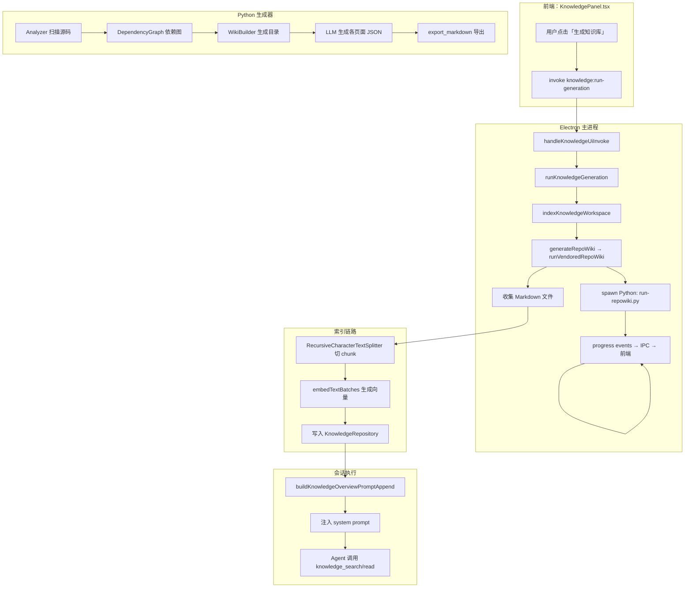
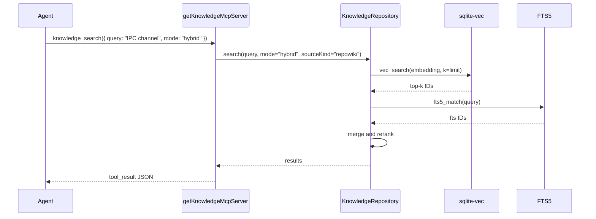
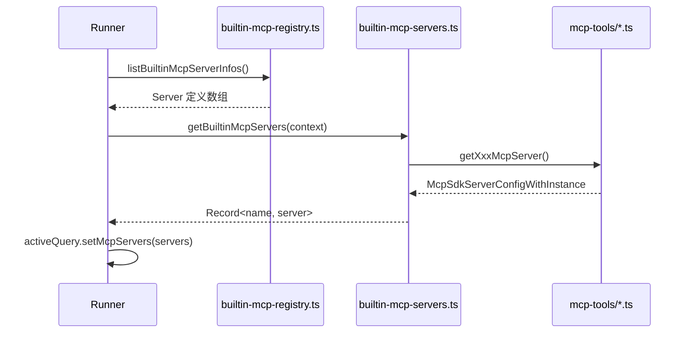

# 知识库与 Repo Wiki 系统

<cite>
**本文引用的文件**

- [src/electron/libs/knowledge/repowiki/intelligence.ts](file://src/electron/libs/knowledge/repowiki/intelligence.ts)
- [src/electron/libs/knowledge/repowiki/engine.ts](file://src/electron/libs/knowledge/repowiki/engine.ts)
- [src/electron/libs/knowledge/knowledge-ui-store.ts](file://src/electron/libs/knowledge/knowledge-ui-store.ts)
- [src/electron/libs/knowledge/repowiki/exporter.ts](file://src/electron/libs/knowledge/repowiki/exporter.ts)
- [src/electron/libs/knowledge/repowiki/prompts.ts](file://src/electron/libs/knowledge/repowiki/prompts.ts)
- [src/electron/libs/mcp-tools/knowledge.ts](file://src/electron/libs/mcp-tools/knowledge.ts)
- [src/ui/components/KnowledgePanel.tsx](file://src/ui/components/KnowledgePanel.tsx)
- [scripts/knowledge/run-repowiki.py](file://scripts/knowledge/run-repowiki.py)
- [scripts/qa/knowledge-engine-smoke.mjs](file://scripts/qa/knowledge-engine-smoke.mjs)
- [scripts/qa/knowledge-chat-injection-smoke.mjs](file://scripts/qa/knowledge-chat-injection-smoke.mjs)
- [src/shared/builtin-mcp-registry.ts](file://src/shared/builtin-mcp-registry.ts)
- [src/electron/libs/builtin-mcp-servers.ts](file://src/electron/libs/builtin-mcp-servers.ts)
- [src/electron/libs/mcp-tools/plan.ts](file://src/electron/libs/mcp-tools/plan.ts)
- [src/electron/libs/mcp-tools/cron.ts](file://src/electron/libs/mcp-tools/cron.ts)
- [src/electron/libs/mcp-tools/browser.ts](file://src/electron/libs/mcp-tools/browser.ts)
- [src/electron/libs/mcp-tools/admin.ts](file://src/electron/libs/mcp-tools/admin.ts)
- [src/electron/libs/mcp-tools/tool-result.ts](file://src/electron/libs/mcp-tools/tool-result.ts)
- [src/electron/libs/runner.ts](file://src/electron/libs/runner.ts)
</cite>

---

## 目录

- [1. 系统定位与核心能力](#1-系统定位与核心能力)
- [2. 生成链路：从触发到产出](#2-生成链路从触发到产出)
- [3. Python 生成器（run-repowiki.py）](#3-python-生成器run-repowikipy)
- [4. 索引链路：Markdown 到向量/FTS](#4-索引链路markdown-到向量fts)
- [5. UI 状态管理（knowledge-ui-store）](#5-ui-状态管理knowledge-ui-store)
- [6. MCP 工具面（mcp-tools/knowledge.ts）](#6-mcp-工具面mcp-toolsknowledgets)
- [7. 聊天注入链路（runner → system prompt）](#7-聊天注入链路runner--system-prompt)
- [8. 内置 MCP Server 体系](#8-内置-mcp-server-体系)
- [9. 数据结构与 SQLite 表](#9-数据结构与-sqlite-表)
- [10. Agent 改代码地图](#10-agent-改代码地图)

---

## 1. 系统定位与核心能力

本系统为 tech-cc-hub 提供两层知识能力：

1. **Repo Wiki 生成**：基于 vendored RepoWiki 引擎，扫描源码、构建依赖图、调用 LLM 生成面向 Agent 的 Markdown Wiki
2. **知识检索与注入**：通过 sqlite-vec 向量索引 + FTS5 混合检索，在会话启动时将知识概览注入 system prompt

核心文件分布：

| 职责 | 文件 |
|------|------|
| Repo Wiki 生成逻辑 | `repowiki/engine.ts`、`repowiki/intelligence.ts`、`repowiki/exporter.ts` |
| Python 适配器 | `scripts/knowledge/run-repowiki.py` |
| 索引与检索 | `knowledge-indexer.ts`、`knowledge-repository.ts` |
| UI 状态 | `knowledge-ui-store.ts`、`KnowledgePanel.tsx` |
| MCP 工具 | `mcp-tools/knowledge.ts` |
| 聊天注入 | `knowledge-overview.ts`、`runner.ts` |

[章节来源](file://src/electron/libs/knowledge/repowiki/intelligence.ts#L1-L13)

---

## 2. 生成链路：从触发到产出

### 2.1 完整数据流



### 2.2 触发入口

前端通过 `invokeKnowledge<KnowledgeRunGenerationResponse>("knowledge:run-generation", payload)` 发起请求，payload 包含 `workspaceRoot` 和 `forceRegenerate`。

后端 IPC handler `handleKnowledgeUiInvoke` 接收后：

1. 调用 `normalizeKey(workspaceKey)` 规范化工作区 key
2. 设置 generation 状态为 `"generating"`，写入 `knowledge_ui_generation` 表
3. 调用 `indexKnowledgeWorkspace(paths, settings, onProgress)`
4. `onProgress` 回调将 `RepoWikiProgressEvent` 转发到前端

[章节来源](file://src/electron/libs/knowledge/knowledge-ui-store.ts#L319-L405)

---

## 3. Python 生成器（run-repowiki.py）

### 3.1 入口与参数

```bash
python scripts/knowledge/run-repowiki.py \
  --workspace /path/to/workspace \
  --output .tech/repowiki/zh \
  --cache .tech/repowiki-cache.sqlite \
  --model anthropic/claude-3-5-sonnet \
  --api-base https://api.anthropic.com \
  --language zh \
  --concurrency 4 \
  --max-files 0 \
  --max-file-size 262144
```

关键环境变量：

- `TECH_CC_HUB_PYTHON` / `PYTHON`：Python 解释器路径
- `TECH_CC_HUB_REPOWIKI_CONCURRENCY` / `REPOWIKI_CONCURRENCY`：并发数（默认 free=2, paid=6）
- `REPOWIKI_MAX_FILES`：最大扫描文件数
- `TECH_CC_HUB_REPOWIKI_FILE_PAGE_LIMIT`：每个文件的最大 Markdown 页数

[章节来源](file://src/electron/libs/knowledge/repowiki/engine.ts#L50-L60)

### 3.2 生成阶段（Progress Stage）

`parseRepoWikiProgress` 函数将 Python stdout 解析为 `RepoWikiProgressEvent`，stage 包括：

| Stage | 触发条件 | completed/total |
|-------|----------|-----------------|
| `planning` | "Planning wiki catalogs" | - |
| `modules` | "Analyzing N modules" / "Analyzed module N/M" | ✓ |
| `architecture` | "Detecting architecture" | - |
| `reading-guide` | "Creating reading guide" | - |
| `done` | "Done" | - |
| `embedding` | 模型 embedding 阶段 | ✓ |
| `indexing` | 写入数据库阶段 | ✓ |
| `message` | 其他日志行 | - |

[章节来源](file://src/electron/libs/knowledge/repowiki/engine.ts#L86-L143)

### 3.3 生成产物

Python 输出 JSON 结果（从 stdout 最后一行的有效 JSON），包含：

```json
{
  "success": true,
  "engine": "tech-cc-hub/qoder-style-repowiki",
  "projectName": "my-project",
  "scannedFiles": 420,
  "totalLines": 18500,
  "pageCount": 64,
  "generatedFiles": ["project-introduction.md", "src/shared/..."],
  "tokens": { "input": 120000, "output": 45000, "cost": 2.3 }
}
```

---

## 4. 索引链路：Markdown 到向量/FTS

### 4.1 Chunk 策略

- 使用 `RecursiveCharacterTextSplitter` 切分 Markdown
- 默认 chunk 大小由 `embedding.dimension` 相关配置决定
- 每个 chunk 记录 `sourceKind`（`agent_card` / `repowiki`）

### 4.2 检索模式

`KnowledgeRepository.search` 支持三种模式：

| mode | 策略 | 适用场景 |
|------|------|----------|
| `shallow` | 仅 FTS5 全文检索 | 关键词精确匹配 |
| `deep` | 仅 sqlite-vec 向量检索 | 语义相似性搜索 |
| `hybrid` | 向量优先 + FTS 补充 | 默认模式，平衡精确与语义 |

`search` 函数签名：

```typescript
repo.search({
  workspaceScope: string,
  query: string,
  mode: KnowledgeSearchMode,
  sourceKind?: "agent_card" | "repowiki" | "memory",
  limit: number,
  queryEmbedding: EmbeddingFloat32Array,
})
```

### 4.3 MCP 工具检索流程



### 4.4 失败恢复

`KnowledgeUiStore` 在 `repairCompletedGenerations` 中检测 stale 生成：

- 条件：`status = 'generating'` 且 `updated_at` 超过 5 分钟（`STALE_GENERATION_REPAIR_MS`）
- 修复：检查 `ACTIVE_KNOWLEDGE_GENERATIONS` 集合，若工作区不在集合中且有文档记录，则更新状态为 `completed`

[章节来源](file://src/electron/libs/knowledge/knowledge-ui-store.ts#L161-L186)

---

## 5. UI 状态管理（knowledge-ui-store）

### 5.1 核心类型

```typescript
type KnowledgeUiWorkspace = {
  key: string;       // workspace root 路径
  cwd: string;
  name: string;
  source: "session" | "manual";
  hidden: boolean;
  updatedAt: number;
};

type KnowledgeUiGeneration = {
  status: "idle" | "generating" | "paused" | "completed";
  completed: number;
  total: number;
  processing: number;
  failed: number;
  phase?: string;
  commitId?: string;
  branch?: string | null;
  updatedAt: number;
};

type KnowledgeUiDocument = {
  id: string;
  workspaceKey: string;
  section: string;
  title: string;
  content: string;
  sortOrder: number;
  updatedAt: number;
};
```

### 5.2 主要方法

| 方法 | 作用 |
|------|------|
| `syncSessionWorkspaces(inputs, systemWorkspace)` | 从会话上下文同步工作区列表 |
| `addWorkspace(cwd, source)` | 添加手动/会话工作区 |
| `updateGeneration(workspaceKey, state)` | 更新生成状态 |
| `completeGeneration(workspaceKey, state)` | 完成生成并收集文档 |
| `replaceDocuments(workspaceKey, documents)` | 替换工作区的文档列表 |
| `listDocuments(workspaceKey)` | 列出工作区文档 |

### 5.3 文档规范化

`collectGeneratedMarkdownDocuments` 遍历 `.tech/repowiki/zh/content` 目录：

1. 读取每个 `.md` 文件
2. 提取 Markdown 标题（H1）
3. 从文件名推断 section（按 `_` 分割或按目录结构）
4. 生成 `uniqueDocumentId`（slugify title）
5. 按 `sortOrder` 排序后写入数据库

[章节来源](file://src/electron/libs/knowledge/knowledge-ui-store.ts#L562-L677)

---

## 6. MCP 工具面（mcp-tools/knowledge.ts）

### 6.1 工具列表

```typescript
export const KNOWLEDGE_TOOL_NAMES = [
  "knowledge_search",
  "knowledge_read",
  "knowledge_explore",
  "knowledge_index",
  "memory_update",
] as const;
```

| 工具名 | 用途 | 关键参数 |
|--------|------|----------|
| `knowledge_search` | 检索知识库 | `query`, `mode` (shallow/deep/hybrid), `source` (cards/repowiki/memory/all), `limit` |
| `knowledge_read` | 读取完整文档 | `id` 或 `path` 或 `title`, `source` |
| `knowledge_explore` | 浏览目录结构 | `source`, `limit` |
| `knowledge_index` | 触发重新索引 | `mode` (scan/generate/refresh) |
| `memory_update` | 更新记忆条目 | `action` (add/update/delete), `title`, `content`, `category`, `scope` |

### 6.2 Schema 详情

**knowledge_search**：
- `query`: 必填，搜索查询
- `mode`: 可选，默认 hybrid
- `source`: 可选，默认 all
- `limit`: 可选，默认 6

**knowledge_index**：
- `mode`: scan=仅索引现有文档；generate=先生成再索引；refresh=按配置自动处理

### 6.3 实现要点

- `openKnowledgeRepository(workspaceRoot)` 打开 `KnowledgeRepository`，检查 `isVectorStoreReady()`
- 若 sqlite-vec 不可用，抛出错误："Knowledge Engine 未启用：sqlite-vec 扩展不可用"
- `memory_update` 需要 `MEMORY_CATEGORIES` 中的有效 category

[章节来源](file://src/electron/libs/mcp-tools/knowledge.ts#L20-L68)

---

## 7. 聊天注入链路（runner → system prompt）

### 7.1 注入时机

新会话启动时，`runner.ts` 中的 `runClaude` 调用 `buildKnowledgeOverviewPromptAppend`：

```typescript
// runner.ts#L47
import { buildKnowledgeOverviewPromptAppend } from "./knowledge/knowledge-overview.js";

// 在构建 system prompt 时追加
const appends = [];
if (sessionOptions.includeKnowledge) {
  appends.push(buildKnowledgeOverviewPromptAppend(cwd, sessionId));
}
```

### 7.2 注入格式

概览以 `<knowledge_overview>` 标签包裹，包含：

1. 工作区元信息（名称、生成状态、文档数量）
2. 目录树结构（section → 文档）
3. 高价值文档摘要（按 signals 权重排序）
4. Agent Cards 信息（来自 `.tech/repowiki/zh/agent-cards`）

### 7.3 验证方式

`scripts/qa/knowledge-chat-injection-smoke.mjs` 验证：

1. 调用 `knowledge:overview` IPC，检查返回值包含 `<knowledge_overview>`
2. 检查概览包含工作区标题和 `<agent_cards>` 标签
3. 启动一个最小会话，Agent 应能识别注入的知识

```javascript
// 关键验证点
overview.includes("<knowledge_overview")  // 概览标签存在
overview.includes(EXPECTED_TITLE)           // 工作区标题存在
overview.includes("<agent_cards")           // Agent Cards 存在
```

[章节来源](file://scripts/qa/knowledge-chat-injection-smoke.mjs#L78-L90)

---

## 8. 内置 MCP Server 体系

### 8.1 Server 注册表

`src/shared/builtin-mcp-registry.ts` 定义 `BUILTIN_MCP_SERVERS` 数组，包含 8 个内置 Server：

| Server Name | Icon | 用途 |
|-------------|------|------|
| `tech-cc-hub-browser` | activity | BrowserView 自动化 |
| `tech-cc-hub-admin` | settings | 全局运行时配置 |
| `tech-cc-hub-design` | sparkles | 设计稿同步 |
| `tech-cc-hub-figma` | figma | Figma API |
| `tech-cc-hub-cron` | timer | 定时任务 |
| `tech-cc-hub-idea` | code | 想法记录 |
| `tech-cc-hub-plan` | list | 任务计划 |
| `tech-cc-hub-knowledge` | book | 知识库检索 |

### 8.2 Factory 映射

`src/electron/libs/builtin-mcp-servers.ts` 维护 `BUILTIN_MCP_SERVER_FACTORIES`：

```typescript
export const BUILTIN_MCP_SERVER_FACTORIES: Record<BuiltinMcpServerName, BuiltinMcpFactory> = {
  "tech-cc-hub-browser": ({ sessionId }) => getBrowserMcpServer(sessionId),
  "tech-cc-hub-admin": () => getAdminMcpServer(),
  "tech-cc-hub-cron": () => getCronMcpServer(),
  "tech-cc-hub-knowledge": ({ cwd }) => getKnowledgeMcpServer(cwd),
  // ...
};
```

### 8.3 Runner 中的 MCP 集成



### 8.4 工具名称汇总

| Server | 工具数量 | 工具名称 |
|--------|----------|----------|
| Browser | 35 | http_ping, diagnose_port, bash_batch, browser_open_page, browser_close_page, browser_get_state, browser_navigate, ... |
| Admin | 1 | set_global_runtime_config |
| Cron | 3 | create_scheduled_task, list_scheduled_tasks, delete_scheduled_task |
| Plan | 1 | update_plan |
| Knowledge | 5 | knowledge_search, knowledge_read, knowledge_explore, knowledge_index, memory_update |

[章节来源](file://src/electron/libs/builtin-mcp-servers.ts#L23-L32)

---

## 9. 数据结构与 SQLite 表

### 9.1 knowledge-ui.sqlite 表

| 表名 | 用途 | 关键列 |
|------|------|--------|
| `knowledge_ui_workspaces` | 工作区元数据 | key(PK), cwd, name, source, hidden, created_at, updated_at |
| `knowledge_ui_generation` | 生成状态 | workspace_key(PK), status, completed, total, processing, failed, phase, commit_id, branch, updated_at |
| `knowledge_ui_documents` | 文档内容 | id, workspace_key(PK), section, title, content, sort_order, created_at, updated_at |

索引：
- `idx_knowledge_ui_workspaces_hidden`：按 hidden + updated_at 排序
- `idx_knowledge_ui_documents_workspace`：按 workspace_key + sort_order 排序

### 9.2 knowledge.sqlite 表（主知识库）

| 表名 | 用途 |
|------|------|
| `documents` | 文档元数据（id, workspace_scope, source_kind, path, title） |
| `chunks` | Chunk 文本（doc_id, chunk_index, content） |
| `fts_chunks` | FTS5 全文索引 |
| `vec_chunks` | sqlite-vec 向量索引 |

### 9.3 运行时状态

- `ACTIVE_KNOWLEDGE_GENERATIONS: Set<string>`：正在生成中的工作区 key 集合，用于防止重复生成
- `knowledgeMcpServers: Map<string, McpSdkServerConfigWithInstance>`：MCP Server 缓存
- `cronServiceRef: CronService | null`：从 main.ts 注入的 CronService 引用

[章节来源](file://src/electron/libs/knowledge/knowledge-ui-store.ts#L81-L139)

---

## 10. Agent 改代码地图

### 10.1 修改前必读文件

| 文件 | 必读原因 |
|------|----------|
| `knowledge-ui-store.ts` | UI 状态与 SQLite 写入逻辑，修改表结构需同步初始化逻辑 |
| `repowiki/engine.ts` | 生成入口，修改 progress 解析需同步前端 `KnowledgePanel.tsx` |
| `mcp-tools/knowledge.ts` | MCP 工具定义，修改 schema 或工具名需同步 registry |
| `builtin-mcp-servers.ts` | Factory 映射，添加/删除 Server 需同步 registry 定义 |

### 10.2 关键符号/IPC/MCP 工具

**IPC Channels（前端 → 主进程）**：
- `knowledge:list`：列出工作区和生成状态
- `knowledge:run-generation`：触发生成
- `knowledge:overview`：获取概览字符串
- `knowledge:documents`：获取文档列表

**MCP Tools**：
- `knowledge_search`、`knowledge_read`、`knowledge_explore`、`knowledge_index`、`memory_update`

**SQLite 表**：
- `knowledge_ui_workspaces`、`knowledge_ui_generation`、`knowledge_ui_documents`

### 10.3 修改入口点

| 修改目标 | 入口文件 | 关键函数 |
|----------|----------|----------|
| 添加新生成 stage | `repowiki/engine.ts` | `parseRepoWikiProgress` |
| 修改 UI 状态格式 | `knowledge-ui-store.ts` | `normalizeGeneration`、`repairCompletedGenerations` |
| 添加新 MCP 工具 | `mcp-tools/knowledge.ts` | `SEARCH_SCHEMA`、`readHandler` |
| 修改聊天注入格式 | `knowledge-overview.ts` | `buildKnowledgeOverviewPromptAppend` |
| 修改 Prompt 模板 | `repowiki/prompts.ts` | `buildOverviewPrompt`、`buildModulePrompt` |

### 10.4 验证命令

**本地 Smoke 测试**：
```bash
# 知识库引擎 smoke
node scripts/qa/knowledge-engine-smoke.mjs

# 聊天注入 smoke
node scripts/qa/knowledge-chat-injection-smoke.mjs

# 设置工作区
export KNOWLEDGE_QA_WORKSPACE=/path/to/workspace
```

**手动验证**：
```bash
# 检查 SQLite 表
sqlite3 knowledge-ui.sqlite "SELECT * FROM knowledge_ui_generation;"

# 检查生成产物
ls -la .tech/repowiki/zh/content/
cat .tech/repowiki/zh/meta/repowiki-metadata.json

# 检查向量索引
sqlite3 knowledge.sqlite "SELECT COUNT(*) FROM vec_chunks;"
```

### 10.5 常见回归风险

| 风险 | 表现 | 规避 |
|------|------|------|
| Python 路径找不到 | "找不到 vendored RepoWiki" | 检查 `third_party/repowiki` 是否存在 |
| sqlite-vec 不可用 | "Knowledge Engine 未启用" | 确认构建包含 sqlite-vec 扩展 |
| stale 状态未清理 | generation 一直显示 generating | 检查 `ACTIVE_KNOWLEDGE_GENERATIONS` 清理逻辑 |
| MCP tool name 拼写错误 | 工具无法注册 | 同步 `KNOWLEDGE_TOOL_NAMES` 和 registry |
| document id 重复 | `uniqueDocumentId` 碰撞 | 检查 `slugifyDocumentId` 和 `normalizeKey` |

### 10.6 前后端桥接点

- **Source of Truth**：`knowledge-ui.sqlite`（主进程写入，前端读）
- **运行时刷新**：工作区列表在 `syncSessionWorkspaces` 时更新
- **重启边界**：MCP Server 在会话启动时创建，`planMcpServer` 等使用单例模式缓存

---

## 图表来源

- [数据流图](file://src/electron/libs/knowledge/knowledge-ui-store.ts#L405-L578)：展示生成、索引、检索链路
- [MCP 检索时序图](file://src/electron/libs/mcp-tools/knowledge.ts#L139-L208)：展示 search → vector → FTS 流程
- [MCP Server 集成图](file://src/electron/libs/builtin-mcp-servers.ts#L45-L58)：展示 registry → factory → tool 链路