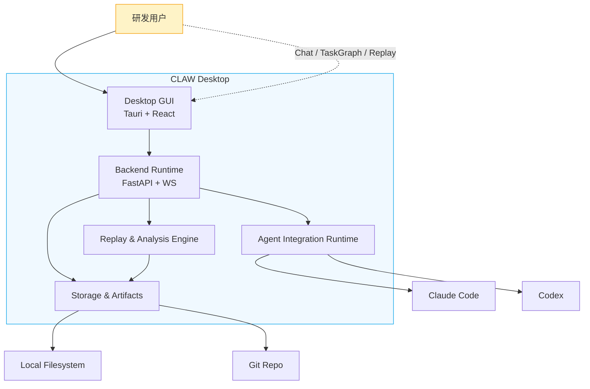
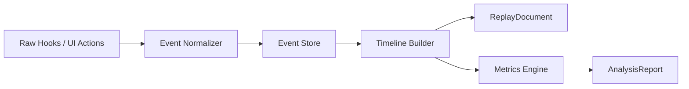
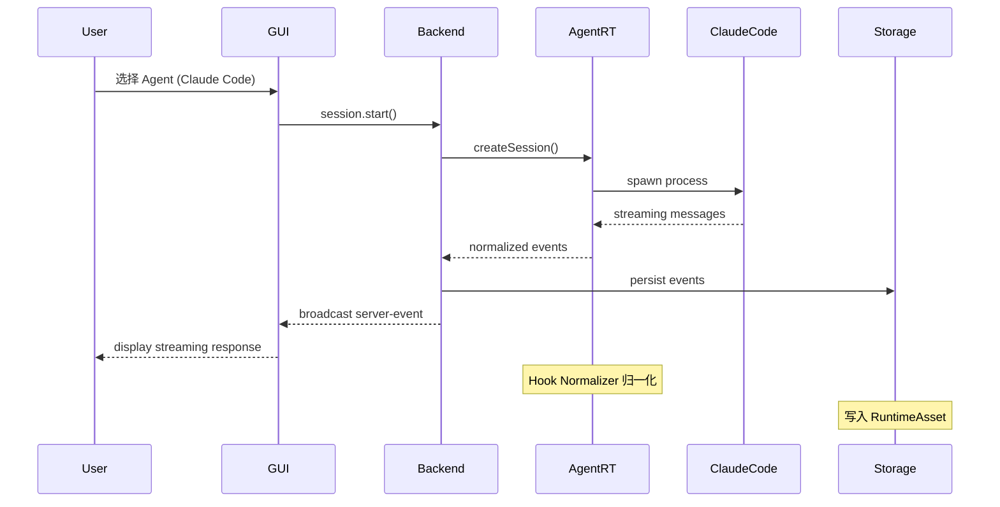

# 系统上下文图

<cite>

**本文引用的文件**

- [doc/10-architecture/10-系统上下文图.md](file://doc/10-architecture/10-系统上下文图.md)
- [doc/10-architecture/11-系统容器图.md](file://doc/10-architecture/11-系统容器图.md)
- [doc/10-architecture/12-控制平面组件图.md](file://doc/10-architecture/12-控制平面组件图.md)
- [doc/10-architecture/13-执行平面组件图.md](file://doc/10-architecture/13-执行平面组件图.md)
- [doc/10-architecture/14-数据与智能平面组件图.md](file://doc/10-architecture/14-数据与智能平面组件图.md)
- [doc/10-architecture/15-核心流程图.md](file://doc/10-architecture/15-核心流程图.md)
- [doc/10-architecture/16-用量与上下文采集架构.md](file://doc/10-architecture/16-用量与上下文采集架构.md)
- [src/electron/libs/agent-rule-docs.ts](file://src/electron/libs/agent-rule-docs.ts#L1-L120)
- [src/electron/libs/knowledge/repowiki/types.ts](file://src/electron/libs/knowledge/repowiki/types.ts#L1-L215)
- [src/ui/render/markdown.tsx](file://src/ui/render/markdown.tsx#L1-L262)
- [scripts/package-win-safe.mjs](file://scripts/package-win-safe.mjs#L1-L186)
- [doc/40-product/1.0.0/10-requirements/10-需求索引.md](file://doc/40-product/1.0.0/10-requirements/10-需求索引.md)
- [doc/40-product/1.0.0/10-requirements/11-FR-聊天与会话控制.md](file://doc/40-product/1.0.0/10-requirements/11-FR-聊天与会话控制.md)
- [doc/40-product/1.0.0/10-requirements/12-FR-任务图与多Agent编排.md](file://doc/40-product/1.0.0/10-requirements/12-FR-任务图与多Agent编排.md)
- [doc/40-product/1.0.0/10-requirements/13-FR-事件流回放与分析.md](file://doc/40-product/1.0.0/10-requirements/13-FR-事件流回放与分析.md)
- [doc/40-product/1.0.0/10-requirements/14-FR-Spec资产与调优.md](file://doc/40-product/1.0.0/10-requirements/14-FR-Spec资产与调优.md)
- [doc/40-product/1.0.0/10-requirements/15-FR-项目工作区与文件管理.md](file://doc/40-product/1.0.0/10-requirements/15-FR-项目工作区与文件管理.md)
- [doc/40-product/1.0.0/10-requirements/16-FR-权限冲突与人工介入.md](file://doc/40-product/1.0.0/10-requirements/16-FR-权限冲突与人工介入.md)

</cite>

## 目录

- [系统上下文概览](#系统上下文概览)
- [外部系统依赖总图](#外部系统依赖总图)
- [外部系统接口类型与数据流](#外部系统接口类型与数据流)
- [核心边界组件职责](#核心边界组件职责)
- [Source of Truth 与运行时边界](#source-of-truth-与运行时边界)
- [Agent 改代码地图](#agent-改代码地图)
- [故障排查与扩展点](#故障排查与扩展点)

---

## 系统上下文概览

### 什么是系统上下文图

系统上下文图定义 CLAW 与外部参与者之间的边界，回答：

- CLAW 与谁交互？
- 交互的职责是什么？
- 数据如何流向哪里？

### 核心参与者

| 参与者 | 角色 | 边界说明 |
|--------|------|----------|
| **研发用户** | 发起方 | 通过 GUI 与 CLAW 交互，不直接操作 AgentOS |
| **Claude Code** | 主要 AgentOS | 默认交互引擎，由 Hub Orchestrator 调度 |
| **Codex** | 备选 AgentOS | 支持多 Agent 编排场景下的并行任务 |
| **本地文件系统** | 存储层 | 承载 SpecAsset、RuntimeAsset、Agent Rules |
| **Git Repo** | 配置同步 | 存储配置类资产，不承载运行时真相 |
| **Optional Model / API** | 扩展能力 | 未来可能接入的外部模型服务 |

> 图表来源：[doc/10-architecture/10-系统上下文图.md#L42-L50](file://doc/10-architecture/10-系统上下文图.md#L42-L50)

### 产品边界核心原则

1. **CLAW 是产品面**：用户面对的主入口，不是 AgentOS 的包装器
2. **AgentOS 是执行引擎**：Claude Code 和 Codex 通过适配器接入，不暴露给用户直接操作
3. **本地文件系统是真相源**：所有运行资产优先落本地，不依赖远程同步
4. **Git 是配置备份**：Agent Rules 等配置可同步，但运行时数据不存入 Git

---

## 外部系统依赖总图



### 图例说明

| 元素 | 含义 |
|------|------|
| 实线箭头 | 主数据流 |
| 虚线（点线） | 用户交互路径 |
| 阴影框 | CLAW 内部容器 |

> 图表来源：[doc/10-architecture/11-系统容器图.md#L43-L53](file://doc/10-architecture/11-系统容器图.md#L43-L53)

---

## 外部系统接口类型与数据流

### 1. 用户 → CLAW GUI

| 接口类型 | 说明 |
|----------|------|
| **聊天输入** | Chat Composer 发起 `user_input_submitted` 事件 |
| **任务图操作** | Task Graph Canvas 编辑 `task_created`、`task_dependency_added` 事件 |
| **回放查看** | Replay Workspace 发起 `replay_generated`、`analysis_generated` 事件 |
| **Spec 资产管理** | Spec Workspace 触发 `spec_created`、`spec_bound` 事件 |

**关键组件**：`ChatComposer`、`TaskGraphCanvas`、`ReplayWorkspace`、`SpecWorkspace`

> 来源：[doc/10-architecture/12-控制平面组件图.md#L36-L44](file://doc/10-architecture/12-控制平面组件图.md#L36-L44)

### 2. CLAW → AgentOS（Claude Code / Codex）

| 接口类型 | 说明 |
|----------|------|
| **Session Control** | 创建、继续、中断会话 |
| **Message Transport** | 双向消息流，含流式响应 |
| **Event Normalization** | 统一 Hook 事件格式 |

**调用链**：

```
User → ChatWorkspace → SessionService → AdapterRegistry
                                        ↓
                               ┌────────┴────────┐
                               ↓                 ↓
                     ClaudeCode Adapter    Codex Adapter
                               ↓                 ↓
                       Claude Code           Codex
```

> 来源：[doc/10-architecture/15-核心流程图.md#L48-L60](file://doc/10-architecture/15-核心流程图.md#L48-L60)

**关键符号**：

- `Hub Orchestrator`：任务分解、调度策略、上下文分发
- `Worker Manager`：`WorkerRun` 生命周期、并发、重试、终止
- `Adapter Registry`：动态选择 Claude Code 或 Codex 适配器
- `Hook Normalizer`：归一化不同 AgentOS 的事件格式
- `Merge Engine`：结果摘要、冲突检测、回写决策

> 来源：[doc/10-architecture/13-执行平面组件图.md#L36-L54](file://doc/10-architecture/13-执行平面组件图.md#L36-L54)

### 3. CLAW → 本地文件系统

| 接口类型 | 说明 |
|----------|------|
| **SpecAsset 读写** | workflow / skill / prompt / policy 资产 |
| **RuntimeAsset 追加** | 事件流、快照、上下文 |
| **Agent Rules** | `CLAUDE.md` 等配置文件 |

**关键路径**：

```typescript
// src/electron/libs/agent-rule-docs.ts L102-111
export function loadAgentRuleDocuments(): AgentRuleDocuments {
  const userClaudeRoot = getUserClaudeRoot();       // 用户目录根路径
  const userAgentsPath = join(userClaudeRoot, USER_AGENTS_FILE);  // "CLAUDE.md"

  return {
    systemDefaultMarkdown: buildSystemDefaultMarkdown(),
    userClaudeRoot,
    userAgentsPath,
    userAgentsMarkdown: existsSync(userAgentsPath) ? safeReadText(userAgentsPath) : "",
  };
}
```

- `userClaudeRoot`：通过 `getUserClaudeRoot()` 获取
- `USER_AGENTS_FILE`：常量 `"CLAUDE.md"`

**Agent Rules 优先级**：

1. 内置系统默认规则（`buildSystemDefaultMarkdown` 构造）
2. 用户自定义 `CLAUDE.md`（`loadAgentRuleDocuments` 加载）
3. 运行时 Profiles（`getSystemAgentProfiles()` 获取）

> 来源：[src/electron/libs/agent-rule-docs.ts#L22-L99](file://src/electron/libs/agent-rule-docs.ts#L22-L99)

### 4. CLAW → Git Repo

| 接口类型 | 说明 |
|----------|------|
| **配置同步** | Agent Rules、Workflow 等配置资产 |
| **不承载运行时真相** | 事件、回放、快照不入 Git |

**失败模式**：若把 Git 当作主运行时存储，会造成回放与状态一致性问题。

> 来源：[doc/10-architecture/10-系统上下文图.md#L65-L67](file://doc/10-architecture/10-系统上下文图.md#L65-L67)

---

## 核心边界组件职责

### Agent Picker（代理选择器）

**职责**：在聊天界面中提供 Claude Code / Codex 的互斥选择

**规则**：

- 同一时刻只允许一个活跃聊天 Agent
- 可选项仅为 `Claude Code` 或 `Codex`
- 默认选中 `Claude Code`
- 多 Agent 协作不通过聊天栏并列激活，而通过 `Task Graph + Hub` 实现

**代码位置**：`src/ui/` 相关组件（见前端信息架构文档）

> 来源：[doc/10-architecture/12-控制平面组件图.md#L86-L90](file://doc/10-architecture/12-控制平面组件图.md#L86-L90)

### Permission Gateway（权限网关）

**职责**：收敛权限决策，支持人工介入和冲突处理

**事件**：

- `permission_requested`
- `permission_decided`
- `conflict_detected`
- `conflict_resolved`
- `human_intervened`

> 来源：[doc/40-product/1.0.0/10-requirements/16-FR-权限冲突与人工介入.md#L36-L70](file://doc/40-product/1.0.0/10-requirements/16-FR-权限冲突与人工介入.md#L36-L70)

### Event Store / Replay Builder

**职责**：将归一化事件持久化，并生成可回放文档

**数据流**：



**关键类型**（`src/electron/libs/knowledge/repowiki/types.ts`）：

```typescript
export type RepoWikiFileSignal = {
  kind: "ipc" | "ui_ipc" | "mcp_tool" | "mcp_server" | "database" | "store" | "event" | "config" | "entrypoint";
  name: string;
  detail?: string;
  line?: number;
};
```

> 来源：[doc/10-architecture/14-数据与智能平面组件图.md#L44-L54](file://doc/10-architecture/14-数据与智能平面组件图.md#L44-L54)
> 来源：[src/electron/libs/knowledge/repowiki/types.ts#L8-L13](file://src/electron/libs/knowledge/repowiki/types.ts#L8-L13)

---

## Source of Truth 与运行时边界

### 主数据真相源

| 数据类型 | Source of Truth | 持久化位置 |
|----------|-----------------|------------|
| 会话消息 | `SDKResultMessage` | SQLite `sessions.db` |
| 任务状态 | `WorkerRun` | SQLite `tasks.db` |
| 事件流 | `EventEnvelope` | 文件系统 `RuntimeAsset` |
| Spec 资产 | `PromptLedgerMessage` | 文件系统 `SpecAsset` |
| Agent Rules | `CLAUDE.md` / 内置规则 | 用户目录 + 内置 |

### 运行时刷新边界

| 组件 | 刷新触发 | 重启需求 |
|------|----------|----------|
| `loadAgentRuleDocuments()` | 应用启动、用户编辑保存 | 不需要（热加载） |
| `saveUserAgentRuleDocument()` | 用户手动保存 | 不需要（同步写入） |
| `ActivityRailModel` | 收到 `stream.message` 事件 | 不需要（状态重建） |
| Prompt Ledger | `session.start` / `session.continue` | 不需要（按需计算） |

> 来源：[doc/10-architecture/16-用量与上下文采集架构.md#L204-L216](file://doc/10-architecture/16-用量与上下文采集架构.md#L204-L216)

### 前后端桥接点

**IPC Channel**：`server-event`

- 后端 → 前端广播事件
- 用于实时 UI 更新

**消息类型**：

```typescript
// 消息 recordMessage 流程 (ipc-handlers.ts L423-492)
emit() → persist() → session-store.recordMessage()
                → broadcast() → webContents.send("server-event", ...)
```

**关键函数**：

- `src/electron/ipc-handlers.ts`：`emit()` 函数处理消息持久化和广播
- `src/electron/libs/runner.ts`：`runClaude()` 通过 `for await` 接收 SDK 消息
- `src/shared/activity-rail-model.ts`：从已持久化消息重建用量指标

> 来源：[doc/10-architecture/16-用量与上下文采集架构.md#L60-L90](file://doc/10-architecture/16-用量与上下文采集架构.md#L60-L90)

---

## Agent 改代码地图

### 先读文件优先级

| 优先级 | 文件 | 理由 |
|--------|------|------|
| 1 | `doc/10-architecture/10-系统上下文图.md` | 理解系统边界 |
| 2 | `doc/10-architecture/11-系统容器图.md` | 理解一级容器职责 |
| 3 | `src/electron/libs/agent-rule-docs.ts` | 理解 Agent Rules 加载逻辑 |
| 4 | `src/electron/libs/knowledge/repowiki/types.ts` | 理解项目情报类型系统 |
| 5 | `src/ui/render/markdown.tsx` | 理解 Mermaid 渲染逻辑 |

### 关键符号与接口

#### Agent Rules 相关

| 符号 | 文件:行 | 说明 |
|------|---------|------|
| `AgentRuleDocuments` | agent-rule-docs.ts:5 | 类型定义，四个字段 |
| `loadAgentRuleDocuments()` | agent-rule-docs.ts:102 | 加载系统默认+用户自定义规则 |
| `saveUserAgentRuleDocument()` | agent-rule-docs.ts:114 | 保存用户编辑的 CLAUDE.md |
| `USER_AGENTS_FILE` | agent-rule-docs.ts:12 | 常量 `"CLAUDE.md"` |
| `buildSystemDefaultMarkdown()` | agent-rule-docs.ts:22 | 构造系统内置规则文本 |

#### 项目情报类型

| 符号 | 文件:行 | 说明 |
|------|---------|------|
| `RepoWikiFileSignal` | types.ts:8 | IPC/MCP/DB/Store 等信号类型 |
| `RepoWikiProjectIntelligence` | types.ts:61 | 项目情报聚合类型 |
| `RepoWikiRuntimeFlow` | types.ts:48 | 运行时流程描述 |
| `RepoWikiHighValueFile` | types.ts:42 | 高价值文件标记 |

#### Mermaid 渲染

| 符号 | 文件:行 | 说明 |
|------|---------|------|
| `MermaidDiagram` | markdown.tsx:89 | React 组件，渲染 Mermaid 图 |
| `mermaidInitialized` | markdown.tsx:19 | 单例标记，防止重复初始化 |
| `getMermaidErrorMessage()` | markdown.tsx:85 | 错误消息提取 |

### 修改入口

#### 场景 1：修改 Agent Rules 加载逻辑

1. 修改 `buildSystemDefaultMarkdown()` 函数（agent-rule-docs.ts L22-99）
2. 修改 `loadAgentRuleDocuments()` 返回值结构（agent-rule-docs.ts L102-112）
3. 修改 `saveUserAgentRuleDocument()` 写入逻辑（agent-rule-docs.ts L114-119）

**验证命令**：

```bash
# 运行 Electron 主进程测试
npm run dev

# 检查规则文档是否正确加载
# 1. 打开聊天界面
# 2. 查看 Agent Picker 右侧是否显示"内置规则已加载"
```

#### 场景 2：扩展 RepoWikiFileSignal 的 kind

1. 修改 `types.ts` L9：`kind` 联合类型添加新值
2. 修改相关解析逻辑（搜索 `RepoWikiFileSignal` 引用）
3. 更新 Wiki 生成逻辑

**常见回归风险**：

- 旧数据中 `kind` 值不匹配导致类型错误
- 解析逻辑未覆盖新 kind 导致信号丢失

#### 场景 3：修改 Mermaid 渲染样式

1. 修改 `markdown.tsx` L111-127：`mermaid.initialize()` 配置
2. 修改 `themeVariables` 对象

**验证命令**：

```bash
# 启动 dev server 查看渲染效果
npm run dev

# 检查文档中的 Mermaid 图是否正确显示
```

### 测试入口

| 测试类型 | 入口文件 | 说明 |
|----------|----------|------|
| 单元测试 | `**/*.test.ts` | 关键函数逻辑 |
| 集成测试 | `src/electron/__tests__/` | IPC 消息流转 |
| E2E 测试 | `tests/e2e/` | 完整用户流程 |

---

## 故障排查与扩展点

### 常见失败模式

| 场景 | 症状 | 排查方向 |
|------|------|----------|
| Agent Rules 未加载 | 聊天界面无规则提示 | 检查 `userClaudeRoot` 是否正确、`CLAUDE.md` 是否存在 |
| 事件未写入 | 回放缺少事件 | 检查 `ipc-handlers.ts` 中 `emit()` 是否被调用、SQLite 是否可写 |
| Mermaid 渲染失败 | 文档中图显示错误信息 | 检查 `markdown.tsx` 中 `renderState.status === "error"` 分支 |
| 任务图状态漂移 | 节点状态与实际不符 | 检查 `Worker Manager` 是否正确更新 `WorkerRun` 生命周期 |

### 扩展点

| 扩展点 | 当前实现 | 扩展方向 |
|--------|----------|----------|
| **新 AgentOS** | Claude Code / Codex | 在 `Adapter Registry` 添加新适配器 |
| **新存储后端** | SQLite + 文件系统 | 实现新的 `Store` 接口 |
| **新事件类型** | 五类核心事件 | 在 `Hook Normalizer` 添加归一化逻辑 |
| **新 Spec 类型** | workflow / skill / prompt / policy | 扩展 `SpecAsset` 类型系统 |

### 关键配置文件

| 文件 | 作用 |
|------|------|
| `.mcp.json` | MCP 服务器配置 |
| `agent-runtime.json` | Agent 运行时配置 |
| `doc/20-contracts/ipc/spec.md` | IPC 通道规范 |
| `doc/20-contracts/events/spec.md` | 事件类型规范 |

---

## 数据流序列图



> 来源：[doc/10-architecture/15-核心流程图.md#L79-L94](file://doc/10-architecture/15-核心流程图.md#L79-L94)

---

## 相关文档

| 文档 | 关系 |
|------|------|
| [11-系统容器图.md](file://doc/10-architecture/11-系统容器图.md) | 从上下文图展开到容器 |
| [12-控制平面组件图.md](file://doc/10-architecture/12-控制平面组件图.md) | 控制平面详细设计 |
| [13-执行平面组件图.md](file://doc/10-architecture/13-执行平面组件图.md) | 执行平面详细设计 |
| [14-数据与智能平面组件图.md](file://doc/10-architecture/14-数据与智能平面组件图.md) | 数据与存储设计 |
| [15-核心流程图.md](file://doc/10-architecture/15-核心流程图.md) | 关键流程详解 |
| [16-用量与上下文采集架构.md](file://doc/10-architecture/16-用量与上下文采集架构.md) | 用量数据采集详解 |
| [20-AgentOS集成规范.md](file://doc/20-specs/20-AgentOS%E9%9B%86%E6%88%90%E8%A7%84%E8%8C%83.md) | AgentOS 接入规范 |
| [24-事件模型与可观测规范.md](file://doc/20-specs/24-%E4%BA%8B%E4%BB%B6%E6%A8%A1%E5%9E%8B%E4%B8%8E%E5%8F%AF%E8%A7%82%E6%B5%8B%E8%A7%84%E8%8C%83.md) | 事件模型规范 |

---

*最后更新：2026-05-06 | Owner: CLAW Core*