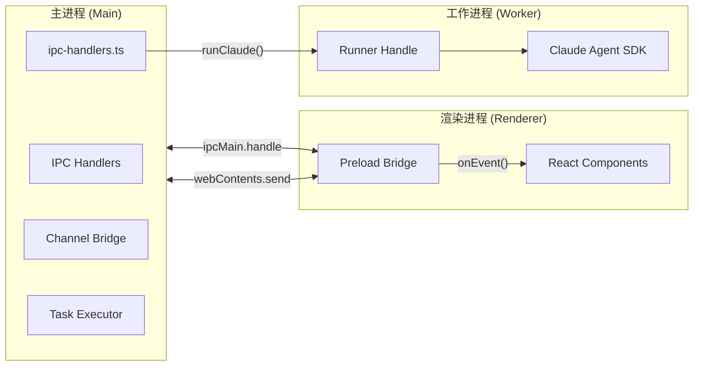
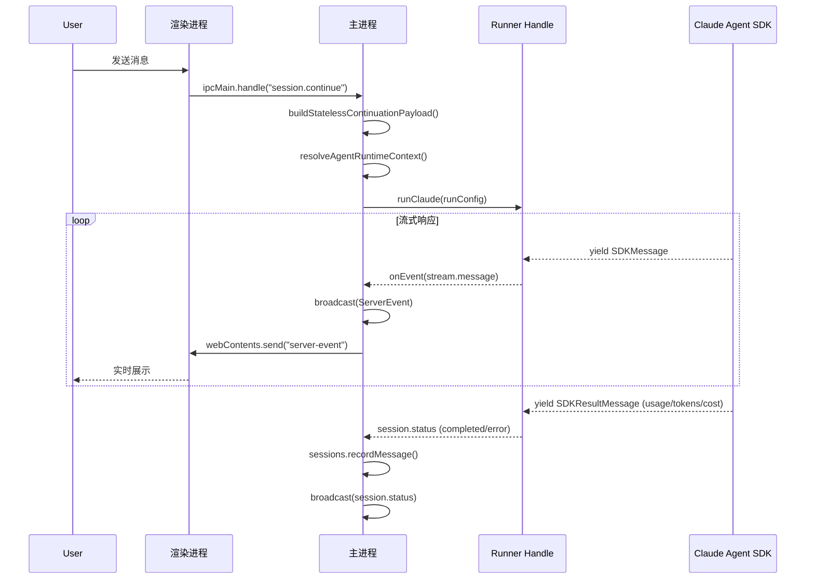

# 系统容器图

<cite>
**本文引用的文件**
- [doc/10-architecture/11-系统容器图.md](file://doc/10-architecture/11-系统容器图.md)
- [src/electron/main.ts](file://src/electron/main.ts)
- [doc/10-architecture/10-系统上下文图.md](file://doc/10-architecture/10-系统上下文图.md)
- [doc/10-architecture/12-控制平面组件图.md](file://doc/10-architecture/12-控制平面组件图.md)
- [doc/10-architecture/13-执行平面组件图.md](file://doc/10-architecture/13-执行平面组件图.md)
- [doc/10-architecture/14-数据与智能平面组件图.md](file://doc/10-architecture/14-数据与智能平面组件图.md)
- [doc/10-architecture/15-核心流程图.md](file://doc/10-architecture/15-核心流程图.md)
- [src/electron/ipc-handlers.ts](file://src/electron/ipc-handlers.ts)
- [src/electron/stateless-continuation.ts](file://src/electron/stateless-continuation.ts)
- [src/electron/types.ts](file://src/electron/types.ts)
- [src/electron/dev-backend-bridge.ts](file://src/electron/dev-backend-bridge.ts)
- [src/electron/util.ts](file://src/electron/util.ts)
- [pro-workflow/scripts/embed-wiki.js](file://pro-workflow/scripts/embed-wiki.js)
- [pro-workflow/skills/wiki-builder/scripts/wiki-cli.js](file://pro-workflow/skills/wiki-builder/scripts/wiki-cli.js)
- [src/electron/libs/agent-rule-docs.ts](file://src/electron/libs/agent-rule-docs.ts)
- [src/electron/libs/knowledge/repowiki/types.ts](file://src/electron/libs/knowledge/repowiki/types.ts)
- [doc/10-architecture/16-用量与上下文采集架构.md](file://doc/10-architecture/16-用量与上下文采集架构.md)
- [doc/40-product/1.0.0/10-requirements/11-FR-聊天与会话控制.md](file://doc/40-product/1.0.0/10-requirements/11-FR-聊天与会话控制.md)
</cite>

---

## 目录

- [1. 概览与进程划分](#1-概览与进程划分)
- [2. 主进程（Main Process）职责](#2-主进程main-process职责)
- [3. IPC 通信机制](#3-ipc-通信机制)
- [4. 渲染进程与 Web 前端](#4-渲染进程与-web-前端)
- [5. 工作进程与 Worker 调度](#5-工作进程与-worker-调度)
- [6. 事件总线与状态广播](#6-事件总线与状态广播)
- [7. 进程间数据流总图](#7-进程间数据流总图)
- [8. 失败模式与排障](#8-失败模式与排障)
- [9. Agent 改代码地图](#9-agent-改代码地图)

---

## 1. 概览与进程划分

tech-cc-hub 采用 Electron 多进程架构，按职责分为三类进程：

| 进程 | 技术栈 | 职责 | 入口文件 |
|------|--------|------|---------|
| **主进程（Main）** | Electron Node.js | 窗口管理、IPC 路由、系统集成、Agent 调度 | `src/electron/main.ts` |
| **渲染进程（Renderer）** | React + Tauri | 用户交互、Session UI、实时事件消费 | 前端代码（通过 preload 桥接） |
| **工作进程（Worker）** | 子进程 + Claude Agent SDK | 执行 Agent 任务、管理 Runner 生命周期 | `src/electron/libs/runner.ts` |

> 图表来源：[11-系统容器图.md#L43-L53](file://doc/10-architecture/11-系统容器图.md#L43-L53)



---

## 2. 主进程（Main Process）职责

### 2.1 核心模块

主进程通过 `main.ts` 聚合多个功能模块：

```typescript
// src/electron/main.ts L30-96（关键 imports 摘要）
import { handleClientEvent, sessions, cleanupAllSessions, setChannelReplySender, listStoredSessionsForRenderer, initializeTaskExecutor, initializeNoteRepository } from "./ipc-handlers.js";
import { startChannelBridge, type ChannelBridgeController } from "./libs/channel-bridge.js";
import { registerCronIpcHandlers, IpcCronEventEmitter } from "./libs/cron-ipc-handlers.js";
import { handleGitWorkbenchInvoke, registerGitWorkbenchIpcHandlers } from "./libs/git/index.js";
```

**模块职责矩阵**：

| 模块 | 文件 | 导出符号 | 运行时状态 |
|------|------|---------|-----------|
| IPC 处理器 | `ipc-handlers.ts` | `handleClientEvent`, `sessions`, `broadcast` | 全局单例 `sessions: SessionStore` |
| Task 执行器 | `ipc-handlers.ts` L75 | `initializeTaskExecutor` | `taskExecutor: TaskExecutor` 单例 |
| Note 仓库 | `ipc-handlers.ts` L69 | `initializeNoteRepository` | `noteRepo: NoteRepository` 单例 |
| Channel Bridge | `libs/channel-bridge.ts` | `startChannelBridge` | `channelBridgeController: ChannelBridgeController` |
| Cron 服务 | `libs/cron-service.ts` | `setCronService` | 注册到 MCP tools |

### 2.2 IPC 通道注册

主进程在启动时注册所有 IPC 通道。通道分为两类：

**invoke 通道**（渲染进程 → 主进程，await 响应）：
- `sessions:list` — 列出存储的 Session
- `sessions:start` — 启动新 Session
- `session.continue` — 继续已有 Session
- `session.stop` — 中断运行中的 Session
- `slash-commands:list` — 获取斜杠命令列表
- `plugins:getOpenComputerUseStatus` — 获取 OCU 插件状态

**send 通道**（主进程 → 渲染进程，单向推送）：
- `server-event` — 携带完整 `ServerEvent` JSON 负载

> 来源：[main.ts#L98-130](file://src/electron/main.ts#L98-L130)

### 2.3 Session 生命周期

`SessionStore` 负责管理会话状态，核心方法：

| 方法 | 位置 | 说明 |
|------|------|------|
| `listStoredSessionsForRenderer()` | [ipc-handlers.ts#L158](file://src/electron/ipc-handlers.ts#L158) | 列出所有非归档 Session |
| `getSession(sessionId)` | [ipc-handlers.ts#L179](file://src/electron/ipc-handlers.ts#L179) | 按 ID 获取 Session |
| `recordMessage()` | — | 写入消息到 SQLite |
| `recoverInterruptedSessions()` | [ipc-handlers.ts#L153](file://src/electron/ipc-handlers.ts#L153) | 启动时恢复中断的 Session |

`SessionInfo` 类型定义于 [types.ts#L130-148](file://src/electron/types.ts#L130-L148)：
```typescript
export type SessionInfo = {
  id: string;
  title: string;
  status: SessionStatus; // "idle" | "running" | "completed" | "error"
  model?: string;
  cwd?: string;
  runSurface?: AgentRunSurface; // "development" | "maintenance"
  workflowState?: SessionWorkflowState;
};
```

---

## 3. IPC 通信机制

### 3.1 类型安全 IPC 包装器

`src/electron/util.ts` 提供了类型安全的 IPC 工具：

```typescript
// src/electron/util.ts L12-22
export function ipcMainHandle<Key extends keyof EventPayloadMapping>(
  key: Key,
  handler: (...args: any[]) => EventPayloadMapping[Key] | Promise<EventPayloadMapping[Key]>
) {
  ipcMain.handle(key, (event, ...args) => {
    if (event.senderFrame) validateEventFrame(event.senderFrame);
    return handler(event, ...args);
  });
}

export function ipcWebContentsSend<Key extends keyof EventPayloadMapping>(
  key: Key,
  webContents: WebContents,
  payload: EventPayloadMapping[Key]
) {
  webContents.send(key, payload);
}
```

### 3.2 事件帧验证

生产环境中，`validateEventFrame()` 确保事件来源是合法的 Tauri 窗口：

```typescript
// src/electron/util.ts L24-28
export function validateEventFrame(frame: WebFrameMain) {
  if (isDev() && new URL(frame.url).host === `localhost:${DEV_PORT}`) return;

  if (frame.url !== pathToFileURL(getUIPath()).toString())
    throw new Error("Malicious event");
}
```

> **刷新/重启边界**：修改 `ipc-handlers.ts` 中的 IPC handler 后必须重启主进程（刷新 UI 不够），因为 handler 注册发生在 `app.whenReady()` 阶段。

### 3.3 ServerEvent 类型体系

所有从主进程推送的事件类型定义于 [types.ts#L184-215](file://src/electron/types.ts#L184-L215)：

| 事件类型 | 用途 | 关键 payload |
|---------|------|-------------|
| `stream.message` | 会话消息流 | `{ sessionId, message: StreamMessage }` |
| `session.status` | Session 状态变更 | `{ sessionId, status, title, cwd, model, error }` |
| `session.workflow` | Workflow 状态 | `{ sessionId, markdown, sourceLayer, sourcePath, state }` |
| `task.updated` | Task 更新 | `{ task: Record<string, unknown> }` |
| `permission.request` | 权限请求 | `{ sessionId, toolUseId, toolName, input }` |

---

## 4. 渲染进程与 Web 前端

### 4.1 Preload 桥接

渲染进程通过 preload script 与主进程通信，事件流：

```
主进程 broadcast()
  → BrowserWindow.webContents.send("server-event", payload)
  → Preload bridge (contextBridge.exposeInMainWorld)
  → React Components (useEffect 订阅)
```

### 4.2 开发模式 Dev Backend Bridge

开发环境下，`src/electron/dev-backend-bridge.ts` 提供 HTTP 桥接替代部分 IPC：

```typescript
// src/electron/dev-backend-bridge.ts L3, L54
export const DEV_BACKEND_BRIDGE_PORT = 4317;

export function startDevBackendBridge(options: DevBackendBridgeOptions): BridgeHandle {
  // HTTP RPC: POST /rpc/<handler-name>
  // SSE 订阅: GET /events/server, GET /events/browser
}
```

**HTTP 端点**：

| 端点 | 方法 | 说明 |
|------|------|------|
| `/health` | GET | 健康检查，返回平台和方法列表 |
| `/events/server` | GET | SSE 流，接收服务端事件 |
| `/events/browser` | GET | SSE 流，接收浏览器事件 |
| `/rpc/<handler>` | POST | JSON-RPC 调用，body `{ args: [...] }` |

### 4.3 关键前端入口点

| 组件 | 职责 | 相关文档 |
|------|------|---------|
| `ChatComposer` | 聊天输入 + Agent Picker | [CMP-003-ChatComposer.md](file://doc/40-product/1.0.0/40-delivery/components/CMP-003-ChatComposer.md) |
| `SessionSidebar` | Session 列表管理 | [CMP-001-SessionSidebar.md](file://doc/40-product/1.0.0/40-delivery/components/CMP-001-SessionSidebar.md) |
| `ActivityRail` | 执行过程与用量展示 | [16-用量与上下文采集架构.md#L130-150](file://doc/10-architecture/16-用量与上下文采集架构.md#L130-L150) |

---

## 5. 工作进程与 Worker 调度

### 5.1 Runner 生命周期

Worker 通过 `RunnerHandle` 管理 Claude Agent SDK 进程：

```typescript
// src/electron/ipc-handlers.ts L51-63
const runnerHandles = new Map<string, RunnerHandle>();
const warmRunnerCleanupTimers = new Map<string, ReturnType<typeof setTimeout>>();

const WARM_RUNNER_IDLE_MS = 30 * 60 * 1000; // 30 分钟空闲后清理
```

**Runner 复用策略**（[runner-reuse.ts](file://src/electron/libs/runner-reuse.js)）：
- `buildRunnerReuseKey(sessionId, cwd, model)` 生成复用键
- `canReuseRunner()` 检查是否有可复用的 Runner
- 空闲 30 分钟后自动清理热 Runner

### 5.2 任务系统集成

Task 系统通过 `TaskExecutor` 管理外部任务源（Lark、飞书项目、TAPD）：

```typescript
// src/electron/ipc-handlers.ts L75-143
export function initializeTaskExecutor(dbPath: string): TaskExecutor {
  const taskRepo = new TaskRepository(taskDb);

  registerTaskProvider(new LarkTaskProvider());
  registerTaskProvider(new TbTaskProvider());
  registerTaskProvider(new FeishuProjectTaskProvider());

  executor.startPolling(30000); // 每 30 秒轮询
}
```

**Task 事件广播**：
- `task.updated` — 任务内容更新
- `task.execution.started` / `task.execution.completed` — 执行状态
- `task.sync.completed` — 同步完成

---

## 6. 事件总线与状态广播

### 6.1 broadcast() 函数

所有服务端事件通过 `broadcast()` 发送：

```typescript
// src/electron/ipc-handlers.ts L163-175
function broadcast(event: ServerEvent) {
  const payload = JSON.stringify(event);
  if (isDev()) {
    console.log("[meta][server-event]", event.type);
  }
  const windows = BrowserWindow.getAllWindows();
  for (const win of windows) {
    win.webContents.send("server-event", payload);
  }
  for (const listener of serverEventListeners) {
    listener(event);
  }
}
```

### 6.2 无状态延续（Stateless Continuation）

对于长 Session，系统支持压缩历史以节省 token：

```typescript
// src/electron/stateless-continuation.ts L5-11
export type StatelessContinuationOptions = {
  contextWindow?: number;           // 默认 200,000
  compressionThresholdPercent?: number; // 默认 70%
  recentTurnCount?: number;         // 默认 5
  existingSummary?: string;
  existingSummaryMessageCount?: number;
};

// 关键导出
export function buildStatelessContinuationPayload(...): StatelessContinuationPayload
export function buildStatelessContinuationPrompt(...): string
```

**压缩策略**（[stateless-continuation.ts#L249-258](file://src/electron/stateless-continuation.ts#L249-L258)）：
1. 若 `历史 token / contextWindow >= compressionThresholdPercent`，触发压缩
2. 保留最近 5 轮对话
3. 更早的内容生成摘要（`buildSummary()`）

---

## 7. 进程间数据流总图



---

## 8. 失败模式与排障

### 8.1 常见失败场景

| 场景 | 症状 | 排查入口 |
|------|------|---------|
| **IPC handler 未注册** | IPC 调用无响应或报错 `Unknown handler` | 检查 `main.ts` 是否在 `app.whenReady()` 内调用 handler 注册 |
| **Runner 未正常启动** | Session 状态一直 `running` 无响应 | 查看 `runnerHandles` Map 是否有该 sessionId；检查 `runClaude()` 输出 |
| **事件未到达渲染进程** | UI 无更新但主进程有日志 | 检查 `broadcast()` 是否触发；验证 `validateEventFrame()` 未拦截 |
| **Session 恢复失败** | 启动时 `recoverInterruptedSessions()` 报错 | 检查 `sessions.db` 是否损坏；查看 `initializeSessions()` 异常 |
| **Task 同步失败** | Task 列表为空或过时 | 检查 `executor.startPolling()` 是否启动；查看 `task.sync.completed` 事件 |
| **OCU 插件未连接** | `plugins:getOpenComputerUseStatus` 返回 `connected: false` | 检查 `macOS 系统偏好设置` 中的 Accessibility 和 Screen Recording 权限 |

### 8.2 日志关键字

| 关键字 | 含义 | 位置 |
|--------|------|------|
| `[meta][server-event]` | 正在广播的 ServerEvent 类型 | [ipc-handlers.ts#L166](file://src/electron/ipc-handlers.ts#L166) |
| `Malicious event` | 事件帧验证失败 | [util.ts#L27](file://src/electron/util.ts#L27) |
| `Unknown handler` | HTTP RPC 调用了未注册的 handler | [dev-backend-bridge.ts#L118](file://src/electron/dev-backend-bridge.ts#L118) |

### 8.3 开发调试命令

```bash
# 查看所有已注册的 IPC 方法
# 方法 1: GET /health 端点
curl http://127.0.0.1:4317/health

# 方法 2: 查看 main.ts 中的 ipcMain.handle 调用

# 强制清理热 Runner（测试 Runner 重建）
# 在 DevTools Console 中触发 session.stop，然后等待 30 分钟或重启

# 验证事件流
# 打开 DevTools -> Network -> 过滤 ws://localhost:*
# 观察 server-event 消息到达情况
```

---

## 9. Agent 改代码地图

### 9.1 先读文件清单

| 优先级 | 文件 | 理由 |
|--------|------|------|
| **P0** | `src/electron/main.ts` | IPC 通道注册、插件管理、权限检查入口 |
| **P0** | `src/electron/ipc-handlers.ts` | Session 管理、事件广播、Task 初始化 |
| **P1** | `src/electron/types.ts` | 所有类型定义（SessionInfo、ServerEvent、StreamMessage） |
| **P1** | `src/electron/util.ts` | IPC 包装器、事件帧验证、DEV_PORT 常量 |
| **P2** | `src/electron/stateless-continuation.ts` | 长 Session 压缩逻辑 |
| **P2** | `src/electron/dev-backend-bridge.ts` | 开发模式 HTTP 桥接 |

### 9.2 关键符号速查

| 符号 | 文件:行号 | 用途 |
|------|---------|------|
| `handleClientEvent` | [ipc-handlers.ts#L...](file://src/electron/ipc-handlers.ts) | 处理所有 client → main 的 IPC 调用 |
| `sessions` | [ipc-handlers.ts#L51](file://src/electron/ipc-handlers.ts#L51) | 全局 SessionStore 实例 |
| `broadcast` | [ipc-handlers.ts#L163](file://src/electron/ipc-handlers.ts#L163) | 推送 ServerEvent 到所有窗口 |
| `initializeTaskExecutor` | [ipc-handlers.ts#L75](file://src/electron/ipc-handlers.ts#L75) | 初始化 Task 系统 |
| `WARM_RUNNER_IDLE_MS` | [ipc-handlers.ts#L60](file://src/electron/ipc-handlers.ts#L60) | 热 Runner 空闲超时（30min） |
| `ipcMainHandle` | [util.ts#L12](file://src/electron/util.ts#L12) | 类型安全的 invoke 包装 |
| `validateEventFrame` | [util.ts#L24](file://src/electron/util.ts#L24) | 事件来源验证 |
| `DEV_BACKEND_BRIDGE_PORT` | [dev-backend-bridge.ts#L3](file://src/electron/dev-backend-bridge.ts#L3) | 开发桥接端口（4317） |

### 9.3 修改入口点

#### 新增 IPC 通道

1. 在 `types.ts` 的 `EventPayloadMapping` 中添加类型映射
2. 在 `main.ts` 的 `app.whenReady()` 中调用 `ipcMainHandle("channel-name", handler)`
3. **验证命令**：重启应用后 `curl http://127.0.0.1:4317/health | jq .methods`

#### 修改 Session 行为

1. `ipc-handlers.ts` 中找到对应 handler（`session.start`、`session.continue`、`session.stop`）
2. 修改后重新编译 TypeScript
3. **验证命令**：发送测试消息，观察 `stream.message` 和 `session.status` 事件

#### 修改事件广播

1. `broadcast()` 函数在 [ipc-handlers.ts#L163](file://src/electron/ipc-handlers.ts#L163)
2. 新增事件类型需在 `ServerEvent` 联合类型中添加
3. **验证命令**：开启 `isDev()` 模式，查看 `[meta][server-event]` 日志

### 9.4 常见回归风险

| 风险 | 预防措施 |
|------|---------|
| **IPC 通道未注册** | 添加 handler 后确认在 `app.whenReady()` 内调用 |
| **类型不一致** | 修改 `types.ts` 后检查所有引用的文件是否需要同步更新 |
| **事件循环丢失** | `broadcast()` 内的 `serverEventListeners` 订阅者必须在 `addServerEventListener()` 返回的取消函数被调用前保持有效 |
| **Session 状态漂移** | 所有状态变更必须同时 `persist` 和 `broadcast` |
| **Runner 泄漏** | 确保 `warmRunnerCleanupTimers` 被正确清理，检查 `clearWarmRunnerCleanupTimer()` 调用点 |

### 9.5 测试入口

| 测试场景 | 文件/命令 | 说明 |
|----------|----------|------|
| Session 生命周期 | `curl -X POST http://127.0.0.1:4317/rpc/sessions:list` | 验证 Session 列表 |
| 事件流验证 | DevTools → Console → 过滤 `server-event` | 实时观察事件 |
| Runner 复用 | 连续发送两次相同 cwd/model 的请求 | 检查 Runner 是否复用 |
| Plugin 状态 | IPC `plugins:getOpenComputerUseStatus` | 检查 OCU 连接状态 |

---

## 相关文档

- [10-系统上下文图.md](file://doc/10-architecture/10-系统上下文图.md) — 系统边界与外部依赖
- [12-控制平面组件图.md](file://doc/10-architecture/12-控制平面组件图.md) — GUI 与控制服务
- [13-执行平面组件图.md](file://doc/10-architecture/13-执行平面组件图.md) — Worker 与 Agent 调度
- [15-核心流程图.md](file://doc/10-architecture/15-核心流程图.md) — 关键链路时序
- [16-用量与上下文采集架构.md](file://doc/10-architecture/16-用量与上下文采集架构.md) — 用量数据采集