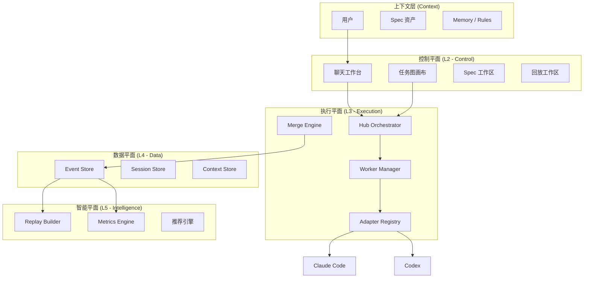
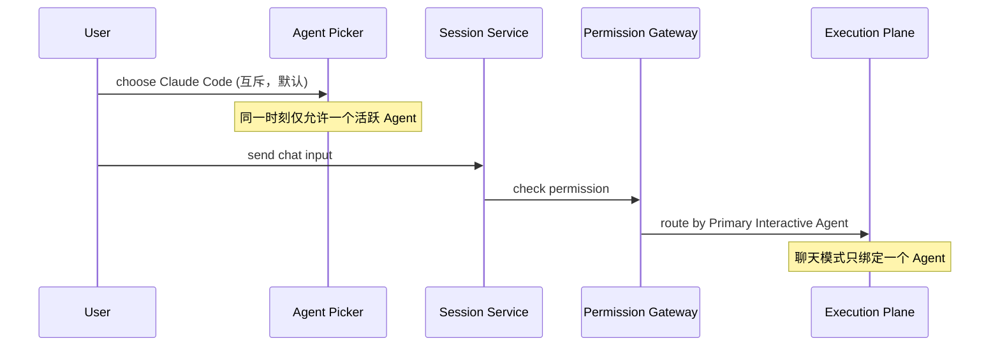
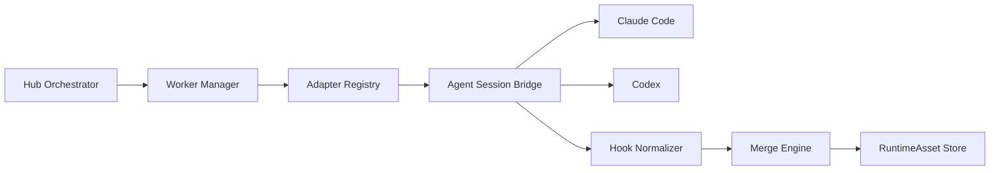
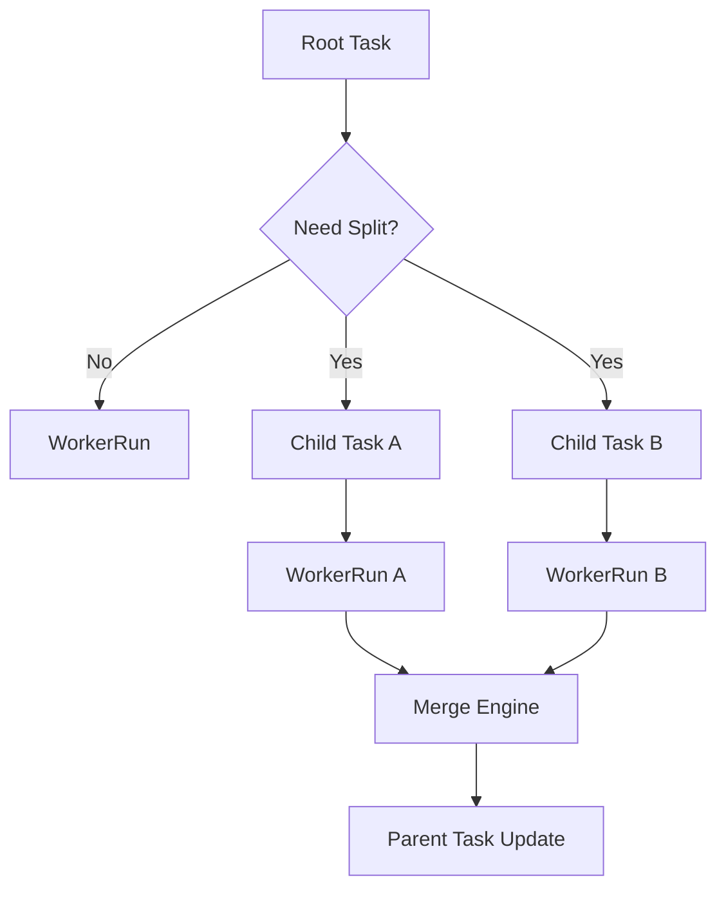
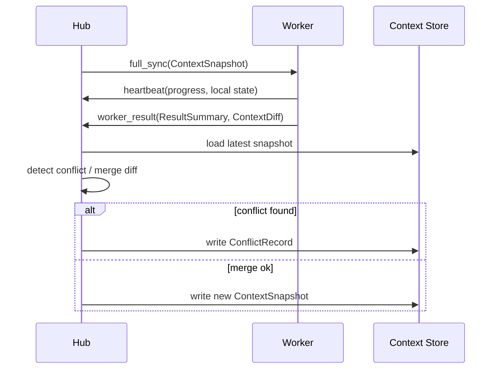

# 系统架构

<cite>

**本文引用的文件**

- [doc/10-architecture/10-系统上下文图.md](file://doc/10-architecture/10-系统上下文图.md)
- [doc/10-architecture/11-系统容器图.md](file://doc/10-architecture/11-系统容器图.md)
- [doc/10-architecture/12-控制平面组件图.md](file://doc/10-architecture/12-控制平面组件图.md)
- [doc/10-architecture/13-执行平面组件图.md](file://doc/10-architecture/13-执行平面组件图.md)
- [doc/10-architecture/14-数据与智能平面组件图.md](file://doc/10-architecture/14-数据与智能平面组件图.md)
- [doc/10-architecture/15-核心流程图.md](file://doc/10-architecture/15-核心流程图.md)
- [doc/10-architecture/16-用量与上下文采集架构.md](file://doc/10-architecture/16-用量与上下文采集架构.md)
- [src/electron/libs/knowledge/repowiki/types.ts](file://src/electron/libs/knowledge/repowiki/types.ts#L1-L215)
- [src/electron/libs/agent-rule-docs.ts](file://src/electron/libs/agent-rule-docs.ts#L1-L120)
- [doc/40-product/1.0.0/10-requirements/11-FR-聊天与会话控制.md](file://doc/40-product/1.0.0/10-requirements/11-FR-聊天与会话控制.md)
- [doc/40-product/1.0.0/10-requirements/12-FR-任务图与多Agent编排.md](file://doc/40-product/1.0.0/10-requirements/12-FR-任务图与多Agent编排.md)
- [doc/40-product/1.0.0/10-requirements/13-FR-事件流回放与分析.md](file://doc/40-product/1.0.0/10-requirements/13-FR-事件流回放与分析.md)
- [doc/40-product/1.0.0/10-requirements/10-需求索引.md](file://doc/40-product/1.0.0/10-requirements/10-需求索引.md)

</cite>

---

## 目录

- [1. 架构总览](#1-架构总览)
- [2. 分层架构](#2-分层架构)
- [3. 控制平面](#3-控制平面)
- [4. 执行平面](#4-执行平面)
- [5. 数据与智能平面](#5-数据与智能平面)
- [6. 核心流程](#6-核心流程)
- [7. 架构图索引](#7-架构图索引)
- [8. Agent 改代码地图](#8-agent-改代码地图)
- [9. 故障模式与边界](#9-故障模式与边界)
- [10. 扩展点与演进方向](#10-扩展点与演进方向)

---

## 1. 架构总览

tech-cc-hub 是一个面向研发用户的 Agent 工作台，其核心使命是将 Claude Code / Codex 等 AgentOS 的执行过程从"黑盒聊天"变为**可观测、可治理、可回放**的完整证据闭环。

系统采用五层结构：**上下文层 → 控制平面 → 执行平面 → 数据平面 → 智能平面**。每层职责边界清晰，上层通过 IPC 调用下层，下层通过事件回调上层。



> **章节来源**：[doc/10-architecture/10-系统上下文图.md#L42-L50](file://doc/10-architecture/10-系统上下文图.md#L42-L50)

---

## 2. 分层架构

### 2.1 分层职责矩阵

| 层级 | 名称 | 核心职责 | 关键组件 | Source of Truth |
|------|------|----------|----------|-----------------|
| L0 | 用户层 | 交互入口 | GUI、Tauri + React | UI 状态 |
| L1 | 上下文层 | 上下文聚合 | ChatWorkspace、TaskGraph、Memory、Rules | `prompt-ledger.ts` |
| L2 | 控制平面 | 命令路由、状态机 | Session Service、Workflow Service、Permission Gateway | `ipc-handlers.ts` |
| L3 | 执行平面 | 任务调度、半托管 | Hub、WorkerManager、AdapterRegistry、HookNormalizer | `runner.ts` |
| L4 | 数据平面 | 持久化、快照 | EventStore、SessionStateStore、ContextStore、SnapshotStore | SQLite `sessions.db` |
| L5 | 智能平面 | 分析、推荐 | ReplayBuilder、MetricsEngine、RecommendationEngine | 分析报告 |

### 2.2 模块划分原则

1. **上下文层** (L1) 负责聚合用户输入、系统指令、Memory、Rules、Skill，产出 `PromptLedgerMessage`
2. **控制平面** (L2) 负责将用户命令路由到 Session/Task/Workflow Service，**不直接操作 AgentOS**
3. **执行平面** (L3) 负责 Hub 编排、Worker 生命周期、适配器选择、结果归并
4. **数据平面** (L4) 负责事件持久化、会话状态快照、上下文差异记录
5. **智能平面** (L5) 负责从事件流构建 Replay、Metrics、推荐

> **章节来源**：[doc/10-architecture/11-系统容器图.md#L35-L53](file://doc/10-architecture/11-系统容器图.md#L35-L53)

---

## 3. 控制平面

控制平面是用户操作的入口，核心职责是：

- **Session 生命周期管理**：`session.start` / `session.continue` / `session.interrupt` / `session.resume`
- **TaskGraph 编排**：任务节点创建、依赖建立、Worker 分配
- **Agent 选择**：Agent Picker 在聊天界面的互斥选择（Claude Code ↔ Codex）
- **权限网关**：人工介入点、危险操作确认

### 3.1 核心组件

| 组件 | 文件位置 | 导出符号 | 职责 |
|------|----------|----------|------|
| ChatWorkspace | 前端 | - | 用户聊天交互主入口 |
| TaskGraphCanvas | 前端 | - | 任务图画布，支持节点拖拽 |
| SessionService | `ipc-handlers.ts` L423-492 | `emit()` | 会话状态、消息路由 |
| WorkflowService | `ipc-handlers.ts` | - | 任务图调度、Workflow 触发 |
| PermissionGateway | `ipc-handlers.ts` | - | 权限检查、人工介入拦截 |
| AgentPicker | 前端 | - | 聊天栏的 Agent 选择器 |

### 3.2 聊天控制流



> **图表来源**：[doc/10-architecture/12-控制平面组件图.md#L62-L72](file://doc/10-architecture/12-控制平面组件图.md#L62-L72)

### 3.3 控制命令契约

所有用户触发的控制命令都必须进入事件流：

```typescript
// 必须记录的控制命令 (FR-CHAT-003, FR-EVID-001)
interface ControlEvent {
  type: "chat_agent_selected" | "session_created" | "user_input_submitted"
       | "session_interrupted" | "session_resumed" | "task_created"
       | "worker_assigned" | "worker_state_changed" | "task_requeued";
  sessionId: string;
  timestamp: number;
  payload: Record<string, unknown>;
}
```

> **章节来源**：[doc/40-product/1.0.0/10-requirements/11-FR-聊天与会话控制.md#L78-L86](file://doc/40-product/1.0.0/10-requirements/11-FR-聊天与会话控制.md#L78-L86)

---

## 4. 执行平面

执行平面是系统最复杂的层，负责将任务图转化为 Worker 执行，并对底层 AgentOS（Claude Code / Codex）做半托管。

### 4.1 核心组件

| 组件 | 文件位置 | 导出符号 | 职责 |
|------|----------|----------|------|
| Hub Orchestrator | 后端 | - | 任务分解、调度策略、上下文分发 |
| Worker Manager | `task/executor.ts` L772-786 | `extractUsage()` | `WorkerRun` 生命周期、并发、重试、终止 |
| Adapter Registry | 后端 | - | Claude Code / Codex 适配器选择 |
| Agent Session Bridge | 后端 | - | 与底层 AgentOS 的会话桥接 |
| Hook Normalizer | 后端 | - | Claude / Codex hook 差异归一 |
| Merge Engine | 后端 | - | 结果摘要、冲突检测、回写决策 |

### 4.2 任务执行流程



> **图表来源**：[doc/10-architecture/13-执行平面组件图.md#L44-L54](file://doc/10-architecture/13-执行平面组件图.md#L44-L54)

### 4.3 任务图递归拆分



> **图表来源**：[doc/10-architecture/15-核心流程图.md#L64-L75](file://doc/10-architecture/15-核心流程图.md#L64-L75)

### 4.4 Worker 状态

| 状态 | 含义 | 触发条件 |
|------|------|----------|
| `queued` | 等待调度 | 任务进入 Worker Manager |
| `running` | 执行中 | 适配器激活、Hook Normalizer 接收事件 |
| `blocked` | 等待依赖 | 父任务未完成或依赖节点失败 |
| `completed` | 成功完成 | Merge Engine 收到结果、回写成功 |
| `failed` | 执行失败 | Hook 返回错误或超时 |

> **章节来源**：[doc/40-product/1.0.0/10-requirements/12-FR-任务图与多Agent编排.md#L60-L65](file://doc/40-product/1.0.0/10-requirements/12-FR-任务图与多Agent编排.md#L60-L65)

---

## 5. 数据与智能平面

数据平面负责持久化运行时证据，智能平面负责从证据生成可读报告。

### 5.1 数据存储组件

| 组件 | 数据结构 | 持久化位置 | 用途 |
|------|----------|------------|------|
| EventStore | `EventEnvelope[]` | SQLite `sessions.db` messages 表 | 完整事件流，可回放 |
| SessionStateStore | Session JSON | SQLite `sessions.db` | 会话状态快照 |
| ContextStore | ContextSnapshot | SQLite + 文件系统 | 上下文增量 |
| SnapshotStore | 快照 | 文件系统 | 长时间恢复 |

> **章节来源**：[doc/10-architecture/14-数据与智能平面组件图.md#L56-L65](file://doc/10-architecture/14-数据与智能平面组件图.md#L56-L65)

### 5.2 用量采集链路

```mermaid
flowchart LR
    SDK["Claude Agent SDK\nquery()"] --> |yield SDKResultMessage| Runner["runner.ts\nrunClaude()"]
    Runner --> |for await loop| IPCHandlers["ipc-handlers.ts\nemit()"]
    IPCHandlers --> |recordMessage()| SQLite["sessions.db\nmessages 表"]
    IPCHandlers --> |broadcast()| WebContents["webContents.send()"]
    WebContents --> |stream.message| UI["ActivityRailModel"]
    UI --> |聚合 summary| ActivityRail["ActivityRailModel.summary"]
```

> **图表来源**：[doc/10-architecture/16-用量与上下文采集架构.md#L60-L82](file://doc/10-architecture/16-用量与上下文采集架构.md#L60-L82)

### 5.3 Prompt Ledger 结构

每次 `session.start` / `session.continue` 前，系统分析 Prompt 组成，产出 `PromptLedgerMessage`：

```typescript
// src/shared/prompt-ledger.ts L78-89
interface PromptLedgerMessage {
  type: "prompt_ledger";
  phase: "start" | "continue";
  totalChars: number;
  totalTokenEstimate: number;
  buckets: Array<{
    sourceKind: "system" | "project" | "skill" | "workflow" | "attachment" | "memory" | "history" | "tool";
    chars: number;
    tokenEstimate: number;
    ratio: number;
  }>;
  segments: Array<{
    sourceKind: string;
    chars: number;
    risks: Array<"long_content" | "ambiguous_reference" | "missing_acceptance" | "tool_payload">;
    optimizationHint: string;
  }>;
}
```

> **章节来源**：[doc/10-architecture/16-用量与上下文采集架构.md#L166-L185](file://doc/10-architecture/16-用量与上下文采集架构.md#L166-L185)

---

## 6. 核心流程

### 6.1 四条主流程

| 流程名 | 起点 | 终点 | 关键节点 |
|--------|------|------|----------|
| 聊天消息路由 | Agent Picker → SessionService → AdapterRegistry → Claude/Codex | 流式响应 | `Primary Interactive Agent` 绑定 |
| 任务图拆分与合并 | TaskGraphCanvas → Hub → WorkerManager → AdapterRegistry → 归并 | 结果回写 | `WorkerRun` 生命周期 |
| 上下文同步与冲突 | Hub.full_sync → Worker.heartbeat → Merge Engine → ContextStore | 冲突记录或新快照 | `ContextDiff` 计算 |
| 事件到回放生成 | Raw Hooks → EventNormalizer → EventStore → Timeline Builder | ReplayDocument / AnalysisReport | `EventEnvelope` 序列化 |

> **章节来源**：[doc/10-architecture/15-核心流程图.md#L45-L106](file://doc/10-architecture/15-核心流程图.md#L45-L106)

### 6.2 上下文同步时序



> **图表来源**：[doc/10-architecture/15-核心流程图.md#L79-L94](file://doc/10-architecture/15-核心流程图.md#L79-L94)

---

## 7. 架构图索引

| 图表名称 | 文件 | 说明 |
|----------|------|------|
| 系统上下文图 | [10-系统上下文图.md](file://doc/10-architecture/10-系统上下文图.md) | CLAW 与用户、AgentOS、存储、外部依赖的边界定义 |
| 系统容器图 | [11-系统容器图.md](file://doc/10-architecture/11-系统容器图.md) | Desktop GUI、Backend Runtime、Agent Integration、Storage、Replay Engine 一级容器划分 |
| 控制平面组件图 | [12-控制平面组件图.md](file://doc/10-architecture/12-控制平面组件图.md) | Chat Workspace、Agent Picker、Session Service、Workflow Service、Permission Gateway |
| 执行平面组件图 | [13-执行平面组件图.md](file://doc/10-architecture/13-执行平面组件图.md) | Hub、Worker Manager、Adapter Registry、Agent Session Bridge、Hook Normalizer、Merge Engine |
| 数据与智能平面组件图 | [14-数据与智能平面组件图.md](file://doc/10-architecture/14-数据与智能平面组件图.md) | EventStore、SessionStateStore、ContextStore、SnapshotStore、Replay Builder、Metrics Engine |
| 核心流程图 | [15-核心流程图.md](file://doc/10-architecture/15-核心流程图.md) | 聊天路由、任务拆分、上下文同步、事件回放四条主流程 |
| 用量与上下文采集架构 | [16-用量与上下文采集架构.md](file://doc/10-architecture/16-用量与上下文采集架构.md) | SDKResultMessage 采集、Prompt Ledger、ActivityRailModel 聚合完整链路 |

---

## 8. Agent 改代码地图

### 8.1 修改入口与优先级

| 场景 | 先读文件 | 关键符号 / IPC | 修改入口 | 验证命令 |
|------|----------|----------------|----------|----------|
| 修改聊天 Session 生命周期 | `ipc-handlers.ts` | `emit()`, `session.start`, `session.continue` | L423-492 `emit()` 函数 | `python doc/_tools/check_doc_links.py --links` |
| 修改任务 Worker 调度 | `task/executor.ts` | `extractUsage()`, `recordUsage()`, `WorkerRun` | L772-786 `extractUsage()` | `npm run test:unit` |
| 修改 Prompt Ledger 结构 | `src/shared/prompt-ledger.ts` | `PromptLedgerMessage`, `estimatePromptLedgerTokens()` | L78-89 类型定义 | UI 截图对比 |
| 修改 Agent 规则加载 | `src/electron/libs/agent-rule-docs.ts` | `loadAgentRuleDocuments()`, `saveUserAgentRuleDocument()` | L102-112 `loadAgentRuleDocuments()` | 修改 CLAUDE.md 后重启 |
| 修改前端 IPC 调用 | `src/electron/libs/knowledge/repowiki/types.ts` | `RepoWikiFileSignal`, `ipc` / `mcp_tool` / `database` 信号类型 | L8-13 `RepoWikiFileSignal` | `npm run dev` |

### 8.2 关键 IPC 通道

| Channel | 方向 | 文件 | 函数 | 用途 |
|----------|------|------|------|------|
| `server-event` | Backend → Frontend | `ipc-handlers.ts` L423-492 | `broadcast()` | 实时事件推送 |
| `stream.message` | Backend → Frontend | `ipc-handlers.ts` L423-492 | `webContents.send()` | 消息流推送 |
| `session.status` | Backend → Frontend | `runner.ts` L449 | 检测 `message.type === "result"` 时发送 | Session 状态更新 |

> **章节来源**：[src/electron/libs/agent-rule-docs.ts#L102-L112](file://src/electron/libs/agent-rule-docs.ts#L102-L112)

### 8.3 关键数据库表

| 表名 | 位置 | 用途 | 关键列 |
|------|------|------|--------|
| `messages` | `sessions.db` | 会话消息持久化 | `id`, `session_id`, `data(JSON 含 usage)`, `created_at` |
| `tasks` | `repository.ts` L40-86 | 任务聚合 | `input_tokens`, `output_tokens`, `estimated_cost_usd` |
| `task_executions` | `repository.ts` L40-86 | 单次执行 | `input_tokens`, `output_tokens`, `estimated_cost_usd` |

> **章节来源**：[doc/10-architecture/16-用量与上下文采集架构.md#L108-L126](file://doc/10-architecture/16-用量与上下文采集架构.md#L108-L126)

### 8.4 RepoWiki 类型系统

```typescript
// src/electron/libs/knowledge/repowiki/types.ts
export type RepoWikiFileSignal = {
  kind: "ipc" | "ui_ipc" | "mcp_tool" | "mcp_server" | "database" | "store" | "event" | "config" | "entrypoint";
  name: string;
  detail?: string;
  line?: number;
};

export type RepoWikiRuntimeFlow = {
  title: string;
  summary: string;
  steps: string[];
  evidence: string[];
};
```

> **章节来源**：[src/electron/libs/knowledge/repowiki/types.ts#L8-L53](file://src/electron/libs/knowledge/repowiki/types.ts#L8-L53)

### 8.5 常见回归风险

| 风险点 | 触发场景 | 预防措施 |
|--------|----------|----------|
| `session-store.recordMessage()` 写入失败 | 网络/磁盘问题 | 检查 `sessions.db` 路径存在，`ipc-handlers.ts` L423-492 有 try-catch |
| Adapter Registry 返回 null | Agent 类型不匹配 | 验证 `AdapterRegistry` 初始化顺序，Claude 先于 Codex |
| Prompt Ledger 未生成 | 缺少 `prompt-ledger.ts` | 检查 `ipc-handlers.ts` L365-421 `buildPromptLedgerForRun()` 调用 |
| Worker 状态漂移 | 高并发调度 | 检查 `WorkerManager` 并发锁，`task/executor.ts` L772-786 有状态校验 |
| 回放数据缺失 | EventStore 写入失败 | 检查 `EventNormalizer` 是否所有事件都捕获 |

### 8.6 运行时刷新 / 重启边界

| 组件 | 变更后是否需要重启 | 刷新方式 |
|------|-------------------|----------|
| `agent-rule-docs.ts` (CLAUDE.md) | 需要重启 electron | 用户修改文件后重启应用 |
| `prompt-ledger.ts` 类型 | 需要重启 electron | 类型变更触发编译 |
| `ipc-handlers.ts` IPC 通道 | 需要重启 electron | 后端 IPC 注册在启动时完成 |
| SQLite `sessions.db` | 无需重启 | 持久化存储，进程重启后继续有效 |
| `ActivityRailModel` UI 状态 | 无需重启 | React 状态自动刷新 |

---

## 9. 故障模式与边界

### 9.1 架构级 Failure Modes

| 边界 | 失败模式 | 后果 | 缓解措施 |
|------|----------|------|----------|
| Git 作为主运行时存储 | 大量运行时状态 commit | 回放与状态一致性问题 | Git 只同步配置类资产，不承载 v1 运行时真相 |
| AgentOS 视为内部模块 | 混淆产品边界 | 观测数据缺失 | AgentOS 始终是外部依赖，通过 Adapter 隔离 |
| 分析引擎与执行 Runtime 强耦合 | 回放生成阻塞主流程 | 用户操作卡顿 | `ReplayBuilder` 与 `MetricsEngine` 异步独立运行 |
| GUI 直接操作 AgentOS | 绕过统一观测 | 状态管理失效 | 所有操作经 `SessionService` / `WorkflowService` 路由 |
| 聊天界面多 Agent 同时激活 | 会话归属模糊 | 消息路由不确定性 | 聊天栏同一时刻只允许一个活跃 Agent |
| Hook Normalizer 缺失 | Claude / Codex 差异污染上层 | 归一事件不可信 | 所有 adapter 输出必须经 `HookNormalizer` 处理 |

> **章节来源**：
> - [doc/10-architecture/10-系统上下文图.md#L65-L67](file://doc/10-architecture/10-系统上下文图.md#L65-L67)
> - [doc/10-architecture/11-系统容器图.md#L68-L70](file://doc/10-architecture/11-系统容器图.md#L68-L70)
> - [doc/10-architecture/12-控制平面组件图.md#L92-L95](file://doc/10-architecture/12-控制平面组件图.md#L92-L95)
> - [doc/10-architecture/13-执行平面组件图.md#L69-L71](file://doc/10-architecture/13-执行平面组件图.md#L69-L71)
> - [doc/10-architecture/14-数据与智能平面组件图.md#L66-L68](file://doc/10-architecture/14-数据与智能平面组件图.md#L66-L68)

### 9.2 数据平面 Failure Modes

| 失败模式 | 原因 | 后果 | 恢复方式 |
|----------|------|------|----------|
| 只保留聚合状态不保留事件 | 节省存储 | 无法生成可信回放 | 必须同时保留 `EventEnvelope` |
| 只保留事件不保留状态快照 | 只关注事件流 | 长周期会话恢复成本高 | 必须保留 `ContextSnapshot` |

> **章节来源**：[doc/10-architecture/14-数据与智能平面组件图.md#L66-L68](file://doc/10-architecture/14-数据与智能平面组件图.md#L66-L68)

### 9.3 控制平面 Failure Modes

| 失败模式 | 原因 | 后果 |
|----------|------|------|
| 聊天和任务图不共享 Session | 双轨状态漂移 | 用户看到不一致的会话状态 |
| 权限决策散落多个模块 | 人工干预链路无法回放 | 安全审计缺失 |
| 聊天界面同时允许多 Agent 激活 | 消息路由不确定性 | 回放边界模糊 |

> **章节来源**：[doc/10-architecture/12-控制平面组件图.md#L92-L95](file://doc/10-architecture/12-控制平面组件图.md#L92-L95)

---

## 10. 扩展点与演进方向

### 10.1 当前架构支撑的能力

| 功能 | 支撑文档 |
|------|----------|
| 聊天与会话控制 | [11-FR-聊天与会话控制.md](file://doc/40-product/1.0.0/10-requirements/11-FR-聊天与会话控制.md) |
| 任务图与多 Agent 编排 | [12-FR-任务图与多Agent编排.md](file://doc/40-product/1.0.0/10-requirements/12-FR-任务图与多Agent编排.md) |
| 事件流回放与分析 | [13-FR-事件流回放与分析.md](file://doc/40-product/1.0.0/10-requirements/13-FR-事件流回放与分析.md) |
| Spec 资产与调优 | [14-FR-Spec资产与调优.md](file://doc/40-product/1.0.0/10-requirements/14-FR-Spec资产与调优.md) |
| 项目工作区与文件管理 | [15-FR-项目工作区与文件管理.md](file://doc/40-product/1.0.0/10-requirements/15-FR-项目工作区与文件管理.md) |
| 权限冲突与人工介入 | [16-FR-权限冲突与人工介入.md](file://doc/40-product/1.0.0/10-requirements/16-FR-权限冲突与人工介入.md) |

> **章节来源**：[doc/40-product/1.0.0/10-requirements/10-需求索引.md#L41-L51](file://doc/40-product/1.0.0/10-requirements/10-需求索引.md#L41-L51)

### 10.2 架构扩展点

| 扩展点 | 当前设计 | 扩展方向 | 约束 |
|--------|----------|----------|------|
| 更多 AgentOS | Adapter Registry | 接入 Gemini、Coze 等 | 统一 `AgentSessionBridge` 接口 |
| 云端协作 | Context 图 | 多用户共享 Session | 不修改 v1 边界定义 |
| 分布式执行 | 执行平面 | 多 Hub 编排 | 需要 `WorkerManager` 分布式协调 |
| 评估体系 | 智能平面 | Prompt / Trace 评分 | 数据结构预留评分位 |

> **章节来源**：
> - [doc/10-architecture/10-系统上下文图.md#L72-L73](file://doc/10-architecture/10-系统上下文图.md#L72-L73)
> - [doc/40-product/1.0.0/10-requirements/17-竞品功能拆解/13-执行可观测层.md#L147-L148](file://doc/40-product/1.0.0/10-requirements/17-竞品功能拆解/13-执行可观测层.md#L147-L148)

### 10.3 相关规范索引

| 规范 | 文件 |
|------|------|
| AgentOS 集成规范 | [20-AgentOS集成规范.md](file://doc/20-specs/20-AgentOS集成规范.md) |
| 任务图与递归拆分规范 | [22-任务图与递归拆分规范.md](file://doc/20-specs/22-任务图与递归拆分规范.md) |
| 上下文同步与合并规范 | [23-上下文同步与合并规范.md](file://doc/20-specs/23-上下文同步与合并规范.md) |
| 事件模型与可观测规范 | [24-事件模型与可观测规范.md](file://doc/20-specs/24-事件模型与可观测规范.md) |
| 前端信息架构 | [30-前端信息架构.md](file://doc/30-operations/30-前端信息架构.md) |
| 回放与分析报告规范 | [32-回放与分析报告规范.md](file://doc/30-operations/32-回放与分析报告规范.md) |

---

## 更新日志

| 版本 | 日期 | 变更 |
|------|------|------|
| 1.0.0 | 2026-05-06 | 初始版本，基于 doc/10-architecture/ 系列文档整理 |