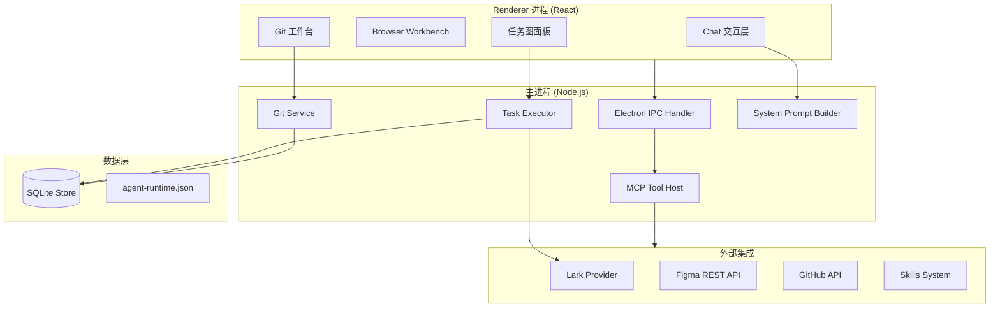
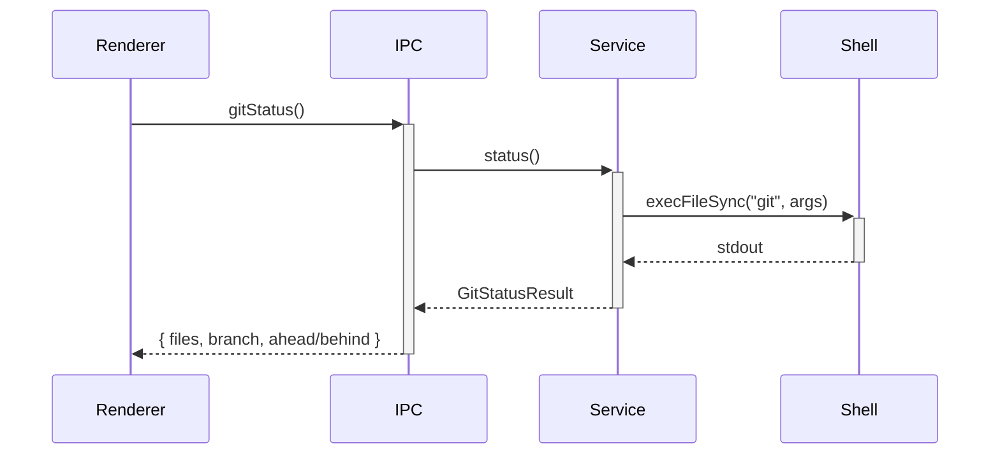
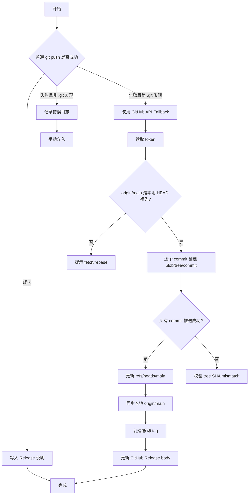

# 系统架构总览

<cite>

**本文引用的文件**

- [skills/tech-cc-hub-release-deploy/scripts/publish-release.mjs](file://skills/tech-cc-hub-release-deploy/scripts/publish-release.mjs)
- [scripts/github-release.mjs](file://scripts/github-release.mjs)
- [src/electron/libs/system-prompt-presets.ts](file://src/electron/libs/system-prompt-presets.ts)
- [skills/tech-cc-hub-release-deploy/SKILL.md](file://skills/tech-cc-hub-release-deploy/SKILL.md)
- [skills/tech-cc-hub-release-deploy/agents/openai.yaml](file://skills/tech-cc-hub-release-deploy/agents/openai.yaml)
- [pro-workflow/skills/wiki-research-loop/scripts/research-loop.js](file://pro-workflow/skills/wiki-research-loop/scripts/research-loop.js)
- [src/electron/libs/git/README.md](file://src/electron/libs/git/README.md)
- [src/electron/libs/mcp-tools/README.md](file://src/electron/libs/mcp-tools/README.md)
- [src/electron/libs/task/README.md](file://src/electron/libs/task/README.md)

</cite>

## 目录

- [系统定位与设计目标](#系统定位与设计目标)
- [整体架构层级](#整体架构层级)
- [核心模块索引](#核心模块索引)
- [Electron 主进程模块](#electron-主进程模块)
- [MCP 工具系统](#mcp-工具系统)
- [发布部署流水线](#发布部署流水线)
- [System Prompt 预设体系](#system-prompt-预设体系)
- [工作流与研究循环](#工作流与研究循环)
- [配置与扩展点](#配置与扩展点)
- [关键设计决策](#关键设计决策)

---

## 系统定位与设计目标

tech-cc-hub 是一个 Electron 桌面客户端，其核心定位是 **AI 原生开发工作台**——将 LLM Agent 能力深度嵌入开发流程，提供浏览器工作台、Git 管理、任务编排和多 Agent 协作能力。

关键设计目标：

- **Agent 可观测**：所有执行路径可回放、可分析、可追溯
- **能力可插拔**：通过 Skill 体系和 MCP 工具面实现功能扩展
- **配置可治理**：运行时参数通过统一入口管理，避免散落硬编码
- **发布可自动化**：版本发布、Release 更新、tag 移动全链路脚本化

> **图表来源**：[DESIGN.md](file://DESIGN.md) 定义了产品定位

---

## 整体架构层级



**职责说明**：

- **Renderer**：纯 UI 展示，通过 IPC 调用主进程能力，不直接执行 git、shell 或文件操作
- **主进程**：承载所有业务逻辑，包括 Git 操作、MCP 工具调用、任务编排、Prompt 构建
- **数据层**：SQLite 持久化任务状态和执行记录；`agent-runtime.json` 管理全局运行时配置
- **外部集成**：Lark 任务源、Figma 设计资源、GitHub 发布能力、Skills 技能包

> **图表来源**：[doc/10-architecture/11-系统容器图.md](file://doc/10-architecture/11-系统容器图.md)

---

## 核心模块索引

| 模块路径 | 职责 | 入口文件 |
|---------|------|---------|
| `src/electron/libs/git/` | Git 操作封装 | `index.ts` |
| `src/electron/libs/mcp-tools/` | 内置 MCP 工具面 | `browser.ts`, `design.ts`, `figma-rest.ts`, `admin.ts` |
| `src/electron/libs/task/` | 任务编排与执行 | `executor.ts` |
| `src/electron/libs/system-prompt-presets.ts` | Prompt 动态组装 | 导出函数 |
| `skills/tech-cc-hub-release-deploy/` | 发布部署流水线 | `SKILL.md` |
| `scripts/github-release.mjs` | GitHub Release 管理 | `main()` |
| `pro-workflow/skills/wiki-research-loop/` | 研究循环自动化 | `research-loop.js` |

---

## Electron 主进程模块

### Git Service (`src/electron/libs/git/`)

**边界定义**：

- Renderer 通过 IPC 调用 Git Service，不绕过主进程直接执行 git
- 第一版允许：status/diff、stage/unstage、commit、push、branch、stash、history、graph
- 第一版禁止：reset、rebase、cherry-pick、force push、amend、squash

**文件结构**：

```
git/
├── types.ts       # 领域类型和 IPC payload/result
├── errors.ts      # Git 错误归一化
├── service.ts     # 唯一 Git 操作入口
├── history.ts     # commit history parser
├── graph.ts       # lightweight graph lane 生成
├── operation-log.ts
├── ipc.ts         # Electron IPC handler 注册
└── index.ts       # 对外统一出口
```

**关键调用链**：



> **章节来源**：[src/electron/libs/git/README.md#L5-L14](file://src/electron/libs/git/README.md#L5-L14)

### Task Module (`src/electron/libs/task/`)

**核心原则**：

- Repository 只做持久化，不启动 runner
- Executor 是唯一调度入口，所有自动/手动执行都经过这里
- 外部 provider 只负责把第三方任务映射成 `ExternalTask`，不直接改 UI 或会话
- 任务执行使用独立 workspace，避免多个任务互相污染

**文件结构**：

```
task/
├── types.ts           # 任务、IPC payload 领域类型
├── provider-registry.ts
├── providers/         # 外部任务源适配器（如 Lark）
├── repository.ts      # SQLite schema、状态持久化
├── workflow.ts        # Symphony-style workflow 配置
├── workspace.ts       # 独立 workspace 创建、路径安全
├── executor.ts        # 编排器：同步、自动执行、并发控制、重试、恢复
└── index.ts           # 对外统一出口
```

> **章节来源**：[src/electron/libs/task/README.md#L7-L22](file://src/electron/libs/task/README.md#L7-L22)

---

## MCP 工具系统

### 目录结构与职责

`src/electron/libs/mcp-tools/` 集中存放暴露给 Agent 的内置 MCP 工具：

| 文件 | 能力 |
|------|------|
| `browser.ts` | 右侧 BrowserView 工作台能力：导航、截图摘要、DOM 查询、样式检查、标注模式 |
| `design.ts` | 截图语义分析、截图比照、设计还原：单张参考图摘要、当前视图截图、diff 图、comparison 图、热点区域、JSON report、历史产物列表 |
| `figma-rest.ts` | Figma PAT 只读工具面：文件/节点读取、轻量设计树、token 提取、设计系统、UX 审查、Tailwind 初稿、导出图、评论、版本、库资源、变量 |
| `admin.ts` | 受控管理能力：写入 `agent-runtime.json` 的 `env`、`skillCredentials` 等全局参数 |

### 设计工具默认触发条件

根据源码定义，以下场景默认触发设计工具：

1. 用户给出截图、Figma 图、页面参考图，并要求生成或修改 UI/前端代码
2. 用户反馈页面和参考图不一致，需要按截图修 UI
3. 单张用户截图先走 `design_inspect_image` 做语义摘要
4. 已有页面候选图后再走截图比照，避免同一张图自己和自己比较

### 工具使用参数

**设计比照参数**：

- `ignoreRegions`: 忽略时间戳/头像/动画等动态区域
- `maxDifferenceRatio`: 形成通过/失败结论的阈值
- `ignoreAntialiasing`: 文字抗锯齿噪声多时开启
- `diffColorMode: directional`: 需要区分变亮/变暗时使用

**恢复证据路径**：

1. 用 `design_list_artifacts` 找最近产物
2. 用 `design_read_comparison_report` 读取 JSON report

> **章节来源**：[src/electron/libs/mcp-tools/README.md#L1-L22](file://src/electron/libs/mcp-tools/README.md#L1-L22)

---

## 发布部署流水线

### 发布脚本入口

`skills/tech-cc-hub-release-deploy/scripts/publish-release.mjs` 是发布主脚本，封装了完整的发布流程。

**命令行参数**：

| 参数 | 说明 |
|------|------|
| `--tag vX.Y.Z` | 指定版本 tag |
| `--notes <path>` | 指定 Release 说明文件路径 |
| `--retag` | 允许移动已有 tag |
| `--delete-release` | 删除已有 GitHub Release |
| `--api-only` | 仅使用 GitHub API 推送，跳过普通 git push |
| `--notes-only` | 仅更新 Release 说明 |

**典型用法**：

```powershell
# 发布当前 HEAD 并移动 release tag
node skills/tech-cc-hub-release-deploy/scripts/publish-release.mjs --tag v0.1.13 --retag --delete-release

# 只更新发布说明
node skills/tech-cc-hub-release-deploy/scripts/publish-release.mjs --tag v0.1.13 --notes .tmp/release-notes-v0.1.13.md --notes-only

# 直接推送当前 HEAD（自动尝试普通 push，失败后用 API fallback）
node skills/tech-cc-hub-release-deploy/scripts/publish-release.mjs
```

### 发布流程状态机



### API Fallback 约束

根据源码分析，API fallback 有以下约束：

1. **线性提交范围**：远端 main 必须仍是本地 HEAD 的祖先；非线性时需要先 fetch/rebase
2. **Commit SHA 校验**：每个 commit 推送后，GitHub API 返回的 SHA 必须等于本地 commit SHA
3. **Tree SHA 校验**：`createApiTreeForCommit` 会调用 `assertCleanApiTree` 确认 remote tree 等于 local tree
4. **Token 获取优先级**：`GH_TOKEN` > `GITHUB_TOKEN` > `git credential fill`

### Windows git push 失败检测

脚本通过 `isGitDiscoveryFailure` 检测 Windows 上的 `.git` 发现失败：

```javascript
function isGitDiscoveryFailure(result) {
  return result.stderr.includes("not a git repository");
}
```

当检测到此错误时，直接进入 API fallback 模式，不再重试普通 push。

> **章节来源**：[skills/tech-cc-hub-release-deploy/scripts/publish-release.mjs#L70-L122](file://skills/tech-cc-hub-release-deploy/scripts/publish-release.mjs#L70-L122)
> **章节来源**：[skills/tech-cc-hub-release-deploy/SKILL.md#L51-L81](file://skills/tech-cc-hub-release-deploy/SKILL.md#L51-L81)

### GitHub Release 脚本 (`scripts/github-release.mjs`)

**版本管理模式**：

```javascript
// 版本 bumping 逻辑
function bumpVersion(current, mode) {
  if (mode === "major") return `${version.major + 1}.0.0`;
  if (mode === "minor") return `${version.major}.${version.minor + 1}.0`;
  if (mode === "patch") return `${version.major}.${version.minor}.${version.patch + 1}`;
  // 支持显式版本号：v1.2.3
}
```

**Release 说明生成**：

- 获取上一次 tag 后的所有 commit（`git log --no-merges`）
- 获取变更文件列表（`git diff --name-only`）
- 支持自定义模板，默认格式包含 title、commits、files、generated_at、source

**API 操作**：

- GET `/repos/{owner}/{repo}/releases/tags/{tag}` 查询已有 release
- POST 新建 release，PATCH 更新已有 release body

> **章节来源**：[scripts/github-release.mjs#L143-L346](file://scripts/github-release.mjs#L143-L346)

---

## System Prompt 预设体系

### Prompt 构建模块 (`src/electron/libs/system-prompt-presets.ts`)

**核心导出函数**：

| 函数 | 用途 |
|------|------|
| `buildBrowserWorkbenchPromptAppend()` | 浏览器工作台使用规则 |
| `buildAdminConfigPromptAppend()` | 配置治理规则：写入 agent-runtime.json 的合规约束 |
| `buildToolCallOptimizationPromptAppend()` | 工具调用优化：减少不必要的 tool call |
| `buildFeishuDocumentFetchPromptAppend()` | 飞书文档直读：检测飞书链接 + lark-cli 读取 |
| `buildGlobalRuntimeSystemPromptExtAppend()` | 全局 Prompt 扩展：从配置读取 systemPromptExt |
| `buildBuiltinMcpRegistryPromptAppend()` | Built-in MCP 注册提示 |
| `buildClaudeCode2139FeaturePromptAppend()` | Claude Code 2.1.139 兼容特性 |
| `buildDesignParityPromptAppend()` | 设计还原规则：截图/Figma 比照流程 |

### Prompt 扩展点 (`buildTechCCHubSystemPromptSources`)

此函数返回所有预设的 `PromptLedgerSource` 数组，每个 source 包含：

```typescript
{
  id: string,          // 如 "tech-cc-hub-browser-preset"
  label: string,        // 如 "tech-cc-hub 内置浏览器预设"
  sourceKind: "system",
  text: string         // 实际的 prompt 文本
}
```

### 配置治理规则

Admin Config 预设强制以下规则：

- 写入 `agent-runtime.json` 的通用配置（如 `env`、`skillCredentials`、`closeSidebarOnBrowserOpen`）应使用 `mcp__tech-cc-hub-admin__set_global_runtime_config` 工具
- 工具只做合规持久化更新，不应回显任何密钥明文
- 返回值按字段名统计变化即可

### 飞书文档直读规则

1. 正则匹配飞书链接：`https?://[^\s<>"'`]*feishu\.cn/(?:wiki|docx|docs)/[^\s<>"'`]*`
2. 检测运行时环境：`LARK_CLI_COMMAND` 和 `LARK_CLI_PROFILE` 必须同时存在
3. 生成 lark-cli 命令：`$LARK_CLI_COMMAND --profile $LARK_CLI_PROFILE docs +fetch --doc "<url>" --format pretty`

> **章节来源**：[src/electron/libs/system-prompt-presets.ts#L53-L79](file://src/electron/libs/system-prompt-presets.ts#L53-L79)

---

## 工作流与研究循环

### Wiki 研究循环 (`pro-workflow/skills/wiki-research-loop/scripts/research-loop.js`)

**核心设计**：

- 增量研究：通过 seed queue 驱动深度优先搜索
- 新颖性评分：使用 Jaccard 系数计算内容重复度，连续 3 次低于 5% 时收敛停止
- 预算控制：每个 run 有 `budget_usd` 限制，超出后暂停

**命令接口**：

```bash
# 运行研究循环
research-loop.js run <slug> [--max-pages 5] [--max-depth 3] [--budget-usd 0.50]

# 入队 seed
research-loop.js seed <slug> "<query>" [--depth 0] [--parent-id N]

# 查看种子状态
research-loop.js seeds <slug> [--status pending|active|done|failed]

# 取消所有 pending/active 种子
research-loop.js cancel <slug>

# 全局状态
research-loop.js status
```

**数据流**：

1. `getStore()` 加载 SQLite store（需先运行 `npm run build`）
2. 从配置 `wiki.config.md` 读取 `auto_research` 参数
3. 加载 source-fetchers（内置或用户自定义）
4. 遍历 seed queue，每个 seed 调用匹配 fetcher
5. `compilePage` 从文档提取 claim，计算新颖性
6. 生成 Markdown 页面写入 `wiki/questions/` 目录
7. 从 claim 派生新的 seed 入队

> **章节来源**：[pro-workflow/skills/wiki-research-loop/scripts/research-loop.js#L10-L278](file://pro-workflow/skills/wiki-research-loop/scripts/research-loop.js#L10-L278)

---

## 配置与扩展点

### agent-runtime.json 配置结构

```json
{
  "env": {
    "LARK_CLI_COMMAND": "...",
    "LARK_CLI_PROFILE": "..."
  },
  "skillCredentials": {},
  "closeSidebarOnBrowserOpen": true,
  "systemPromptExt": ["额外 Prompt 行1", "额外 Prompt 行2"]
}
```

**写入入口**：

通过 `mcp__tech-cc-hub-admin__set_global_runtime_config` 工具写入，禁止直接修改文件。

### Skill 系统扩展

Skills 目录结构：

```
skills/<skill-name>/
├── SKILL.md           # Skill 定义和使用说明
├── agents/<agent>.yaml  # Agent 接口定义
├── scripts/           # 脚本逻辑
└── ...                # 资源文件
```

**Agent 接口定义示例**（`agents/openai.yaml`）：

```yaml
interface:
  display_name: "tech-cc-hub 发布部署"
  short_description: "提交、推送、移动 tag、打包并更新 tech-cc-hub 的 GitHub Release。"
```

### MCP 工具扩展

新增 MCP 工具时应：

1. 放在 `src/electron/libs/mcp-tools/` 目录
2. 明确 host 边界：不直接操作 React UI
3. 返回摘要、路径和结构化 JSON，避免大图或密钥明文
4. 涉及写入磁盘或配置的工具必须有字段 allowlist 和体积上限

---

## 关键设计决策

### 1. 主进程集中所有业务逻辑

Renderer 进程纯做 UI 展示，所有 git 操作、MCP 调用、任务编排都经过 IPC 调用主进程。这确保了：
- 敏感操作（git push、文件写入）集中管控
- Agent 行为可审计、可回放

### 2. API Fallback 作为 git push 的退化路径

Windows 环境下 git push 可能因 `.git` 发现失败而报错。脚本自动检测并切换到 GitHub API 推送，无需用户手动干预。

> **决策来源**：[skills/tech-cc-hub-release-deploy/scripts/publish-release.mjs#L376-L382](file://skills/tech-cc-hub-release-deploy/scripts/publish-release.mjs#L376-L382)

### 3. Prompt 预设动态组装

System Prompt 不硬编码在代码中，而是通过 `buildTechCCHubSystemPromptSources` 动态组装，支持：
- 飞书文档直读根据运行时环境条件触发
- 设计工具根据用户输入自动激活
- 全局 Prompt 扩展从配置读取

### 4. 研究循环的增量与收敛控制

使用 Jaccard 新颖性评分 + 预算控制 + 深度限制三重约束，避免无限循环。连续 3 次低新颖性时自动收敛。

> **决策来源**：[pro-workflow/skills/wiki-research-loop/scripts/research-loop.js#L252-L254](file://pro-workflow/skills/wiki-research-loop/scripts/research-loop.js#L252-L254)

---

## 相关文档

- [CLAW-v1.0-需求架构Spec.md](file://doc/CLAW-v1.0-需求架构Spec.md) — 整体需求架构
- [doc/10-architecture/11-系统容器图.md](file://doc/10-architecture/11-系统容器图.md) — 容器级别架构图
- [src/electron/libs/git/README.md](file://src/electron/libs/git/README.md) — Git 模块详细设计
- [src/electron/libs/task/README.md](file://src/electron/libs/task/README.md) — Task 模块详细设计
- [skills/tech-cc-hub-release-deploy/SKILL.md](file://skills/tech-cc-hub-release-deploy/SKILL.md) — 发布部署 Skill 使用指南