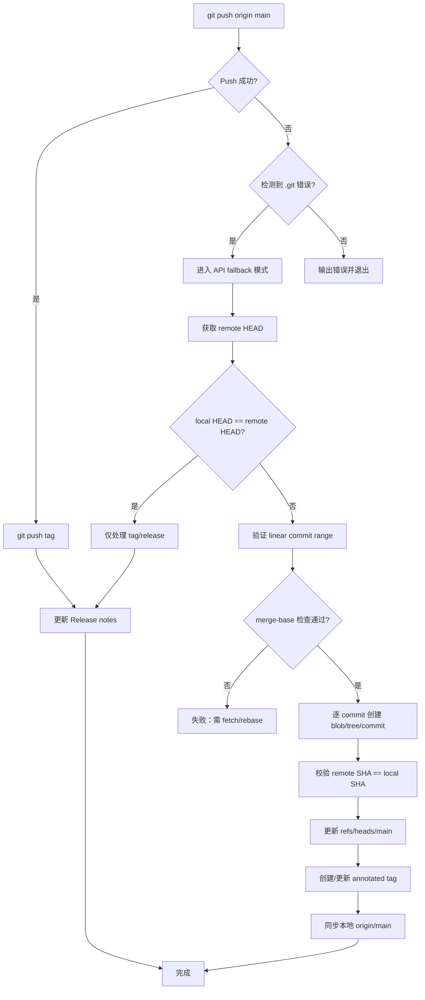
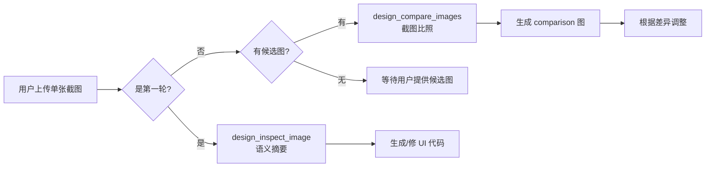
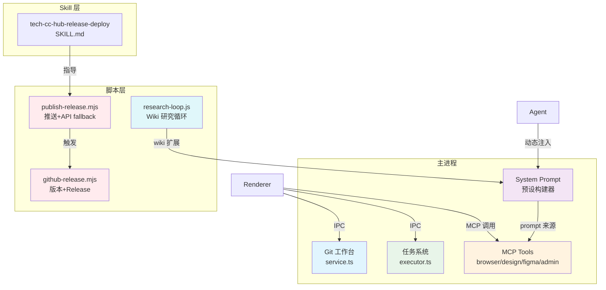

# 组件设计规格

<cite>
**本文引用的文件**
- [skills/tech-cc-hub-release-deploy/scripts/publish-release.mjs](file://skills/tech-cc-hub-release-deploy/scripts/publish-release.mjs)
- [scripts/github-release.mjs](file://scripts/github-release.mjs)
- [src/electron/libs/system-prompt-presets.ts](file://src/electron/libs/system-prompt-presets.ts)
- [skills/tech-cc-hub-release-deploy/SKILL.md](file://skills/tech-cc-hub-release-deploy/SKILL.md)
- [skills/tech-cc-hub-release-deploy/agents/openai.yaml](file://skills/tech-cc-hub-release-deploy/agents/openai.yaml)
- [pro-workflow/skills/wiki-research-loop/scripts/research-loop.js](file://pro-workflow/skills/wiki-research-loop/scripts/research-loop.js)
- [src/electron/libs/git/README.md](file://src/electron/libs/git/README.md)
- [src/electron/libs/mcp-tools/README.md](file://src/electron/libs/mcp-tools/README.md)
- [src/electron/libs/task/README.md](file://src/electron/libs/task/README.md)
</cite>

# 组件设计规格

本文档描述 tech-cc-hub 的核心组件设计，涵盖发布部署系统、MCP 工具集、Git 工作台和任务系统四大模块。

---

## 目录

- [1. 发布部署系统](#1-发布部署系统)
  - [1.1 职责边界](#11-职责边界)
  - [1.2 发布脚本入口与参数](#12-发布脚本入口与参数)
  - [1.3 API Fallback 调用链](#13-api-fallback-调用链)
  - [1.4 失败模式与排障](#14-失败模式与排障)
  - [1.5 扩展点](#15-扩展点)
- [2. MCP 工具集](#2-mcp-工具集)
  - [2.1 工具分类与边界](#21-工具分类与边界)
  - [2.2 设计工具触发规则](#22-设计工具触发规则)
  - [2.3 飞书文档直读](#23-飞书文档直读)
- [3. System Prompt 预设体系](#3-system-prompt-预设体系)
  - [3.1 预设构建器](#31-预设构建器)
  - [3.2 工具调用优化策略](#32-工具调用优化策略)
- [4. Git 工作台](#4-git-工作台)
  - [4.1 边界与权限模型](#41-边界与权限模型)
  - [4.2 第一版允许/禁止操作](#42-第一版允许禁止操作)
- [5. 任务系统](#5-任务系统)
  - [5.1 模块边界](#51-模块边界)
  - [5.2 Executor 调度原则](#52-executor-调度原则)
- [6. 组件关系总览](#6-组件关系总览)

---

## 1. 发布部署系统

发布部署系统由两个核心脚本组成：`publish-release.mjs`（Windows 友好，推送并处理 API fallback）和 `github-release.mjs`（版本 bump + Release 创建）。

### 1.1 职责边界

| 脚本 | 职责 | 部署路径 |
|------|------|----------|
| `publish-release.mjs` | HEAD 推送、API fallback、移动 tag、更新 Release body | Windows main 推送专用 |
| `github-release.mjs` | 版本 bump（patch/minor/major）、commit/tag 创建、GitHub Release API | 通用版本发布流程 |

两脚本职责不重叠：`publish-release` 只推当前 HEAD，不改版本；`github-release` 只管版本递增和 Release 创建，不负责推送。

章节来源：[SKILL.md#L1-L9](file://skills/tech-cc-hub-release-deploy/SKILL.md#L1-L9)

### 1.2 发布脚本入口与参数

**publish-release.mjs** 调用方式：

```powershell
# 标准推送
node skills/tech-cc-hub-release-deploy/scripts/publish-release.mjs

# 带 tag 推送并移动
node skills/tech-cc-hub-release-deploy/scripts/publish-release.mjs --tag v0.1.13 --retag --delete-release

# 只更新发布说明
node skills/tech-cc-hub-release-deploy/scripts/publish-release.mjs --tag v0.1.13 --notes .tmp/release-notes.md --notes-only

# API-only 模式（git push 失败时）
node skills/tech-cc-hub-release-deploy/scripts/publish-release.mjs --api-only
```

| 参数 | 作用 |
|------|------|
| `--tag` | 指定版本 tag，如 `v0.1.13` |
| `--retag` | 允许移动已有 tag |
| `--delete-release` | 先删除已有 GitHub Release |
| `--notes <path>` | Release notes 文件路径 |
| `--notes-only` | 仅更新已有 Release 的 body |
| `--api-only` | 跳过 git push，直接走 GitHub API |

Token 获取优先级：`GH_TOKEN` → `GITHUB_TOKEN` → `git credential fill`。

章节来源：[publish-release.mjs#L12-L28](file://skills/tech-cc-hub-release-deploy/scripts/publish-release.mjs#L12-L28)

**github-release.mjs** 调用方式：

```bash
# 标准发布（patch）
node scripts/github-release.mjs patch

# minor/major
node scripts/github-release.mjs minor
node scripts/github-release.mjs major

# 指定版本
node scripts/github-release.mjs v1.2.3

# 不推送到远程
node scripts/github-release.mjs patch --no-push

# 不创建 GitHub Release
node scripts/github-release.mjs patch --no-release

# 允许 dirty worktree
node scripts/github-release.mjs patch --allow-dirty

# dry-run
node scripts/github-release.mjs patch --dry-run
```

版本号必须符合 semver（支持可选 pre-release 后缀）。若当前版本已为目标版本，脚本跳过 `npm version` 步骤。

章节来源：[github-release.mjs#L37-L43](file://scripts/github-release.mjs#L37-L43)

### 1.3 API Fallback 调用链

当普通 `git push` 失败（如 Windows 上的 .git 路径发现问题），`publish-release.mjs` 自动切换到 GitHub API 线性推送：



**线性提交约束**：API fallback 只支持远端 `main` 是本地 HEAD 祖先的线性范围。若 merge-base 不满足，脚本拒绝操作。

章节来源：[publish-release.mjs#L264-L277](file://skills/tech-cc-hub-release-deploy/scripts/publish-release.mjs#L264-L277)

### 1.4 失败模式与排障

| 失败场景 | 检测方式 | 处理方式 |
|----------|----------|----------|
| 缺少 GitHub token | `getCredentialToken()` 返回空 | 退出并提示设置 `GH_TOKEN` |
| 远端非祖先 | `merge-base` 与 `remoteHead` 不一致 | 提示先 fetch/rebase |
| 非线性提交范围 | `readSingleParent` 返回多父节点 | 脚本拒绝 API fallback |
| tree SHA 不匹配 | `assertCleanApiTree` 校验失败 | 脚本退出，排查 blob 创建问题 |
| commit SHA 不匹配 | `nextCommit.sha !== commit` | 脚本退出，GitHub API 创建的 commit SHA 与本地不一致 |
| tag 已存在 | `--retag` 未传入且 tag 存在 | 拒绝创建，提示加 `--retag` |

**API fallback 后验证**：

```powershell
git rev-parse HEAD
git rev-parse origin/main
git ls-remote --heads origin main
```

三者应指向同一 commit。若 SHA 不一致，检查脚本输出中的 tree/commit mismatch。

章节来源：[publish-release.mjs#L187-L192](file://skills/tech-cc-hub-release-deploy/scripts/publish-release.mjs#L187-L192)

### 1.5 扩展点

- **Credential 读取**：可扩展支持更多 token 来源（如 GitHub App JWT）。
- **Release notes 模板**：通过 `--release-note-template` 参数指定自定义模板。
- **多仓库支持**：当前硬编码 `lst016/tech-cc-hub`，可通过环境变量或参数解耦。

章节来源：[github-release.mjs#L175-L181](file://scripts/github-release.mjs#L175-L181)

---

## 2. MCP 工具集

MCP 工具集集中存放于 `src/electron/libs/mcp-tools/`，由主进程暴露给 Agent，Renderer 不直接操作。

### 2.1 工具分类与边界

| 工具文件 | 能力描述 | Host 边界 |
|----------|----------|-----------|
| `browser.ts` | 导航、截图摘要、DOM 查询、样式检查、标注模式 | 不直接操作 React UI |
| `design.ts` | 截图语义分析、比照、diff 图、热点区域、JSON report | 返回摘要和路径，避免大图明文 |
| `figma-rest.ts` | 文件/节点读取、设计树、token 提取、Tailwind 初稿 | 只读工具面 |
| `admin.ts` | 写入 `agent-runtime.json` 的 `env`、`skillCredentials` 等 | 受控管理能力 |

**关键约束**：
- 所有工具返回给模型的内容应是摘要、路径和结构化 JSON，避免塞入大图或密钥明文。
- 涉及写入磁盘或配置的工具必须有字段 allowlist 和体积上限。

章节来源：[mcp-tools/README.md#L1-L15](file://src/electron/libs/mcp-tools/README.md#L1-L15)

### 2.2 设计工具触发规则

设计工具按以下规则自动触发：

1. **用户给出截图/Figma 图/页面参考图**，要求生成或修改 UI/前端代码。
2. **用户反馈页面和参考图不一致**，需要按截图修 UI。

**单张用户截图处理流程**：



**设计工具关键参数**：

| 参数 | 用途 | 使用场景 |
|------|------|----------|
| `ignoreRegions` | 忽略动态区域 | 时间戳、头像、动画帧 |
| `maxDifferenceRatio` | 验收阈值 | 0.0~1.0，传值后返回通过/失败结论 |
| `ignoreAntialiasing` | 忽略文字抗锯齿噪声 | 文字边缘模糊时 |
| `diffColorMode` | 变亮/变暗区分 | 设为 `directional` |

后续轮次恢复证据：`design_list_artifacts` 找最近产物 → `design_read_comparison_report` 读取 JSON report。

章节来源：[mcp-tools/README.md#L16-L22](file://src/electron/libs/mcp-tools/README.md#L16-L22)

### 2.3 飞书文档直读

当用户 prompt 包含飞书文档链接时，`system-prompt-presets.ts` 自动提取并注入 lark-cli 命令：

```typescript
// URL 模式匹配
const FEISHU_DOC_URL_PATTERN = /https?:\/\/[^\s<>"'`]*feishu\.cn\/(?:wiki|docx|docs)\/[^\s<>"'`]*/gi;

// 触发条件：必须同时配置 LARK_CLI_COMMAND 和 LARK_CLI_PROFILE
const hasLarkCliCommand = Boolean(runtimeEnv.LARK_CLI_COMMAND?.trim());
const hasLarkCliProfile = Boolean(runtimeEnv.LARK_CLI_PROFILE?.trim());
```

注入的命令格式：

```bash
$LARK_CLI_COMMAND --profile $LARK_CLI_PROFILE docs +fetch --doc "<url>" --format pretty 2>&1
```

每次最多注入 3 个 URL（`MAX_FEISHU_DOC_URL_HINTS = 3`）。

章节来源：[system-prompt-presets.ts#L7-L10](file://src/electron/libs/system-prompt-presets.ts#L7-L10)

---

## 3. System Prompt 预设体系

System Prompt 预设体系负责动态构建 Agent 的系统级提示词，聚合多个独立构建器的输出。

### 3.1 预设构建器

| 构建器函数 | 输出内容 | 调用时机 |
|------------|----------|----------|
| `buildBrowserWorkbenchPromptAppend` | BrowserView 规则、内置 MCP 工具优先 | 始终注入 |
| `buildAdminConfigPromptAppend` | `agent-runtime.json` 写入规则 | 配置治理场景 |
| `buildToolCallOptimizationPromptAppend` | 工具预算、批量读取、Task 使用边界 | 始终注入 |
| `buildDesignParityPromptAppend` | 设计还原规则、设计 MCP 触发条件 | UI 相关任务 |
| `buildBuiltinMcpRegistryPromptAppend` | 内置 MCP server hints | 始终注入 |
| `buildClaudeCode2139FeaturePromptAppend` | Claude Code 兼容性 | Claude Code 模式 |
| `buildFeishuDocumentFetchPromptAppend` | 飞书文档直读规则 | prompt 含飞书 URL 时 |

预设通过 `buildTechCCHubSystemPromptSources()` 聚合为 `PromptLedgerSource[]`，统一挂载到 ledger。

章节来源：[system-prompt-presets.ts#L136-L175](file://src/electron/libs/system-prompt-presets.ts#L136-L175)

### 3.2 工具调用优化策略

`buildToolCallOptimizationPromptAppend` 强制约束：

| 规则 | 说明 |
|------|------|
| **预算约束** | 只有答案依赖外部状态时才调用工具 |
| **批量读取** | 2+ 独立只读操作应在一个并行轮次完成 |
| **Task 使用边界** | 只在工作拆分为 2+ 独立代码路径时使用；单一文件读取、紧耦合调查链直接处理 |
| **bounded search** | 未知目标时先用一次 `rg/find` 限范围，再读命中区域 |
| **文件读取上限** | 默认不超过 200 行 |
| **验证策略** | Edit/Write 后立即运行最小验证，不全读文件 |
| **副作用分离** | writes/deletes/moves/installs/commits 单独调用 |

章节来源：[system-prompt-presets.ts#L28-L42](file://src/electron/libs/system-prompt-presets.ts#L28-L42)

---

## 4. Git 工作台

Git 工作台是 Electron 主进程模块，Renderer 通过 IPC 调用，不直接执行 git。

### 4.1 边界与权限模型

```
src/electron/libs/git/
├── types.ts        # 领域类型和 IPC payload/result
├── errors.ts       # Git 错误归一化
├── service.ts      # 唯一 Git 操作入口
├── history.ts      # commit history parser
├── graph.ts        # lightweight graph lane 生成
├── operation-log.ts # 本地高影响操作日志
├── ipc.ts          # Electron IPC handler 注册
└── index.ts        # 对外统一出口
```

**安全边界**：所有 git 操作必须经 `service.ts`，禁止 Renderer 直接 `child_process.spawn("git")`。

章节来源：[git/README.md#L1-L14](file://src/electron/libs/git/README.md#L1-L14)

### 4.2 第一版允许/禁止操作

| 允许 | 禁止 |
|------|------|
| status / diff | reset |
| stage / unstage | rebase |
| commit | cherry-pick |
| ordinary push | force push |
| create / checkout branch | amend |
| stash save / apply / drop | squash |
| recent history / lightweight graph | interactive rebase |

章节来源：[git/README.md#L16-L34](file://src/electron/libs/git/README.md#L16-L34)

---

## 5. 任务系统

任务系统主进程代码统一收在 `src/electron/libs/task/`。

### 5.1 模块边界

```
src/electron/libs/task/
├── types.ts              # 任务、执行记录、IPC payload 领域类型
├── provider-registry.ts  # Provider 注册表和 fallback provider
├── providers/            # 外部任务源适配器（目前含 Lark）
├── repository.ts         # SQLite schema、任务状态、执行记录持久化
├── workflow.ts           # Symphony-style workflow 配置、轮询、重试参数
├── workspace.ts          # 独立 workspace 创建和路径安全
├── executor.ts           # 编排器：同步、自动执行、并发控制、重试、恢复
└── index.ts              # 对外统一出口
```

章节来源：[task/README.md#L1-L14](file://src/electron/libs/task/README.md#L1-L14)

### 5.2 Executor 调度原则

| 原则 | 说明 |
|------|------|
| **Provider 隔离** | Provider 只负责把第三方任务映射为 `ExternalTask`，不直接改 UI 或会话 |
| **Repository 职责** | 只做持久化，不启动 runner |
| **Executor 唯一调度** | 所有自动/手动执行都经过这里 |
| **Workspace 隔离** | 每个任务使用独立 workspace，避免互相污染 |
| **Schema 演进** | 旧任务库数据允许丢弃，schema 变化优先保持代码简单 |

章节来源：[task/README.md#L16-L22](file://src/electron/libs/task/README.md#L16-L22)

---

## 6. 组件关系总览



**核心调用约定**：
- Renderer 只通过 IPC 与主进程通信，不直接执行 git 或其他系统命令。
- MCP 工具由 Agent 调用，主进程提供工具定义和执行环境。
- System Prompt 预设动态聚合，工具调用策略统一约束。
- 发布脚本与 Skill 绑定，Windows 场景优先使用 API fallback。

图表来源：[组件关系总览](file://src/electron/libs/git/README.md#L1-L14)

---

## 附录：关键文件速查

| 功能 | 文件路径 |
|------|----------|
| 发布脚本（Windows） | `skills/tech-cc-hub-release-deploy/scripts/publish-release.mjs` |
| 发布脚本（通用） | `scripts/github-release.mjs` |
| Skill 定义 | `skills/tech-cc-hub-release-deploy/SKILL.md` |
| System Prompt 预设 | `src/electron/libs/system-prompt-presets.ts` |
| Git 模块 | `src/electron/libs/git/` |
| MCP 工具 | `src/electron/libs/mcp-tools/` |
| 任务系统 | `src/electron/libs/task/` |
| Wiki 研究循环 | `pro-workflow/skills/wiki-research-loop/scripts/research-loop.js` |