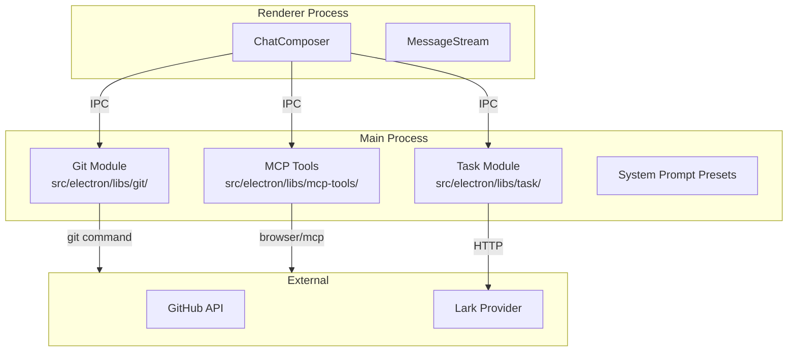
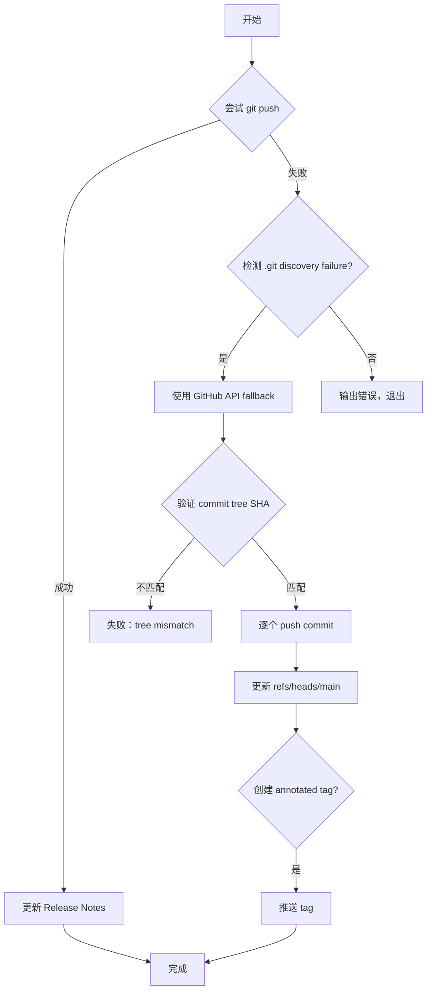
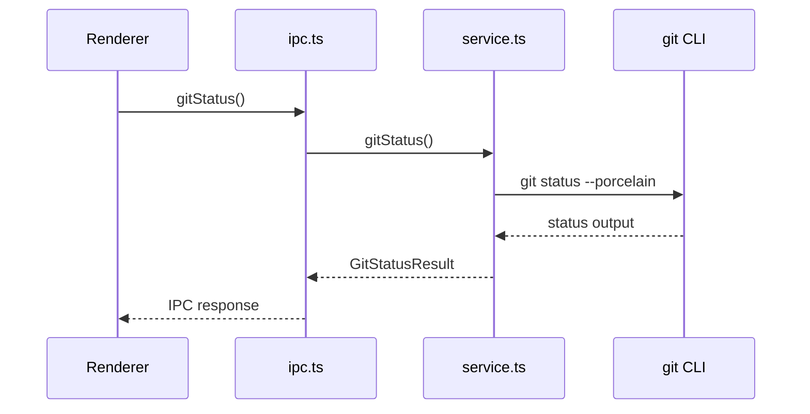
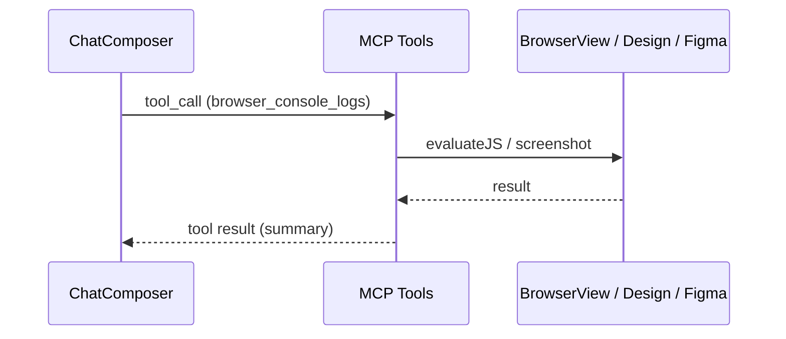
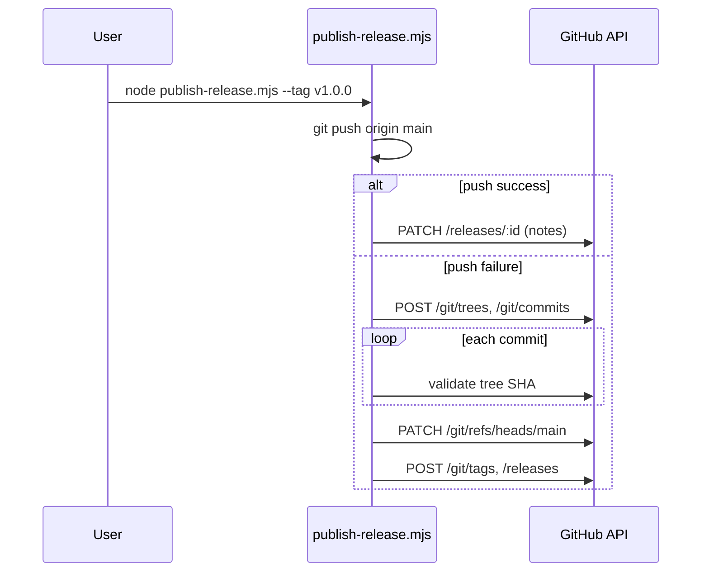

# 聊天工作台组件

<cite>
**本文引用的文件**
- [skills/tech-cc-hub-release-deploy/scripts/publish-release.mjs](file://skills/tech-cc-hub-release-deploy/scripts/publish-release.mjs)
- [scripts/github-release.mjs](file://scripts/github-release.mjs)
- [src/electron/libs/system-prompt-presets.ts](file://src/electron/libs/system-prompt-presets.ts)
- [skills/tech-cc-hub-release-deploy/SKILL.md](file://skills/tech-cc-hub-release-deploy/SKILL.md)
- [skills/tech-cc-hub-release-deploy/agents/openai.yaml](file://skills/tech-cc-hub-release-deploy/agents/openai.yaml)
- [pro-workflow/skills/wiki-research-loop/scripts/research-loop.js](file://pro-workflow/skills/wiki-research-loop/scripts/research-loop.js)
- [src/electron/libs/git/README.md](file://src/electron/libs/git/README.md)
- [src/electron/libs/mcp-tools/README.md](file://src/electron/libs/mcp-tools/README.md)
- [src/electron/libs/task/README.md](file://src/electron/libs/task/README.md)
</cite>

---

## 目录

- [概述](#概述)
- [模块边界与职责](#模块边界与职责)
- [Git 工作台模块](#git-工作台模块)
- [MCP 工具模块](#mcp-工具模块)
- [任务编排模块](#任务编排模块)
- [发布部署 Skill](#发布部署-skill)
- [系统提示词预置](#系统提示词预置)
- [入口与调用链](#入口与调用链)
- [扩展点](#扩展点)

---

## 概述

`tech-cc-hub` 的聊天工作台是一个以 Electron 为主体的桌面应用，右侧集成了浏览器工作台、Git 操作、任务编排等能力。本文档基于源码和规格文档，解释各模块的职责边界、数据结构和扩展机制。

> **说明**：本项目存在 `doc/40-engineering/chat-composer/spec.md` 和 `preview-workbench/spec.md`，但引用的代码文件中未直接包含这些组件的实现。当前文档聚焦于已确认的模块：Git 工作台、MCP 工具、任务编排和发布部署 Skill。

---

## 模块边界与职责

### 架构分层



**图表来源**：[src/electron/libs/git/README.md#L3-L4](file://src/electron/libs/git/README.md#L3-L4)、[src/electron/libs/mcp-tools/README.md#L3-L4](file://src/electron/libs/mcp-tools/README.md#L3-L4)、[src/electron/libs/task/README.md#L3-L4](file://src/electron/libs/task/README.md#L3-L4)

---

## Git 工作台模块

### 职责

右侧 Git 工作台的主进程模块，Renderer 通过 IPC 调用，不直接执行 git 命令。

### 目录结构

| 文件 | 职责 |
|------|------|
| `types.ts` | Git 工作台领域类型和 IPC payload/result |
| `errors.ts` | Git 错误归一化 |
| `service.ts` | 唯一 Git 操作入口 |
| `history.ts` | commit history parser |
| `graph.ts` | lightweight graph lane 生成 |
| `operation-log.ts` | 本地高影响操作日志 |
| `ipc.ts` | Electron IPC handler 注册 |
| `index.ts` | 对外统一出口 |

**章节来源**：[src/electron/libs/git/README.md#L7-L14](file://src/electron/libs/git/README.md#L7-L14)

### 第一版允许的操作

- status / diff
- stage / unstage
- commit
- ordinary push
- create / checkout branch
- stash save / apply / drop
- recent history / lightweight graph

### 第一版禁止的操作

- reset, rebase, cherry-pick, force push, amend, squash, interactive rebase

**章节来源**：[src/electron/libs/git/README.md#L16-L34](file://src/electron/libs/git/README.md#L16-L34)

---

## MCP 工具模块

### 职责

集中存放暴露给 Agent 的内置 MCP 工具，避免 `libs` 根目录随工具增多变得难审。

### 工具清单

| 工具文件 | 能力描述 |
|----------|----------|
| `browser.ts` | BrowserView 工作台：导航、截图摘要、DOM 查询、样式检查、标注模式 |
| `design.ts` | 截图语义分析、对比、diff 图、热点区域、JSON report、历史产物回看 |
| `figma-rest.ts` | Figma PAT 只读：文件/节点读取、设计树、token 提取、Dev Resources |
| `admin.ts` | 受控管理：写入 `agent-runtime.json` 的 `env`、`skillCredentials` 等全局参数 |

**章节来源**：[src/electron/libs/mcp-tools/README.md#L5-L8](file://src/electron/libs/mcp-tools/README.md#L5-L8)

### 设计工具默认触发条件

1. 用户给出截图、Figma 图、页面参考图，并要求生成或修改 UI/前端代码
2. 用户反馈页面和参考图不一致，需要按截图修 UI
3. 单张用户截图先走 `design_inspect_image` 做语义摘要；已有候选图后再走截图比照

### 动态区域处理

- 时间、头像、动画帧等动态区域用 `ignoreRegions`
- 验收结论时传 `maxDifferenceRatio`
- 文字抗锯齿噪声多时开启 `ignoreAntialiasing`
- 恢复证据时用 `design_list_artifacts` 找最近产物，再用 `design_read_comparison_report` 读取 JSON report

**章节来源**：[src/electron/libs/mcp-tools/README.md#L16-L22](file://src/electron/libs/mcp-tools/README.md#L16-L22)

### 审阅重点

- 每个工具应有明确 host 边界，不直接操作 React UI
- 返回给模型的内容要尽量是摘要、路径和结构化 JSON，避免塞入大图或密钥明文
- 涉及写入磁盘或配置的工具必须有字段 allowlist 和体积上限

**章节来源**：[src/electron/libs/mcp-tools/README.md#L10-L14](file://src/electron/libs/mcp-tools/README.md#L10-L14)

---

## 任务编排模块

### 职责

任务系统主进程代码统一收在这个目录，避免 `src/electron/libs` 根目录继续散落 `task-*` 文件。

### 目录结构

| 文件 | 职责 |
|------|------|
| `types.ts` | 任务、执行记录、IPC payload 的领域类型 |
| `provider-registry.ts` | Provider 注册表和 fallback provider |
| `providers/` | 外部任务源适配器，目前包含 Lark |
| `repository.ts` | SQLite schema、任务状态、执行记录和日志持久化 |
| `workflow.ts` | Symphony-style workflow 配置、轮询、重试和 stall 默认参数 |
| `workspace.ts` | 每个任务的独立 workspace 创建和路径安全 |
| `executor.ts` | 编排器：同步、自动执行、并发控制、重试、恢复和日志事件 |
| `index.ts` | 对外统一出口 |

**章节来源**：[src/electron/libs/task/README.md#L7-L14](file://src/electron/libs/task/README.md#L7-L14)

### 运行原则

- 外部 provider 只负责把第三方任务映射成 `ExternalTask`，不直接改 UI 或会话
- Repository 只做持久化，不启动 runner
- Executor 是唯一调度入口，所有自动/手动执行都经过这里
- 任务执行使用独立 workspace，避免多个任务互相污染
- 旧任务库数据允许丢弃，schema 变化优先保持代码简单

**章节来源**：[src/electron/libs/task/README.md#L16-L22](file://src/electron/libs/task/README.md#L16-L22)

---

## 发布部署 Skill

### 职责

用于在 tech-cc-hub Windows 仓库里提交、推送、打包、发布、移动版本 tag、补 GitHub Release 更新内容。

### 入口脚本

| 脚本 | 用途 |
|------|------|
| `scripts/publish-release.mjs` | 主发布脚本 |
| `scripts/github-release.mjs` | GitHub Release 管理 |

**章节来源**：[skills/tech-cc-hub-release-deploy/SKILL.md#L22-L23](file://skills/tech-cc-hub-release-deploy/SKILL.md#L22-L23)

### 默认发布流程

1. 确认范围：`git status --short --branch`、`git diff --stat`、`git log --oneline --decorate --max-count=8`
2. 判断窄范围提交还是全量提交；用户说"都要提交"时用 `git add -A`
3. 提交前验证：UI/Electron 改动跑定向 `npx eslint`；发布构建跑 `npm run package:win`
4. commit message 按 `AGENTS.md` 的 Lore trailer 风格写
5. 推送统一用 skill 脚本，不在 Windows push 抽风后反复裸跑 `git push`
6. 轮询新的 `Release` workflow（不是旧的 `Build and Release`）
7. 确认 GitHub Release 里有 `latest.yml` 和 Windows 安装包
8. 发布说明为空或过旧时用 `--notes-only` 补更新内容

**章节来源**：[skills/tech-cc-hub-release-deploy/SKILL.md#L10-L28](file://skills/tech-cc-hub-release-deploy/SKILL.md#L10-L28)

### publish-release.mjs 行为



**图表来源**：[skills/tech-cc-hub-release-deploy/scripts/publish-release.mjs#L364-L385](file://skills/tech-cc-hub-release-deploy/scripts/publish-release.mjs#L364-L385)

#### 关键函数

| 函数 | 行号 | 作用 |
|------|------|------|
| `git()` | L39 | 执行 git 命令，128MB buffer |
| `publishViaApi()` | L251 | GitHub API fallback 主逻辑 |
| `createApiTreeForCommit()` | L213 | 创建 blob、tree、commit 并校验 |
| `getCredentialToken()` | L75 | 从 `GH_TOKEN`/`GITHUB_TOKEN`/git credential 读取 token |

#### API Fallback 约束

- 只支持远端 `main` 是本地 `HEAD` 祖先的线性提交范围
- 如果远端已变化，先 fetch/rebase
- 按本地 commit 顺序逐个创建 blob、tree、commit，并校验 GitHub tree SHA 必须等于本地 commit tree
- 传入 author、committer 和原始 commit message，正常情况下远端 commit SHA 和本地 SHA 完全一致

**章节来源**：[skills/tech-cc-hub-release-deploy/SKILL.md#L59-L70](file://skills/tech-cc-hub-release-deploy/SKILL.md#L59-L70)

### 常用命令

```powershell
# 发布当前 HEAD 并移动 release tag
node skills/tech-cc-hub-release-deploy/scripts/publish-release.mjs --tag v0.1.13 --retag --delete-release

# 只更新发布说明
node skills/tech-cc-hub-release-deploy/scripts/publish-release.mjs --tag v0.1.13 --notes .tmp/release-notes-v0.1.13.md --notes-only

# 只推当前 HEAD 到 origin/main
node skills/tech-cc-hub-release-deploy/scripts/publish-release.mjs

# Windows git push 报 .git discovery failure 时
node skills/tech-cc-hub-release-deploy/scripts/publish-release.mjs --api-only
```

**章节来源**：[skills/tech-cc-hub-release-deploy/SKILL.md#L31-L49](file://skills/tech-cc-hub-release-deploy/SKILL.md#L31-L49)

### GitHub Release 脚本 (github-release.mjs)

| 参数 | 作用 |
|------|------|
| `patch/minor/major/vX.Y.Z` | 版本号增量 |
| `--dry-run` | 预览不实际执行 |
| `--no-push` | 只创建 commit 和 tag，不 push |
| `--allow-dirty` | 允许 dirty worktree |
| `--no-release` | 不调用 GitHub API 创建 Release |
| `--release-note-template <path>` | 自定义发布说明模板 |

**章节来源**：[scripts/github-release.mjs#L37-L44](file://scripts/github-release.mjs#L37-L44)

---

## 系统提示词预置

### 预置清单

| 预置 ID | 标签 | 触发条件 |
|---------|------|----------|
| `tech-cc-hub-browser-preset` | tech-cc-hub 内置浏览器预设 | BrowserView 工作台相关任务 |
| `tech-cc-hub-admin-preset` | tech-cc-hub 配置治理预设 | 写入 `agent-runtime.json` 时 |
| `tech-cc-hub-tool-policy-preset` | tech-cc-hub 工具调用预设 | 工具调用优化场景 |
| `tech-cc-hub-design-preset` | tech-cc-hub 设计还原预设 | UI/前端代码生成或修改 |
| `tech-cc-hub-builtin-mcp-registry-preset` | built-in MCP registry preset | MCP 工具面查询 |
| `tech-cc-hub-claude-code-2139-preset` | Claude Code 2.1.139 compatibility | Claude Code 兼容性场景 |

**章节来源**：[src/electron/libs/system-prompt-presets.ts#L136-L175](file://src/electron/libs/system-prompt-presets.ts#L136-L175)

### 关键预置内容

#### 工具调用优化预置 (`buildToolCallOptimizationPromptAppend`)

- 使用工具前先分组所需证据
- 多个独立搜索/读取/检查可并行执行
- 独立代码路径才用 `Task` tool
- 单文件读取不拆分
- 默认读取不超过 200 行
- 写操作后立即做最小验证

**章节来源**：[src/electron/libs/system-prompt-presets.ts#L28-L42](file://src/electron/libs/system-prompt-presets.ts#L28-L42)

#### 设计还原预置 (`buildDesignParityPromptAppend`)

- 用户给出截图/Figma 图/参考图并要求生成或修改 UI/前端代码时使用
- 单张用户截图先走 `design_inspect_image`
- `design_capture_current_view` 保存 BrowserView 截图
- `design_compare_current_view` / `design_compare_images` 返回 diff 图和三栏 comparison
- 批量场景用 `design_compare_current_view_batch`
- 用 `design_read_comparison_report` 复查差异和验收结论
- 用 `design_list_artifacts` 找回最近视觉产物

**章节来源**：[src/electron/libs/system-prompt-presets.ts#L125-L133](file://src/electron/libs/system-prompt-presets.ts#L125-L133)

---

## 入口与调用链

### Git 工作台 IPC 入口



**图表来源**：[src/electron/libs/git/README.md#L12-L13](file://src/electron/libs/git/README.md#L12-L13)

### MCP 工具调用链



**图表来源**：[src/electron/libs/mcp-tools/README.md#L3-L8](file://src/electron/libs/mcp-tools/README.md#L3-L8)

### 发布部署调用链



**图表来源**：[skills/tech-cc-hub-release-deploy/scripts/publish-release.mjs#L251-L352](file://skills/tech-cc-hub-release-deploy/scripts/publish-release.mjs#L251-L352)

---

## 扩展点

### 1. 新增 MCP 工具

路径：`src/electron/libs/mcp-tools/`

步骤：
1. 在该目录下创建新工具文件（如 `new-tool.ts`）
2. 实现工具函数，返回摘要/路径/结构化 JSON
3. 在 `index.ts` 中注册导出
4. 确保不直接操作 React UI

**章节来源**：[src/electron/libs/mcp-tools/README.md#L9-L10](file://src/electron/libs/mcp-tools/README.md#L9-L10)

### 2. 新增任务 Provider

路径：`src/electron/libs/task/providers/`

步骤：
1. 在 `providers/` 目录下创建适配器（如 `lark.ts`）
2. 实现 `ExternalTask` 映射逻辑
3. 在 `provider-registry.ts` 中注册

**章节来源**：[src/electron/libs/task/README.md#L8-L9](file://src/electron/libs/task/README.md#L8-L9)

### 3. 新增系统预置

路径：`src/electron/libs/system-prompt-presets.ts`

步骤：
1. 添加 `buildXxxPromptAppend()` 函数
2. 在 `buildTechCCHubSystemPromptSources()` 中添加 `PromptLedgerSource` 记录
3. 预置 ID 遵循 `tech-cc-hub-{feature}-preset` 命名

**章节来源**：[src/electron/libs/system-prompt-presets.ts#L136-L175](file://src/electron/libs/system-prompt-presets.ts#L136-L175)

### 4. 发布说明模板扩展

路径：`scripts/github-release.mjs`

默认模板变量：
- `{{title}}` - 解析后的标题
- `{{tag}}` - 版本 tag
- `{{commits}}` - 提交列表
- `{{files}}` - 变更文件列表
- `{{generated_at}}` - 生成时间
- `{{source}}` - 来源描述

自定义模板：`--release-note-template <path>`

**章节来源**：[scripts/github-release.mjs#L46-L57](file://scripts/github-release.mjs#L46-L57)

---

## 失败模式与排障

### Git push 失败（.git discovery failure on Windows）

```
fatal: not a git repository (or any of the parent directories): .git
```

**处理**：
```powershell
node skills/tech-cc-hub-release-deploy/scripts/publish-release.mjs --api-only
```

**章节来源**：[skills/tech-cc-hub-release-deploy/SKILL.md#L51-L55](file://skills/tech-cc-hub-release-deploy/SKILL.md#L51-L55)

### API fallback 后 SHA 不一致

```powershell
git rev-parse HEAD
git rev-parse origin/main
git ls-remote --heads origin main
```

三者应指向同一 commit。若 SHA 不一致，检查脚本输出里的 tree/commit mismatch。

**章节来源**：[skills/tech-cc-hub-release-deploy/SKILL.md#L72-L80](file://skills/tech-cc-hub-release-deploy/SKILL.md#L72-L80)

### Token 获取失败

优先级：`GH_TOKEN` → `GITHUB_TOKEN` → `git credential fill`

若均失败，脚本输出 `Missing GitHub token. Set GH_TOKEN/GITHUB_TOKEN or login with Git credential manager.` 并退出。

**章节来源**：[skills/tech-cc-hub-release-deploy/scripts/publish-release.mjs#L75-L85](file://skills/tech-cc-hub-release-deploy/scripts/publish-release.mjs#L75-L85)

### 任务执行 stall

检查 `workflow.ts` 中的 stall 默认参数和重试配置。Executor 会自动重试，恢复后继续。

**章节来源**：[src/electron/libs/task/README.md#L11](file://src/electron/libs/task/README.md#L11)

---

## 相关文档

- [Git Module README](file://src/electron/libs/git/README.md)
- [MCP Tools README](file://src/electron/libs/mcp-tools/README.md)
- [Task Module README](file://src/electron/libs/task/README.md)
- [tech-cc-hub-release-deploy SKILL](file://skills/tech-cc-hub-release-deploy/SKILL.md)
- [Chat Composer Spec](file://doc/40-engineering/chat-composer/spec.md)（待实现）
- [Preview Workbench Spec](file://doc/40-engineering/preview-workbench/spec.md)（待实现）