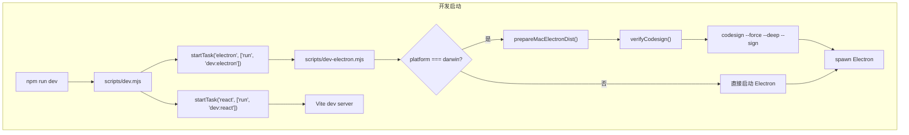
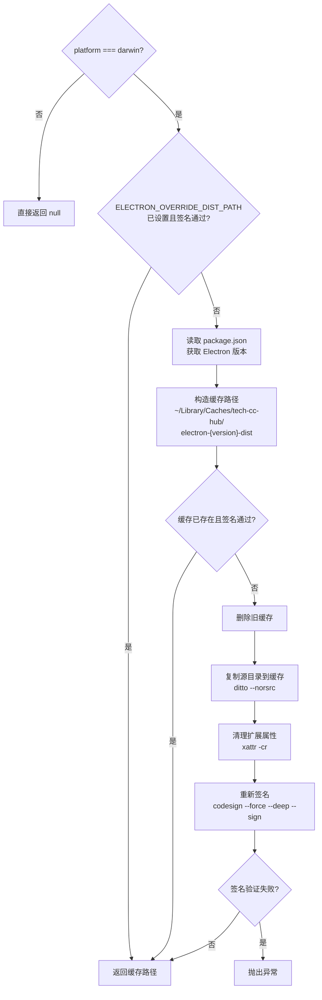
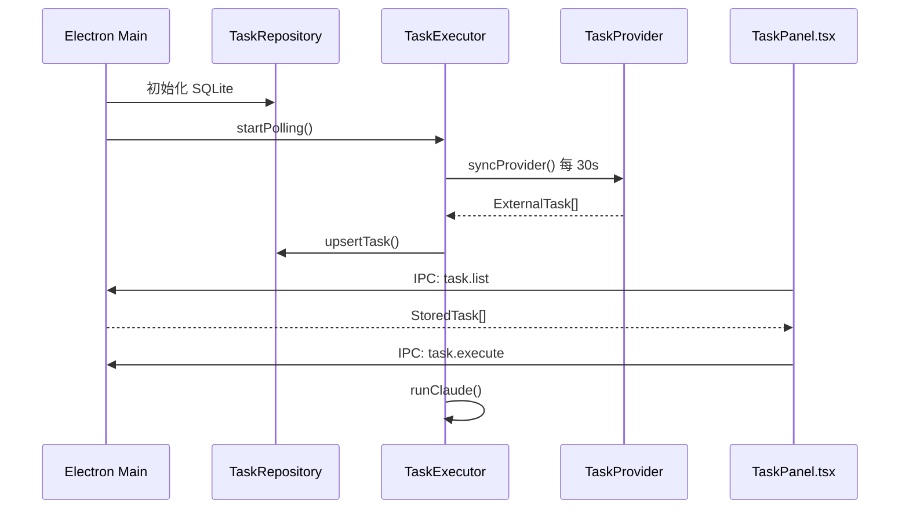

# 开发启动脚本

本文档描述 `tech-cc-hub` 项目中 `scripts/dev.mjs` 和 `scripts/dev-electron.mjs` 的启动流程、进程管理机制和信号处理。

<cite>
**本文引用的文件**
- [scripts/dev.mjs](file://scripts/dev.mjs)
- [scripts/dev-electron.mjs](file://scripts/dev-electron.mjs)
- [src/electron/libs/task/README.md](file://src/electron/libs/task/README.md)
- [src/electron/libs/task/index.ts](file://src/electron/libs/task/index.ts)
- [src/electron/libs/task/executor.ts](file://src/electron/libs/task/executor.ts)
- [src/electron/libs/task/provider-registry.ts](file://src/electron/libs/task/provider-registry.ts)
- [src/electron/libs/task/providers/lark-provider.ts](file://src/electron/libs/task/providers/lark-provider.ts)
- [src/electron/libs/task/providers/tb-provider.ts](file://src/electron/libs/task/providers/tb-provider.ts)
- [src/electron/libs/task/repository.ts](file://src/electron/libs/task/repository.ts)
- [src/electron/libs/task/types.ts](file://src/electron/libs/task/types.ts)
- [src/electron/libs/task/workflow.ts](file://src/electron/libs/task/workflow.ts)
- [src/electron/libs/task/workspace.ts](file://src/electron/libs/task/workspace.ts)
- [src/ui/components/TaskPanel.tsx](file://src/ui/components/TaskPanel.tsx)
- [src/electron/libs/mcp-tools/cron.ts](file://src/electron/libs/mcp-tools/cron.ts)
- [scripts/codex-oauth-setup.mjs](file://scripts/codex-oauth-setup.mjs)
- [scripts/github-release.mjs](file://scripts/github-release.mjs)
</cite>

## 目录

- [概述](#概述)
- [脚本调用链路](#脚本调用链路)
- [dev.mjs 进程管理机制](#devmjs-进程管理机制)
- [dev-electron.mjs 启动流程](#dev-electronmjs-启动流程)
- [启动参数和环境配置](#启动参数和环境配置)
- [日志输出和错误处理](#日志输出和错误处理)
- [任务系统与启动脚本的集成](#任务系统与启动脚本的集成)
- [常见问题排查](#常见问题排查)
- [Agent 改代码地图](#agent-改代码地图)

---

## 概述

`tech-cc-hub` 的开发启动脚本采用两级架构：

1. **入口脚本** (`scripts/dev.mjs`)：负责同时启动 React 前端和 Electron 主进程
2. **Electron 引导脚本** (`scripts/dev-electron.mjs`)：在启动 Electron 前完成 macOS 代码签名验证和预缓存

这种设计确保了跨平台的一致性，同时针对 macOS 的代码签名要求做了专门处理。

[启动流程图](#启动流程图)

## 脚本调用链路



**核心调用链**：
```
npm run dev
  → npm run-script dev:electron
    → node scripts/dev-electron.mjs
      → node electron/cli.js
```

[章节来源](file://scripts/dev.mjs#L64-L65)

---

## dev.mjs 进程管理机制

### 核心数据结构

```javascript
const children = new Map();   // 存储子进程 { name -> ChildProcess }
let shuttingDown = false;     // 防止重复关闭的标志
```

[章节来源](file://scripts/dev.mjs#L2-L4)

### startTask 函数

`startTask` 是启动子进程的核心函数：

```javascript
function startTask(name, args) {
    const command = `npm ${args.join(" ")}`;
    const child = process.platform === "win32"
        ? spawn(process.env.ComSpec ?? "cmd.exe", ["/d", "/s", "/c", command], {
            stdio: "inherit",
            env: process.env,
            windowsHide: true,
        })
        : spawn("npm", args, {
            stdio: "inherit",
            env: process.env,
        });

    children.set(name, child);

    child.on("exit", (code, signal) => {
        children.delete(name);

        if (shuttingDown) return;

        if (code === 0) {
            stopAll(0);
            return;
        }

        const reason = signal ? `signal ${signal}` : `code ${code ?? "unknown"}`;
        console.error(`[dev] ${name} exited with ${reason}`);
        stopAll(typeof code === "number" && code !== 0 ? code : 1);
    });

    child.on("error", (error) => {
        console.error(`[dev] failed to start ${name}:`, error);
        stopAll(1);
    });
}
```

[章节来源](file://scripts/dev.mjs#L22-L58)

**关键行为**：
| 条件 | 行为 |
|------|------|
| 子进程正常退出 (code=0) | 调用 `stopAll(0)` 停止所有子进程，脚本正常退出 |
| 子进程异常退出 (code≠0) | 打印错误日志，调用 `stopAll(code)` 以非零状态退出 |
| 子进程被信号终止 | 打印错误日志，包含 signal 信息 |
| 启动失败 | 立即调用 `stopAll(1)` |

### stopAll 函数

```javascript
function stopAll(exitCode = 0) {
    if (shuttingDown) return;  // 幂等保护

    shuttingDown = true;

    for (const child of children.values()) {
        if (!child.killed) {
            child.kill();
        }
    }

    setTimeout(() => process.exit(exitCode), 500).unref();
}
```

[章节来源](file://scripts/dev.mjs#L6-L20)

**设计要点**：
- **幂等性**：通过 `shuttingDown` 标志防止重复调用
- **进程树清理**：遍历所有子进程并发送 kill 信号
- **延迟退出**：500ms 延迟确保子进程有足够时间清理

### 信号处理

```javascript
process.on("SIGINT", () => stopAll(0));
process.on("SIGTERM", () => stopAll(0));
```

[章节来源](file://scripts/dev.mjs#L60-L61)

监听两个终止信号，确保用户在终端按 Ctrl+C 时所有子进程都能被正确清理。

---

## dev-electron.mjs 启动流程

### 函数概览

| 函数 | 职责 |
|------|------|
| `run()` | 同步执行命令，失败抛出异常 |
| `runOptional()` | 同步执行命令，忽略失败 |
| `verifyCodesign()` | 验证 macOS 代码签名 |
| `shellQuote()` | 转义 shell 参数 |
| `electronVersionLabel()` | 从 package.json 读取 Electron 版本 |
| `cleanMacExtendedAttributes()` | 清理 macOS 扩展属性 |
| `prepareMacElectronDist()` | 准备已签名的 Electron.app |

### verifyCodesign

```javascript
function verifyCodesign(appPath) {
    const result = spawnSync("codesign", ["--verify", "--deep", "--strict", "--verbose=2", appPath], {
        cwd: repoRoot,
        encoding: "utf8",
        stdio: "pipe",
    });
    return result.status === 0;
}
```

[章节来源](file://scripts/dev-electron.mjs#L34-L41)

此函数使用 macOS 原生工具 `codesign` 进行深度签名验证：
- `--verify`：验证签名
- `--deep`：递归验证嵌入的代码签名
- `--strict`：严格模式，任何问题都视为失败

### electronVersionLabel

```javascript
function electronVersionLabel() {
    const packageJsonPath = path.join(repoRoot, "package.json");
    const packageJson = JSON.parse(readFileSync(packageJsonPath, "utf8"));
    const declaredVersion = packageJson.devDependencies?.electron ?? packageJson.dependencies?.electron ?? "unknown";
    const normalized = String(declaredVersion).replace(/^[^\d]*/, "").replace(/[^\d.].*$/, "");
    return normalized || "unknown";
}
```

[章节来源](file://scripts/dev-electron.mjs#L47-L53)

版本规范化处理：
- `"electron": "^28.0.0"` → `"28.0.0"`
- `"electron": "28.0.0"` → `"28.0.0"`
- 用于构造缓存路径 `electron-{version}-dist`

### prepareMacElectronDist



[章节来源](file://scripts/dev-electron.mjs#L72-L108)

**预缓存策略**：
1. 检查环境变量 `ELECTRON_OVERRIDE_DIST_PATH`，如果已存在签名通过的 Electron.app 直接使用
2. 否则从 `node_modules/electron/dist` 复制到 `~/Library/Caches/tech-cc-hub/`
3. 清理 macOS 扩展属性（FinderInfo、quarantine 等）
4. 使用 `codesign --force --deep --sign -` 重新签名（`-` 表示使用默认签名）
5. 验证签名，如果失败则抛出异常

### cleanMacExtendedAttributes

```javascript
function cleanMacExtendedAttributes(appPath) {
    runOptional("xattr", ["-cr", appPath]);
    for (const attr of [
        "com.apple.FinderInfo",
        "com.apple.provenance",
        "com.apple.fileprovider.fpfs#P",
        "com.apple.quarantine",
    ]) {
        runOptional("xattr", ["-dr", attr, appPath]);
    }

    run("/bin/sh", [
        "-c",
        `find ${shellQuote(appPath)} -xattr -exec sh -c 'xattr -d com.apple.FinderInfo "$1" 2>/dev/null || true' sh {} \\;`,
    ]);
}
```

[章节来源](file://scripts/dev-electron.mjs#L55-L70)

清理以下扩展属性：
- `com.apple.FinderInfo`：Finder 元数据
- `com.apple.provenance`：代码来源证明
- `com.apple.fileprovider.fpfs#P`：FileProvider 扩展属性
- `com.apple.quarantine`：Gatekeeper 隔离标记

这些属性可能导致代码签名验证失败。

### Electron 进程启动

```javascript
const env = {
    ...process.env,
    NODE_ENV: process.env.NODE_ENV ?? "development",
};

try {
    const overrideDistPath = prepareMacElectronDist();
    if (overrideDistPath) {
        env.ELECTRON_OVERRIDE_DIST_PATH = overrideDistPath;
    }
} catch (error) {
    console.error("[dev:electron] failed to prepare Electron runtime");
    console.error(error instanceof Error ? error.message : error);
    process.exit(1);
}

const electronCli = path.join(repoRoot, "node_modules", "electron", "cli.js");
const electronArgs = process.argv.slice(2);
if (electronArgs.length === 0) {
    electronArgs.push(".");
}

const child = spawn(process.execPath, [electronCli, ...electronArgs], {
    cwd: repoRoot,
    env,
    stdio: "inherit",
});
```

[章节来源](file://scripts/dev-electron.mjs#L110-L136)

**启动参数传递**：
- `process.execPath`：使用当前 Node.js 解释器
- `electronArgs`：透传命令行参数
- 默认参数：如果没有传入参数，默认启动当前目录

---

## 启动参数和环境配置

### npm scripts 配置

在 `package.json` 中的典型配置：

```json
{
  "scripts": {
    "dev": "node scripts/dev.mjs",
    "dev:electron": "node scripts/dev-electron.mjs"
  }
}
```

### 环境变量

| 变量 | 作用域 | 说明 |
|------|--------|------|
| `ELECTRON_OVERRIDE_DIST_PATH` | dev-electron.mjs | 覆盖 Electron 二进制路径 |
| `NODE_ENV` | dev-electron.mjs | 设为 `development`（如果未设置） |
| `COMSPEC` | dev.mjs (Windows) | Windows cmd.exe 路径 |
| `TECH_CC_TASK_WORKFLOW` | workflow.ts | 指定 Workflow.md 路径 |

[章节来源](file://scripts/dev-electron.mjs#L77)
[章节来源](file://src/electron/libs/task/workflow.ts#L82)

### Windows 特殊处理

```javascript
const child = process.platform === "win32"
    ? spawn(process.env.ComSpec ?? "cmd.exe", ["/d", "/s", "/c", command], {
        stdio: "inherit",
        env: process.env,
        windowsHide: true,
    })
```

[章节来源](file://scripts/dev.mjs#L24-L29)

Windows 使用 `/d /s /c` 参数确保正确执行命令串：
- `/d`：禁用 AutoRun 注册表
- `/s`：修改 /C 行为
- `/c`：执行后续命令

---

## 日志输出和错误处理

### 日志格式

```javascript
// 错误格式
console.error(`[dev] ${name} exited with ${reason}`);
// [dev] electron exited with code 1

// 成功格式
console.log("[dev] starting React and Electron...");
```

[章节来源](file://scripts/dev.mjs#L50-L64)

### 错误处理策略

| 场景 | 处理方式 | 退出码 |
|------|----------|--------|
| 正常退出 | 通知用户并退出 | 0 |
| 子进程异常退出 | 打印原因并退出 | 子进程退出码或 1 |
| 子进程被信号终止 | 打印 signal 信息 | 128 + signal number |
| Electron 准备失败 | 打印错误并退出 | 1 |

### 错误恢复边界

```
dev.mjs (入口)
  ↓ 捕获 SIGINT/SIGTERM
  ↓ 调用 stopAll()
      ↓ 遍历 children Map
          ↓ 对每个子进程调用 child.kill()
      ↓ 500ms 后 process.exit()
```

如果 Electron 主进程崩溃，`dev.mjs` 会捕获退出事件并清理 React 开发服务器。

---

## 任务系统与启动脚本的集成

### 任务系统架构



[章节来源](file://src/electron/libs/task/executor.ts#L180-L190)

### 核心组件关系

| 组件 | 文件 | 职责 |
|------|------|------|
| `TaskRepository` | `repository.ts` | SQLite 持久化，schema 管理 |
| `TaskExecutor` | `executor.ts` | 调度器，轮询、重试、并发控制 |
| `registerTaskProvider` | `provider-registry.ts` | Provider 注册表 |
| `LarkTaskProvider` | `lark-provider.ts` | 飞书任务同步 |
| `TbTaskProvider` | `tb-provider.ts` | TB 任务同步 |
| `FeishuProjectTaskProvider` | `feishu-project-provider.ts` | 飞书项目同步 |
| `TaskPanel` | `TaskPanel.tsx` | React UI 组件 |

[章节来源](file://src/electron/libs/task/README.md#L1-L22)

### Provider 注册

```typescript
// 注册时机：Electron main.ts 初始化时
registerTaskProvider(new LarkTaskProvider());
registerTaskProvider(new TbTaskProvider());
registerTaskProvider(new FeishuProjectTaskProvider());
```

[章节来源](file://src/electron/libs/task/index.ts#L1-L10)

### IPC Channel 映射

| UI 操作 | IPC Channel | 主进程处理 |
|---------|-------------|------------|
| 获取任务列表 | `task.list` | `repo.listTasks(filter)` |
| 执行任务 | `task.execute` | `executor.executeTask()` |
| 控制任务 | `task.control` | `executor.pause/resume/cancel()` |
| 同步 Provider | `task.sync` | `executor.syncProvider()` |
| 获取设置 | `task.settings.get` | `loadTaskSettings()` |
| 更新设置 | `task.settings.update` | `saveTaskSettings()` |

[章节来源](file://src/electron/libs/task/types.ts#L202-L227)

### MCP 定时任务集成

```typescript
// cron.ts 暴露的工具
const CRON_TOOL_NAMES = [
  "create_scheduled_task",
  "list_scheduled_tasks",
  "delete_scheduled_task",
];
```

[章节来源](file://src/electron/libs/mcp-tools/cron.ts#L14-L18)

这些工具允许 Agent 通过 MCP 协议创建和管理定时任务，与 TaskExecutor 的调度机制集成。

### 数据库 Schema

```sql
-- 核心表
CREATE TABLE tasks (
  id TEXT PRIMARY KEY,
  external_id TEXT NOT NULL,
  provider TEXT NOT NULL,
  title TEXT NOT NULL,
  local_status TEXT NOT NULL DEFAULT 'pending',
  ...
);

CREATE TABLE task_executions (
  id TEXT PRIMARY KEY,
  task_id TEXT NOT NULL REFERENCES tasks(id),
  session_id TEXT NOT NULL,
  status TEXT NOT NULL DEFAULT 'running',
  ...
);
```

[章节来源](file://src/electron/libs/task/repository.ts#L32-L86)

---

## 常见问题排查

### 问题 1：Electron 启动失败，codesign 验证失败

**症状**：
```
[dev:electron] failed to prepare Electron runtime
Prepared Electron.app did not pass codesign verification
```

**排查步骤**：
1. 检查 `ELECTRON_OVERRIDE_DIST_PATH` 环境变量
2. 手动运行 `codesign --verify --deep --strict --verbose=2 /path/to/Electron.app`
3. 清理缓存：`rm -rf ~/Library/Caches/tech-cc-hub`

**修复方法**：
```bash
# 删除缓存后重新运行
rm -rf ~/Library/Caches/tech-cc-hub
npm run dev
```

[章节来源](file://scripts/dev-electron.mjs#L103-L105)

### 问题 2：macOS 提示应用损坏

**症状**：双击 Electron.app 提示"无法打开，因为无法验证开发者"

**原因**：代码签名或公证失败

**修复方法**：
```bash
xattr -cr /path/to/Electron.app
codesign --force --deep --sign - /path/to/Electron.app
```

[章节来源](file://scripts/dev-electron.mjs#L55-L70)

### 问题 3：子进程退出但 dev.mjs 未响应

**排查**：
1. 确认 `shuttingDown` 标志状态
2. 检查 `children` Map 是否正确维护
3. 验证 SIGINT/SIGTERM 信号处理

**调试命令**：
```bash
node --inspect scripts/dev.mjs
```

### 问题 4：任务同步失败

**常见原因**：
1. `lark-cli` 未认证：运行 `lark-cli auth login --domain task`
2. `feishu-project` 未配置：设置 `FEISHU_PROJECT_KEY` 环境变量
3. TB CLI 命令未配置：检查 `tbCliCommand` 和 `tbFetchArgsTemplate`

[章节来源](file://src/electron/libs/task/providers/lark-provider.ts#L141-L155)

### 问题 5：Workflow 配置未生效

**检查项**：
1. 工作目录是否存在 `TASK_WORKFLOW.md` 或 `WORKFLOW.md`
2. 环境变量 `TECH_CC_TASK_WORKFLOW` 是否指向正确路径
3. front matter 格式是否正确

```yaml
---
polling:
  interval_ms: 60000
agent:
  max_concurrent_agents: 2
  max_auto_retries: 3
---

任务执行提示词...
```

[章节来源](file://src/electron/libs/task/workflow.ts#L93-L120)

---

## Agent 改代码地图

### 启动脚本修改

| 修改目标 | 关键文件 | 关键符号 | 修改入口 |
|----------|----------|----------|----------|
| 添加新子进程 | `scripts/dev.mjs` | `startTask()` L22 | 第 64 行后添加 `startTask()` |
| 修改退出逻辑 | `scripts/dev.mjs` | `stopAll()` L6 | 第 19 行修改 setTimeout |
| 添加代码签名验证 | `scripts/dev-electron.mjs` | `verifyCodesign()` L34 | 第 78 行修改条件分支 |
| 修改预缓存策略 | `scripts/dev-electron.mjs` | `prepareMacElectronDist()` L72 | 第 89 行修改缓存路径 |

### 任务系统修改

| 修改目标 | 关键文件 | 关键符号 | 验证命令 |
|----------|----------|----------|----------|
| 添加 TaskProvider | `src/electron/libs/task/providers/` | `registerTaskProvider()` | `npm run dev` 并检查日志 |
| 修改同步逻辑 | `src/electron/libs/task/executor.ts` | `syncProvider()` L140 | `node scripts/dev-electron.mjs` |
| 修改数据库 Schema | `src/electron/libs/task/repository.ts` | `initialize()` L30 | 删除 `~/Library/Application\ Support/tech-cc-hub/` 重新初始化 |
| 添加 IPC Channel | `src/electron/libs/task/types.ts` | `TaskServerEvent` L202 | 检查 `TaskPanel.tsx` 交互 |

### 关键符号速查

| 符号 | 文件:行号 | 用途 |
|------|-----------|------|
| `startTask` | `scripts/dev.mjs:22` | 启动子进程 |
| `stopAll` | `scripts/dev.mjs:6` | 停止所有子进程 |
| `prepareMacElectronDist` | `scripts/dev-electron.mjs:72` | macOS 预缓存 |
| `verifyCodesign` | `scripts/dev-electron.mjs:34` | 代码签名验证 |
| `TaskExecutor` | `src/electron/libs/task/executor.ts:89` | 任务编排器 |
| `TaskRepository` | `src/electron/libs/task/repository.ts:22` | 数据持久化 |
| `registerTaskProvider` | `src/electron/libs/task/provider-registry.ts:5` | Provider 注册 |
| `loadTaskWorkflowConfig` | `src/electron/libs/task/workflow.ts:51` | 加载工作流配置 |
| `CRON_TOOL_NAMES` | `src/electron/libs/mcp-tools/cron.ts:14` | 定时任务工具列表 |

### 常见回归风险

| 风险场景 | 预防措施 |
|----------|----------|
| 修改 `stopAll` 导致子进程未清理 | 添加单元测试验证子进程树清理 |
| 修改 `prepareMacElectronDist` 导致签名失败 | 在 CI 中运行 `codesign --verify` |
| 修改 `TaskExecutor` 导致任务卡死 | 检查 `stallTimeoutMs` 配置 |
| 修改数据库 Schema 导致数据丢失 | 实现迁移脚本或清理旧数据 |

### 测试入口

```bash
# 启动脚本测试
node scripts/dev.mjs

# Electron 独立测试
node scripts/dev-electron.mjs .

# 任务系统测试（需要 Electron 运行）
# 观察日志输出：
# [dev] starting React and Electron...
# [dev:electron] using cached signed Electron.app: ...