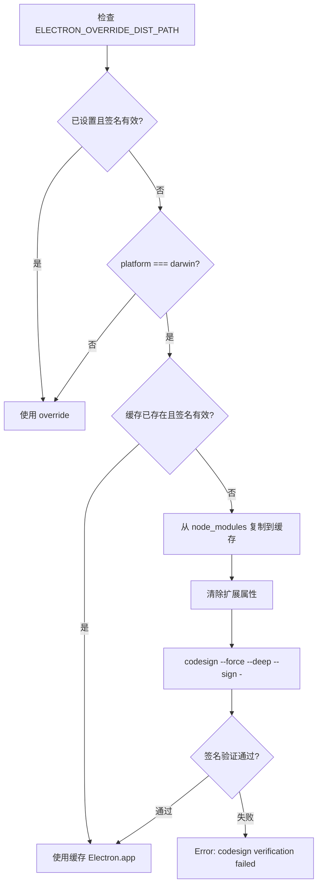
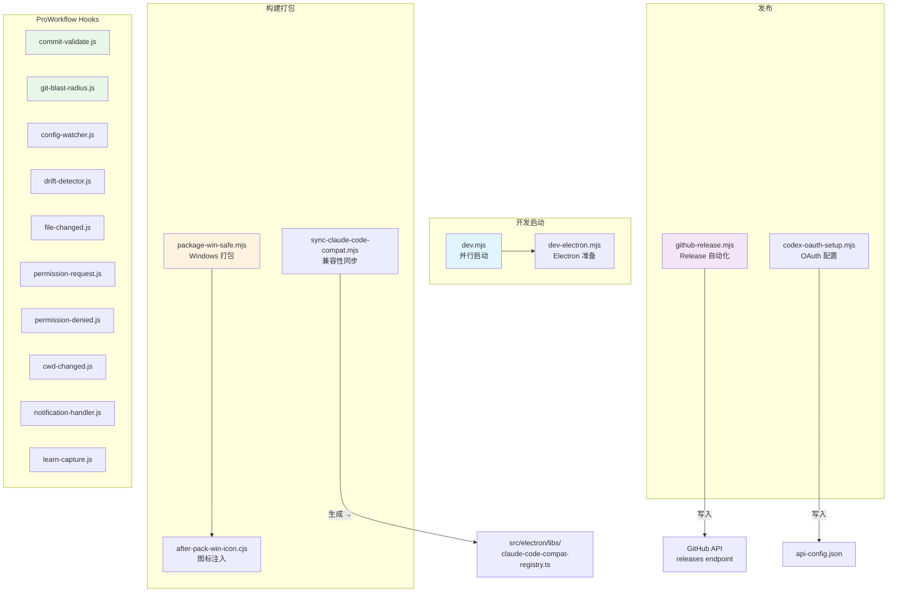

# 脚本与工具

<cite>
**本文引用的文件**
- [scripts/after-pack-win-icon.cjs](file://scripts/after-pack-win-icon.cjs)
- [scripts/codex-oauth-setup.mjs](file://scripts/codex-oauth-setup.mjs)
- [scripts/sync-claude-code-compat.mjs](file://scripts/sync-claude-code-compat.mjs)
- [scripts/dev-electron.mjs](file://scripts/dev-electron.mjs)
- [scripts/dev.mjs](file://scripts/dev.mjs)
- [scripts/github-release.mjs](file://scripts/github-release.mjs)
- [scripts/package-win-safe.mjs](file://scripts/package-win-safe.mjs)
- [pro-workflow/scripts/commit-validate.js](file://pro-workflow/scripts/commit-validate.js)
- [pro-workflow/scripts/config-watcher.js](file://pro-workflow/scripts/config-watcher.js)
- [pro-workflow/scripts/cwd-changed.js](file://pro-workflow/scripts/cwd-changed.js)
- [pro-workflow/scripts/drift-detector.js](file://pro-workflow/scripts/drift-detector.js)
- [pro-workflow/scripts/embed-wiki.js](file://pro-workflow/scripts/embed-wiki.js)
- [pro-workflow/scripts/file-changed.js](file://pro-workflow/scripts/file-changed.js)
- [pro-workflow/scripts/git-blast-radius.js](file://pro-workflow/scripts/git-blast-radius.js)
- [pro-workflow/scripts/learn-capture.js](file://pro-workflow/scripts/learn-capture.js)
- [pro-workflow/scripts/notification-handler.js](file://pro-workflow/scripts/notification-handler.js)
- [pro-workflow/scripts/permission-denied.js](file://pro-workflow/scripts/permission-denied.js)
- [pro-workflow/scripts/permission-request.js](file://pro-workflow/scripts/permission-request.js)
</cite>

---

## 目录

- [概述](#概述)
- [脚本组织结构](#脚本组织结构)
- [开发脚本](#开发脚本)
- [构建脚本](#构建脚本)
- [发布脚本](#发布脚本)
- [ProWorkflow 钩子脚本](#proworkflow-钩子脚本)
- [脚本依赖关系图](#脚本依赖关系图)
- [用法与参数速查](#用法与参数速查)
- [排障指南](#排障指南)
- [Agent 改代码地图](#agent-改代码地图)

---

## 概述

本项目包含两类脚本：

| 分类 | 位置 | 用途 |
|------|------|------|
| **项目构建/发布脚本** | `scripts/` | 开发启动、构建打包、版本发布 |
| **ProWorkflow 钩子脚本** | `pro-workflow/scripts/` | Claude Code 运行时质量门禁、学习捕获、权限管理 |

所有脚本均以 Node.js 编写，入口点通过 Shebang (`#!/usr/bin/env node`) 或 `npm run` 调用。

---

## 脚本组织结构

```
tech-cc-hub/
├── scripts/                           # 项目工程脚本
│   ├── dev.mjs                        # 并行启动 React + Electron
│   ├── dev-electron.mjs               # Electron 运行时准备（含 macOS 代码签名）
│   ├── package-win-safe.mjs            # Windows 打包（含回退策略）
│   ├── after-pack-win-icon.cjs        # electron-builder afterPack 钩子（win32 图标）
│   ├── github-release.mjs             # GitHub Release 自动化
│   ├── sync-claude-code-compat.mjs    # Claude Code 兼容性数据同步
│   └── codex-oauth-setup.mjs          # Codex OAuth 配置迁移
│
└── pro-workflow/scripts/              # ProWorkflow 质量门禁
    ├── commit-validate.js             # 提交信息格式验证
    ├── git-blast-radius.js            # 危险 Git 操作拦截
    ├── config-watcher.js              # 配置文件变更监控
    ├── cwd-changed.js                 # 工作目录切换感知
    ├── drift-detector.js              # 意图漂移检测
    ├── file-changed.js                # 重要文件变更响应
    ├── permission-request.js          # 危险操作权限提示
    ├── permission-denied.js           # 权限拒绝日志聚合
    ├── notification-handler.js       # 通知事件处理
    └── learn-capture.js               # [LEARN] 片段自动捕获
```

---

## 开发脚本

### `scripts/dev.mjs` — 并行开发启动器

**职责**：以父子进程方式并行启动 React 前端和 Electron 主进程，统一管理生命周期。

**关键符号**（来源行号）：
- `children@2` — `Map<string, ChildProcess>`，跟踪子进程
- `shuttingDown@4` — 优雅关闭标志
- `stopAll@5` — 关闭所有子进程
- `startTask@21` — 启动命名任务（React/Electron）

**状态流**：
```
启动 → startTask("react") + startTask("electron") → 子进程并行
     → 任一子进程退出（非0）→ stopAll → 进程退出
     → SIGINT/SIGTERM → stopAll → 进程退出
```

**调用方式**：
```bash
node scripts/dev.mjs
# 或通过 npm scripts: npm run dev
```

**入口映射**：实际通过 `npm run dev` 调用，定义在 `package.json` 的 `scripts.dev` 字段。

---

### `scripts/dev-electron.mjs` — Electron 运行时准备脚本

**职责**：为 macOS 准备已签名的 Electron.app 缓存，并注入 `ELECTRON_OVERRIDE_DIST_PATH` 环境变量。

**关键符号**：
- `prepareMacElectronDist@72` — 主入口，准备 Electron.app
- `verifyCodesign@34` — 验证代码签名（`codesign --verify --deep --strict`）
- `electronVersionLabel@47` — 读取 `package.json` 中 `electron` 版本
- `cleanMacExtendedAttributes@55` — 清除 macOS 扩展属性（`xattr -cr` 等）

**缓存路径**（macOS）：
```
~/Library/Caches/tech-cc-hub/electron-{version}-dist/Electron.app
```

**工作流程**：


**失败模式**：
- `Electron.app not found at {path}` — 未执行 `npm install`
- `Prepared Electron.app did not pass codesign verification` — 签名失败

---

## 构建脚本

### `scripts/package-win-safe.mjs` — Windows 安全打包脚本

**职责**：在 Windows 平台执行 `electron-builder`，提供三档回退策略确保最终产出可用产物。

**关键符号**：
- `cleanOldArtifacts@33` — 清理旧的 `win-unpacked`、`.icon-ico` 和 `tech-cc-hub*.exe/.zip`
- `runWithFallback@120` — 单次构建执行
- `createStableOutputs@85` — 生成带日期戳的稳定输出文件
- `findExeArtifact@64` — 查找 `dist/` 下匹配的 `.exe`
- `makeZipFromDir@80` — 使用 `tar -a` 打包目录

**构建策略（按优先级）**：
| 策略 | 命令 | 说明 |
|------|------|------|
| Primary | `electron-builder --win --x64` + `--forceCodeSigning=false` + `--signAndEditExecutable=false` | 常规打包 |
| Fallback-dir | `electron-builder --win --x64 --dir` | 目录模式 |
| Fallback-no-sign | `electron-builder --win --x64 --dir` + `--asar=true` | 取消签名尝试 |

**稳定输出文件名模式**：
```
tech-cc-hub-win-x64-{YYYYMMDD}.exe
tech-cc-hub-win-unpacked-{YYYYMMDD}.zip
tech-cc-hub-win-x64-{YYYYMMDD}.zip
```

**环境变量注入**：
- `CSC_IDENTITY_AUTO_DISCOVERY: "false"` — 禁用自动签名发现
- `SIGNTOOL_PATH: ""`
- `WCT_CSC_KEY_PASSWORD: ""`

**排障检查点**：
```bash
# 检查构建是否产生产物
ls dist/*.exe
ls dist/win-unpacked/

# 检查稳定输出
ls dist/tech-cc-hub-win-*.exe
```

---

### `scripts/after-pack-win-icon.cjs` — Windows 图标注入钩子

**职责**：在 `electron-builder` 打包完成后，将 `build/icon.ico` 注入到生成的 `.exe` 中。

**关键符号**：
- `projectDir@9` — `context.packager.projectDir`
- `productFilename@11` — `context.packager.appInfo.productFilename`
- `exePath@20` — 查找目标 EXE（三候选：`{productFilename}.exe`、`tech-cc-hub.exe`、`electron.exe`）
- `rceditPath@14` — `node_modules/electron-winstaller/vendor/rcedit.exe`

**前置条件检查**：
1. 平台必须为 `win32`
2. 目标 `.exe` 存在
3. `build/icon.ico` 存在
4. `rcedit.exe` 存在

**调用链**：此脚本作为 `electron-builder` 的 `afterPack` 钩子注册，在 `package.json` 的 `build.afterPack` 字段引用。

---

### `scripts/sync-claude-code-compat.mjs` — Claude Code 兼容性数据同步

**职责**：从 [claudelog.com](https://claudelog.com/claude-code-changelog/) 抓取变更日志，生成 `src/electron/libs/claude-code-compat-registry.ts`。

**关键符号**：
- `extractSections@71` — HTML 解析，提取各版本变更项
- `extractCommandItems@107` — 从变更项提取 `/slash-command`
- `buildPromptHints@132` — 生成功能映射提示词
- `renderRegistry@163` — 生成 TypeScript 模块

**输出文件**：`src/electron/libs/claude-code-compat-registry.ts`

**导出符号**：
```typescript
export const CLAUDE_CODE_COMPAT_REGISTRY: ClaudeCodeCompatRegistry
export const CLAUDE_CODE_COMPAT_COMMAND_ITEMS: SlashCommandItem[]
export function buildClaudeCodeCompatPromptAppend(): string
```

**用法**：
```bash
node scripts/sync-claude-code-compat.mjs [--version=v2.1.50]
```

---

## 发布脚本

### `scripts/github-release.mjs` — GitHub Release 自动化

**职责**：版本 bump → Git commit → Git tag → GitHub API 创建/更新 Release。

**关键符号**：
- `bumpVersion@142` — 计算下一个 semver
- `createReleaseBody@318` — 渲染发布说明模板
- `upsertGithubRelease@348` — 通过 GitHub API 创建/更新 Release
- `getGithubToken@234` — 优先读取 `GITHUB_TOKEN`/`GH_TOKEN`/`GITHUB_API_TOKEN`，回退到 `git credential fill`
- `githubApiRequest@254` — 封装 GitHub REST API 调用

**参数**：
| 参数 | 说明 |
|------|------|
| `patch`/`minor`/`major` | semver bump 模式（默认 patch） |
| `vX.Y.Z` | 直接指定版本 |
| `--dry-run` | 仅打印，不执行 |
| `--no-push` | 创建 commit/tag 但不推送 |
| `--allow-dirty` | 允许未提交的变更 |
| `--no-release` | 跳过 GitHub API 调用 |
| `--release-title-template` | 自定义标题模板 |
| `--release-note-template=<path>` | 自定义 Release 说明模板 |

**版本文件提交**：
```
filesToCommit = ["package.json"]
if (existsSync("package-lock.json")) filesToCommit.push("package-lock.json")
```

**排障检查点**：
```bash
# 检查是否需要 GitHub Token
echo $GITHUB_TOKEN

# 检查 origin 远程仓库
git remote get-url origin

# 验证 Git 工作树干净
git status --porcelain
```

---

### `scripts/codex-oauth-setup.mjs` — Codex OAuth 配置迁移

**职责**：从官方 `codex login` 导出的 `~/.codex/auth.json` 读取凭证，转换为 tech-cc-hub 的 `api-config.json` profile。

**关键符号**：
- `loadCodexCredential@140` — 读取 `~/.codex/auth.json`
- `codexAuthToCredential@153` — 凭证格式转换（支持多种字段命名变体）
- `buildCodexProfile@82` — 构建 tech-cc-hub profile 结构
- `saveCodexProfile@117` — 写入 `api-config.json`

**凭证字段兼容**（多命名变体）：
| Codex 字段 | tech-cc-hub 字段 |
|-----------|-----------------|
| `access_token` / `accessToken` | `access_token` |
| `id_token` / `idToken` | `id_token` |
| `refresh_token` / `refreshToken` | `refresh_token` |
| `account_id` / `accountId` | `account_id` |

**JWT 过期时间处理**：
- `normalizeExpiry@204` — 处理秒/毫秒时间戳
- `jwtExpiresAt@215` — 从 JWT payload 提取 `exp`
- `decodeJwtPayload@222` — Base64 解码 JWT payload

**平台配置路径**：
| 平台 | 路径 |
|------|------|
| Windows | `%APPDATA%/tech-cc-hub/api-config.json` |
| macOS | `~/Library/Application Support/tech-cc-hub/api-config.json` |
| Linux | `$XDG_CONFIG_HOME/tech-cc-hub/api-config.json` |

**用法**：
```bash
node scripts/codex-oauth-setup.mjs [--configPath=<path>] [--codexAuthPath=<path>] [--profileName=<name>] [--noLogin]
```

---

## ProWorkflow 钩子脚本

这些脚本作为 Claude Code 的 hooks（`hooks.json` 配置）运行，接收 JSON 格式的 stdin 输入，原样透传 stdout，同时执行质量门禁逻辑。

### 质量门禁类

#### `commit-validate.js` — 提交信息验证

**职责**：验证 `git commit -m "..."` 的消息格式是否符合 Conventional Commits。

**关键符号**：
- `PATTERN@3` — `/^(feat|fix|refactor|...): .+/`
- `MAX_SUMMARY@4` — 72 字符
- `extractMessage@14` — 从命令中解析 `-m` 参数值，支持 `--message=`、`heredoc`、`-F` 文件模式
- `validate@46` — 格式和长度校验

**验证规则**：
```
<type>(<scope>): <summary>
# type: feat, fix, refactor, test, docs, chore, perf, ci, style, build, revert
# summary 长度 <= 72
```

**退出码**：`0` 通过，`2` 验证失败。

---

#### `git-blast-radius.js` — 危险 Git 操作拦截

**职责**：拦截可能破坏历史的 Git 操作。

**关键符号**：
- `BLOCK@8-23` — 危险操作列表（含正则匹配）
- `WARN_NOT_BLOCK@25-27` — 警告但不拦截（如 `--force-with-lease`）
- `redact@37` — 隐藏 URL 中的凭证信息

**拦截的操作**：
| 操作 | 正则模式 |
|------|----------|
| force push | `push ... -f/--force`（不含 `--force-with-lease`） |
| refspec force push | `push <remote> +<branch>` |
| remote branch delete | `push ... :<branch>` 或 `--delete` |
| hard reset | `reset ... --hard` |
| working-tree clean | `clean ... -[rf]` |
| branch deletion -D | `branch ... -D` |
| checkout discard | `checkout .` |
| restore discard | `restore ... .` |
| interactive rebase on protected | `rebase -i ... main/master/trunk/release/` |

**覆盖方式**：`export PRO_WORKFLOW_ALLOW_UNSAFE_GIT=1`

---

#### `config-watcher.js` — 配置文件变更监控

**职责**：检测 `.claude/settings.json`、`hooks.json` 等敏感配置文件变更。

**关键符号**：
- `sensitiveFiles@43` — `settings.json`, `settings.local.json`, `hooks.json`, `.claudeignore`
- `isSensitive@49` — 判断是否敏感

**日志文件**：`$TMPDIR/pro-workflow/config-changes.log`（超过 100KB 截断）

---

#### `drift-detector.js` — 意图漂移检测

**职责**：跟踪用户的编辑意图，检测工作是否偏离原始目标。

**关键符号**：
- `intentFile@35` — `{tempDir}/intent-{sessionId}`
- `editsSinceLastTouch@52` — 编辑计数
- `relevance@60` — 关键词重叠率
- `isNewIntent@112` — 新意图检测（模式：`^(now|next|also|okay|ok)\s+...` 或 `^(switch|move|pivot|change)\s+...` 等）

**触发阈值**：编辑 ≥6 次 且 关键词重叠率 < 20% 时输出警告。

---

#### `file-changed.js` — 重要文件变更响应

**职责**：检测关键配置文件变更，输出后续操作提示。

**关键模式**（`importantPatterns@10-22`）：

| 模式 | 提示命令 |
|------|----------|
| `package.json` | `npm install` |
| `tsconfig*.json` | `tsc --noEmit` |
| `.env` | CAUTION: verify no secrets |
| `Dockerfile`/`docker-compose` | `docker compose up --build` |
| `.github/workflows/` | CI pipeline verify |
| `CLAUDE.md` | context instructions updated |
| `Cargo.toml` | `cargo check` |
| `pyproject.toml` | `pip install -e .` |
| `go.mod` | `go mod tidy` |
| `Makefile` | verify build targets |

**Wiki 种子触发**（`wikiMatch@28-29`）：
- 匹配 `.claude/wikis/<slug>/wiki/*.md` 或 `.pro-workflow/wikis/<slug>/wiki/*.md`
- 调用 `store.enqueueSeed()` 入队验证种子

---

#### `permission-request.js` — 危险操作权限提示

**职责**：在执行危险命令前输出警告。

**关键符号**：
- `dangerous@10-24` — 危险模式列表

**检测的危险模式**：
```javascript
/\brm\s+(-[rRf]+\s+)*-?[rRf]/           // rm -rf
/\bdocker\s+(rm|rmi|system\s+prune|...)/ // docker rm/prune
/\bnpm\s+publish\b/                       // npm publish
/\bgit\s+push\s+.*--force/                // git push --force
/\bcurl\s+.*\|\s*(ba)?sh/                // pipe to shell
/\bwget\s+.*\|\s*(ba)?sh/                // pipe to shell
/\bdd\s+if=/                             // dd if=
/\bmkfs\b/                               // mkfs
/>\s*\/dev\//                            // redirect to /dev/
```

---

#### `permission-denied.js` — 权限拒绝日志聚合

**职责**：记录权限拒绝事件，聚合高频拒绝工具。

**关键符号**：
- `denialsFile@15` — `{tempDir}/permission-denials.json`
- `toolCounts@32` — 按工具聚合计数
- `topDenied@34` — 前 3 个高频拒绝

**日志容量**：保留最近 500 条。

**输出频率**：每 10 次拒绝输出一组摘要。

---

#### `cwd-changed.js` — 工作目录切换感知

**职责**：检测目录切换，识别项目类型，写入 `PRO_WORKFLOW_PROJECT_TYPE` 环境变量。

**检测项目类型**：
```javascript
hasPackageJson   → 'node'
Cargo.toml       → 'rust'
go.mod           → 'go'
pyproject.toml   → 'python'
```

**CLAUDE.md 缺失警告**：当 `hasClaude` 为 false 时提示 `/auto-setup`。

---

#### `notification-handler.js` — 通知事件处理

**职责**：透传通知事件，记录日志。

**输入字段**：`input.type`、`input.tool`

---

#### `learn-capture.js` — [LEARN] 片段自动捕获

**职责**：从 Claude 响应中提取 `[LEARN]` 标记的片段，写入 SQLite 数据库。

**关键符号**：
- `regex@27` — 解析模式：`/[LEARN]\s*([\w][\w\s-]*?)\s*:\s*(.+?)(?:\nMistake:\s*(.+?))?(?:\nCorrection:\s*(.+?))?(?:\nWiki:\s*([A-Za-z0-9_-]+))?/gim`
- `store.addLearning@44` — 写入数据库

**捕获字段**：
| 正则分组 | 字段 |
|---------|------|
| `[1]` | `category` |
| `[2]` | `rule` |
| `[3]` | `mistake` |
| `[4]` | `correction` |
| `[5]` | `wikiSlug` |

---

## 脚本依赖关系图



---

## 用法与参数速查

### 项目构建/发布

```bash
# 开发启动
node scripts/dev.mjs

# Electron 单独开发
node scripts/dev-electron.mjs .

# Windows 打包
node scripts/package-win-safe.mjs

# GitHub Release
node scripts/github-release.mjs patch
node scripts/github-release.mjs minor --dry-run
node scripts/github-release.mjs v1.2.3 --no-push

# Claude Code 兼容性同步
node scripts/sync-claude-code-compat.mjs
node scripts/sync-claude-code-compat.mjs --version=2.1.50

# Codex OAuth 设置
node scripts/codex-oauth-setup.mjs
node scripts/codex-oauth-setup.mjs --profileName="My Codex"
```

### ProWorkflow 钩子（通过 hooks.json 配置）

```json
{
  "hooks": {
    "BeforeMilestone": "node pro-workflow/scripts/commit-validate.js",
    "BeforeTool": "node pro-workflow/scripts/permission-request.js",
    "AfterTool": "node pro-workflow/scripts/permission-denied.js",
    "AfterThinking": "node pro-workflow/scripts/drift-detector.js",
    "ConfigChange": "node pro-workflow/scripts/config-watcher.js",
    "Notification": "node pro-workflow/scripts/notification-handler.js",
    "PostToolUse": "node pro-workflow/scripts/learn-capture.js"
  }
}
```

---

## 排障指南

### Windows 打包失败

1. 检查 `dist/` 目录是否残留旧产物
2. 确认 `node_modules/electron` 已安装
3. 手动执行 electron-builder 检查详细错误：
   ```bash
   npx electron-builder --win --x64 --debug
   ```

### macOS Electron 代码签名失败

1. 确认钥匙串访问权限
2. 检查 `codesign` 命令输出
3. 验证缓存签名状态：
   ```bash
   codesign --verify --deep --strict ~/Library/Caches/tech-cc-hub/electron-*/Electron.app
   ```

### GitHub Release Token 缺失

```bash
# 检查环境变量
echo $GITHUB_TOKEN

# 测试 git credential
git credential fill
# 输入：protocol=https\nhost=github.com\n\n
```

### ProWorkflow 钩子不执行

1. 检查 `hooks.json` 配置路径是否正确
2. 确认 Node.js 可执行文件路径
3. 检查脚本是否有执行权限：
   ```bash
   ls -la pro-workflow/scripts/*.js
   chmod +x pro-workflow/scripts/*.js
   ```

### drift-detector 误报

- 阈值可通过修改 `drift-detector.js` 第 62 行的 `editsSinceLastTouch >= 6` 和 `relevance < 0.2` 调整

---

## Agent 改代码地图

### 先读文件

| 优先级 | 文件 | 原因 |
|--------|------|------|
| 1 | `scripts/dev.mjs` | 理解并行启动逻辑 |
| 2 | `scripts/package-win-safe.mjs` | 理解打包策略 |
| 3 | `scripts/github-release.mjs` | 理解发布流程 |
| 4 | `pro-workflow/scripts/commit-validate.js` | 理解提交验证规则 |
| 5 | `pro-workflow/scripts/git-blast-radius.js` | 理解危险操作拦截规则 |

### 关键符号速查

**开发脚本**：
- `dev.mjs`: `stopAll@5`, `startTask@21`, `shuttingDown@4`
- `dev-electron.mjs`: `prepareMacElectronDist@72`, `verifyCodesign@34`, `electronVersionLabel@47`

**构建脚本**：
- `package-win-safe.mjs`: `runWithFallback@120`, `createStableOutputs@85`, `findExeArtifact@64`
- `after-pack-win-icon.cjs`: `rceditPath@14`, `exePath@20`
- `sync-claude-code-compat.mjs`: `CLAUDE_CODE_COMPAT_REGISTRY`, `buildPromptHints@132`

**发布脚本**：
- `github-release.mjs`: `bumpVersion@142`, `upsertGithubRelease@348`, `githubApiRequest@254`
- `codex-oauth-setup.mjs`: `loadCodexCredential@140`, `buildCodexProfile@82`

**ProWorkflow 钩子**：
- `commit-validate.js`: `PATTERN@3`, `validate@46`, `MAX_SUMMARY@4`
- `git-blast-radius.js`: `BLOCK@8`, `WARN_NOT_BLOCK@25`
- `drift-detector.js`: `extractIntent@85`, `isNewIntent@112`
- `learn-capture.js`: `store.addLearning@44`

### 修改入口

| 脚本 | 入口函数 | 调用方式 |
|------|---------|----------|
| `dev.mjs` | 模块级执行（无 `main` 导出） | `node scripts/dev.mjs` |
| `dev-electron.mjs` | 模块级执行 | `node scripts/dev-electron.mjs` |
| `package-win-safe.mjs` | `main@138` | `node scripts/package-win-safe.mjs` |
| `github-release.mjs` | `main@387` | `node scripts/github-release.mjs` |
| `codex-oauth-setup.mjs` | `main@267` | `node scripts/codex-oauth-setup.mjs` |
| ProWorkflow 钩子 | stdin 处理逻辑 | 通过 Claude Code hooks 调用 |

### 验证命令

```bash
# 验证 commit-validate
echo '{"tool_input":{"command":"git commit -m \"feat(ui): add button\""}}' | node pro-workflow/scripts/commit-validate.js
echo $?  # 应输出 0

# 验证 git-blast-radius
echo '{"tool_input":{"command":"git push --force origin main"}}' | node pro-workflow/scripts/git-blast-radius.js
echo $?  # 应输出 2

# 验证 drift-detector
echo '{"prompt":"Please add a new feature","session_id":"test-123"}' | node pro-workflow/scripts/drift-detector.js

# 验证 Windows 打包脚本（dry-run 模式）
node scripts/package-win-safe.mjs --help || echo "使用 npm run build"
```

### 常见回归风险

| 风险 | 原因 | 防护 |
|------|------|------|
| macOS Electron 无法启动 | `ELECTRON_OVERRIDE_DIST_PATH` 缓存路径错误 | 检查 `~/Library/Caches/tech-cc-hub/` |
| Windows 图标未注入 | `rcedit.exe` 路径错误 | 确认 `electron-winstaller` 已安装 |
| Release 说明为空 | `git log` 格式不匹配 | 确认 `getCommitsSinceTag@302` 返回非空 |
| ProWorkflow 钩子阻塞 | 脚本执行超时或错误 | 添加 `console.log(data)` 保证透传 |
| Codex 凭证导入失败 | `auth.json` 格式不兼容 | 检查 `codexAuthToCredential@153` 支持的字段 |

---

## 扩展点

### 添加新 ProWorkflow 钩子

1. 在 `pro-workflow/scripts/` 创建新脚本
2. 读取 stdin JSON，处理逻辑
3. **必须**在最后 `console.log(data)` 透传输入
4. 在项目 `hooks.json` 中注册钩子类型和路径

### 添加新打包策略

在 `package-win-safe.mjs` 的 `strategies` 数组中添加新策略元组：

```javascript
const strategies = [
    // ... 现有策略
    ["NewStrategy", ["npx", "electron-builder", "--win", "--x64", "--新参数"]],
];
```

### 添加新危险 Git 操作

在 `git-blast-radius.js` 的 `BLOCK` 数组中添加正则匹配：

```javascript
const BLOCK = [
    // ... 现有
    { name: 'new dangerous op', re: sub(/new-op\s+.../) },
];
```

---

*章节来源：`file://scripts/dev.mjs#L1-L66`、`file://scripts/dev-electron.mjs#L1-L149`、`file://scripts/package-win-safe.mjs#L1-L186`、`file://scripts/github-release.mjs#L1-L444`、`file://pro-workflow/scripts/commit-validate.js#L1-L80`、`file://pro-workflow/scripts/git-blast-radius.js#L1-L65`*