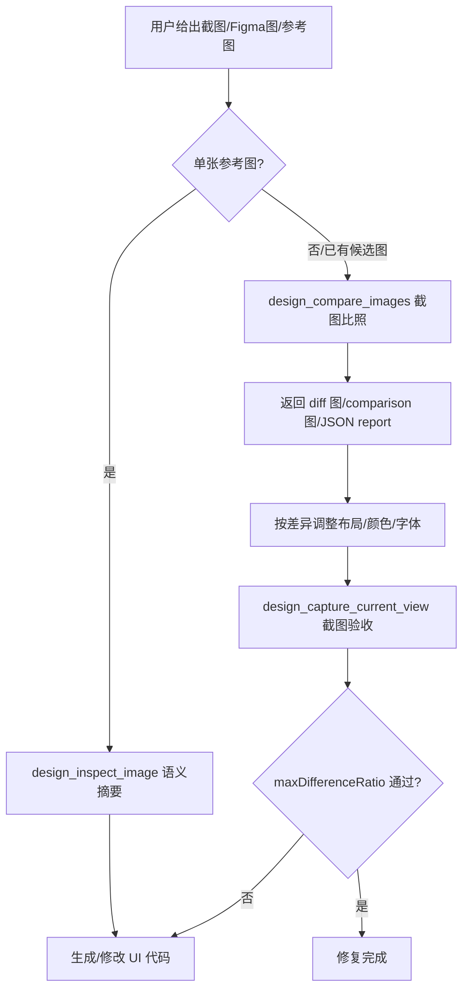
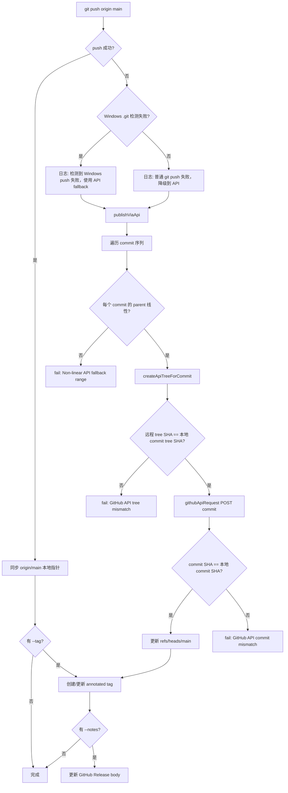
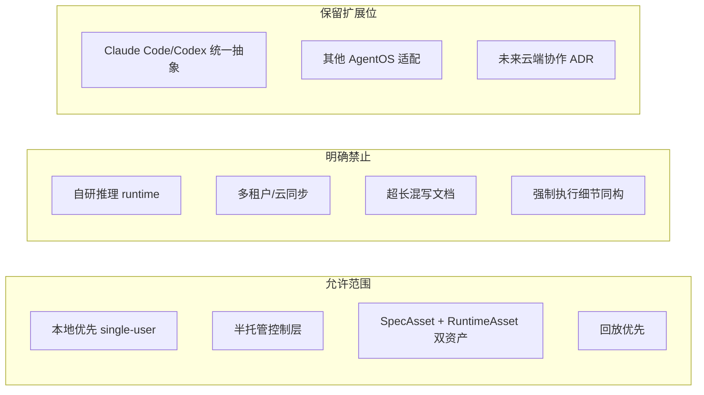

# 设计原则与非目标

---
doc_id: "01"
title: "01-设计原则与非目标"
doc_type: "overview"
layer: "L0"
status: "active"
version: "1.0.0"
last_updated: "2026-04-19"
owners:
  - "CLAW Core"
tags:
  - "claw"
  - "docs"
  - "1.0.0"
  - "L0"
  - "overview"
---

# 01-设计原则与非目标

<cite>
**本文引用的文件**
- [skills/tech-cc-hub-release-deploy/scripts/publish-release.mjs](file://skills/tech-cc-hub-release-deploy/scripts/publish-release.mjs#L1-L389)
- [scripts/github-release.mjs](file://scripts/github-release.mjs#L1-L444)
- [src/electron/libs/system-prompt-presets.ts](file://src/electron/libs/system-prompt-presets.ts#L1-L176)
- [doc/00-overview/01-设计原则与非目标.md](file://doc/00-overview/01-设计原则与非目标.md#L1-L69)
- [skills/tech-cc-hub-release-deploy/SKILL.md](file://skills/tech-cc-hub-release-deploy/SKILL.md#L1-L101)
- [skills/tech-cc-hub-release-deploy/agents/openai.yaml](file://skills/tech-cc-hub-release-deploy/agents/openai.yaml#L1-L4)
- [pro-workflow/skills/wiki-research-loop/scripts/research-loop.js](file://pro-workflow/skills/wiki-research-loop/scripts/research-loop.js#L1-L368)
- [src/electron/libs/git/README.md](file://src/electron/libs/git/README.md#L1-L35)
- [src/electron/libs/mcp-tools/README.md](file://src/electron/libs/mcp-tools/README.md#L1-L23)
</cite>

---

## 目录

1. [Purpose 与 Scope](#1-purpose-与-scope)
2. [核心设计原则](#2-核心设计原则)
3. [非目标（明确不做什么）](#3-非目标明确不做什么)
4. [System Prompt 扩展策略](#4-system-prompt-扩展策略)
5. [Git 模块边界](#5-git-模块边界)
6. [MCP 工具设计原则](#6-mcp-工具设计原则)
7. [GitHub 发布脚本的降级策略](#7-github-发布脚本的降级策略)
8. [可观测性要求](#8-可观测性要求)
9. [扩展点与开放问题](#9-扩展点与开放问题)

---

## 1. Purpose 与 Scope

**Purpose**：固定 tech-cc-hub 的架构红线，避免后续规范在「做平台」还是「做壳子」之间反复摇摆。

**Scope**：定义必须长期坚持的设计原则与明确不做的事情。所有后续规范必须满足本文定义的约束。

**Actors / Owners**：
- Owner：Architecture
- Readers：所有参与写 spec 或实现 tech-cc-hub 的成员

**章节来源**：[doc/00-overview/01-设计原则与非目标.md#L22-L29](file://doc/00-overview/01-设计原则与非目标.md#L22-L29)

---

## 2. 核心设计原则

### 2.1 上层软件层原则

tech-cc-hub 不接管 LLM 推理或底层工具系统，只增强控制面和观测面。它是 AgentOS 的半托管控制层，不是自研底层执行内核。

### 2.2 本地优先原则

v1 采用 `local-first / single-user / desktop-first` 策略。本机文件系统是 v1 的事实真相，不在第一版引入多租户、团队权限和云真源。

[doc/00-overview/01-设计原则与非目标.md#L46-L47](file://doc/00-overview/01-设计原则与非目标.md#L46-L47)

### 2.3 双资产中心原则

`SpecAsset` 和 `RuntimeAsset` 并列为一等资产，必须分层管理、单独建模。

### 2.4 统一优先原则

优先抽象 Claude Code 和 Codex 的通用能力，再保留扩展位。同一概念只能有一个主规范 owner，避免多处重复定义。

### 2.5 回放优先原则

先保证事件到回放闭环，再做高阶分析。递归任务图能力允许持续细拆，但必须经过策略层约束，而不是无边界失控。

[doc/00-overview/01-设计原则与非目标.md#L36-L50](file://doc/00-overview/01-设计原则与非目标.md#L36-L50)

---

## 3. 非目标（明确不做什么）

tech-cc-hub **不会**做以下事情：

| 非目标 | 说明 | 来源 |
|--------|------|------|
| 不实现新的通用推理 runtime | CLAW 是上层控制层，不造轮子 | [doc/00-overview/01-设计原则与非目标.md#L59](file://doc/00-overview/01-设计原则与非目标.md#L59) |
| 不引入多租户/团队权限/云真源 | v1 定位 local-first desktop | [doc/00-overview/01-设计原则与非目标.md#L60](file://doc/00-overview/01-设计原则与非目标.md#L60) |
| 不用超长文档混写产品/架构/协议/实现 | 每份规范有明确的 layer 和 owner | [doc/00-overview/01-设计原则与非目标.md#L61](file://doc/00-overview/01-设计原则与非目标.md#L61) |
| 不强迫所有 AgentOS 执行细节同构 | 保留扩展位，支持差异化 | [doc/00-overview/01-设计原则与非目标.md#L62](file://doc/00-overview/01-设计原则与非目标.md#L62) |

---

## 4. System Prompt 扩展策略

tech-cc-hub 通过 `system-prompt-presets.ts` 向 Agent 注入运行时规则。所有预设按领域分组，由 `buildTechCCHubSystemPromptSources()` 统一汇总。

### 4.1 预设注册表

| 预设 ID | 标签 | 触发条件 |
|---------|------|----------|
| `tech-cc-hub-browser-preset` | 内置浏览器预设 | BrowserView 工作台操作 |
| `tech-cc-hub-admin-preset` | 配置治理预设 | 写入 `agent-runtime.json` |
| `tech-cc-hub-tool-policy-preset` | 工具调用预设 | 所有 Agent 轮次 |
| `tech-cc-hub-design-preset` | 设计还原预设 | 用户给出截图/Figma 参考 |
| `tech-cc-hub-builtin-mcp-registry-preset` | built-in MCP registry | MCP 工具调用 |
| `tech-cc-hub-claude-code-2139-preset` | Claude Code 兼容性 | Claude Code 2.1.139 环境 |

[src/electron/libs/system-prompt-presets.ts#L136-L175](file://src/electron/libs/system-prompt-presets.ts#L136-L175)

### 4.2 工具调用优化规则

`buildToolCallOptimizationPromptAppend()` 定义了工具调用 budget 策略：

```typescript
// 核心规则（简化表达）
1. 只在答案依赖外部状态时调用工具
2. 批量独立读操作合并到一次 parallel turn
3. 单文件/紧依赖链直接父轮处理，不拆 Task
4. 文件读尽量 ≤ 200 行
5. 写/删/移/装/提交等副作用单独调用
6. 有边界非交互 shell；Windows 避开不稳定 PowerShell
7. 定时任务用 tech-cc-hub cron MCP，不用 SDK Cron*
```

[src/electron/libs/system-prompt-presets.ts#L28-L42](file://src/electron/libs/system-prompt-presets.ts#L28-L42)

### 4.3 飞书文档直读规则

当用户输入包含飞书链接时，根据运行时环境决定是否使用 lark-cli：

```typescript
// 触发条件
- URL 匹配: https://*.feishu.cn/(wiki|docx|docs)/*
- 运行时需要: LARK_CLI_COMMAND + LARK_CLI_PROFILE 均有值

// 命令格式
$ lark-cli --profile $LARK_CLI_PROFILE docs +fetch --doc "<url>" --format pretty

// 读取后直接基于文档内容回答，不再探路
```

[src/electron/libs/system-prompt-presets.ts#L44-L79](file://src/electron/libs/system-prompt-presets.ts#L44-L79)

### 4.4 设计还原规则

`buildDesignParityPromptAppend()` 定义的 UI 修复流程：



**关键参数**：
- `ignoreRegions`: 忽略动态区域（时间戳/头像/动画）
- `maxDifferenceRatio`: 验收阈值，超出则判定失败
- `ignoreAntialiasing`: 文字抗锯齿噪声多时启用
- `diffColorMode: directional`: 区分变亮/变暗

[src/electron/libs/system-prompt-presets.ts#L125-L134](file://src/electron/libs/system-prompt-presets.ts#L125-L134)

---

## 5. Git 模块边界

Git 模块运行在 Electron 主进程，Renderer 通过 IPC 调用。边界划分：

| 文件 | 职责 |
|------|------|
| `types.ts` | Git 领域类型和 IPC payload/result |
| `errors.ts` | Git 错误归一化 |
| `service.ts` | 唯一 Git 操作入口 |
| `history.ts` | commit history parser |
| `graph.ts` | lightweight graph lane 生成 |
| `operation-log.ts` | 本地高影响操作日志 |
| `ipc.ts` | Electron IPC handler 注册 |
| `index.ts` | 对外统一出口 |

[src/electron/libs/git/README.md#L7-L14](file://src/electron/libs/git/README.md#L7-L14)

### 5.1 v1 允许操作

```
status / diff / stage / unstage / commit / ordinary push /
create branch / checkout branch / stash save/apply/drop /
recent history / lightweight graph
```

### 5.2 v1 禁止操作

```
reset / rebase / cherry-pick / force push / amend /
squash / interactive rebase
```

[src/electron/libs/git/README.md#L16-L34](file://src/electron/libs/git/README.md#L16-L34)

---

## 6. MCP 工具设计原则

`src/electron/libs/mcp-tools/` 目录集中存放暴露给 Agent 的内置 MCP 工具。

### 6.1 工具分类

| 工具 | 能力 |
|------|------|
| `browser.ts` | BrowserView 工作台：导航、截图摘要、DOM 查询、样式检查、标注模式 |
| `design.ts` | 截图语义分析、比照、diff、热点区域、JSON report、历史产物回看 |
| `figma-rest.ts` | Figma PAT 只读：文件/节点读取、设计树、token、Dev Resources |
| `admin.ts` | 受控管理：写入 `agent-runtime.json` 的 `env`、`skillCredentials` 等 |

[src/electron/libs/mcp-tools/README.md#L1-L9](file://src/electron/libs/mcp-tools/README.md#L1-L9)

### 6.2 工具设计约束

```markdown
1. 每个工具应有明确的 host 边界，不直接操作 React UI
2. 返回给模型的内容：摘要、路径、结构化 JSON
   - 避免塞入大图或密钥明文
3. 涉及写入磁盘或配置的工具必须有字段 allowlist 和体积上限
```

[src/electron/libs/mcp-tools/README.md#L10-L15](file://src/electron/libs/mcp-tools/README.md#L10-L15)

### 6.3 设计工具默认触发条件

```
- 用户给出截图、Figma 图、页面参考图，要求生成/修改 UI/前端代码
- 用户反馈页面和参考图不一致，需要按截图修 UI
- 单张用户截图先走 design_inspect_image
- 已有页面候选图后再走截图比照（不要把同一张图自己和自己比较）
```

[src/electron/libs/mcp-tools/README.md#L16-L22](file://src/electron/libs/mcp-tools/README.md#L16-L22)

---

## 7. GitHub 发布脚本的降级策略

### 7.1 发布脚本入口

| 脚本 | 用途 |
|------|------|
| `scripts/publish-release.mjs` | 提交、推送、打 tag、API fallback |
| `scripts/github-release.mjs` | 版本号 bump、tag 创建、Release body 生成 |

[skills/tech-cc-hub-release-deploy/SKILL.md#L22-L23](file://skills/tech-cc-hub-release-deploy/SKILL.md#L22-L23)

### 7.2 降级决策流程



[skills/tech-cc-hub-release-deploy/scripts/publish-release.mjs#L364-L386](file://skills/tech-cc-hub-release-deploy/scripts/publish-release.mjs#L364-L386)

### 7.3 API Fallback 约束

| 约束 | 说明 | 来源 |
|------|------|------|
| 线性提交范围 | 远端 main 必须是本地 HEAD 的祖先 | [publish-release.mjs#L267-L269](file://skills/tech-cc-hub-release-deploy/scripts/publish-release.mjs#L267-L269) |
| 父子关系校验 | 每个 commit 必须只有一个 parent，且等于预期的 localParent | [publish-release.mjs#L278-L283](file://skills/tech-cc-hub-release-deploy/scripts/publish-release.mjs#L278-L283) |
| SHA 一致性 | 远端 commit SHA 必须等于本地 commit SHA | [publish-release.mjs#L296-L298](file://skills/tech-cc-hub-release-deploy/scripts/publish-release.mjs#L296-L298) |
| 默认分支 | 只支持 `main`，不支持其他分支 | [publish-release.mjs#L10](file://skills/tech-cc-hub-release-deploy/scripts/publish-release.mjs#L10) |

### 7.4 常用命令

```powershell
# 推当前 HEAD 并移动 release tag
node skills/tech-cc-hub-release-deploy/scripts/publish-release.mjs --tag v0.1.13 --retag --delete-release

# 只更新发布说明
node skills/tech-cc-hub-release-deploy/scripts/publish-release.mjs --tag v0.1.13 --notes .tmp/release-notes-v0.1.13.md --notes-only

# Windows 已知 .git 检测失败时
node skills/tech-cc-hub-release-deploy/scripts/publish-release.mjs --api-only

# 版本 bump 并创建 Release
node scripts/github-release.mjs minor
```

[skills/tech-cc-hub-release-deploy/SKILL.md#L31-L49](file://skills/tech-cc-hub-release-deploy/SKILL.md#L31-L49)

### 7.5 失败模式与排障

| 错误信息 | 原因 | 处置 |
|----------|------|------|
| `origin/main is not an ancestor of HEAD` | 本地 HEAD 不是远端 main 的后代 | 先 fetch/rebase |
| `Non-linear API fallback range` | commit 有多个 parent 或不连续 | 检查 git history |
| `GitHub API tree mismatch` | 远程 tree SHA 与本地不符 | 检查脚本输出，确认无 tree 漂移 |
| `Tag exists` | tag 已存在且未传 `--retag` | 传 `--retag` 强制移动 |
| `Missing GitHub token` | 无 GH_TOKEN/GITHUB_TOKEN | 配置 credential manager |

[skills/tech-cc-hub-release-deploy/SKILL.md#L72-L80](file://skills/tech-cc-hub-release-deploy/SKILL.md#L72-L80)

### 7.6 发布说明格式

```
## 更新内容
- 浏览器工作台：...
- 设置页：...
- 更新器：...

## 验证
- `npm run package:win`
- GitHub `Release` workflow：成功

## English Notes (optional)
- Browser workbench: ...
```

[skills/tech-cc-hub-release-deploy/SKILL.md#L88-L101](file://skills/tech-cc-hub-release-deploy/SKILL.md#L88-L101)

---

## 8. 可观测性要求

每份后续规范必须满足：

1. **声明事件**：声明自己会产生或消费哪些事件
2. **结论可溯**：每个用户看见的结论应能追溯到事件、状态或 SpecAsset 版本
3. **操作日志**：本地高影响操作写入 `operation-log.ts`
4. **成本控制**：research-loop 有预算限制（默认 $0.50），超预算自动停止

[doc/00-overview/01-设计原则与非目标.md#L64-L66](file://doc/00-overview/01-设计原则与非目标.md#L64-L66)

### 8.1 Research Loop 成本控制

```javascript
// budget 控制逻辑（简化）
const budget = parseFloat(args['budget-usd'] || auto.budget_usd || 0.50);

if (stats.cost_usd + cost.usd > budget) {
  stats.halted = 'budget';
  break;
}
```

[pro-workflow/skills/wiki-research-loop/scripts/research-loop.js#L184-L215](file://pro-workflow/skills/wiki-research-loop/scripts/research-loop.js#L184-L215)

---

## 9. 扩展点与开放问题

### 9.1 已知的未来扩展

| 扩展方向 | 当前状态 | 后续动作 |
|----------|----------|----------|
| 云端协作 | 非目标 | 若决定引入，需单独新增 ADR |
| 多租户/团队权限 | 非目标 | v2 再评估 |
| 其他 AgentOS 适配 | 保留扩展位 | 通过统一能力模型抽象 |

[doc/00-overview/01-设计原则与非目标.md#L69](file://doc/00-overview/01-设计原则与非目标.md#L69)

### 9.2 当前设计边界总结



---

## 附录：相关规范索引

| 规范 | 约束关系 |
|------|----------|
| `20-AgentOS集成规范` | 受本文约束 |
| `21-统一能力模型` | 受本文约束 |
| `22-任务图与递归拆分规范` | 受本文约束 |
| `24-事件模型与可观测规范` | 受本文约束 |
| `40-engineering/git/spec.md` | Git 模块实现规范 |
| `40-engineering/mcp-tools/spec.md` | MCP 工具实现规范 |

[doc/00-overview/01-设计原则与非目标.md#L51-L57](file://doc/00-overview/01-设计原则与非目标.md#L51-L57)