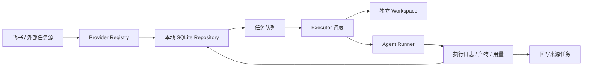
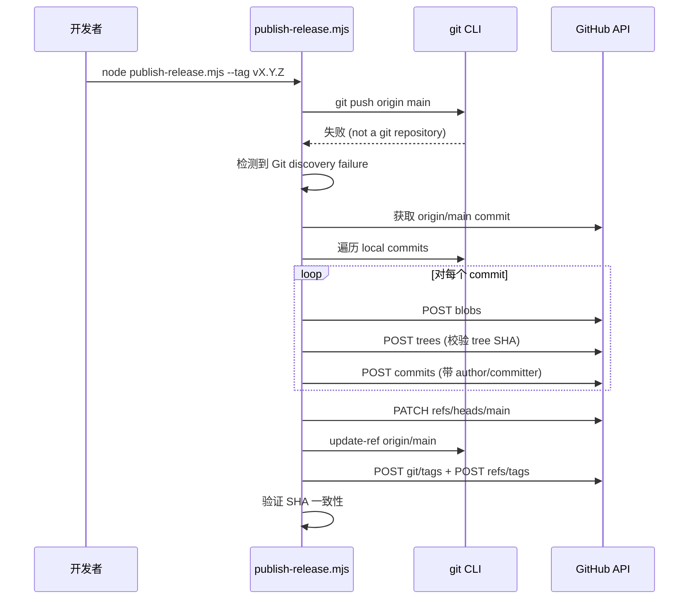

# 项目概述

<cite>
**本文引用的文件**
- [README.md](file://README.md)
- [package.json](file://package.json)
- [skills/tech-cc-hub-release-deploy/scripts/publish-release.mjs](file://skills/tech-cc-hub-release-deploy/scripts/publish-release.mjs)
- [scripts/after-pack-win-icon.cjs](file://scripts/after-pack-win-icon.cjs)
- [scripts/github-release.mjs](file://scripts/github-release.mjs)
- [src/electron/libs/knowledge/repowiki/types.ts](file://src/electron/libs/knowledge/repowiki/types.ts)
- [src/electron/libs/system-prompt-presets.ts](file://src/electron/libs/system-prompt-presets.ts)
- [skills/tech-cc-hub-release-deploy/SKILL.md](file://skills/tech-cc-hub-release-deploy/SKILL.md)
- [skills/tech-cc-hub-release-deploy/agents/openai.yaml](file://skills/tech-cc-hub-release-deploy/agents/openai.yaml)
</cite>

# 项目概述

## 目录

- [项目目标与定位](#项目目标与定位)
- [核心能力](#核心能力)
- [技术栈](#技术栈)
- [架构与运行边界](#架构与运行边界)
- [主要使用场景](#主要使用场景)
- [关键数据流](#关键数据流)
- [配置参考](#配置参考)
- [排障速查](#排障速查)
- [扩展点](#扩展点)

---

## 项目目标与定位

`tech-cc-hub` 是一个桌面端 Agent 工作台，目标是把会话、任务、浏览器、模型路由、执行轨迹和复盘诊断收在同一个 Electron 应用里。它的核心定位不是做一个普通聊天框，而是让本地 Agent 能接任务、看网页、调用工具、写代码、留下日志，并把结果回写到来源系统。([README.md#L9-L11](file://README.md#L9-L11))

项目采用 monorepo 结构，源码在 `src/electron`（主进程）和 `src/ui`（前端），文档在 `doc/`，打包脚本在 `scripts/`。([README.md#L158-L175](file://README.md#L158-L175))

---

## 核心能力

| 能力 | 说明 |
| --- | --- |
| **会话与工作区** | 左侧按 workspace 管理会话；任务执行可绑定独立 workspace，避免污染当前聊天上下文。 |
| **模型路由** | 支持主模型、专家模型、小模型、Prompt 分析模型、图片模型分层配置。([README.md#L85-L86](file://README.md#L85-L86)) |
| **内置浏览器** | 右侧 BrowserView 支持打开页面、截图、DOM 摘要、样式检查、带图/不带图标注模式。 |
| **执行轨迹** | 聊天右侧展示实时统计、诊断和时间线；完整链路可进入 Trace Viewer。 |
| **任务系统** | 同步飞书任务，本地持久化队列，支持重试、暂停、删除、执行记录、产物列表和状态回写。([README.md#L88](file://README.md#L88)) |
| **插件与 MCP** | 内置浏览器、设计检查、受控配置写入等 MCP 工具，供 Agent 在执行中调用。([README.md#L89](file://README.md#L89)) |
| **设计检查** | 支持截图语义分析、两图对比、diff/comparison 图、热点区域、JSON report 生成。([README.md#L90](file://README.md#L90)) |

任务模块集中在 `src/electron/libs/task/`，外部任务源只负责映射数据，本地 Repository 负责持久化，Executor 是唯一调度入口。([README.md#L94](file://README.md#L94))

---

## 技术栈

### 运行时与构建

- **Electron 39.2.7**：桌面应用框架，主进程入口 `src/electron/main.ts`
- **React 19.2.3 + Vite 7.3.1**：前端 UI 框架
- **TypeScript 5.9.3**：全栈类型安全
- **better-sqlite3 12.9.0** + **sqlite-vec 0.1.9**：本地持久化与向量检索
- **electron-builder 26.4.0**：跨平台打包 ([package.json#L114](file://package.json#L114))

### AI / Agent SDK

- **@anthropic-ai/claude-agent-sdk ^0.3.142**：核心 Agent 运行时
- **zod ^4.4.2**：配置与 API 响应 schema 校验
- **croner ^10.0.1**：定时任务调度

### 前端生态

- **Arco Design Web React 2.66.14**：UI 组件库
- **Tailwind CSS 4.1.18**：原子化样式
- **Monaco Editor 0.55.1**：代码编辑器
- **@dnd-kit**：拖拽交互
- **swr 2.4.1**：数据获取与缓存
- **zustand 5.0.10**：状态管理

### 开发工具

- **Playwright 1.59.1**：E2E 测试
- **ESLint 9.39.2**：代码检查
- **electron-updater 6.8.3**：自动更新

---

## 架构与运行边界

### 进程边界

```
┌─────────────────────────────────────────┐
│           Electron Main Process          │
│  ┌─────────────────────────────────────┐ │
│  │  libs/task/                         │ │
│  │    - provider/   (飞书等外部任务源)  │ │
│  │    - repository/ (SQLite 持久化)     │ │
│  │    - workflow/   (任务流程定义)       │ │
│  │    - executor/   (唯一调度入口)       │ │
│  └─────────────────────────────────────┘ │
│  ┌─────────────────────────────────────┐ │
│  │  libs/mcp-tools/                    │ │
│  │    - browser/   (BrowserView MCP)    │ │
│  │    - design/    (设计检查 MCP)       │ │
│  │    - admin/     (配置治理 MCP)       │ │
│  └─────────────────────────────────────┘ │
├─────────────────────────────────────────┤
│           Preload (IPC Bridge)           │
├─────────────────────────────────────────┤
│           Renderer Process (React)       │
│  - Chat UI / Task Panel / Settings      │
│  - BrowserView (右侧工作台)             │
└─────────────────────────────────────────┘
```

### 入口点

| 入口 | 路径 | 职责 |
| --- | --- | --- |
| 主进程 | `src/electron/main.ts` | Electron 生命周期、窗口管理、IPC 注册 |
| 预加载 | `src/electron/preload.ts` | 主进程与渲染进程的 IPC 桥接 |
| 前端入口 | `src/ui/` | React 应用根节点、路由配置 |
| 任务系统 | `src/electron/libs/task/` | 任务生命周期管理 |
| MCP 工具 | `src/electron/libs/mcp-tools/` | 内置 MCP 服务端实现 |

### IPC 通道（关键）

`src/electron/libs/knowledge/repowiki/types.ts` 定义了 `RepoWikiFileSignal` 枚举，覆盖以下 IPC 信号类型：

- `ipc`：主进程间 IPC
- `ui_ipc`：UI 层 IPC 调用
- `mcp_tool`：MCP 工具暴露
- `mcp_server`：MCP 服务端
- `database`：数据库操作
- `store`：状态存储
- `event`：事件流
- `config`：配置读写
- `entrypoint`：入口文件标记 ([src/electron/libs/knowledge/repowiki/types.ts#L8-L12](file://src/electron/libs/knowledge/repowiki/types.ts#L8-L12))

---

## 主要使用场景

### 场景 1：日常聊天与任务执行

用户在主工作台发起聊天，Agent 可调用内置 MCP 工具（浏览器、设计检查、配置写入）完成复杂任务。每次执行右侧展示实时 Usage 统计和时间线。([README.md#L26-L27](file://README.md#L26-L27))

### 场景 2：飞书任务同步与 AI 执行

任务面板同步最近 30 天飞书任务，用户选择任务并点击 `AI 执行`，Executor 在独立 Workspace 中调度 Agent Runner 完成执行，结果回写到飞书任务。([README.md#L28](file://README.md#L28), [README.md#L111-L112](file://README.md#L111-L112))

### 场景 3：设计还原与视觉对比

用户上传截图或 Figma 参考图，Agent 调用 `design_inspect_image` 读取结构化视觉摘要，然后用 `design_compare_current_view` / `design_compare_images` 生成 diff 图和 comparison 图，最终基于 JSON report 验收。([src/electron/libs/system-prompt-presets.ts#L125-L134](file://src/electron/libs/system-prompt-presets.ts#L125-L134))

### 场景 4：跨版本发布与 GitHub Release

使用 `scripts/github-release.mjs` 自动完成版本 bump、commit、tag、push 和 GitHub Release 创建。当 Windows git push 抽风时，`skills/tech-cc-hub-release-deploy/scripts/publish-release.mjs` 提供 GitHub Git Data API fallback 模式。([scripts/github-release.mjs#L387-L439](file://scripts/github-release.mjs#L387-L439), [skills/tech-cc-hub-release-deploy/SKILL.md#L21-L29](file://skills/tech-cc-hub-release-deploy/SKILL.md#L21-L29))

---

## 关键数据流

### 任务系统执行流程



图表来源：[README.md#L96-L107](file://README.md#L96-L107)

### 发布部署流程（Windows API Fallback 场景）



图表来源：[skills/tech-cc-hub-release-deploy/scripts/publish-release.mjs#L251-L352](file://skills/tech-cc-hub-release-deploy/scripts/publish-release.mjs#L251-L352)

---

## 配置参考

### 模型槽位配置（设置页 → AI 接口）

| 槽位 | 用途 | 常见示例 |
| --- | --- | --- |
| 默认主模型 | 普通聊天和任务执行 | `deepseek-v4-pro` |
| 专家模型 | 复杂问题兜底 | `claude-3-5-sonnet` |
| 小模型 / 后台模型 | Haiku/small-fast 后台调用 | `MiniMax-M2.7` |
| Prompt 分析模型 | 执行复盘、上下文诊断 | `qwen3.6-27b` |
| 图片预处理模型 | 读图、OCR、截图语义分析 | `qwen3.6-27b` |

本地 `new-api` 网关配置示例：

```
Base URL: http://localhost:5337/v1
API Key: sk-你的本地网关密钥
``` ([README.md#L119-L127](file://README.md#L119-L127))

### 环境变量（可选）

| 变量 | 用途 | 来源 |
| --- | --- | --- |
| `GH_TOKEN` / `GITHUB_TOKEN` | GitHub API 发布认证 | `scripts/github-release.mjs#L236`](file://scripts/github-release.mjs#L236) |
| `LARK_CLI_COMMAND` | 飞书 CLI 路径 | 飞书文档直读功能 |
| `LARK_CLI_PROFILE` | 飞书 CLI profile | 飞书文档直读功能 |

---

## 排障速查

| 现象 | 优先检查 | 解决方案 |
| --- | --- | --- |
| `API Error: Unable to connect (ConnectionRefused)` | 网关或本地模型桥是否在监听 | Docker 内访问宿主机用 `host.docker.internal` |
| `No available channel for model claude-haiku...` | `小模型 / 后台模型` 是否填了当前网关真实可用模型 | 设置页重新选择或手动添加模型名 |
| 图片工具返回 `图片预处理失败` | 图片预处理模型是否是可读图模型；本地 VLM bridge 和 `new-api` channel 是否健康 | 检查 `new-api` 网关状态和模型配置 |
| 飞书任务同步不到 | Lark CLI 是否已登录；应用权限是否包含 `task:task:read` 等 | 检查 `LARK_CLI_COMMAND` 和 `LARK_CLI_PROFILE` 环境变量 |
| 任务一直执行中 | 查看任务详情右侧时间线 | 重启后 Executor 会按 workflow 配置恢复或重试卡住执行 |
| 右侧浏览器浮在主界面 | 检查 BrowserView 销毁和当前页面路由 | 不要简单禁用右侧浏览器入口，检查路由状态 |
| Windows git push 报 `.git discovery failure` | Windows 路径解析问题 | 使用 `--api-only` 参数走 GitHub API fallback |
| Windows 包缺少图标 | `build/icon.ico` 或 `rcedit.exe` 缺失 | `scripts/after-pack-win-icon.cjs#L22`](file://scripts/after-pack-win-icon.cjs#L22) 会 warn 但不阻断打包 |

章节来源：[README.md#L177-L186](file://README.md#L177-L186)

---

## 扩展点

### 1. 添加新的 MCP 工具

在 `src/electron/libs/mcp-tools/` 下创建新目录，实现 `McpServer` 接口，注册到 `builtin-mcp-registry.ts`。Agent 会通过 `buildBuiltinMcpRegistryPromptAppend()` 自动获得工具使用提示。([src/electron/libs/system-prompt-presets.ts#L117-L119](file://src/electron/libs/system-prompt-presets.ts#L117-L119))

### 2. 添加新的任务 Provider

在 `src/electron/libs/task/provider/` 下实现 Provider 接口，注册到 Provider Registry。Executor 会通过统一接口调度任务。([README.md#L94](file://README.md#L94))

### 3. 添加新的 System Prompt 预设

在 `src/electron/libs/system-prompt-presets.ts` 中添加新的 `buildXxxPromptAppend()` 函数，并在 `buildTechCCHubSystemPromptSources()` 中注册为 `PromptLedgerSource`。([src/electron/libs/system-prompt-presets.ts#L136-L174](file://src/electron/libs/system-prompt-presets.ts#L136-L174))

### 4. 扩展 Wiki 类型定义

`src/electron/libs/knowledge/repowiki/types.ts` 定义了 Wiki 数据的完整 Schema，包括 `RepoWikiProjectContext`、`ModuleDoc`、`ArchitectureDiagram`、`ReadingGuide` 等类型，扩展时需遵守既有类型约束。([src/electron/libs/knowledge/repowiki/types.ts#L1-L214](file://src/electron/libs/knowledge/repowiki/types.ts#L1-L214))

### 5. 定制发布流程

- 修改 `scripts/github-release.mjs` 中的 `DEFAULT_RELEASE_NOTE_TEMPLATE` 调整 release body 格式
- 修改 `skills/tech-cc-hub-release-deploy/scripts/publish-release.mjs` 调整 API fallback 行为 ([scripts/github-release.mjs#L46-L57](file://scripts/github-release.mjs#L46-L57))

---

## 常用命令

| 命令 | 作用 |
| --- | --- |
| `npm run dev` | 同时启动 Vite 和 Electron 开发环境 |
| `npm run build` | TypeScript project build + Vite build |
| `npm run package:win` | Windows 打包（通过安全脚本） |
| `npm run release:github` | 自动完成版本 bump、commit、tag、push、GitHub Release |
| `npm run qa:smoke` | Electron 最小聊天冒烟 |
| `npm run qa:preview` | 预览工作台冒烟 |

章节来源：[README.md#L137-L155](file://README.md#L137-L155)