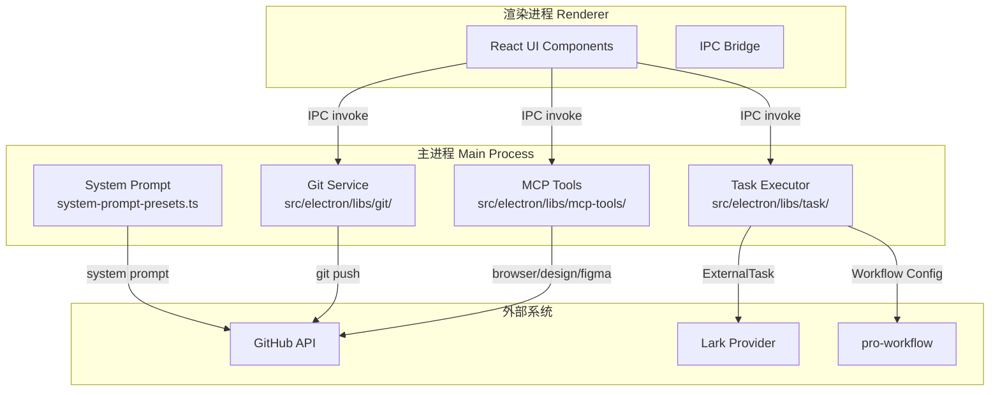
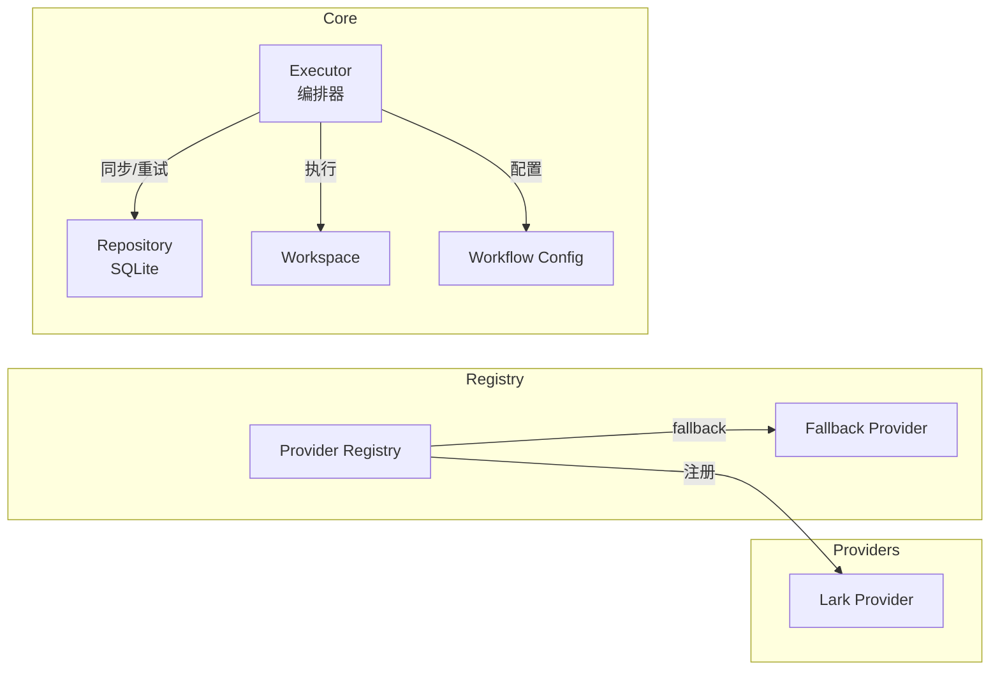
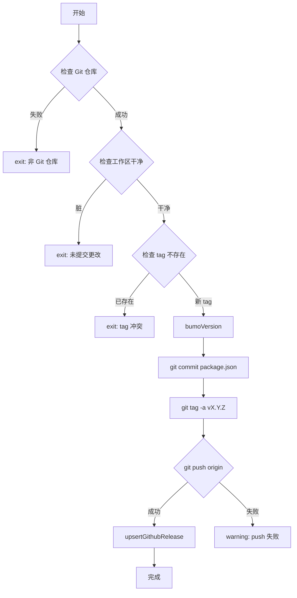

# 项目概述

<cite>
**本文引用的文件**

- [skills/tech-cc-hub-release-deploy/scripts/publish-release.mjs](file://skills/tech-cc-hub-release-deploy/scripts/publish-release.mjs)
- [scripts/github-release.mjs](file://scripts/github-release.mjs)
- [src/electron/libs/system-prompt-presets.ts](file://src/electron/libs/system-prompt-presets.ts)
- [skills/tech-cc-hub-release-deploy/SKILL.md](file://skills/tech-cc-hub-release-deploy/SKILL.md)
- [skills/tech-cc-hub-release-deploy/agents/openai.yaml](file://skills/tech-cc-hub-release-deploy/agents/openai.yaml)
- [pro-workflow/skills/wiki-research-loop/scripts/research-loop.js](file://pro-workflow/skills/wiki-research-loop/scripts/research-loop.js)
- [src/electron/libs/git/README.md](file://src/electron/libs/git/README.md)
- [src/electron/libs/mcp-tools/README.md](file://src/electron/libs/mcp-tools/README.md)
- [src/electron/libs/task/README.md](file://src/electron/libs/task/README.md)
</cite>

## 目录

- [简介](#简介)
- [技术架构概览](#技术架构概览)
- [核心模块与职责](#核心模块与职责)
  - [Git 工作台模块](#git-工作台模块)
  - [MCP 工具模块](#mcp-工具模块)
  - [任务编排模块](#任务编排模块)
  - [System Prompt 体系](#system-prompt-体系)
- [发布与部署流程](#发布与部署流程)
  - [GitHub Release 脚本](#github-release-脚本)
  - [API Fallback 推送机制](#api-fallback-推送机制)
- [Wiki 研究工作流](#wiki-研究工作流)
- [关键扩展点](#关键扩展点)
- [排障与调试](#排障与调试)

---

## 简介

`tech-cc-hub` 是一个基于 Electron 的桌面工作台项目，定位于为 AI 开发者提供一站式浏览器调试、任务编排、Git 管理和设计还原能力。项目采用多进程架构，核心功能集中在主进程（Main Process），通过 IPC 与渲染进程（Renderer）通信。

项目源码位于 `src/electron/libs/`，采用模块化组织：Git 工作台、任务编排、MCP 工具集等各自独立目录。发布流程集成 GitHub Actions，脚本支持普通 git push 和 GitHub API fallback 双模式。

章节来源：`src/electron/libs/git/README.md#L1-L3`，`src/electron/libs/mcp-tools/README.md#L1-L3`

---

## 技术架构概览



### 进程边界说明

- **主进程**：所有 git 操作、任务执行、MCP 工具调用均运行于此，防止 Renderer 阻塞
- **渲染进程**：仅负责 UI 渲染和用户交互，所有系统调用通过 IPC
- **通信协议**：Electron IPC，payload/result 类型定义在各模块 `types.ts`

章节来源：`src/electron/libs/git/README.md#L5-L6`，`src/electron/libs/task/README.md#L17-L21`

---

## 核心模块与职责

### Git 工作台模块

**路径**：`src/electron/libs/git/`

| 文件 | 职责 |
|------|------|
| `types.ts` | Git 领域类型和 IPC payload/result 定义 |
| `errors.ts` | 错误归一化处理 |
| `service.ts` | 唯一 Git 操作入口 |
| `history.ts` | commit history 解析器 |
| `graph.ts` | lightweight graph lane 生成 |
| `operation-log.ts` | 本地高影响操作日志 |
| `ipc.ts` | Electron IPC handler 注册 |
| `index.ts` | 统一对外出口 |

**第一版允许的操作**：

- status / diff
- stage / unstage
- commit
- ordinary push
- create / checkout branch
- stash save / apply / drop
- recent history / lightweight graph

**第一版禁止的操作**：

- reset / rebase / cherry-pick
- force push / amend / squash
- interactive rebase

章节来源：`src/electron/libs/git/README.md#L5-L34`

---

### MCP 工具模块

**路径**：`src/electron/libs/mcp-tools/`

集中存放暴露给 Agent 的内置 MCP 工具，包含四个核心工具面：

#### 1. Browser 工具 (`browser.ts`)

- 导航、截图摘要、DOM 查询、样式检查
- 标注模式（annotation mode）
- HMR/build 等待（`browser_console_logs(waitFor)`）

#### 2. Design 工具 (`design.ts`)

- 截图语义分析（`design_inspect_image`）
- 截图比照（`design_compare_images`）
- diff 图、三栏 comparison 图、热点区域
- JSON report 生成与读取
- 产物列表回看（`design_list_artifacts`）

#### 3. Figma REST 工具 (`figma-rest.ts`)

- 文件/节点读取、轻量设计树
- token 提取、设计系统 playbook
- UX 审查、Tailwind 初稿
- 导出图、评论、版本、库资源

#### 4. Admin 工具 (`admin.ts`)

- 写入 `agent-runtime.json` 的 `env`、`skillCredentials` 等全局参数
- 受控管理能力，工具只做合规持久化

**审阅重点**：

- 每个工具明确 host 边界，不直接操作 React UI
- 返回摘要、路径和结构化 JSON，避免大图或密钥明文
- 涉及写入必须有 allowlist 和体积上限

章节来源：`src/electron/libs/mcp-tools/README.md#L1-L22`

---

### 任务编排模块

**路径**：`src/electron/libs/task/`



**模块边界**：

| 文件 | 职责 |
|------|------|
| `types.ts` | 任务、执行记录、IPC payload 领域类型 |
| `provider-registry.ts` | Provider 注册表和 fallback |
| `providers/` | 外部任务源适配器（目前含 Lark） |
| `repository.ts` | SQLite schema、任务状态、执行记录和日志持久化 |
| `workflow.ts` | Symphony-style workflow 配置、轮询、重试和 stall 参数 |
| `workspace.ts` | 每个任务的独立 workspace 创建和路径安全 |
| `executor.ts` | 唯一调度入口，同步、自动执行、并发控制、重试、恢复 |

**运行原则**：

- Provider 只负责把第三方任务映射成 `ExternalTask`，不直接改 UI
- Repository 只做持久化，不启动 runner
- Executor 是唯一调度入口
- 任务执行使用独立 workspace，避免互相污染

章节来源：`src/electron/libs/task/README.md#L1-L22`

---

### System Prompt 体系

**路径**：`src/electron/libs/system-prompt-presets.ts`

通过 `buildTechCCHubSystemPromptSources()` 统一构建 6 个预设块：

| 预设 ID | 标签 | 内容方向 |
|--------|------|----------|
| `tech-cc-hub-browser-preset` | 内置浏览器预设 | BrowserView 规则、内置 MCP 工具优先 |
| `tech-cc-hub-admin-preset` | 配置治理预设 | `agent-runtime.json` 写入规范 |
| `tech-cc-hub-tool-policy-preset` | 工具调用预设 | 工具调用预算、批量读取、Task 使用边界 |
| `tech-cc-hub-design-preset` | 设计还原预设 | 截图比照、设计 MCP 工具触发规则 |
| `tech-cc-hub-builtin-mcp-registry-preset` | Built-in MCP registry | 内置 MCP server hint |
| `tech-cc-hub-claude-code-2139-preset` | Claude Code 兼容 | 2.1.139 版本兼容提示 |

**关键 Prompt 规则示例**（来自 `buildToolCallOptimizationPromptAppend`）：

- 首次工具调用前批量收集证据
- 使用内置 `Task` 工具做并行调查，仅当工作拆分为 2+ 独立路径
- 单文件读取或紧耦合链不走 Task
- 文件读取控制在 200 行以内
- 优先使用 bounded rg/find 定位，而非 ls → cat → grep → cat

章节来源：`src/electron/libs/system-prompt-presets.ts#L136-L175`，`src/electron/libs/system-prompt-presets.ts#L28-L43`

---

## 发布与部署流程

### GitHub Release 脚本

**路径**：`scripts/github-release.mjs`

主流程用于标准发布，核心参数和步骤：



**命令行参数**：

```bash
# 用法
npm run release:github -- [patch|minor|major|vX.Y.Z] [options]

# 常用选项
--dry-run           # 模拟运行，不执行实际操作
--no-push          # 只创建 commit 和 tag，不推送
--allow-dirty      # 允许工作区有未提交更改
--no-release       # 跳过 GitHub Release API 调用
--release-title-template "<tmpl>"  # 标题模板，支持 {tag} 占位符
--release-note-template <path>    # 自定义发布说明模板路径
```

**Token 获取优先级**（`getGithubToken` 函数）：

1. `GITHUB_TOKEN` 环境变量
2. `GH_TOKEN` 环境变量
3. `GITHUB_API_TOKEN` 环境变量
4. `git credential fill` 交互式获取

章节来源：`scripts/github-release.mjs#L235-L252`，`scripts/github-release.mjs#L387-L439`

---

### API Fallback 推送机制

**路径**：`skills/tech-cc-hub-release-deploy/scripts/publish-release.mjs`

专为 Windows 环境 git push 抽风场景设计，支持两种推送模式：

#### 模式一：普通 Push

```bash
node skills/tech-cc-hub-release-deploy/scripts/publish-release.mjs
```

#### 模式二：API Fallback（检测到 git discovery failure 时自动触发）

当检测到 `fatal: not a git repository` 错误时，脚本自动切换到 GitHub Git Data API 模式：

```bash
node skills/tech-cc-hub-release-deploy/scripts/publish-release.mjs --api-only
```

**API Fallback 核心逻辑**：

1. 验证远端 `main` 是本地 `HEAD` 的祖先（线性提交范围）
2. 逐个 commit 创建 blob → tree → commit
3. 校验 GitHub API 返回的 commit SHA 必须等于本地 commit SHA
4. 保留原始 author、committer、commit message
5. 更新 `refs/heads/main` 后同步本地 `refs/remotes/origin/main`

**常用命令**：

```powershell
# 推送当前 HEAD 并移动 release tag
node skills/tech-cc-hub-release-deploy/scripts/publish-release.mjs --tag v0.1.13 --retag --delete-release

# 只更新发布说明
node skills/tech-cc-hub-release-deploy/scripts/publish-release.mjs --tag v0.1.13 --notes .tmp/release-notes-v0.1.13.md --notes-only

# 只推当前 HEAD 到 origin/main
node skills/tech-cc-hub-release-deploy/scripts/publish-release.mjs
```

**验证推送结果**：

```bash
git rev-parse HEAD                    # 本地 HEAD
git rev-parse origin/main             # 本地缓存的远端 main
git ls-remote --heads origin main     # 远端实际 main
```

三者应指向同一 commit。若 SHA 不一致，检查脚本输出的 tree/commit mismatch。

章节来源：`skills/tech-cc-hub-release-deploy/scripts/publish-release.mjs#L354-L386`，`skills/tech-cc-hub-release-deploy/SKILL.md#L50-L81`

---

## Wiki 研究工作流

**路径**：`pro-workflow/skills/wiki-research-loop/scripts/research-loop.js`

支持多 Wiki 的异步研究循环系统，关键参数：

```bash
research-loop.js run <slug> [options]
  --max-pages 5          # 每次运行最大页数
  --max-depth 3          # 最大搜索深度
  --budget-usd 0.50      # 本次运行预算（美元）
  --fetchers web,arxiv,github  # 启用的 fetcher 列表
  --force                # 强制忽略 auto_research.enabled
```

**子命令**：

| 命令 | 作用 |
|------|------|
| `run <slug>` | 执行一轮研究循环 |
| `seed <slug> "<query>"` | 添加研究种子 |
| `seeds <slug>` | 列出所有种子状态 |
| `cancel <slug>` | 取消所有 pending/active 种子 |
| `status` | 全局 kill-switch 和各 wiki 统计 |

**终止条件**：

- `STOP_FILE` 存在 → `kill-switch`
- 预算超限 → `budget`
- 连续 3 轮 novelty < 5% → `converged`
- 队列为空 → `queue-empty`

章节来源：`pro-workflow/skills/wiki-research-loop/scripts/research-loop.js#L344-L352`，`pro-workflow/skills/wiki-research-loop/scripts/research-loop.js#L196-L254`

---

## 关键扩展点

### 1. 新增 MCP 工具

在 `src/electron/libs/mcp-tools/` 下新建工具文件：

```typescript
// 示例结构
export function myTool(params: MyParams): ToolResult {
  // 1. 明确 host 边界，不操作 React UI
  // 2. 返回摘要/路径/结构化 JSON
  // 3. 涉及写入必须有 allowlist 和体积上限
}
```

### 2. 新增 System Prompt 预设

在 `system-prompt-presets.ts` 的 `buildTechCCHubSystemPromptSources()` 中注册新条目：

```typescript
{
  id: "unique-preset-id",
  label: "人类可读标签",
  sourceKind: "system",
  text: buildMyPreset(),  // 返回 string
}
```

### 3. 新增任务 Provider

在 `src/electron/libs/task/providers/` 下实现 `ExternalTask` 接口：

- 只做任务映射，不改 UI 或会话
- 注入到 `provider-registry.ts`

### 4. 自定义 Fetcher

在 `pro-workflow/skills/wiki-research-loop/scripts/source-fetchers/` 下实现：

```javascript
module.exports = {
  match(query) { /* 返回是否处理此 query */ },
  estimateCost(query) { /* 返回 { usd: N } */ },
  async fetch(query, { limit }) { /* 返回 [{ title, url, content? }] */ }
};
```

---

## 排障与调试

### Git Push 失败

| 症状 | 原因 | 处理 |
|------|------|------|
| `fatal: not a git repository` | Windows git discovery 故障 | 使用 `--api-only` |
| `origin/main is not an ancestor of HEAD` | 远端有新提交 | 先 `git fetch/rebase` |
| GitHub API tree mismatch | commit 校验失败 | 检查网络或 token 权限 |

### 发布脚本 Token 问题

1. 确认环境变量：`GH_TOKEN` 或 `GITHUB_TOKEN`
2. 若使用 credential manager：`git credential fill` 需正确配置
3. Token 权限需包含 `repo` 范围

### MCP 工具调用异常

1. 检查工具返回内容是否为摘要/JSON（而非大图）
2. 确认 BrowserView 已初始化
3. Design 工具连续比照同一张图会导致 verdict 异常

### 任务执行卡住

1. 检查 Executor 是否为唯一调度入口
2. 确认 workspace 隔离正常
3. 查看 `pro-workflow` 的 STOP 文件是否被意外创建

---

## 相关文档

- [Git 模块详情](file://src/electron/libs/git/README.md#L1-L35)
- [MCP 工具详情](file://src/electron/libs/mcp-tools/README.md#L1-L23)
- [任务编排模块详情](file://src/electron/libs/task/README.md#L1-L23)
- [发布部署 Skill](file://skills/tech-cc-hub-release-deploy/SKILL.md#L1-L101)
- [GitHub Release 脚本](file://scripts/github-release.mjs#L1-L444)