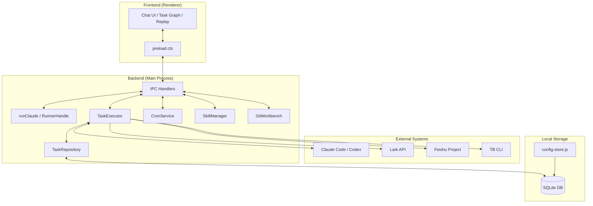
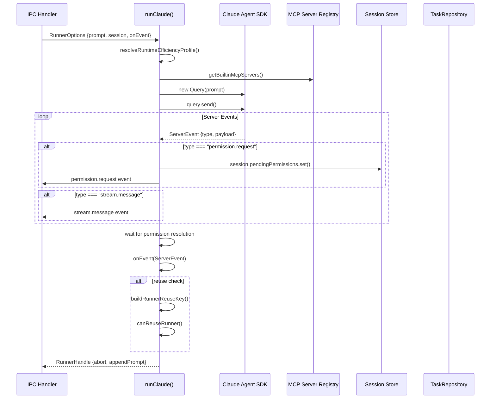
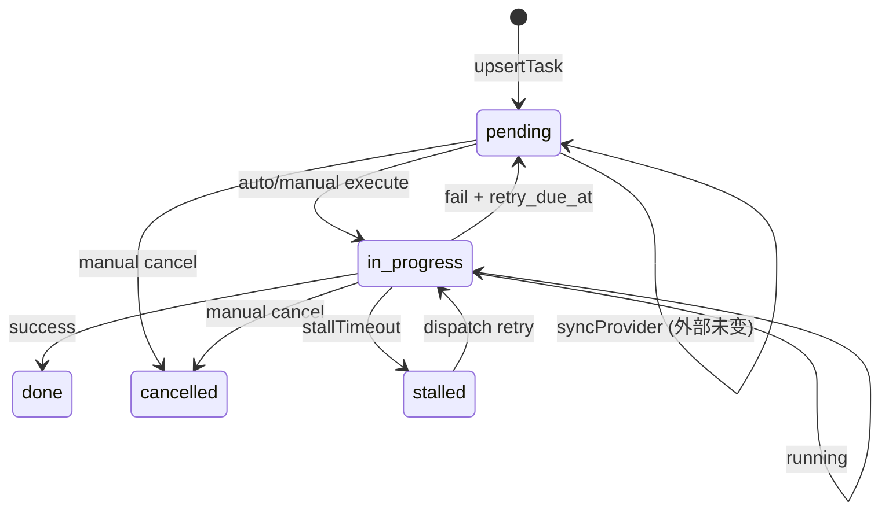
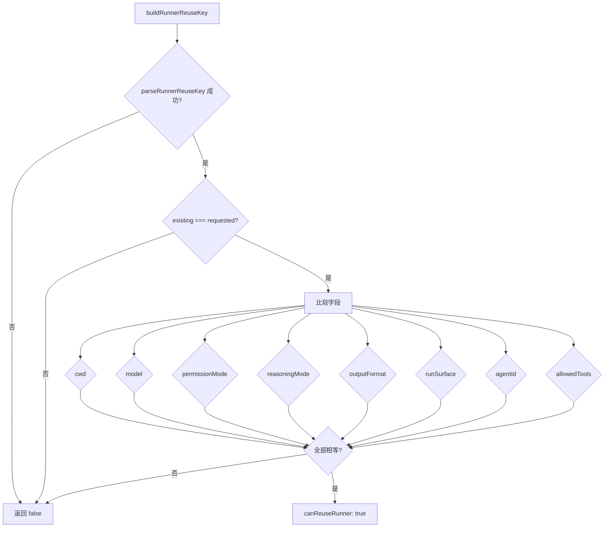

# 产品定义

<cite>
**本文引用的文件**
- [doc/00-overview/00-产品定义.md](file://doc/00-overview/00-产品定义.md)
- [doc/40-product/1.0.0/01-发布目标与范围.md](file://doc/40-product/1.0.0/01-发布目标与范围.md)
- [src/electron/libs/runner.ts](file://src/electron/libs/runner.ts)
- [src/electron/libs/runner-reuse.ts](file://src/electron/libs/runner-reuse.ts)
- [src/electron/main.ts](file://src/electron/main.ts)
- [src/electron/preload.cts](file://src/electron/preload.cts)
- [src/electron/libs/system-prompt-presets.ts](file://src/electron/libs/system-prompt-presets.ts)
- [src/electron/libs/task/README.md](file://src/electron/libs/task/README.md)
- [src/electron/libs/task/index.ts](file://src/electron/libs/task/index.ts)
- [src/electron/libs/task/executor.ts](file://src/electron/libs/task/executor.ts)
- [src/electron/libs/task/provider-registry.ts](file://src/electron/libs/task/provider-registry.ts)
- [src/electron/libs/task/providers/feishu-project-provider.ts](file://src/electron/libs/task/providers/feishu-project-provider.ts)
- [src/electron/libs/task/providers/lark-provider.ts](file://src/electron/libs/task/providers/lark-provider.ts)
- [src/electron/libs/task/providers/tb-provider.ts](file://src/electron/libs/task/providers/tb-provider.ts)
- [src/electron/libs/task/repository.ts](file://src/electron/libs/task/repository.ts)
- [src/electron/libs/task/settings.ts](file://src/electron/libs/task/settings.ts)
</cite>

---

## 目录

- [1. 产品是什么](#1-产品是什么)
- [2. 解决什么问题](#2-解决什么问题)
- [3. 核心价值主张](#3-核心价值主张)
- [4. 与竞品的差异化定位](#4-与竞品的差异化定位)
- [5. 技术架构证据地图](#5-技术架构证据地图)
- [6. 关键模块与符号说明](#6-关键模块与符号说明)
- [7. 运行时状态流](#7-运行时状态流)
- [8. 失败模式与排障](#8-失败模式与排障)
- [9. 扩展点](#9-扩展点)
- [10. Agent 改代码地图](#10-agent-改代码地图)

---

## 1. 产品是什么

`tech-cc-hub` 是一个 **AI Agent 桌面工作台**，构建在 Claude Code、Codex 等 AgentOS 之上，提供半托管控制层。

### 1.1 产品形态

- **Desktop-first GUI**：基于 Electron 的跨平台桌面应用
- **Local-first Runtime Assets**：本地优先的会话、任务、事件、快照、时间线等运行资产
- **Versioned Spec Assets**：workflow、skills、policies、task templates 等可版本化资产

### 1.2 核心概念

| 概念 | 定义 | 源码证据 |
|------|------|----------|
| `CLAW` | 构建在 AgentOS 之上的半托管控制层 | [doc/00-overview/00-产品定义.md#L38](file://doc/00-overview/00-产品定义.md#L38) |
| `AgentOS` | 提供底层推理、工具调用、会话执行和基础权限模型的外部系统 | [doc/00-overview/00-产品定义.md#L39](file://doc/00-overview/00-产品定义.md#L39) |
| `SpecAsset` | workflow、skills、prompts、policies、task templates 等可版本化资产 | [doc/00-overview/00-产品定义.md#L40](file://doc/00-overview/00-产品定义.md#L40) |
| `RuntimeAsset` | session、task、event、snapshot、timeline、replay、analysis 等运行资产 | [doc/00-overview/00-产品定义.md#L41](file://doc/00-overview/00-产品定义.md#L41) |
| `Control Plane` | 用户控制、任务编排、权限决策和协同视图 | [doc/00-overview/00-产品定义.md#L42](file://doc/00-overview/00-产品定义.md#L42) |
| `Execution Plane` | 与 AgentOS 的会话桥接、Worker 调度、事件接入和结果回写 | [doc/00-overview/00-产品定义.md#L43](file://doc/00-overview/00-产品定义.md#L43) |

### 1.3 一级能力接口

**对用户暴露的一级能力**：
- `Chat Workspace` - 聊天工作区
- `Task Graph Workspace` - 任务图工作区
- `Replay / Analysis Workspace` - 回放与分析工作区
- `SpecAsset Workspace` - Spec 资产工作区

**对 AgentOS 暴露的一级契约**：
- `AgentAdapter` - Agent 适配器
- `EventEnvelope` - 事件信封
- `Session` - 会话
- `TaskNode` - 任务节点

---

## 2. 解决什么问题

### 2.1 问题定义

复杂任务的人机协作面临三大挑战：

1. **执行黑箱**：Agent 执行过程不可观测、不可回放
2. **治理缺失**：权限请求、人工介入、冲突记录无闭环
3. **资产离散**：workflow、skills、prompts 等资产无法版本化和复用

### 2.2 产品主链路

```
用户输入 → SpecAsset + Task Graph → Hub 分派 → AgentOS 执行
  → RuntimeAsset 记录 → 时间线重建 → 回放文档生成 → 分析报告输出
  → 持续调优 spec/workflow/skills
```

> 产品主链路：不是"再造一个 Agent"，而是"把 Agent 使用过程变成可治理的软件资产"。
>
> [章节来源](file://doc/00-overview/00-产品定义.md#L55-L57)

### 2.3 可观测性要求

至少要能观测 `用户输入 -> 任务分解 -> AgentOS 执行 -> 事件入流 -> 回放生成 -> 分析输出` 全链路。产品级验收以回放闭环优先，而不是以智能分析花哨程度优先。

> [章节来源](file://doc/00-overview/00-产品定义.md#L77-L78)

---

## 3. 核心价值主张

### 3.1 核心价值

> 让 Agent 使用过程从一次性执行，进化成可回放、可追责、可持续调优的系统。
>
> [章节来源](file://doc/00-overview/00-产品定义.md#L45)

### 3.2 v1.0.0 发布范围

#### Must Have（无则版本不成立）

| 领域 | 能力 | 源码证据 |
|------|------|----------|
| Chat | Claude Code / Codex 二选一，默认 Claude Code | [runner.ts#L213](file://src/electron/libs/runner.ts#L213) |
| Session | 创建、续写、停止、恢复聊天会话 | [main.ts#L30](file://src/electron/main.ts#L30) |
| Task Graph | 从聊天 turn 自动生成治理节点，支持依赖、重试、回写 | [executor.ts#L89](file://src/electron/libs/task/executor.ts#L89) |
| AgentOS | 至少接通 2 个 AgentOS 的统一视图 | [main.ts#L47-62](file://src/electron/main.ts#L47-L62) |
| Replay | 从事件流生成时间线与回放文档 | [executor.ts#L31-40](file://src/electron/libs/task/executor.ts#L31-L40) |
| Analysis | 生成基础分析报告和核心指标 | [repository.ts#L67-135](file://src/electron/libs/task/repository.ts#L67-L135) |
| SpecAsset | workflow / skills / policies 可附着到 Session 或 Task | [system-prompt-presets.ts](file://src/electron/libs/system-prompt-presets.ts) |
| Governance | 权限请求、人工介入、冲突记录闭环 | [runner.ts#L241-268](file://src/electron/libs/runner.ts#L241-L268) |

#### Won't Have（明确不进入 v1.0.0）

| 领域 | 原因 |
|------|------|
| Cloud | 多人协作与云真源 |
| Runtime | 自研底层 Agent 内核 |
| Marketplace | 对外插件市场 |
| Mobile | 移动端客户端 |

> [章节来源](file://doc/40-product/1.0.0/01-发布目标与范围.md#L72-L79)

---

## 4. 与竞品的差异化定位

### 4.1 差异化矩阵

| 维度 | 传统 Agent CLI | 通用 AI Chatbot | tech-cc-hub |
|------|----------------|-----------------|-------------|
| 执行治理 | ❌ 无 | ❌ 无 | ✅ 回放+分析 |
| 任务编排 | ❌ 手动 | ❌ 手动 | ✅ Task Graph |
| 资产复用 | ❌ 无 | ❌ 无 | ✅ Versioned Spec |
| 多 AgentOS | ❌ 单一 | ❌ 单一 | ✅ 统一视图 |
| 外部任务源 | ❌ 无 | ❌ 无 | ✅ Provider 体系 |

### 4.2 定位原则

- **不是"再造一个 Agent"**：不自研底层执行内核
- **不是"薄壳 GUI"**：承载 spec/workflow/skills 和可观测闭环
- **RuntimeAsset 与 SpecAsset 分离**：保持回放与调优的可追踪性

> [章节来源](file://doc/00-overview/00-产品定义.md#L72-L74)

---

## 5. 技术架构证据地图

### 5.1 系统架构图



### 5.2 关键 IPC Channel

| Channel | 方向 | 说明 | 源码证据 |
|---------|------|------|----------|
| `client-event` | Renderer → Main | 发送客户端事件 | [preload.cts#L12-14](file://src/electron/preload.cts#L12-L14) |
| `server-event` | Main → Renderer | 接收服务端事件 | [preload.cts#L15-26](file://src/electron/preload.cts#L15-L26) |
| `sessions:list` | Renderer → Main | 列出会话 | [main.ts](file://src/electron/main.ts) |
| `plugins:*` | Renderer → Main | 插件管理 | [main.ts](file://src/electron/main.ts) |
| `browser-*` | Renderer → Main | 浏览器工作台控制 | [preload.cts#L130-159](file://src/electron/preload.cts#L130-L159) |
| `cron:*` | Bidirectional | 定时任务事件 | [preload.cts#L171-189](file://src/electron/preload.cts#L171-L189) |
| `knowledge:*` | Renderer → Main | 知识库操作 | [main.ts#L119-130](file://src/electron/main.ts#L119-L130) |

### 5.3 Runner 调用链



---

## 6. 关键模块与符号说明

### 6.1 Runner 模块 (`src/electron/libs/runner.ts`)

#### 导出类型

```typescript
// RunnerOptions: runClaude 的输入参数
export type RunnerOptions = {
  prompt: string;
  attachments?: PromptAttachment[];
  runtime?: RuntimeOverrides;
  session: Session;
  resumeSessionId?: string;
  onEvent: (event: ServerEvent) => void;
  onSessionUpdate?: (updates: Partial<Session>) => void;
};

// RunnerHandle: runClaude 返回的控制柄
export type RunnerHandle = {
  abort: () => void;
  appendPrompt: (prompt: string, attachments?: PromptAttachment[]) => Promise<void>;
  isClosed: () => boolean;
  reuseKey?: string;
};
```

#### 关键函数

| 函数 | 行号 | 说明 | 参数 |
|------|------|------|------|
| `runClaude` | L213 | 主执行入口 | `options: RunnerOptions` |
| `getRequestedModelName` | L186 | 解析请求的模型名 | `configModel`, `runtimeModel` |
| `resolveOutputFormat` | L196 | 解析输出格式 | `runtimeOutputFormat`, `systemPromptAppend`, `prompt` |
| `buildEffectiveAllowedToolSet` | L828 | 构建有效工具集 | (内部) |
| `buildRunnerReuseKey` | (runner-reuse.ts L29) | 构建复用 key | `input: RunnerReuseKeyInput` |
| `canReuseRunner` | (runner-reuse.ts L32) | 判断是否可复用 | `existingKey`, `requestedKey` |

#### 内置 MCP Server 名称

```typescript
// runner-reuse.ts L108-117
type BuiltinMcpServerName =
  | "tech-cc-hub-browser"
  | "tech-cc-hub-admin"
  | "tech-cc-hub-design"
  | "tech-cc-hub-figma"
  | "tech-cc-hub-cron"
  | "tech-cc-hub-idea"
  | "tech-cc-hub-plan";
```

> [章节来源](file://src/electron/libs/runner.ts#L90-L105)

### 6.2 System Prompt 预设 (`src/electron/libs/system-prompt-presets.ts`)

#### 导出函数

| 函数 | 行号 | 说明 |
|------|------|------|
| `buildBrowserWorkbenchPromptAppend` | L11 | 浏览器工作台提示追加 |
| `buildAdminConfigPromptAppend` | L20 | 管理配置提示追加 |
| `buildToolCallOptimizationPromptAppend` | L27 | 工具调用优化提示 |
| `buildFeishuDocumentFetchPromptAppend` | L52 | 飞书文档获取提示 |
| `buildBuiltinMcpRegistryPromptAppend` | L116 | 内置 MCP 注册提示 |
| `buildDesignParityPromptAppend` | L124 | 设计还原提示 |

#### 飞书文档 URL 提取

```typescript
const FEISHU_DOC_URL_PATTERN = /https?:\/\/[^\s<>"'`]*feishu\.cn\/(?:wiki|docx|docs)\/[^\s<>"'`]*]/gi;
const MAX_FEISHU_DOC_URL_HINTS = 3;

export function extractFeishuDocumentUrls(text: string): string[] {
  const matches = text.match(FEISHU_DOC_URL_PATTERN) ?? [];
  // ... 返回最多 3 个 URL
}
```

> [章节来源](file://src/electron/libs/system-prompt-presets.ts#L7-L51)

### 6.3 Task 模块 (`src/electron/libs/task/`)

#### 模块边界

根据 [task/README.md](file://src/electron/libs/task/README.md#L1-L22)：

| 文件 | 职责 |
|------|------|
| `types.ts` | 领域类型定义 |
| `provider-registry.ts` | Provider 注册表 |
| `providers/*.ts` | 外部任务源适配器 |
| `repository.ts` | SQLite 持久化 |
| `executor.ts` | 编排器、调度入口 |
| `settings.ts` | 工作流配置读写 |

#### 导出 (`index.ts`)

```typescript
export { TaskExecutor } from "./executor.js";
export { TaskRepository } from "./repository.js";
export { registerTaskProvider, getTaskProvider, listTaskProviders, listTaskProviderStates, ensureProvider } from "./provider-registry.js";
export { loadTaskWorkflowConfig, createDefaultTaskWorkflowConfig, computeRetryDueAt } from "./workflow.js";
export { loadTaskSettings, saveTaskSettings, createDefaultTaskSettings, applyTaskSettingsToWorkflow } from "./settings.js";
export { LarkTaskProvider } from "./providers/lark-provider.js";
export { TbTaskProvider } from "./providers/tb-provider.js";
export { FeishuProjectTaskProvider } from "./providers/feishu-project-provider.js";
```

> [章节来源](file://src/electron/libs/task/index.ts#L1-L36)

### 6.4 TaskExecutor (`executor.ts`)

#### 导出类型

```typescript
export type TaskExecutorEvents = {
  onTaskUpdated?: (task: StoredTask) => void;
  onTaskDeleted?: (taskId: string) => void;
  onExecutionStarted?: (execution: TaskExecution) => void;
  onExecutionCompleted?: (execution: TaskExecution) => void;
  onExecutionLog?: (log: TaskExecutionLog) => void;
  onStatsChanged?: (stats: TaskStats) => void;
  onSyncCompleted?: (provider: TaskProviderId, count: number) => void;
  onError?: (message: string) => void;
};

export type TaskExecutorOptions = {
  sessionStore?: SessionStore;
  emitServerEvent?: (event: ServerEvent) => void;
  workflowConfig?: TaskWorkflowConfig;
  userDataPath?: string;
  cwd?: string;
};
```

#### 常量

| 常量 | 值 | 说明 |
|------|-----|------|
| `INTERRUPTED_EXECUTION_ERROR` | `"应用已重启，上一轮任务执行进程已中断。"` | 中断错误消息 |
| `DEFAULT_EXECUTION_TIMEOUT_MS` | `30 * 60 * 1000` | 默认超时 30 分钟 |
| `DEFER_RETRY_MS` | `5000` | 重试延迟 5 秒 |
| `MAX_ARTIFACTS` | `80` | 最大产物数 |

#### 核心方法

| 方法 | 行号 | 说明 |
|------|------|------|
| `syncProvider` | L140 | 同步单个 Provider |
| `syncAll` | L170 | 同步所有 Provider |
| `startPolling` | L180 | 启动轮询 |
| `stopPolling` | L192 | 停止轮询 |
| `execute` | (未完全展示) | 执行任务 |

> [章节来源](file://src/electron/libs/task/executor.ts#L31-L101)

### 6.5 TaskProvider 注册 (`provider-registry.ts`)

```typescript
const registry = new Map<TaskProviderId, TaskProvider>();

export function registerTaskProvider(provider: TaskProvider): void;
export function getTaskProvider(id: TaskProviderId): TaskProvider | undefined;
export function listTaskProviders(): TaskProvider[];
export async function listTaskProviderStates(): Promise<TaskProviderState[]>;
export function ensureProvider(id: TaskProviderId): TaskProvider;
```

#### 现有 Provider

| Provider | ID | 能力 | 源码证据 |
|----------|-----|------|----------|
| `LarkTaskProvider` | `lark` | fetch, status-writeback, comment-writeback, delete, cli-configurable | [lark-provider.ts#L157](file://src/electron/libs/task/providers/lark-provider.ts#L157) |
| `TbTaskProvider` | `tb` | 同上 | [tb-provider.ts#L24](file://src/electron/libs/task/providers/tb-provider.ts#L24) |
| `FeishuProjectTaskProvider` | `feishu-project` | 同上 | [feishu-project-provider.ts#L111](file://src/electron/libs/task/providers/feishu-project-provider.ts#L111) |

### 6.6 SQLite Schema (`repository.ts`)

```sql
CREATE TABLE IF NOT EXISTS tasks (
  id TEXT PRIMARY KEY,
  external_id TEXT NOT NULL,
  provider TEXT NOT NULL,
  title TEXT NOT NULL,
  status TEXT NOT NULL DEFAULT 'pending',
  local_status TEXT NOT NULL DEFAULT 'pending',
  claim_state TEXT NOT NULL DEFAULT 'unclaimed',
  retry_attempt INTEGER NOT NULL DEFAULT 0,
  retry_due_at INTEGER,
  workspace_path TEXT,
  driver_id TEXT,
  model TEXT,
  reasoning_mode TEXT,
  -- ... 更多字段
  UNIQUE(external_id, provider)
);

CREATE TABLE IF NOT EXISTS task_executions (
  id TEXT PRIMARY KEY,
  task_id TEXT NOT NULL REFERENCES tasks(id),
  session_id TEXT NOT NULL,
  status TEXT NOT NULL DEFAULT 'running',
  attempt INTEGER NOT NULL DEFAULT 0,
  -- ... 更多字段
);

CREATE TABLE IF NOT EXISTS task_execution_logs (
  id TEXT PRIMARY KEY,
  execution_id TEXT NOT NULL REFERENCES task_executions(id),
  task_id TEXT NOT NULL REFERENCES tasks(id),
  level TEXT NOT NULL DEFAULT 'info',
  message TEXT NOT NULL,
  timestamp INTEGER NOT NULL
);

CREATE TABLE IF NOT EXISTS task_subtasks (
  id TEXT PRIMARY KEY,
  task_id TEXT NOT NULL REFERENCES tasks(id),
  title TEXT NOT NULL,
  status TEXT NOT NULL DEFAULT 'pending',
  sort_order INTEGER NOT NULL DEFAULT 0
);

CREATE TABLE IF NOT EXISTS task_artifacts (
  id TEXT PRIMARY KEY,
  task_id TEXT NOT NULL REFERENCES tasks(id),
  path TEXT NOT NULL,
  kind TEXT NOT NULL DEFAULT 'file',
  summary TEXT
);

CREATE TABLE IF NOT EXISTS task_dismissals (
  provider TEXT NOT NULL,
  external_id TEXT NOT NULL,
  deleted_at INTEGER NOT NULL,
  PRIMARY KEY(provider, external_id)
);
```

> [章节来源](file://src/electron/libs/task/repository.ts#L32-L135)

### 6.7 TaskSettings 配置 (`settings.ts`)

```typescript
const CONFIG_KEY = "tasks";

export type TaskWorkflowSettings = {
  pollingIntervalMs: number;       // 默认 60s
  maxConcurrentAgents: number;      // 默认 1
  maxAutoRetries: number;           // 默认 0
  maxRetryBackoffMs: number;        // 默认 1000ms
  stallTimeoutMs: number;           // 默认 30s
  defaultDriverId: "claude";       // 固定为 claude
  defaultReasoningMode: TaskReasoningMode;
  maxCostUsd: number | undefined;
  writeBackEnabled: boolean;
  promptTemplate: string;
  tbCliCommand: string;
  tbFetchArgsTemplate: string;
  tbUpdateArgsTemplate: string;
  tbCommentArgsTemplate: string;
};
```

配置存储路径：`loadGlobalRuntimeConfig()["tasks"]`

> [章节来源](file://src/electron/libs/task/settings.ts#L5-L24)

---

## 7. 运行时状态流

### 7.1 Session 生命周期

```
new Session → active → (pause) → paused → (resume) → active → (complete) → completed
                ↓
            permission.request → pendingPermission → (approve/deny) → active
```

### 7.2 Task 状态机



### 7.3 Runner 复用判断



**复用 key 字段**（来源：[runner-reuse.ts L52-73](file://src/electron/libs/runner-reuse.ts#L52-L73)）：

```typescript
type RunnerReuseDescriptor = {
  cwd: string;
  model: string;
  permissionMode: string;
  reasoningMode: string;
  outputFormat: string;
  runSurface: AgentRunSurface;
  agentId: string;
  allowedTools: string;
  runtimeProfile: string;
  builtinMcpServers: BuiltinMcpServerName[];
};
```

---

## 8. 失败模式与排障

### 8.1 常见失败模式

| 失败场景 | 症状 | 排查方向 | 源码证据 |
|----------|------|----------|----------|
| MCP Server 启动失败 | permission.request 超时 | 检查 MCP Server 名称是否在白名单 | [runner.ts#L828](file://src/electron/libs/runner.ts#L828) |
| Runner 复用冲突 | 新 prompt 使用旧 context | 确认 `reuseKey` 变化条件 | [runner-reuse.ts L33-49](file://src/electron/libs/runner-reuse.ts#L33-L49) |
| Lark Provider 授权缺失 | `"need_user_authorization"` 错误 | 执行 `lark-cli auth login --domain task` | [lark-provider.ts L141-148](file://src/electron/libs/task/providers/lark-provider.ts#L141-L148) |
| Task 执行中断 | `"应用已重启，上一轮任务执行进程已中断。"` | 检查 App 重启日志 | [executor.ts L84](file://src/electron/libs/task/executor.ts#L84) |
| SQLite 迁移失败 | 查询报错 | 检查 `hasTasksColumns` / `hasExecutionColumns` | [repository.ts L138-182](file://src/electron/libs/task/repository.ts#L138-L182) |

### 8.2 Task 排障步骤

1. **检查 Provider 配置**：

```bash
# Lark Provider
lark-cli --version
lark-cli api GET /open-apis/task/v2/tasks --params '{"type":"my_tasks","completed":false}' --as user

# Feishu Project Provider
feishu-project --version
feishu-project list-items --type task --format json
```

2. **检查 TaskExecutor 状态**：

```typescript
// 获取 Provider 状态
const states = await listTaskProviderStates();
console.log(states);

// 检查任务统计
const stats = taskExecutor.getStats?.();
// 注意：需要查看 TaskExecutor 是否有 getStats 方法
```

3. **检查 SQLite 数据**：

```sql
-- 查看任务状态分布
SELECT local_status, COUNT(*) FROM tasks GROUP BY local_status;

-- 查看最近执行记录
SELECT id, task_id, status, terminal_reason, error
FROM task_executions
ORDER BY started_at DESC LIMIT 10;

-- 查看执行日志
SELECT * FROM task_execution_logs
WHERE execution_id = '<execution_id>'
ORDER BY timestamp;
```

### 8.3 Runner 排障步骤

1. **检查 System Prompt 预设**：

```typescript
import {
  buildBrowserWorkbenchPromptAppend,
  buildAdminConfigPromptAppend,
  buildToolCallOptimizationPromptAppend,
  buildBuiltinMcpRegistryPromptAppend,
  buildDesignParityPromptAppend,
} from './system-prompt-presets';

console.log(buildBrowserWorkbenchPromptAppend());
```

2. **检查 MCP Server 可用性**：

```typescript
import { listBuiltinMcpToolNames } from './builtin-mcp-servers';
console.log(listBuiltinMcpToolNames());
// 输出示例: ["mcp__tech-cc-hub-browser__...", "mcp__tech-cc-hub-admin__...", ...]
```

3. **检查 Runner 复用条件**：

```typescript
import { buildRunnerReuseKey, canReuseRunner } from './runner-reuse';

const existingKey = currentRunnerHandle.reuseKey;
const requestedKey = buildRunnerReuseKey({
  cwd: process.cwd(),
  model: 'claude-sonnet-4-20250514',
  allowedTools: ' Edit,Read,Write',
  // ...
});

console.log('Can reuse:', canReuseRunner(existingKey, requestedKey));
```

---

## 9. 扩展点

### 9.1 新增 Task Provider

参考 `tb-provider.ts` 的实现模式：

```typescript
import type { ExternalTask, ExternalTaskStatus, TaskProvider } from "../types.ts";

export class MyCustomTaskProvider implements TaskProvider {
  readonly id = "my-custom" as const;
  readonly name = "My Custom Tasks";

  isEnabled(): boolean {
    // 检查配置是否启用
    return Boolean(process.env.MY_CUSTOM_ENABLED);
  }

  getCapabilities() {
    return ["fetch", "status-writeback", "comment-writeback"];
  }

  async fetchTasks(): Promise<ExternalTask[]> {
    // 1. 调用外部 API / CLI
    // 2. 映射到 ExternalTask 结构
    // 3. 返回数组
  }

  async updateTaskStatus(externalId: string, status: ExternalTaskStatus): Promise<void> {
    // 状态回写逻辑
  }

  async validateConfig(): Promise<{ valid: boolean; error?: string }> {
    // 配置校验
    return { valid: true };
  }
}

// 在应用启动时注册
import { registerTaskProvider } from "./provider-registry.js";
registerTaskProvider(new MyCustomTaskProvider());
```

> 参考：[tb-provider.ts](file://src/electron/libs/task/providers/tb-provider.ts#L24-L106) | [provider-registry.ts L5](file://src/electron/libs/task/provider-registry.ts#L5)

### 9.2 新增 System Prompt 预设

```typescript
// src/electron/libs/system-prompt-presets.ts

export function buildMyCustomPromptAppend(): string {
  return [
    "Custom prompt rules here.",
    "Another rule line.",
  ].join("\n");
}

// 在 runner.ts 中集成
import { buildMyCustomPromptAppend } from "./system-prompt-presets.js";

// 在 runClaude 函数中调用
const systemPromptAppend = [
  buildBrowserWorkbenchPromptAppend(),
  buildAdminConfigPromptAppend(),
  buildToolCallOptimizationPromptAppend(),
  buildMyCustomPromptAppend(), // 新增
].filter(Boolean).join("\n");
```

> 参考：[system-prompt-presets.ts](file://src/electron/libs/system-prompt-presets.ts#L1-L176)

### 9.3 新增 IPC Channel

```typescript
// src/electron/main.ts
ipcMain.handle("my-custom:action", async (event, ...args) => {
  // 处理逻辑
  return result;
});

// src/electron/preload.cts
const electron = require("electron");
electron.contextBridge.exposeInMainWorld("electron", {
  myCustomAction: (...args) => ipcInvoke("my-custom:action", ...args),
});
```

> 参考：[main.ts L119-130](file://src/electron/main.ts#L119-L130) | [preload.cts](file://src/electron/preload.cts#L1-L206)

### 9.4 新增内置 MCP Server

1. 在 `src/shared/builtin-mcp-registry.ts` 添加 Server 定义
2. 在 `runner-reuse.ts` 的 `isBuiltinMcpServerName` 函数中添加新的 Server 名称
3. 实现 MCP Server Handler

> 参考：[runner-reuse.ts L108-117](file://src/electron/libs/runner-reuse.ts#L108-L117)

---

## 10. Agent 改代码地图

### 10.1 修改 Runner 模块

#### 先读文件

| 优先级 | 文件 | 原因 |
|--------|------|------|
| 1 | `src/electron/libs/runner.ts` | 核心执行逻辑 |
| 2 | `src/electron/libs/runner-reuse.ts` | Runner 复用逻辑 |
| 3 | `src/shared/builtin-mcp-registry.ts` | MCP Server 注册 |

#### 关键符号

| 符号类型 | 名称 | 位置 | 说明 |
|----------|------|------|------|
| 类型 | `RunnerOptions` | runner.ts L90 | 执行选项 |
| 类型 | `RunnerHandle` | runner.ts L100 | 执行控制柄 |
| 函数 | `runClaude` | runner.ts L213 | 主入口 |
| 函数 | `buildRunnerReuseKey` | runner-reuse.ts L29 | 复用 key |
| 函数 | `canReuseRunner` | runner-reuse.ts L32 | 复用判断 |
| 常量 | `BUILTIN_MCP_TOOL_NAMES` | runner.ts L112 | 内置工具名 |

#### 修改入口

- **修改执行参数**：修改 `RunnerOptions` 类型定义及 `runClaude` 函数签名
- **修改复用逻辑**：修改 `RunnerReuseDescriptor` 结构体字段
- **新增 MCP Server**：在 `builtin-mcp-registry.ts` 添加 + 在 `runner-reuse.ts` 注册

#### 验证命令

```bash
# 类型检查
npx tsc