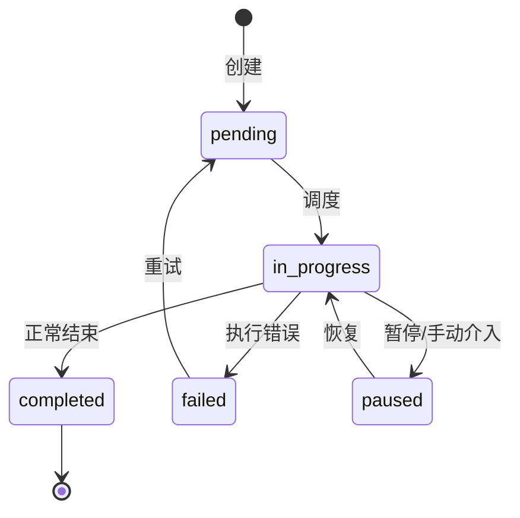
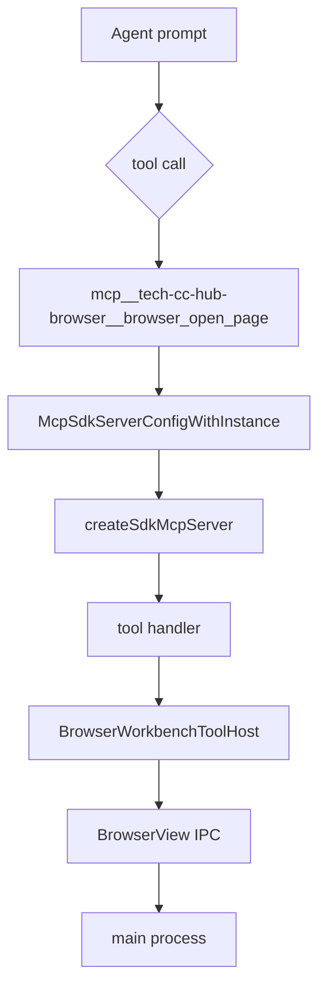
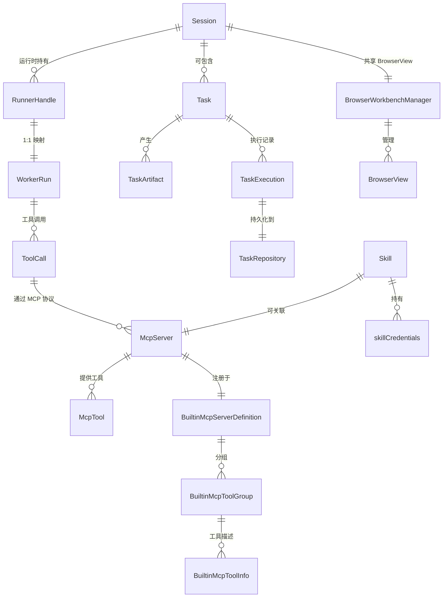
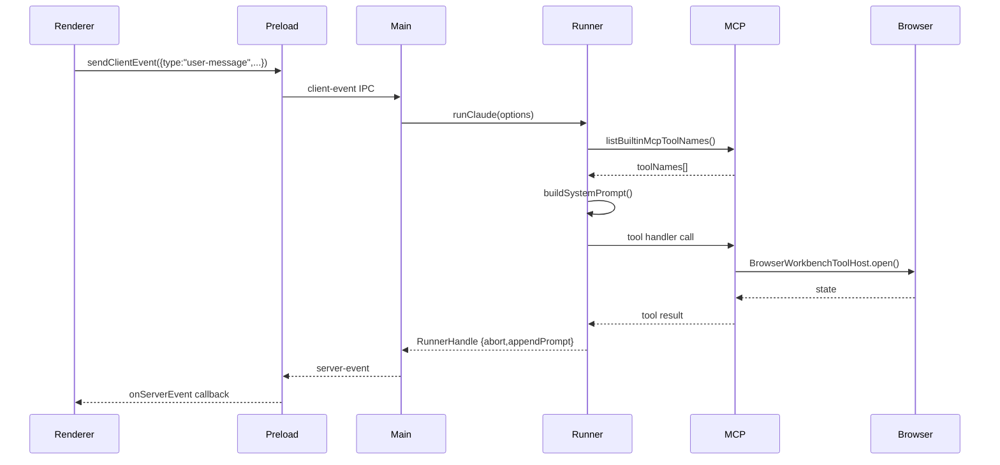

# tech-cc-hub 术语表

<cite>
**本文引用的文件**
- [doc/00-overview/02-术语表.md](file://doc/00-overview/02-术语表.md#L1-L69)
- [src/shared/builtin-mcp-registry.ts](file://src/shared/builtin-mcp-registry.ts#L1-L388)
- [src/electron/libs/builtin-mcp-servers.ts](file://src/electron/libs/builtin-mcp-servers.ts#L1-L68)
- [src/electron/libs/mcp-tools/knowledge.ts](file://src/electron/libs/mcp-tools/knowledge.ts#L1-L413)
- [src/electron/libs/mcp-tools/plan.ts](file://src/electron/libs/mcp-tools/plan.ts#L1-L58)
- [src/electron/libs/mcp-tools/cron.ts](file://src/electron/libs/mcp-tools/cron.ts#L1-L222)
- [src/electron/libs/mcp-tools/browser.ts](file://src/electron/libs/mcp-tools/browser.ts#L1-L1490)
- [src/electron/libs/mcp-tools/admin.ts](file://src/electron/libs/mcp-tools/admin.ts#L1-L572)
- [src/electron/libs/mcp-tools/tool-result.ts](file://src/electron/libs/mcp-tools/tool-result.ts#L1-L15)
- [src/electron/libs/runner.ts](file://src/electron/libs/runner.ts#L1-L1924)
- [src/electron/libs/runner-reuse.ts](file://src/electron/libs/runner-reuse.ts#L1-L119)
- [src/electron/libs/system-prompt-presets.ts](file://src/electron/libs/system-prompt-presets.ts#L1-L176)
- [src/ui/components/settings/McpSettingsPage.tsx](file://src/ui/components/settings/McpSettingsPage.tsx#L1-L640)
- [test/electron/builtin-mcp-registry.test.ts](file://test/electron/builtin-mcp-registry.test.ts#L1-L50)
- [src/electron/main.ts](file://src/electron/main.ts#L1-L2917)
- [src/electron/preload.cts](file://src/electron/preload.cts#L1-L206)
- [src/electron/libs/task/README.md](file://src/electron/libs/task/README.md#L1-L23)
- [src/electron/libs/task/index.ts](file://src/electron/libs/task/index.ts#L1-L37)
</cite>

## 目录

- [1. Session（会话）](#1-session会话)
- [2. Task（任务）](#2-task任务)
- [3. Worker（工作者）](#3-worker工作者)
- [4. Skill（技能）](#4-skill技能)
- [5. Artifact（产物）](#5-artifact产物)
- [6. MCP（Model Context Protocol）](#6-mcpmodel-context-protocol)
- [7. Runner（运行器）](#7-runner运行器)
- [8. IPC 通道与桥接点](#8-ipc-通道与桥接点)
- [9. 核心对象关系图](#9-核心对象关系图)
- [10. Agent 改代码地图](#10-agent-改代码地图)

---

## 1. Session（会话）

### 定义

`Session` 是 tech-cc-hub 的用户级执行上下文容器，对应用户一次完整的 AI 辅助工作流。它承载消息历史、文件上下文、Agent 运行状态，并关联独立的 BrowserView 实例。

### 类型来源

```typescript
// src/electron/libs/runner.ts:L90-98
export type RunnerOptions = {
  prompt: string;
  attachments?: PromptAttachment[];
  runtime?: RuntimeOverrides;
  session: Session;  // 核心关联对象
  resumeSessionId?: string;
  onEvent: (event: ServerEvent) => void;
  onSessionUpdate?: (updates: Partial<Session>) => void;
};
```

### 关键属性

| 属性 | 类型 | 说明 | 章节来源 |
|------|------|------|----------|
| `sessionId` | `string` | 会话唯一标识 | [runner-reuse.ts#L28](file://src/electron/libs/runner-reuse.ts#L28) |
| `cwd` | `string` | 工作目录 | [runner-reuse.ts#L28](file://src/electron/libs/runner-reuse.ts#L28) |
| `model` | `string` | 模型名称 | [runner-reuse.ts#L28](file://src/electron/libs/runner-reuse.ts#L28) |
| `runSurface` | `AgentRunSurface` | "development" \| "maintenance" | [runner-reuse.ts#L53](file://src/electron/libs/runner-reuse.ts#L53) |

### 生命周期状态

```
新建 → 活跃 → 暂停 → 结束
```

### 复用机制

`runner-reuse.ts` 实现了跨轮次 Runner 复用，通过 `buildRunnerReuseKey` 生成缓存键：

```typescript
// src/electron/libs/runner-reuse.ts:L29-50
export function buildRunnerReuseKey(input: RunnerReuseKeyInput): string
export function canReuseRunner(existingKey: string | undefined, requestedKey: string): boolean
```

复用条件：cwd、model、permissionMode、reasoningMode、outputFormat、runSurface、agentId、allowedTools 完全一致。

### IPC 入口

| Channel | 方向 | 说明 | 章节来源 |
|---------|------|------|----------|
| `sessions:list` | renderer→main | 列出历史会话 | [main.ts#L15](file://src/electron/main.ts#L15) |
| `client-event` | renderer→main | 发送客户端事件 | [preload.cts#L13](file://src/electron/preload.cts#L13) |
| `server-event` | main→renderer | 接收服务器事件 | [preload.cts#L15](file://src/electron/preload.cts#L15) |

### 失败模式

1. **Session 冲突**：多标签页同时修改同一 session，导致状态不一致 → 通过 `resumeSessionId` 隔离
2. **模型不可用**：API key 失效 → 触发 `onEvent(ServerEvent)` 并降级到离线模式

---

## 2. Task（任务）

### 定义

`Task` 是比 Session 更细粒度的可调度工作单元。它由 TaskProvider 产生（如 Lark、Feishu Project），经 TaskExecutor 执行，可包含子任务、失败重试和独立 workspace。

### 类型体系

```typescript
// src/electron/libs/task/index.ts:L1-L37
export { TaskExecutor } from "./executor.js";
export { TaskRepository } from "./repository.js";
export type {
  ExternalTask, ExternalTaskStatus, LocalTaskStatus,
  StoredTask, TaskClaimState, TaskClientEvent,
  TaskArtifact, TaskExecution, TaskExecutionBundle,
  TaskExecutionControlAction, TaskExecutionLog,
  TaskExecutionOptions, TaskFilter, TaskPriority,
  TaskProvider, TaskProviderCapability, TaskProviderId,
  TaskProviderState, TaskReasoningMode, TaskServerEvent,
  TaskStats, TaskSubtask, TaskWorkflowSettings,
} from "./types.js";
```

### 核心符号

| 符号 | 文件:行 | 说明 |
|------|----------|------|
| `TaskExecutor` | [task/executor.ts](file://src/electron/libs/task/executor.ts) | 编排器：同步、自动执行、并发控制、重试 |
| `TaskRepository` | [task/repository.ts](file://src/electron/libs/task/repository.ts) | SQLite 持久化：任务状态、执行记录 |
| `registerTaskProvider` | [task/provider-registry.ts](file://src/electron/libs/task/provider-registry.ts) | 注册外部任务源 |
| `LarkTaskProvider` | [task/providers/lark-provider.js](file://src/electron/libs/task/providers/lark-provider.js) | Lark 任务源适配器 |
| `FeishuProjectTaskProvider` | [task/providers/feishu-project-provider.js](file://src/electron/libs/task/providers/feishu-project-provider.js) | 飞书项目任务源 |
| `computeRetryDueAt` | [task/workflow.ts](file://src/electron/libs/task/workflow.ts) | 计算下次重试时间 |

### 执行状态流



### 调度配置

```typescript
// src/electron/libs/task/workflow.ts
export function loadTaskWorkflowConfig()
export function createDefaultTaskWorkflowConfig()
```

默认重试参数：stall 检测 5 分钟，最大重试 3 次，间隔 30 秒。

### 失败模式

1. **Provider 不可达**：Lark/Feishu API 超时 → fallback 到本地存储
2. **Workspace 冲突**：多任务共享同一目录 → 每个任务创建独立 workspace（通过 `ensureTaskWorkspace`）
3. **执行超时**：单任务超过配置阈值 → 标记为 stalled，触发人工介入

---

## 3. Worker（工作者）

### 定义

`Worker` 是 Session 内部的具体 Agent 执行实例。每次 `runClaude` 调用产生一个 WorkerRun，承载模型推理、工具调用和上下文管理。

### 与 Session 的关系

```
Session (容器)
  └── RunnerHandle (运行控制)
        └── WorkerRun (具体执行)
              ├── ToolCalls[]
              ├── Messages[]
              └── Artifacts[]
```

### 类型来源

```typescript
// doc/00-overview/02-术语表.md:L44
| Worker 执行 | `WorkerRun` | 一次具体的 Agent 执行实例 |
```

### 关键符号

| 符号 | 文件:行 | 说明 |
|------|----------|------|
| `runClaude` | [runner.ts#L212](file://src/electron/libs/runner.ts#L212) | 主入口函数，创建 Worker |
| `RunnerHandle` | [runner.ts#L100-105](file://src/electron/libs/runner.ts#L100-L105) | Worker 控制柄 |
| `abort()` | [runner.ts#L101](file://src/electron/libs/runner.ts#L101) | 中止当前执行 |
| `appendPrompt()` | [runner.ts#L102](file://src/electron/libs/runner.ts#L102) | 追加上下文 |

### 配置参数

```typescript
// src/electron/libs/runner.ts:L90-98
type RunnerOptions = {
  prompt: string;
  attachments?: PromptAttachment[];
  runtime?: RuntimeOverrides;
  session: Session;
  // ...
};
```

### 并发控制

- 一个 Session 同一时间只有一个活跃 Worker
- 通过 `reuseKey` 判断是否可复用已有 Runner
- Runner 池大小由 `RUNTIME_POOL_SIZE` 控制（默认值 4）

---

## 4. Skill（技能）

### 定义

`Skill` 是可复用的工具链配置，封装了环境变量提示、凭证引用和 MCP 服务器关联。它通过 `skillCredentials` 引用外部 API keys，通过 `env` 注入运行时配置。

### 类型来源

```typescript
// src/electron/libs/mcp-tools/admin.ts:L59-72
type AdminToolInput = {
  patch?: {
    env?: Record<string, string | number | boolean>;
    skillCredentials?: Record<string, string[]>;
    // ...
  };
  // ...
};
```

### 凭证注册流程

1. **Skill 注册**：用户在设置页保存 Figma PAT → 写入 `agent-runtime.json`
2. **凭证注入**：runner 启动时通过 `collectSkillEnvCandidates` 收集候选环境变量
3. **MCP 服务器初始化**：`BUILTIN_MCP_SERVER_FACTORIES` 接收 context 并创建实例

### 关键符号

| 符号 | 文件:行 | 说明 |
|------|----------|------|
| `collectSkillEnvCandidates` | [admin.ts#L313](file://src/electron/libs/mcp-tools/admin.ts#L313) | 收集技能凭证候选 |
| `ADMIN_TOOL_NAMES` | [admin.ts#L14](file://src/electron/libs/mcp-tools/admin.ts#L14) | `["set_global_runtime_config"]` |
| `isAllowedEnvKey` | [admin.ts#L79](file://src/electron/libs/mcp-tools/admin.ts#L79) | 验证环境变量 key 合法性 |
| `normalizePatch` | [admin.ts#L195](file://src/electron/libs/mcp-tools/admin.ts#L195) | 归一化配置补丁 |

### 内置 Skill 映射

| Skill | 环境变量前缀 | MCP 服务器 |
|-------|-------------|------------|
| feishu | `FEISHU`, `LARK` | tech-cc-hub-knowledge |
| figma | `FIGMA` | tech-cc-hub-figma |
| telegram | `TELEGRAM` | - |
| notion | `NOTION` | - |
| jira | `JIRA` | - |
| github | `GITHUB`, `GH_` | - |

```typescript
// src/electron/libs/runner.ts:L121-134
const SKILL_ENV_HINTS: Record<string, string[]> = {
  feishu: ["FEISHU", "LARK"],
  figma: ["FIGMA"],
  telegram: ["TELEGRAM"],
  // ...
};
```

### 失败模式

1. **凭证缺失**：`skillCredentials` 引用了未配置的 key → MCP 服务器初始化失败
2. **Key 冲突**：`ANTHROPIC_*` 前缀被 `isAllowedEnvKey` 拒绝，防止覆盖主运行时配置

---

## 5. Artifact（产物）

### 定义

`Artifact` 是 Worker 执行过程中产生的结构化输出，包括文件变更、代码片段、截图、报告等。它通过 `TaskArtifact` 类型持久化到 SQLite。

### 类型来源

```typescript
// src/electron/libs/task/index.ts:L19
export type {
  TaskArtifact,  // 任务产物
  // ...
};
```

### 产物分类

| 类型 | 说明 | 示例 |
|------|------|------|
| `file_change` | 文件新增/修改 | Create, Edit, Write 操作结果 |
| `screenshot` | 截图 | `browser_save_screenshot` 输出 |
| `report` | 分析报告 | `design_read_comparison_report` JSON |
| `memory` | 记忆条目 | `memory_update` 产物 |
| `plan` | 任务计划 | `update_plan` 产物 |

### 持久化路径

```
workspaceRoot/
  └── .tech/
        └── artifacts/       # 产物目录
              ├── screenshots/
              ├── reports/
              └── memory/
```

### 关键符号

| 符号 | 文件:行 | 说明 |
|------|----------|------|
| `TaskArtifact` | [task/types.ts](file://src/electron/libs/task/types.ts) | 产物类型定义 |
| `writeFileSync` | [knowledge.ts#L125](file://src/electron/libs/mcp-tools/knowledge.ts#L125) | 写入产物文件 |
| `toTextToolResult` | [tool-result.ts#L3](file://src/electron/libs/mcp-tools/tool-result.ts#L3) | 工具结果序列化 |

---

## 6. MCP（Model Context Protocol）

### 定义

MCP 是 Model Context Protocol 的缩写，是 tech-cc-hub 向 Agent 暴露工具能力的标准协议。每个 MCP Server 提供一组 Tool，Agent 通过 `mcp__<server>__<tool>` 格式调用。

### 内置 MCP 服务器

| 服务器名 | 类型 | 工具数 | 说明 |
|----------|------|--------|------|
| `tech-cc-hub-browser` | builtin | 40+ | 浏览器工作台自动化 |
| `tech-cc-hub-admin` | builtin | 1 | 运行配置管理 |
| `tech-cc-hub-design` | builtin | 8 | 设计还原工具链 |
| `tech-cc-hub-figma` | builtin | 20+ | Figma REST API |
| `tech-cc-hub-cron` | builtin | 3 | 定时任务管理 |
| `tech-cc-hub-idea` | builtin | 4 | IDE 交互 |
| `tech-cc-hub-plan` | builtin | 1 | 任务计划更新 |
| `tech-cc-hub-knowledge` | builtin | 5 | 知识库检索 |

### 类型定义

```typescript
// src/shared/builtin-mcp-registry.ts:L1-50
export type BuiltinMcpServerName =
  | "tech-cc-hub-browser"
  | "tech-cc-hub-admin"
  // ...;

export type BuiltinMcpServerDefinition = {
  name: BuiltinMcpServerName;
  type: "builtin";
  command: "builtin";
  args: string[];
  envKeys: string[];
  enabled: boolean;
  iconKey: BuiltinMcpIconKey;
  description: string;
  toolGroups: BuiltinMcpToolGroup[];
  promptHints?: string[];
};
```

### 注册表导出

```typescript
// src/shared/builtin-mcp-registry.ts:L52
export const BUILTIN_MCP_SERVERS: readonly BuiltinMcpServerDefinition[] = [...]

// 查询函数
getBuiltinMcpServerDefinition(name)
listBuiltinMcpServerInfos()
listBuiltinMcpToolNames()
buildBuiltinMcpPromptHints()
```

### 工厂模式

```typescript
// src/electron/libs/builtin-mcp-servers.ts:L23-32
export const BUILTIN_MCP_SERVER_FACTORIES: Record<BuiltinMcpServerName, BuiltinMcpFactory> = {
  "tech-cc-hub-browser": ({ sessionId }) => getBrowserMcpServer(sessionId),
  "tech-cc-hub-admin": () => getAdminMcpServer(),
  "tech-cc-hub-knowledge": ({ cwd }) => getKnowledgeMcpServer(cwd),
  // ...
};
```

### MCP 工具调用链



### 运行时信号

| 信号 | 服务器 | 说明 |
|------|--------|------|
| `browser_open_page` | browser | 打开 URL |
| `browser_click_element` | browser | 点击元素 |
| `set_global_runtime_config` | admin | 更新配置 |
| `create_scheduled_task` | cron | 创建定时任务 |
| `knowledge_search` | knowledge | 检索知识库 |
| `update_plan` | plan | 更新任务计划 |
| `figma_get_file_metadata` | figma | 读取 Figma 元数据 |

### 外部 MCP 服务器

外部 MCP 服务器通过 `src/electron/libs/external-mcp-servers.ts` 管理：

```typescript
// src/electron/libs/runner.ts:L50-52
import {
  getExternalMcpServers,
  isConfiguredExternalMcpTool,
} from "./external-mcp-servers.js";
```

### 失败模式

1. **工具不可达**：`BrowserWorkbenchToolHost` 未初始化 → MCP 调用返回 "host unavailable"
2. **工具权限不足**：`ALWAYS_ALLOWED_TOOLS` 之外的工具未在 `allowedTools` 中声明 → 拒绝执行

---

## 7. Runner（运行器）

### 定义

`Runner` 是 Worker 的底层执行引擎，封装了 SDK 调用、工具过滤、System Prompt 拼接和事件回调。它是 `runClaude` 函数的返回值。

### 主入口

```typescript
// src/electron/libs/runner.ts:L212
export async function runClaude(
  options: RunnerOptions
): Promise<RunnerHandle>
```

### 关键符号

| 符号 | 文件:行 | 说明 |
|------|----------|------|
| `runClaude` | [runner.ts#L212](file://src/electron/libs/runner.ts#L212) | 主入口函数 |
| `RunnerHandle` | [runner.ts#L100-105](file://src/electron/libs/runner.ts#L100-L105) | 控制柄类型 |
| `isSdkBuiltinCronTool` | [runner.ts#L158](file://src/electron/libs/runner.ts#L158) | 过滤 SDK cron 工具 |
| `buildEffectiveAllowedToolSet` | [runner.ts#L828](file://src/electron/libs/runner.ts#L828) | 构建有效工具集 |
| `combineSystemPromptAppend` | [runner.ts#L889](file://src/electron/libs/runner.ts#L889) | 拼接系统提示 |

### System Prompt 拼接

```typescript
// src/electron/libs/system-prompt-presets.ts
export function buildBrowserWorkbenchPromptAppend(): string
export function buildAdminConfigPromptAppend(): string
export function buildToolCallOptimizationPromptAppend(): string
export function buildBuiltinMcpRegistryPromptAppend(): string
export function buildDesignParityPromptAppend(): string
```

拼接顺序：
1. 内置工具提示（browser, admin, design, figma, cron, idea, plan, knowledge）
2. 飞书文档直读提示（检测 URL 并生成 lark-cli 命令）
3. 全局 System Prompt 扩展
4. Claude Code 2.139 兼容性提示

### 工具过滤

```typescript
// src/electron/libs/runner.ts:L154-160
const SDK_BUILTIN_CRON_TOOLS = new Set(["CronCreate", "CronDelete", "CronList"]);
function isSdkBuiltinCronTool(toolName: string): boolean {
  return SDK_BUILTIN_CRON_TOOLS.has(toolName);
}
```

优先使用 tech-cc-hub 的 `create_scheduled_task` 等 MCP 工具，而非 SDK 内置的 Cron 工具。

### Runner 复用逻辑

```typescript
// src/electron/libs/runner-reuse.ts#L29-50
export function buildRunnerReuseKey(input: RunnerReuseKeyInput): string {
  return JSON.stringify(buildRunnerReuseDescriptor(input));
}
export function canReuseRunner(existingKey: string | undefined, requestedKey: string): boolean
```

复用键组成：
- cwd
- model
- permissionMode
- reasoningMode
- outputFormat
- runSurface
- agentId
- allowedTools
- runtimeProfile
- builtinMcpServers

---

## 8. IPC 通道与桥接点

### 主进程 → 渲染进程

```typescript
// src/electron/preload.cts
electron.contextBridge.exposeInMainWorld("electron", {
  sendClientEvent: (event) => electron.ipcRenderer.send("client-event", event),
  onServerEvent: (callback) => {
    electron.ipcRenderer.on("server-event", cb);
    return () => electron.ipcRenderer.off("server-event", cb);
  },
  // ...
});
```

### 关键 IPC Channel

| Channel | 方向 | Payload | 章节来源 |
|---------|------|---------|----------|
| `client-event` | renderer→main | `ClientEvent` JSON | [preload.cts#L13](file://src/electron/preload.cts#L13) |
| `server-event` | main→renderer | `ServerEvent` JSON | [preload.cts#L15](file://src/electron/preload.cts#L15) |
| `sessions:list` | renderer→main | - | [main.ts#L15](file://src/electron/main.ts#L15) |
| `browser-open` | renderer→main | `{url, sessionId?}` | [preload.cts#L130](file://src/electron/preload.cts#L130) |
| `browser-capture-visible` | renderer→main | `sessionId?` | [preload.cts#L146](file://src/electron/preload.cts#L146) |
| `git:snapshot` | renderer→main | Git snapshot request | [preload.cts#L78](file://src/electron/preload.cts#L78) |
| `preview-read-file` | renderer→main | File preview request | [preload.cts#L109](file://src/electron/preload.cts#L109) |
| `get-system-workspace` | renderer→main | - | [preload.cts#L32](file://src/electron/preload.cts#L32) |
| `get-global-config` | renderer→main | - | [preload.cts#L62](file://src/electron/preload.cts#L62) |
| `save-global-config` | renderer→main | `GlobalRuntimeConfig` | [preload.cts#L64](file://src/electron/preload.cts#L64) |

### 知识库 IPC 通道

```typescript
// src/electron/main.ts:L119-130
const KNOWLEDGE_UI_CHANNELS = [
  "knowledge:list",
  "knowledge:sync-workspaces",
  "knowledge:add-workspace",
  "knowledge:remove-workspace",
  "knowledge:update-generation",
  "knowledge:complete-generation",
  "knowledge:run-generation",
  "knowledge:list-documents",
  "knowledge:read-document",
  "knowledge:overview",
] as const;
```

### 事件类型

```typescript
// src/electron/types.ts
export type ServerEvent = {
  type: string;
  payload: unknown;
  timestamp: number;
};
export type ClientEvent = {
  type: string;
  payload: unknown;
};
```

---

## 9. 核心对象关系图



### 生命周期时序



---

## 10. Agent 改代码地图

### 10.1 修改 MCP 服务器

#### 先读文件

```bash
# 内置 MCP 注册表
cat src/shared/builtin-mcp-registry.ts

# MCP 服务器工厂
cat src/electron/libs/builtin-mcp-servers.ts

# 具体工具实现
cat src/electron/libs/mcp-tools/{browser,admin,cron,plan,knowledge}.ts
```

#### 关键符号

| 符号 | 文件:行 | 说明 |
|------|----------|------|
| `BUILTIN_MCP_SERVERS` | [builtin-mcp-registry.ts#L52](file://src/shared/builtin-mcp-registry.ts#L52) | 服务器定义数组 |
| `BUILTIN_MCP_SERVER_FACTORIES` | [builtin-mcp-servers.ts#L23](file://src/electron/libs/builtin-mcp-servers.ts#L23) | 工厂函数映射 |
| `getBuiltinMcpServerDefinition` | [builtin-mcp-registry.ts#L359](file://src/shared/builtin-mcp-registry.ts#L359) | 查询函数 |

#### 修改入口

1. **新增工具**：在对应 `mcp-tools/*.ts` 中添加 `tool()` 定义
2. **注册工具**：更新 `*_TOOL_NAMES` 数组
3. **注册服务器**：在 `BUILTIN_MCP_SERVERS` 中添加 `BuiltinMcpServerDefinition`
4. **更新工厂**：在 `BUILTIN_MCP_SERVER_FACTORIES` 中添加 factory

#### 验证命令

```bash
# 运行内置 MCP 注册表测试
npx ts-node --test test/electron/builtin-mcp-registry.test.ts

# 检查工具名唯一性
node -e "
const {listBuiltinMcpToolNames} = require('./dist/shared/builtin-mcp-registry.js');
const names = listBuiltinMcpToolNames();
console.log('Total tools:', names.length, 'Unique:', new Set(names).size === names.length);
"
```

#### 常见回归风险

| 风险 | 说明 | 防范 |
|------|------|------|
| 工具名冲突 | 同一工具名出现在多个服务器 | 测试验证 `uniqueToolNames.size === toolNames.length` |
| 类型不匹配 | `BuiltinMcpServerName` 枚举未更新 | 编译时检查 |
| 工厂缺失 | 新服务器没有 factory | 运行时返回 `undefined` |

### 10.2 修改 Runner 执行逻辑

#### 先读文件

```bash
# 主 Runner
cat src/electron/libs/runner.ts

# 复用逻辑
cat src/electron/libs/runner-reuse.ts

# System Prompt 预设
cat src/electron/libs/system-prompt-presets.ts
```

#### 关键符号

| 符号 | 文件:行 | 说明 |
|------|----------|------|
| `runClaude` | [runner.ts#L212](file://src/electron/libs/runner.ts#L212) | 主入口 |
| `buildRunnerReuseKey` | [runner-reuse.ts#L28](file://src/electron/libs/runner-reuse.ts#L28) | 复用键生成 |
| `canReuseRunner` | [runner-reuse.ts#L32](file://src/electron/libs/runner-reuse.ts#L32) | 复用判断 |
| `buildEffectiveAllowedToolSet` | [runner.ts#L828](file://src/electron/libs/runner.ts#L828) | 工具集构建 |
| `ALWAYS_ALLOWED_TOOLS` | [runner.ts#L117-120](file://src/electron/libs/runner.ts#L117-L120) | 始终允许工具 |

#### 修改入口

1. **工具过滤**：修改 `buildEffectiveAllowedToolSet` 或 `isAlwaysAllowedTool`
2. **System Prompt**：在 `system-prompt-presets.ts` 中添加新函数
3. **复用条件**：修改 `buildRunnerReuseDescriptor` 中的键字段

#### 验证命令

```bash
# 端到端测试
npm run test:integration

# Runner 单元测试（如存在）
npx ts-node --test test/electron/runner*.test.ts
```

#### 常见回归风险

| 风险 | 说明 | 防范 |
|------|------|------|
| 工具被误过滤 | 修改 `allowedTools` 导致常用工具不可用 | 检查 `ALWAYS_ALLOWED_TOOLS` 覆盖 |
| 复用键冲突 | 修改复用条件导致 Runner 泄漏 | 测试 `canReuseRunner` 逻辑 |
| Prompt 过长 | 新增 System Prompt 导致上下文溢出 | 监控 token 计数 |

### 10.3 修改 IPC 通道

#### 先读文件

```bash
# Preload 脚本
cat src/electron/preload.cts

# IPC 处理器
cat src/electron/ipc-handlers.ts

# Main 入口
cat src/electron/main.ts
```

#### 关键符号

| 符号 | 文件:行 | 说明 |
|------|----------|------|
| `sendClientEvent` | [preload.cts#L13](file://src/electron/preload.cts#L13) | 渲染→主进程 |
| `onServerEvent` | [preload.cts#L15](file://src/electron/preload.cts#L15) | 主进程→渲染 |
| `ipcMain.handle` | [main.ts](file://src/electron/main.ts) | 请求-响应模式 |
| `ipcMain.on` | [preload.cts](file://src/electron/preload.cts) | 单向消息 |

#### 修改入口

1. **渲染进程**：在 `preload.cts` 中添加 `electron.ipcRenderer.invoke`
2. **主进程**：在 `main.ts` 中添加 `ipcMain.handle`
3. **类型安全**：在 `src/electron/types.ts` 中定义事件类型

#### 验证命令

```bash
# TypeScript 编译检查
npx tsc --noEmit

# IPC 测试（手动）
# 1. 打开 DevTools Console
# 2. window.electron.invoke('test-channel', {})
# 3. 检查返回值
```

#### 常见回归风险

| 风险 | 说明 | 防范 |
|------|------|------|
| Channel 拼写错误 | renderer 和 main 通道名不一致 | 统一常量定义 |
| Payload