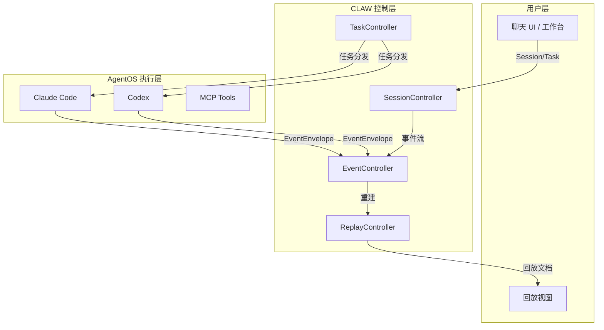
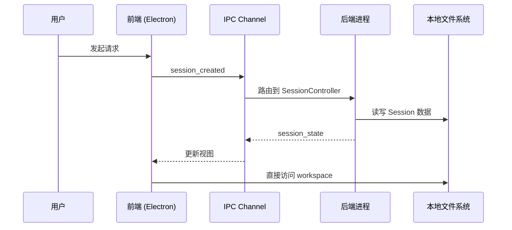
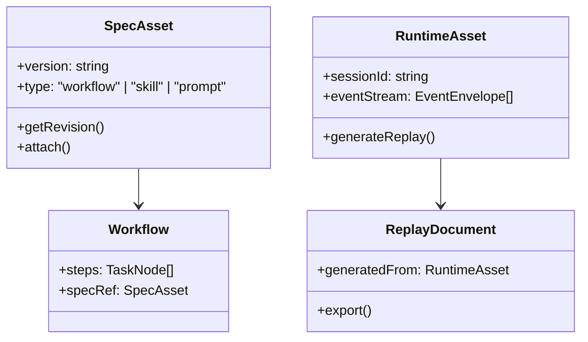
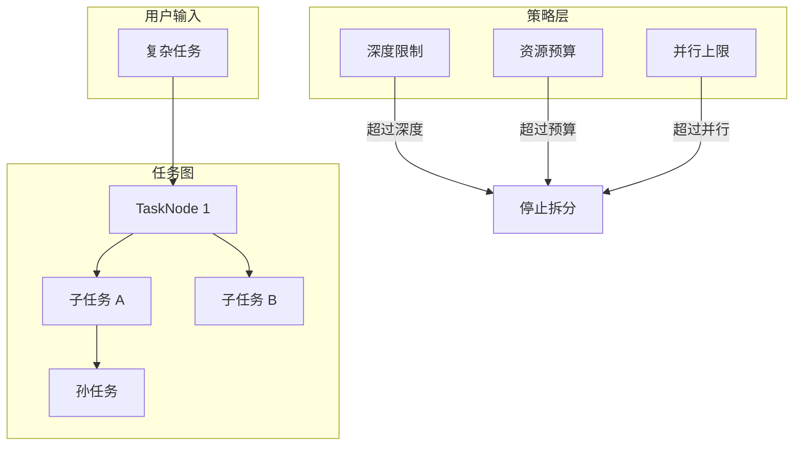
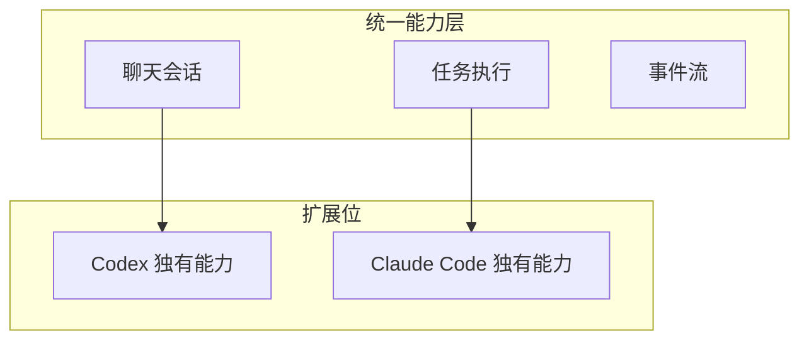

# 设计原则与非目标

<cite>
**本文引用的文件**
- [doc/00-overview/01-设计原则与非目标.md](file://doc/00-overview/01-设计原则与非目标.md)
- [DESIGN.md](file://DESIGN.md)
- [doc/00-overview/00-产品定义.md](file://doc/00-overview/00-产品定义.md)
- [doc/00-overview/02-术语表.md](file://doc/00-overview/02-术语表.md)
- [doc/00-overview/03-文档索引.md](file://doc/00-overview/03-文档索引.md)
- [doc/00-overview/04-问题定义与成功指标.md](file://doc/00-overview/04-问题定义与成功指标.md)
- [doc/40-product/1.0.0/30-epics/36-StoryPack-EP-001-交互工作台.md](file://doc/40-product/1.0.0/30-epics/36-StoryPack-EP-001-交互工作台.md)
- [doc/40-product/1.0.0/40-delivery/46-实施任务单-EP-001-交互工作台.md](file://doc/40-product/1.0.0/40-delivery/46-实施任务单-EP-001-交互工作台.md)
- [doc/40-product/1.0.0/40-delivery/components/CMP-001-SessionSidebar.md](file://doc/40-product/1.0.0/40-delivery/components/CMP-001-SessionSidebar.md)
- [doc/40-product/1.0.0/40-delivery/controllers/CTR-001-SessionController.md](file://doc/40-product/1.0.0/40-delivery/controllers/CTR-001-SessionController.md)
- [doc/adr/ADR-001-统一能力模型策略.md](file://doc/adr/ADR-001-统一能力模型策略.md)
- [src/electron/libs/mcp-tools/figma-rest.ts](file://src/electron/libs/mcp-tools/figma-rest.ts)
- [src/electron/libs/agent-rule-docs.ts](file://src/electron/libs/agent-rule-docs.ts)
- [doc/40-product/1.0.0/00-版本总览.md](file://doc/40-product/1.0.0/00-版本总览.md)
</cite>

# 设计原则与非目标

> 本文档是 tech-cc-hub（项目代号 CLAW）的架构红线手册，定义长期坚持的设计原则与明确不做的事情。
> 适用于：架构评审、规范制定、新功能评估、代码实现检查。

---

## 目录

- [核心设计原则](#核心设计原则)
- [设计原则详解](#设计原则详解)
  - [原则 1：半托管控制层而非自研内核](#原则-1半托管控制层而非自研内核)
  - [原则 2：本地优先与单用户优先](#原则-2本地优先与单用户优先)
  - [原则 3：SpecAsset 与 RuntimeAsset 双中心](#原则-3specasset-与-runtimeasset-双中心)
  - [原则 4：统一优先，扩展保留](#原则-4统一优先扩展保留)
  - [原则 5：回放优先于高级分析](#原则-5回放优先于高级分析)
  - [原则 6：递归任务图需策略约束](#原则-6递归任务图需策略约束)
- [架构决策原理（Rationale）](#架构决策原理rationale)
- [非目标清单](#非目标清单)
- [关键对象与契约边界](#关键对象与契约边界)
- [可观测性要求](#可观测性要求)
- [Agent 改代码地图](#agent-改代码地图)
- [设计原则变更流程](#设计原则变更流程)

---

## 核心设计原则

| 原则 ID | 原则名称 | 核心约束 | 来源 |
|---------|----------|----------|------|
| `DP-01` | 半托管控制层 | CLAW 是 AgentOS 的控制层，不是自研执行内核 | [01-设计原则与非目标.md#L45](file://doc/00-overview/01-设计原则与非目标.md#L45) |
| `DP-02` | 本地优先 | 本机文件系统是 v1 事实真相 | [01-设计原则与非目标.md#L47](file://doc/00-overview/01-设计原则与非目标.md#L47) |
| `DP-03` | 双中心资产 | SpecAsset 和 RuntimeAsset 并列为一等资产 | [01-设计原则与非目标.md#L48](file://doc/00-overview/01-设计原则与非目标.md#L48) |
| `DP-04` | 统一优先 | 优先抽象 Claude Code 和 Codex 通用能力 | [01-设计原则与非目标.md#L49](file://doc/00-overview/01-设计原则与非目标.md#L49) |
| `DP-05` | 回放优先 | 先保证事件到回放闭环，再做高阶分析 | [01-设计原则与非目标.md#L50](file://doc/00-overview/01-设计原则与非目标.md#L50) |
| `DP-06` | 约束递归 | 任务图递归拆分必须经过策略层约束 | [01-设计原则与非目标.md#L58](file://doc/00-overview/01-设计原则与非目标.md#L58) |

> **章节来源**: [doc/00-overview/01-设计原则与非目标.md#L43-L50](file://doc/00-overview/01-设计原则与非目标.md#L43-L50)

---

## 设计原则详解

### 原则 1：半托管控制层而非自研内核

**约束内容**：CLAW 不接管 LLM 推理或底层工具系统，只增强控制面和观测面。

**架构图示**：



**关键说明**：
- CLAW 位于用户与 AgentOS 之间，是**编排层**而非**执行层**
- AgentOS 负责推理、工具调用、会话执行和基础权限模型
- CLAW 负责任务编排、事件采集、回放重建、SpecAsset 管理

**Source-of-Truth**：
- `CTR-001-SessionController` 管理 Session 生命周期
- `CTR-003-TaskController` 管理任务图与任务节点
- `CTR-006-EventController` 采集 EventEnvelope

> **章节来源**: [doc/00-overview/00-产品定义.md#L38-L44](file://doc/00-overview/00-产品定义.md#L38-L44)

---

### 原则 2：本地优先与单用户优先

**约束内容**：v1 是 `local-first / single-user / desktop-first`。

**数据流边界**：



**文件事实真相位置**：
| 数据类型 | Source-of-Truth | 路径模式 |
|----------|-----------------|----------|
| Session 数据 | 本地 JSON/Markdown | `~/.claw/sessions/{sessionId}/` |
| SpecAsset | 本地版本化文件 | `~/.claw/specs/` |
| RuntimeAsset | 本地事件流 | `~/.claw/events/` |
| 用户规则 | `CLAUDE.md` | `getUserClaudeRoot()` 路径 |

**配置读取入口**：
```typescript
// src/electron/libs/agent-rule-docs.ts#L102-L112
export function loadAgentRuleDocuments(): AgentRuleDocuments {
  const userClaudeRoot = getUserClaudeRoot();  // 本地优先路径
  const userAgentsPath = join(userClaudeRoot, USER_AGENTS_FILE);
  // ...
}
```

**运行时刷新边界**：
- `SessionController` 变更后需要 IPC 通知前端刷新
- `SpecAsset` 变更后通过 `agent-rule-docs.ts` 重新加载
- MCP 工具配置变更需要重启 Electron 主进程

> **章节来源**: [doc/00-overview/01-设计原则与非目标.md#L46](file://doc/00-overview/01-设计原则与非目标.md#L46)

---

### 原则 3：SpecAsset 与 RuntimeAsset 双中心

**约束内容**：SpecAsset 和 RuntimeAsset 必须分层管理、单独建模。

**资产类型对比**：

| 资产类型 | 定义 | 规范 Owner | 生命周期 |
|----------|------|------------|----------|
| `SpecAsset` | workflow、skills、prompts、policies、task templates | `31` (Workflow 与 Skills) | 版本化、可复用 |
| `RuntimeAsset` | session、task、event、snapshot、timeline、replay、analysis | `26` (存储与产物) | 运行时生成 |

**分层架构**：



**失败模式**：
- 若将 RuntimeAsset 与 SpecAsset 混写，会破坏回放与调优的可追踪性
- 每个资产只能有一个主规范 owner

> **章节来源**: [doc/00-overview/01-设计原则与非目标.md#L48](file://doc/00-overview/01-设计原则与非目标.md#L48)；[00-产品定义.md#L41-L42](file://doc/00-overview/00-产品定义.md#L41-L42)

---

### 原则 4：统一优先，扩展保留

**约束内容**：优先抽象 Claude Code 和 Codex 的通用能力，再保留扩展位。

**ADR 决策记录**：

> 核心产品流只依赖统一能力模型；无法抽平的能力进入 `extension`；`extension` 不允许成为主流程硬依赖。

**能力模型映射矩阵**：

| 能力维度 | Claude Code | Codex | CLAW 抽象 |
|----------|-------------|-------|-----------|
| 聊天会话 | ✅ | ✅ | `Session` |
| 任务执行 | ✅ | ✅ | `WorkerRun` |
| 事件流 | ✅ | ⚠️ | `EventEnvelope` |
| MCP 工具 | ⚠️ | ⚠️ | `McpServer` |
| 产物回放 | ✅ | ✅ | `ReplayDocument` |

**扩展位声明方式**：
```typescript
// src/electron/libs/mcp-tools/figma-rest.ts#L36
export { FIGMA_REST_TOOL_NAMES };

// MCP 工具注册
const FIGMA_REST_TOOL_NAMES = [
  "figma_get_current_user",
  "figma_get_file_metadata",
  "figma_read_design",
  "figma_summarize_design",
  "figma_generate_tailwind_code",
  // ...
];
```

**适配器能力声明**：
- 每个 AgentAdapter 必须声明能力矩阵
- 运行时回填真实支持度
- 诊断视图暴露无法抽平的高级能力

> **章节来源**: [doc/adr/ADR-001-统一能力模型策略.md#L29-L33](file://doc/adr/ADR-001-统一能力模型策略.md#L29-L33)

---

### 原则 5：回放优先于高级分析

**约束内容**：先保证事件到回放闭环，再做高阶分析。

**优先级排序**：


**证据闭环流程**：

| 步骤 | 输入 | 输出 | 规范 Owner |
|------|------|------|------------|
| 1. 事件采集 | AgentOS 执行 | `EventEnvelope` | `24-事件模型与可观测规范` |
| 2. 时间线构建 | 事件流 | `Timeline` | `25-会话与状态机规范` |
| 3. 回放生成 | 时间线 + 上下文 | `ReplayDocument` | `32-回放与分析报告规范` |
| 4. 分析报告 | 回放文档 | `AnalysisReport` | `32-回放与分析报告规范` |

**v1 成功标准**：
- 复杂任务回放生成成功率达到 `80%+`
- Replay coverage 保持在 `90%+`

> **章节来源**: [01-设计原则与非目标.md#L50](file://doc/00-overview/01-设计原则与非目标.md#L50)；[04-问题定义与成功指标.md#L100-L104](file://doc/00-overview/04-问题定义与成功指标.md#L100-L104)

---

### 原则 6：递归任务图需策略约束

**约束内容**：递归任务图能力允许持续细拆，但必须经过策略层约束，而不是无边界失控。

**约束机制**：



**约束参数**：
| 参数 | 说明 | 默认值 |
|------|------|--------|
| `maxDepth` | 最大递归深度 | 5 |
| `maxNodes` | 单任务最大节点数 | 50 |
| `budgetPerNode` | 单节点最大 token 预算 | 可配置 |

> **章节来源**: [01-设计原则与非目标.md#L58](file://doc/00-overview/01-设计原则与非目标.md#L58)；[22-任务图与递归拆分规范.md](file://doc/20-specs/22-任务图与递归拆分规范.md)

---

## 架构决策原理（Rationale）

### 为什么是半托管而非自研？

**背景**：用户真正缺的不是"另一个 Agent"，而是一个能把 Agent 使用过程变成可回放、可追责、可调优系统的软件层。

**决策**：
- 如果 CLAW 试图重做底层执行内核，会导致项目范围失控
- 如果只做薄壳 GUI，则无法承载 spec/workflow/skills 和可观测闭环

**当前替代方案缺陷**：
| 当前替代方案 | 解决了什么 | 在哪里失败 |
|--------------|------------|------------|
| 直接用 Claude Code / Codex | 基础执行能力 | 缺少统一回放、跨任务治理、SpecAsset 沉淀 |
| 零散 prompt / markdown | 个人经验积累 | 无法结构化复用、无证据链 |
| Git 提交和终端历史 | 部分结果留痕 | 缺乏任务级和决策级上下文 |

> **章节来源**: [00-产品定义.md#L72-L75](file://doc/00-overview/00-产品定义.md#L72-L75)；[04-问题定义与成功指标.md#L83-L90](file://doc/00-overview/04-问题定义与成功指标.md#L83-L90)

### 为什么优先本地文件系统？

**决策**：本机文件系统是 v1 的事实真相。

**理由**：
- 单人研发者工作流高度依赖本地文件
- 避免引入不必要的云端复杂度
- 简化调试和排障路径

**事实真相路径**：
```typescript
// src/electron/libs/agent-rule-docs.ts#L103-L104
const userClaudeRoot = getUserClaudeRoot();
const userAgentsPath = join(userClaudeRoot, USER_AGENTS_FILE);
```

> **章节来源**: [01-设计原则与非目标.md#L47](file://doc/00-overview/01-设计原则与非目标.md#L47)

### 为什么统一能力模型优先？

**决策**：优先抽象 Claude Code 和 Codex 的通用能力，再保留扩展位。

**理由**：
- 上层产品保持一致体验
- 未来接入新 AgentOS 时有稳定边界
- 复杂差异不会污染主契约

**代价承认**：
- 适配层复杂度上升
- 某些高级能力只能在诊断视图中暴露

> **章节来源**: [ADR-001-统一能力模型策略.md#L36-L42](file://doc/adr/ADR-001-统一能力模型策略.md#L36-L42)

---

## 非目标清单

### NG-1：不实现新的通用推理 runtime

**明确不做**：CLAW 不实现自己的 LLM 推理引擎或底层工具系统。

**原因**：这会将项目变成另一个 AgentOS，与"半托管控制层"定位冲突。

**正确做法**：
- 调用 Claude Code / Codex 的 API
- 接入现有 MCP 工具（如 Figma MCP）

```typescript
// src/electron/libs/mcp-tools/figma-rest.ts#L38-L39
const FIGMA_REST_SERVER_NAME = "tech-cc-hub-figma";
const FIGMA_REST_SERVER_VERSION = "1.0.0";
```

> **章节来源**: [01-设计原则与非目标.md#L59](file://doc/00-overview/01-设计原则与非目标.md#L59)

### NG-2：v1 不引入多租户、团队权限和云真源

**明确不做**：
- 不做多租户架构
- 不做团队权限体系
- 不做云端真源（Cloud Truth）

**范围边界**：
| 功能 | v1 状态 |
|------|---------|
| 单用户会话管理 | ✅ 实现 |
| 本地文件权限 | ✅ 实现 |
| 多用户协作 | ❌ 不做 |
| 团队权限体系 | ❌ 不做 |
| 云端同步 | ❌ 不做 |

**未来路径**：若决定引入云端协作，需要单独新增 ADR。

> **章节来源**: [01-设计原则与非目标.md#L60](file://doc/00-overview/01-设计原则与非目标.md#L60)

### NG-3：不用超长文档混写产品、架构、协议和实现

**明确不做**：在单份文档中混合产品定义、架构设计、协议规范和实现细节。

**文档分层约束**：
| 层级 | 内容范围 | 示例 |
|------|----------|------|
| L0 总览层 | 产品边界、术语、设计原则 | `00-产品定义.md` |
| L1 架构层 | 系统边界、容器、组件 | `10-系统上下文图.md` |
| L2 契约层 | 协议、类型、状态机 | `24-事件模型与可观测规范.md` |
| L3 运行层 | UI、workflow、回放 | `30-前端信息架构.md` |

> **章节来源**: [01-设计原则与非目标.md#L61](file://doc/00-overview/01-设计原则与非目标.md#L61)

### NG-4：不强迫所有 AgentOS 在底层执行细节上完全同构

**明确不做**：强制 Claude Code 和 Codex 在底层执行细节上完全同构。

**正确做法**：
- 通过 `AgentAdapter` 抽象统一能力
- 差异通过 `extension` 扩展位暴露
- 主流程依赖统一能力，不依赖扩展



> **章节来源**: [01-设计原则与非目标.md#L62](file://doc/00-overview/01-设计原则与非目标.md#L62)；[ADR-001-统一能力模型策略.md#L29-L33](file://doc/adr/ADR-001-统一能力模型策略.md#L29-L33)

---

## 关键对象与契约边界

### 核心对象定义

| 类型名 | 定义 | Owner Spec |
|--------|------|------------|
| `AgentOS` | 提供底层执行能力的外部 Agent 系统 | `20` |
| `AgentAdapter` | CLAW 对 AgentOS 的统一集成接口 | `20` |
| `AgentCapability` | AgentOS 可声明的标准化能力集合 | `21` |
| `Session` | 用户级执行上下文与生命周期容器 | `25` |
| `TaskNode` | 任务图中的最小可调度单元 | `22` |
| `WorkerRun` | 一次具体的 Agent 执行实例 | `25` |
| `EventEnvelope` | 所有运行时事件的统一承载格式 | `24` |
| `ReplayDocument` | 由事件重建出的可读执行记录 | `32` |
| `SpecAsset` | workflow、skills、prompts、policies 等 | `31` |
| `RuntimeAsset` | logs、state、timeline、report 等 | `26` |

> **章节来源**: [doc/00-overview/02-术语表.md#L37-L52](file://doc/00-overview/02-术语表.md#L37-L52)

### 关键事件契约

| 事件名 | 触发时机 | 数据来源 |
|--------|----------|----------|
| `session_created` | 创建新会话 | `CTR-001-SessionController` |
| `session_resumed` | 恢复已有会话 | `CTR-001-SessionController` |
| `session_stopped` | 停止会话 | `CTR-001-SessionController` |
| `chat_agent_selected` | 选择聊天 Agent | `CMP-002-AgentPicker` |
| `user_input_submitted` | 提交用户输入 | `CMP-003-ChatComposer` |
| `replay_opened` | 打开回放视图 | `CTR-007-ReplayController` |
| `artifact_opened` | 打开产物视图 | `CTR-007-ReplayController` |

> **章节来源**: [36-StoryPack-EP-001-交互工作台.md#L93-L99](file://doc/40-product/1.0.0/30-epics/36-StoryPack-EP-001-交互工作台.md#L93-L99)

### 前端-后端桥接点

**IPC 通道**：
| Channel | 方向 | 用途 |
|---------|------|------|
| `session:create` | FE → BE | 创建新会话 |
| `session:query` | FE → BE | 查询会话列表 |
| `session:resume` | FE → BE | 恢复会话 |
| `session:stop` | FE → BE | 停止会话 |
| `event:publish` | BE → FE | 推送事件到前端 |
| `replay:generate` | FE → BE | 请求生成回放 |

**状态刷新边界**：
- Session 状态变更：通过 IPC 实时推送
- SpecAsset 变更：需要重新加载（重启 Electron 进程）
- MCP 工具配置：需要重启 `McpServer`

---

## 可观测性要求

### 观测链路

```
用户输入 → 任务分解 → AgentOS 执行 → 事件入流 → 回放生成 → 分析输出
```

**每份后续规范都必须声明**：
1. 自己会产生哪些事件
2. 自己会消费哪些事件

**每个用户看见的结论都应能追溯到**：
- 事件版本
- Session 状态快照
- SpecAsset 版本

> **章节来源**: [01-设计原则与非目标.md#L65-L66](file://doc/00-overview/01-设计原则与非目标.md#L65-L66)

### 产品级验收指标

| 指标 | 说明 | 目标 |
|------|------|------|
| `replay_generation_rate` | 回放生成成功率 | `80%+` |
| `replay_coverage_rate` | 回放覆盖率 | `90%+` |
| `spec_asset_reuse_rate` | SpecAsset 复用率 | `50%+` |
| `human_intervention_rate` | 人工介入率 | 下降 `20%+` |
| `cross_agent_task_success_rate` | 跨 Agent 任务成功率 | 待定 |

> **章节来源**: [04-问题定义与成功指标.md#L117-L123](file://doc/00-overview/04-问题定义与成功指标.md#L117-L123)

---

## Agent 改代码地图

### 原则性约束（改之前必须读）

1. **核心规范文档**（必须先读）
   - `doc/00-overview/01-设计原则与非目标.md` - 架构红线
   - `doc/adr/ADR-001-统一能力模型策略.md` - 能力模型决策

2. **产品定义**
   - `doc/00-overview/00-产品定义.md` - 边界和定位
   - `doc/00-overview/02-术语表.md` - 术语统一

3. **设计系统**
   - `DESIGN.md` - 视觉语言、组件规范

### 关键符号与入口

| 符号/类型 | 文件位置 | 说明 |
|-----------|----------|------|
| `SessionController` | `doc/40-product/1.0.0/40-delivery/controllers/CTR-001-SessionController.md` | Session 生命周期管理 |
| `SessionSidebar` | `doc/40-product/1.0.0/40-delivery/components/CMP-001-SessionSidebar.md` | 侧边栏组件 |
| `loadAgentRuleDocuments` | `src/electron/libs/agent-rule-docs.ts#L102` | 加载规则文档入口 |
| `saveUserAgentRuleDocument` | `src/electron/libs/agent-rule-docs.ts#L114` | 保存规则文档入口 |
| `getFigmaRestMcpServer` | `src/electron/libs/mcp-tools/figma-rest.ts` | MCP 服务导出 |
| `FIGMA_REST_TOOL_NAMES` | `src/electron/libs/mcp-tools/figma-rest.ts#L36` | Figma MCP 工具列表 |

### 修改入口清单

| 功能 | 修改文件 | 验证命令 |
|------|----------|----------|
| 添加新 Session 事件 | `CTR-001-SessionController.md` + 后端实现 | `npm test` + 手动验证 |
| 修改 Agent 选择行为 | `CMP-002-AgentPicker.md` + 前端实现 | UI 验证 + 事件流检查 |
| 扩展 SpecAsset 类型 | `doc/31-Workflow与Skills体系规范.md` | 构建验证 |
| 新增 MCP 工具 | `src/electron/libs/mcp-tools/` | MCP 工具注册验证 |

### 常见回归风险

| 风险项 | 预防措施 |
|--------|----------|
| 破坏本地优先假设 | 确保所有文件路径使用 `getUserClaudeRoot()` 模式 |
| 引入云端依赖 | 检查新增依赖是否有网络调用 |
| 混用 SpecAsset 和 RuntimeAsset | 遵循双中心原则，分层管理 |
| 绕过统一能力模型 | 新能力必须声明为 extension，不能污染主流程 |
| 破坏回放闭环 | 修改事件模型后必须验证 `replay_generation_rate` |

### 设计原则变更流程

**谁可以修改**：Architecture Owner

**变更步骤**：
1. 在 `doc/adr/` 下新增 ADR 文档
2. 说明决策上下文（Context）
3. 描述决策内容（Decision）
4. 评估后果（Consequences）
5. 更新本文档相关章节

**示例 ADR**：
- `doc/adr/ADR-001-统一能力模型策略.md`

> **章节来源**: [01-设计原则与非目标.md#L28](file://doc/00-overview/01-设计原则与非目标.md#L28)

---

## 设计原则变更流程

### 变更触发条件

当出现以下情况时，需要重新审视设计原则：

1. **新 AgentOS 接入**：是否能在不破坏统一能力模型的前提下接入？
2. **新资产类型**：属于 SpecAsset 还是 RuntimeAsset？是否有主规范 Owner？
3. **新用户场景**：是否属于 v1 单用户优先范围？
4. **新分析能力**：是否在回放闭环之后？

### 变更评估矩阵

| 问题类型 | 评估维度 | 决策者 |
|----------|----------|--------|
| 架构红线违反 | 6 项设计原则是否被破坏 | Architecture Owner |
| 规范 Owner 冲突 | 同一概念是否有多个 Owner | CLAW Core |
| 文档分层混乱 | 是否混用产品/架构/协议/实现 | Architecture Owner |
| 非目标扩展 | 是否试图在 v1 实现 v2 范围 | Product Owner |

---

**文档维护者**：Architecture Team
**最后更新**：2026-04-19
**版本**：1.0.0