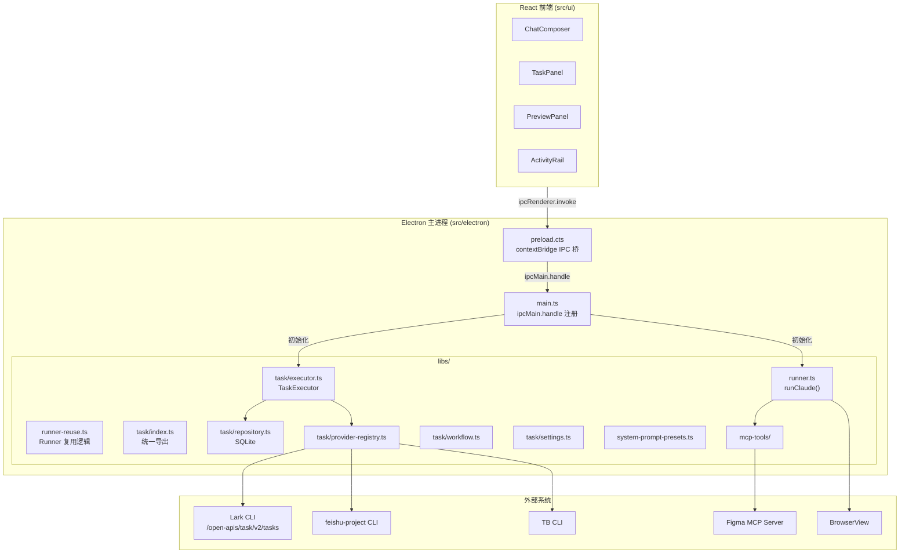
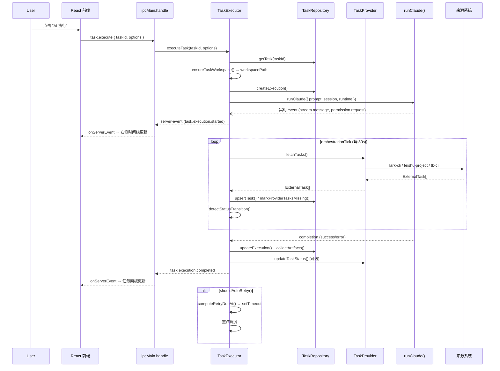

# 项目概述

<cite>
**本文引用的文件**
- [README.md](file://README.md)
- [doc/README.md](file://doc/README.md)
- [src/electron/libs/runner.ts](file://src/electron/libs/runner.ts)
- [src/electron/libs/runner-reuse.ts](file://src/electron/libs/runner-reuse.ts)
- [src/electron/main.ts](file://src/electron/main.ts)
- [src/electron/preload.cts](file://src/electron/preload.cts)
- [src/electron/libs/system-prompt-presets.ts](file://src/electron/libs/system-prompt-presets.ts)
- [src/electron/libs/task/README.md](file://src/electron/libs/task/README.md)
- [src/electron/libs/task/index.ts](file://src/electron/libs/task/index.ts)
- [src/electron/libs/task/executor.ts](file://src/electron/libs/task/executor.ts)
- [src/electron/libs/task/provider-registry.ts](file://src/electron/libs/task/provider-registry.ts)
- [src/electron/libs/task/providers/feishu-project-provider.ts](file://src/electron/libs/task/providers/feishu-project-provider.ts)
- [src/electron/libs/task/providers/lark-provider.ts](file://src/electron/libs/task/providers/lark-provider.ts)
- [src/electron/libs/task/providers/tb-provider.ts](file://src/electron/libs/task/providers/tb-provider.ts)
- [src/electron/libs/task/repository.ts](file://src/electron/libs/task/repository.ts)
- [src/electron/libs/task/settings.ts](file://src/electron/libs/task/settings.ts)
- [src/electron/libs/task/types.ts](file://src/electron/libs/task/types.ts)
- [src/electron/libs/task/workflow.ts](file://src/electron/libs/task/workflow.ts)
</cite>

# tech-cc-hub 项目概述

## 目录

- [产品定位](#产品定位)
- [核心能力](#核心能力)
- [目标用户场景](#目标用户场景)
- [系统架构概览](#系统架构概览)
- [关键模块详解](#关键模块详解)
- [任务系统执行流](#任务系统执行流)
- [IPC 与前后端桥接](#ipc-与前后端桥接)
- [配置与数据流](#配置与数据流)
- [排障速查](#排障速查)
- [Agent 改代码地图](#agent-改代码地图)

---

## 产品定位

tech-cc-hub 是一个基于 Electron 的 AI Agent 桌面工作台，将**会话管理**、**任务编排**、**浏览器工作台**、**模型路由**、**执行轨迹**和**复盘诊断**整合在同一个桌面应用中。

> 章节来源：[README.md#L11](file://README.md#L11)

它的目标不是做一个普通聊天框，而是让本地 Agent 能接任务、看网页、调用工具、写代码、留下日志，并把结果回写到来源系统。

### 技术选型依据

- **Electron**：提供桌面端能力（BrowserView 内置浏览器、文件系统访问、nativeImage 截图、系统快捷键）
- **Claude Agent SDK**：提供 runClaude() 核心运行时
- **SQLite (better-sqlite3)**：任务持久化（tasks、task_executions、task_execution_logs、task_subtasks、task_artifacts、task_dismissals 六张表）
- **MCP (Model Context Protocol)**：与外部系统（飞书、Figma、浏览器）集成

> 章节来源：[src/electron/libs/task/repository.ts#L32-L135](file://src/electron/libs/task/repository.ts#L32-L135)

---

## 核心能力

### 1. 会话与工作区管理

左侧按 workspace 管理会话；任务执行可绑定独立 workspace，避免污染当前聊天上下文。

**关键符号**：
- `src/electron/libs/session-store.js` — Session 存储
- `preload.cts` 中 `sendClientEvent()` / `onServerEvent()` — 会话 IPC 桥
- `RunnerHandle.appendPrompt()` — 会话追加 prompt（[runner.ts#L102](file://src/electron/libs/runner.ts#L102)）

### 2. 模型路由

支持主模型、专家模型、小模型、Prompt 分析模型、图片模型分层配置。解决后台小模型误打到不可用渠道的问题。

**关键符号**：
- `getRequestedModelName(configModel, runtimeModel)` — 解析请求模型名（[runner.ts#L187-L195](file://src/electron/libs/runner.ts#L187-L195)）
- `SKILL_ENV_HINTS` — Skill 到环境变量的映射（[runner.ts#L121-L134](file://src/electron/libs/runner.ts#L121-L134)）
- `getGlobalRuntimeConfig()` / `resolveApiConfigForModel()` — 配置读取

### 3. 内置浏览器工作台

右侧 BrowserView 支持打开页面、截图、DOM 摘要、样式检查、带图/不带图标注模式。

**关键符号**：
- `BrowserWorkbenchManager` — 浏览器生命周期管理（main.ts#L73）
- `setBrowserToolHost()` — MCP browser 工具主机设置（[main.ts#L39](file://src/electron/main.ts#L39)）
- `buildBrowserWorkbenchPromptAppend()` — 浏览器相关 system prompt 追加（[system-prompt-presets.ts#L12-L19](file://src/electron/libs/system-prompt-presets.ts#L12-L19)）

### 4. 任务编排系统

同步飞书/TB/飞书项目任务，本地持久化队列，支持重试、暂停、删除、执行记录、产物列表和状态回写。

**关键符号**：
- `TaskExecutor` — 唯一调度入口（[executor.ts#L89](file://src/electron/libs/task/executor.ts#L89)）
- `LarkTaskProvider` / `TbTaskProvider` / `FeishuProjectTaskProvider` — 三种外部任务源适配器
- `TaskRepository` — SQLite 持久化（[repository.ts#L22](file://src/electron/libs/task/repository.ts#L22)）

### 5. 插件与 MCP

内置 Browser、Design、Admin、Figma、Cron、Idea、Plan 七种 MCP Server，供 Agent 在执行中调用。

**关键符号**：
- `listBuiltinMcpToolNames()` — 列出内置 MCP 工具名（[runner.ts#L112](file://src/electron/libs/runner.ts#L112)）
- `isSdkBuiltinCronTool()` — 屏蔽 SDK 内置 cron 工具（[runner.ts#L158-L160](file://src/electron/libs/runner.ts#L158-L160)）
- 内置工具白名单：`ALWAYS_ALLOWED_TOOLS`（[runner.ts#L117-L120](file://src/electron/libs/runner.ts#L117-L120)）

### 6. 设计检查

支持截图语义分析、两图对比、diff/comparison 图、热点区域、JSON report 生成。

**关键符号**：
- `design_inspect_image` — 单图结构化视觉摘要（system-prompt-presets.ts）
- `design_compare_images` — 两图对比
- `design_capture_current_view` — BrowserView 截图落盘

---

## 目标用户场景

| 场景 | 描述 |
|------|------|
| **统一接入多模型** | 把 Claude Code / 兼容 OpenAI 网关 / 本地模型统一接到一个桌面工作台 |
| **飞书任务直连** | 让 Agent 直接处理飞书任务、拆子任务、开独立 workspace、执行并回写状态 |
| **执行轨迹观测** | 看清每轮执行用了什么模型、多少上下文、哪些工具、哪里失败 |
| **前端调试** | 用内置浏览器做截图标注、页面检查、设计对比和前端调试 |
| **定时任务编排** | 使用 tech-cc-hub cron MCP 工具（持久化存储、执行历史、重试机制）替代 SDK 内置 CronCreate/CronDelete/CronList |

> 章节来源：[README.md#L15-L20](file://README.md#L15-L20)

---

## 系统架构概览



> 图表来源：[src/electron/main.ts#L1-L97](file://src/electron/main.ts#L1-L97)，[executor.ts#L1-L30](file://src/electron/libs/task/executor.ts#L1-L30)

---

## 关键模块详解

### Runner 模块

**职责**：封装 Claude Agent SDK 的 `runClaude()` 调用，处理 System Prompt 拼接、MCP 工具过滤、权限请求、OAuth 流程。

**入口**：`runClaude(options: RunnerOptions)` — [runner.ts#L213](file://src/electron/libs/runner.ts#L213)

**核心符号**：
- `RunnerOptions.prompt` — 用户输入
- `RunnerOptions.session` — Session 对象（包含 pendingPermissions Map）
- `RunnerOptions.runtime` — RuntimeOverrides（model、permissionMode、reasoningMode 等）
- `RunnerHandle.abort()` / `RunnerHandle.appendPrompt()` — 控制接口

**关键流程**：
1. 构建 PromptInputQueue，enqueue 初始 prompt 和附件
2. 调用 `resolveRuntimeEfficiencyProfile()` 计算需要的内置 MCP Server
3. 按需 `setMcpServers()` 动态启停内置 MCP
4. 调用 SDK Query，捕获 tool_use 事件 → 通过 `requestPermissionDecision()` 等待用户确认
5. 处理 Figma OAuth 回调（`maybeRunFigmaGuideOAuth()`）
6. 执行结束后收集 usage、artifacts，写回 Repository

**MCP 工具过滤**：
- `buildEffectiveAllowedToolSet()` — 合并 ALWAYS_ALLOWED_TOOLS、runtime allowedTools、内置 MCP 工具名（[runner.ts#L828](file://src/electron/libs/runner.ts#L828)）
- `parseAllowedTools()` / `parseAllowedToolList()` — 解析 allowedTools 字符串
- SDK 内置 cron 工具被屏蔽：`isSdkBuiltinCronTool()` 返回 true 时跳过

**Runner 复用**：
- `buildRunnerReuseKey()` 生成描述符 JSON（[runner-reuse.ts#L29-L31](file://src/electron/libs/runner-reuse.ts#L29-L31)）
- `canReuseRunner()` 比较 existing 和 requested 描述符（[runner-reuse.ts#L33-L50](file://src/electron/libs/runner-reuse.ts#L33-L50)）
- 描述符包含：cwd、model、permissionMode、reasoningMode、outputFormat、runSurface、agentId、allowedTools、runtimeProfile、builtinMcpServers

### Task 系统

**三层架构**：

| 层 | 职责 | 关键文件 |
|----|------|---------|
| Provider 层 | 外部任务源适配器（飞书/TB/飞书项目） | `providers/*.ts` |
| Repository 层 | SQLite 持久化 | `repository.ts` |
| Executor 层 | 唯一调度入口 | `executor.ts` |

> 章节来源：[src/electron/libs/task/README.md](file://src/electron/libs/task/README.md)

**TaskProvider 接口**（[types.ts#L229-L240](file://src/electron/libs/task/types.ts#L229-L240)）：
```typescript
interface TaskProvider {
  readonly id: TaskProviderId;  // "lark" | "tb" | "feishu-project"
  readonly name: string;
  isEnabled?(): boolean;
  getCapabilities?(): TaskProviderCapability[];
  fetchTasks(): Promise<ExternalTask[]>;
  getTask(externalId: string): Promise<ExternalTask | null>;
  updateTaskStatus(externalId: string, status: ExternalTaskStatus): Promise<void>;
  appendTaskComment?(externalId: string, text: string): Promise<void>;
  deleteTask?(externalId: string): Promise<void>;
  validateConfig(): Promise<{ valid: boolean; error?: string }>;
}
```

**Provider 注册表**（[provider-registry.ts#L1-L72](file://src/electron/libs/task/provider-registry.ts#L1-L72)）：
- `registry: Map<TaskProviderId, TaskProvider>` — 内存注册表
- `registerTaskProvider(provider)` — 注册
- `ensureProvider(id)` — 不存在时返回 NoopProvider fallback
- `listTaskProviderStates()` — 返回所有 Provider 状态（含 enabled、valid、capabilities）

**LarkTaskProvider 细节**（[lark-provider.ts#L157-L348](file://src/electron/libs/task/providers/lark-provider.ts#L157-L348)）：
- CLI 命令：`lark-cli api GET /open-apis/task/v2/tasks --params '{"type":"my_tasks","completed":false,"page_size":100}' --as user --page-all`
- 同步窗口：最近 30 天（`RECENT_SYNC_WINDOW_MS = 30 * 24 * 60 * 60 * 1000`）
- 错误处理：`need_user_authorization` 时提示用户运行 `lark-cli auth login --domain task`

**FeishuProjectTaskProvider 细节**（[feishu-project-provider.ts#L111-L231](file://src/electron/libs/task/providers/feishu-project-provider.ts#L111-L231)）：
- 配置读取：`resolveFeishuProjectConfig()` 从 `rootConfig.feishuProject` 和 `envConfig.FEISHU_PROJECT_*` 读取
- CLI 命令：`feishu-project list-items --type {workItemType} --format json`
- 状态映射：`mapFeishuStatus()` / `mapFeishuPriority()`

**TbTaskProvider 细节**（[tb-provider.ts#L24-L106](file://src/electron/libs/task/providers/tb-provider.ts#L24-L106)）：
- 配置来源：`loadTaskSettings()` 返回的 `tbCliCommand`、`tbFetchArgsTemplate`、`tbUpdateArgsTemplate`、`tbCommentArgsTemplate`
- 参数模板：`{{externalId}}`、`{{status}}`、`{{text}}` 占位符，通过 `renderTemplate()` 替换

### Repository 层

**SQLite 表结构**（[repository.ts#L32-L135](file://src/electron/libs/task/repository.ts#L32-L135)）：

```sql
CREATE TABLE tasks (
  id TEXT PRIMARY KEY,
  external_id TEXT NOT NULL,
  provider TEXT NOT NULL,
  local_status TEXT NOT NULL DEFAULT 'pending',
  claim_state TEXT NOT NULL DEFAULT 'unclaimed',
  retry_attempt INTEGER NOT NULL DEFAULT 0,
  retry_due_at INTEGER,
  workspace_path TEXT,
  driver_id TEXT,
  model TEXT,
  reasoning_mode TEXT,
  -- ... 其他字段
  UNIQUE(external_id, provider)
);

CREATE TABLE task_executions (
  id TEXT PRIMARY KEY,
  task_id TEXT NOT NULL REFERENCES tasks(id),
  session_id TEXT NOT NULL,
  status TEXT NOT NULL DEFAULT 'running',
  attempt INTEGER NOT NULL DEFAULT 0,
  input_tokens INTEGER NOT NULL DEFAULT 0,
  output_tokens INTEGER NOT NULL DEFAULT 0,
  estimated_cost_usd REAL NOT NULL DEFAULT 0
);

CREATE TABLE task_execution_logs;
CREATE TABLE task_subtasks;
CREATE TABLE task_artifacts;
CREATE TABLE task_dismissals;  -- 用于忽略来源已删除的任务
```

**Schema 迁移**：`resetTaskTablesIfOutdated()` 检查 tasks 表是否包含 claim_state、retry_attempt 等新字段，若缺失则 DROP 并重建（[repository.ts#L138-L182](file://src/electron/libs/task/repository.ts#L138-L182)）

---

## 任务系统执行流



> 图表来源：[executor.ts#L201-L210](file://src/electron/libs/task/executor.ts#L201-L210)，[workflow.ts#L75-L78](file://src/electron/libs/task/workflow.ts#L75-L78)

**Executor 关键参数**：
- `DEFAULT_EXECUTION_TIMEOUT_MS = 30 * 60 * 1000` — 执行超时 30 分钟
- `DEFER_RETRY_MS = 5000` — 重试延迟 5 秒
- `MAX_ARTIFACTS = 80` — 最大产物数
- `DEFAULT_STALL_TIMEOUT_MS = 5 * 60 * 1000` — 无事件 5 分钟视为卡住

**恢复机制**：
- `startPolling()` 时调用 `recoverInterruptedExecutions()` 恢复中断执行（[executor.ts#L183](file://src/electron/libs/task/executor.ts#L183)）
- `restoreRetryTimers()` 恢复 pending 重试（[executor.ts#L184](file://src/electron/libs/task/executor.ts#L184)）
- 中断错误消息：`"应用已重启，上一轮任务执行进程已中断。"`（[executor.ts#L84](file://src/electron/libs/task/executor.ts#L84)）

---

## IPC 与前后端桥接

**Preload 暴露的 API**（[preload.cts#L3-L205](file://src/electron/preload.cts#L3-L205)）：

| API | 用途 |
|-----|------|
| `sendClientEvent(event)` | 前端 → 主进程（触发 Agent 执行） |
| `onServerEvent(callback)` | 主进程 → 前端（实时推送执行事件） |
| `invoke(channel, ...args)` | 通用 IPC 调用 |
| `onBrowserWorkbenchEvent(callback)` | 浏览器事件推送 |
| `onCronJobCreated/Updated/Removed/Executed(callback)` | Cron 事件推送 |

**main.ts 注册的 IPC handlers**：

```
preview-list-directory  → 列出目录
preview-list-files      → 列出文件
sessions:list           → 列出会话
slash-commands:list     → 列出斜线命令
plugins:getOpenComputerUseStatus → Open Computer Use 状态
plugins:installOpenComputerUse   → 安装 Open Computer Use
plugins:checkOpenComputerUseUpdate → 检查更新
plugins:getFigmaOfficialStatus    → Figma 官方插件状态
plugins:installFigmaOfficial      → 安装 Figma 插件
plugins:connectFigmaOfficial      → 连接 Figma
plugins:connectFigmaCodexOfficial → 连接 Figma Codex
```

> 章节来源：[main.ts runtime signals](file://src/electron/main.ts#Lruntime-signals)

**前后端通信契约**：

ServerEvent 类型（[types.ts#L202-L214](file://src/electron/libs/task/types.ts#L202-L214)）：
```typescript
type TaskServerEvent =
  | { type: "task.list"; payload: { tasks: StoredTask[] } }
  | { type: "task.updated"; payload: { task: StoredTask } }
  | { type: "task.execution.started"; payload: { execution: TaskExecution } }
  | { type: "task.execution.completed"; payload: { execution: TaskExecution } }
  | { type: "task.execution.log"; payload: { log: TaskExecutionLog } }
  | { type: "task.stats"; payload: { stats: TaskStats } }
  | { type: "stream.message"; payload: { sessionId, message } }
  | { type: "permission.request"; payload: { sessionId, toolUseId, toolName, input } };
```

**Source-of-truth 边界**：
- 任务状态：`TaskRepository`（SQLite）是 source-of-truth
- 全局配置：`loadGlobalRuntimeConfig()` → `agent-runtime.json`
- Session 状态：`SessionStore`（内存 + 持久化）
- Runner 运行时：`runClaude()` SDK 内部，外部通过 `RunnerHandle` 控制

---

## 配置与数据流

### 模型槽位配置

| 槽位 | 用途 | 配置路径 |
|------|------|---------|
| 默认主模型 | 普通聊天和任务执行 | `apiConfig.model` |
| 专家模型 | 复杂问题兜底 | `apiConfig.expertModel` |
| 小模型/后台模型 | Haiku / small-fast 后台调用 | `apiConfig.smallModel` |
| Prompt 分析模型 | 执行复盘、上下文诊断 | `apiConfig.promptAnalyzerModel` |
| 图片预处理模型 | 读图、OCR、截图语义分析 | `resolveImagePreprocessApiConfig()` |

> 章节来源：[main.ts#L44](file://src/electron/main.ts#L44)，[runner.ts#L187-L195](file://src/electron/libs/runner.ts#L187-L195)

### Workflow 配置

`TASK_WORKFLOW.md` 或 `WORKFLOW.md` 文件格式（[workflow.ts#L51-L73](file://src/electron/libs/task/workflow.ts#L51-L73)）：

```yaml
---
polling:
  interval_ms: 30000
agent:
  max_concurrent_agents: 1
  max_auto_retries: 2
  max_retry_backoff_ms: 300000
  stall_timeout_ms: 300000
workspace:
  root: ./task-workspaces
hooks:
  timeout_ms: 30000
---
[可选的 prompt template]
```

### 任务设置持久化

`loadTaskSettings()` / `saveTaskSettings()` 读写 `agent-runtime.json` 的 `tasks` 字段（[settings.ts#L27-L42](file://src/electron/libs/task/settings.ts#L27-L42)）。

TB Provider 参数模板配置（[settings.ts#L20-L23](file://src/electron/libs/task/settings.ts#L20-L23)）：
```typescript
tbCliCommand: "",        // TB CLI 路径
tbFetchArgsTemplate: "",  // 拉取参数模板
tbUpdateArgsTemplate: "", // 状态更新参数模板
tbCommentArgsTemplate: "", // 评论参数模板
```

---

## 排障速查

| 现象 | 优先检查 |
|------|---------|
| `503 No available channel for model claude-haiku-4-5-20251001` | 设置页「小模型/后台模型」是否填了当前网关真实可用模型 |
| `API Error: Unable to connect to API (ConnectionRefused)` | 网关或本地模型桥是否在监听；Docker 内访问宿主机时用 `host.docker.internal` |
| 图片工具返回「图片预处理失败」 | 图片预处理模型是否是可读图模型；本地 VLM bridge 和 `new-api` channel 是否健康 |
| 飞书任务同步不到 | Lark CLI 是否已登录；应用权限是否包含 `task:task:read`、`task:task:write`、`task:tasklist:read` |
| 任务一直「执行中」 | 查看任务详情右侧时间线；重启后 Executor 会按 workflow 配置恢复或重试卡住执行 |
| 右侧浏览器浮在主界面 | 优先检查 BrowserView 销毁和当前页面路由，不要简单禁用右侧浏览器入口 |
| `need_user_authorization` | lark-cli 已配置 App，但还没有用户授权。运行 `lark-cli auth login --domain task` |
| `feishu-project CLI 不可用` | 检查 `FEISHU_PROJECT_CLI` 环境变量或 `rootConfig.feishuProject.cliCommand` 配置 |
| TB 任务拉取失败 | 检查 `tbCliCommand` 和 `tbFetchArgsTemplate` 是否正确配置 |

> 章节来源：[README.md#L177-L187](file://README.md#L177-L187)

---

## Agent 改代码地图

### 修改入口速查

| 场景 | 先读文件 | 关键符号 | 修改入口 |
|------|---------|---------|---------|
| 添加新任务源 Provider | `provider-registry.ts`、`types.ts` | `TaskProvider` 接口、`registerTaskProvider()` | 在 `providers/` 新建 `xxx-provider.ts`，在 `index.ts` export 并在 `main.ts` 初始化时 register |
| 修改 Runner 行为 | `runner.ts` | `runClaude()`、`RunnerOptions`、`buildEffectiveAllowedToolSet()` | 直接修改 `runClaude()` 内逻辑，或在 `system-prompt-presets.ts` 新增 preset |
| 修改任务执行流程 | `executor.ts`、`workflow.ts` | `TaskExecutor.executeTask()`、`computeRetryDueAt()` | 在 `TaskExecutor` 类内修改，或调整 workflow config |
| 修改 SQLite Schema | `repository.ts` | `initialize()`、`resetTaskTablesIfOutdated()` | 修改 `CREATE TABLE` 语句，Schema 版本检测在 `hasTasksColumns()` / `hasExecutionColumns()` |
| 添加 IPC Channel | `preload.cts`、`main.ts` | `ipcMain.handle()`、preload `invoke()` | 在 `main.ts` 新增 handler，在 `preload.cts` expose 到 window.electron |
| 修改配置读写 | `settings.ts`、`config-store.ts` | `loadTaskSettings()`、`saveGlobalRuntimeConfig()` | 修改对应函数的读写路径和字段名 |
| 添加 MCP 工具 | `libs/mcp-tools/`、`runner.ts` | `isSdkBuiltinCronTool()`、`listBuiltinMcpToolNames()` | 在对应 MCP server 目录实现工具，在 `builtin-mcp-registry.js` 注册 |

### 验证命令

```bash
# 开发启动
npm run dev

# Electron 冒烟测试
npm run qa:smoke

# 聊天 UI 冒烟
npm run qa:chat-ui

# 预览工作台冒烟
npm run qa:preview

# 列出可截图窗口
npm run qa:window:list

# 捕获窗口截图
npm run qa:window:capture -- <windowId> <output.png>

# 构建
npm run build

# TypeScript 编译 Electron 主进程
npm run transpile:electron

# 打包 macOS
npm run package:mac

# 打包 Windows
npm run package:win
```

> 章节来源：[README.md#L138-L155](file://README.md#L138-L155)

### 常见回归风险

| 风险 | 原因 | 缓解措施 |
|------|------|---------|
| Schema 不兼容 | `resetTaskTablesIfOutdated()` 会 DROP 旧表重建 | 修改 schema 时保留旧列或提供迁移脚本 |
| Runner 复用键变化 | `buildRunnerReuseDescriptor()` 字段不全导致误复用 | `canReuseRunner()` 严格比较所有字段，新增字段必须加入比较 |
| 小模型打到不可用渠道 | `smallModel` 配置未填或填错 | 启动时检查配置，503 报错时提示检查小模型槽位 |
| 任务中断后重复执行 | `recoverInterruptedExecutions()` 未正确恢复 | 检查 `runningExecutions` Map 和 `INTERRUPTED_EXECUTION_ERROR` 处理 |
| Provider fallback 误用 | `ensureProvider()` 对未注册 provider 返回 NoopProvider | 明确区分「未配置」和「不存在」状态 |
| Figma OAuth 配置丢失 | `shouldPreserveReadyFigmaOfficialConfigAfterCodexError()` 逻辑错误 | 测试 Figma + Codex 组合场景 |

### 测试入口

- `scripts/qa/` 目录下冒烟测试脚本
- `src/electron/test.js` — 静态数据获取和轮询资源
- `doc/80-operations/electron-client-qa-runbook.md` — Electron QA Runbook

---

## 文档索引

更多详细规格请参考：

| 文档 | 说明 |
|------|------|
| [doc/README.md](file://doc/README.md) | 文档总索引 |
| [CLAUDE.md](file://CLAUDE.md) | 开发环境、命令、编码规范 |
| [src/electron/libs/task/README.md](file://src/electron/libs/task/README.md) | 任务系统主进程边界 |
| [doc/40-engineering/INDEX.md](file://doc/40-engineering/INDEX.md) | 模块地图、组件入口、代码路径 |
| [doc/20-contracts/INDEX.md](file://doc/20-contracts/INDEX.md) | IPC、事件、状态机、数据模型契约 |
| [doc/80-operations/electron-client-qa-runbook.md](file://doc/80-operations/electron-client-qa-runbook.md) | Electron QA Runbook |