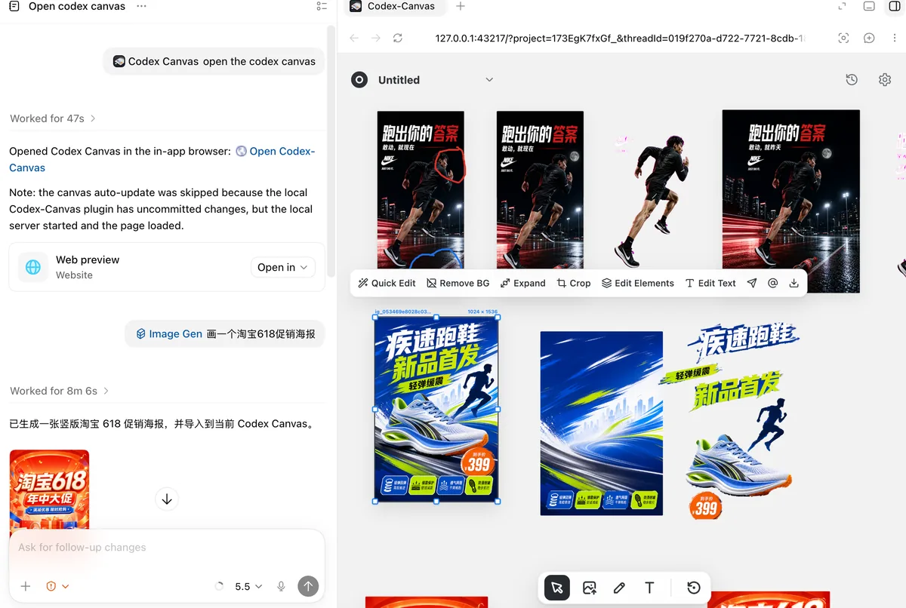
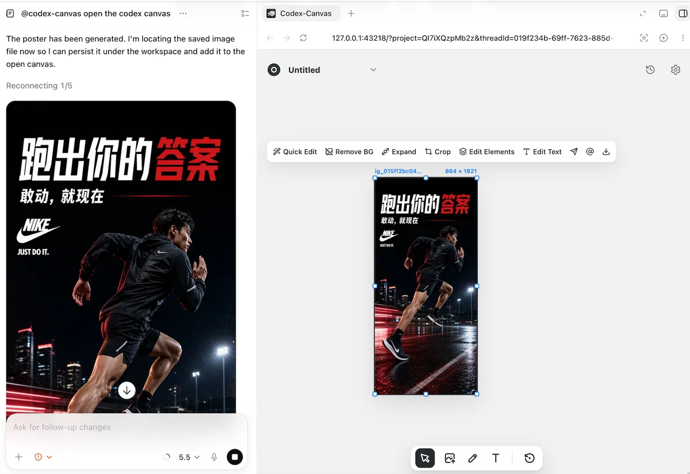
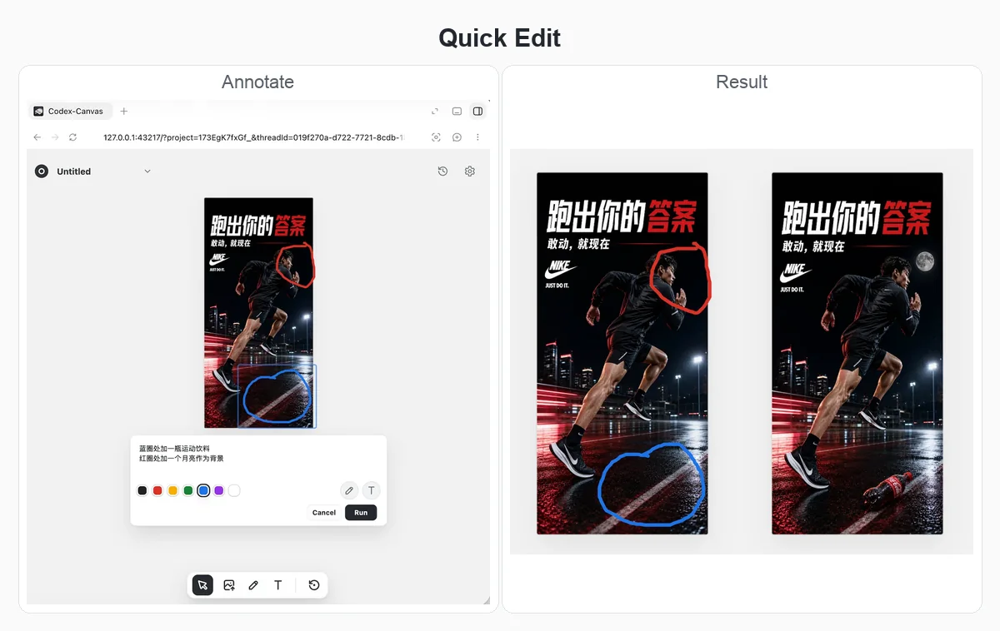
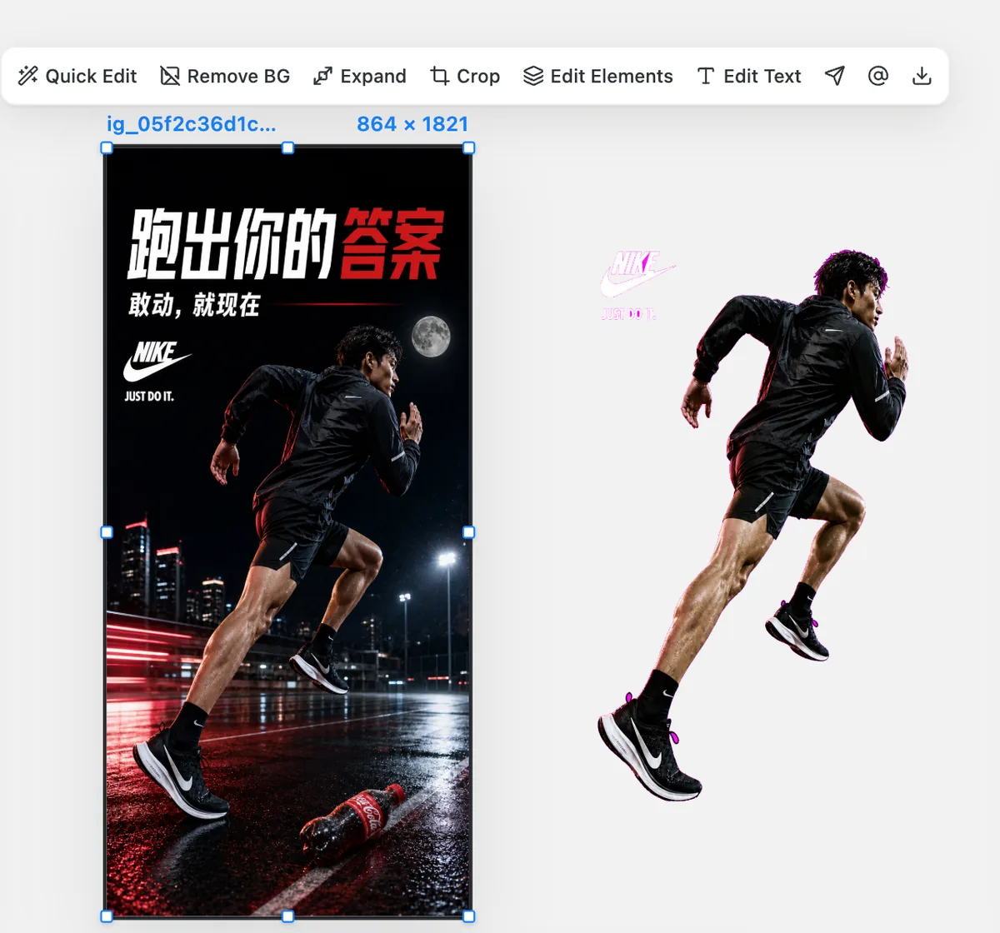
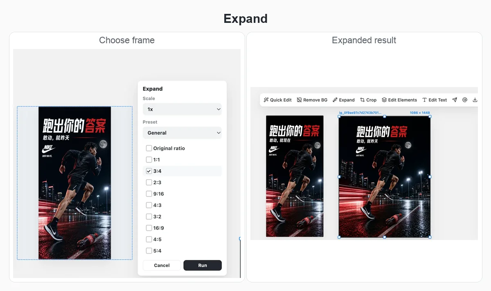

# Codex-Canvas

[中文](README.md) | [English](README.en.md) | [日本語](README.ja.md)

Codex-Canvas is an infinite canvas plugin for Codex. It requires no API setup and uses Codex's built-in GPT-image-2 workflow to edit images on a local canvas. It opens directly inside Codex, collects generated images into the current project, and lets you organize, annotate, edit, compare, and reuse visual assets.

It brings a Lovart-like workflow to Codex: chat on one side, canvas on the other, with powerful image editing tools designed around the same creative loop.

<p align="center">
  
</p>

## Installation

Copy this prompt into Codex:

```text
Please install Codex-Canvas according to https://github.com/Xiangyu-CAS/codex-canvas.git and its INSTALL.md.
After installation, tell the user to start a new Codex task and type `@Codex-Canvas open the codex canvas`.
```

See the full installation guide in [`INSTALL.md`](INSTALL.md).

Stable versions ship through GitHub Releases. **Settings → Version** only installs a `vX.Y.Z` release after its assets are complete and its manifest matches the tag, never unreleased commits from `main`. The old server exits after an update; reopen the canvas and start a new Codex task.

After installation, start a new Codex task and open the canvas:

```text
@Codex-Canvas open the codex canvas
```

## Roadmap

- [x] GPT-image-2 powered image editing
- [ ] Editable PPT generation and export
- [ ] draw.io flowchart generation and editing

## Highlights

### 1. Open a canvas and collect generated images automatically

Type `@Codex-Canvas open the codex canvas` in your current Codex conversation, and Codex-Canvas opens a local project canvas in the in-app browser. Keep chatting on the left while managing visual assets on the right. Once bound, Codex-Canvas collects only that thread's outputs from `~/.codex/generated_images/<thread-id>`; it does not scan other projects, other threads, or the whole project directory. Results are persisted into that thread's canvas.

<p align="center">
  
</p>

### 2. Quick Edit: mark what you want changed

Quick Edit lets you annotate the selected image directly. Brush marks, colors, and text instructions are passed to the model as editing references, making it useful for local replacements, adding objects, and preserving the main layout while refining details.

<p align="center">
  
</p>

### 3. Edit Elements: separate layers and rearrange them

Edit Elements separates an image into movable layers such as background, text, products, people, and price tags. You can rearrange those layers on the canvas, while Codex-Canvas can continue completing the background that was hidden behind foreground objects. Downloading any layer from an Edit Elements group exports the whole group as a PSD, with each canvas layer mapped to a Photoshop layer for further editing in tools like Photoshop or Photopea.

<p align="center">
  
</p>

### 4. Edit Text: recognize and rewrite text in images

Edit Text recognizes text in the image and lists it as editable fields. You can revise individual lines while asking the model to preserve the original typography, layout relationships, and visual tone.

<p align="center">
  
</p>

### 5. Remove BG: remove backgrounds in one step

For posters, portraits, product shots, and other assets, Codex-Canvas can create a transparent-background result directly on the canvas. The result stays in the same project canvas, ready for composition, layout, or reuse in Codex.

<p align="center">
  
</p>

### 6. Expand: outpaint to a new aspect ratio

Expand provides a visual expansion frame and common aspect-ratio presets such as 1:1, 3:4, 16:9, and 9:16. Choose the target canvas first, then let the model complete the surrounding image content.

<p align="center">
  
</p>

## Features

- Opens a local infinite canvas in Codex's in-app browser.
- Automatically collects Codex/ImageGen outputs into the bound thread canvas without leaking outputs from other projects or conversations.
- Supports uploading, importing, arranging, selecting, dragging, deleting, and downloading canvas images.
- Supports brush annotations and temporary text labels on selected images.
- Supports Quick Edit, passing annotation colors and text labels to the model as editing references.
- Supports background removal.
- Supports Expand/outpaint with an adjustable expansion preview frame.
- Supports Edit Text; local OCR is used first when available, with Codex vision fallback when needed.
- Supports Edit Elements, separating images into foreground object/text layers and a background layer.
- Supports background completion for Edit Elements and replaces the background layer in place.
- Supports downloading Edit Elements layer groups as PSD files, with each canvas layer mapped to a Photoshop layer.
- Supports prompt history and generated-version groups.
- Keeps separate canvases for different Codex conversations to avoid mixing contexts.
- Supports copying a selected image as an `@file` reference and pasting it back into Codex chat.

## Usage Notes

Codex-Canvas stores canvas data in the current project's `canvas/` directory. Generated assets, job logs, and intermediate files stay local to the project.

`Send to chat` is currently a prototype path through the Codex app-server. It can submit at the protocol layer, but it may not always appear in the currently visible Codex desktop chat UI. The more reliable workflow is to use `Copy @file`, then paste that reference into the current Codex chat box.

## Development

Common local commands:

```bash
npm install
npm test
node ./bin/codex-canvas.mjs open --project .
```

Related docs:

- [`INSTALL.md`](INSTALL.md): installation guide and optional local dependencies.
- [`docs/RELEASING.md`](docs/RELEASING.md): versioning, Release PR, tag, and artifact workflow.
- [`docs/CANVAS_TO_CHAT.md`](docs/CANVAS_TO_CHAT.md): current canvas-to-chat validation results and limitations.

## Credits

Thanks to [Cowart](https://github.com/zhongerxin/Cowart) for the canvas concept.
