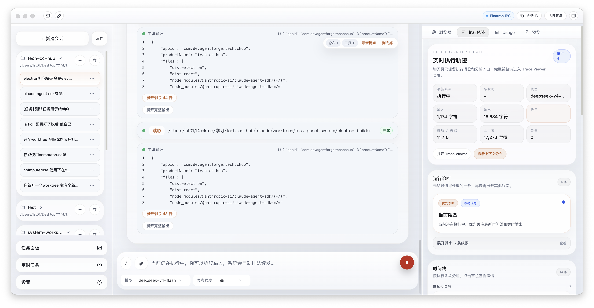
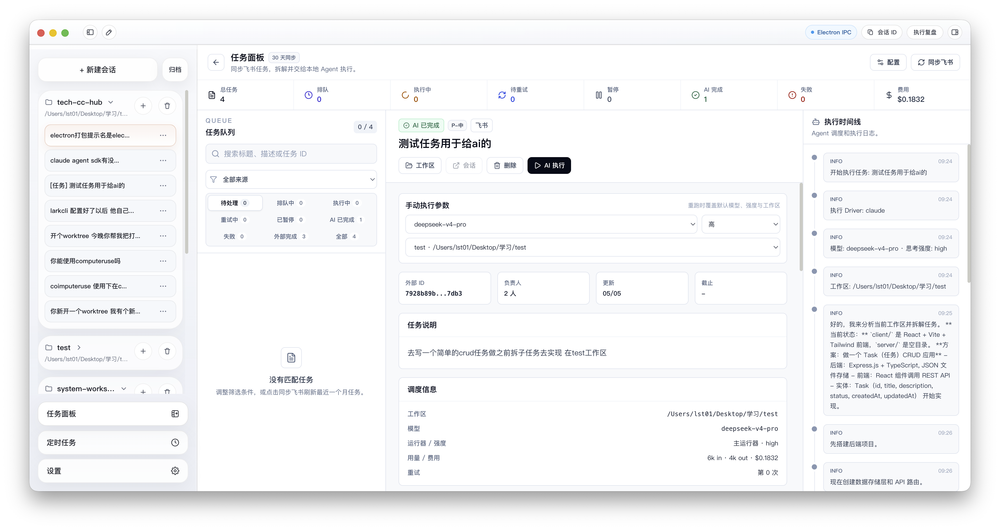
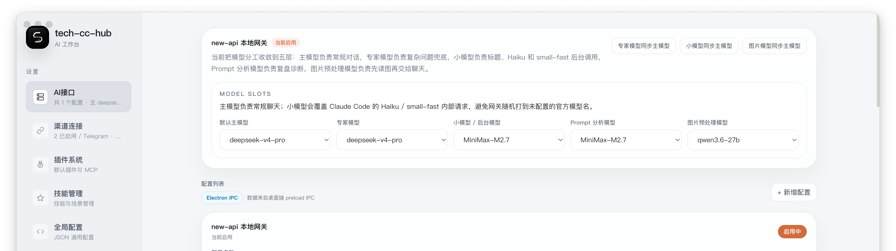
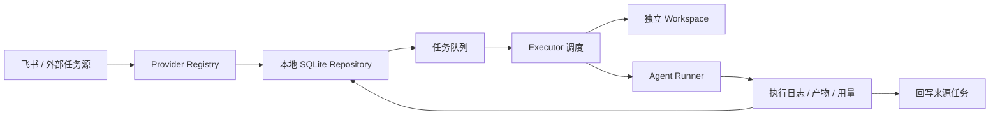

# tech-cc-hub

tech-cc-hub 是一个桌面端 Agent 工作台，把会话、任务、浏览器、模型路由、执行轨迹和复盘诊断收在同一个 Electron 应用里。它的目标不是再做一个普通聊天框，而是让本地 Agent 能接任务、看网页、调用工具、写代码、留下日志，并把结果回写到来源系统。



## 适合谁用

- 想把 Claude Code / 兼容 OpenAI 网关 / 本地模型统一接到一个桌面工作台里。
- 想让 Agent 直接处理飞书任务、拆子任务、开独立 workspace、执行并回写状态。
- 想看清楚每轮执行用了什么模型、多少上下文、哪些工具、哪里失败。
- 想用内置浏览器做截图标注、页面检查、设计对比和前端调试。

## 界面速览

| 区域 | 用来做什么 |
| --- | --- |
| 主工作台 | 日常聊天、附件、Slash 命令、模型切换、右侧执行轨迹和 Usage 观察。 |
| 任务面板 | 同步最近 30 天飞书任务，按状态筛选，选择模型和工作区后交给 Agent 执行。 |
| 设置页 | 配置兼容网关、主模型、专家模型、小模型、Prompt 分析模型和图片预处理模型。 |





## 快速启动

环境建议：

- Node.js 20+。
- npm 可用；部分打包脚本会调用 Bun，做正式包前建议也安装 Bun。
- 本地或远程有一个 OpenAI-compatible / Anthropic-compatible 网关，例如 `new-api`。

安装依赖：

```bash
npm install
```

开发启动：

```bash
npm run dev
```

构建前端与类型：

```bash
npm run build
```

如果 Electron 原生依赖异常，先重建：

```bash
npm run rebuild
```

## 第一次使用

1. 打开 `设置 -> AI接口`，新增或启用一个兼容网关。
2. 填写接口地址，例如 `http://localhost:5337/v1`，API Key 使用你自己的网关密钥。
3. 点击“从接口拉取模型”，或手动添加模型名。
4. 在 `MODEL SLOTS` 里设置五类模型：
   - 默认主模型：普通聊天和任务执行默认使用。
   - 专家模型：复杂问题兜底。
   - 小模型 / 后台模型：标题、摘要、Haiku / small-fast 这类后台调用优先走它。
   - Prompt 分析模型：执行复盘、上下文诊断。
   - 图片预处理模型：读图、OCR、截图语义分析。
5. 回到聊天页，新建会话后直接输入任务，或用附件、Slash 命令、右侧浏览器辅助处理。
6. 进入任务面板后，可以同步飞书任务，选中任务并点击 `AI 执行`。

## 核心能力

| 能力 | 说明 |
| --- | --- |
| 会话与工作区 | 左侧按 workspace 管理会话；任务执行可绑定独立 workspace，避免污染当前聊天上下文。 |
| 模型路由 | 支持主模型、专家模型、小模型、Prompt 分析模型、图片模型分层配置，解决后台小模型误打到不可用渠道的问题。 |
| 内置浏览器 | 右侧 BrowserView 支持打开页面、截图、DOM 摘要、样式检查、带图/不带图标注模式。 |
| 执行轨迹 | 聊天右侧展示实时统计、诊断和时间线；完整链路可进入 Trace Viewer。 |
| 任务系统 | 同步飞书任务，本地持久化队列，支持重试、暂停、删除、执行记录、产物列表和状态回写。 |
| 插件与 MCP | 内置浏览器、设计检查、受控配置写入等 MCP 工具，供 Agent 在执行中调用。 |
| 设计检查 | 支持截图语义分析、BrowserView 截图落盘、两图对比、diff 和 comparison 图生成。 |

## 任务系统原理

任务模块集中在 `src/electron/libs/task/`。外部任务源只负责映射数据，本地 Repository 负责持久化，Executor 是唯一调度入口。



默认行为：

- `同步飞书` 拉取最近 30 天任务，状态变化会合并到本地队列。
- 任务可以手动执行，也可以在配置允许时自动执行。
- 每个任务拥有独立 workspace，可以覆盖模型、强度、运行器和工作区。
- App 重启后，Executor 会恢复本地任务状态，对卡住的执行做恢复或重试判定。
- 删除按钮只删除本地任务面板记录，不删除飞书原始任务。

## 配置参考

本地 `new-api` 常见配置：

```text
Base URL: http://localhost:5337/v1
API Key: sk-你的本地网关密钥
默认主模型: deepseek-v4-pro
小模型 / 后台模型: MiniMax-M2.7
图片预处理模型: qwen3.6-27b
```

如果你看到类似下面的报错：

```text
503 No available channel for model claude-haiku-4-5-20251001
```

优先检查 `小模型 / 后台模型` 是否配置成当前网关里真实可用的模型。这个槽位会覆盖 Claude Code 内部的小模型请求，避免请求落到未配置的官方模型名。

## 常用命令

| 命令 | 作用 |
| --- | --- |
| `npm run dev` | 同时启动 Vite 和 Electron 开发环境。 |
| `npm run dev:react` | 只启动前端 Vite。 |
| `npm run dev:electron` | 转译 Electron 主进程并启动桌面端。 |
| `npm run build` | TypeScript project build + Vite build。 |
| `npm run lint` | ESLint 检查。 |
| `npm run transpile:electron` | 只编译 Electron 主进程代码。 |
| `npm run qa:smoke` | 启动 Electron 并跑最小聊天冒烟。 |
| `npm run qa:chat-ui` | 聊天 UI 冒烟测试。 |
| `npm run qa:preview` | 预览工作台冒烟测试。 |
| `npm run qa:window:list` | 列出可截图窗口 ID。 |
| `npm run qa:window:capture -- <windowId> <output.png>` | 捕获真实应用窗口截图。 |
| `npm run package:mac` | 打 macOS zip 包。 |
| `npm run package:win` | 通过安全脚本打 Windows 包。 |
| `npm run dist:linux` | 打 Linux 包。 |

## 目录结构

```text
.
├── src/
│   ├── electron/
│   │   ├── main.ts                # Electron 主进程入口
│   │   ├── preload.ts             # preload IPC 桥
│   │   └── libs/
│   │       ├── task/              # 任务系统：provider、repository、workflow、executor
│   │       └── mcp-tools/         # 内置 MCP 工具：browser、design、admin
│   └── ui/                        # React 前端
├── scripts/
│   ├── dev.mjs                    # 开发启动编排
│   └── qa/                        # Electron / UI 冒烟和窗口截图工具
├── doc/                           # 设计、研发、运维文档
├── doc/assets/readme/             # README 使用的真实应用截图
├── electron-builder.json          # 桌面端打包配置
└── package.json
```

## 排障速查

| 现象 | 优先检查 |
| --- | --- |
| `API Error: Unable to connect to API (ConnectionRefused)` | 网关或本地模型桥是否在监听；Docker 内访问宿主机时通常用 `host.docker.internal`。 |
| `No available channel for model claude-haiku...` | 设置页的小模型 / 后台模型是否填了当前网关真实可用模型。 |
| 图片工具返回 `图片预处理失败` | 图片预处理模型是否是可读图模型；本地 VLM bridge 和 `new-api` channel 是否健康。 |
| 飞书任务同步不到 | Lark CLI 是否已登录；应用权限是否包含 `task:task:read`、`task:task:write`、`task:tasklist:read`。 |
| 任务一直执行中 | 查看任务详情右侧时间线；重启后 Executor 会按 workflow 配置恢复或重试卡住执行。 |
| 右侧浏览器浮在主界面 | 优先检查 BrowserView 销毁和当前页面路由，不要简单禁用右侧浏览器入口。 |

## 文档入口

- [doc/README.md](doc/README.md)：文档总索引。
- [DESIGN.md](DESIGN.md)：产品结构与设计说明。
- [src/electron/libs/task/README.md](src/electron/libs/task/README.md)：任务系统主进程边界。
- [src/electron/libs/mcp-tools/README.md](src/electron/libs/mcp-tools/README.md)：内置 MCP 工具边界。

## License

MIT
