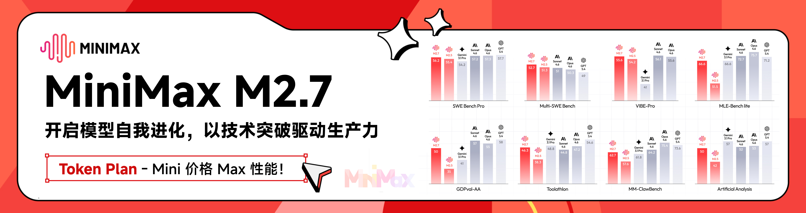

<div align="center">

# Open Claude Cowork

[](https://github.com/DevAgentForge/Claude-Cowork/releases)
[](https://github.com/DevAgentForge/Claude-Cowork/releases)

[英文](README.md)

</div>

## ❤️ 合作

[](https://platform.minimaxi.com/subscribe/coding-plan?code=6uFnRx7O0W&source=link)

MiniMax M2.7 是 MiniMax 首个深度参与自我迭代的模型，可自主构建复杂 Agent Harness，并基于 Agent Teams、复杂 Skills、Tool Search Tool 等能力完成高复杂度生产力任务；其在软件工程、端到端项目交付及办公场景中表现优异，多项评测接近行业领先水平，同时具备稳定的复杂任务执行、环境交互能力以及良好的情商与身份保持能力。

[点击](https://platform.minimaxi.com/subscribe/coding-plan?code=6uFnRx7O0W&source=link) 此处享 MiniMax Token plan 专属 88 折优惠！


## 关于

一个**桌面 AI 助手**，帮助你完成**编程、文件管理以及任何你能描述的任务**，  

强行兼容**Claude Code 完全相同的配置**，这意味着你可以使用任意兼容 Anthropic 的大模型来运行。

> 不只是一个 GUI。  
> 是真正的 AI 协作伙伴。  
> 无需学习 Claude Agent SDK，使用该软件创建任务并选择任务路径即可。

一个整理本地文件夹的例子：

[https://github.com/user-attachments/assets/694430fb-9d4b-452e-8429-d9c565082f43](https://github.com/user-attachments/assets/8ce58c8b-4024-4c01-82ee-f8d8ed6d4bba)


## 🚀 快速开始


### 方式一：下载安装包


👉 [前往 Releases 下载](https://github.com/DevAgentForge/agent-cowork/releases)


### 方式二：从源码构建

#### 前置要求

- [Bun](https://bun.sh/) 或 Node.js 18+
- [Claude Code](https://docs.anthropic.com/en/docs/claude-code) 已安装并完成认证

```bash
# 克隆仓库
git clone https://github.com/DevAgentForge/agent-cowork.git
cd agent-cowork

# 安装依赖
bun install

# 开发模式运行
bun run dev

# 或构建生产版本
bun run dist:mac-arm64    # macOS Apple Silicon (M1/M2/M3)
bun run dist:mac-x64      # macOS Intel
bun run dist:win          # Windows
bun run dist:linux        # Linux
```

## 🧠 核心能力

### 🤖 AI 协作伙伴 — 不只是 GUI

Agent Cowork 是你的 AI 协作伙伴，可以：

* **编写和编辑代码** — 支持任何编程语言
* **管理文件** — 创建、移动、整理
* **运行命令** — 构建、测试、部署
* **回答问题** — 关于你的代码库
* **做任何事** — 只要你能用自然语言描述


### 📂 会话管理

* 创建会话并指定**自定义工作目录**
* 恢复任何之前的对话
* 完整的本地会话历史（SQLite 存储）
* 安全删除和自动持久化

### 🎯 实时流式输出

* **逐字流式输出**
* 查看 Claude 的思考过程
* Markdown + 语法高亮代码渲染
* 工具调用可视化及状态指示


### 🔐 工具权限控制

* 敏感操作需要明确批准
* 按工具允许/拒绝
* 交互式决策面板
* 完全控制 Claude 能做什么


## 🔁 与 Claude Code 完全兼容

Agent Cowork **与 Claude Code 共享配置**。

直接复用：

```text
~/.claude/settings.json
```

这意味着：

* 相同的 API 密钥
* 相同的 Base URL
* 相同的模型
* 相同的行为

> 配置一次 Claude Code — 到处使用。

## 🌐 全局运行参数（用于 skills / 工具）

在设置页的「全局配置」里，`env` 会被注入到运行时环境变量。  
适合放常用凭证（API Key、Token）和技能运行时参数，让 AI 在调用技能时优先从环境变量读取，不需要重复手工输入。首次运行会把已识别到的凭证名和值自动写入 `agent-runtime.json`（例如 Feishu/Figma 这类技能凭证），后续会直接复用。
不想在页面维护这些配置也没关系：系统会自动从当前进程环境里识别常见凭证变量名，但不会读取/展示明文。

示例：

```json
{
  "env": {
    "GITHUB_TOKEN": "ghp_xxx",
    "SERPAPI_API_KEY": "xxx"
  },
  "skillCredentials": {
    "github": ["GITHUB_TOKEN"],
    "search": {
      "env": ["SERPAPI_API_KEY"]
    }
  }
}
```

建议注意：

- `ANTHROPIC_` 开头的字段不会被写入系统提示（避免泄露主运行时配置）。
- 仅在系统提示中露出变量名，不会回显具体密钥值。

新增 AI 工具：

- `set_global_runtime_config`：AI 可在运行时调用 MCP 工具 `mcp__tech-cc-hub-admin__set_global_runtime_config`，将 `env`、`skillCredentials`、`closeSidebarOnBrowserOpen` 持久化写入 `agent-runtime.json`。

## 🎨 设计还原工具（用于 Figma / 截图对齐）

内置 MCP 工具支持 AI 在开发时做视觉对齐：

- `design_capture_current_view`：截取当前内置浏览器 BrowserView，并保存为 PNG 文件。
- `design_compare_current_view`：将当前 BrowserView 截图与 Figma 导出的参考图做截图比照，生成当前截图、diff 图、三栏 comparison 图、差异比例和尺寸信息。
- `design_compare_images`：直接比照两张本地截图，适合比较 Figma 导出图、页面截图和回归截图。

这组工具用于把“看着不像”转成可执行的 UI 修正依据。comparison 图固定为「参考截图 / 当前截图 / 差异截图」三栏，AI 应先根据 diff 调整布局尺寸、间距和信息密度，再调整颜色、字体、阴影和图标细节。

默认触发条件：

- 用户提供截图、Figma 图、页面参考图，并要求生成或修改 UI/前端代码时，AI 应优先使用截图比照工具。
- 用户反馈“看着不像”“和设计稿不一致”“按这个截图改”时，AI 应先生成当前截图、三栏 comparison 图和 diff 图，再修改代码。

内置 MCP 工具源码统一放在：

```text
src/electron/libs/mcp-tools/
```

该目录下按能力拆分为 `browser.ts`、`design.ts`、`admin.ts`，并保留中文注释，方便审阅 Agent 到底能操作哪些能力。


## 🧩 架构概览

| 层级 | 技术 |
|------|------|
| 框架 | Electron 39 |
| 前端 | React 19, Tailwind CSS 4 |
| 状态管理 | Zustand |
| 数据库 | better-sqlite3 (WAL 模式) |
| AI | @anthropic-ai/claude-agent-sdk |
| 构建 | Vite, electron-builder |


## 🛠 开发

```bash
# 启动开发服务器（热重载）
bun run dev

# 类型检查
bun run build

# 代码检查
bun run lint
```

## 🗺 路线图

计划中的功能：

* GUI 配置接口与 KEY
* 🚧 更多功能即将推出


## ⭐ 最后

如果你曾经想要：

* 一个常驻桌面的 AI 协作伙伴
* Claude 工作过程的可视化反馈
* 跨项目的便捷会话管理

这个项目就是为你准备的。

👉 **如果对你有帮助，请给个 Star。**


## 许可证

MIT
